# Ghi chú phỏng vấn STM32

> **Mục tiêu:** Ôn STM32 theo hướng phỏng vấn Embedded Firmware.

---

<a id="muc-luc"></a>
## Mục lục

1. **[STM32 architecture / memory map](#chuong-01)**
    - [1.1. Processor Core vs Processor vs Microcontroller](#muc-01-01)
    - [1.2. Processor Modes](#muc-01-02)
    - [1.3. Privilege Level](#muc-01-03)
    - [1.4. Core Registers](#muc-01-04)
    - [1.5. Reset Sequence](#muc-01-05)
    - [1.6. Bus Architecture](#muc-01-06)
    - [1.7. Memory Map](#muc-01-07)
    - [1.8. Flash và SRAM](#muc-01-08)
    - [1.9. Stack cơ bản trên Cortex-M](#muc-01-09)
    - [1.10. Startup Code](#muc-01-10)
    - [1.11. Linker Script và các section](#muc-01-11)
2. **[RCC + Clock](#chuong-02)**
    - [2.1. RCC là gì?](#muc-02-01)
    - [2.2. Các nguồn Clock: HSI / HSE / LSI / LSE](#muc-02-02)
    - [2.3. Clock Tree](#muc-02-03)
    - [2.4. PLL](#muc-02-04)
    - [2.5. SYSCLK / HCLK / PCLK1 / PCLK2](#muc-02-05)
    - [2.6. Prescaler và cách tính tần số](#muc-02-06)
    - [2.7. Peripheral Clock Enable và Peripheral Reset](#muc-02-07)
    - [2.8. Clock của Timer](#muc-02-08)
    - [2.9. Clock của các Peripheral quan trọng](#muc-02-09)
    - [2.10. Quy trình cấu hình Clock](#muc-02-10)
    - [2.11. Câu hỏi tự kiểm tra](#muc-02-11)
3. **[GPIO](#chuong-03)**
    - [3.1. GPIO là gì? Port và Pin](#muc-03-01)
    - [3.2. Bật Clock cho GPIO](#muc-03-02)
    - [3.3. Cấu trúc một GPIO Pin](#muc-03-03)
    - [3.4. Các chế độ Input](#muc-03-04)
    - [3.5. Các chế độ Output](#muc-03-05)
    - [3.6. Push-Pull và Open-Drain](#muc-03-06)
    - [3.7. Pull-Up / Pull-Down / Floating](#muc-03-07)
    - [3.8. Output Speed: 2 / 10 / 50 MHz](#muc-03-08)
    - [3.9. CRL / CRH và MODE / CNF](#muc-03-09)
    - [3.10. IDR / ODR](#muc-03-10)
    - [3.11. BSRR / BRR và thao tác Atomic](#muc-03-11)
    - [3.12. Alternate Function](#muc-03-12)
    - [3.13. AFIO và Pin Remapping](#muc-03-13)
    - [3.14. Analog Mode](#muc-03-14)
    - [3.15. GPIO cho UART / SPI / I2C / Timer / ADC](#muc-03-15)
    - [3.16. GPIO Locking](#muc-03-16)
    - [3.17. Quy trình cấu hình GPIO](#muc-03-17)
    - [3.18. Câu hỏi tự kiểm tra](#muc-03-18)
4. **[Interrupt + NVIC + EXTI](#chuong-04)**
    - [4.1. Interrupt là gì? Polling và Interrupt](#muc-04-01)
    - [4.2. Exception và Interrupt](#muc-04-02)
    - [4.3. Vector Table và ISR / Handler](#muc-04-03)
    - [4.4. Luồng xử lý Interrupt trên Cortex-M3](#muc-04-04)
    - [4.5. NVIC là gì?](#muc-04-05)
    - [4.6. Enable / Disable / Pending / Active](#muc-04-06)
    - [4.7. Interrupt Priority](#muc-04-07)
    - [4.8. Preemption và Nested Interrupt](#muc-04-08)
    - [4.9. Priority Grouping](#muc-04-09)
    - [4.10. EXTI là gì?](#muc-04-10)
    - [4.11. EXTI Line và GPIO Mapping](#muc-04-11)
    - [4.12. Rising Edge / Falling Edge](#muc-04-12)
    - [4.13. IMR / EMR / RTSR / FTSR / SWIER / PR](#muc-04-13)
    - [4.14. AFIO_EXTICR](#muc-04-14)
    - [4.15. GPIO → AFIO → EXTI → NVIC](#muc-04-15)
    - [4.16. Shared IRQ: EXTI5_9 và EXTI10_15](#muc-04-16)
    - [4.17. Clear Pending Flag](#muc-04-17)
    - [4.18. Quy trình cấu hình EXTI Interrupt](#muc-04-18)
    - [4.19. Quy ước thiết kế ISR](#muc-04-19)
    - [4.20. Ví dụ Button → EXTI → ISR](#muc-04-20)
    - [4.21. Câu hỏi tự kiểm tra](#muc-04-21)
5. **[Timer + PWM](#chuong-05)**
    - [5.1. Timer là gì?](#muc-05-01)
    - [5.2. Các loại Timer trên STM32F1](#muc-05-02)
    - [5.3. Timer Clock](#muc-05-03)
    - [5.4. Counter: CNT](#muc-05-04)
    - [5.5. Prescaler: PSC](#muc-05-05)
    - [5.6. Auto-Reload Register: ARR](#muc-05-06)
    - [5.7. Up / Down / Center-Aligned Counting](#muc-05-07)
    - [5.8. Update Event và Update Interrupt](#muc-05-08)
    - [5.9. Công thức tính Timer Period / Frequency](#muc-05-09)
    - [5.10. Capture/Compare Channel](#muc-05-10)
    - [5.11. Output Compare](#muc-05-11)
    - [5.12. Input Capture](#muc-05-12)
    - [5.13. PWM là gì?](#muc-05-13)
    - [5.14. PWM Frequency và Duty Cycle](#muc-05-14)
    - [5.15. PWM Mode 1 / PWM Mode 2](#muc-05-15)
    - [5.16. CCRx và Compare Match](#muc-05-16)
    - [5.17. Preload: ARPE / OCxPE](#muc-05-17)
    - [5.18. GPIO Alternate Function cho PWM](#muc-05-18)
    - [5.19. Timer Interrupt và DMA](#muc-05-19)
    - [5.20. Advanced Timer: Complementary PWM / Dead-Time / Break](#muc-05-20)
    - [5.21. Quy trình cấu hình Timer](#muc-05-21)
    - [5.22. Quy trình cấu hình PWM](#muc-05-22)
    - [5.23. Ví dụ tính PSC / ARR / CCR](#muc-05-23)
    - [5.24. Câu hỏi tự kiểm tra](#muc-05-24)
6. **[UART / USART](#chuong-06)**
    - [6.1. UART và USART là gì?](#muc-06-01)
    - [6.2. Truyền nối tiếp bất đồng bộ](#muc-06-02)
    - [6.3. UART Frame: Start / Data / Parity / Stop](#muc-06-03)
    - [6.4. 8N1 và các cấu hình Frame](#muc-06-04)
    - [6.5. Baud Rate](#muc-06-05)
    - [6.6. USART Clock và USART_BRR](#muc-06-06)
    - [6.7. TX / RX và GPIO](#muc-06-07)
    - [6.8. USART_DR và cơ chế truyền dữ liệu](#muc-06-08)
    - [6.9. TXE và TC](#muc-06-09)
    - [6.10. RXNE và quá trình nhận dữ liệu](#muc-06-10)
    - [6.11. Error Flags: ORE / FE / NE / PE](#muc-06-11)
    - [6.12. USART Interrupt](#muc-06-12)
    - [6.13. IDLE Line](#muc-06-13)
    - [6.14. UART bằng Polling](#muc-06-14)
    - [6.15. UART bằng Interrupt](#muc-06-15)
    - [6.16. UART bằng DMA](#muc-06-16)
    - [6.17. Hardware Flow Control: CTS / RTS](#muc-06-17)
    - [6.18. Half-Duplex và Synchronous Mode](#muc-06-18)
    - [6.19. Quy trình cấu hình UART](#muc-06-19)
    - [6.20. Ví dụ USART1 115200 8N1](#muc-06-20)
    - [6.21. Câu hỏi tự kiểm tra](#muc-06-21)
7. **[SPI + I2C](#chuong-07)**
    - [7.1. Tổng quan SPI và I2C](#muc-07-01)
    - [7.2. SPI là gì?](#muc-07-02)
    - [7.3. SCK / MOSI / MISO / NSS](#muc-07-03)
    - [7.4. Master / Slave và Full-Duplex](#muc-07-04)
    - [7.5. SPI Clock và Baud Rate Prescaler](#muc-07-05)
    - [7.6. CPOL / CPHA và 4 SPI Mode](#muc-07-06)
    - [7.7. Data Frame: 8/16-bit, MSB/LSB First](#muc-07-07)
    - [7.8. NSS Hardware / Software](#muc-07-08)
    - [7.9. SPI_DR và cơ chế Shift Register](#muc-07-09)
    - [7.10. TXE / RXNE / BSY](#muc-07-10)
    - [7.11. OVR / MODF / CRCERR](#muc-07-11)
    - [7.12. SPI bằng Polling / Interrupt / DMA](#muc-07-12)
    - [7.13. GPIO cho SPI](#muc-07-13)
    - [7.14. Quy trình cấu hình SPI Master](#muc-07-14)
    - [7.15. Ví dụ một SPI Transaction](#muc-07-15)
    - [7.16. I2C là gì?](#muc-07-16)
    - [7.17. SDA / SCL và Open-Drain](#muc-07-17)
    - [7.18. START / STOP / Address / R/W / ACK / NACK](#muc-07-18)
    - [7.19. 7-bit / 10-bit Addressing](#muc-07-19)
    - [7.20. Master / Slave / Transmitter / Receiver](#muc-07-20)
    - [7.21. Standard Mode / Fast Mode](#muc-07-21)
    - [7.22. I2C Clock: CR2.FREQ / CCR / TRISE](#muc-07-22)
    - [7.23. Các I2C Status Flag quan trọng](#muc-07-23)
    - [7.24. Clock Stretching](#muc-07-24)
    - [7.25. Arbitration và Multi-Master](#muc-07-25)
    - [7.26. Repeated START](#muc-07-26)
    - [7.27. Master Transmit / Master Receive](#muc-07-27)
    - [7.28. I2C Interrupt / DMA](#muc-07-28)
    - [7.29. Quy trình cấu hình I2C](#muc-07-29)
    - [7.30. So sánh SPI và I2C](#muc-07-30)
    - [7.31. Câu hỏi tự kiểm tra](#muc-07-31)
8. **[ADC](#chuong-08)**
    - [8.1. ADC là gì?](#muc-08-01)
    - [8.2. Độ phân giải 12-bit và giá trị ADC](#muc-08-02)
    - [8.3. VREF+ / VREF- / VDDA / VSSA](#muc-08-03)
    - [8.4. ADC Clock và Prescaler](#muc-08-04)
    - [8.5. ADC Channel và GPIO Analog Mode](#muc-08-05)
    - [8.6. Sampling Time](#muc-08-06)
    - [8.7. Conversion Time](#muc-08-07)
    - [8.8. Regular Group và Injected Group](#muc-08-08)
    - [8.9. Conversion Sequence và Rank](#muc-08-09)
    - [8.10. Single Conversion và Continuous Conversion](#muc-08-10)
    - [8.11. Scan Mode](#muc-08-11)
    - [8.12. Discontinuous Mode](#muc-08-12)
    - [8.13. Software Trigger và External Trigger](#muc-08-13)
    - [8.14. EOC / JEOC và ADC Data Registers](#muc-08-14)
    - [8.15. Data Alignment](#muc-08-15)
    - [8.16. ADC Calibration](#muc-08-16)
    - [8.17. Analog Watchdog](#muc-08-17)
    - [8.18. Temperature Sensor và VREFINT](#muc-08-18)
    - [8.19. ADC Interrupt](#muc-08-19)
    - [8.20. ADC + DMA](#muc-08-20)
    - [8.21. Dual ADC Mode](#muc-08-21)
    - [8.22. Quy trình cấu hình ADC](#muc-08-22)
    - [8.23. Ví dụ đọc một Analog Channel](#muc-08-23)
    - [8.24. Ví dụ Scan nhiều Channel bằng DMA](#muc-08-24)
    - [8.25. Câu hỏi tự kiểm tra](#muc-08-25)
9. **[DMA](#chuong-09)**
    - [9.1. DMA là gì?](#muc-09-01)
    - [9.2. CPU Transfer và DMA Transfer](#muc-09-02)
    - [9.3. DMA1 / DMA2 và DMA Channel](#muc-09-03)
    - [9.4. DMA Request và Channel Mapping](#muc-09-04)
    - [9.5. Peripheral-to-Memory / Memory-to-Peripheral / Memory-to-Memory](#muc-09-05)
    - [9.6. DMA_CCRx](#muc-09-06)
    - [9.7. DMA_CNDTRx](#muc-09-07)
    - [9.8. DMA_CPARx / DMA_CMARx](#muc-09-08)
    - [9.9. Data Width: PSIZE / MSIZE](#muc-09-09)
    - [9.10. Address Increment: PINC / MINC](#muc-09-10)
    - [9.11. Circular Mode](#muc-09-11)
    - [9.12. DMA Priority](#muc-09-12)
    - [9.13. Transfer Complete / Half Transfer / Transfer Error](#muc-09-13)
    - [9.14. DMA_ISR / DMA_IFCR](#muc-09-14)
    - [9.15. DMA Interrupt](#muc-09-15)
    - [9.16. DMA + ADC](#muc-09-16)
    - [9.17. DMA + UART](#muc-09-17)
    - [9.18. DMA + SPI](#muc-09-18)
    - [9.19. DMA + I2C](#muc-09-19)
    - [9.20. DMA + Timer](#muc-09-20)
    - [9.21. Quy trình cấu hình DMA](#muc-09-21)
    - [9.22. Ví dụ Peripheral → Memory](#muc-09-22)
    - [9.23. Ví dụ Memory → Peripheral](#muc-09-23)
    - [9.24. Circular Buffer và Half-Transfer](#muc-09-24)
    - [9.25. Lỗi thường gặp](#muc-09-25)
    - [9.26. Câu hỏi tự kiểm tra](#muc-09-26)
10. **[Debug bằng ST-Link](#chuong-10)**
    - [10.1. Debug là gì? Programming và Debugging](#muc-10-01)
    - [10.2. ST-Link là gì?](#muc-10-02)
    - [10.3. SWD và JTAG](#muc-10-03)
    - [10.4. Các chân Debug: SWDIO / SWCLK / NRST / SWO](#muc-10-04)
    - [10.5. SWJ và AFIO_MAPR.SWJ_CFG](#muc-10-05)
    - [10.6. Debug Session hoạt động như thế nào?](#muc-10-06)
    - [10.7. Breakpoint](#muc-10-07)
    - [10.8. Step Into / Step Over / Step Out / Continue](#muc-10-08)
    - [10.9. Watchpoint](#muc-10-09)
    - [10.10. Registers / Memory / Peripheral Registers](#muc-10-10)
    - [10.11. Variables / Watch / Expressions](#muc-10-11)
    - [10.12. Call Stack / PC / LR / SP](#muc-10-12)
    - [10.13. Debug Interrupt](#muc-10-13)
    - [10.14. DBGMCU và Freeze Peripheral](#muc-10-14)
    - [10.15. Debug trong Sleep / Stop / Standby](#muc-10-15)
    - [10.16. Debug HardFault](#muc-10-16)
    - [10.17. Debug với Compiler Optimization](#muc-10-17)
    - [10.18. SWO / Trace](#muc-10-18)
    - [10.19. Các lỗi kết nối ST-Link thường gặp](#muc-10-19)
    - [10.20. Quy trình Debug có hệ thống](#muc-10-20)
    - [10.21. Câu hỏi tự kiểm tra](#muc-10-21)
---

<a id="chuong-01"></a>
# 1. STM32 architecture / memory map

> Phạm vi của chương này tập trung vào **STM32F1 dùng Arm Cortex-M3**. Mỗi khái niệm được giải thích đầy đủ tại một mục chính; khi khái niệm đó xuất hiện lại ở mục khác, phần sau chỉ nêu mối liên hệ và dẫn chiếu để tránh lặp nội dung.

## Quy ước thuật ngữ

| Thuật ngữ dùng trong chương | Cách hiểu |
|---|---|
| **STM32F1 MCU** | Vi điều khiển hoàn chỉnh của ST, gồm processor, Flash, SRAM và peripheral. |
| **Arm Cortex-M3 processor** | Khối xử lý Arm được tích hợp trong STM32F1. |
| **processor core / core** | Phần thực thi lệnh bên trong processor; chỉ dùng khi cần nói riêng về phần lõi thực thi. |
| **Thread mode / Handler mode** | Hai processor mode của Cortex-M3. |
| **Privileged / Unprivileged** | Hai privilege level áp dụng cho Thread mode; Handler mode luôn Privileged. |
| **exception** | Khái niệm chung của Cortex-M cho các sự kiện làm thay đổi luồng điều khiển; external interrupt là một loại exception. |
| **ISR** | Interrupt Service Routine; dùng cho handler của interrupt. Không dùng ISR như tên chung cho mọi exception handler. |
| **core register** | Thanh ghi thuộc processor như `R0-R15`, `xPSR`, `CONTROL`, `PRIMASK`... |
| **memory-mapped register** | Thanh ghi có địa chỉ trong memory map, ví dụ thanh ghi của NVIC, SCB hoặc peripheral STM32. |
| **vector table** | Bảng chứa initial MSP và địa chỉ các exception handler. |
| **Reset handler / `Reset_Handler`** | “Reset handler” là khái niệm; ``Reset_Handler`` là tên symbol thường gặp trong startup file. |
| **Flash / SRAM** | Tên loại bộ nhớ; chỉ viết `FLASH` hoặc `RAM` khi đó là tên region trong linker script. |
| **stack / heap** | Danh từ chung; `Stack Pointer`, `Main Stack Pointer`, `Process Stack Pointer` giữ nguyên tên chuẩn. |

---

<a id="muc-01-01"></a>
## 1.1. Processor Core vs Processor vs Microcontroller

### 1.1.1. Ba lớp cần phân biệt

Không nên dùng `STM32`, `Cortex-M3`, `processor` và `core` như các từ đồng nghĩa.

```text
STM32F1 MCU
│
├── Arm Cortex-M3 processor
│   ├── execution core
│   ├── NVIC và các khối hệ thống liên quan
│   └── debug/system interfaces
│
├── Flash
├── SRAM
└── Peripheral
    ├── GPIO
    ├── Timer
    ├── USART
    ├── SPI
    ├── I2C
    ├── ADC
    └── ...
```

Trong chương này, cách gọi ưu tiên là:

```text
STM32F1
→ MCU hoàn chỉnh

Arm Cortex-M3
→ processor được tích hợp trong MCU

core
→ phần lõi thực thi lệnh khi cần nói riêng
```

Arm thường gọi Cortex-M3 là một **processor**. Từ `core` vẫn được dùng trong thực tế, nhưng không nên dùng nó để đồng nhất toàn bộ STM32 với Cortex-M3.

**Hình minh họa — quan hệ giữa processor và processor core**


> **Cách đọc hình:** khung ngoài biểu diễn **processor**, còn khung nhỏ hơn bên trong biểu diễn **processor core**. Hình nguồn dùng Cortex-M4 và có khối FPU tùy chọn; ở đây chỉ dùng để minh họa quan hệ **processor chứa core**, không dùng để suy ra STM32F1/Cortex-M3 có FPU.

### 1.1.2. Processor làm gì?

Ở mức khái niệm:

```text
Instruction
    ↓
Fetch
    ↓
Decode
    ↓
Execute
    ↓
Result
```

Processor lấy instruction từ bộ nhớ, giải mã và thực thi. Các phép toán được thực hiện bằng ALU và các khối xử lý bên trong processor.

Ví dụ C:

```c
result = a + b;
```

không được processor thực thi trực tiếp dưới dạng C. Compiler chuyển mã nguồn thành instruction của kiến trúc Arm đích trước khi chương trình chạy.

### 1.1.3. Processor truy cập những gì?

Processor cần:

```text
lấy instruction từ Flash
đọc/ghi dữ liệu trong SRAM
đọc/ghi memory-mapped register
```

Luồng khái niệm:

```text
Arm Cortex-M3 processor
        │
        ├── Flash
        ├── SRAM
        └── Peripheral / System registers
```

Đường truy cập cụ thể được trình bày ở **1.6. Bus Architecture**; vị trí địa chỉ của các vùng được trình bày ở **1.7. Memory Map**.

### 1.1.4. Core register

Các thanh ghi như:

```text
R0-R12
SP / R13
LR / R14
PC / R15
xPSR
CONTROL
```

thuộc nhóm core register. Ý nghĩa và cách phân loại được trình bày tại **1.4. Core Registers**, vì vậy mục này không lặp lại chi tiết từng thanh ghi.

### 1.1.5. Kiến trúc và processor

Cần phân biệt:

```text
Armv7-M
→ kiến trúc

Cortex-M3
→ processor triển khai kiến trúc Armv7-M

STM32F1
→ MCU tích hợp Cortex-M3
```

Không nên gọi `Cortex-M` là tên của một kiến trúc cụ thể.

### 1.1.6. Phân biệt nhanh

| Khái niệm | Ý nghĩa |
|---|---|
| Processor core | Phần trực tiếp giải mã và thực thi instruction. |
| Arm Cortex-M3 processor | Khối xử lý Arm được STM32F1 tích hợp. |
| STM32F1 MCU | Chip hoàn chỉnh gồm processor + memory + peripheral. |
| Flash | Bộ nhớ không mất dữ liệu, thường chứa firmware. |
| SRAM | Bộ nhớ đọc/ghi dùng cho trạng thái runtime. |
| Peripheral | Khối phần cứng chuyên dụng như GPIO, Timer, USART, ADC... |

### 1.1.7. Điểm cần nhớ

> **STM32F1 là MCU; Arm Cortex-M3 là processor được tích hợp bên trong. Armv7-M là kiến trúc mà Cortex-M3 triển khai.**

### 1.1.8. Câu hỏi tự kiểm tra

1. Vì sao không nên nói “STM32 chính là Cortex-M3”?
2. Hãy phân biệt `Armv7-M`, `Cortex-M3` và `STM32F1`.

[↑ Về mục lục](#muc-luc)

---

<a id="muc-01-02"></a>
## 1.2. Processor Modes

### 1.2.1. Hai processor mode

Cortex-M3 có hai processor mode:

```text
Thread mode
Handler mode
```

| Mode | Mục đích |
|---|---|
| `Thread mode` | Chạy application code bình thường. |
| `Handler mode` | Chạy exception handler. |

Sau reset, processor bắt đầu ở:

```text
Thread mode
```

### 1.2.2. Thread mode

`Thread mode` là mode dùng cho mã ứng dụng:

```c
int main(void)
{
    while (1)
    {
        /* application code */
    }
}
```

`Thread mode` **không đồng nghĩa với Unprivileged**. Thread mode có thể chạy ở Privileged hoặc Unprivileged; privilege level được trình bày riêng tại **1.3. Privilege Level**.

### 1.2.3. Handler mode

Khi processor chấp nhận một exception:

```text
Thread mode
    ↓
exception
    ↓
Handler mode
    ↓
exception handler
```

External interrupt cũng đi vào Handler mode vì external interrupt là một loại exception của Cortex-M.

Khi exception return hoàn tất, processor quay lại context trước đó theo cơ chế exception return.

Chi tiết về vector, NVIC, priority và preemption được trình bày ở **Chương 4 – Interrupt + NVIC + EXTI**.

**Hình minh họa — chuyển giữa Thread mode và Handler mode**


> **Cách đọc hình:** tập trung vào trục **Thread mode → Handler mode → Thread mode**. Hình còn thể hiện một trường hợp Thread mode dùng PSP; chi tiết stacking, MSP/PSP và `EXC_RETURN` được giải thích tại **1.9**.

### 1.2.4. Quan hệ với privilege level

Processor mode và privilege level trả lời hai câu hỏi khác nhau:

```text
Processor mode
→ đang chạy application code hay exception handler?

Privilege level
→ mã đang chạy có quyền Privileged hay Unprivileged?
```

Quan hệ:

```text
Thread mode
├── Privileged
└── Unprivileged

Handler mode
└── Privileged
```

### 1.2.5. Điểm cần nhớ

> **Cortex-M3 có Thread mode và Handler mode. Processor bắt đầu ở Thread mode; khi chấp nhận exception, processor chuyển sang Handler mode để chạy handler.**

### 1.2.6. Câu hỏi tự kiểm tra

1. Hai processor mode của Cortex-M3 là gì?
2. Vì sao không được đồng nhất `Thread mode` với `Unprivileged`?

[↑ Về mục lục](#muc-luc)

---

<a id="muc-01-03"></a>
## 1.3. Privilege Level

### 1.3.1. Privileged và Unprivileged

Thuật ngữ chuẩn dùng trong chương:

```text
Privileged
Unprivileged
```

Không dùng `Non-Privileged`, `PAL` hoặc `NPAL` làm thuật ngữ chính.

`Privileged` cho phép truy cập đầy đủ hơn tới các tài nguyên và thanh ghi hệ thống bị giới hạn. `Unprivileged` bị hạn chế một số thao tác.

### 1.3.2. Quan hệ với processor mode

```text
Thread mode
├── Privileged
└── Unprivileged

Handler mode
└── luôn Privileged
```

Sau reset:

```text
Thread mode + Privileged
```

### 1.3.3. `CONTROL.nPRIV`

Trong Thread mode:

```text
CONTROL.nPRIV = 0
→ Privileged

CONTROL.nPRIV = 1
→ Unprivileged
```

Mã đang chạy Privileged có thể đặt `nPRIV = 1` để hạ quyền Thread mode.

Mã Unprivileged không thể tự xóa `nPRIV` để nâng quyền trực tiếp. Một exception có thể đưa processor vào Handler mode, mà Handler mode luôn Privileged; phần mềm đặc quyền sau đó có thể quyết định context Thread mode sẽ trở lại với privilege level nào.

**Hình minh họa — hạ quyền và quay lại luồng đặc quyền**


> **Cách đọc hình:** nhãn `CONTROL=0/1` trong hình nên hiểu theo ngữ cảnh là **`CONTROL.nPRIV = 0/1`**, không phải toàn bộ thanh ghi `CONTROL` chỉ có một bit. Exception đưa processor vào Handler mode, và Handler mode luôn Privileged.

### 1.3.4. `CONTROL.SPSEL`

`CONTROL.SPSEL` chọn stack pointer của Thread mode:

```text
CONTROL.SPSEL = 0
→ Thread mode dùng MSP

CONTROL.SPSEL = 1
→ Thread mode dùng PSP
```

Đây là chức năng chọn stack, không phải privilege control. Chi tiết MSP/PSP nằm ở **1.9. Stack cơ bản trên Cortex-M**.

### 1.3.5. Bảng trạng thái

| Processor mode | Privilege level | Stack pointer có thể dùng |
|---|---|---|
| Thread mode | Privileged | MSP hoặc PSP |
| Thread mode | Unprivileged | MSP hoặc PSP |
| Handler mode | Privileged | MSP |

### 1.3.6. Điểm cần nhớ

> **Mode và privilege là hai cơ chế độc lập. Thread mode có thể Privileged hoặc Unprivileged; Handler mode luôn Privileged. `CONTROL.nPRIV` điều khiển privilege của Thread mode, còn `CONTROL.SPSEL` chọn MSP/PSP cho Thread mode.**

### 1.3.7. Câu hỏi tự kiểm tra

1. Handler mode chạy ở privilege level nào?
2. `CONTROL.nPRIV` và `CONTROL.SPSEL` khác nhau ở chức năng gì?

[↑ Về mục lục](#muc-luc)

---

<a id="muc-01-04"></a>
## 1.4. Core Registers

### 1.4.1. Tổng quan

Các core register quan trọng của Cortex-M3:

```text
R0-R12
R13 / SP
R14 / LR
R15 / PC

xPSR
PRIMASK
BASEPRI
FAULTMASK
CONTROL
```

**Hình minh họa — bố cục core registers**


> **Cách đọc hình:** `R0-R12` là general-purpose registers; `R13/R14/R15` lần lượt là `SP/LR/PC`; MSP và PSP là hai banked Stack Pointer. Hình ghi `PSR` ở mức tổng quan; trong phần giải thích dùng thuật ngữ **`xPSR`** và các view `APSR/IPSR/EPSR`.

### 1.4.2. `R0-R12` — general-purpose registers

```text
R0-R7
→ low registers

R8-R12
→ high registers
```

Chúng được dùng cho dữ liệu tạm, tham số hàm và các phép toán theo code do compiler tạo ra.

Quy ước caller/callee và cách dùng register theo AAPCS32 được trình bày tại **1.9**.

### 1.4.3. `R13 / SP` — Stack Pointer

Cortex-M3 có hai banked stack pointer:

```text
MSP
→ Main Stack Pointer

PSP
→ Process Stack Pointer
```

`R13` biểu diễn stack pointer đang được sử dụng. Cách chọn MSP/PSP và mô hình stack được trình bày tại **1.9**.

### 1.4.4. `R14 / LR` — Link Register

Trong lời gọi hàm thông thường, `LR` nhận thông tin return address.

```text
caller
   ↓ BL
callee

LR ← return information
```

Trong exception handler, `LR` còn có thể chứa giá trị `EXC_RETURN`; vì vậy không nên giả định `LR` luôn là một địa chỉ code thông thường.

### 1.4.5. `R15 / PC` — Program Counter

`PC` điều khiển luồng thực thi instruction.

```text
call
→ PC chuyển tới callee

return
→ luồng thực thi quay về caller
```

Ý nghĩa của `PC` trong reset sequence được trình bày tại **1.5**, tránh lặp lại toàn bộ trình tự reset ở đây.

### 1.4.6. `xPSR`

`xPSR` là cách nhìn tổng hợp của:

```text
xPSR
├── APSR
│   └── condition flags như N, Z, C, V
├── IPSR
│   └── exception number hiện tại
└── EPSR
    └── execution state
```

Cortex-M3 thực thi Thumb/Thumb-2. T-bit phải ở trạng thái hợp lệ; vector của handler sử dụng bit thấp của địa chỉ để biểu thị Thumb state.

### 1.4.7. Exception mask registers

```text
PRIMASK
BASEPRI
FAULTMASK
```

là các special register liên quan tới masking exception.

Vai trò chi tiết của từng register thuộc **Chương 4**, nơi priority và interrupt masking được trình bày đầy đủ.

### 1.4.8. `CONTROL`

Hai bit cần nhận diện trên Cortex-M3:

```text
CONTROL.nPRIV
→ privilege của Thread mode

CONTROL.SPSEL
→ chọn MSP hoặc PSP cho Thread mode
```

Privilege đã được trình bày tại **1.3**; stack selection được trình bày tại **1.9**.

### 1.4.9. Core register và memory-mapped register

Đây là hai nhóm khác nhau.

```text
Core register
→ nằm trong processor
→ không có địa chỉ memory-map cố định như peripheral register
→ truy cập bằng instruction dành cho register tương ứng

Memory-mapped register
→ có địa chỉ trong memory map
→ processor truy cập bằng memory transaction
```

Ví dụ memory-mapped register:

```text
SCB
NVIC
GPIO
USART
TIM
ADC
```

Mục **1.7. Memory Map** trình bày vị trí các vùng địa chỉ; tại đây chỉ cần phân biệt cơ chế truy cập.

**Hình minh họa — core register và memory-mapped register**


> **Cách đọc hình:** nhóm bên trái là register nội tại của processor, còn nhóm bên phải là register có địa chỉ trong memory map. Đây là lý do `R0`, `PC`, `CONTROL` không được truy cập giống `GPIOx->ODR` hay `USARTx->SR`.

### 1.4.10. Quan hệ `PC` và `LR` trong lời gọi hàm

```text
caller
  │
  │ call
  ↓
callee
  │
  │ return
  ↓
caller
```

Ở mức khái niệm:

```text
LR
→ giữ return information

PC
→ chỉ luồng instruction đang được thực thi
```

Chi tiết ABI, register preservation và stack frame của function call nằm ở **1.9**.

### 1.4.11. Điểm cần nhớ

> **`R0-R12` là general-purpose registers, `R13` là SP, `R14` là LR và `R15` là PC. `xPSR`, `PRIMASK`, `BASEPRI`, `FAULTMASK` và `CONTROL` là special registers. Core register không được truy cập như một memory-mapped peripheral register.**

### 1.4.12. Câu hỏi tự kiểm tra

1. `SP`, `LR` và `PC` tương ứng với `R13`, `R14`, `R15` như thế nào?
2. `xPSR` gồm ba nhóm trạng thái nào?
3. Core register khác memory-mapped register ở cơ chế truy cập nào?

[↑ Về mục lục](#muc-luc)

---

<a id="muc-01-05"></a>
## 1.5. Reset Sequence

### 1.5.1. Hai word đầu của vector table

Khi reset, Cortex-M3 cần hai giá trị đầu tiên của vector table:

```text
offset +0x00
→ Initial MSP

offset +0x04
→ Reset vector
```

Trong boot view:

```text
0x00000000
→ Initial MSP

0x00000004
→ Reset vector
```

Processor thực hiện về mặt khái niệm:

```text
MSP ← word tại 0x00000000
PC  ← Reset vector tại 0x00000004
```

Sau đó processor bắt đầu thực thi reset handler.

**Hình minh họa — reset sequence phần cứng**


> **Cách đọc hình:** processor lấy word đầu làm **initial MSP**, lấy word kế tiếp làm **Reset vector**, rồi chuyển luồng thực thi tới reset handler. Các địa chỉ cụ thể trong hình chỉ có tính minh họa; trên STM32F1 cần kết hợp với boot alias/remap ở mục kế tiếp.

### 1.5.2. Boot alias của STM32F1

Arm Cortex-M3 processor được Arm thiết kế độc lập với cách từng hãng vi điều khiển bố trí bộ nhớ vật lý. Theo kiến trúc Cortex-M3, khi reset, processor lấy Initial MSP từ `0x00000000` và Reset vector từ `0x00000004`. Arm không cần biết Main Flash của STM32F1 được STMicroelectronics đặt tại `0x08000000`.

Vì vậy, STM32F1 phải cung cấp cơ chế **boot mapping / boot alias** để vùng bộ nhớ được chọn khi boot xuất hiện tại boot address `0x00000000`.

Khi boot từ Main Flash:

```text
Cortex-M3 đọc            STM32F1 ánh xạ tới

0x00000000   ─────────→  0x08000000
0x00000004   ─────────→  0x08000004
0x00000008   ─────────→  0x08000008
     ...                       ...
```

Trong đó:

```text
0x08000000
→ địa chỉ ánh xạ chính của Main Flash

0x00000000
→ boot alias của vùng đầu Main Flash khi boot từ Main Flash
```

Điểm quan trọng:

> **Không có hai vector table độc lập và cũng không có thao tác copy vector table từ `0x08000000` sang `0x00000000`. Hai địa chỉ này chỉ cùng truy cập tới nội dung ở đầu Main Flash nhờ cơ chế address mapping của STM32F1.**

Ví dụ, giả sử hai word đầu của Main Flash chứa:

```text
0x08000000 : 0x20005000
0x08000004 : 0x08000101
```

thì khi boot từ Main Flash:

| CPU đọc tại | STM32F1 ánh xạ tới | Giá trị đọc được | Ý nghĩa |
|---|---|---|---|
| `0x00000000` | `0x08000000` | `0x20005000` | Nạp Initial MSP |
| `0x00000004` | `0x08000004` | `0x08000101` | Lấy Reset vector; bit 0 biểu thị Thumb state |

Tùy cấu hình boot của STM32F1, vùng xuất hiện tại `0x00000000` có thể là:

```text
Main Flash
System Memory
SRAM
```

Do đó `0x00000000` nên được hiểu là **boot address / alias window**, không phải địa chỉ cố định của Main Flash.

> **Lưu ý về `VTOR`:** boot alias và `SCB->VTOR` là hai cơ chế khác nhau. Boot alias quyết định vùng nào xuất hiện tại `0x00000000` trong boot view. Sau khi chương trình đã chạy, firmware có thể đặt `VTOR` tới một vector table khác, ví dụ application tại `0x08004000`, để các lần tra vector exception sau đó dùng base address mới. Việc đổi `VTOR` **không xóa hoặc “ngắt” boot alias tại `0x00000000`**; nó chỉ thay đổi base address mà processor dùng cho vector table khi xử lý exception.


### 1.5.3. Reset vector và Thumb state

Cortex-M3 chỉ thực thi instruction ở **Thumb state**, vì vậy mỗi vector entry chứa địa chỉ exception handler phải có:

```text
bit 0 = 1
```

Ví dụ, giả sử instruction đầu tiên của `Reset_Handler` nằm tại địa chỉ căn chỉnh:

```text
0x08000100
```

thì giá trị được lưu trong Reset vector sẽ có dạng:

```text
Reset_Handler code address = 0x08000100
Reset vector entry         = 0x08000101
                                      ↑
                                  bit 0 = 1
```

Điểm quan trọng là:

```text
0x08000101
≠ địa chỉ byte lẻ mà processor fetch instruction trực tiếp
```

Bit 0 của vector entry mang thông tin về **Thumb state**. Khi exception vector được sử dụng, processor lấy địa chỉ handler từ các bit địa chỉ thích hợp và duy trì execution state hợp lệ của Cortex-M.

Có thể hình dung:

```text
Vector entry
0x08000101
      │
      ├── bit 0 = 1
      │   → Thumb state hợp lệ
      │
      └── address part
          → handler ở vùng 0x08000100
```

### Toolchain tạo giá trị vector như thế nào?

Trong startup code, vector table thường tham chiếu trực tiếp tới symbol của handler:

```asm
.word Reset_Handler
.word NMI_Handler
.word HardFault_Handler
```

hoặc được khai báo bằng function pointer trong C.

Toolchain biết các symbol này là entry point của Thumb code và tạo relocation/symbol value phù hợp, nên vector entry cuối cùng có bit 0 bằng `1`.

Không nên hiểu quá đơn giản là:

```text
compiler luôn lấy địa chỉ rồi tự cộng số học +1
```

Cách chính xác hơn là:

> **Toolchain biểu diễn địa chỉ entry của một Thumb function sao cho bit 0 của giá trị function address bằng `1`, trong khi instruction thực tế vẫn nằm tại địa chỉ căn chỉnh chẵn.**

### Nếu bit 0 của vector entry bằng 0

Ví dụ sai:

```text
Reset vector = 0x08000100
```

thì processor nhận một exception entry address không biểu thị Thumb state hợp lệ.

Trên Cortex-M3:

```text
bit 0 = 0
→ trạng thái thực thi không hợp lệ
```

Điều này có thể dẫn tới:

```text
UsageFault với INVSTATE
```

và nếu fault không được xử lý ở cấp đó thì có thể lên thành:

```text
HardFault
```

Trong trường hợp xảy ra ngay từ quá trình khởi động, hệ thống có thể không boot bình thường.

Cortex-M3 không hỗ trợ ARM instruction state; `bit 0 = 0` đơn giản là một trạng thái không hợp lệ đối với target address của Cortex-M.

### Quy tắc này áp dụng cho các exception vector khác

Không chỉ Reset vector:

```text
Reset
NMI
HardFault
SysTick
external IRQ
...
```

các vector entry chứa địa chỉ handler đều phải biểu thị một Thumb entry hợp lệ.

Ví dụ:

```text
USART1_IRQHandler code address
→ 0x080012A0

vector entry
→ 0x080012A1
```

### Liên hệ với Bootloader

Khi Bootloader nhảy sang Application, hai giá trị quan trọng thường được đọc từ vector table của App:

```text
App base + 0x00
→ Initial MSP

App base + 0x04
→ Reset vector của App
```

Ví dụ App bắt đầu tại:

```text
0x08004000
```

thì:

```text
0x08004000
→ Initial MSP

0x08004004
→ App Reset vector
```

Nếu Reset vector đọc từ App là:

```text
0x08004101
```

thì function pointer nên sử dụng chính giá trị vector hợp lệ đó:

```c
typedef void (*entry_fn_t)(void);

uint32_t app_sp    = *(uint32_t *)0x08004000U;
uint32_t app_reset = *(uint32_t *)0x08004004U;

entry_fn_t app_entry = (entry_fn_t)app_reset;
```

Trước khi jump, Bootloader nên kiểm tra tối thiểu:

```text
Initial MSP
→ nằm trong SRAM hợp lệ

Reset vector
→ nằm trong vùng executable hợp lệ

Reset vector bit 0
→ bằng 1
```

Sau đó mới thực hiện các bước chuyển context cần thiết như cập nhật MSP và, nếu Application dùng vector table riêng, cấu hình `SCB->VTOR` phù hợp.

> **Không nên sửa một Reset vector sai bằng cách mù quáng `OR 1`.** Nếu bit 0 không đúng, đó có thể là dấu hiệu image hoặc địa chỉ Application không hợp lệ; Bootloader nên kiểm tra và từ chối jump thay vì che lỗi.

### 1.5.4. Hardware reset sequence và startup code

Nên tách hai lớp:

```text
Hardware reset sequence
→ lấy Initial MSP
→ lấy Reset vector
→ bắt đầu thực thi Reset_Handler
```

Sau đó mới đến:

```text
software startup
→ copy .data
→ zero .bss
→ system/runtime initialization
→ main()
```

Phần software startup được trình bày tại **1.10. Startup Code**. Nhờ cách tách này, mục Reset Sequence không lặp lại nội dung khởi tạo C runtime.

### 1.5.5. Ví dụ

Giả sử boot từ Main Flash:

```text
word tại đầu vector table = 0x20005000
word kế tiếp              = 0x08000101
```

Processor sử dụng:

```text
MSP ← 0x20005000

Reset vector
→ handler ở vùng quanh 0x08000100
→ bit 0 = 1 biểu thị Thumb state
```

### 1.5.6. Điểm cần nhớ

```text
Reset
  ↓
Initial MSP
  ↓
Reset vector
  ↓
Reset_Handler
```

> **Reset sequence phần cứng kết thúc khi processor đã lấy initial MSP, lấy Reset vector và bắt đầu chạy reset handler. Việc chuẩn bị `.data`, `.bss` và C/C++ runtime thuộc startup code, không thuộc phần cứng reset sequence.**

### 1.5.7. Câu hỏi tự kiểm tra

1. Hai word đầu của vector table có ý nghĩa gì?
2. Vì sao `0x00000000` và Main Flash `0x08000000` không mâu thuẫn trên STM32F1?
3. Reset sequence phần cứng kết thúc ở bước nào?

[↑ Về mục lục](#muc-luc)

---

<a id="muc-01-06"></a>
## 1.6. Bus Architecture

### 1.6.1. Hai lớp bus cần tách biệt

Đây là điểm quan trọng để tránh dùng thuật ngữ lẫn nhau.

```text
Lớp 1 — Cortex-M3 processor interfaces
→ I-Code
→ D-Code
→ System
→ PPB

Lớp 2 — STM32F1 chip interconnect
→ AHB
→ APB1
→ APB2
→ bridge / bus matrix
```

Không nên coi `I-Code`, `D-Code`, `System bus` và `APB1/APB2` là cùng một cấp khái niệm.

**Hình minh họa — các bus interface ở phía Cortex-M**


> **Cách đọc hình:** `I-Code`, `D-Code`, `System` và `PPB` mô tả các đường truy cập ở **phía processor**. Đừng đọc hình này như sơ đồ `APB1/APB2` của STM32F1; đó là lớp interconnect của MCU.

### 1.6.2. AMBA, AHB-Lite và APB

`AMBA`:

```text
Advanced Microcontroller Bus Architecture
```

là họ chuẩn bus on-chip của Arm.

`AHB`:

```text
Advanced High-performance Bus
```

`AHB-Lite` là biến thể đơn giản hóa của AHB, phù hợp với hệ thống một bus master trên interface tương ứng.

`APB`:

```text
Advanced Peripheral Bus
```

được thiết kế cho peripheral đơn giản hơn và thường được nối từ AHB thông qua bridge.

### 1.6.3. I-Code, D-Code và System bus

Ở phía Cortex-M3:

```text
I-Code bus
→ instruction fetch và vector-table access trong Code region

D-Code bus
→ data access tới Code region

System bus
→ các truy cập hệ thống khác như SRAM và peripheral
```

Sơ đồ:

```text
                 Cortex-M3
              /      |       \
             /       |        \
        I-Code    D-Code    System
           |         |          |
           ↓         ↓          ↓
        Code      Code     SRAM / Peripheral
```

### 1.6.4. PPB

`PPB`:

```text
Private Peripheral Bus
```

là vùng/giao tiếp riêng dành cho các khối system-level của processor, ví dụ System Control Space và debug-related blocks.

Không được nhầm:

```text
PPB
≠ APB1
≠ APB2
```

`APB1/APB2` là bus peripheral cụ thể trong kiến trúc STM32F1.

### 1.6.5. AHB và APB trên STM32F1

Ở lớp MCU:

```text
Cortex-M3 / DMA / Memory
          ↓
         AHB
          ↓
   AHB-to-APB bridge
      ┌───────────┐
      ↓           ↓
     APB1        APB2
      ↓           ↓
 peripheral    peripheral
```

Ví dụ:

```text
APB1
→ USART2/3, I2C, nhiều general-purpose timer...

APB2
→ AFIO, GPIO, USART1, SPI1, ADC, advanced timer...
```

Danh sách peripheral chính xác phụ thuộc part number.

**Hình minh họa — vai trò tương đối của AHB và APB**


> **Cách đọc hình:** AHB phục vụ đường truyền chính/hiệu năng cao hơn, còn APB phù hợp với nhiều peripheral đơn giản hơn và được nối qua bridge. Trên STM32F1, phần clock của AHB/APB1/APB2 được xử lý riêng ở Chương 2.

Clock của AHB/APB và peripheral được trình bày ở **Chương 2 – RCC + Clock**; mục này chỉ tập trung vào đường truy cập bus.

### 1.6.6. Bus Architecture và Memory Map

Hai khái niệm có liên quan nhưng trả lời câu hỏi khác nhau:

```text
Bus Architecture
→ truy cập đi qua interface/bus nào?

Memory Map
→ tài nguyên nằm ở địa chỉ nào?
```

Memory map được trình bày tại **1.7**, nên mục này không lặp lại bảng địa chỉ.

### 1.6.7. Điểm cần nhớ

> **Cortex-M3 có các bus interface I-Code, D-Code và System; STM32F1 lại có interconnect AHB/APB1/APB2 ở cấp MCU. Hai lớp này liên quan nhưng không được dùng thay thế cho nhau.**

### 1.6.8. Câu hỏi tự kiểm tra

1. I-Code, D-Code và System bus thuộc lớp nào?
2. AHB/APB1/APB2 thuộc lớp nào?
3. PPB khác APB1/APB2 như thế nào?

[↑ Về mục lục](#muc-luc)

---

<a id="muc-01-07"></a>
## 1.7. Memory Map

### 1.7.1. Không gian địa chỉ 32-bit

Cortex-M3 có không gian địa chỉ 32-bit:

```text
0x00000000
→
0xFFFFFFFF
```

Tương đương:

```text
2^32 byte
= 4 GiB address space
```

Đây là **không gian địa chỉ**, không phải dung lượng Flash/SRAM vật lý của MCU.

**Hình minh họa — memory map 4 GiB của Cortex-M**


> **Cách đọc hình:** đọc theo các base region lớn: Code `0x00000000`, SRAM `0x20000000`, Peripheral `0x40000000`, External RAM `0x60000000`, External Device `0xA0000000`, PPB/System `0xE0000000`. Đây là address space, không phải dung lượng memory vật lý được lắp thật trên STM32F1.

### 1.7.2. Các region chính

| Region | Khoảng địa chỉ |
|---|---:|
| Code | `0x00000000` – `0x1FFFFFFF` |
| SRAM | `0x20000000` – `0x3FFFFFFF` |
| Peripheral | `0x40000000` – `0x5FFFFFFF` |
| External RAM | `0x60000000` – `0x9FFFFFFF` |
| External Device | `0xA0000000` – `0xDFFFFFFF` |
| PPB / System | `0xE0000000` – `0xFFFFFFFF` |

Sơ đồ:

```text
0xFFFFFFFF  +---------------------------+
            | PPB / System              |
0xE0000000  +---------------------------+
            | External Device           |
0xA0000000  +---------------------------+
            | External RAM              |
0x60000000  +---------------------------+
            | Peripheral                |
0x40000000  +---------------------------+
            | SRAM                      |
0x20000000  +---------------------------+
            | Code                      |
0x00000000  +---------------------------+
```

### 1.7.3. Các địa chỉ quan trọng trên STM32F1

Trong STM32F1:

```text
Main Flash
→ bắt đầu tại 0x08000000

SRAM
→ bắt đầu tại 0x20000000

Peripheral region
→ bắt đầu tại 0x40000000
```

Boot alias tại `0x00000000` đã được trình bày tại **1.5. Reset Sequence**.

### 1.7.4. Memory-mapped register

Khái niệm core register và memory-mapped register đã được phân biệt tại **1.4**. Tại đây chỉ cần đặt nó vào memory map:

```text
CPU đọc/ghi địa chỉ
        ↓
address decoder
        ↓
memory hoặc register tương ứng
```

Ví dụ:

```text
GPIO register
USART register
TIM register
ADC register
NVIC / SCB register
```

đều được truy cập qua địa chỉ memory-mapped tương ứng.

### 1.7.5. Code, SRAM và Peripheral region

**Code region**

```text
0x00000000 – 0x1FFFFFFF
```

dành cho code-related memory mapping. Main Flash STM32F1 nằm bên trong region này tại `0x08000000`.

**SRAM region**

```text
0x20000000 – 0x3FFFFFFF
```

chứa vùng SRAM mapping. On-chip SRAM STM32F1 bắt đầu tại `0x20000000`.

**Peripheral region**

```text
0x40000000 – 0x5FFFFFFF
```

dùng cho memory-mapped peripheral. Đây không phải vùng để thực thi code thông thường.

### 1.7.6. Bit-band

STM32F1/Cortex-M3 cung cấp các bit-band region quen thuộc:

```text
SRAM bit-band region
0x20000000 – 0x200FFFFF

SRAM alias region
0x22000000 – 0x23FFFFFF
```

```text
Peripheral bit-band region
0x40000000 – 0x400FFFFF

Peripheral alias region
0x42000000 – 0x43FFFFFF
```

Công thức:

```text
alias_address
= alias_base
+ byte_offset × 32
+ bit_number × 4
```

Một bit trong bit-band region ánh xạ tới một word 32-bit trong alias region:

```text
write 0
→ clear bit

write 1
→ set bit
```

Nhờ đó phần mềm có thể thao tác một bit mà không tự viết chuỗi read-modify-write cho toàn word.

### 1.7.7. External memory và PPB/System

```text
0x60000000 – 0x9FFFFFFF
→ External RAM region

0xA0000000 – 0xDFFFFFFF
→ External Device region

0xE0000000 trở lên
→ PPB / System region
```

Các khối như SCB, NVIC và nhiều debug block nằm trong system/private peripheral space của Cortex-M3.

### 1.7.8. Quan hệ với Bus Architecture

Memory Map chỉ xác định **địa chỉ và loại region**. Đường bus dùng để tới region đó đã được trình bày tại **1.6**.

```text
Address
→ Memory Map

Transfer path
→ Bus Architecture
```

### 1.7.9. Điểm cần nhớ

> **Cortex-M3 có 4 GiB address space. Trên STM32F1, Main Flash thường bắt đầu tại `0x08000000`, SRAM tại `0x20000000` và peripheral region tại `0x40000000`. Address space không đồng nghĩa với dung lượng memory vật lý.**

### 1.7.10. Câu hỏi tự kiểm tra

1. 4 GiB address space có nghĩa STM32F1 có 4 GiB memory vật lý không?
2. Main Flash, SRAM và Peripheral region bắt đầu ở những địa chỉ nào?
3. Memory Map khác Bus Architecture ở điểm nào?

[↑ Về mục lục](#muc-luc)

---

<a id="muc-01-08"></a>
## 1.8. Flash và SRAM

### 1.8.1. Flash

Flash là non-volatile memory:

```text
mất nguồn
→ nội dung vẫn được giữ
```

Firmware thường được lưu trong Flash:

```text
vector table
.text
.rodata
initial image của .data
```

Việc program/erase Flash phải theo quy trình của Flash controller; không được xem Flash như SRAM đọc/ghi tùy ý.

**Hình minh họa — quan hệ section giữa Flash và SRAM**


> **Cách đọc hình:** `.text/.rodata` nằm trong Flash; `.data` có **initial image** trong Flash nhưng runtime address ở SRAM; `.bss`, heap và stack dùng SRAM. Tên linker symbol trong project thực tế có thể khác hình nguồn, vì vậy ưu tiên ý nghĩa của boundary hơn là học thuộc tên.

### 1.8.2. SRAM

SRAM là volatile memory dùng cho dữ liệu runtime:

```text
.data runtime
.bss
stack
heap
buffer
runtime state
```

Cần phân biệt:

```text
Power loss
→ SRAM không giữ dữ liệu

Reset
→ không nên mặc định hardware xóa toàn bộ SRAM
→ startup code chỉ chủ động khởi tạo các vùng mà chương trình yêu cầu, như .data và .bss
```

### 1.8.3. So sánh

| Thuộc tính | Flash | SRAM |
|---|---|---|
| Giữ dữ liệu khi mất nguồn | Có | Không |
| Vai trò điển hình | Firmware, code, read-only data | Runtime read/write data |
| Ghi trong runtime | Theo quy trình program/erase | Đọc/ghi trực tiếp |
| Section điển hình | `.isr_vector`, `.text`, `.rodata`, load image của `.data` | `.data`, `.bss`, stack, heap |

### 1.8.4. Các section cần nhận diện

| Section | Nội dung chính | Vị trí runtime điển hình |
|---|---|---|
| `.isr_vector` | vector table | Flash |
| `.text` | machine code | Flash |
| `.rodata` | read-only data | Flash |
| `.data` | initialized writable objects | SRAM |
| `.bss` | zero-initialized objects | SRAM |

`const` trong C không tự nó định nghĩa vị trí vật lý; compiler/linker thường đặt read-only objects thích hợp vào `.rodata`, và linker script thường đặt `.rodata` trong Flash.

### 1.8.5. Vì sao `.data` liên quan cả Flash và SRAM?

`.data` có:

```text
runtime address
→ SRAM

initial image
→ Flash
```

Mô hình:

```text
Flash
initial .data image
        │
        │ startup copy
        ↓
SRAM
.data runtime
```

Chi tiết **ai copy, copy khi nào** thuộc **1.10. Startup Code**. Chi tiết **LMA/VMA và linker placement** thuộc **1.11. Linker Script**.

### 1.8.6. `.bss`

`.bss` thường chứa các object có thời gian tồn tại tĩnh (static storage duration) cần zero-initialize, ví dụ:

```c
int counter;
static int state;
static int error = 0;
```

Không cần lưu một block số 0 tương ứng trong firmware image; startup code có thể zero vùng `.bss` trước `main()`.

### 1.8.7. Stack và heap

Stack và heap sử dụng SRAM nhưng có vai trò khác:

```text
stack
→ function call, local automatic storage, saved context

heap
→ dynamic allocation nếu runtime/application sử dụng
```

Cơ chế stack trên Cortex-M3 được trình bày tại **1.9**.

### 1.8.8. Quan hệ với Memory Map

Địa chỉ region đã được nêu tại **1.7**:

```text
Main Flash base
→ 0x08000000

SRAM base
→ 0x20000000
```

Mục này tập trung vào **đặc tính và cách sử dụng memory**, không lặp lại toàn bộ memory map.

### 1.8.9. Điểm cần nhớ

> **Flash giữ firmware và read-only content lâu dài; SRAM giữ writable runtime state. `.data` chạy ở SRAM nhưng có initial image trong Flash, còn `.bss` được zero-initialize trước khi application code phụ thuộc vào nó.**

### 1.8.10. Câu hỏi tự kiểm tra

1. Vì sao `.data` cần cả initial image trong Flash và runtime location trong SRAM?
2. `.bss` khác `.data` ở cách khởi tạo như thế nào?

[↑ Về mục lục](#muc-luc)

---

<a id="muc-01-09"></a>
## 1.9. Stack cơ bản trên Cortex-M

### 1.9.1. Stack và SP

Stack là vùng memory hoạt động theo nguyên tắc:

```text
LIFO
→ Last In, First Out
```

`SP`:

```text
Stack Pointer
R13
```

theo dõi stack hiện hành.

Stack thường chứa:

```text
local automatic data
saved registers
return information
exception context
```

### 1.9.2. Full-descending stack

Cortex-M sử dụng full-descending stack:

```text
PUSH
→ SP giảm

POP
→ SP tăng
```

Sơ đồ:

```text
địa chỉ cao
+------------------+
| dữ liệu cũ       |
+------------------+
| dữ liệu mới      | ← SP
+------------------+
        ↓
stack phát triển về địa chỉ thấp
```

Các mô hình full/empty/ascending/descending khác chỉ cần nhận diện về mặt khái niệm; khi làm việc với Cortex-M, mô hình cần nhớ là **full-descending**.

**Hình minh họa — bốn stack model**


> **Cách đọc hình:** dùng hình để phân biệt `Full/Empty` và `Ascending/Descending`; với Cortex-M, chỉ cần chốt **Full Descending**: push làm SP đi về địa chỉ thấp hơn.

### 1.9.3. MSP và PSP

Cortex-M3 có:

```text
MSP
→ Main Stack Pointer

PSP
→ Process Stack Pointer
```

Quan hệ:

```text
Thread mode
├── MSP
└── PSP

Handler mode
└── MSP
```

Sau reset, MSP là stack pointer mặc định. Việc initial MSP được lấy từ vector table đã được trình bày tại **1.5**, nên không lặp lại reset sequence ở đây.

### 1.9.4. `CONTROL.SPSEL`

Trong Thread mode:

```text
CONTROL.SPSEL = 0
→ MSP

CONTROL.SPSEL = 1
→ PSP
```

Handler mode luôn dùng MSP.

**Hình minh họa — MSP và PSP theo processor mode**


> **Cách đọc hình:** Thread mode có thể dùng PSP, còn Handler mode sử dụng MSP. Phần kích thước/ranh giới stack trong hình chỉ là ví dụ bố trí memory, không phải quy định cố định cho mọi project.

Trong RTOS, một cách tổ chức phổ biến là:

```text
task/thread
→ PSP

exception handler
→ MSP
```

### 1.9.5. AAPCS32

AAPCS32 là Procedure Call Standard thuộc Arm ABI. Nó quy định cách các hàm trao đổi tham số, giá trị trả về và trách nhiệm bảo toàn register.

Quy tắc cơ bản cần nhớ:

```text
R0-R3
→ argument/result/scratch registers

R12
→ scratch register

R4-R8, R10, R11
→ callee-saved

R9
→ platform-specific theo PCS variant

LR
→ chứa return information khi thực hiện call
```

Các argument vượt quá khả năng truyền qua register được truyền bằng stack theo quy tắc ABI.

Stack phải tuân thủ alignment của ABI; tại public interface, AAPCS32 yêu cầu `SP` được căn 8 byte.

### 1.9.6. Caller-saved và callee-saved

Khái niệm:

```text
caller-saved
→ caller không được giả định giá trị còn nguyên sau call
→ nếu cần giữ, caller phải bảo toàn

callee-saved
→ nếu callee thay đổi, callee phải khôi phục trước khi return
```

Không nên học thuộc rút gọn `R4-R11 luôn callee-saved` mà bỏ qua vai trò platform-specific của `R9`.

### 1.9.7. Exception stacking

Khi Cortex-M3 chấp nhận exception, hardware tự động tạo **basic exception stack frame** chứa:

```text
R0
R1
R2
R3
R12
LR
PC
xPSR
```

Basic frame:

```text
8 words × 4 byte
= 32 byte
```

**Hình minh họa — basic exception stack frame**


> **Cách đọc hình:** hardware tự động lưu `R0-R3`, `R12`, `LR`, `PC`, `xPSR` khi exception entry. Đây là phần context tối thiểu giúp một C handler có thể được gọi theo cơ chế exception của Cortex-M.

Có thể có padding để đáp ứng stack alignment, nhưng tám register trên là nội dung cốt lõi của basic frame.

Nếu Thread mode đang dùng PSP, context của Thread có thể được stack lên PSP; sau khi vào Handler mode, processor dùng MSP.

### 1.9.8. Exception return

Luồng:

```text
Thread mode
   ↓ exception
hardware stacking
   ↓
Handler mode
   ↓ exception return
hardware unstacking
   ↓
context trước đó
```

Chi tiết priority, nesting và NVIC thuộc **Chương 4**.

### 1.9.9. Stack frame và debug fault

Basic exception frame giúp debugger tìm:

```text
stacked PC
→ vị trí instruction context khi exception xảy ra

stacked LR
→ return information

xPSR
→ processor status

R0-R3, R12
→ register state liên quan
```

Kỹ thuật HardFault debugging được trình bày đầy đủ ở **Chương 10 – Debug bằng ST-Link**.

**Hình minh họa mở rộng — PSP/MSP trong context switching dùng PendSV**


> **Cách đọc hình:** đây là ví dụ ứng dụng của các khái niệm `Thread mode`, handler và stack pointer trong một scheduler. Chỉ cần thấy **task chạy ở Thread mode**, còn SysTick/PendSV/ISR chạy ở Handler mode; chi tiết scheduler không thuộc phạm vi Chương 1.

### 1.9.10. Stack placement

Linker script thường xác định region và symbol liên quan tới initial stack, ví dụ `_estack`.

```text
RAM top
→ initial MSP thường được đặt gần đây

full-descending stack
→ phát triển về địa chỉ thấp hơn
```

Chi tiết linker symbol và memory region thuộc **1.11**.

### 1.9.11. Điểm cần nhớ

> **Cortex-M dùng full-descending stack. Thread mode có thể dùng MSP hoặc PSP; Handler mode luôn dùng MSP. Exception entry tự động stack `R0-R3`, `R12`, `LR`, `PC`, `xPSR`.**

### 1.9.12. Câu hỏi tự kiểm tra

1. Full-descending stack làm `SP` thay đổi thế nào khi push/pop?
2. Thread mode và Handler mode dùng MSP/PSP như thế nào?
3. Basic exception stack frame gồm những register nào?

[↑ Về mục lục](#muc-luc)

---

<a id="muc-01-10"></a>
## 1.10. Startup Code

### 1.10.1. Phân biệt reset sequence và startup code

Mục **1.5** đã trình bày phần hardware:

```text
Reset
→ Initial MSP
→ Reset vector
→ Reset_Handler
```

Từ thời điểm `Reset_Handler` bắt đầu chạy trở đi là phần software startup.

```text
Reset_Handler
→ chuẩn bị runtime environment
→ main()
```

### 1.10.2. Thành phần của startup file

Một startup file STM32 điển hình có:

```text
startup file
├── vector table
├── Reset_Handler
├── Default_Handler
└── weak exception/IRQ handlers
```

Vector table thường nằm trong output section như:

```text
.isr_vector
```

và linker script đặt section này ở vị trí phù hợp trong Flash.

### 1.10.3. Công việc của `Reset_Handler`

Luồng điển hình:

```text
Reset_Handler
   ↓
copy .data: Flash → SRAM
   ↓
zero .bss
   ↓
SystemInit() / system initialization
   ↓
C/C++ runtime initialization nếu cần
   ↓
main()
```

Thứ tự chính xác của `SystemInit()` và một số runtime hook có thể khác theo startup file/toolchain. Điều quan trọng là dữ liệu runtime phải ở trạng thái hợp lệ trước khi application code sử dụng.

**Hình minh họa — công việc của reset handler trước `main()`**


> **Cách đọc hình:** hình cho thấy đúng ranh giới giữa **hardware reset sequence** và **software startup**: sau khi đã vào reset handler, phần mềm mới khởi tạo `.data`, `.bss`, runtime cần thiết rồi gọi `main()`.

### 1.10.4. Pseudocode

```c
extern uint32_t _sidata;
extern uint32_t _sdata;
extern uint32_t _edata;
extern uint32_t _sbss;
extern uint32_t _ebss;

void Reset_Handler(void)
{
    uint32_t *src = &_sidata;
    uint32_t *dst = &_sdata;

    while (dst < &_edata)
    {
        *dst++ = *src++;
    }

    for (dst = &_sbss; dst < &_ebss; ++dst)
    {
        *dst = 0U;
    }

    SystemInit();
    __libc_init_array();

    (void)main();

    while (1)
    {
    }
}
```

Đây là pseudocode khái niệm. Tên symbol và thứ tự hook cụ thể phụ thuộc project/toolchain.

### 1.10.5. Vì sao vector table không thể phụ thuộc vào `.data` runtime?

Điểm này chỉ cần suy ra từ **1.5** và **1.8**:

```text
processor cần vector table
TRƯỚC
khi Reset_Handler chạy

.data runtime
chỉ được chuẩn bị
SAU KHI
Reset_Handler đã chạy
```

Do đó vector table dùng để boot không thể phụ thuộc vào nội dung `.data` chưa được startup code khởi tạo.

Không cần lặp lại reset sequence đầy đủ lần nữa.

### 1.10.6. Weak handler và `Default_Handler`

Vendor startup thường khai báo nhiều handler dưới dạng weak alias:

```text
handler chưa được application định nghĩa
        ↓
weak alias
        ↓
Default_Handler
```

Khi application cung cấp symbol cùng tên với strong definition, linker dùng implementation của application.

Ví dụ:

```c
void USART2_IRQHandler(void)
{
    /* handle USART2 interrupt */
}
```

### 1.10.7. Startup code và linker script

Startup code không tự biết `.data`/`.bss` ở đâu. Nó dùng linker symbols:

```text
_sidata
_sdata
_edata
_sbss
_ebss
_estack
```

Quan hệ:

```text
Linker Script
→ tạo memory layout + symbols
        ↓
Startup Code
→ dùng symbols để chuẩn bị runtime memory
        ↓
main()
```

Cách tạo các symbol này được trình bày tại **1.11**.

### 1.10.8. Điểm cần nhớ

> **Reset sequence đưa processor tới `Reset_Handler`; startup code sau đó chuẩn bị `.data`, `.bss`, system/runtime environment và gọi `main()`. Vector table thuộc điều kiện để bắt đầu startup, không phải dữ liệu do startup tạo ra.**

### 1.10.9. Câu hỏi tự kiểm tra

1. Reset sequence và startup code được tách nhau tại điểm nào?
2. `Reset_Handler` phải chuẩn bị `.data` và `.bss` như thế nào?
3. Startup code lấy boundary của `.data`/`.bss` từ đâu?

[↑ Về mục lục](#muc-luc)

---

<a id="muc-01-11"></a>
## 1.11. Linker Script và các section

### 1.11.1. Build flow

Luồng cơ bản:

```text
.c / .s
   ↓ compile / assemble
.o object files
   ↓ link
ELF executable
```

Mỗi object file chứa các **input section**. Linker gom chúng thành các **output section**, resolve symbol, áp dụng relocation và gán địa chỉ theo linker script.

**Hình minh họa — build flow từ object file tới ELF/BIN**


> **Cách đọc hình:** compiler/assembler tạo relocatable object files; **linker** ghép object/library thành ELF. `objcopy` có thể tạo raw `.bin` từ ELF sau bước link.

### 1.11.2. Input section và output section

Ví dụ:

```text
main.o
├── .text.*
├── .rodata.*
├── .data.*
└── .bss.*

driver.o
├── .text.*
├── .rodata.*
├── .data.*
└── .bss.*
```

Linker có thể gom:

```text
*(.text*)
→ output .text

*(.rodata*)
→ output .rodata

*(.data*)
→ output .data

*(.bss*)
→ output .bss
```

Ý nghĩa `.text/.rodata/.data/.bss` đã được nêu tại **1.8**; mục này tập trung vào **cách linker đặt chúng vào memory**.

**Hình minh họa — section trong một ELF object**


> **Cách đọc hình:** một `.o` có thể chứa nhiều section khác nhau; linker script không tạo nội dung của `.text/.data/.bss/.rodata` từ đầu mà **thu thập input sections** rồi đặt chúng vào output sections.

### 1.11.3. Linker làm gì?

Các nhiệm vụ chính:

```text
1. resolve symbols
2. collect input sections
3. create output sections
4. assign addresses
5. apply relocations
6. produce ELF executable
```

Không cần tách một thành phần “Locator” riêng khi nói về GNU `ld`; việc section placement và address assignment là công việc của linker theo linker script.

**Hình minh họa — merge section và gán địa chỉ**


> **Cách đọc hình:** hình nguồn dùng cụm “Linker and Locator”; trong GNU toolchain của STM32, nên hiểu phần **merge, symbol resolution, relocation và address assignment** là công việc của linker (`ld`) được điều khiển bởi linker script.

### 1.11.4. `MEMORY`

Ví dụ:

```ld
MEMORY
{
    FLASH (rx)  : ORIGIN = 0x08000000, LENGTH = 128K
    RAM   (xrw) : ORIGIN = 0x20000000, LENGTH = 20K
}
```

`ORIGIN`:

```text
địa chỉ bắt đầu của memory region
```

`LENGTH`:

```text
kích thước region
```

Các dung lượng trên chỉ là ví dụ; phải dùng đúng part number thực tế.

### 1.11.5. `SECTIONS`

Ví dụ rút gọn:

```ld
_estack = ORIGIN(RAM) + LENGTH(RAM);

SECTIONS
{
    .isr_vector :
    {
        KEEP(*(.isr_vector))
    } > FLASH

    .text :
    {
        *(.text*)
        *(.rodata*)
    } > FLASH

    _sidata = LOADADDR(.data);

    .data :
    {
        _sdata = .;
        *(.data*)
        _edata = .;
    } > RAM AT > FLASH

    .bss (NOLOAD) :
    {
        _sbss = .;
        *(.bss*)
        *(COMMON)
        _ebss = .;
    } > RAM
}
```

### 1.11.6. `.` — Location Counter

Trong GNU linker script, dấu:

```ld
.
```

được gọi là **Location Counter**.

Có thể hiểu ngắn gọn:

```text
.
→ địa chỉ hiện tại mà linker đang đặt nội dung vào
```

Khi linker đưa dữ liệu hoặc instruction vào một output section, `.` tự động tăng theo số byte đã được đặt.

Ví dụ:

```ld
.text :
{
    _stext = .;

    *(.text*)

    _etext = .;
} > FLASH
```

Luồng khái niệm:

```text
. = địa chỉ bắt đầu .text
        ↓
_stext = .
        ↓
linker đặt các input section .text*
        ↓
. tăng dần theo kích thước nội dung
        ↓
_etext = .
```

Vì vậy:

```text
_stext
→ địa chỉ bắt đầu output section .text

_etext
→ địa chỉ ngay sau byte cuối của .text
```

Điểm cần phân biệt:

> **`.` không phải biến C, không phải con trỏ runtime và không chiếm một ô nhớ riêng. Nó là trạng thái địa chỉ mà linker dùng trong lúc bố trí các section.**

### Gán symbol bằng Location Counter

Các linker symbol thường được tạo bằng cách lấy giá trị hiện tại của `.`:

```ld
_sdata = .;
*(.data*)
_edata = .;
```

Ý nghĩa:

```text
_sdata
→ lưu giá trị của . trước khi đặt .data

_edata
→ lưu giá trị của . sau khi đặt .data
```

Nhờ đó startup code có thể dùng `_sdata` và `_edata` làm boundary của vùng `.data`.

Chi tiết về linker symbols được trình bày ở **1.11.9. Linker symbols**.

### Thay đổi Location Counter

Linker script cũng có thể chủ động thay đổi `.`.

Ví dụ căn chỉnh địa chỉ:

```ld
. = ALIGN(4);
```

nghĩa là:

```text
đưa Location Counter
→ tới địa chỉ kế tiếp chia hết cho 4
```

Ví dụ:

```text
. trước ALIGN = 0x08000103

. = ALIGN(4)

. sau ALIGN  = 0x08000104
```

Căn chỉnh giúp section hoặc object bắt đầu tại boundary phù hợp với yêu cầu alignment.

### Location Counter trong output section

Ví dụ:

```ld
.data :
{
    . = ALIGN(4);
    _sdata = .;

    *(.data*)

    . = ALIGN(4);
    _edata = .;
} > RAM AT > FLASH
```

Trong output section `.data`, `.` theo dõi **địa chỉ runtime của section**, tức phía VMA của `.data` trong RAM.

```text
.data > RAM
→ . chạy theo vùng RAM

AT > FLASH
→ initial image của .data có LMA trong Flash
```

Do đó không nên dùng `.` để đồng nhất trực tiếp với cả VMA lẫn LMA. Trong ví dụ trên, `.` biểu diễn vị trí hiện tại trong output section ở phía VMA; LMA được linker xác định riêng bởi phần load placement.

Khái niệm VMA/LMA được trình bày ngay tại **1.11.8. VMA và LMA**.

### 1.11.7. `KEEP`

Vector table có thể không được tham chiếu như một function/data object thông thường. Khi linker garbage collection được bật:

```ld
KEEP(*(.isr_vector))
```

yêu cầu linker giữ section này.

### 1.11.8. VMA và LMA

Đây là khái niệm trung tâm để hiểu `.data`.

- **LMA (Load Memory Address):** Là **địa chỉ gốc (vật lý)** nằm trong Flash dùng để lưu trữ dữ liệu cố định, giúp dữ liệu không bị mất đi khi bạn tắt nguồn vi điều khiển.
- **VMA (Virtual/Virtual Runtime Memory Address):** Là **địa chỉ hoạt động** (trong ngữ cảnh này đóng vai trò như một địa chỉ logic/ảo) mà phân đoạn `.data` sử dụng khi chương trình đang chạy (**runtime**) trên SRAM.

Với `.data`, có thể hình dung:

```text
Flash                         SRAM
LMA                           VMA
initial .data  ───────────→   runtime .data
                 startup copy
```

Cú pháp:

```ld
.data : { ... } > RAM AT > FLASH
```

nghĩa là:

```text
VMA của .data
→ RAM

LMA của .data
→ FLASH
```

Tức là initial image của `.data` được lưu trong Flash, còn khi chương trình chạy, `.data` được sử dụng tại địa chỉ runtime trong SRAM. Startup code chịu trách nhiệm copy dữ liệu từ LMA sang VMA trước khi application sử dụng `.data`.

### 1.11.9. Linker symbols

Các dòng:

```ld
_sdata = .;
_edata = .;
_sbss  = .;
_ebss  = .;
```

tạo **linker symbols**, không phải biến C được cấp storage theo cách thông thường.

Startup code tham chiếu chúng để biết:

```text
copy .data từ đâu tới đâu
zero .bss từ đâu tới đâu
initial stack boundary ở đâu
```

### 1.11.10. `NOLOAD`

Ví dụ:

```ld
.bss (NOLOAD) :
{
    ...
} > RAM
```

`NOLOAD` biểu thị output section không cần nội dung load image tương ứng. Điều này phù hợp với `.bss`, vì startup code chỉ cần zero-initialize vùng runtime.

### 1.11.11. ELF, HEX và BIN

```text
ELF
→ chứa section, symbol và có thể chứa debug information

HEX
→ image có thông tin địa chỉ theo định dạng Intel HEX

BIN
→ raw binary bytes
```

Khi debug bằng GDB/ST-Link, ELF đặc biệt hữu ích vì giữ symbol/debug information. Công cụ programming có thể nhận ELF/HEX/BIN tùy workflow.

### 1.11.12. Quan hệ với Startup Code

Mục **1.10** đã dùng:

```text
_sidata
_sdata
_edata
_sbss
_ebss
```

Mục này giải thích nguồn gốc của chúng:

```text
Linker Script
→ định nghĩa layout + symbols
        ↓
Linker
→ tạo ELF
        ↓
Startup Code
→ dùng symbols để khởi tạo RAM
```

Không cần lặp lại toàn bộ startup sequence.

### 1.11.13. Điểm cần nhớ

> **Linker script nối object sections với memory map thật của MCU. Nó khai báo memory regions, tạo output sections, dùng Location Counter `.` để theo dõi vị trí hiện tại, quyết định VMA/LMA, giữ các section quan trọng và tạo linker symbols để startup code sử dụng.**

### 1.11.14. Câu hỏi tự kiểm tra

1. Input section và output section khác nhau như thế nào?
2. Dấu `.` (Location Counter) trong linker script biểu diễn điều gì?
3. VMA và LMA của `.data` khác nhau ở điểm nào?
4. Vì sao startup code cần linker symbols?

[↑ Về mục lục](#muc-luc)


---

<a id="chuong-02"></a>
# 2. RCC + Clock

> Phạm vi của chương này tập trung vào STM32F101xx, STM32F102xx và STM32F103xx thuộc các nhóm low-, medium-, high- và XL-density. STM32F105xx/STM32F107xx connectivity line có clock tree riêng với nhiều PLL hơn, vì vậy không áp dụng trực tiếp toàn bộ công thức cấu hình của phần này.

## Quy ước thuật ngữ

| Thuật ngữ dùng trong chương | Cách hiểu |
|---|---|
| **clock source** | Nguồn tạo/cung cấp clock, ví dụ HSI, HSE, LSI, LSE. |
| **oscillator** | Khối dao động tạo clock. Với HSE/LSE có thể dùng crystal/resonator hoặc external clock theo cấu hình tương ứng. |
| **SYSCLK** | System clock được chọn từ HSI, HSE hoặc PLLCLK. |
| **HCLK** | AHB clock sau AHB prescaler; cấp cho AHB domain và Cortex-M3 processor. |
| **PCLK1 / PCLK2** | APB1/APB2 peripheral clock sau APB prescaler tương ứng. |
| **PLLCLK** | Clock đầu ra của PLL. |
| **prescaler** | Bộ chia tần số. Tên bit/field cụ thể gồm `HPRE`, `PPRE1`, `PPRE2`, `ADCPRE`... |
| **peripheral clock** | Clock thực tế cấp cho một peripheral hoặc một clock domain của peripheral. |
| **TIMxCLK** | Timer input clock trước `TIMx_PSC`; không được mặc định luôn bằng `PCLKx`. |
| **ADCCLK** | Clock cấp cho ADC sau ADC prescaler. |
| **USBCLK** | Clock 48 MHz dùng cho USB trên các dòng thuộc phạm vi chương này. |
| **enable bit / ready flag** | Bit bật một clock source và cờ xác nhận clock source đã ổn định, ví dụ `HSEON` / `HSERDY`. |

Trong chương này, **clock** dùng để chỉ tín hiệu clock hoặc clock domain; **tần số** dùng khi nói về giá trị như `72 MHz`, `36 MHz`.

---

<a id="muc-02-01"></a>
## 2.1. RCC là gì?

`RCC` là:

```text
Reset and Clock Control
```

RCC quản lý hai nhóm chức năng chính:

```text
RCC
├── Clock control
│   ├── bật/tắt clock source
│   ├── chọn SYSCLK
│   ├── cấu hình PLL
│   ├── cấu hình AHB/APB prescaler
│   ├── cấp clock cho peripheral
│   └── theo dõi trạng thái clock
│
└── Reset control
    ├── reset peripheral trên APB1
    ├── reset peripheral trên APB2
    └── reset backup domain
```

Các thanh ghi cần nhận diện:

| Thanh ghi | Vai trò chính |
|---|---|
| `RCC_CR` | Bật/tắt HSI, HSE, PLL; đọc ready flag; bật CSS |
| `RCC_CFGR` | Chọn SYSCLK; cấu hình PLL, AHB/APB/ADC prescaler và MCO |
| `RCC_CIR` | Cờ/ngắt liên quan tới clock source và CSS |
| `RCC_AHBENR` | Bật clock cho peripheral trên AHB |
| `RCC_APB2ENR` | Bật clock cho peripheral trên APB2 |
| `RCC_APB1ENR` | Bật clock cho peripheral trên APB1 |
| `RCC_APB2RSTR` | Reset peripheral trên APB2 |
| `RCC_APB1RSTR` | Reset peripheral trên APB1 |
| `RCC_BDCR` | Điều khiển backup domain, LSE và RTC clock |
| `RCC_CSR` | Điều khiển LSI và chứa các reset flag |

Luồng khái niệm:

```text
clock source
    ↓
   RCC
    ↓
clock tree
    ↓
processor / bus / peripheral
```

Chi tiết từng clock source nằm ở **2.2**; đường phân phối clock nằm ở **2.3**.

---

<a id="muc-02-02"></a>
## 2.2. Các nguồn Clock: HSI / HSE / LSI / LSE

Bốn clock source chính:

```text
High-speed
├── HSI
└── HSE

Low-speed
├── LSI
└── LSE
```

### HSI — High-Speed Internal

HSI là internal RC oscillator tốc độ cao.

Trong phạm vi chương này:

```text
HSI = 8 MHz
```

HSI có thể:

```text
HSI
├── được chọn trực tiếp làm SYSCLK
└── chia 2 làm PLL input
```

Đặc điểm:

- không cần phần tử dao động ngoài;
- khởi động nhanh;
- độ chính xác thấp hơn clock source dùng crystal/resonator ngoài;
- có thể tinh chỉnh bằng `HSITRIM`.

Các field/bit quan trọng trong `RCC_CR`:

```text
HSION
→ enable HSI

HSIRDY
→ HSI ready flag

HSICAL
→ giá trị calibration

HSITRIM
→ giá trị trim
```

Sau system reset, HSI được dùng làm SYSCLK ban đầu. Quan hệ với `SYSCLK` được trình bày tại **2.5**.

### HSE — High-Speed External

HSE là high-speed external clock source.

Có hai cách sử dụng:

```text
HSE
├── crystal / ceramic resonator
└── external clock bypass
```

Với crystal/resonator trong phạm vi chương này:

```text
4 MHz → 16 MHz
```

Với bypass mode, external clock được đưa vào `OSC_IN`.

Các bit trong `RCC_CR`:

```text
HSEON
→ enable HSE

HSERDY
→ HSE ready flag

HSEBYP
→ chọn bypass mode
```

HSE thường được chọn khi hệ thống cần clock source ngoài có độ chính xác phù hợp hơn HSI.

### LSI — Low-Speed Internal

LSI là low-speed internal RC oscillator.

Tần số danh định:

```text
≈ 40 kHz
```

Ứng dụng chính:

```text
LSI
├── IWDG
└── có thể cấp RTC / Auto-Wakeup
```

Các bit liên quan nằm trong `RCC_CSR`:

```text
LSION
LSIRDY
```

### LSE — Low-Speed External

LSE là low-speed external oscillator, thường dùng crystal:

```text
32.768 kHz
```

Ứng dụng điển hình:

```text
LSE
→ RTC
```

Các bit liên quan nằm trong `RCC_BDCR`:

```text
LSEON
LSERDY
LSEBYP
```

LSE thuộc backup domain và có thể tiếp tục phục vụ RTC khi nguồn chính bị mất nếu backup domain vẫn được cấp nguồn phù hợp.

### So sánh nhanh

| Clock source | Loại | Tần số điển hình | Vai trò thường gặp |
|---|---|---:|---|
| HSI | Internal RC | 8 MHz | SYSCLK, PLL input qua `/2` |
| HSE | External | 4–16 MHz với crystal/resonator | SYSCLK, PLL input |
| LSI | Internal RC | ≈ 40 kHz | IWDG, RTC/AWU |
| LSE | External | 32.768 kHz | RTC |

---

<a id="muc-02-03"></a>
## 2.3. Clock Tree

Clock tree mô tả **đường phân phối clock** từ clock source tới processor, bus và peripheral.

**Hình minh họa — Clock tree của STM32F1**


> **Cách đọc hình:** đọc từ trái sang phải. Bên trái là các clock source `HSI/HSE/LSI/LSE`; vùng giữa là khối chọn nguồn, PLL và SYSCLK; sau `SYSCLK` là AHB prescaler tạo `HCLK`, rồi APB1/APB2 prescaler tạo `PCLK1/PCLK2`; các nhánh phía phải là clock đi tới timer và các peripheral. Không cần học thuộc toàn bộ hình trong một lần — mỗi nhánh được giải thích tại mục tương ứng bên dưới.

Đường chính cần nhớ khi tính clock cho phần lớn peripheral:

```text
clock source
    ↓
SYSCLK
    ↓
HCLK
    ↓
PCLK1 hoặc PCLK2
    ↓
clock thực tế của peripheral
```

Từ hình này, cần nhận ra ba điểm:

1. `SYSCLK` chỉ là một nút trong clock tree, không phải clock cuối cùng của mọi peripheral.
2. Sau `SYSCLK`, AHB/APB prescaler tiếp tục tạo `HCLK`, `PCLK1` và `PCLK2`.
3. Một số peripheral có nhánh clock riêng, vì vậy phải xác định đúng clock cuối cùng trước khi tính timing.

Các chi tiết đã được tách sang đúng mục để tránh lặp:

```text
HSI / HSE / LSI / LSE
→ 2.2

PLL
→ 2.4

SYSCLK / HCLK / PCLK1 / PCLK2
→ 2.5

Prescaler và cách tính tần số
→ 2.6

Timer clock
→ 2.8

ADC / USB / SysTick / RTC / IWDG / USART / SPI / I2C
→ 2.9
```

Khi đọc clock tree cho một peripheral cụ thể, dùng một chuỗi duy nhất:

```text
1. Xác định clock source
2. Xác định PLL nếu đường clock đi qua PLL
3. Xác định SYSCLK
4. Xác định HCLK
5. Xác định PCLK của bus tương ứng
6. Áp dụng quy tắc clock riêng của peripheral nếu có
```

---

<a id="muc-02-04"></a>
## 2.4. PLL

`PLL` là:

```text
Phase-Locked Loop
```

Trong phạm vi chương này, PLL input có thể là:

```text
HSI / 2
hoặc
HSE
hoặc
HSE / 2
```

Sơ đồ:

```text
HSI / 2 ───┐
           ├──→ PLL ──→ PLLCLK
HSE ───────┤
HSE / 2 ───┘
```

Công thức:

```text
PLLCLK = PLL input × PLLMUL
```

`PLLMUL` hỗ trợ hệ số:

```text
×2 → ×16
```

Ví dụ:

```text
HSE = 8 MHz
PLLMUL = ×9

PLLCLK = 72 MHz
```

Các field chính trong `RCC_CFGR`:

```text
PLLSRC
→ chọn HSI/2 hoặc HSE làm nguồn PLL

PLLXTPRE
→ chọn HSE hoặc HSE/2 trước PLL

PLLMUL
→ chọn hệ số nhân
```

Các bit điều khiển/trạng thái trong `RCC_CR`:

```text
PLLON
→ enable PLL

PLLRDY
→ PLL ready flag
```

Quy tắc cấu hình:

```text
PLL phải đang OFF
→ mới thay đổi PLL source / prescaler / multiplier
```

Sau khi enable:

```text
PLLON = 1
    ↓
chờ PLLRDY = 1
    ↓
PLLCLK sẵn sàng để được chọn làm SYSCLK
```

Giới hạn trong phạm vi chương:

```text
PLLCLK ≤ 72 MHz
```

Việc chọn `PLLCLK` làm `SYSCLK` được xử lý tại **2.5** và trình tự cấu hình hoàn chỉnh nằm ở **2.10**.

---

<a id="muc-02-05"></a>
## 2.5. SYSCLK / HCLK / PCLK1 / PCLK2

Bốn clock cần phân biệt:

```text
SYSCLK
→ system clock được RCC chọn

HCLK
→ AHB clock sau AHB prescaler

PCLK1
→ APB1 clock sau APB1 prescaler

PCLK2
→ APB2 clock sau APB2 prescaler
```

### SYSCLK

Nguồn của `SYSCLK`:

```text
HSI
HSE
PLLCLK
```

`RCC_CFGR.SW` chọn nguồn mong muốn; `RCC_CFGR.SWS` cho biết nguồn đang thực sự được dùng.

Sau system reset:

```text
SYSCLK = HSI = 8 MHz
```

### HCLK

```text
HCLK = SYSCLK / AHB prescaler
```

HCLK phục vụ AHB domain và Cortex-M3 processor.

Giới hạn:

```text
HCLK ≤ 72 MHz
```

### PCLK1

```text
PCLK1 = HCLK / APB1 prescaler
```

Giới hạn:

```text
PCLK1 ≤ 36 MHz
```

Các peripheral thường nằm trên APB1 gồm:

```text
TIM2-TIM7
I2C1/I2C2
SPI2/SPI3
USART2/USART3
...
```

Peripheral thực tế phụ thuộc part number.

### PCLK2

```text
PCLK2 = HCLK / APB2 prescaler
```

Giới hạn:

```text
PCLK2 ≤ 72 MHz
```

Các peripheral thường nằm trên APB2 gồm:

```text
AFIO
GPIO
ADC
SPI1
USART1
TIM1 / TIM8
...
```

### Quan hệ tổng quát

```text
SYSCLK
   ↓ HPRE
 HCLK
   ├──↓ PPRE1 → PCLK1
   └──↓ PPRE2 → PCLK2
```

Các nhánh `TIMxCLK`, `ADCCLK`, `USBCLK`, RTC và IWDG không nên gộp vào bốn clock trên; chúng được trình bày tại **2.8–2.9**.

---

<a id="muc-02-06"></a>
## 2.6. Prescaler và cách tính tần số

Prescaler là bộ chia tần số. Với clock tree chính:

```text
SYSCLK
  ↓ HPRE
HCLK
  ├──↓ PPRE1 → PCLK1
  └──↓ PPRE2 → PCLK2
```

### AHB prescaler — `HPRE`

Các hệ số chia:

```text
/1
/2
/4
/8
/16
/64
/128
/256
/512
```

Công thức:

```text
HCLK = SYSCLK / HPRE
```

### APB1 prescaler — `PPRE1`

Các hệ số:

```text
/1
/2
/4
/8
/16
```

Công thức:

```text
PCLK1 = HCLK / PPRE1
```

và phải thỏa:

```text
PCLK1 ≤ 36 MHz
```

### APB2 prescaler — `PPRE2`

Các hệ số:

```text
/1
/2
/4
/8
/16
```

Công thức:

```text
PCLK2 = HCLK / PPRE2
```

và phải thỏa:

```text
PCLK2 ≤ 72 MHz
```

### ADC prescaler — `ADCPRE`

```text
ADCCLK = PCLK2 / ADCPRE
```

với:

```text
ADCPRE ∈ {/2, /4, /6, /8}
```

và:

```text
ADCCLK ≤ 14 MHz
```

### Ví dụ chuẩn dùng xuyên suốt chương

Giả sử:

```text
HSE = 8 MHz
PLL input = HSE
PLLMUL = ×9

SYSCLK = PLLCLK = 72 MHz

HPRE  = /1
PPRE1 = /2
PPRE2 = /1
ADCPRE = /6
```

Kết quả:

```text
HCLK   = 72 MHz
PCLK1  = 36 MHz
PCLK2  = 72 MHz
ADCCLK = 12 MHz
```

Sơ đồ:

```text
HSE 8 MHz
   ↓ PLL ×9
SYSCLK 72 MHz
   ↓ HPRE /1
HCLK 72 MHz
   ├── PPRE1 /2 → PCLK1 36 MHz
   └── PPRE2 /1 → PCLK2 72 MHz
                       ↓ ADCPRE /6
                     ADCCLK 12 MHz
```

Ví dụ này là mốc tính toán chung cho các mục sau; **2.8–2.10 chỉ dẫn chiếu lại khi cần, không tính lại toàn bộ clock tree**.

---

<a id="muc-02-07"></a>
## 2.7. Peripheral Clock Enable và Peripheral Reset

Việc một bus đã có clock không có nghĩa mọi peripheral trên bus đó đều đang được cấp clock.

RCC có các clock-enable register:

```text
RCC_AHBENR
RCC_APB2ENR
RCC_APB1ENR
```

### AHB

`RCC_AHBENR` điều khiển clock của các khối AHB tương ứng, ví dụ:

```text
DMA
SRAM interface
CRC
FSMC
SDIO
...
```

### APB2

`RCC_APB2ENR` điều khiển clock cho các peripheral APB2, ví dụ:

```text
AFIO
GPIO
ADC
SPI1
USART1
TIM1
...
```

Ví dụ:

```c
RCC->APB2ENR |= RCC_APB2ENR_IOPAEN;
```

### APB1

`RCC_APB1ENR` điều khiển clock cho các peripheral APB1, ví dụ:

```text
TIM2-TIM7
I2C
SPI2/SPI3
USART2/USART3
...
```

### Quy tắc cấu hình

```text
1. Enable peripheral clock
2. Cấu hình peripheral register
3. Enable peripheral nếu peripheral có cơ chế enable riêng
```

Nếu peripheral clock bị gate, peripheral register hoặc logic bên trong peripheral có thể không hoạt động như mong đợi.

### Peripheral reset

RCC còn cho phép reset riêng peripheral thông qua:

```text
RCC_APB2RSTR
RCC_APB1RSTR
```

Mẫu thao tác:

```text
set reset bit
    ↓
peripheral trở về reset state
    ↓
clear reset bit
    ↓
peripheral rời reset state
```

Ví dụ:

```c
RCC->APB2RSTR |= RCC_APB2RSTR_IOPARST;
RCC->APB2RSTR &= ~RCC_APB2RSTR_IOPARST;
```

Clock enable và peripheral reset là hai chức năng khác nhau:

```text
ENR
→ cấp/ngắt clock

RSTR
→ đưa peripheral vào/ra reset
```

---

<a id="muc-02-08"></a>
## 2.8. Clock của Timer

Timer trên APB có quy tắc clock riêng.

```text
APB prescaler = /1
→ TIMxCLK = PCLKx

APB prescaler ≠ /1
→ TIMxCLK = 2 × PCLKx
```

Bảng:

| APB prescaler | `PCLKx` | `TIMxCLK` |
|---|---:|---:|
| `/1` | `HCLK` | `PCLKx` |
| `/2` | `HCLK/2` | `2 × PCLKx` |
| `/4` | `HCLK/4` | `2 × PCLKx` |
| `/8` | `HCLK/8` | `2 × PCLKx` |
| `/16` | `HCLK/16` | `2 × PCLKx` |

Áp dụng ví dụ chuẩn tại **2.6**:

```text
PCLK1 = 36 MHz
PPRE1 = /2

→ TIMxCLK của timer trên APB1 = 72 MHz
```

Trong khi:

```text
PCLK2 = 72 MHz
PPRE2 = /1

→ TIMxCLK của timer trên APB2 = 72 MHz
```

Điểm cần nhớ:

> **Không dùng `PCLKx` làm timer input clock theo thói quen; trước tiên phải kiểm tra APB prescaler rồi mới xác định `TIMxCLK`.**

Phần timer prescaler `TIMx_PSC`, period và PWM được trình bày ở **Chương 5 – Timer + PWM**.

---

<a id="muc-02-09"></a>
## 2.9. Clock của các Peripheral quan trọng

Mục này chỉ nêu **nguồn phụ thuộc clock** của từng peripheral; công thức đã được định nghĩa ở các mục trước sẽ không lặp lại.

### ADC

```text
PCLK2
  ↓ ADCPRE
ADCCLK
```

`ADCPRE` và giới hạn `ADCCLK` đã được nêu tại **2.6**.

### USB

Trong phạm vi chương này:

```text
PLLCLK
  ↓ USB prescaler
USBCLK = 48 MHz
```

Hai trường hợp điển hình:

```text
PLLCLK = 72 MHz
USB prescaler = /1.5
→ USBCLK = 48 MHz
```

hoặc:

```text
PLLCLK = 48 MHz
USB prescaler = /1
→ USBCLK = 48 MHz
```

### SysTick

SysTick có thể dùng:

```text
HCLK
hoặc
HCLK / 8
```

Vì vậy cấu hình sai HCLK sẽ làm sai time base dựa trên SysTick.

### RTC

RTC có thể chọn clock từ:

```text
LSE
LSI
HSE / 128
```

Clock source LSE/LSI đã được trình bày tại **2.2**.

### IWDG

IWDG dùng:

```text
LSI
```

### USART / SPI / I2C

Các peripheral này nhận clock từ APB domain tương ứng rồi dùng baud-rate generator/prescaler/timing logic bên trong peripheral.

Mô hình chung:

```text
PCLK1 hoặc PCLK2
        ↓
peripheral divider / timing logic
        ↓
tốc độ giao tiếp thực tế
```

Do đó trước khi tính baud rate, SCK hoặc I2C timing phải xác định đúng `PCLK1/PCLK2` theo **2.5–2.6**.

### Timer

Timer là ngoại lệ cần xử lý theo quy tắc `TIMxCLK` ở **2.8**, không áp dụng trực tiếp mô hình `peripheral clock = PCLKx`.

---

<a id="muc-02-10"></a>
## 2.10. Quy trình cấu hình Clock

Mục tiêu ví dụ sử dụng lại cấu hình chuẩn tại **2.6**:

```text
HSE = 8 MHz
SYSCLK = 72 MHz
HCLK = 72 MHz
PCLK1 = 36 MHz
PCLK2 = 72 MHz
ADCCLK = 12 MHz
```

Mục này tập trung vào **thứ tự cấu hình và lý do cần từng bước**. Các khái niệm HSI/HSE, PLL, prescaler và peripheral clock đã được trình bày ở các mục trước nên không lặp lại toàn bộ định nghĩa.

### Bước 1 — Bắt đầu từ trạng thái reset

Sau system reset:

```text
SYSCLK = HSI
```

HSI đóng vai trò clock ban đầu để Cortex-M3 và phần mềm có thể chạy trước khi HSE/PLL được cấu hình.

```text
Reset
  ↓
HSI làm SYSCLK
  ↓
CPU đã có clock để chạy startup code
  ↓
software bắt đầu cấu hình clock tree mới
```

**Vì sao cần hiểu bước này?**

Sau reset, HSI đã là system clock mặc định, nên phần mềm có một nguồn clock ổn định ban đầu để thực hiện các thao tác cấu hình RCC.

Do đó trong trường hợp reset bình thường:

```text
không cần chuyển sang HSI trước rồi mới cấu hình
```

vì hệ thống đã ở trạng thái này.

---

### Bước 2 — Cấu hình Flash latency trước khi tăng SYSCLK

Khi tăng system frequency, Flash phải dùng số wait state phù hợp.

Trong phạm vi chương:

```text
0 < SYSCLK ≤ 24 MHz
→ 0 wait state

24 MHz < SYSCLK ≤ 48 MHz
→ 1 wait state

48 MHz < SYSCLK ≤ 72 MHz
→ 2 wait states
```

Với mục tiêu 72 MHz:

```text
FLASH_ACR.LATENCY = 2 wait states
```

**Vì sao cần bước này?**

Ở 72 MHz:

```text
Tclock = 1 / 72 MHz
       ≈ 13.9 ns
```

Một chu kỳ SYSCLK chỉ dài khoảng `13.9 ns`, trong khi Flash nội bộ có **access time** riêng. Nếu Flash chưa kịp trả instruction/data trong khoảng thời gian processor mong đợi, Flash interface phải kéo dài access bằng **wait state**.

Có thể hình dung ở mức khái niệm:

```text
Không có wait state

SYSCLK:   |---- cycle n ----|---- cycle n+1 ----|---- cycle n+2 ----|
CPU:      request --------->| cần data
Flash:    [------ đang đọc ------]----> data ready
                            ^
                            └─ nếu data chưa ready tại đây
                               → timing không đáp ứng
```

Khi cấu hình `2 wait states`:

```text
2 wait states

SYSCLK:   |--- access ---|--- wait 1 ---|--- wait 2 ---|--- next ---|
CPU:      request ------------------------------------->| dùng data
Flash:    [-------------- đang hoàn tất read ---------->| data ready
```

Ý nghĩa:

```text
0 wait state
→ không chèn thêm chu kỳ chờ

1 wait state
→ chèn thêm 1 chu kỳ chờ

2 wait states
→ chèn thêm 2 chu kỳ chờ
```

> **Sơ đồ trên chỉ minh họa quan hệ thời gian giữa processor và Flash, không phải waveform bus chính xác theo từng tín hiệu phần cứng.**

Vì vậy, nguyên tắc cần nhớ là:

```text
cấu hình Flash latency phù hợp với tần số mục tiêu
        ↓
sau đó mới chuyển SYSCLK lên tần số cao hơn
```

Việc enable HSE tự nó chưa làm SYSCLK tăng; điều quan trọng là Flash latency phải đúng **trước thời điểm system clock thực sự chuyển sang clock nhanh hơn**.

---

### Bước 3 — Enable HSE và chờ `HSERDY`

```text
HSEON = 1
    ↓
HSE oscillator bắt đầu hoạt động
    ↓
chờ HSERDY = 1
```

**Vì sao phải chờ?**

Khi vừa enable HSE, oscillator cần thời gian để khởi động và ổn định. `HSEON` chỉ là yêu cầu bật HSE, còn `HSERDY` là xác nhận từ hardware rằng HSE đã sẵn sàng để sử dụng.

```text
HSEON
→ yêu cầu HSE chạy

HSERDY
→ HSE đã ổn định
```

Do đó:

```text
HSEON = 1
không đồng nghĩa
HSE đã dùng được ngay
```

Trình tự rõ ràng:

```text
enable HSE
    ↓
chờ HSERDY
    ↓
mới dùng HSE làm PLL input hoặc SYSCLK
```

---

### Bước 4 — Cấu hình prescaler trước khi tăng SYSCLK

Dùng các giá trị đã tính ở **2.6**:

```text
HPRE   = /1
PPRE1  = /2
PPRE2  = /1
ADCPRE = /6
```

**Vì sao phải cấu hình trước khi switch SYSCLK?**

Các prescaler quyết định tần số của các clock domain sau khi SYSCLK thay đổi.

Ví dụ nếu chuyển thẳng:

```text
SYSCLK = 72 MHz
HPRE   = /1
PPRE1  = /1
```

thì:

```text
HCLK  = 72 MHz
PCLK1 = 72 MHz
```

trong khi giới hạn của APB1 là:

```text
PCLK1 ≤ 36 MHz
```

Vì vậy phải đặt:

```text
PPRE1 = /2
```

trước khi switch, để ngay khi SYSCLK trở thành 72 MHz:

```text
PCLK1 = 36 MHz
```

Tư duy cần nhớ:

> **Chuẩn bị toàn bộ clock tree cho trạng thái mới trước khi kích hoạt trạng thái mới.**

Tương tự, `ADCPRE` phải được chọn sao cho `ADCCLK` không vượt giới hạn sau khi `PCLK2` tăng.

---

### Bước 5 — Cấu hình PLL khi PLL đang OFF

```text
PLLSRC   = HSE
PLLXTPRE = HSE không chia
PLLMUL   = ×9
```

Chi tiết PLL nằm tại **2.4**.

**Vì sao PLL phải OFF?**

Các field:

```text
PLLSRC
PLLXTPRE
PLLMUL
```

quyết định nguồn vào và hệ số của PLL.

Có thể hình dung:

```text
HSE 8 MHz
   ↓
PLLSRC
   ↓
PLLXTPRE
   ↓
PLLMUL ×9
   ↓
PLLCLK 72 MHz
```

Các tham số này phải được cấu hình trước khi PLL hoạt động. Khi PLL đã enable, không được thay đổi cấu hình nguồn/multiplier theo cách thông thường.

Do đó:

```text
PLL OFF
  ↓
cấu hình PLL source / predivider / multiplier
  ↓
PLL ON
```

---

### Bước 6 — Enable PLL và chờ `PLLRDY`

```text
PLLON = 1
    ↓
PLL bắt đầu lock
    ↓
chờ PLLRDY = 1
```

**Vì sao phải chờ?**

Sau khi `PLLON = 1`, PLL cần thời gian để khóa tần số/pha với nguồn đầu vào.

```text
PLLON
→ yêu cầu PLL chạy

PLLRDY
→ PLL đã lock và ổn định
```

Vì vậy:

```text
PLLON = 1
không đồng nghĩa
PLLCLK đã ổn định ngay
```

Quan hệ này tương tự:

```text
HSEON  ↔ HSERDY
PLLON  ↔ PLLRDY
```

Chỉ sau khi `PLLRDY = 1` mới nên coi `PLLCLK` là nguồn clock sẵn sàng để được chọn làm SYSCLK.

---

### Bước 7 — Chuyển SYSCLK sang PLLCLK và kiểm tra `SWS`

```text
SW = PLL
    ↓
hardware thực hiện clock switch
    ↓
chờ SWS = PLL
```

Hai field cần phân biệt:

```text
SW
→ software yêu cầu chọn nguồn SYSCLK

SWS
→ hardware báo nguồn SYSCLK đang thực sự được dùng
```

Do đó:

```text
SW = PLL
```

có nghĩa:

```text
"hãy chuyển SYSCLK sang PLL"
```

chứ chưa nên hiểu ngay rằng việc chuyển đã hoàn tất.

Chỉ khi:

```text
SWS = PLL
```

mới xác nhận:

```text
SYSCLK thực sự đang lấy từ PLLCLK
```

Luồng:

```text
PLLRDY = 1
→ PLL đã ổn định

SW = PLL
→ yêu cầu switch

SWS = PLL
→ xác nhận switch hoàn tất
```

Cần phân biệt hai loại xác nhận:

```text
PLLRDY
→ bản thân PLL đã ready

SWS
→ PLL thực sự đã trở thành SYSCLK
```

Hardware của STM32F1 còn bảo vệ quá trình switch: nếu target clock source chưa ready thì việc chuyển system clock chưa được hoàn tất cho tới khi nguồn đó sẵn sàng. Tuy vậy, phần mềm vẫn nên chờ ready flag trước để trình tự cấu hình rõ ràng và dễ kiểm soát.

---

### Bước 8 — Enable clock cho peripheral cần sử dụng

Ví dụ:

```text
GPIOA
→ RCC_APB2ENR.IOPAEN

USART2
→ RCC_APB1ENR.USART2EN

DMA1
→ RCC_AHBENR.DMA1EN
```

Cơ chế clock gating đã được trình bày tại **2.7**.

**Vì sao vẫn phải enable riêng từng peripheral?**

Việc `PCLK1`, `PCLK2` hoặc HCLK tồn tại không có nghĩa mọi peripheral trên bus đó đều đang được cấp clock.

Ví dụ:

```text
PCLK2
  ↓
clock gate
  ↓
GPIOA
```

Nếu:

```text
IOPAEN = 0
```

thì:

```text
PCLK2 vẫn tồn tại
nhưng
GPIOA chưa được cấp clock
```

Do đó phải phân biệt:

```text
bus clock tồn tại
≠
peripheral clock đã được enable
```

Clock gating giúp giảm tiêu thụ điện bằng cách chỉ cấp clock cho các peripheral cần sử dụng.

---

### Bước 9 — Kiểm tra các clock thực tế

Sau cấu hình, xác nhận:

```text
SYSCLK
HCLK
PCLK1
PCLK2
TIMxCLK nếu dùng timer
ADCCLK nếu dùng ADC
USBCLK nếu dùng USB
```

Không chỉ kiểm tra `SYSCLK`.

**Vì sao cần bước này?**

Một peripheral có thể không dùng trực tiếp `SYSCLK`.

Ví dụ với cấu hình chuẩn:

```text
SYSCLK = 72 MHz
HCLK   = 72 MHz
PCLK1  = 36 MHz
PCLK2  = 72 MHz
```

Timer trên APB1 lại có:

```text
PPRE1 = /2
→ TIMxCLK = 2 × PCLK1
→ TIMxCLK = 72 MHz
```

ADC:

```text
PCLK2   = 72 MHz
ADCPRE  = /6

→ ADCCLK = 12 MHz
```

Vì vậy:

```text
SYSCLK đúng
```

chưa đủ để kết luận:

```text
UART baud đúng
Timer period đúng
PWM frequency đúng
ADC timing đúng
SPI clock đúng
I2C timing đúng
```

Trước khi cấu hình một peripheral, luôn phải xác định **clock thực tế đi vào peripheral đó**.

---

### Luồng tổng quát

```text
Reset
  ↓
HSI làm SYSCLK ban đầu
  ↓
chuẩn bị Flash latency cho tần số mới
  ↓
enable HSE → chờ HSERDY
  ↓
chuẩn bị AHB/APB/ADC prescaler
  ↓
cấu hình PLL khi PLL OFF
  ↓
enable PLL → chờ PLLRDY
  ↓
SW = PLL → chờ SWS = PLL
  ↓
enable peripheral clock
  ↓
xác nhận clock cuối cùng của từng domain/peripheral
```

Có thể nhớ toàn bộ quy trình bằng tư duy:

```text
clock hiện tại đủ để CPU chạy
        ↓
chuẩn bị phần cứng chịu được clock mới
        ↓
chuẩn bị các bộ chia
        ↓
tạo clock mới
        ↓
chờ clock mới ổn định
        ↓
chuyển sang clock mới
        ↓
xác nhận switch
        ↓
phân phối clock tới peripheral
        ↓
kiểm tra tần số cuối cùng
```

---

### Các lỗi cấu hình thường gặp

- dùng HSE trước khi `HSERDY = 1`;
- dùng PLL trước khi `PLLRDY = 1`;
- thay đổi PLL source/multiplier khi PLL vẫn đang ON;
- chuyển sang clock nhanh trước khi Flash latency phù hợp;
- để `PCLK1` vượt giới hạn;
- lấy `PCLKx` làm `TIMxCLK` mà không kiểm tra APB prescaler;
- quên enable peripheral clock;
- chỉ kiểm tra `SYSCLK` mà không kiểm tra clock thực tế của peripheral.

Các lỗi trên đều suy ra trực tiếp từ **2.2, 2.4, 2.6, 2.7 và 2.8**, nên không lặp lại từng phép tính ở đây.

### Clock Security System — CSS

CSS giám sát HSE.

Khi HSE bị lỗi trong trường hợp HSE đang tham gia tạo system clock:

```text
HSE failure
    ↓
CSS phát hiện lỗi
    ↓
SYSCLK chuyển sang HSI
    ↓
HSE bị disable
    ↓
PLL bị disable nếu đang dùng HSE làm PLL input
    ↓
NMI được tạo
```

CSS là cơ chế dự phòng lỗi clock source, không phải một clock source mới.

### MCO — Microcontroller Clock Output

MCO cho phép đưa một clock nội bộ ra chân ngoài để quan sát.

Các lựa chọn thường gặp:

```text
SYSCLK
HSI
HSE
PLLCLK / 2
```

MCO hữu ích khi cần kiểm tra bằng oscilloscope hoặc logic analyzer:

```text
clock source có chạy không?
tần số đo được có đúng không?
PLLCLK/SYSCLK có đúng như cấu hình không?
```

---

<a id="muc-02-11"></a>
## 2.11. Câu hỏi tự kiểm tra

1. HSI và HSE khác nhau về nguồn tạo clock như thế nào?
2. Bốn clock source HSI/HSE/LSI/LSE thường phục vụ những mục đích nào?
3. Ba nguồn nào có thể được chọn làm SYSCLK?
4. `SYSCLK`, `HCLK`, `PCLK1` và `PCLK2` khác nhau như thế nào?
5. `SW` và `SWS` trong `RCC_CFGR` khác nhau như thế nào?
6. PLL trong phạm vi chương có thể nhận những PLL input nào?
7. Vì sao phải chờ `HSERDY` hoặc `PLLRDY` trước khi sử dụng clock source tương ứng?
8. Với HSE 8 MHz và PLL ×9, `PLLCLK` bằng bao nhiêu?
9. Với `HCLK = 72 MHz`, `PPRE1 = /2`, `PCLK1` bằng bao nhiêu?
10. Khi `PPRE1 = /2` và `PCLK1 = 36 MHz`, `TIMxCLK` của timer APB1 bằng bao nhiêu?
11. Với `PCLK2 = 72 MHz`, `ADCPRE = /6`, `ADCCLK` bằng bao nhiêu?
12. `RCC_APB2ENR` và `RCC_APB2RSTR` khác nhau ở chức năng nào?
13. CSS xử lý lỗi HSE như thế nào?
14. Hãy mô tả đường đi `HSE → PLL → SYSCLK → HCLK → PCLK1/PCLK2`.
15. Hãy mô tả trình tự chuyển từ HSI sau reset sang PLLCLK làm SYSCLK.

---

## 2.12. Tóm tắt

Mô hình cần nhớ:

```text
HSI / HSE
   ↓
  PLL ──→ PLLCLK
   │
   └──────────────┐
                  ↓
HSI / HSE / PLLCLK
        ↓
      SYSCLK
        ↓ HPRE
       HCLK
      ┌─────┐
      ↓     ↓
   PPRE1   PPRE2
      ↓     ↓
    PCLK1  PCLK2
```

Từ `PCLK1/PCLK2`, các nhánh đặc biệt được xử lý riêng:

```text
timer
→ xác định TIMxCLK theo APB prescaler

ADC
→ PCLK2 qua ADCPRE thành ADCCLK

USART / SPI / I2C
→ dùng PCLK của APB domain tương ứng rồi chia/tạo timing bên trong peripheral
```

Giới hạn chính trong phạm vi chương:

```text
HCLK   ≤ 72 MHz
PCLK1  ≤ 36 MHz
PCLK2  ≤ 72 MHz
ADCCLK ≤ 14 MHz
```

> **Khi phân tích clock của một peripheral, luôn đi theo một chuỗi duy nhất: xác định clock source → PLL nếu có → SYSCLK → HCLK → PCLK tương ứng → quy tắc clock riêng của peripheral.**

[↑ Về mục lục](#muc-luc)


---

<a id="chuong-03"></a>
# 3. GPIO

`GPIO` là:

```text
General-Purpose Input/Output
```

Chương này dùng một mục chính cho mỗi khái niệm. Khi một khái niệm xuất hiện lại trong quy trình hoặc bảng ứng dụng, phần sau chỉ dẫn chiếu về mục đã giải thích để tránh lặp logic.

## Quy ước thuật ngữ

| Thuật ngữ dùng trong chương | Cách hiểu |
|---|---|
| **GPIO port** | Một nhóm I/O pin dùng chung bộ thanh ghi `GPIOx_*`, ví dụ `GPIOA`, `GPIOB`. |
| **I/O pin / pin** | Một chân riêng trong GPIO port, ví dụ `PA5`. |
| **Input mode** | Pin dùng input path; trên STM32F1 gồm Analog, Floating và Input with Pull-Up/Pull-Down. |
| **General-Purpose Output** | Output do GPIO output latch điều khiển. |
| **Alternate Function Output** | Output do peripheral bên trong MCU điều khiển qua GPIO output driver. |
| **Push-Pull** | Output driver chủ động kéo cả mức High và Low. |
| **Open-Drain** | Output driver chỉ chủ động kéo Low; khi transistor tắt, pin ở trạng thái High-Z. |
| **Floating Input** | Digital input không bật weak pull-up/pull-down nội bộ. |
| **Input with Pull-Up/Pull-Down** | Digital input dùng weak pull-up hoặc weak pull-down nội bộ; hướng kéo được chọn bằng bit `ODR`. |
| **Analog mode** | Digital input path và output driver bị tắt để pin phục vụ đường analog. |
| **output speed** | Maximum output speed do `MODE[1:0]` chọn khi pin là output; không đồng nghĩa với tần số toggle thực tế. |
| **AFIO** | Alternate Function I/O; khối dùng cho remapping, EXTI source selection và cấu hình SWJ trên STM32F1. |
| **remap** | Chuyển một số tín hiệu peripheral từ pin mapping mặc định sang mapping khác do STM32F1 hỗ trợ. |
| **output latch** | Giá trị logic lưu trong `GPIOx_ODR`; có thể điều khiển General-Purpose Output hoặc chọn Pull-Up/Pull-Down ở input mode tương ứng. |
| **atomic set/reset** | Set/reset GPIO bằng một lần ghi `BSRR`, không cần chuỗi read-modify-write trên `ODR`. |

Trong chương này, tên register và bit field được viết theo ký hiệu STM32F1 như `GPIOx_CRL`, `GPIOx_ODR`, `MODE`, `CNF`, `AFIO_MAPR`.

---

<a id="muc-03-01"></a>
## 3.1. GPIO là gì? Port và Pin

GPIO là giao diện số giữa STM32F1 MCU và tín hiệu bên ngoài. Các I/O pin được tổ chức thành GPIO port:

```text
GPIOA
GPIOB
GPIOC
GPIOD
GPIOE
GPIOF
GPIOG
```

Mỗi port có tối đa 16 pin:

```text
GPIOA
├── PA0
├── PA1
├── ...
└── PA15
```

Cách đọc tên:

```text
PA5
│ │
│ └── pin 5
└──── Port A
```

Số port/pin thực tế phụ thuộc part number và package; luôn kiểm tra pinout của MCU đang dùng.

### Trạng thái sau reset

Với các thanh ghi cấu hình GPIO thông thường:

```text
MODE = 00
CNF  = 01
```

tương ứng:

```text
Floating Input
```

Tuy nhiên một số pin debug có thể đang được khối JTAG/SWD sử dụng sau reset, nên không được suy ra rằng mọi pin đều sẵn sàng làm GPIO chỉ từ giá trị `CRL/CRH`. Phần SWJ và các pin debug được trình bày tại **3.13** và **Chương 10**.

---

<a id="muc-03-02"></a>
## 3.2. Bật Clock cho GPIO

GPIO của STM32F1 nằm trên APB2. Trước khi truy cập register của một GPIO port, phải enable clock tương ứng trong:

```text
RCC_APB2ENR
```

Ví dụ:

```text
IOPAEN → GPIOA
IOPBEN → GPIOB
IOPCEN → GPIOC
```

Bật GPIOA:

```c
RCC->APB2ENR |= RCC_APB2ENR_IOPAEN;
```

Nếu cần truy cập `AFIO_MAPR`, `AFIO_EXTICR` hoặc register khác của AFIO thì phải enable thêm:

```text
AFIOEN
```

```c
RCC->APB2ENR |= RCC_APB2ENR_AFIOEN;
```

Cơ chế peripheral clock gating đã được trình bày tại **2.7. Peripheral Clock Enable và Peripheral Reset**; mục này chỉ xác định clock cần bật cho GPIO/AFIO.

---

<a id="muc-03-03"></a>
## 3.3. Cấu trúc một GPIO Pin

Một I/O pin có thể hình dung bằng các đường chính:

```text
                         GPIO pin
                            │
              ┌─────────────┼─────────────┐
              │             │             │
              ↓             ↓             ↓
        Input path     Output driver   Analog path
              │             ↑
       Schmitt trigger      │
              │        ODR / peripheral
              ↓
             IDR
```

Các khối cần phân biệt:

```text
Input path
→ đưa trạng thái digital của pin vào GPIOx_IDR

Output driver
→ tạo mức điện áp ra pin khi dùng output

Weak Pull-Up / Pull-Down
→ tạo mức mặc định cho Input with Pull-Up/Pull-Down

Alternate Function path
→ cho peripheral điều khiển output hoặc nhận input từ pin

Analog path
→ nối pin tới khối analog khi phù hợp
```

`Push-Pull` và `Open-Drain` là hai cách hoạt động của output driver, được giải thích tại **3.6**.

### 5-V tolerant I/O

Một số pin STM32F1 có đặc tính 5-V tolerant. Không được suy ra mọi GPIO đều chịu được 5 V; phải kiểm tra đúng pin và electrical characteristics của part number đang dùng.

---

<a id="muc-03-04"></a>
## 3.4. Các chế độ Input

STM32F1 có ba cấu hình input cần nhận diện:

```text
Analog
Floating Input
Input with Pull-Up/Pull-Down
```

Bit encoding `MODE/CNF` của từng cấu hình được tập trung tại **3.9**.

### Floating Input

Digital input path hoạt động nhưng weak pull-up/pull-down nội bộ không được bật.

```text
external signal
      ↓
GPIO pin
      ↓
input path
      ↓
GPIOx_IDR
```

Nếu nguồn ngoài không chủ động giữ mức logic, trạng thái pin có thể không xác định. Ý nghĩa điện của floating/pull-up/pull-down được trình bày tại **3.7**.

### Input with Pull-Up/Pull-Down

Ở cấu hình này, STM32F1 dùng bit `ODR` tương ứng để chọn hướng kéo:

```text
ODR bit = 1
→ Pull-Up

ODR bit = 0
→ Pull-Down
```

Đây là vai trò đặc biệt của `GPIOx_ODR` khi pin đang ở Input with Pull-Up/Pull-Down; vai trò chung của `IDR/ODR` nằm tại **3.10**.

### Analog

Analog mode cũng dùng `MODE = 00` nhưng tắt digital input path. Cơ chế này được trình bày riêng tại **3.14**, vì vậy không lặp lại ở đây.

---

<a id="muc-03-05"></a>
## 3.5. Các chế độ Output

Khi `MODE[1:0]` khác `00`, pin dùng output path. Cấu hình output gồm hai lớp:

```text
Nguồn điều khiển output
├── General-Purpose Output
└── Alternate Function Output

Kiểu output driver
├── Push-Pull
└── Open-Drain
```

General-Purpose Output lấy giá trị từ GPIO output latch. Alternate Function Output lấy tín hiệu từ peripheral.

```text
General-Purpose Output
GPIOx_ODR / BSRR
        ↓
output driver
        ↓
GPIO pin
```

```text
Alternate Function Output
peripheral
    ↓
output driver
    ↓
GPIO pin
```

Bit encoding `MODE/CNF` nằm tại **3.9**; khác biệt điện giữa Push-Pull và Open-Drain nằm tại **3.6**; cơ chế Alternate Function nằm tại **3.12**.

---

<a id="muc-03-06"></a>
## 3.6. Push-Pull và Open-Drain

### Push-Pull

Push-Pull sử dụng cả transistor phía kéo lên và kéo xuống:

```text
        VDD
         │
       P-MOS
         │
         ├──── GPIO pin
         │
       N-MOS
         │
        GND
```

Với output logic thông thường:

```text
0
→ chủ động kéo Low

1
→ chủ động kéo High
```

Push-Pull phù hợp khi MCU cần chủ động tạo cả hai mức logic.

### Open-Drain

Open-Drain chỉ chủ động kéo xuống:

```text
VDD
 │
pull-up
 │
 ├──────── GPIO pin
 │
N-MOS
 │
GND
```

Trạng thái:

```text
output = 0
→ N-MOS ON
→ pin bị kéo Low

output = 1
→ N-MOS OFF
→ pin ở High-Z
```

Vì output driver không chủ động tạo mức High, đường tín hiệu phải có cơ chế pull-up phù hợp nếu cần mức High xác định.

### So sánh

| Đặc điểm | Push-Pull | Open-Drain |
|---|---|---|
| Chủ động kéo Low | Có | Có |
| Chủ động kéo High | Có | Không |
| Khi xuất logic `1` | High | High-Z |
| Ứng dụng điển hình | GPIO output, USART TX, SPI output | I2C SDA/SCL |

### Source Current và Sink Current

`Source Current` và `Sink Current` mô tả **hướng dòng điện qua chân GPIO**.

```text
Source Current
→ GPIO cấp dòng ra ngoài tải

Sink Current
→ GPIO hút dòng từ tải về GND
```

#### Source Current

Khi GPIO ở mức High và cấp dòng cho tải:

```text
GPIO HIGH
   │
   └──→ dòng điện
          │
          ↓
         tải
          │
         GND
```

Ví dụ:

```text
GPIO HIGH
→ điện trở
→ LED
→ GND
```

Khi đó GPIO đang:

```text
source current
```

Dòng điện đi **ra khỏi chân GPIO**.

#### Sink Current

Khi tải nối về phía `VDD` và GPIO kéo xuống Low:

```text
VDD
 │
tải
 │
 ↓ dòng điện
GPIO LOW
 │
GND
```

Ví dụ:

```text
VDD
→ điện trở
→ LED
→ GPIO LOW
```

Khi đó GPIO đang:

```text
sink current
```

Dòng điện đi **vào chân GPIO** rồi được transistor output kéo xuống GND.

Có thể nhớ:

```text
Source
→ chân GPIO cấp dòng

Sink
→ chân GPIO hút dòng
```

#### Liên hệ với thông số điện của GPIO

Datasheet thường dùng:

```text
IOH
→ output High current
→ liên quan tới source current

IOL
→ output Low current
→ liên quan tới sink current
```

Khi dòng tăng quá lớn, mức điện áp output không còn lý tưởng:

```text
Source current tăng
→ VOH có thể giảm

Sink current tăng
→ VOL có thể tăng
```

Vì vậy không được chỉ nhìn absolute maximum current; phải kiểm tra các điều kiện `VOH`, `VOL`, `IOH`, `IOL` trong datasheet của đúng MCU.

#### Liên hệ với Push-Pull

Push-Pull có thể thực hiện cả hai hướng:

```text
GPIO HIGH
→ transistor phía High hoạt động
→ source current

GPIO LOW
→ transistor phía Low hoạt động
→ sink current
```

Do đó Push-Pull có thể chủ động tạo cả mức High và mức Low.

#### Liên hệ với Open-Drain và I2C

Open-Drain chỉ có transistor kéo xuống:

```text
output = 0
→ transistor ON
→ sink current
→ kéo line xuống Low

output = 1
→ transistor OFF
→ release line
→ GPIO không source current để tạo High
```

Với I2C:

```text
VDD
 │
Rp
 │
SDA / SCL
 │
Open-Drain transistor
 │
GND
```

Khi thiết bị kéo bus xuống Low:

```text
VDD
→ Rp
→ SDA/SCL
→ chân Open-Drain
→ GND
```

thiết bị đang **sink current**.

Khi thiết bị release line:

```text
Open-Drain transistor OFF
→ không sink current
→ pull-up đưa line lên High
```

Đây cũng là lý do khi tính điện trở pull-up I2C, công thức giới hạn dưới sử dụng `IOL`:

```text
Rp(min) = (VDD - VOL(max)) / IOL
```

Trong đó `IOL` là dòng sink mà output được bảo đảm vẫn giữ `VOL` trong giới hạn yêu cầu.

> **Cách trả lời phỏng vấn:** Source Current là dòng do GPIO cấp ra tải khi output High; Sink Current là dòng đi từ tải vào GPIO khi output Low. Push-Pull có thể source và sink current, còn Open-Drain chỉ chủ động sink current khi kéo line xuống Low; mức High được tạo bằng pull-up khi transistor được release.

Việc I2C dùng Alternate Function Open-Drain chỉ được dẫn chiếu tại **3.15**; chi tiết bus I2C thuộc **Chương 7**.

---

<a id="muc-03-07"></a>
## 3.7. Pull-Up / Pull-Down / Floating

Ba khái niệm này mô tả trạng thái điện của input, không phải kiểu output driver.

### Pull-Up

```text
VDD
 │
 R
 │
 ├──── GPIO input
```

Khi không có nguồn ngoài ép mức khác:

```text
Pull-Up
→ pin có xu hướng ở logic 1
```

### Pull-Down

```text
GPIO input
 │
 R
 │
GND
```

Khi không có nguồn ngoài ép mức khác:

```text
Pull-Down
→ pin có xu hướng ở logic 0
```

### Floating

```text
Floating Input
→ không bật weak Pull-Up
→ không bật weak Pull-Down
```

Nếu pin floating không được nguồn ngoài điều khiển, mức logic có thể không xác định.

Cách STM32F1 chọn Pull-Up/Pull-Down bằng `ODR` đã được nêu tại **3.4**; bit encoding `MODE/CNF` nằm tại **3.9**.

> **Pull-Up/Pull-Down của input và Open-Drain là hai khái niệm khác nhau.** Open-Drain mô tả output driver; Pull-Up/Pull-Down mô tả cơ chế kéo mức logic của đường tín hiệu.

---

<a id="muc-03-08"></a>
## 3.8. Output Speed: 2 / 10 / 50 MHz

Khi pin là output, `MODE[1:0]` chọn **maximum output speed** của output driver:

```text
2 MHz
10 MHz
50 MHz
```

`output speed` không phải tần số mà firmware bắt buộc phải toggle pin:

```text
maximum output speed
≠
signal frequency
≠
CPU clock
```

Ví dụ, CPU chạy 72 MHz không có nghĩa một LED output phải cấu hình 50 MHz.

### Không suy ra chu kỳ HIGH / LOW từ 2 / 10 / 50 MHz

Một nhầm lẫn thường gặp là suy luận:

```text
GPIO speed = 2 MHz
→ T = 1 / 2 MHz = 0.5 µs
→ HIGH tối thiểu = 0.25 µs
→ LOW tối thiểu = 0.25 µs
```

Cách hiểu này **không đúng**.

Các mức `2 / 10 / 50 MHz` mô tả khả năng tốc độ của **output driver**, không phải một bộ tạo clock bên trong GPIO và cũng không trực tiếp quy định thời gian pin phải giữ ở mức High hoặc Low.

Thời gian High/Low thực tế do nguồn tạo tín hiệu quyết định:

```text
General-Purpose Output
→ software ghi ODR / BSRR

Timer / PWM
→ Timer quyết định period và duty

USART / SPI / peripheral khác
→ peripheral quyết định timing tín hiệu
```

Ví dụ GPIO cấu hình `2 MHz` vẫn có thể:

```text
LOW → HIGH
→ giữ HIGH 10 ms

HIGH → LOW
→ giữ LOW 3 ms
```

Hoàn toàn bình thường.

### Phân biệt Output Speed và Rise / Fall Time

Khi output chuyển mức, điện áp tại pin không đổi tức thời:

```text
LOW → HIGH
→ Rise Time (tr)

HIGH → LOW
→ Fall Time (tf)
```

`tr` và `tf` phụ thuộc vào:

```text
output driver strength / slew rate
điện áp nguồn
điện dung tải CL
PCB / dây dẫn
loại output Push-Pull hay Open-Drain
```

Có thể hiểu:

```text
GPIO Speed thấp
→ output driver chậm hơn
→ cạnh lên/xuống thường thoải hơn
→ EMI và ringing thường thấp hơn

GPIO Speed cao
→ output driver nhanh hơn
→ cạnh lên/xuống nhanh hơn
→ phù hợp tín hiệu tốc độ cao hơn
→ nhưng EMI / ringing có thể tăng
```

Ví dụ trên một số STM32F103, datasheet đặc trưng mode `2 MHz` với tải `CL = 50 pF` có rise/fall time tối đa cỡ:

```text
tr(max) ≈ 125 ns
tf(max) ≈ 125 ns
```

Đây chỉ là **thời gian chuyển mức**, không phải thời gian tối thiểu phải giữ High hoặc Low. Giá trị chính xác phải kiểm tra datasheet của đúng part number và điều kiện tải.

Do đó phải tách ba khái niệm:

```text
1. GPIO Output Speed
→ khả năng / slew của output driver

2. Rise / Fall Time
→ điện áp mất bao lâu để chuyển LOW ↔ HIGH

3. Signal Frequency / Duty Cycle
→ do software hoặc peripheral tạo ra
```

### Quan hệ với UART / SPI / I2C

Tín hiệu càng nhanh thì thường cần cạnh lên/xuống đủ nhanh:

```text
signal frequency tăng
→ yêu cầu timing chặt hơn
→ thường cần Output Speed cao hơn
```

Nhưng không dùng quy tắc máy móc:

```text
protocol frequency
≤
GPIO Speed setting
```

để thay cho việc kiểm tra timing và datasheet.

Với Push-Pull như SPI SCK/MOSI hoặc USART TX, Output Speed ảnh hưởng trực tiếp tới khả năng tạo cạnh nhanh.

Với I2C Open-Drain:

```text
LOW
→ transistor trong MCU kéo xuống

HIGH
→ MCU release line
→ pull-up + bus capacitance kéo line lên
```

nên cạnh lên của SDA/SCL chủ yếu phụ thuộc:

```text
Rp × Cb
→ Rise Time
```

không chỉ phụ thuộc mức `2 / 10 / 50 MHz` của GPIO.

### Cách chọn thực tế

Nguyên tắc:

```text
chọn mức thấp nhất
nhưng vẫn đáp ứng timing của tín hiệu
```

Không nên luôn chọn `50 MHz` vì cạnh quá nhanh có thể làm tăng:

```text
EMI
ringing
overshoot / undershoot
công suất chuyển mạch
```

Lựa chọn output speed nên đáp ứng yêu cầu tín hiệu và tránh dùng mức cao hơn cần thiết. Bit encoding cụ thể được tập trung tại **3.9**.

> **Cách trả lời phỏng vấn:** Trên STM32F1, GPIO Output Speed `2/10/50 MHz` không quy định tần số tín hiệu mà pin phải phát và cũng không trực tiếp quy định thời gian HIGH/LOW. Nó cấu hình khả năng chuyển mức của output driver. Tốc độ cao hơn thường cho rise/fall time ngắn hơn, nhưng có thể làm tăng EMI và ringing; tần số và duty cycle thực tế vẫn do software hoặc peripheral tạo ra.

---

<a id="muc-03-09"></a>
## 3.9. CRL / CRH và MODE / CNF

Mỗi GPIO port có hai port configuration register:

```text
GPIOx_CRL
→ pin 0 ... pin 7

GPIOx_CRH
→ pin 8 ... pin 15
```

Mỗi pin dùng 4 bit:

```text
CNF[1:0] MODE[1:0]
```

### Bảng cấu hình chuẩn

| Chức năng | `MODE[1:0]` | `CNF[1:0]` |
|---|---|---|
| Analog mode | `00` | `00` |
| Floating Input | `00` | `01` |
| Input with Pull-Up/Pull-Down | `00` | `10` |
| General-Purpose Output Push-Pull | `01/10/11` | `00` |
| General-Purpose Output Open-Drain | `01/10/11` | `01` |
| Alternate Function Output Push-Pull | `01/10/11` | `10` |
| Alternate Function Output Open-Drain | `01/10/11` | `11` |

Khi là output:

| `MODE[1:0]` | Maximum output speed |
|---|---:|
| `01` | 10 MHz |
| `10` | 2 MHz |
| `11` | 50 MHz |

`MODE = 00` nghĩa là input, nên bảng output speed không áp dụng.

### Vị trí field của từng pin

Với pin `n = 0...7`:

```text
register = CRL
shift    = n × 4
```

Với pin `n = 8...15`:

```text
register = CRH
shift    = (n - 8) × 4
```

Ví dụ:

```text
PA5
→ CRL[23:20]

PA9
→ CRH[7:4]

PA13
→ CRH[23:20]
```

Mục này là nơi tham chiếu chính cho bit encoding `MODE/CNF`; các mục khác chỉ mô tả ý nghĩa điện hoặc mục đích sử dụng.

---

<a id="muc-03-10"></a>
## 3.10. IDR / ODR

### `GPIOx_IDR` — Input Data Register

`IDR` phản ánh trạng thái digital được input path lấy từ pin.

Ví dụ đọc PA0:

```c
if (GPIOA->IDR & (1U << 0))
{
    /* PA0 = High */
}
```

### `GPIOx_ODR` — Output Data Register

`ODR` chứa output latch của port.

Ví dụ:

```c
GPIOA->ODR |=  (1U << 5);   /* set PA5 */
GPIOA->ODR &= ~(1U << 5);   /* reset PA5 */
GPIOA->ODR ^=  (1U << 5);   /* toggle PA5 */
```

Cần phân biệt:

```text
ODR
→ output latch

IDR
→ trạng thái digital đọc từ input path của pin
```

Ở Input with Pull-Up/Pull-Down, bit `ODR` không dùng để lái output driver mà chọn hướng kéo nội bộ như đã nêu tại **3.4**.

Khi chỉ cần set/reset một hoặc nhiều output bit, ưu tiên `BSRR` thay cho read-modify-write trên `ODR`; cơ chế này nằm tại **3.11**.

---

<a id="muc-03-11"></a>
## 3.11. BSRR / BRR và thao tác Atomic

Một câu lệnh kiểu:

```c
GPIOA->ODR |= (1U << 5);
```

thường tạo chuỗi:

```text
read ODR
   ↓
modify
   ↓
write ODR
```

Đây là read-modify-write.

### `GPIOx_BSRR`

`BSRR` cho phép set/reset bit bằng một lần ghi:

```text
BSRR[15:0]
→ set ODR bit tương ứng

BSRR[31:16]
→ reset ODR bit tương ứng
```

Ví dụ:

```c
GPIOA->BSRR = (1U << 5);          /* set PA5 */
GPIOA->BSRR = (1U << (5 + 16));   /* reset PA5 */
```

Có thể thay đổi nhiều pin trong cùng một lần ghi:

```c
GPIOA->BSRR = (1U << 5)
            | (1U << 6)
            | (1U << (7 + 16));
```

Nếu set và reset cùng một bit trong cùng một giá trị ghi `BSRR`, thao tác set có ưu tiên.

### `GPIOx_BRR`

`BRR` chỉ cung cấp phần reset bit:

```c
GPIOA->BRR = (1U << 5);
```

### Vì sao gọi là atomic set/reset?

```text
ODR read-modify-write
→ nhiều memory operation

BSRR
→ một write transaction
→ không cần đọc ODR trước
```

Do đó `BSRR` phù hợp khi nhiều ngữ cảnh có thể tác động tới các output bit khác nhau của cùng một port.

---

<a id="muc-03-12"></a>
## 3.12. Alternate Function

Alternate Function cho phép peripheral sử dụng I/O pin thay vì GPIO logic thông thường.

### Alternate Function Output

Ví dụ USART1 TX:

```text
USART1
   ↓
TX signal
   ↓
GPIO output driver
   ↓
PA9
```

Khi đó nguồn điều khiển output driver là peripheral, không phải General-Purpose Output latch.

STM32F1 hỗ trợ:

```text
Alternate Function Output Push-Pull
Alternate Function Output Open-Drain
```

Bit encoding nằm tại **3.9**.

### Peripheral input trên STM32F1

STM32F1 **không có một `Alternate Function Input` encoding riêng trong `MODE/CNF`**.

Đối với tín hiệu peripheral đi vào MCU, pin được cấu hình bằng input mode phù hợp, ví dụ:

```text
USART RX
→ Floating Input hoặc Input with Pull-Up

SPI MISO ở Master
→ input mode phù hợp

Timer Input Capture
→ input mode phù hợp
```

Việc pin nào mang tín hiệu peripheral phụ thuộc default mapping/remapping, được trình bày tại **3.13**.

Điểm cần nhớ:

```text
Peripheral output
→ dùng Alternate Function Output

Peripheral input
→ pin vẫn dùng một Input mode phù hợp
→ mapping của peripheral xác định tín hiệu đi vào khối nào
```

---

<a id="muc-03-13"></a>
## 3.13. AFIO và Pin Remapping

`AFIO`:

```text
Alternate Function I/O
```

Trên STM32F1, AFIO đảm nhiệm các chức năng như:

```text
peripheral remapping
EXTI source selection
SWJ configuration
```

Clock của AFIO phải được enable trước khi truy cập AFIO register; yêu cầu này đã được nêu tại **3.2**.

### Peripheral remapping

Một số peripheral có default mapping và một hoặc nhiều remap option trong `AFIO_MAPR`.

Ví dụ:

| Peripheral | Default mapping | Remap |
|---|---|---|
| USART1 | TX `PA9`, RX `PA10` | TX `PB6`, RX `PB7` |
| I2C1 | SCL `PB6`, SDA `PB7` | SCL `PB8`, SDA `PB9` |
| SPI1 | NSS/SCK/MISO/MOSI `PA4/PA5/PA6/PA7` | `PA15/PB3/PB4/PB5` |

Timer có thể hỗ trợ `No Remap`, `Partial Remap` hoặc `Full Remap` tùy timer.

Không suy đoán pin chỉ từ tên peripheral; phải kiểm tra mapping của đúng part number/package.

### SWJ configuration

Các pin debug mặc định cần nhận diện:

```text
PA13 → JTMS / SWDIO
PA14 → JTCK / SWCLK
PA15 → JTDI
PB3  → JTDO / TRACESWO
PB4  → NJTRST
```

`AFIO_MAPR.SWJ_CFG` cho phép thay đổi cấu hình JTAG/SWD.

Một trường hợp thường gặp:

```text
JTAG disabled
SWD enabled
```

giúp giải phóng một số pin JTAG nhưng vẫn giữ SWD để debug/program.

Chi tiết debug interface nằm tại **Chương 10**, nên mục này chỉ giữ phần liên quan trực tiếp tới pin mapping của GPIO.

---

<a id="muc-03-14"></a>
## 3.14. Analog Mode

Analog mode có encoding:

```text
MODE = 00
CNF  = 00
```

Khi pin ở Analog mode:

```text
output driver
→ OFF

digital input / Schmitt trigger
→ OFF

weak Pull-Up / Pull-Down
→ OFF

GPIOx_IDR
→ đọc 0
```

Luồng khái niệm:

```text
analog signal
     ↓
GPIO pin
     ↓
analog peripheral
```

GPIO dùng làm ADC input phải được cấu hình Analog mode. Tắt digital input path cũng tránh các chuyển mức digital không cần thiết trên tín hiệu analog.

Bit encoding đã được tổng hợp tại **3.9**; cấu hình ADC chi tiết thuộc **Chương 8**.

---

<a id="muc-03-15"></a>
## 3.15. GPIO cho UART / SPI / I2C / Timer / ADC

Mục này chỉ là bảng tra nhanh; cơ chế của từng GPIO mode đã được giải thích tại **3.4–3.14**.

| Peripheral / signal | GPIO configuration thường dùng trên STM32F1 |
|---|---|
| USART TX | Alternate Function Output Push-Pull |
| USART RX | Floating Input hoặc Input with Pull-Up |
| SPI Master SCK | Alternate Function Output Push-Pull |
| SPI Master MOSI | Alternate Function Output Push-Pull |
| SPI Master MISO | Input mode phù hợp |
| I2C SCL | Alternate Function Output Open-Drain |
| I2C SDA | Alternate Function Output Open-Drain |
| Timer Output Compare / PWM | Alternate Function Output Push-Pull |
| Timer Input Capture | Input mode phù hợp |
| ADC input | Analog mode |
| GPIO dùng cho EXTI | Input mode phù hợp |

Các cấu hình trong bảng là mẫu thường gặp; hướng tín hiệu và pin mapping cụ thể phụ thuộc peripheral mode, remap và part number.

Dẫn chiếu:

```text
Alternate Function
→ 3.12

Remapping
→ 3.13

Analog mode
→ 3.14

EXTI
→ Chương 4

Timer
→ Chương 5

USART
→ Chương 6

SPI / I2C
→ Chương 7

ADC
→ Chương 8
```

---

<a id="muc-03-16"></a>
## 3.16. GPIO Locking

`GPIOx_LCKR` cho phép khóa cấu hình của một hoặc nhiều pin.

Sau khi lock sequence hoàn tất:

```text
cấu hình GPIO tương ứng bị khóa
→ không thể thay đổi
→ cho tới system reset tiếp theo
```

Các bit:

```text
LCK0 ... LCK15
→ chọn pin cần khóa

LCKK
→ Lock Key
```

Lock sequence:

```text
1. Write LCKK = 1
2. Write LCKK = 0
3. Write LCKK = 1
4. Read LCKK  → 0
5. Read LCKK  → 1
```

Trong chuỗi này, các bit `LCK[15:0]` phải giữ nguyên.

GPIO locking chỉ nên dùng khi cần cố định cấu hình pin sau giai đoạn khởi tạo; đây không phải bước bắt buộc của mọi GPIO initialization.

---

<a id="muc-03-17"></a>
## 3.17. Quy trình cấu hình GPIO

Quy trình tổng quát:

```text
1. Xác định peripheral signal hoặc chức năng GPIO
        ↓
2. Xác định Port / Pin và mapping
        ↓
3. Enable clock cho GPIO port
   và AFIO nếu cần
        ↓
4. Chọn Input / General-Purpose Output /
   Alternate Function Output / Analog
        ↓
5. Cấu hình MODE + CNF trong CRL/CRH
        ↓
6. Nếu Input with Pull-Up/Pull-Down
   → chọn hướng kéo bằng ODR
        ↓
7. Nếu peripheral cần remap
   → cấu hình AFIO_MAPR
        ↓
8. Nếu General-Purpose Output
   → điều khiển bằng BSRR/BRR/ODR
   Nếu Input
   → đọc IDR
        ↓
9. Lock cấu hình nếu ứng dụng thực sự cần
```

Tham chiếu cho từng bước:

```text
GPIO/AFIO clock
→ 3.2

Input modes
→ 3.4 và 3.7

Output modes
→ 3.5, 3.6 và 3.8

MODE/CNF, CRL/CRH
→ 3.9

IDR/ODR
→ 3.10

BSRR/BRR
→ 3.11

Alternate Function
→ 3.12

Remapping / SWJ
→ 3.13

Analog mode
→ 3.14

Peripheral-specific GPIO
→ 3.15
```

### Các lỗi thường gặp

| Lỗi | Mục cần kiểm tra |
|---|---|
| Quên enable GPIO/AFIO clock | **3.2** |
| Chọn nhầm `CRL` và `CRH` | **3.9** |
| Nhầm `MODE` và `CNF` | **3.9** |
| Input with Pull-Up/Pull-Down nhưng chọn sai `ODR` | **3.4**, **3.10** |
| Dùng `ODR` read-modify-write khi chỉ cần set/reset bit | **3.11** |
| Chọn Push-Pull/Open-Drain không phù hợp | **3.6**, **3.15** |
| Peripheral nằm trên pin remap nhưng chưa cấu hình AFIO | **3.13** |
| ADC input chưa ở Analog mode | **3.14** |
| Dùng pin JTAG/SWD mà chưa xem `SWJ_CFG` | **3.13**, **Chương 10** |

Mục này chỉ tổng hợp **thứ tự thao tác**; không lặp lại code và nguyên lý đã giải thích ở các mục chuyên biệt.

---

<a id="muc-03-18"></a>
## 3.18. Câu hỏi tự kiểm tra

1. GPIO port và I/O pin khác nhau như thế nào?
2. Sau reset, `MODE/CNF` của GPIO thông thường tương ứng mode nào?
3. `GPIOx_CRL` và `GPIOx_CRH` cấu hình những pin nào?
4. Ba Input mode cần nhận diện trên STM32F1 là gì?
5. General-Purpose Output và Alternate Function Output khác nhau ở nguồn điều khiển output driver như thế nào?
6. Push-Pull và Open-Drain khác nhau ở cách tạo mức High ra sao?
7. Floating Input khác Input with Pull-Up/Pull-Down như thế nào?
8. Ở Input with Pull-Up/Pull-Down, bit `ODR` có vai trò gì?
9. Vì sao output speed không đồng nghĩa với tần số toggle của pin?
10. `IDR` và `ODR` khác nhau ở dữ liệu mà chúng biểu diễn như thế nào?
11. Vì sao `BSRR` tránh read-modify-write trên `ODR` khi set/reset bit?
12. STM32F1 có một `Alternate Function Input` encoding riêng trong `MODE/CNF` không?
13. AFIO remapping dùng để làm gì?
14. Vì sao một số pin JTAG/SWD không thể xem như GPIO tự do ngay sau reset?
15. Analog mode thay đổi digital input path và output driver như thế nào?
16. Hãy mô tả trình tự cấu hình một pin từ bước chọn pin tới bước đọc/ghi dữ liệu.

---

## 3.19. Tóm tắt

Mô hình cần nhớ:

```text
GPIO pin
├── Input
│   ├── Floating Input
│   ├── Input with Pull-Up/Pull-Down
│   └── Analog mode
│
└── Output
    ├── General-Purpose Output
    │   ├── Push-Pull
    │   └── Open-Drain
    │
    └── Alternate Function Output
        ├── Push-Pull
        └── Open-Drain
```

Thanh ghi chính:

```text
GPIOx_CRL / GPIOx_CRH
→ MODE + CNF

GPIOx_IDR
→ trạng thái input

GPIOx_ODR
→ output latch
→ đồng thời chọn Pull-Up/Pull-Down trong input mode tương ứng

GPIOx_BSRR / GPIOx_BRR
→ set/reset output bit

GPIOx_LCKR
→ khóa cấu hình
```

AFIO chịu trách nhiệm cho **remapping, EXTI source selection và SWJ configuration**; nó không thay thế `MODE/CNF` của GPIO.

> **Khi cấu hình GPIO STM32F1, trước hết xác định chức năng và mapping của pin, sau đó enable clock, chọn đúng `MODE/CNF`, rồi mới đọc `IDR` hoặc điều khiển output bằng `BSRR/BRR/ODR`. Các peripheral input không có một Alternate Function Input mode riêng trong `MODE/CNF`; chúng dùng input mode phù hợp và đi theo mapping của peripheral.**

[↑ Về mục lục](#muc-luc)


---

<a id="chuong-04"></a>
# 4. Interrupt + NVIC + EXTI

Chương này tách rõ ba lớp:

```text
Cortex-M3 exception model
→ exception entry/return, priority, Handler mode

NVIC
→ quản lý external IRQ ở cấp processor

EXTI
→ phát hiện trigger trên EXTI line và tạo interrupt/event request
```

Mỗi khái niệm được giải thích đầy đủ tại một mục chính; các mục quy trình và ví dụ chỉ dẫn chiếu lại để tránh lặp logic.

## Quy ước thuật ngữ

| Thuật ngữ dùng trong chương | Cách hiểu |
|---|---|
| **exception** | Khái niệm chung của Cortex-M cho sự kiện làm chuyển luồng thực thi sang một exception handler. |
| **system exception** | Exception thuộc processor/system, ví dụ NMI, HardFault, SVCall, PendSV, SysTick. |
| **external interrupt / IRQ** | Exception do nguồn bên ngoài processor tạo ra, ví dụ EXTI, Timer, USART, DMA. |
| **exception handler** | Hàm xử lý một exception bất kỳ. |
| **ISR** | Interrupt Service Routine; dùng cho handler của external interrupt/IRQ, không dùng làm tên chung cho mọi exception handler. |
| **interrupt request** | Yêu cầu interrupt do peripheral/EXTI tạo ra và đưa tới NVIC. |
| **IRQn** | Tên/giá trị định danh interrupt trong CMSIS, ví dụ `EXTI15_10_IRQn`. |
| **pending flag** | Cờ chờ xử lý ở nguồn interrupt, ví dụ `EXTI_PR.PR13`. |
| **Pending state** | Trạng thái một IRQ đang chờ được processor phục vụ tại NVIC. |
| **Active state** | Trạng thái handler của IRQ đang được processor thực thi. |
| **priority number** | Giá trị priority lập trình; trên STM32F1 số nhỏ hơn biểu thị độ ưu tiên cao hơn. |
| **preemption priority** | Phần priority quyết định một exception có thể preempt exception khác hay không. |
| **subpriority** | Phần priority dùng phân thứ tự khi các IRQ có cùng preemption priority và cùng chờ phục vụ. |
| **EXTI line** | Đường trigger của EXTI; GPIO pin number `n` ánh xạ tới `EXTIn`. |
| **Interrupt path** | Đường EXTI tạo interrupt request tới NVIC, được mask/unmask bởi `IMR`. |
| **Event path** | Đường EXTI tạo event, được mask/unmask bởi `EMR`; không đồng nghĩa với chạy ISR. |
| **W1C** | Write 1 to Clear; ghi `1` vào bit để clear cờ, ví dụ `EXTI_PR`. |

Trong chương này, **interrupt** được dùng cho external interrupt/IRQ khi ngữ cảnh nói về peripheral/EXTI; **exception** được dùng khi nói về cơ chế tổng quát của Cortex-M3.

---

<a id="muc-04-01"></a>
## 4.1. Interrupt là gì? Polling và Interrupt

Hai cách phổ biến để firmware phản ứng với một sự kiện phần cứng là:

```text
Polling
→ processor chủ động kiểm tra trạng thái

Interrupt
→ phần cứng tạo interrupt request khi có sự kiện
```

### Polling

`Polling` là phương pháp processor chủ động đọc trạng thái của peripheral theo chu kỳ hoặc trong một vòng lặp để xác định sự kiện đã xảy ra hay chưa.

Ví dụ:

```c
while (1)
{
    if (GPIOC->IDR & (1U << 13))
    {
        /* xử lý */
    }
}
```

Luồng:

```text
processor
   ↓
đọc trạng thái peripheral
   ↓
có sự kiện?
   ├── không → tiếp tục chương trình / kiểm tra lại sau
   └── có    → xử lý
```

Điểm cốt lõi:

```text
Polling
→ processor phải chủ động đi kiểm tra trạng thái
```

Không nên đồng nhất Polling với `blocking` trong mọi trường hợp.

Có hai cách tổ chức thường gặp:

```text
Blocking polling
→ chờ trong vòng lặp cho tới khi điều kiện xảy ra

Periodic / non-blocking polling
→ kiểm tra nhanh rồi tiếp tục làm việc khác
→ quay lại kiểm tra ở vòng lặp sau
```

Ưu điểm:

- đơn giản, dễ triển khai;
- luồng thực thi tuần tự nên thường dễ theo dõi và debug;
- phù hợp với hệ thống nhỏ hoặc trạng thái cần kiểm tra định kỳ.

Hạn chế:

- processor vẫn phải dành thời gian để đọc và kiểm tra trạng thái;
- latency phụ thuộc chu kỳ polling;
- polling quá chậm có thể bỏ lỡ sự kiện ngắn;
- blocking polling có thể giữ processor chờ không cần thiết và làm giảm hiệu quả sử dụng CPU/điện năng.

### Interrupt

`Interrupt` là cơ chế trong đó peripheral hoặc khối phần cứng tạo **interrupt request** khi một sự kiện xảy ra cần được processor xử lý.

Luồng khái niệm:

```text
processor đang chạy công việc hiện tại
        ↓
peripheral tạo interrupt request
        ↓
NVIC / exception mechanism
        ↓
exception được processor chấp nhận
        ↓
ISR bắt đầu chạy
        ↓
service interrupt source
        ↓
exception return
        ↓
tiếp tục context trước đó
```

Điểm cốt lõi:

```text
Interrupt
→ processor không cần liên tục đọc trạng thái nguồn sự kiện
→ phần cứng báo khi sự kiện xảy ra
```

Khi interrupt được chấp nhận, Cortex-M3 tự thực hiện exception entry để lưu context tối thiểu cần thiết; sau ISR, exception return khôi phục context trước đó. Cơ chế này được trình bày chi tiết tại **4.4** và phần exception stacking đã được nêu tại **1.9**.

Ưu điểm:

- processor có thể làm công việc khác trong khi chờ sự kiện;
- phù hợp với sự kiện bất đồng bộ;
- latency không phụ thuộc chu kỳ polling thông thường;
- có thể kết hợp với low-power mode để processor ngủ khi không có việc cần xử lý.

Hạn chế:

- luồng điều khiển phức tạp hơn Polling;
- phải quản lý priority, shared data và interrupt latency;
- dễ phát sinh race condition hoặc lỗi đồng bộ nếu ISR và Thread mode cùng truy cập dữ liệu mà không có thiết kế phù hợp.

### So sánh

| Đặc điểm | Polling | Interrupt |
|---|---|---|
| Bên chủ động | Processor kiểm tra | Phần cứng tạo interrupt request |
| Thời điểm phát hiện | Theo chu kỳ kiểm tra | Khi request được tạo và đủ điều kiện được phục vụ |
| CPU khi chưa có sự kiện | Vẫn phải kiểm tra định kỳ | Có thể làm việc khác hoặc vào low-power mode |
| Độ phức tạp phần mềm | Thường thấp hơn | Cao hơn |
| Latency | Phụ thuộc chu kỳ polling | Phụ thuộc exception/priority/ISR latency |
| Nguy cơ bỏ lỡ sự kiện ngắn | Có nếu polling quá chậm | Giảm nếu phần cứng giữ flag/request đúng cơ chế |
| Dữ liệu dùng chung | Thường đơn giản hơn | Cần chú ý synchronization giữa ISR và Thread mode |

Có thể nhớ:

```text
Polling
→ CPU hỏi: "Có sự kiện chưa?"

Interrupt
→ phần cứng báo: "Sự kiện đã xảy ra"
```

Chi tiết exception entry/return nằm tại **4.4**; NVIC tại **4.5–4.9**; cách thiết kế ISR tại **4.19**.

---

<a id="muc-04-02"></a>
## 4.2. Exception và Interrupt

Trên Cortex-M3:

```text
Exception
├── System Exception
│   ├── Reset
│   ├── NMI
│   ├── HardFault
│   ├── MemManage
│   ├── BusFault
│   ├── UsageFault
│   ├── SVCall
│   ├── PendSV
│   └── SysTick
│
└── External Interrupt / IRQ
    ├── EXTI
    ├── Timer
    ├── USART
    ├── SPI / I2C
    ├── ADC
    ├── DMA
    └── ...
```

Quan hệ cần nhớ:

```text
external interrupt
⊂
exception
```

Vì vậy:

- mọi external interrupt đều là exception;
- không phải mọi exception đều là external interrupt.

`Reset`, `NMI`, `HardFault` có cơ chế priority đặc biệt; các external IRQ của STM32F1 dùng priority lập trình được thông qua cơ chế NVIC.

Processor mode và privilege khi chạy handler đã được trình bày tại **1.2–1.3**, nên chương này không lặp lại định nghĩa đó.

---

<a id="muc-04-03"></a>
## 4.3. Vector Table và ISR / Handler

**Vector Table** là một vùng nhớ cố định và đặc biệt vi điều khiển, chứa danh sách các địa chỉ bộ nhớ (con trỏ hàm) của các chương trình phục vụ ngắt (ISR).

Vector table đã được trình bày tại **1.5. Reset Sequence** và **1.10. Startup Code**. Trong chương này chỉ cần tập trung vào quan hệ giữa exception number/IRQ và handler.

Ví dụ:

```text
EXTI0_IRQn
→ EXTI0_IRQHandler

TIM2_IRQn
→ TIM2_IRQHandler

USART1_IRQn
→ USART1_IRQHandler
```

Luồng khái niệm:

```text
interrupt source
      ↓
interrupt request
      ↓
NVIC xác định IRQ
      ↓
processor tra vector tương ứng
      ↓
handler address
      ↓
ISR
```

### ISR và exception handler

Dùng thuật ngữ:

```text
ISR
→ handler của external interrupt

exception handler
→ tên chung cho handler của mọi exception
```

Ví dụ:

```c
void EXTI0_IRQHandler(void)
{
    /* ISR của EXTI0 */
}
```

Không cần lặp lại cấu trúc vector table hoặc reset vector ở đây.

---

<a id="muc-04-04"></a>
## 4.4. Luồng xử lý Interrupt trên Cortex-M3

Khi một external interrupt đủ điều kiện được processor chấp nhận:

```text
Thread mode hoặc handler hiện tại
        ↓
exception entry
        ↓
handler của IRQ bắt đầu chạy
        ↓
exception return
        ↓
khôi phục context trước đó
```

Hardware exception entry/return bao gồm việc lưu và khôi phục context tối thiểu. Basic exception stack frame đã được trình bày tại **1.9. Exception stacking**, nên không lặp lại danh sách register ở đây.

Các điểm cần nhớ:

```text
exception entry
→ processor tự thực hiện context transition phần cứng

handler
→ chạy ở Handler mode

exception return
→ processor khôi phục context phù hợp
```

Nếu một exception có priority đủ cao xuất hiện khi handler khác đang chạy, nó có thể preempt handler hiện tại; cơ chế này được trình bày tại **4.8**.

---

<a id="muc-04-05"></a>
## 4.5. NVIC là gì?

`NVIC`:

```text
Nested Vectored Interrupt Controller
```

NVIC (Bộ điều khiển vectơ ngắt lồng nhau) là một khối ngoại vi phần cứng được tích hợp trực tiếp vào bên trong bộ xử lý (processor), có nhiệm vụ quản lý, phân cấp ưu tiên và điều phối toàn bộ các tín hiệu ngắt và ngoại lệ (Exceptions/Interrupts) từ phần cứng hệ thống hoặc peripheral gửi về processor.

Các chức năng cần nhận diện:

```text
NVIC
├── enable / disable external IRQ
├── set / clear Pending state
├── theo dõi Active state
├── lưu priority của external IRQ
└── chọn IRQ nào được phục vụ theo priority
```

Các nhóm register kiến trúc thường gặp:

```text
ISER
→ Set-Enable

ICER
→ Clear-Enable

ISPR
→ Set-Pending

ICPR
→ Clear-Pending

IABR
→ Active Bit

IPR
→ Interrupt Priority
```

CMSIS cung cấp API tương ứng:

```c
NVIC_EnableIRQ(IRQn);
NVIC_DisableIRQ(IRQn);
NVIC_SetPriority(IRQn, priority);
NVIC_SetPendingIRQ(IRQn);
NVIC_ClearPendingIRQ(IRQn);
```

> Các API `NVIC_*IRQ()` ở trên áp dụng cho external IRQ. Một số system exception được cấu hình qua các system control register khác, không phải bằng `NVIC_EnableIRQ()`.

STM32F1 triển khai 4 priority bits cho các interrupt có programmable priority; chi tiết nằm tại **4.7**.

---

<a id="muc-04-06"></a>
## 4.6. Enable / Disable / Pending / Active

Bốn trạng thái/thuộc tính này trả lời các câu hỏi khác nhau.

### Enabled

```text
Enabled
→ IRQ được phép tham gia cơ chế phục vụ của NVIC
```

### Disabled

```text
Disabled
→ NVIC không cho IRQ đó được processor phục vụ
```

Disable IRQ ở NVIC không nhất thiết xóa flag tại peripheral.

### Pending

```text
Pending
→ IRQ đã có yêu cầu chờ xử lý tại NVIC
```

IRQ có thể Pending vì processor đang phục vụ exception khác hoặc vì nó chưa đủ điều kiện được chọn ngay.

### Active

```text
Active
→ processor đang thực thi handler của IRQ đó
```

Quan hệ điển hình:

```text
interrupt request
      ↓
Pending
      ↓
được processor chấp nhận
      ↓
Active
      ↓
exception return
      ↓
không còn Active
```

`Pending` ở NVIC phải phân biệt với pending/status flag của peripheral; quan hệ giữa hai tầng này được trình bày tại **4.17**.

---

<a id="muc-04-07"></a>
## 4.7. Interrupt Priority

STM32F1 dùng 4 priority bits được triển khai:

```text
2^4
= 16 mức priority lập trình được
```

Quy tắc:

```text
priority number nhỏ hơn
→ độ ưu tiên cao hơn
```

Ví dụ:

```text
IRQ A: priority = 2
IRQ B: priority = 5

→ A có priority cao hơn B
```

Priority quyết định:

```text
nhiều IRQ cùng Pending
→ IRQ nào được chọn trước

IRQ mới xuất hiện khi handler khác đang chạy
→ có đủ điều kiện preempt hay không
```

Cần phân biệt:

```text
priority number
≠
thời gian thực thi ISR
```

Một ISR có priority cao vẫn nên được thiết kế ngắn gọn; nguyên tắc ISR nằm tại **4.19**.

Priority grouping làm thay đổi cách các priority bits được chia thành preemption priority và subpriority; xem **4.9**.

---

<a id="muc-04-08"></a>
## 4.8. Preemption và Nested Interrupt

`Nested interrupt` xảy ra khi một exception được chấp nhận trong lúc processor đang chạy handler của exception khác.

Ví dụ:

```text
Thread mode
   ↓
IRQ B, priority 5
   ↓
ISR_B
   │
   └── IRQ A, priority 2 xuất hiện
            ↓
          ISR_A
            ↓
      exception return
            ↓
          ISR_B
            ↓
      exception return
            ↓
       Thread mode
```

Trong ví dụ:

```text
A có priority cao hơn B
→ A có thể preempt B
```

Nếu IRQ mới không có preemption priority đủ cao:

```text
IRQ mới
→ giữ Pending
→ chờ handler hiện tại hoàn tất
```

Nested interrupt ảnh hưởng trực tiếp tới:

- interrupt latency;
- stack usage;
- dữ liệu dùng chung;
- khả năng phân tích worst-case execution time.

Cách chia priority thành preemption/subpriority nằm tại **4.9**.

---

<a id="muc-04-09"></a>
## 4.9. Priority Grouping

Priority grouping quyết định cách các implemented priority bits được chia thành:

```text
Preemption Priority
Subpriority
```

### Preemption Priority

Quyết định một exception có thể preempt exception khác hay không.

### Subpriority

Dùng để phân thứ tự phục vụ giữa các interrupt có cùng preemption priority khi chúng cùng chờ xử lý.

Có thể hình dung:

```text
implemented priority bits
+----------------------+----------------+
| preemption priority  | subpriority    |
+----------------------+----------------+
```

Cách chia được điều khiển bởi:

```text
SCB->AIRCR.PRIGROUP
```

Do đó `PRIGROUP` thuộc System Control Block, nhưng nó ảnh hưởng cách priority của interrupt được diễn giải.

Điểm cần nhớ:

```text
priority grouping
→ không tạo thêm priority bits
→ chỉ chia các bit đang có thành hai phần
```

Khi so sánh hai IRQ để xét preemption, phải xét phần preemption priority theo cấu hình grouping hiện tại, không chỉ nhìn một con số priority đã được mã hóa mà bỏ qua `PRIGROUP`.

---

<a id="muc-04-10"></a>
## 4.10. EXTI là gì?

`EXTI`:

```text
External Interrupt/Event Controller
```

EXTI nhận tín hiệu từ GPIO hoặc một số nguồn nội bộ, phát hiện trigger và tạo:

```text
Interrupt request
hoặc
Event request
```

Mỗi EXTI line có thể cấu hình:

```text
interrupt mask
event mask
rising-edge trigger
falling-edge trigger
```

Hai đường cần phân biệt:

```text
Interrupt path
→ qua IMR
→ tạo interrupt request tới NVIC
→ có thể chạy ISR

Event path
→ qua EMR
→ tạo event
→ không đồng nghĩa với chạy ISR
```

Các line GPIO `EXTI0...EXTI15` được ánh xạ theo pin number; cơ chế mapping nằm tại **4.11**.

---

<a id="muc-04-11"></a>
## 4.11. EXTI Line và GPIO Mapping

Với GPIO, pin number quyết định EXTI line number:

```text
PA0 / PB0 / PC0 / ...
→ EXTI0

PA1 / PB1 / PC1 / ...
→ EXTI1

...

PA15 / PB15 / PC15 / ...
→ EXTI15
```

Một EXTI line chỉ chọn **một GPIO port source tại một thời điểm**.

Ví dụ:

```text
EXTI13
← PA13
hoặc PB13
hoặc PC13
...
```

không phải nhiều line `EXTI13` độc lập.

Quan hệ:

```text
pin number
→ EXTI line

port
→ chọn bằng AFIO_EXTICR
```

Ngoài GPIO, EXTI còn có một số internal line; số lượng/nguồn cụ thể phụ thuộc dòng STM32F1. Chương này tập trung vào GPIO EXTI `0...15`.

Cách chọn port bằng `AFIO_EXTICR` được trình bày tại **4.14**.

---

<a id="muc-04-12"></a>
## 4.12. Rising Edge / Falling Edge

EXTI có thể phát hiện hai loại cạnh.

### Rising Edge

```text
0 → 1
```

```text
____|‾‾‾‾
    ↑
 Rising
```

Được chọn bằng `EXTI_RTSR`.

### Falling Edge

```text
1 → 0
```

```text
‾‾‾‾|____
    ↓
 Falling
```

Được chọn bằng `EXTI_FTSR`.

Có thể enable cả hai nếu cần:

```text
RTSR bit = 1
FTSR bit = 1
```

Ví dụ button active-low với pull-up:

```text
không nhấn → 1
nhấn       → 0

1 → 0
→ Falling Edge
```

Do đó nếu chỉ cần phát hiện thời điểm nhấn, thường chọn Falling Edge.

---

<a id="muc-04-13"></a>
## 4.13. IMR / EMR / RTSR / FTSR / SWIER / PR

Các register EXTI chính:

| Register | Vai trò |
|---|---|
| `EXTI_IMR` | Mask/unmask Interrupt path |
| `EXTI_EMR` | Mask/unmask Event path |
| `EXTI_RTSR` | Chọn Rising Edge trigger |
| `EXTI_FTSR` | Chọn Falling Edge trigger |
| `EXTI_SWIER` | Tạo software interrupt/event request |
| `EXTI_PR` | Pending flag của EXTI line |

### `EXTI_IMR`

```text
IMR bit = 0
→ interrupt path bị mask

IMR bit = 1
→ interrupt path được unmask
```

### `EXTI_EMR`

```text
EMR bit = 0
→ event path bị mask

EMR bit = 1
→ event path được unmask
```

### `EXTI_RTSR` / `EXTI_FTSR`

```text
RTSR bit = 1
→ Rising Edge trigger enabled

FTSR bit = 1
→ Falling Edge trigger enabled
```

### `EXTI_SWIER`

Cho phép software tạo request trên EXTI line.

Ví dụ:

```c
EXTI->SWIER |= (1U << 0);
```

### `EXTI_PR`

`PR` giữ pending flag của EXTI line:

```text
PR bit = 1
→ line đã có pending trigger
```

`EXTI_PR` dùng semantics:

```text
Write 1 to Clear
```

Cách clear đúng được trình bày tại **4.17**.

---

<a id="muc-04-14"></a>
## 4.14. AFIO_EXTICR

STM32F1 dùng:

```text
AFIO_EXTICR1
AFIO_EXTICR2
AFIO_EXTICR3
AFIO_EXTICR4
```

để chọn GPIO port source cho `EXTI0...EXTI15`.

Phân nhóm:

```text
EXTICR1 → EXTI0 ... EXTI3
EXTICR2 → EXTI4 ... EXTI7
EXTICR3 → EXTI8 ... EXTI11
EXTICR4 → EXTI12 ... EXTI15
```

Mỗi EXTI line dùng 4 bit để mã hóa port.

Ví dụ mã port:

```text
0000 → PA
0001 → PB
0010 → PC
0011 → PD
...
```

### Ví dụ PC13 → EXTI13

```text
pin number = 13
→ EXTI13

port = C
→ code 0010

EXTI13
→ field tương ứng trong AFIO_EXTICR4
```

CMSIS struct:

```c
AFIO->EXTICR[3] &= ~(0xFU << 4);
AFIO->EXTICR[3] |=  (0x2U << 4);
```

Sau đó:

```text
PC13
→ EXTI13
```

AFIO clock requirement đã được trình bày tại **3.2** và **3.13**, nên không lặp lại cơ chế RCC ở đây.

---

<a id="muc-04-15"></a>
## 4.15. GPIO → AFIO → EXTI → NVIC

Đây là luồng tổng hợp cần nhớ khi dùng GPIO external interrupt:

```text
external signal
      ↓
GPIO pin / input path
      ↓
AFIO_EXTICR
chọn port source
      ↓
EXTI line
phát hiện trigger
      ↓
Interrupt path được unmask
      ↓
interrupt request
      ↓
NVIC
      ↓
processor
      ↓
ISR
```

Mỗi khối có một trách nhiệm riêng:

| Khối | Vai trò |
|---|---|
| GPIO | Nhận mức logic tại pin |
| AFIO | Chọn port source cho EXTI line |
| EXTI | Phát hiện cạnh, giữ pending flag, tạo interrupt/event request |
| NVIC | Quản lý external IRQ ở cấp processor: enable, Pending, Active, priority |
| ISR | Xác định nguồn và service/clear flag theo semantics của peripheral |

Ví dụ:

```text
PC13
→ AFIO chọn Port C cho EXTI13
→ EXTI13 phát hiện Falling Edge
→ EXTI15_10_IRQn
→ EXTI15_10_IRQHandler()
```

Các register cụ thể đã được tách ở **4.13–4.14**.

---

<a id="muc-04-16"></a>
## 4.16. Shared IRQ: EXTI5_9 và EXTI10_15

Các line `EXTI0...EXTI4` có IRQ riêng:

```text
EXTI0  → EXTI0_IRQn
EXTI1  → EXTI1_IRQn
EXTI2  → EXTI2_IRQn
EXTI3  → EXTI3_IRQn
EXTI4  → EXTI4_IRQn
```

Các line còn lại của GPIO được nhóm:

```text
EXTI5 ... EXTI9
→ EXTI9_5_IRQn
→ EXTI9_5_IRQHandler()

EXTI10 ... EXTI15
→ EXTI15_10_IRQn
→ EXTI15_10_IRQHandler()
```

Vì một IRQ dùng chung cho nhiều EXTI line, ISR phải kiểm tra pending flag của các line mà application sử dụng.

Ví dụ:

```c
void EXTI15_10_IRQHandler(void)
{
    if (EXTI->PR & (1U << 13))
    {
        EXTI->PR = (1U << 13);
        /* service EXTI13 */
    }

    if (EXTI->PR & (1U << 14))
    {
        EXTI->PR = (1U << 14);
        /* service EXTI14 */
    }
}
```

Không được suy ra:

```text
handler đã chạy
→ chỉ có một EXTI line cố định là nguyên nhân
```

Cách clear `PR` dùng W1C được trình bày tại **4.17**.

---

<a id="muc-04-17"></a>
## 4.17. Clear Pending Flag

`EXTI_PR` là pending register của EXTI và dùng cơ chế:

```text
Write 1 to Clear
```

Ví dụ clear `PR13`:

```c
EXTI->PR = (1U << 13);
```

Không dùng kiểu read-modify-write như:

```c
EXTI->PR &= ~(1U << 13);   /* không đúng semantics W1C */
```

### Hai tầng pending cần phân biệt

```text
EXTI / peripheral
→ pending/status flag tại nguồn

NVIC
→ Pending state của IRQ
```

Ví dụ:

```text
EXTI_PR.PR13
→ pending flag của EXTI13

NVIC Pending
→ trạng thái EXTI15_10_IRQn đang chờ processor phục vụ
```

Clear NVIC Pending không thay thế việc service/clear flag tại nguồn. Nếu peripheral/EXTI vẫn giữ nguyên điều kiện request, IRQ có thể lại trở thành Pending.

Vì vậy ISR thường phải:

```text
1. xác định source flag
2. service source
3. clear/acknowledge flag theo đúng semantics của peripheral
```

Cơ chế của mỗi peripheral có thể khác nhau; riêng `EXTI_PR` là W1C.

---

<a id="muc-04-18"></a>
## 4.18. Quy trình cấu hình EXTI Interrupt

Quy trình tổng quát cho một GPIO EXTI interrupt:

```text
1. Xác định GPIO Port / Pin
        ↓
2. Cấu hình pin ở Input mode phù hợp
        ↓
3. Enable GPIO và AFIO clock
        ↓
4. AFIO_EXTICR
   chọn port source cho EXTI line
        ↓
5. RTSR / FTSR
   chọn trigger edge
        ↓
6. IMR
   unmask Interrupt path
        ↓
7. Clear pending flag cũ nếu cần
        ↓
8. Cấu hình NVIC priority
        ↓
9. Enable IRQ tại NVIC
        ↓
10. Viết ISR
    kiểm tra source flag
    service/clear flag
```

Các bước trên dẫn chiếu tới:

```text
GPIO Input
→ Chương 3

EXTI line / mapping
→ 4.11 và 4.14

Trigger edge
→ 4.12

EXTI registers
→ 4.13

NVIC
→ 4.5–4.9

Shared IRQ
→ 4.16

Clear pending
→ 4.17

ISR design
→ 4.19
```

Mục này chỉ mô tả **thứ tự cấu hình**; ví dụ hoàn chỉnh PC13 nằm tại **4.20**.

---

<a id="muc-04-19"></a>
## 4.19. Quy ước thiết kế ISR

ISR nên tập trung vào công việc cần thiết để service interrupt source và thoát sớm.

Mẫu chung:

```text
ISR
├── xác định đúng source flag
├── service dữ liệu/trạng thái cần thiết
├── clear/acknowledge flag đúng semantics
├── cập nhật trạng thái ngắn gọn cho main/task
└── return
```

Ví dụ:

```c
volatile uint8_t button_pressed = 0U;

void EXTI15_10_IRQHandler(void)
{
    if (EXTI->PR & (1U << 13))
    {
        EXTI->PR = (1U << 13);
        button_pressed = 1U;
    }
}
```

Các công việc dài nên được chuyển ra khỏi ISR khi có thể:

```text
delay dài
busy-wait lâu
I/O blocking
thuật toán nặng
vòng lặp không có giới hạn rõ ràng
```

Lý do:

```text
ISR kéo dài
→ tăng interrupt latency cho nguồn khác
→ tăng thời gian giữ context ở Handler mode
→ làm nested interrupt và timing khó phân tích hơn
```

### Dữ liệu dùng chung giữa ISR và Thread mode

Ví dụ:

```c
volatile uint8_t event_flag;
```

`volatile` buộc compiler duy trì các memory access cần thiết đối với object đó, nhưng:

```text
volatile
≠ atomic
≠ synchronization
```

Nếu dữ liệu chia sẻ có thao tác nhiều bước hoặc cần tính nhất quán giữa các context, phải dùng cơ chế đồng bộ phù hợp với thiết kế hệ thống.

---

<a id="muc-04-20"></a>
## 4.20. Ví dụ Button → EXTI → ISR

Mục tiêu:

```text
Button
→ PC13
→ Input with Pull-Up
→ Falling Edge
→ EXTI13
→ EXTI15_10_IRQn
```

Các nguyên lý GPIO, EXTI mapping, shared IRQ và W1C đã được trình bày tại **Chương 3** và **4.11–4.17**; ví dụ này chỉ ghép chúng thành một cấu hình hoàn chỉnh.

### Cấu hình

```c
static void Button_EXTI_Init(void)
{
    /* GPIOC + AFIO clock */
    RCC->APB2ENR |= RCC_APB2ENR_IOPCEN
                   | RCC_APB2ENR_AFIOEN;

    /* PC13: Input with Pull-Up/Pull-Down, chọn Pull-Up bằng ODR */
    GPIOC->CRH &= ~(0xFU << 20);
    GPIOC->CRH |=  (0x8U << 20);
    GPIOC->ODR |=  (1U << 13);

    /* PC13 → EXTI13 */
    AFIO->EXTICR[3] &= ~(0xFU << 4);
    AFIO->EXTICR[3] |=  (0x2U << 4);

    /* Falling Edge, không dùng Rising Edge */
    EXTI->RTSR &= ~(1U << 13);
    EXTI->FTSR |=  (1U << 13);

    /* Clear pending cũ rồi unmask Interrupt path */
    EXTI->PR  =  (1U << 13);
    EXTI->IMR |= (1U << 13);

    /* NVIC */
    NVIC_SetPriority(EXTI15_10_IRQn, 5);
    NVIC_EnableIRQ(EXTI15_10_IRQn);
}
```

### ISR

```c
volatile uint8_t button_pressed = 0U;

void EXTI15_10_IRQHandler(void)
{
    if (EXTI->PR & (1U << 13))
    {
        EXTI->PR = (1U << 13);
        button_pressed = 1U;
    }
}
```

### Thread mode

```c
int main(void)
{
    Button_EXTI_Init();

    while (1)
    {
        if (button_pressed)
        {
            button_pressed = 0U;

            /* xử lý sự kiện button */
        }
    }
}
```

Luồng:

```text
PC13: 1 → 0
      ↓
EXTI13 Falling Edge
      ↓
PR13 = 1
      ↓
Interrupt path được unmask
      ↓
EXTI15_10_IRQn
      ↓
ISR
      ↓
clear PR13 + set event flag
      ↓
Thread mode xử lý công việc dài hơn
```

### Button bounce

Button cơ khí có thể tạo nhiều cạnh trong một lần nhấn:

```text
1 ─────┐
       └─┐ ┌─┐
         └─┘ └──── 0
```

Do đó debounce nên được xử lý bằng thiết kế phù hợp như timer/software state machine hoặc phần cứng lọc; tránh giữ ISR bằng delay dài.

---

<a id="muc-04-21"></a>
## 4.21. Câu hỏi tự kiểm tra

1. `exception` và `external interrupt/IRQ` khác nhau như thế nào?
2. Khi nào nên dùng thuật ngữ `ISR`, khi nào dùng `exception handler`?
3. Polling và interrupt khác nhau ở bên nào chủ động phát hiện sự kiện?
4. Vector table liên hệ IRQ với handler như thế nào?
5. `Enabled`, `Pending` và `Active` khác nhau ở ý nghĩa gì?
6. Trên STM32F1, priority number nhỏ hơn hay lớn hơn biểu thị priority cao hơn?
7. Preemption priority và subpriority có vai trò gì?
8. `PRIGROUP` thuộc register nào và dùng để làm gì?
9. EXTI tạo hai đường request nào?
10. GPIO pin number liên hệ với EXTI line number như thế nào?
11. `AFIO_EXTICR` chọn thông tin gì?
12. `RTSR` và `FTSR` khác nhau như thế nào?
13. `IMR` và `EMR` điều khiển hai path nào?
14. `EXTI_PR` được clear theo semantics nào?
15. Pending flag của EXTI khác NVIC Pending state như thế nào?
16. Vì sao ISR của `EXTI15_10_IRQn` phải kiểm tra `EXTI_PR`?
17. Hãy mô tả luồng `GPIO → AFIO → EXTI → NVIC → ISR`.
18. Vì sao `volatile` không đồng nghĩa với atomic hoặc synchronization?
19. Một ISR nên tránh những loại công việc nào?
20. Hãy mô tả thứ tự cấu hình một GPIO EXTI interrupt.

---

## 4.22. Tóm tắt

Quan hệ khái niệm:

```text
Exception
├── System Exception
└── External Interrupt / IRQ
```

GPIO external interrupt:

```text
GPIO pin
   ↓
AFIO_EXTICR
   ↓
EXTI line
   ↓
edge trigger
   ↓
Interrupt path
   ↓
NVIC
   ↓
ISR
```

Các register EXTI cần nhớ:

```text
IMR
→ Interrupt path mask

EMR
→ Event path mask

RTSR
→ Rising Edge

FTSR
→ Falling Edge

SWIER
→ software request

PR
→ pending flag
→ Write 1 to Clear
```

NVIC:

```text
Enable / Disable
Pending
Active
Priority
Preemption
```

> **EXTI chịu trách nhiệm phát hiện trigger và tạo interrupt/event request; AFIO chọn GPIO port source cho EXTI line; NVIC quản lý external IRQ ở cấp processor. Pending flag tại nguồn và Pending state trong NVIC là hai tầng khác nhau, vì vậy ISR phải service/clear đúng nguồn interrupt thay vì chỉ thao tác trạng thái NVIC.**

[↑ Về mục lục](#muc-luc)


---

<a id="chuong-05"></a>
# 5. Timer + PWM

Chương này dùng một mục chính cho mỗi khái niệm của Timer. Các mục quy trình và ví dụ chỉ áp dụng lại công thức/cơ chế đã nêu, tránh giải thích lại cùng một logic.

## Quy ước thuật ngữ

| Thuật ngữ dùng trong chương | Cách hiểu |
|---|---|
| **Timer** | Peripheral phần cứng có counter và các khối time-base/Capture/Compare liên quan. |
| **`TIMxCLK`** | Timer input clock trước prescaler `TIMx_PSC`. Quy tắc lấy từ APB clock đã được trình bày tại **2.8**. |
| **counter clock / `CK_CNT`** | Clock thực sự làm `CNT` thay đổi sau prescaler. |
| **prescaler / `PSC`** | Bộ chia `TIMxCLK`; hệ số chia thực tế là `PSC + 1`. |
| **counter / `CNT`** | Giá trị đếm hiện tại của Timer. |
| **auto-reload register / `ARR`** | Giá trị giới hạn chu kỳ đếm; trong Edge-Aligned Upcounting, counter chạy từ `0` đến `ARR`. |
| **timer tick** | Một chu kỳ của `CK_CNT`. |
| **update event / `UEV`** | Sự kiện update của Timer; dùng để cập nhật các giá trị buffered/preloaded và có thể tạo interrupt/DMA request theo cấu hình. |
| **update interrupt** | Interrupt liên quan đến update event khi `UIF`/`UIE` và cấu hình tương ứng cho phép. |
| **Capture/Compare channel** | Channel có thể làm Input Capture, Output Compare hoặc PWM tùy mode. |
| **`CCRx`** | Capture/Compare Register của channel `x`; chứa captured counter value hoặc compare value tùy mode. |
| **compare match** | Điều kiện compare khi `CNT` đạt giá trị `CCRx` trong Output Compare/PWM. |
| **`OCxREF`** | Output Compare reference signal nội bộ của channel; PWM mode và compare logic tạo tín hiệu này trước tầng polarity/output. |
| **Input Capture** | Chụp giá trị `CNT` vào `CCRx` khi có cạnh input được chọn. |
| **Output Compare** | So sánh `CNT` với `CCRx` để tạo event/điều khiển output theo mode. |
| **PWM** | Pulse Width Modulation; waveform tuần hoàn đặc trưng bởi frequency và duty cycle. |
| **duty cycle** | Tỷ lệ thời gian tín hiệu ở trạng thái active trong một chu kỳ PWM. |
| **preload / shadow register** | Cơ chế cho phép software ghi giá trị mới trước, sau đó transfer sang giá trị active tại update event thích hợp. |
| **Advanced-Control Timer** | Timer như TIM1/TIM8 có thêm complementary output, dead-time, break, `MOE`, repetition counter... |

Trong chương này, tên clock dùng thống nhất là `TIMxCLK` và `CK_CNT`; không dùng chung một từ “Timer Clock” cho cả hai vị trí trong clock path.

---

<a id="muc-05-01"></a>
## 5.1. Timer là gì?

Timer là peripheral phần cứng đếm theo clock:

```text
TIMxCLK
   ↓
prescaler
   ↓
CK_CNT
   ↓
counter
```

Khi được enable, counter tự thay đổi bằng phần cứng thay vì processor phải tự tăng một biến bằng software.

Timer thường được dùng cho:

```text
time base
periodic event / interrupt
Output Compare
Input Capture
PWM
frequency / pulse-width measurement
encoder interface
trigger
DMA request
```

Ba register time-base cốt lõi:

```text
PSC
→ chia TIMxCLK

CNT
→ giá trị counter hiện tại

ARR
→ giới hạn chu kỳ đếm
```

Capture/Compare channel bổ sung các `CCRx`. Vai trò cụ thể của `PSC`, `CNT`, `ARR`, `CCRx` được tách lần lượt tại **5.4–5.6** và **5.10**.

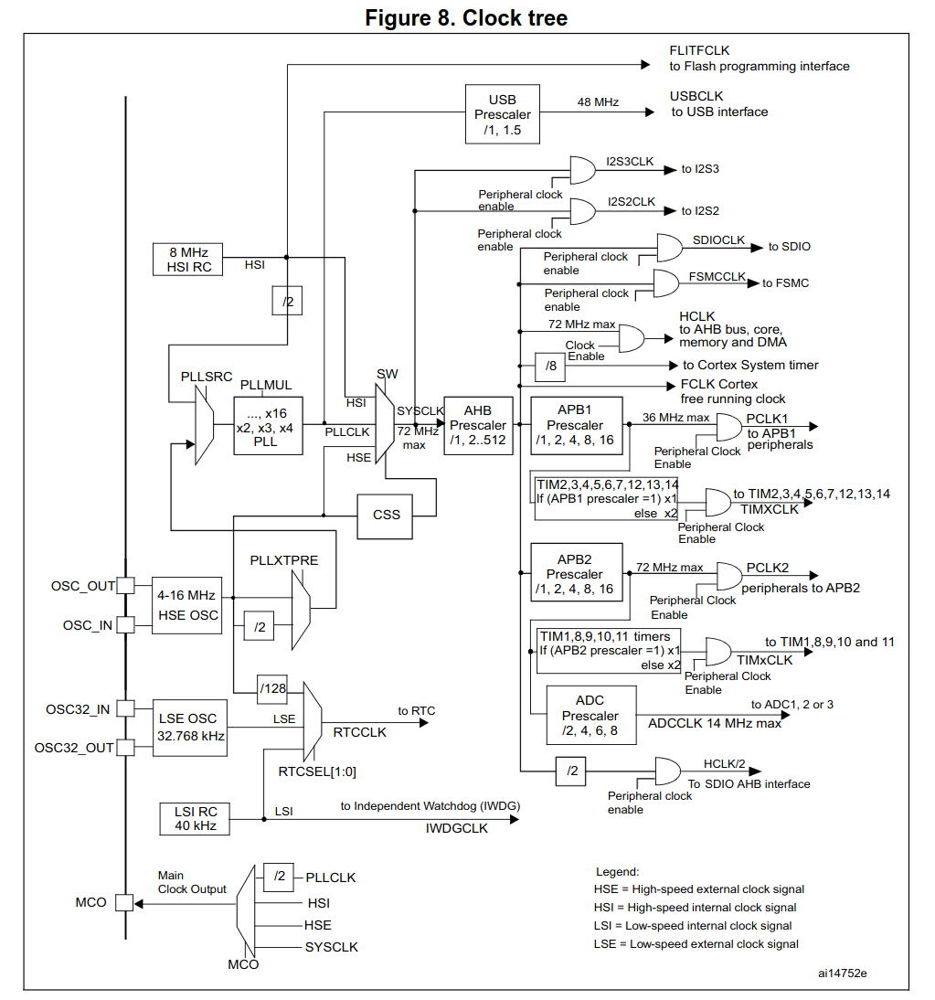

---

<a id="muc-05-02"></a>
## 5.2. Các loại Timer trên STM32F1

Khả năng Timer phụ thuộc part number/density. Ba nhóm cần nhận diện:

### Advanced-Control Timer

Tiêu biểu:

```text
TIM1
TIM8
```

Ngoài time-base và Capture/Compare/PWM, nhóm này có thêm các cơ chế như:

```text
complementary output
dead-time
break
main output enable
repetition counter
```

Các cơ chế nâng cao được tập trung tại **5.20**.

### General-Purpose Timer

Nhóm chính:

```text
TIM2
TIM3
TIM4
TIM5
```

Các Timer này thường hỗ trợ:

```text
up/down/center-aligned counting
Capture/Compare channels
Input Capture
Output Compare
PWM
One-Pulse
encoder interface
interrupt / DMA
timer synchronization
```

Một số STM32F1 còn có `TIM9...TIM14` với số channel/tính năng phụ thuộc từng Timer.

### Basic Timer

```text
TIM6
TIM7
```

Basic Timer tập trung vào time-base:

```text
prescaler
counter
auto-reload
update event
interrupt / DMA
trigger
```

và không có Capture/Compare channel như nhóm general-purpose.

### So sánh khái quát

| Nhóm | Time-base | Capture/Compare | PWM | Complementary output / Dead-time |
|---|---|---|---|---|
| TIM1/TIM8 | Có | Có | Có | Có |
| TIM2–TIM5 | Có | Có | Có | Không như Advanced-Control Timer |
| TIM6/TIM7 | Có | Không | Không | Không |

---

<a id="muc-05-03"></a>
## 5.3. Timer Clock

Quy tắc tạo `TIMxCLK` từ APB clock đã được trình bày tại **2.8. Clock của Timer**:

```text
APB prescaler = /1
→ TIMxCLK = PCLKx

APB prescaler ≠ /1
→ TIMxCLK = 2 × PCLKx
```

Vì vậy trước mọi phép tính Timer chỉ cần xác định:

```text
Timer nằm trên APB nào?
        ↓
PCLKx và APB prescaler là bao nhiêu?
        ↓
TIMxCLK bằng bao nhiêu?
```

Ví dụ theo cấu hình chuẩn của Chương 2:

```text
PCLK1 = 36 MHz
PPRE1 = /2

→ TIMxCLK của Timer trên APB1 = 72 MHz
```

Mục này chỉ xác định **clock đầu vào của Timer**. Việc `PSC` biến `TIMxCLK` thành `CK_CNT` được trình bày tại **5.5**.

---

<a id="muc-05-04"></a>
## 5.4. Counter: CNT

`TIMx_CNT` chứa giá trị counter hiện tại.

Với Upcounting:

```text
0 → 1 → 2 → ... → ARR → 0 → ...
```

Khi:

```text
TIMx_CR1.CEN = 1
```

counter bắt đầu chạy theo `CK_CNT`.

Ví dụ:

```c
uint16_t value = TIM2->CNT;
TIM2->CNT = 0;
```

`CNT` là giá trị trung tâm được:

```text
so sánh với CCRx
→ Output Compare / PWM

chụp vào CCRx
→ Input Capture
```

Hai cơ chế này được trình bày tại **5.11–5.12**.

---

<a id="muc-05-05"></a>
## 5.5. Prescaler: PSC

`TIMx_PSC` chia `TIMxCLK` để tạo counter clock:

```text
TIMxCLK
   ↓
  PSC
   ↓
CK_CNT
   ↓
  CNT
```

Công thức chuẩn:

```text
fCK_CNT = fTIMxCLK / (PSC + 1)
```

Do đó:

```text
PSC = 0
→ chia 1

PSC = 1
→ chia 2

...

PSC = 65535
→ chia 65536
```

Ví dụ:

```text
TIMxCLK = 72 MHz
PSC     = 71

→ fCK_CNT = 1 MHz
→ 1 timer tick = 1 µs
```

Giá trị prescaler được buffered và được nạp cho hoạt động đếm tại update event. Cơ chế update event được trình bày tại **5.8**.

---

<a id="muc-05-06"></a>
## 5.6. Auto-Reload Register: ARR

`TIMx_ARR` quy định giới hạn chu kỳ đếm.

Với Edge-Aligned Upcounting:

```text
CNT:
0 → 1 → ... → ARR → 0
```

Vì cả `0` và `ARR` đều thuộc chu kỳ:

```text
số timer tick / chu kỳ
= ARR + 1
```

Ví dụ:

```text
ARR = 999
→ CNT chạy 0 ... 999
→ 1000 timer ticks / chu kỳ
```

`ARR` có cơ chế preload khi `ARPE` được enable. Chi tiết transfer giữa preload và active/shadow value được tập trung tại **5.17**, nên không lặp lại ở đây.

---

<a id="muc-05-07"></a>
## 5.7. Up / Down / Center-Aligned Counting

General-Purpose và Advanced-Control Timer có thể hỗ trợ các counting mode sau.

### Upcounting

```text
0 → 1 → 2 → ... → ARR → 0
```

Trong Edge-Aligned mode:

```text
DIR = 0
```

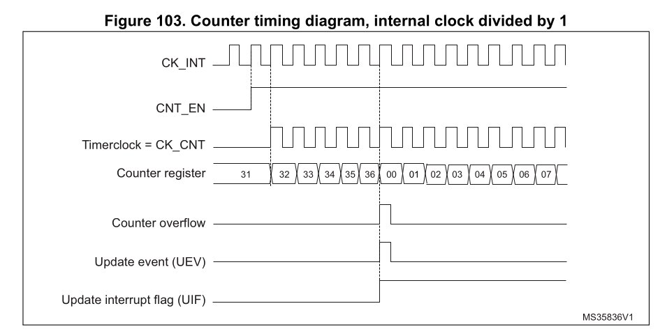

### Downcounting

```text
ARR → ARR-1 → ... → 1 → 0 → ARR
```

Trong Edge-Aligned mode:

```text
DIR = 1
```

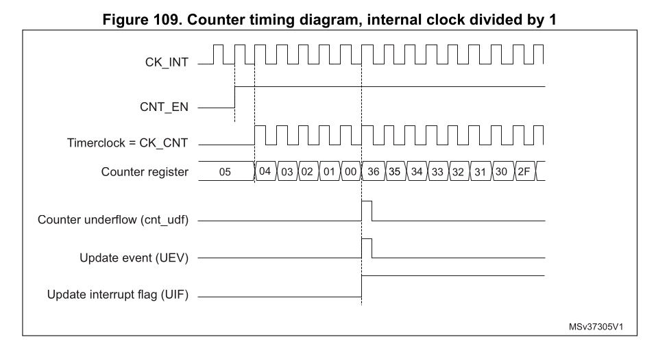

### Center-Aligned counting

```text
0 → 1 → ... → ARR-1 → ARR
                      ↓
0 ← 1 ← ... ← ARR-1
```

Khi:

```text
CMS != 00
```

Timer chạy theo Center-Aligned mode; direction được hardware cập nhật theo pha đếm hiện tại.

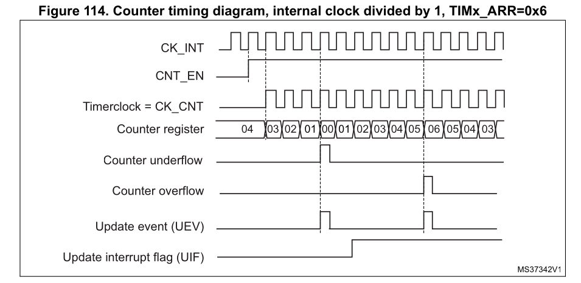

Điểm cần phân biệt:

```text
Edge-Aligned
→ một lượt đếm theo hướng đã chọn cho mỗi chu kỳ

Center-Aligned
→ counter đi lên rồi đi xuống trong một chu kỳ đầy đủ
```

Ảnh hưởng của counting mode tới công thức period/frequency được trình bày tại **5.9**.

---

<a id="muc-05-08"></a>
## 5.8. Update Event và Update Interrupt

`UEV`:

```text
Update Event
```

có thể phát sinh từ overflow/underflow, software update generation (`UG`) và các cơ chế khác tùy Timer/configuration.

Vai trò cốt lõi của update event:

```text
nạp/cập nhật prescaler
transfer các giá trị preload phù hợp
cập nhật update flag
có thể tạo interrupt hoặc DMA request theo cấu hình
```

Các bit/register cần nhận diện:

```text
TIMx_EGR.UG
→ yêu cầu tạo update event bằng software

TIMx_SR.UIF
→ Update Interrupt Flag

TIMx_DIER.UIE
→ Update Interrupt Enable
```

Luồng khái niệm:

```text
update condition
      ↓
UEV
      ↓
UIF / buffered transfer
      ↓
nếu interrupt được enable
      ↓
Timer IRQ
```

Cơ chế NVIC và phân biệt peripheral flag với NVIC Pending state đã được trình bày tại **Chương 4**, nên không lặp lại ở đây.

---

<a id="muc-05-09"></a>
## 5.9. Công thức tính Timer Period / Frequency

Mục này là nơi tham chiếu chính cho các công thức time-base.

### Edge-Aligned Upcounting

Từ **5.5**:

```text
fCK_CNT = fTIMxCLK / (PSC + 1)
```

Từ **5.6**:

```text
số timer tick / chu kỳ
= ARR + 1
```

Suy ra:

```text
fUPDATE = fTIMxCLK / ((PSC + 1) × (ARR + 1))
```

và:

```text
TUPDATE = ((PSC + 1) × (ARR + 1)) / fTIMxCLK
```

Ví dụ:

```text
TIMxCLK = 72 MHz
PSC     = 71
ARR     = 999
```

thì:

```text
fCK_CNT = 1 MHz
TUPDATE = 1 ms
fUPDATE = 1 kHz
```

### Center-Aligned

Với `ARR > 0`, một chu kỳ đầy đủ gồm lượt đếm lên và xuống:

```text
số timer tick / chu kỳ
= 2 × ARR
```

nên:

```text
fCENTER = fCK_CNT / (2 × ARR)
```

Không áp dụng nguyên xi công thức `(ARR + 1)` của Edge-Aligned Upcounting cho Center-Aligned mode.

Khi Timer tạo PWM Edge-Aligned, PWM frequency dùng cùng time-base này; quan hệ với duty cycle được trình bày tại **5.14**.

---

<a id="muc-05-10"></a>
## 5.10. Capture/Compare Channel

Capture/Compare channel dùng `TIMx_CCRx`, với vai trò phụ thuộc channel mode:

```text
Input Capture
→ CNT được chụp vào CCRx

Output Compare
→ CNT được so sánh với CCRx
```

Mô hình:

```text
Input Capture:
event input → capture CNT → CCRx
```

```text
Output Compare / PWM:
CNT ↔ CCRx → compare logic
```

General-Purpose Timer có thể có nhiều channel, thường ký hiệu:

```text
CH1
CH2
CH3
CH4
```

`CCRx` không nên được gọi mặc định là “duty register”, vì trong Input Capture nó chứa captured counter value, còn trong Output Compare/PWM nó giữ compare value.

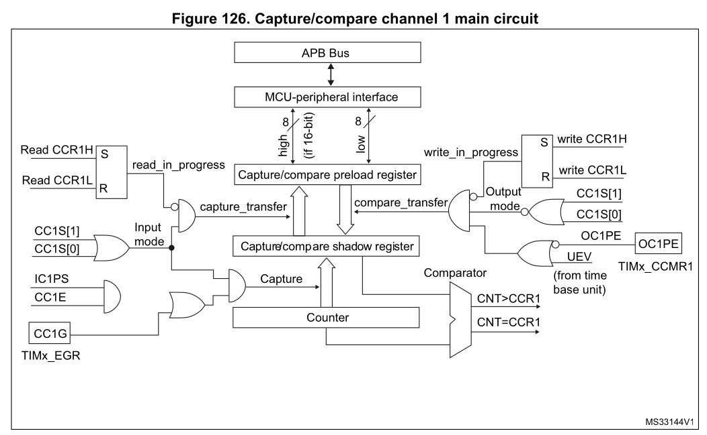

---

<a id="muc-05-11"></a>
## 5.11. Output Compare

Output Compare so sánh:

```text
CNT
với
CCRx
```

Khi điều kiện compare được thỏa, channel có thể tạo compare event và thực hiện hành vi do `OCxM` cấu hình, ví dụ:

```text
set output
clear output
toggle output
set Capture/Compare flag
generate interrupt / DMA request
```

Các register liên quan:

```text
TIMx_CCMR1 / TIMx_CCMR2
→ chọn channel mode / Output Compare mode

TIMx_CCER
→ channel output enable và polarity

TIMx_CCRx
→ compare value

TIMx_SR / TIMx_DIER
→ flag và interrupt/DMA enable
```

Ví dụ nếu channel ở toggle mode:

```text
CCR1 = 500
CNT đạt compare value
→ output có thể toggle
```

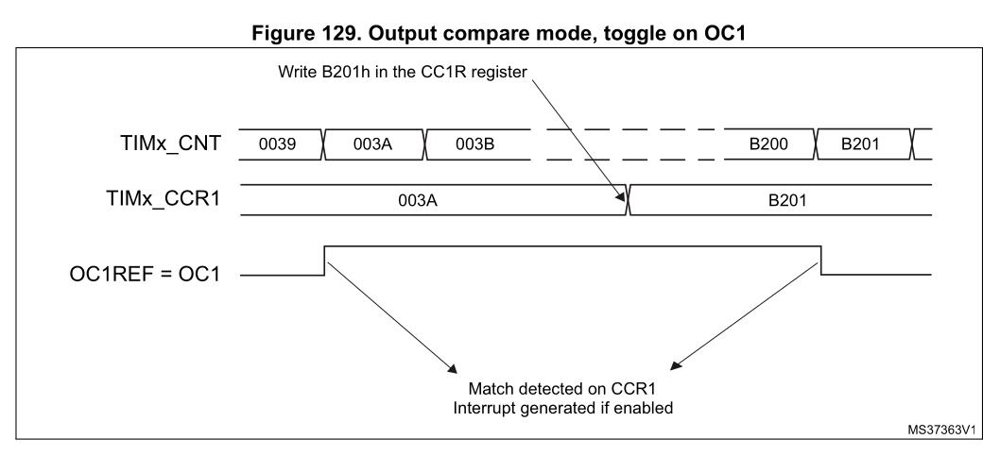

PWM là một trường hợp Output Compare có mode riêng, được trình bày từ **5.13** trở đi.

---

<a id="muc-05-12"></a>
## 5.12. Input Capture

Input Capture chụp giá trị `CNT` vào `CCRx` khi có input event phù hợp:

```text
external signal
      ↓
selected edge
      ↓
Timer input
      ↓
capture event
      ↓
CNT → CCRx
```

Ví dụ:

```text
CNT = 1250
Rising Edge xảy ra
→ CCR1 = 1250
```

Hai capture liên tiếp cho phép đo chênh lệch counter:

```text
capture 1 = 1000
capture 2 = 3000

ΔCNT = 2000 ticks
```

Nếu:

```text
fCK_CNT = 1 MHz
```

thì:

```text
1 tick = 1 µs
period = 2 ms
frequency = 500 Hz
```

Input Capture còn có thể cấu hình polarity, digital filter, input prescaler, interrupt hoặc DMA. Khi counter có thể overflow giữa hai capture, phép tính phải xử lý wrap/overflow phù hợp.

---

<a id="muc-05-13"></a>
## 5.13. PWM là gì?

`PWM`:

```text
Pulse Width Modulation
```

PWM là waveform tuần hoàn được mô tả chủ yếu bởi:

```text
frequency
duty cycle
```

Duty cycle:

```text
Duty = (Tactive / Tperiod) × 100%
```

Ví dụ:

```text
25% duty
→ active trong 1/4 chu kỳ

50% duty
→ active trong 1/2 chu kỳ
```

PWM trên STM32 Timer được tạo từ time-base (`PSC`, `ARR`) kết hợp compare logic (`CCRx`, PWM mode). Công thức cụ thể nằm tại **5.14**.

---

<a id="muc-05-14"></a>
## 5.14. PWM Frequency và Duty Cycle

Với Edge-Aligned Upcounting, PWM frequency dùng công thức time-base đã trình bày tại **5.9**:

```text
fPWM = fTIMxCLK / ((PSC + 1) × (ARR + 1))
```

Vai trò của các giá trị:

```text
PSC
→ xác định CK_CNT

ARR
→ xác định period

CCRx
→ xác định compare point
→ từ đó xác định active time theo PWM mode
```

### PWM Mode 1, Upcounting, active-high

Quan hệ `OCxREF`:

```text
CNT < CCRx
→ OCxREF active

CNT >= CCRx
→ OCxREF inactive
```

Khi output polarity không đảo:

```text
Duty = (CCRx / (ARR + 1)) × 100%
```

Ví dụ:

```text
ARR  = 999
CCR1 = 250

→ Duty = 25%
```

Edge cases cần nhận diện:

```text
CCRx = 0
→ 0% duty trong trường hợp trên

CCRx > ARR
→ OCxREF được giữ active trong PWM Mode 1 Upcounting
```

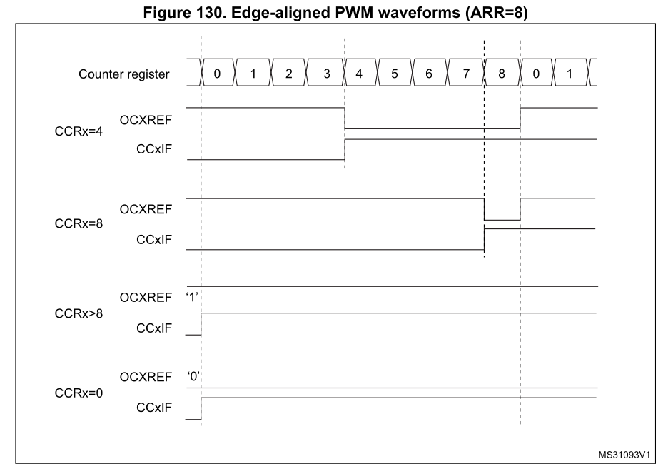

Waveform thực tế tại pin còn phụ thuộc output polarity, được trình bày tại **5.15**.

---

<a id="muc-05-15"></a>
## 5.15. PWM Mode 1 / PWM Mode 2

PWM mode được chọn bằng `OCxM` trong `TIMx_CCMRx`.

### PWM Mode 1

```text
OCxM = 110
```

Với Upcounting:

```text
CNT < CCRx
→ OCxREF active

CNT >= CCRx
→ OCxREF inactive
```

### PWM Mode 2

```text
OCxM = 111
```

PWM Mode 2 dùng quan hệ `OCxREF` ngược với PWM Mode 1 đối với cùng counting direction/compare condition.

### Output polarity

`CCxP` quyết định polarity của output channel.

Do đó phải tách hai lớp:

```text
PWM Mode
→ tạo OCxREF

Output Polarity
→ quyết định mức logic đưa ra output pin từ reference signal
```

Vì vậy duty theo trạng thái High ở pin không được suy ra chỉ từ `CCRx` nếu polarity đã bị đảo.

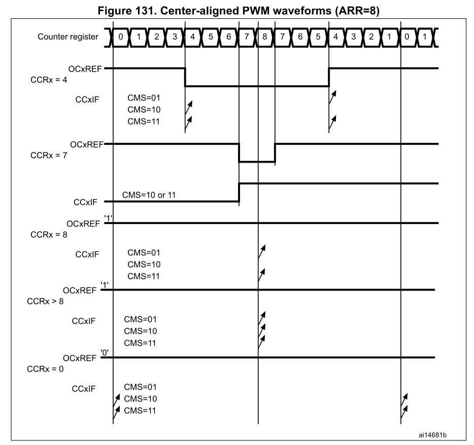

---

<a id="muc-05-16"></a>
## 5.16. CCRx và Compare Match

Vai trò tổng quát của `CCRx` đã được định nghĩa tại **5.10**. Trong Output Compare/PWM, `CCRx` giữ compare value.

```text
CNT
 ↓ compare
CCRx
```

Trong PWM Mode 1, Upcounting, active-high:

```text
ARR = 999

CCR = 100
→ 10%

CCR = 500
→ 50%

CCR = 900
→ 90%
```

Đây chỉ là áp dụng công thức duty tại **5.14**.

Có thể thay đổi compare value trong runtime:

```c
TIM2->CCR1 = new_value;
```

Nếu channel dùng `OCxPE`, giá trị mới được đưa qua preload và áp dụng theo update mechanism; chi tiết nằm tại **5.17**.

---

<a id="muc-05-17"></a>
## 5.17. Preload: ARPE / OCxPE

Preload cho phép software ghi giá trị mới mà không nhất thiết làm active value thay đổi ngay giữa chu kỳ.

### `ARPE`

```text
TIMx_CR1.ARPE
```

điều khiển preload của `ARR`.

Khi preload được sử dụng:

```text
software ghi ARR
      ↓
ARR preload
      ↓
Update Event
      ↓
active/shadow ARR được cập nhật
```

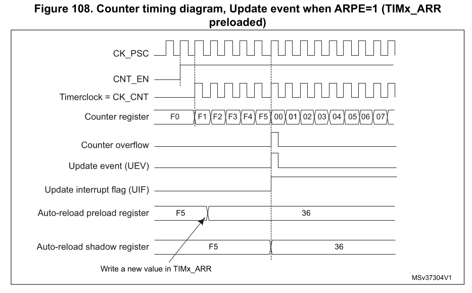

### `OCxPE`

`OCxPE` trong `TIMx_CCMRx` điều khiển preload của `CCRx` ở output mode phù hợp:

```text
software ghi CCRx
      ↓
CCRx preload
      ↓
Update Event
      ↓
active/shadow compare value được cập nhật
```

### Vì sao preload hữu ích?

Khi PWM đang chạy:

```text
ghi period/duty mới
      ↓
giữ trong preload
      ↓
áp dụng tại update boundary
```

giúp tránh thay đổi active compare/period value tại thời điểm không mong muốn trong chu kỳ hiện tại.

### `UG`

`TIMx_EGR.UG` tạo update generation bằng software. Khi khởi tạo Timer, nó thường được dùng sau khi ghi các giá trị buffered để đưa cấu hình vào trạng thái hoạt động trước khi enable counter.

Quan hệ tổng quát:

```text
ghi PSC / ARR / CCRx
        ↓
UG nếu cần nạp ngay cấu hình ban đầu
        ↓
enable counter
```

Chi tiết update event nằm tại **5.8**.

---

<a id="muc-05-18"></a>
## 5.18. GPIO Alternate Function cho PWM

Phần GPIO Alternate Function đã được trình bày tại **3.12** và bảng GPIO cho Timer tại **3.15**. Trong Chương 5 chỉ cần nhớ đường xuất PWM:

```text
Timer counter / compare logic
        ↓
OCxREF
        ↓
channel output control
        ↓
Timer channel
        ↓
GPIO Alternate Function Output
        ↓
physical pin
```

Trên STM32F1, PWM output thường dùng:

```text
Alternate Function Output Push-Pull
```

Pin cụ thể phụ thuộc:

```text
Timer
channel
default mapping / remap
part number / package
```

Ví dụ:

```text
TIM2_CH1
→ PA0 ở mapping phù hợp
→ GPIO Alternate Function Output Push-Pull
```

Chi tiết `MODE/CNF`, AFIO và remapping không lặp lại tại đây; xem **3.9, 3.12 và 3.13**.

---

<a id="muc-05-19"></a>
## 5.19. Timer Interrupt và DMA

Timer có thể tạo interrupt hoặc DMA request từ các event như:

```text
Update
Capture/Compare
Trigger
```

### Interrupt

Ví dụ update interrupt:

```text
UEV
 ↓
UIF
 ↓
UIE
 ↓
Timer IRQ
 ↓
NVIC
 ↓
ISR
```

Khái niệm `UIF/UIE` đã được nêu tại **5.8**; cơ chế NVIC, Pending state và thiết kế ISR thuộc **Chương 4**.

Capture/Compare channel cũng có các flag/enable tương ứng như:

```text
CC1IF / CC1IE
CC2IF / CC2IE
...
```

### DMA request

Timer event có thể tạo DMA request khi enable tương ứng:

```text
Timer event
    ↓
DMA request
    ↓
DMA controller
    ↓
data transfer
```

Ứng dụng điển hình:

```text
cập nhật chuỗi CCRx cho PWM
capture chuỗi timestamp
truyền dữ liệu theo Timer event
```

Chi tiết DMA controller được trình bày tại **Chương 9**.

---

<a id="muc-05-20"></a>
## 5.20. Advanced Timer: Complementary PWM / Dead-Time / Break

TIM1/TIM8 bổ sung các cơ chế dành cho điều khiển công suất.

### Complementary output

Một số channel có output chính và complementary output:

```text
CH1 / CH1N
CH2 / CH2N
CH3 / CH3N
```

Các output này có thể điều khiển hai nhánh công suất theo timing liên quan.

### Dead-time

Dead-time chèn khoảng không dẫn giữa hai chuyển trạng thái complementary để tránh hai transistor đối nghịch cùng dẫn:

```text
output A OFF
     ↓
 dead-time
     ↓
output B ON
```

Cấu hình nằm trong:

```text
TIMx_BDTR
```

### Break

Break là cơ chế bảo vệ phần cứng có thể tác động nhanh tới Timer output khi fault condition xuất hiện:

```text
fault / break source
        ↓
break logic
        ↓
output chuyển về trạng thái bảo vệ theo cấu hình
```

### Main Output Enable — `MOE`

Advanced-Control Timer có:

```text
TIMx_BDTR.MOE
```

`MOE` là điều kiện quan trọng để main/complementary output thực sự được đưa ra ở các mode liên quan. Vì vậy cấu hình channel PWM đúng chưa đủ nếu output stage của Advanced-Control Timer chưa được enable phù hợp.

### Repetition Counter — `RCR`

`TIMx_RCR` cho phép update mechanism xảy ra theo số chu kỳ lặp được cấu hình thay vì bắt buộc mỗi PWM period.

```text
PWM periods
   ↓
repetition count
   ↓
update event theo cấu hình
```

Các cơ chế này là đặc trưng nâng cao; time-base, `CCRx`, PWM mode và preload vẫn dùng các khái niệm đã trình bày ở các mục trước.

---

<a id="muc-05-21"></a>
## 5.21. Quy trình cấu hình Timer

Quy trình time-base tổng quát:

```text
1. Enable Timer peripheral clock
        ↓
2. Xác định TIMxCLK
        ↓
3. Chọn PSC
        ↓
4. Chọn ARR
        ↓
5. Ghi PSC / ARR và cấu hình counting mode
        ↓
6. Generate UG nếu cần nạp cấu hình buffered ban đầu
        ↓
7. Cấu hình interrupt/DMA nếu sử dụng
        ↓
8. CEN = 1
```

Dẫn chiếu:

```text
TIMxCLK
→ 2.8 và 5.3

PSC / CK_CNT
→ 5.5

ARR
→ 5.6

Counting mode
→ 5.7

Update event / UG
→ 5.8 và 5.17

Period / frequency
→ 5.9

Interrupt / DMA
→ 5.19
```

### Ví dụ time-base 1 ms với TIM2

Dùng cấu hình:

```text
TIM2CLK = 72 MHz
PSC     = 71
ARR     = 999
```

Theo công thức tại **5.9**:

```text
fCK_CNT = 1 MHz
TUPDATE = 1 ms
```

Cấu hình tối thiểu:

```c
RCC->APB1ENR |= RCC_APB1ENR_TIM2EN;

TIM2->PSC = 71;
TIM2->ARR = 999;

TIM2->EGR = TIM_EGR_UG;
TIM2->CR1 |= TIM_CR1_CEN;
```

Nếu cần update interrupt, bổ sung phần interrupt theo **5.19** và **Chương 4**.

---

<a id="muc-05-22"></a>
## 5.22. Quy trình cấu hình PWM

Quy trình tổng quát cho một PWM channel:

```text
1. Xác định Timer / channel / pin mapping
        ↓
2. Enable Timer và GPIO clock
   + AFIO nếu remap cần thiết
        ↓
3. Cấu hình GPIO Alternate Function Output
        ↓
4. Xác định TIMxCLK
        ↓
5. Chọn PSC / ARR theo PWM frequency
        ↓
6. Chọn CCRx theo duty cycle
        ↓
7. Chọn PWM Mode + output polarity
        ↓
8. Enable preload nếu cần
        ↓
9. Enable channel output
        ↓
10. Với Advanced-Control Timer:
    cấu hình output stage/MOE nếu cần
        ↓
11. Generate UG để nạp cấu hình ban đầu
        ↓
12. CEN = 1
```

Mục này chỉ tổng hợp thứ tự; các khái niệm đã nằm tại:

```text
GPIO / remap
→ Chương 3 và 5.18

TIMxCLK
→ 5.3

PSC / ARR / frequency
→ 5.5, 5.6, 5.9

PWM frequency / duty
→ 5.14

PWM Mode / polarity
→ 5.15

CCRx
→ 5.16

Preload / UG
→ 5.17

Advanced-Control Timer output
→ 5.20
```

### Ví dụ tham chiếu

Với:

```text
TIM2_CH1
TIM2CLK = 72 MHz
PWM frequency = 1 kHz
Duty = 25%
```

một bộ giá trị phù hợp là:

```text
PSC  = 71
ARR  = 999
CCR1 = 250
```

Phép tính chi tiết được thực hiện tại **5.23**, tránh lặp lại tại đây.

---

<a id="muc-05-23"></a>
## 5.23. Ví dụ tính PSC / ARR / CCR

Mục này áp dụng trực tiếp công thức của **5.9** và **5.14**.

### Ví dụ 1 — PWM 1 kHz, Duty 25%

Cho:

```text
TIM2CLK = 72 MHz
```

Chọn:

```text
PSC = 71
→ fCK_CNT = 1 MHz
```

Muốn:

```text
fPWM = 1 kHz
```

suy ra:

```text
ARR + 1
= 1 MHz / 1 kHz
= 1000

→ ARR = 999
```

Duty 25%:

```text
CCR1
= 0.25 × (ARR + 1)
= 250
```

Kết quả:

```text
PSC  = 71
ARR  = 999
CCR1 = 250
```

### Ví dụ 2 — PWM 20 kHz, Duty 60%

Cho:

```text
TIMxCLK = 72 MHz
PSC     = 0

→ fCK_CNT = 72 MHz
```

Muốn `20 kHz`:

```text
ARR + 1
= 72,000,000 / 20,000
= 3600

→ ARR = 3599
```

Duty 60%:

```text
CCR
= 0.60 × 3600
= 2160
```

Kết quả:

```text
PSC = 0
ARR = 3599
CCR = 2160
```

### Ví dụ 3 — Update period 10 ms

Cho:

```text
TIM2CLK = 72 MHz
PSC     = 71

→ fCK_CNT = 1 MHz
→ 1 tick = 1 µs
```

Muốn:

```text
TUPDATE = 10 ms
```

cần:

```text
ARR + 1 = 10000
→ ARR = 9999
```

### Ví dụ 4 — Đo frequency bằng Input Capture

Cho:

```text
fCK_CNT = 1 MHz
capture 1 = 1000
capture 2 = 5000
```

thì:

```text
ΔCNT = 4000 ticks
T    = 4 ms
f    = 250 Hz
```

Nếu counter wrap giữa hai capture, phép tính phải xử lý overflow/modulo tương ứng.

### Chọn PSC và ARR

Một output frequency có thể đạt được bằng nhiều cặp `PSC/ARR`.

```text
PSC nhỏ + ARR lớn
→ thường giữ nhiều counter step hơn

PSC lớn + ARR nhỏ
→ giảm số counter step trong một period
```

Khi chọn cần cân nhắc:

```text
register width
frequency/period yêu cầu
độ phân giải time-base
độ phân giải duty
dải thay đổi runtime
```

Với PWM và cùng period mục tiêu, giữ `ARR` đủ lớn thường cho nhiều mức `CCRx` khả dụng hơn để điều chỉnh duty.

---

<a id="muc-05-24"></a>
## 5.24. Câu hỏi tự kiểm tra

1. `TIMxCLK` và `CK_CNT` khác nhau như thế nào?
2. `PSC`, `CNT` và `ARR` có vai trò gì?
3. Khi APB prescaler khác `/1`, quy tắc xác định `TIMxCLK` là gì?
4. Hệ số chia thực tế của `PSC` được tính như thế nào?
5. Với Edge-Aligned Upcounting, vì sao một chu kỳ có `ARR + 1` timer tick?
6. Update event có những vai trò chính nào?
7. `UG`, `UIF` và `UIE` khác nhau như thế nào?
8. Công thức `fUPDATE` trong Edge-Aligned Upcounting là gì?
9. Center-Aligned khác Edge-Aligned ở đường đi của counter như thế nào?
10. `CCRx` có vai trò gì trong Input Capture và Output Compare?
11. Compare match là gì?
12. Input Capture dùng `CNT` và `CCRx` theo hướng nào?
13. Output Compare dùng `CNT` và `CCRx` theo hướng nào?
14. PWM frequency phụ thuộc `PSC/ARR` như thế nào?
15. Duty cycle trong PWM Mode 1 Upcounting active-high phụ thuộc `CCRx` như thế nào?
16. `OCxREF` và output polarity là hai lớp khác nhau như thế nào?
17. `ARPE` và `OCxPE` dùng để làm gì?
18. Vì sao preload hữu ích khi thay period/duty trong runtime?
19. `MOE` có ý nghĩa gì trên Advanced-Control Timer?
20. Hãy mô tả luồng `TIMxCLK → PSC → CK_CNT → CNT → ARR/CCRx → channel output → GPIO`.

---

## 5.25. Tóm tắt

Time-base:

```text
TIMxCLK
   ↓
  PSC
   ↓
CK_CNT
   ↓
  CNT
   ↓
  ARR
   ↓
Update Event
```

Công thức Edge-Aligned Upcounting:

```text
fCK_CNT
= fTIMxCLK / (PSC + 1)

fUPDATE
= fTIMxCLK / [(PSC + 1)(ARR + 1)]
```

Capture/Compare:

```text
Input Capture
→ event input → CNT → CCRx

Output Compare / PWM
→ CNT so sánh với CCRx
```

PWM:

```text
PSC / ARR
→ frequency

CCRx + PWM mode
→ compare point / active time

OCxREF + polarity
→ output waveform
```

Preload:

```text
software ghi giá trị mới
        ↓
preload
        ↓
Update Event
        ↓
active/shadow value
```

> **Khi làm việc với Timer, trước hết xác định đúng `TIMxCLK`, sau đó dùng `PSC` để tạo `CK_CNT`, `ARR` để xác định chu kỳ và `CCRx` theo channel mode. Các phần GPIO, NVIC và DMA chỉ là các khối liên kết bên ngoài Timer và được dẫn chiếu về chương tương ứng thay vì lặp lại cơ chế.**

[↑ Về mục lục](#muc-luc)


---

<a id="chuong-06"></a>
# 6. UART / USART

STM32F1 có các peripheral `USART` và, trên một số part number, `UART`. Chương này tập trung vào **truyền nối tiếp bất đồng bộ**; các mode synchronous/half-duplex chỉ được tóm tắt tại **6.18**.

Mỗi khái niệm được giải thích đầy đủ tại một mục chính. Các mục Polling, Interrupt, DMA, quy trình cấu hình và ví dụ chỉ áp dụng lại các cơ chế đã nêu, tránh lặp lại định nghĩa của frame, flag, GPIO, NVIC hoặc DMA.

## Quy ước thuật ngữ

| Thuật ngữ dùng trong chương | Cách hiểu |
|---|---|
| **UART** | Universal Asynchronous Receiver/Transmitter; khối/giao tiếp truyền nối tiếp bất đồng bộ. |
| **USART** | Universal Synchronous/Asynchronous Receiver/Transmitter; hỗ trợ cả asynchronous mode và synchronous mode. |
| **asynchronous mode** | Mode không dùng đường `CK` để đồng bộ từng bit; hai phía phải thống nhất baud rate và frame format. |
| **synchronous mode** | Mode của USART có thêm clock `CK`; được trình bày tại **6.18**. |
| **transmitter / receiver** | Khối phát / khối thu của peripheral. |
| **TX / RX** | Tín hiệu transmit output / receive input trong asynchronous mode. |
| **frame** | Chuỗi bit trên đường truyền gồm Start bit, data word, parity nếu enable và Stop bit. |
| **data word** | Các bit dữ liệu của một frame; số data bit thực tế phụ thuộc `M` và việc parity có được enable hay không. |
| **baud rate** | Symbol rate của đường truyền. Với UART nhị phân NRZ thông thường, một symbol mang một bit nên giá trị baud numerically bằng bit/s. |
| **`fCK`** | Peripheral clock dùng bởi baud-rate generator: `PCLK2` cho USART1, `PCLK1` cho USART2/USART3/UART4/UART5 trong phạm vi part có các peripheral đó. |
| **`USARTDIV`** | Hệ số chia dạng fixed-point dùng để tạo baud rate. |
| **`USART_DR`** | Data Register được software/DMA ghi khi transmit và đọc khi receive. |
| **TDR / RDR** | Transmit Data Register / Receive Data Register trong data path nội bộ, được truy cập qua `USART_DR`. |
| **Transmit Shift Register** | Shift register đưa frame ra chân TX. |
| **Receive Shift Register** | Shift register lấy mẫu RX và khôi phục frame nhận. |
| **`TXE`** | Transmit Data Register Empty; có thể nạp data word tiếp theo. |
| **`TC`** | Transmission Complete; frame cuối đã truyền hoàn tất. |
| **`RXNE`** | Read Data Register Not Empty; data nhận đã sẵn sàng trong `USART_DR`. |
| **`IDLE`** | Idle Line detected; receiver phát hiện đường RX trở lại trạng thái idle theo cơ chế USART. |
| **receive error flags** | `ORE`, `FE`, `NE`, `PE`: Overrun, Framing, Noise, Parity error. |
| **oversampling 16x** | Cơ chế receiver trong asynchronous mode dùng 16 vị trí sample clock cho mỗi bit time để phục hồi dữ liệu và phân biệt tín hiệu hợp lệ với noise. Trong USART của STM32F1 theo RM0008 không có cấu hình `OVER8`; không dùng khái niệm oversampling 8x cho phạm vi chương này. |
| **hardware flow control** | Cơ chế `CTS/RTS` điều phối việc truyền/nhận bằng tín hiệu phần cứng. |

Trong chương này, **UART communication** dùng để chỉ giao tiếp bất đồng bộ nói chung; khi nói về register/peripheral cụ thể của STM32F1, dùng đúng tên instance như `USART1`, `USART2`, `UART4` và tên register `USARTx_*`.

---

<a id="muc-06-01"></a>
## 6.1. UART và USART là gì?

`UART`:

```text
Universal Asynchronous Receiver/Transmitter
```

`USART`:

```text
Universal Synchronous/Asynchronous Receiver/Transmitter
```

Quan hệ:

```text
USART
├── Asynchronous mode
│   └── hoạt động theo cơ chế UART
│
└── Synchronous mode
    └── có thêm clock CK
```

Vì vậy, khi `USART1/2/3` của STM32F1 chạy ở asynchronous mode với `TX/RX`, cách truyền nhận tương ứng với UART communication.

Một số STM32F1 còn có peripheral `UART4/UART5`; các instance này chỉ hỗ trợ asynchronous communication, không có synchronous clock output như USART.

Các mode/tính năng cần nhận diện:

```text
Asynchronous Full-Duplex
Single-Wire Half-Duplex
Synchronous mode
LIN
Smartcard
IrDA
Multiprocessor communication
CTS / RTS
DMA
```

Phần chính của chương tập trung vào:

```text
Asynchronous mode
+
Full-Duplex
+
TX / RX
```

Half-Duplex và Synchronous mode được tách sang **6.18**.

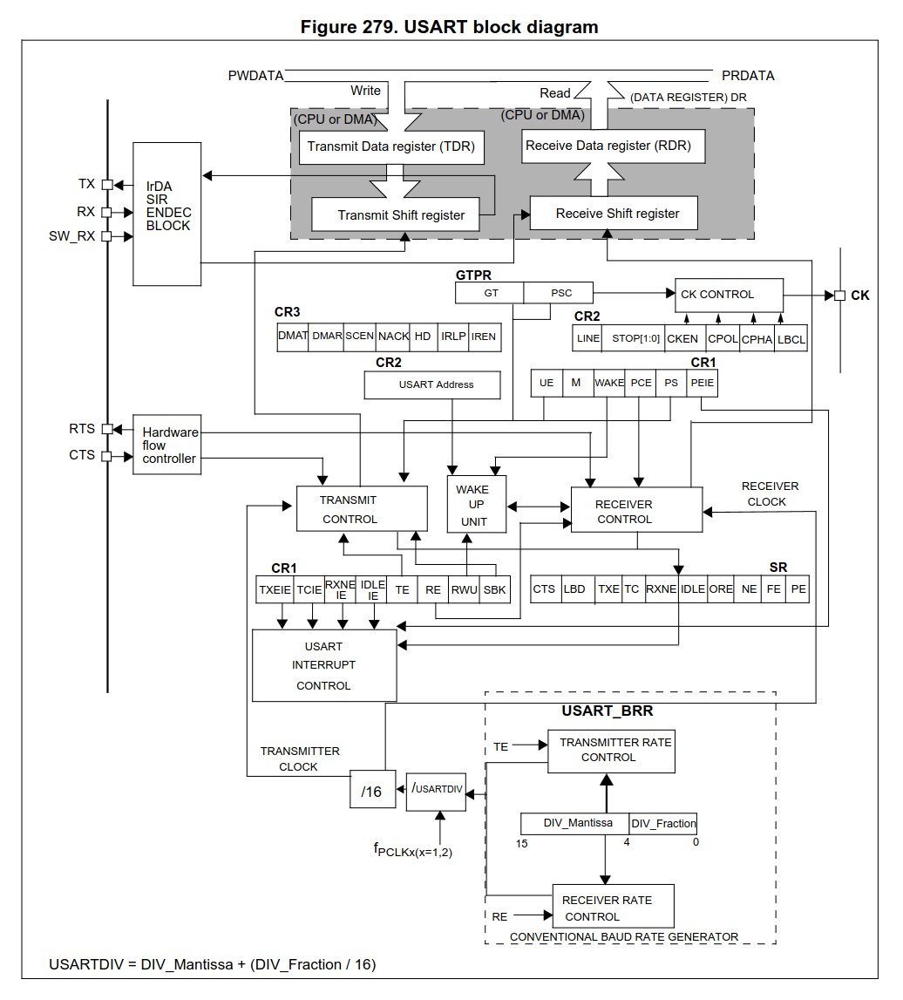

---

<a id="muc-06-02"></a>
## 6.2. Truyền nối tiếp bất đồng bộ

Trong truyền nối tiếp, các bit được truyền lần lượt theo thời gian trên đường tín hiệu.

```text
D0 → D1 → D2 → ... → Dn
```

`Asynchronous` ở đây có nghĩa là hai thiết bị **không dùng một đường clock `CK` chung để đánh dấu từng bit**.

Receiver đồng bộ với một frame nhờ Start bit và lấy mẫu dữ liệu theo baud rate đã cấu hình.

Hai phía phải thống nhất:

```text
baud rate
data word length
parity
stop bits
```

Chi tiết frame format nằm tại **6.3–6.4**; cách tạo baud rate nằm tại **6.5–6.6**.

### Full-Duplex

Trong asynchronous Full-Duplex:

```text
TX
→ transmit

RX
→ receive

TX và RX
→ có thể hoạt động đồng thời
```

Đường nối vật lý `TX ↔ RX` và GPIO configuration được trình bày tại **6.7**, nên không lặp lại ở đây.

> **Asynchronous không có nghĩa peripheral không cần clock nội bộ.** USART vẫn cần `fCK` để chạy baud-rate generator và logic transmit/receive; chỉ không có đường `CK` dùng để đồng bộ từng bit giữa hai thiết bị.

---

<a id="muc-06-03"></a>
## 6.3. UART Frame: Start / Data / Parity / Stop

Một asynchronous frame có cấu trúc:

```text
Idle
 ↓
Start bit
 ↓
Data word
 ↓
Parity nếu enable
 ↓
Stop bit
```

USART truyền data theo thứ tự:

```text
LSB first
```

### Idle và Start bit

```text
Idle
→ logic 1

Start bit
→ logic 0
```

Start bit báo cho receiver biết một frame mới bắt đầu.

### Word length — `M`

`USART_CR1.M` chọn word length:

```text
M = 0
→ 8-bit word

M = 1
→ 9-bit word
```

Khi parity **không** được enable, toàn bộ word là data.

Khi parity **được** enable, parity chiếm vị trí MSB của word:

```text
M = 0 + parity
→ 7 data bits + 1 parity bit

M = 1 + parity
→ 8 data bits + 1 parity bit
```

Vì vậy phải phân biệt:

```text
word length
≠
số payload data bits khi parity được enable
```

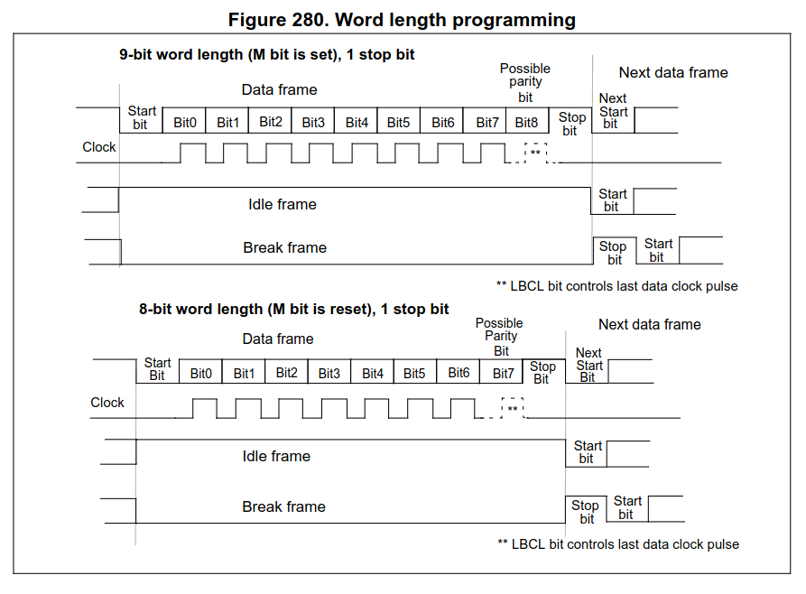

### Parity — `PCE / PS`

```text
PCE = 0
→ parity disabled

PCE = 1
→ parity enabled
```

Khi parity enabled:

```text
PS = 0
→ Even parity

PS = 1
→ Odd parity
```

**Parity bit** là bit kiểm tra chẵn/lẻ được phần cứng USART tự động tính toán khi transmit và kiểm tra lại khi receive. Cơ chế này dựa trên **số lượng bit `1` trong data bits kết hợp với parity bit**.

Với **Even parity**:

```text
tổng số bit 1 trong:
data bits + parity bit
→ phải là số chẵn
```

Ví dụ:

```text
data = 01000001
→ có 2 bit 1

Even parity
→ parity bit = 0

tổng số bit 1
→ vẫn là 2
→ chẵn
```

Với **Odd parity**:

```text
tổng số bit 1 trong:
data bits + parity bit
→ phải là số lẻ
```

Với cùng dữ liệu:

```text
data = 01000001
→ có 2 bit 1

Odd parity
→ parity bit = 1

tổng số bit 1
→ thành 3
→ lẻ
```

Ở phía receiver:

```text
nhận data bits + parity bit
        ↓
hardware kiểm tra tính chẵn/lẻ
        ↓
đúng với PS?
   ├── có    → parity hợp lệ
   └── không → PE = 1
```

Parity có khả năng phát hiện mọi lỗi làm **lật một số lẻ bit** trong phần được kiểm tra, nhưng có thể không phát hiện lỗi khi **một số chẵn bit** cùng bị lật. Vì vậy parity chỉ là cơ chế phát hiện lỗi đơn giản; nếu protocol cần khả năng kiểm tra lỗi mạnh hơn, tầng dữ liệu/application thường dùng thêm checksum hoặc CRC.

Receiver kiểm tra parity và báo lỗi qua `PE` nếu giá trị nhận không hợp lệ; error flags được trình bày tại **6.11**.

### Stop bit — `STOP`

`USART_CR2.STOP`:

```text
00 → 1 Stop Bit
01 → 0.5 Stop Bit
10 → 2 Stop Bits
11 → 1.5 Stop Bits
```

Trong UART communication thông thường, `1 Stop Bit` và `2 Stop Bits` là các cấu hình phổ biến; các giá trị fractional stop bit chủ yếu liên quan tới các mode đặc biệt.

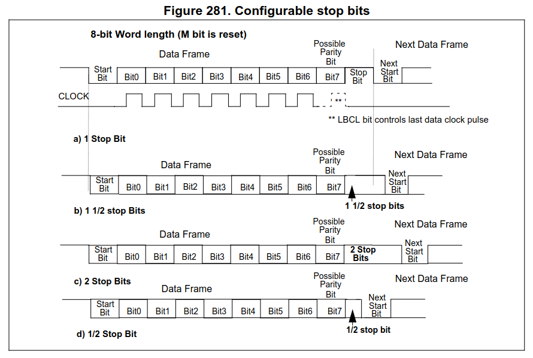

Mục này là nơi tham chiếu chính cho cấu trúc frame và quan hệ `M/PCE/PS/STOP`.

---

<a id="muc-06-04"></a>
## 6.4. 8N1 và các cấu hình Frame

Ký hiệu:

```text
8N1
│││
││└── 1 Stop Bit
│└─── No Parity
└──── 8 Data Bits
```

Với STM32F1:

```text
8N1
→ M = 0
→ PCE = 0
→ STOP = 00
```

Frame có:

```text
1 Start
+
8 Data
+
1 Stop
=
10 bit / frame
```

Ở:

```text
115200 bit/s
```

nếu các frame được truyền liên tục:

```text
payload throughput lý tưởng
≈ 115200 / 10
≈ 11520 byte/s
```

### Ví dụ có parity

Quan hệ giữa `M` và parity đã được định nghĩa tại **6.3**. Áp dụng:

```text
8E1
→ M = 1
→ PCE = 1
→ PS = 0
→ STOP = 00
```

```text
8O1
→ M = 1
→ PCE = 1
→ PS = 1
→ STOP = 00
```

Do parity chiếm một bit trong configured word length, không được cấu hình `M = 0`, `PCE = 1` rồi gọi đó là `8E1`; trường hợp đó chỉ còn 7 data bits.

---

<a id="muc-06-05"></a>
## 6.5. Baud Rate

`Baud rate` là symbol rate của đường truyền.

Với UART nhị phân NRZ thông thường:

```text
1 symbol
→ 1 bit
```

nên về giá trị số:

```text
baud rate
=
bit rate
```

Các baud rate thường gặp:

```text
9600
19200
57600
115200
230400
...
```

Hai thiết bị phải dùng baud rate đủ gần nhau để receiver lấy mẫu các bit đúng thời điểm.

Trên STM32F1:

```text
fCK
 ↓
baud-rate generator
 ↓
transmitter / receiver timing
```

Transmitter và receiver của cùng một USART dùng cùng baud-rate generator.

Mục này chỉ định nghĩa **baud rate**; nguồn `fCK`, công thức `USARTDIV` và `USART_BRR` được trình bày tại **6.6**.

---

<a id="muc-06-06"></a>
## 6.6. USART Clock và USART_BRR

Nguồn peripheral clock đã được trình bày ở **2.9. Clock của các Peripheral quan trọng**. Với USART/UART của STM32F1:

```text
USART1
→ fCK = PCLK2

USART2
USART3
UART4
UART5
→ fCK = PCLK1
```

Peripheral cụ thể có tồn tại hay không phụ thuộc part number.

### Công thức baud rate

Trong asynchronous mode thông thường:

```text
Baud = fCK / (16 × USARTDIV)
```

với:

```text
USARTDIV
=
DIV_Mantissa
+
DIV_Fraction / 16
```

`USART_BRR` mã hóa:

```text
BRR[15:4]
→ DIV_Mantissa

BRR[3:0]
→ DIV_Fraction
```

### Ví dụ USART1 — 115200 baud

Cho:

```text
PCLK2 = 72 MHz
Baud  = 115200
```

suy ra:

```text
USARTDIV
=
72,000,000 / (16 × 115200)
=
39.0625
```

Do đó:

```text
DIV_Mantissa = 39
DIV_Fraction = 1
```

và:

```text
USART_BRR = 0x271
```

### Ví dụ USART2 — 115200 baud

Cho:

```text
PCLK1 = 36 MHz
Baud  = 115200
```

suy ra:

```text
USARTDIV
=
36,000,000 / (16 × 115200)
=
19.53125
```

Fractional part:

```text
0.53125 × 16
= 8.5
```

sau khi làm tròn phù hợp:

```text
DIV_Fraction ≈ 9
```

Giá trị baud thực tế có một sai số nhỏ so với baud mục tiêu.

Điểm cần nhớ:

```text
cùng USART_BRR
+
fCK khác nhau
→ baud rate khác nhau
```

Vì vậy không copy `USART_BRR` giữa USART1 và USART2 nếu chưa xác định lại `PCLK2/PCLK1`.

---

<a id="muc-06-07"></a>
## 6.7. TX / RX và GPIO

GPIO mode, Alternate Function và remapping đã được trình bày tại **Chương 3**. Đối với UART communication trên STM32F1, bảng tra nhanh là:

| Tín hiệu | GPIO configuration thường dùng |
|---|---|
| `TX` | Alternate Function Output Push-Pull |
| `RX` | Floating Input hoặc Input with Pull-Up |

Ví dụ default mapping của USART1:

```text
PA9
→ USART1_TX

PA10
→ USART1_RX
```

Một remap của USART1:

```text
PB6
→ USART1_TX

PB7
→ USART1_RX
```

Cơ chế AFIO/remap không lặp lại tại đây; xem **3.13**.

### Nối hai thiết bị

Trong kết nối UART Full-Duplex thông thường:

```text
Device A TX → Device B RX
Device A RX ← Device B TX
GND A       ↔ GND B
```

Tức là TX của một phía nối với RX của phía còn lại.

Pin mapping cụ thể luôn phải kiểm tra theo đúng part number/package.

---

<a id="muc-06-08"></a>
## 6.8. USART_DR và cơ chế truyền dữ liệu

`USART_DR` là data register mà software hoặc DMA dùng để trao đổi dữ liệu với USART.

Có thể nhìn data path theo hai hướng.

### Transmit path

```text
CPU / DMA
    ↓ write USART_DR
   TDR
    ↓
Transmit Shift Register
    ↓
   TX
```

Software ghi data word vào `USART_DR`; peripheral chuyển nó qua transmit data path rồi shift từng bit ra TX theo frame format đã cấu hình tại **6.3**.

### Receive path

```text
RX
 ↓
Receive Shift Register
 ↓
RDR
 ↓ read USART_DR
CPU / DMA
```

Receiver lấy mẫu RX, khôi phục frame và chuyển data nhận được vào receive data path để software/DMA đọc qua `USART_DR`.

Điểm cần nhớ:

```text
write USART_DR
→ transmit path

read USART_DR
→ receive path
```

Các trạng thái "có thể ghi tiếp" và "có data để đọc" được báo bằng `TXE` và `RXNE`, trình bày tại **6.9–6.10**.

---

<a id="muc-06-09"></a>
## 6.9. TXE và TC

Hai transmit flag cần phân biệt:

```text
USART_SR.TXE
→ Transmit Data Register Empty

USART_SR.TC
→ Transmission Complete
```

### `TXE`

`TXE = 1` khi transmit data register đã trống và có thể nhận data word tiếp theo.

Luồng:

```text
write USART_DR
      ↓
TDR có data
      ↓
data chuyển sang Transmit Shift Register
      ↓
TXE = 1
      ↓
có thể ghi data tiếp theo
```

`TXE` dùng để **feed** liên tục dữ liệu vào transmitter.

### `TC`

`TC = 1` khi transmission của frame cuối đã hoàn tất và transmit data register cũng trống.

Có thể nhớ:

```text
TXE
→ có thể nạp data tiếp

TC
→ frame cuối đã đi hết khỏi transmitter
```

Do đó:

```text
nhiều data word liên tiếp
→ dùng TXE để nạp tiếp

sau data word cuối
→ dùng TC khi cần xác nhận toàn bộ transmission đã hoàn tất
```

Nếu sắp disable USART hoặc thực hiện thao tác có thể làm dừng transmitter, chờ `TC = 1` khi cần bảo đảm frame cuối đã truyền xong.

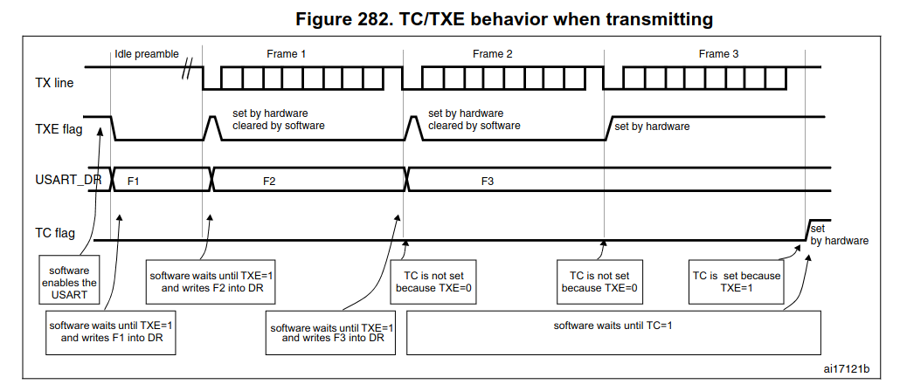

Interrupt enable tương ứng `TXEIE/TCIE` được trình bày tại **6.12**.

---

<a id="muc-06-10"></a>
## 6.10. RXNE và quá trình nhận dữ liệu

`USART_SR.RXNE`:

```text
Read Data Register Not Empty
```

Luồng:

```text
RX
 ↓
Receive Shift Register
 ↓
data chuyển vào RDR
 ↓
RXNE = 1
```

Ý nghĩa:

```text
RXNE = 1
→ data nhận đã sẵn sàng để đọc qua USART_DR
```

Trong reception thông thường:

```text
read USART_DR
→ RXNE được clear
```

Ví dụ polling:

```c
while (!(USART1->SR & USART_SR_RXNE))
{
}

uint8_t data = (uint8_t)USART1->DR;
```

Nếu data cũ chưa được lấy khỏi receive data register mà frame mới cần chuyển vào, có thể xảy ra `ORE`. Cơ chế Overrun Error được trình bày tại **6.11**.

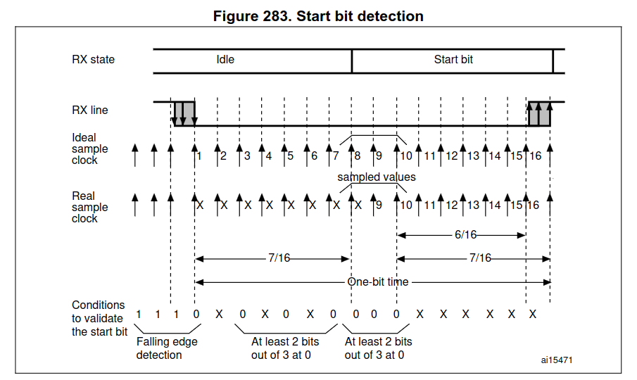

### Oversampling 16x và cách receiver lấy mẫu

Trong **asynchronous mode**, USART của STM32F1 dùng **oversampling 16x** để phục hồi dữ liệu nhận và phân biệt tín hiệu hợp lệ với noise.

Có thể hình dung:

```text
1 bit time
→ 16 vị trí sample clock
```

Điều này **không có nghĩa cả 16 vị trí đều được dùng như 16 phiếu ngang nhau để quyết định giá trị bit**. Các vị trí này tạo lưới thời gian nội bộ; receiver dùng những sample được chọn quanh vùng giữa bit để xác nhận Start bit hoặc quyết định data bit.

Trong phạm vi STM32F1 của RM0008:

```text
Asynchronous USART
→ oversampling 16x

không có OVER8
→ không có lựa chọn oversampling 8x
```

Một số dòng STM32 khác có thể hỗ trợ oversampling 8x, nhưng không áp dụng kiến thức đó cho USART STM32F1 trong chương này.

#### Đồng bộ từ Start bit

Khi RX đang Idle:

```text
RX = 1
```

một cạnh xuống:

```text
1 → 0
```

khởi động quá trình **Start-bit detection**.

```text
RX đang Idle = 1
      ↓
phát hiện falling edge
      ↓
bắt đầu kiểm tra Start bit
```

Receiver không chỉ thấy một cạnh xuống rồi lập tức coi đó là Start bit hợp lệ. STM32F1 kiểm tra hai nhóm sample:

```text
nhóm 1
→ sample 3, 5, 7

nhóm 2
→ sample 8, 9, 10
```

Điều kiện:

```text
cả 3 sample của mỗi nhóm đều = 0
→ Start bit được xác nhận sạch

mỗi nhóm có ít nhất 2/3 sample = 0
nhưng có sample không khớp
→ Start bit vẫn được chấp nhận
→ NE = 1 báo Noise Error

một nhóm có ít hơn 2/3 sample = 0
→ hủy Start-bit detection
→ receiver trở lại Idle
→ chờ falling edge tiếp theo
```

Vì vậy, cạnh xuống của Start bit đóng vai trò **mốc bắt đầu đồng bộ một frame**, còn việc xác nhận Start bit được thực hiện bằng nhiều sample sau đó.

#### Lấy mẫu data bit

Đối với một data bit, STM32F1 dùng ba sample gần giữa bit:

```text
sample 8
sample 9
sample 10
```

Ba sample này được xử lý theo **quyết định theo đa số mẫu**:

```text
ít nhất 2/3 sample = 0
→ nhận bit = 0

ít nhất 2/3 sample = 1
→ nhận bit = 1
```

Bảng quyết định:

| Ba sample | Bit nhận | `NE` |
|---|---:|---:|
| `000` | `0` | `0` |
| `001` | `0` | `1` |
| `010` | `0` | `1` |
| `011` | `1` | `1` |
| `100` | `0` | `1` |
| `101` | `1` | `1` |
| `110` | `1` | `1` |
| `111` | `1` | `0` |

Có thể nhớ:

```text
000 hoặc 111
→ ba sample đồng nhất
→ data hợp lệ theo phép lấy mẫu
→ NE = 0

các tổ hợp còn lại
→ vẫn quyết định bit theo đa số mẫu
→ NE = 1
```

`NE` và Figure 284 được trình bày tại **6.11. Error Flags**.

#### Quan hệ với baud rate

Sau khi Start bit được xác nhận, receiver dùng baud-rate timing nội bộ để tiếp tục xác định các vị trí lấy mẫu của các bit còn lại trong frame.

```text
falling edge của Start bit
        ↓
xác nhận Start bit
        ↓
baud-rate timing nội bộ
        ↓
sample D0, D1, D2, ...
        ↓
Parity nếu có
        ↓
Stop bit
```

UART asynchronous không có đường clock chung giữa transmitter và receiver, nhưng baud rate hai phía vẫn phải đủ gần nhau. Nếu tổng sai lệch clock/baud vượt khả năng chịu sai lệch của receiver, các điểm lấy mẫu có thể trôi khỏi vùng ổn định của bit và dẫn tới nhận sai dữ liệu hoặc framing error.

> **Điểm cần nhớ:** trên STM32F1, oversampling 16x tạo lưới timing cho receiver; Start bit được xác nhận bằng các nhóm sample `3,5,7` và `8,9,10`, còn data bit được quyết định từ các sample `8,9,10` theo **đa số mẫu**.


---

<a id="muc-06-11"></a>
## 6.11. Error Flags: ORE / FE / NE / PE

Các receive error flag quan trọng trong `USART_SR`:

| Flag | Tên | Ý nghĩa |
|---|---|---|
| `ORE` | Overrun Error | Data mới tới khi receive data register chưa được giải phóng kịp |
| `FE` | Framing Error | Stop bit không được nhận ở trạng thái hợp lệ |
| `NE` | Noise Error | Receiver phát hiện nhiễu trong quá trình lấy mẫu |
| `PE` | Parity Error | Parity nhận được không khớp với parity tính toán |

### `ORE` — Overrun Error

Quan hệ:

```text
RXNE = 1
+
data cũ chưa được đọc
+
frame mới hoàn tất
→ ORE
```

Khi đó ít nhất một data word không thể được nhận đúng vào receive data register.

### `FE` — Framing Error

`FE` thường liên quan tới:

```text
Stop bit không hợp lệ
baud mismatch
noise
Break condition
```

### `NE` — Noise Error

`NE` báo receiver phát hiện các sample không nhất quán do noise trong quá trình khôi phục bit.

Data vẫn có thể xuất hiện trong data register, nhưng software phải coi frame tương ứng là có lỗi.

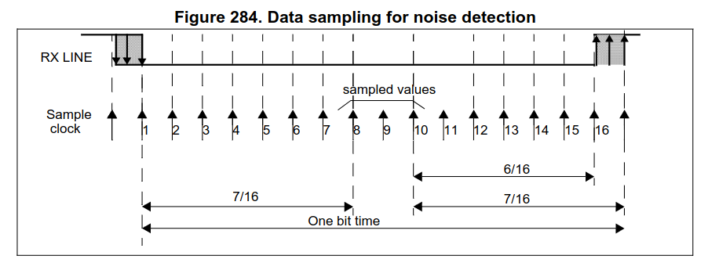

### `PE` — Parity Error

`PE` chỉ có ý nghĩa khi parity được enable.

```text
parity nhận
≠
parity tính toán
→ PE = 1
```

### Clear receive error flags

Đối với các receive error flag này, trình tự software quan trọng là:

```text
read USART_SR
      ↓
read USART_DR
```

Không xử lý chúng như các bit read/write độc lập thông thường.

Mục này là nơi tham chiếu chính cho `ORE/FE/NE/PE`; các phần Interrupt và ví dụ chỉ dẫn chiếu lại.

---

<a id="muc-06-12"></a>
## 6.12. USART Interrupt

Cơ chế exception/NVIC và quy ước thiết kế ISR đã được trình bày tại **Chương 4**. Mục này chỉ tập trung vào **nguồn interrupt của USART**.

Các nguồn thường gặp:

```text
RXNE
TXE
TC
IDLE
PE
ORE / FE / NE
CTS
LIN Break
```

Các interrupt-enable bit quan trọng:

```text
USART_CR1.RXNEIE
→ RXNE Interrupt Enable

USART_CR1.TXEIE
→ TXE Interrupt Enable

USART_CR1.TCIE
→ TC Interrupt Enable

USART_CR1.IDLEIE
→ IDLE Interrupt Enable

USART_CR1.PEIE
→ Parity Error Interrupt Enable
```

Một số error/DMA configuration còn liên quan tới `USART_CR3.EIE`; phải xét cùng mode đang dùng.

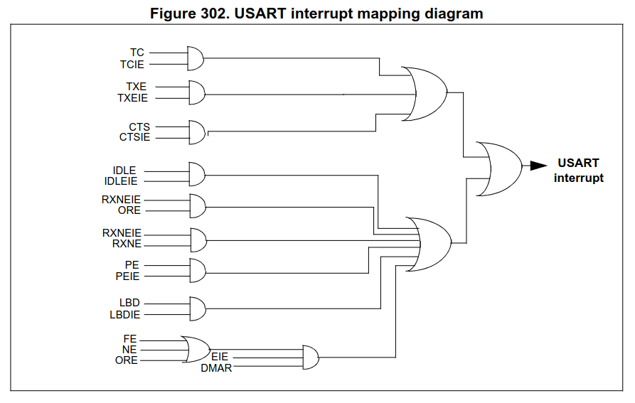

### Receive interrupt

```text
frame received
      ↓
RXNE = 1
      ↓
RXNEIE = 1
      ↓
USARTx IRQ
      ↓
ISR đọc USART_DR
```

Ví dụ:

```c
void USART1_IRQHandler(void)
{
    if (USART1->SR & USART_SR_RXNE)
    {
        uint8_t data = (uint8_t)USART1->DR;

        /* lưu data */
    }
}
```

### Transmit interrupt

```text
TDR trống
  ↓
TXE = 1
  ↓
TXEIE = 1
  ↓
USARTx IRQ
  ↓
ISR ghi data tiếp theo
```

Khi TX buffer đã hết data:

```text
disable TXEIE
```

nếu không, `TXE = 1` tiếp tục thỏa điều kiện interrupt.

Nếu cần xác nhận frame cuối đã truyền hoàn tất, dùng `TC/TCIE` theo **6.9**.

---

<a id="muc-06-13"></a>
## 6.13. IDLE Line

`USART_SR.IDLE` báo receiver phát hiện Idle Line.

Nếu:

```text
IDLEIE = 1
```

USART có thể tạo interrupt khi `IDLE` được set.

Trình tự clear:

```text
read USART_SR
      ↓
read USART_DR
```

`IDLE` chỉ có thể được báo lại sau khi reception đã có hoạt động mới.

### Ứng dụng

`IDLE` đặc biệt hữu ích với dữ liệu có độ dài không cố định:

```text
RX data
RX data
RX data
      ↓
RX trở lại idle
      ↓
IDLE
      ↓
software xác định một burst dữ liệu đã kết thúc
```

Một pattern phổ biến là:

```text
USART RX
   ↓
DMA
   ↓
RAM buffer
   ↓
IDLE interrupt
   ↓
xử lý số byte đã nhận
```

Phần DMA-specific được trình bày tại **6.16** và cơ chế DMA controller nằm ở **Chương 9**.

---

<a id="muc-06-14"></a>
## 6.14. UART bằng Polling

Khái niệm Polling và khác biệt với Interrupt đã được trình bày tại **4.1**. Với USART, Polling chỉ có nghĩa software chủ động kiểm tra các status flag đã nêu tại **6.9–6.11**.

### Transmit một byte

```c
static void USART1_WriteByte(uint8_t data)
{
    while (!(USART1->SR & USART_SR_TXE))
    {
    }

    USART1->DR = data;
}
```

### Transmit một buffer

```c
static void USART1_Write(const uint8_t *data, uint32_t length)
{
    for (uint32_t i = 0; i < length; ++i)
    {
        while (!(USART1->SR & USART_SR_TXE))
        {
        }

        USART1->DR = data[i];
    }

    while (!(USART1->SR & USART_SR_TC))
    {
    }
}
```

Ở đây:

```text
TXE
→ nạp data tiếp theo

TC
→ xác nhận frame cuối đã truyền hoàn tất
```

Ý nghĩa hai flag đã được giải thích tại **6.9**.

### Receive một byte

```c
static uint8_t USART1_ReadByte(void)
{
    while (!(USART1->SR & USART_SR_RXNE))
    {
    }

    return (uint8_t)USART1->DR;
}
```

Đây là **blocking polling** vì hàm chờ tới khi flag đạt trạng thái yêu cầu. Periodic/non-blocking polling là một cách tổ chức khác và đã được phân biệt tại **4.1**.

---

<a id="muc-06-15"></a>
## 6.15. UART bằng Interrupt

Cơ chế NVIC/ISR đã được trình bày tại **Chương 4**; nguồn USART interrupt nằm tại **6.12**. Mục này chỉ mô tả pattern xử lý dữ liệu.

### Receive

Enable nguồn `RXNE` và IRQ tương ứng:

```c
USART1->CR1 |= USART_CR1_RXNEIE;
NVIC_EnableIRQ(USART1_IRQn);
```

ISR:

```c
volatile uint8_t rx_data;
volatile uint8_t rx_ready;

void USART1_IRQHandler(void)
{
    if (USART1->SR & USART_SR_RXNE)
    {
        rx_data = (uint8_t)USART1->DR;
        rx_ready = 1U;
    }
}
```

Thread mode:

```c
if (rx_ready)
{
    rx_ready = 0U;

    /* xử lý rx_data */
}
```

Nếu cần nhận liên tục nhiều byte:

```text
ISR
 ↓
read USART_DR
 ↓
ghi vào RAM buffer / ring buffer
 ↓
cập nhật index
 ↓
return
```

### Transmit

Pattern interrupt-driven TX:

```text
TX buffer có data
      ↓
enable TXEIE
      ↓
TXE interrupt
      ↓
ISR ghi data tiếp theo vào USART_DR
      ↓
hết TX buffer
      ↓
disable TXEIE
```

Nếu application cần biết thời điểm frame cuối đã rời transmitter, dùng `TC/TCIE` sau data cuối.

Shared-data và `volatile` giữa ISR/Thread mode đã được trình bày tại **4.19**, nên không lặp lại ở đây.

---

<a id="muc-06-16"></a>
## 6.16. UART bằng DMA

Cơ chế DMA controller được trình bày tại **Chương 9**. Đối với USART, hai bit kết nối peripheral với DMA là:

```text
USART_CR3.DMAT
→ DMA Enable Transmitter

USART_CR3.DMAR
→ DMA Enable Receiver
```

### DMA Transmit

```text
SRAM buffer
    ↓
DMA
    ↓
USART transmit data path
    ↓
TX
```

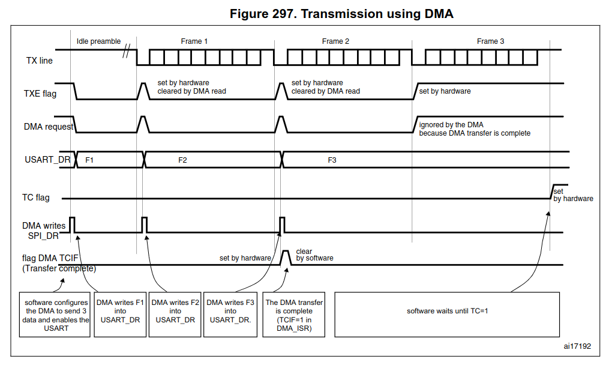

### DMA Receive

```text
RX
 ↓
USART receive data path
 ↓
DMA
 ↓
SRAM buffer
```

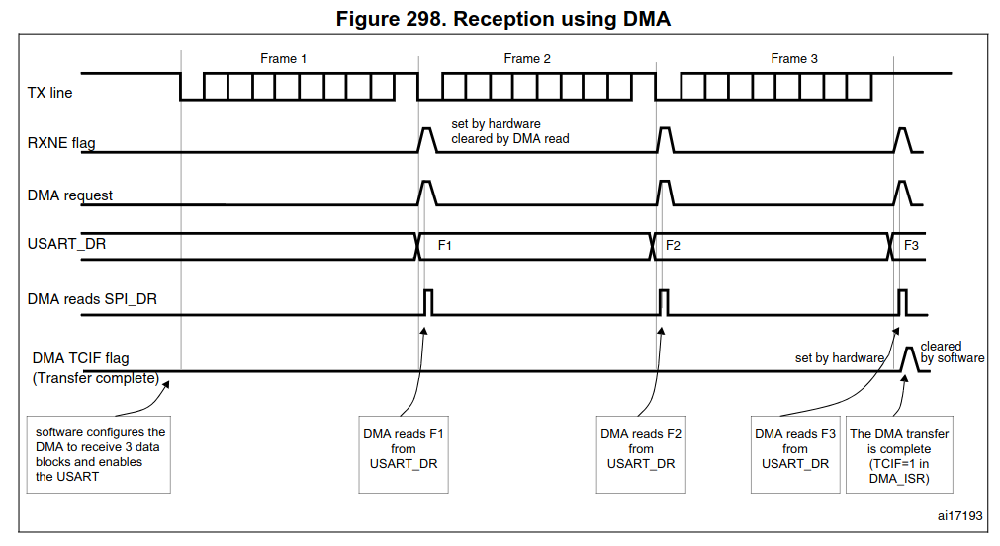

Khi DMA đọc receive data register sau mỗi data word, `RXNE` được clear theo data-read mechanism. Nếu data không được lấy kịp và frame mới tới, vẫn có thể xảy ra `ORE`.

### DMA + IDLE

Pattern thường dùng cho packet/burst có độ dài thay đổi:

```text
USART RX
   ↓
DMA
   ↓
RAM buffer
   ↓
IDLE
   ↓
xác định số byte đã nhận
   ↓
xử lý buffer
```

`IDLE` đã được giải thích tại **6.13**; channel mapping, transfer count và DMA flags được trình bày tại **9.17. DMA + UART** và các mục DMA liên quan.

---

<a id="muc-06-17"></a>
## 6.17. Hardware Flow Control: CTS / RTS

`CTS` và `RTS` là hai tín hiệu dùng để **kiểm soát luồng truyền bằng phần cứng**, giúp tránh trường hợp bên phát gửi quá nhanh khiến bên nhận chưa kịp xử lý dữ liệu.

Trong STM32F1:

```text
USART1 / USART2 / USART3
→ có CTS / RTS

UART4 / UART5
→ không có CTS / RTS
```

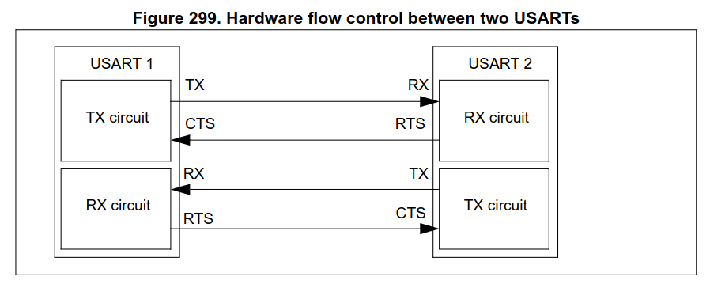

### RTS — Request To Send

`RTS` là **output** của receiver.

```text
RTS = 0
→ receiver còn sẵn sàng nhận
→ phía bên kia có thể tiếp tục gửi

RTS = 1
→ receiver chưa sẵn sàng nhận thêm
→ phía bên kia nên dừng gửi frame mới
```

Enable bằng:

```text
USART_CR3.RTSE = 1
```

Trên STM32F1, khi receive data register đang đầy (`RXNE = 1`), `RTS` được deassert để báo phía bên kia tạm dừng. Khi CPU/DMA đọc `USART_DR`, receiver lại có chỗ trống và `RTS` được assert trở lại.

### CTS — Clear To Send

`CTS` là **input** của transmitter.

```text
CTS = 0
→ được phép bắt đầu frame tiếp theo

CTS = 1
→ chưa được phép bắt đầu frame tiếp theo
```

Enable bằng:

```text
USART_CR3.CTSE = 1
```

Nếu `CTS` đổi sang `1` khi một frame đang truyền:

```text
frame hiện tại
→ vẫn truyền xong

frame tiếp theo
→ chưa được bắt đầu
```

### Kết nối

Hai thiết bị đấu chéo:

```text
A TX  → B RX
A RX  ← B TX

A RTS → B CTS
A CTS ← B RTS
```

Ví dụ A truyền sang B:

```text
B sẵn sàng nhận
→ RTS_B = 0
→ CTS_A = 0
→ A được phép truyền

B chưa kịp đọc data
→ RXNE_B = 1
→ RTS_B = 1
→ CTS_A = 1
→ A dừng trước frame tiếp theo

B đọc USART_DR
→ RXNE_B được clear
→ RTS_B = 0
→ CTS_A = 0
→ A tiếp tục truyền
```

Có thể nhớ ngắn gọn:

```text
RTS
→ "Tôi có nhận thêm được không?"

CTS
→ "Tôi có được gửi tiếp không?"
```

---

<a id="muc-06-18"></a>
## 6.18. Half-Duplex và Synchronous Mode

Các mode này là khả năng mở rộng của USART; chúng không thay đổi các khái niệm frame/flag cơ bản đã được trình bày ở các mục trước.

### Single-Wire Half-Duplex

Enable bằng:

```text
USART_CR3.HDSEL = 1
```

Mô hình:

```text
một đường data
←→
dùng luân phiên cho transmit và receive
```

Do chỉ có một đường data:

```text
Half-Duplex
→ không transmit và receive đồng thời như Full-Duplex TX/RX
```

### Synchronous Mode

USART có thể xuất thêm clock:

```text
CK
```

Enable bằng:

```text
USART_CR2.CLKEN
```

Các bit liên quan:

```text
CPOL
CPHA
LBCL
```

Mô hình:

```text
USART
├── TX
├── RX
└── CK
```

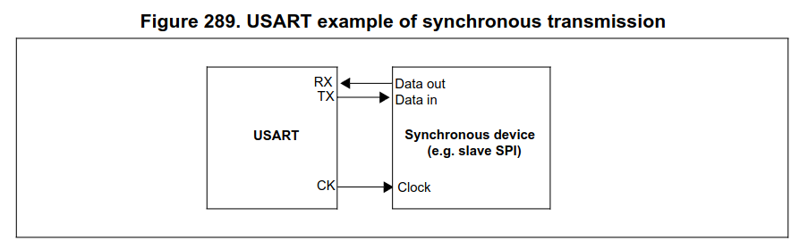

`UART4/UART5` không có synchronous clock output tương ứng.

### Các mode khác

USART còn có các mode/tính năng như:

```text
LIN
Smartcard
IrDA
Multiprocessor communication
```

Các mode này có quy tắc riêng và không được triển khai chi tiết trong chương cơ bản này.

---

<a id="muc-06-19"></a>
## 6.19. Quy trình cấu hình UART

Ví dụ mục tiêu:

```text
USART1
115200 baud
8N1
Full-Duplex
TX = PA9
RX = PA10
PCLK2 = 72 MHz
```

Quy trình tổng quát:

```text
1. Xác định USART instance và fCK
        ↓
2. Enable peripheral/GPIO clock
        ↓
3. Cấu hình TX/RX GPIO và remap nếu cần
        ↓
4. Giữ UE = 0 trong giai đoạn cấu hình chính
        ↓
5. Cấu hình frame: M / parity / STOP
        ↓
6. Tính và ghi USART_BRR
        ↓
7. Cấu hình flow control / DMA / mode đặc biệt nếu dùng
        ↓
8. Enable transmitter / receiver: TE / RE
        ↓
9. Enable USART: UE = 1
        ↓
10. Enable interrupt tại USART/NVIC nếu dùng
        ↓
11. Bắt đầu transmit / receive
```

Dẫn chiếu cho từng bước:

```text
Clock source / peripheral clock
→ Chương 2 và 6.6

GPIO / remap
→ Chương 3 và 6.7

Frame format
→ 6.3–6.4

Baud / BRR
→ 6.5–6.6

TXE / TC / RXNE
→ 6.9–6.10

Error flags
→ 6.11

Interrupt
→ 6.12 và Chương 4

DMA
→ 6.16 và Chương 9
```

Mục này chỉ xác định **thứ tự cấu hình**; code hoàn chỉnh cho USART1 115200 8N1 nằm tại **6.20**.

---

<a id="muc-06-20"></a>
## 6.20. Ví dụ USART1 115200 8N1

Điều kiện:

```text
PCLK2 = 72 MHz
USART1_TX = PA9
USART1_RX = PA10
Baud = 115200
8N1
Polling
```

Theo **6.6**:

```text
USART_BRR = 0x271
```

### Initialization

```c
static void USART1_Init_115200_8N1(void)
{
    /* GPIOA + USART1 clock */
    RCC->APB2ENR |= RCC_APB2ENR_IOPAEN
                   | RCC_APB2ENR_USART1EN;

    /* PA9: Alternate Function Output Push-Pull, 50 MHz */
    GPIOA->CRH &= ~(0xFU << 4);
    GPIOA->CRH |=  (0xBU << 4);

    /* PA10: Floating Input */
    GPIOA->CRH &= ~(0xFU << 8);
    GPIOA->CRH |=  (0x4U << 8);

    /* Configure USART while disabled */
    USART1->CR1 &= ~USART_CR1_UE;

    /* 8N1 */
    USART1->CR1 &= ~(USART_CR1_M | USART_CR1_PCE);
    USART1->CR2 &= ~USART_CR2_STOP;

    /* PCLK2 = 72 MHz, Baud = 115200 */
    USART1->BRR = 0x271U;

    /* Full-Duplex TX + RX */
    USART1->CR1 |= USART_CR1_TE | USART_CR1_RE;

    /* Enable USART */
    USART1->CR1 |= USART_CR1_UE;
}
```

GPIO encoding đã được trình bày ở **Chương 3**; `8N1` tại **6.4**; giá trị `BRR` tại **6.6**.

### Transmit Byte

```c
static void USART1_WriteByte(uint8_t data)
{
    while (!(USART1->SR & USART_SR_TXE))
    {
    }

    USART1->DR = data;
}
```

### Transmit Buffer

```c
static void USART1_Write(const uint8_t *data, uint32_t length)
{
    for (uint32_t i = 0; i < length; ++i)
    {
        USART1_WriteByte(data[i]);
    }

    while (!(USART1->SR & USART_SR_TC))
    {
    }
}
```

### Receive Byte

```c
static uint8_t USART1_ReadByte(void)
{
    while (!(USART1->SR & USART_SR_RXNE))
    {
    }

    return (uint8_t)USART1->DR;
}
```

### Echo

```c
int main(void)
{
    USART1_Init_115200_8N1();

    while (1)
    {
        uint8_t data = USART1_ReadByte();
        USART1_WriteByte(data);
    }
}
```

Luồng:

```text
PC / USB-UART
      ↓
     RX
      ↓
USART1
      ↓
ReadByte()
      ↓
WriteByte()
      ↓
     TX
      ↓
PC / USB-UART
```

### Các lỗi cần kiểm tra

| Hiện tượng / lỗi cấu hình | Mục cần kiểm tra |
|---|---|
| Baud sai | **6.5–6.6** và clock ở **Chương 2** |
| TX/RX không hoạt động | **6.7**, peripheral clock và pin mapping |
| Nhầm `TXE` với `TC` | **6.9** |
| Receive bị mất data / `ORE` | **6.10–6.11** |
| Clear receive error flag sai | **6.11** |
| Cấu hình `8E1/8O1` sai số data bit | **6.3–6.4** |
| Interrupt lặp liên tục do `TXEIE` | **6.12**, **6.15** |
| Variable-length DMA receive không xác định được điểm kết thúc | **6.13**, **6.16** |

Mục ví dụ này chỉ ghép các khối đã giải thích; không lặp lại định nghĩa của từng flag hoặc register.

---

<a id="muc-06-21"></a>
## 6.21. Câu hỏi tự kiểm tra

1. UART và USART khác nhau ở khả năng synchronous/asynchronous như thế nào?
2. `asynchronous` có nghĩa USART không cần peripheral clock không?
3. Một asynchronous frame gồm những phần nào?
4. `M = 0/1` quy định word length như thế nào?
5. Vì sao `M = 0`, `PCE = 1` không phải cấu hình 8 data bits + parity?
6. 8N1 nghĩa là gì?
7. `baud rate` và bit rate có quan hệ thế nào trong UART nhị phân NRZ thông thường?
8. USART1 dùng `PCLK1` hay `PCLK2` làm `fCK`?
9. `USARTDIV` và `USART_BRR` liên hệ như thế nào?
10. Với `PCLK2 = 72 MHz`, USART1 115200 baud dùng `BRR` nào trong ví dụ của chương?
11. TX và RX thường dùng GPIO mode nào trên STM32F1?
12. `USART_DR` tham gia transmit path và receive path như thế nào?
13. `TXE` và `TC` khác nhau ở thời điểm nào?
14. `RXNE` biểu thị điều gì?
15. `ORE` xảy ra trong điều kiện nào?
16. Trình tự clear `ORE/FE/NE/PE` là gì?
17. Vì sao phải disable `TXEIE` khi TX buffer đã hết?
18. `IDLE` hữu ích thế nào khi receive bằng DMA?
19. Polling, Interrupt và DMA khác nhau ở cách data được chuyển giữa USART và software/RAM như thế nào?
20. Hãy mô tả trình tự cấu hình USART1 115200 8N1 từ clock tới transmit/receive.

---

## 6.22. Tóm tắt

Quan hệ tổng quát:

```text
fCK
 ↓
baud-rate generator
 ↓
USART / UART
├── transmitter → TX
└── receiver    ← RX
```

Frame bất đồng bộ:

```text
Idle
 ↓
Start
 ↓
Data
 ↓
Parity nếu enable
 ↓
Stop
```

Data path:

```text
Transmit:
CPU / DMA → USART_DR → TDR → Shift Register → TX

Receive:
RX → Shift Register → RDR → USART_DR → CPU / DMA
```

Flag cốt lõi:

```text
TXE
→ có thể nạp data tiếp

TC
→ frame cuối truyền hoàn tất

RXNE
→ data nhận sẵn sàng

IDLE
→ receiver phát hiện Idle Line

ORE / FE / NE / PE
→ receive error flags
```

Ba cách xử lý data:

```text
Polling
→ software chủ động kiểm tra flag

Interrupt
→ USART event tạo IRQ, ISR xử lý data

DMA
→ DMA chuyển data giữa USART và RAM
```

> **Khi cấu hình UART/USART trên STM32F1, trước hết xác định đúng `fCK`, sau đó cấu hình frame và `USART_BRR`, GPIO TX/RX, rồi chọn cơ chế Polling/Interrupt/DMA phù hợp. `TXE`, `TC`, `RXNE`, `IDLE` và các receive error flag có vai trò khác nhau và được giải thích tại đúng mục chuyên biệt thay vì lặp lại trong các mục quy trình/ví dụ.**

[↑ Về mục lục](#muc-luc)


---

<a id="chuong-07"></a>
# 7. SPI + I2C

SPI và I2C đều là **giao tiếp nối tiếp đồng bộ**, nhưng tổ chức bus khác nhau:

```text
SPI
├── SCK
├── MOSI
├── MISO
└── NSS / CS

I2C
├── SCL
└── SDA
```

Chương này dùng một mục chính cho mỗi khái niệm. Các mục quy trình, ví dụ, Interrupt và DMA chỉ áp dụng lại cơ chế đã nêu và dẫn chiếu về mục chính để tránh lặp định nghĩa.

## Quy ước thuật ngữ

| Thuật ngữ dùng trong chương | Cách hiểu |
|---|---|
| **SPI** | Serial Peripheral Interface; giao tiếp nối tiếp đồng bộ dùng clock `SCK`. |
| **SPI Master / SPI Slave** | Hai vai trò theo thuật ngữ của STM32F1/RM0008; Master tạo `SCK` và khởi tạo transfer. |
| **SCK** | Serial Clock của SPI. |
| **MOSI** | Master Out Slave In; đường dữ liệu từ Master tới Slave trong Full-Duplex. |
| **MISO** | Master In Slave Out; đường dữ liệu từ Slave tới Master trong Full-Duplex. |
| **NSS** | Slave Select signal của peripheral SPI STM32F1. |
| **CS** | Chip Select của thiết bị ngoài; khi dùng Software NSS thường được điều khiển bằng một GPIO riêng. |
| **SPI frame** | Đơn vị dữ liệu 8 bit hoặc 16 bit theo `DFF`. |
| **Full-Duplex** | Mỗi clock đồng thời shift một bit TX và một bit RX. |
| **baud-rate prescaler** | Bộ chia `PCLKx` để tạo `SCK` khi STM32F1 làm SPI Master; chọn bằng `BR[2:0]`. |
| **CPOL / CPHA** | Clock Polarity / Clock Phase; xác định mức idle của `SCK` và cạnh lấy mẫu. |
| **`SPI_DR`** | Data Register mà CPU/DMA dùng để ghi dữ liệu phát và đọc dữ liệu nhận. |
| **`TXE` / `RXNE` / `BSY`** | Transmit Buffer Empty / Receive Buffer Not Empty / Busy. |
| **SPI error flags** | `OVR`, `MODF`, `CRCERR`. |
| **I2C** | Inter-Integrated Circuit; bus nối tiếp đồng bộ hai dây dùng `SCL` và `SDA`. |
| **I2C Master / I2C Slave** | Hai vai trò theo thuật ngữ của STM32F1/RM0008; Master tạo START và điều khiển transaction. |
| **Transmitter / Receiver** | Vai trò truyền/nhận dữ liệu, độc lập với vai trò Master/Slave. |
| **SCL / SDA** | Serial Clock / Serial Data của I2C. |
| **Open-Drain** | Thiết bị chỉ chủ động kéo line xuống Low; mức High được tạo bởi pull-up. |
| **START / STOP condition** | Điều kiện bắt đầu/kết thúc transaction trên bus I2C. |
| **Repeated START** | START mới được tạo khi Master vẫn đang giữ bus, không phát STOP trước đó. |
| **ACK / NACK** | Acknowledge / Not Acknowledge ở xung clock thứ 9 sau mỗi byte. |
| **7-bit address / 10-bit address** | Địa chỉ Slave trên bus; không đồng nhất 7-bit address với byte `Address + R/W`. |
| **Standard-mode / Fast-mode** | I2C tới 100 kHz / 400 kHz trong phạm vi chương này. |
| **clock stretching** | Slave giữ `SCL` ở Low để trì hoãn tiến trình bus. |
| **arbitration** | Cơ chế nhiều Master cùng quan sát SDA để xác định Master nào tiếp tục giữ bus. |
| **I2C event flags** | `SB`, `ADDR`, `ADD10`, `STOPF`, `BTF`, `RxNE`, `TxE`. |
| **I2C error flags** | `BERR`, `ARLO`, `AF`, `OVR`, `PECERR`. |

Trong chương này, tên bit/register giữ đúng ký hiệu STM32F1 như `SPI_CR1.CPOL`, `I2C_SR1.ADDR`, `TxE`, `RxNE`; không tự đổi kiểu chữ của tên bit.

---

<a id="muc-07-01"></a>
## 7.1. Tổng quan SPI và I2C

Hai giao tiếp cùng dùng clock để đồng bộ nhưng chọn thiết bị theo hai cách khác nhau:

```text
SPI
→ Master chọn Slave bằng NSS/CS

I2C
→ Master chọn Slave bằng address truyền trên SDA
```

Đặc điểm cần nhận diện:

| SPI | I2C |
|---|---|
| Full-Duplex tự nhiên | Một đường data dùng chung |
| SCK + MOSI + MISO + NSS/CS | SCL + SDA |
| Không có addressing chung bắt buộc trong giao thức cơ bản | 7-bit / 10-bit addressing |
| Không có ACK/NACK kiểu I2C | Có ACK/NACK |
| Slave thường được chọn bằng CS riêng | Nhiều Slave dùng chung bus theo address |
| Có CPOL/CPHA | Có START/STOP, arbitration, clock stretching |

Các cơ chế cụ thể được trình bày ở các mục SPI **7.2–7.15** và I2C **7.16–7.29**.

---

# SPI

<a id="muc-07-02"></a>
## 7.2. SPI là gì?

`SPI` là:

```text
Serial Peripheral Interface
```

SPI là giao tiếp nối tiếp đồng bộ; trong Master mode, Master tạo `SCK` và dữ liệu được shift theo các cạnh clock.

STM32F1 SPI có thể hoạt động ở:

```text
Master
Slave
```

và hỗ trợ các kiểu truyền như:

```text
Full-Duplex
Simplex
Bidirectional Half-Duplex
```

Các đường tín hiệu được trình bày tại **7.3**; Full-Duplex được giải thích tại **7.4**.

---

<a id="muc-07-03"></a>
## 7.3. SCK / MOSI / MISO / NSS

Một kết nối SPI Full-Duplex điển hình có bốn tín hiệu:

```text
SCK
→ Serial Clock
→ Master tạo clock

MOSI
→ Master Out Slave In
→ Master truyền, Slave nhận

MISO
→ Master In Slave Out
→ Slave truyền, Master nhận

NSS / CS
→ chọn Slave
```

Ví dụ nhiều Slave:

```text
Master
 ├── SCK  ─────────────┬── Slave A
 ├── MOSI ─────────────┼── Slave B
 ├── MISO ←────────────┴── ...
 │
 ├── CS_A ───────────────→ Slave A
 └── CS_B ───────────────→ Slave B
```

Thông thường:

```text
CS Low
→ Slave được chọn

CS High
→ Slave không được chọn
```

nhưng mức active phải theo datasheet của thiết bị ngoài.

Trong chương này:

```text
NSS
→ tên signal của peripheral SPI STM32F1

CS
→ tên thường dùng ở phía thiết bị ngoài / GPIO chip-select
```

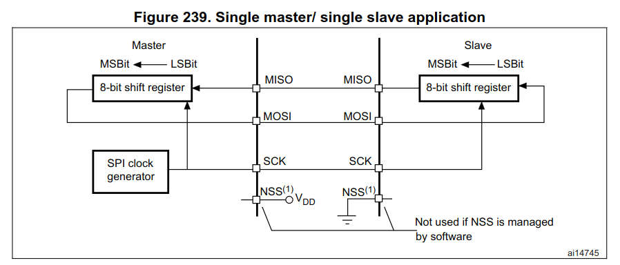

---

<a id="muc-07-04"></a>
## 7.4. Master / Slave và Full-Duplex

Vai trò:

```text
Master
→ khởi tạo transfer
→ tạo SCK
→ chọn Slave

Slave
→ nhận SCK
→ truyền/nhận theo clock của Master
```

Trong Full-Duplex:

```text
MOSI
→ một hướng

MISO
→ hướng còn lại
```

Mỗi clock thực hiện đồng thời:

```text
shift một bit ra
+
shift một bit vào
```

Vì vậy:

```text
Master truyền 1 frame
→ đồng thời nhận 1 frame
```

Ngay cả khi application chỉ quan tâm TX, receive path vẫn hoạt động; do đó phải xử lý `RXNE/OVR` đúng cách. Ý nghĩa flag nằm tại **7.10–7.11**.

---

<a id="muc-07-05"></a>
## 7.5. SPI Clock và Baud Rate Prescaler

Khi STM32F1 là SPI Master:

```text
fSCK = fPCLK / Prescaler
```

`SPI_CR1.BR[2:0]` chọn:

```text
/2
/4
/8
/16
/32
/64
/128
/256
```

Clock bus:

```text
SPI1
→ PCLK2

SPI2 / SPI3
→ PCLK1
```

`SPI3` chỉ áp dụng cho part number có peripheral này. Cách xác định `PCLK1/PCLK2` đã được trình bày tại **Chương 2**.

Ví dụ:

```text
PCLK2 = 72 MHz
SPI1 prescaler = /8

→ SCK = 9 MHz
```

Trong Slave mode, `SCK` do Master bên ngoài cấp nên `BR[2:0]` không quyết định tần số SCK.

---

<a id="muc-07-06"></a>
## 7.6. CPOL / CPHA và 4 SPI Mode

Hai bit timing:

```text
CPOL
→ Clock Polarity

CPHA
→ Clock Phase
```

`CPOL` chọn mức idle:

```text
CPOL = 0
→ SCK idle Low

CPOL = 1
→ SCK idle High
```

`CPHA` chọn cạnh lấy mẫu:

```text
CPHA = 0
→ lấy mẫu tại cạnh đầu tiên

CPHA = 1
→ lấy mẫu tại cạnh thứ hai
```

Quan hệ cạnh:

```text
CPOL = 0
→ first edge  = Rising
→ second edge = Falling

CPOL = 1
→ first edge  = Falling
→ second edge = Rising
```

Bốn mode:

| SPI Mode | `CPOL` | `CPHA` | SCK idle | Cạnh lấy mẫu |
|---|---:|---:|---|---|
| Mode 0 | 0 | 0 | Low | First edge |
| Mode 1 | 0 | 1 | Low | Second edge |
| Mode 2 | 1 | 0 | High | First edge |
| Mode 3 | 1 | 1 | High | Second edge |

Master và Slave phải dùng timing tương thích. Khi thay đổi `CPOL/CPHA`, cấu hình khi `SPE = 0` như trong quy trình tại **7.14**.

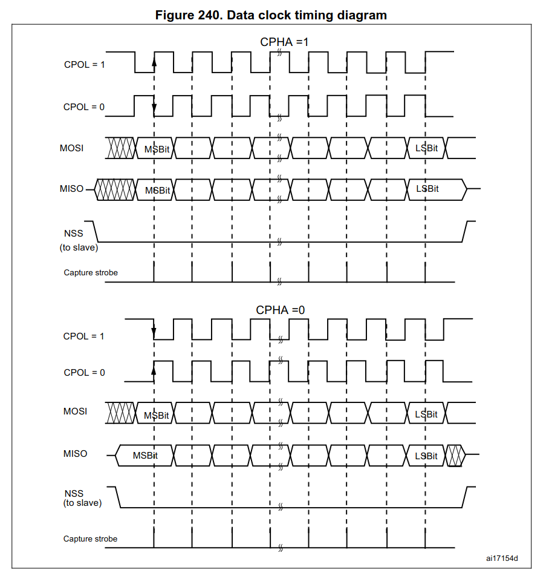


### Cách hoạt động của 4 SPI Mode

Trong mỗi bit time:

```text
một cạnh SCK
→ lấy mẫu (Sample / Capture)

cạnh còn lại
→ dịch dữ liệu (Shift)
→ chuẩn bị bit kế tiếp trên MOSI / MISO
```

`CPOL` quyết định SCK idle ở mức nào, còn `CPHA` quyết định **cạnh thứ nhất hay cạnh thứ hai** được dùng để lấy mẫu.

> `Shift` ở đây là Shift Register chuyển sang bit kế tiếp trên đường dữ liệu, không phải CPU ghi lại `SPI_DR`.

#### Mode 0 — `CPOL = 0`, `CPHA = 0`

```text
SCK idle = 0

Rising edge  (cạnh thứ nhất)
→ Sample

Falling edge (cạnh thứ hai)
→ Shift sang bit kế tiếp
```

Vì lấy mẫu ngay tại cạnh đầu tiên nên bit đầu tiên phải ổn định trên MOSI/MISO **trước Rising edge đầu tiên**.

```text
Idle Low
   ↓
Data đã sẵn sàng
   ↓
Rising  → Sample
   ↓
Falling → Shift
   ↓
Rising  → Sample bit tiếp theo
```

#### Mode 1 — `CPOL = 0`, `CPHA = 1`

```text
SCK idle = 0

Rising edge  (cạnh thứ nhất)
→ Shift

Falling edge (cạnh thứ hai)
→ Sample
```

Ở Mode 1, cạnh đầu tiên dùng để đưa/chuyển bit ra đường dữ liệu; receiver lấy mẫu tại cạnh thứ hai.

```text
Idle Low
   ↓
Rising  → Shift
   ↓
Falling → Sample
   ↓
Rising  → Shift bit tiếp theo
```

#### Mode 2 — `CPOL = 1`, `CPHA = 0`

```text
SCK idle = 1

Falling edge (cạnh thứ nhất)
→ Sample

Rising edge  (cạnh thứ hai)
→ Shift sang bit kế tiếp
```

Tương tự Mode 0, vì `CPHA = 0` nên bit đầu tiên phải ổn định **trước cạnh thứ nhất**, nhưng do `CPOL = 1` nên cạnh thứ nhất là Falling edge.

```text
Idle High
   ↓
Data đã sẵn sàng
   ↓
Falling → Sample
   ↓
Rising  → Shift
   ↓
Falling → Sample bit tiếp theo
```

#### Mode 3 — `CPOL = 1`, `CPHA = 1`

```text
SCK idle = 1

Falling edge (cạnh thứ nhất)
→ Shift

Rising edge  (cạnh thứ hai)
→ Sample
```

Ở Mode 3, Falling edge dùng để shift dữ liệu và Rising edge dùng để lấy mẫu.

```text
Idle High
   ↓
Falling → Shift
   ↓
Rising  → Sample
   ↓
Falling → Shift bit tiếp theo
```

Có thể nhớ nhanh:

| SPI Mode | SCK idle | Cạnh thứ nhất | Cạnh thứ hai |
|---|---|---|---|
| Mode 0 | Low | **Sample** ↑ | Shift ↓ |
| Mode 1 | Low | Shift ↑ | **Sample** ↓ |
| Mode 2 | High | **Sample** ↓ | Shift ↑ |
| Mode 3 | High | Shift ↓ | **Sample** ↑ |

Trong Figure 240, RM0008 minh họa dữ liệu theo thứ tự **MSB First** (`LSBFIRST = 0`), nhưng quy tắc chọn cạnh Sample/Shift của `CPOL/CPHA` vẫn giữ nguyên nếu đổi thứ tự bit.


---

<a id="muc-07-07"></a>
## 7.7. Data Frame: 8/16-bit, MSB/LSB First

`SPI_CR1.DFF` chọn độ dài frame:

```text
DFF = 0
→ 8-bit frame

DFF = 1
→ 16-bit frame
```

`SPI_CR1.LSBFIRST` chọn thứ tự bit:

```text
LSBFIRST = 0
→ MSB First

LSBFIRST = 1
→ LSB First
```

Ví dụ 8-bit MSB First:

```text
Data = 0b10110010

bit7 → bit6 → ... → bit0
```

Frame format phải theo protocol của thiết bị ngoài; không mặc định mọi thiết bị đều dùng 8-bit MSB First.

---

<a id="muc-07-08"></a>
## 7.8. NSS Hardware / Software

Điểm dễ nhầm nhất ở phần này là phải phân biệt:

```text
NSS vật lý
→ chân SPIx_NSS ở ngoài chip

NSS nội bộ
→ trạng thái logic mà peripheral SPI dùng bên trong
```

Bit `SPI_CR1.SSM` quyết định **NSS nội bộ lấy giá trị từ đâu**:

```text
SSM = 0
→ Hardware NSS management
→ NSS nội bộ lấy từ chân NSS vật lý

SSM = 1
→ Software NSS management
→ NSS nội bộ lấy từ bit SSI
```

### 1. Software NSS management

Cấu hình:

```text
SSM = 1
```

Khi đó peripheral SPI **không dùng chân NSS vật lý để xác định trạng thái NSS nội bộ**.

Thay vào đó:

```text
SPI_CR1.SSI
→ điều khiển NSS nội bộ
```

Trong Master mode thường dùng:

```text
SSM = 1
SSI = 1
```

Có thể hiểu:

```text
SSI = 1
→ bên trong peripheral coi NSS đang ở trạng thái không bị kéo Low
→ Master có thể hoạt động bình thường
```

Nếu Master cần chọn một Slave ngoài chip, cách phổ biến là dùng **GPIO riêng làm CS**:

```text
GPIO CS = 0
→ chọn Slave

truyền / nhận SPI

GPIO CS = 1
→ bỏ chọn Slave
```

Ví dụ nhiều Slave:

```text
Master
├── GPIO_CS1 → Slave 1
├── GPIO_CS2 → Slave 2
└── GPIO_CS3 → Slave 3
```

Điểm quan trọng:

```text
SSI
→ chỉ điều khiển NSS nội bộ

GPIO CS
→ tín hiệu thật gửi ra Slave bên ngoài
```

Hai thứ này **không phải cùng một signal**.

---

### 2. Hardware NSS management

Cấu hình:

```text
SSM = 0
```

Khi đó chân `SPIx_NSS` vật lý được peripheral sử dụng trực tiếp.

#### STM32F1 làm Master và xuất NSS

Cấu hình:

```text
MSTR = 1
SSM  = 0
SSOE = 1
```

Lúc này:

```text
SPIx_NSS
→ Output do peripheral SPI điều khiển
```

Hành vi trên STM32F1:

```text
SPE = 1
→ NSS được kéo Low

SPI vẫn enable
→ NSS tiếp tục giữ Low

SPE = 0
→ NSS trở lại High
```

Vì vậy cần nhớ:

```text
Hardware NSS trên STM32F1
≠
tự Low/High cho từng byte

NSS được giữ Low
→ trong thời gian SPI được enable
```

Đây là lý do nhiều ứng dụng Master vẫn thích dùng **Software NSS + GPIO CS**, vì software có thể chủ động kéo CS Low/High đúng theo từng transaction của Slave.

---

#### STM32F1 làm Master nhưng NSS là input

Nếu:

```text
MSTR = 1
SSM  = 0
SSOE = 0
```

thì chân NSS không được drive ra ngoài mà được dùng như input.

Trường hợp này chủ yếu liên quan tới **multi-master / Mode Fault**:

```text
Master đang hoạt động
+
NSS bị kéo Low
→ MODF có thể được set
```

Chi tiết `MODF` nằm tại **7.11**.

---

#### STM32F1 làm Slave

Trong Slave mode với Hardware NSS:

```text
NSS = 0
→ Slave được chọn
→ SPI có thể trao đổi dữ liệu

NSS = 1
→ Slave không được chọn
```

Master bên ngoài là thiết bị điều khiển đường NSS này.

---

### So sánh ngắn gọn

| Trường hợp | Peripheral lấy NSS từ đâu? | Tín hiệu chọn Slave ngoài chip |
|---|---|---|
| Software NSS | `SSI` | Thường dùng GPIO làm `CS` |
| Hardware NSS, Master output | Chân `SPIx_NSS` | Peripheral tự drive chân NSS |
| Hardware NSS, Master input | Chân `SPIx_NSS` | Dùng cho multi-master / Mode Fault |
| Hardware NSS, Slave | Chân `SPIx_NSS` | Master bên ngoài điều khiển |

Có thể nhớ:

```text
Software NSS
→ SSM = 1
→ SSI điều khiển NSS nội bộ
→ GPIO thường điều khiển CS thật

Hardware NSS
→ SSM = 0
→ chân SPIx_NSS tham gia trực tiếp
```

---

<a id="muc-07-09"></a>
## 7.9. SPI_DR và cơ chế Shift Register

`SPI_DR` là Data Register mà CPU/DMA truy cập.

Transmit path:

```text
CPU / DMA
    ↓ write SPI_DR
Tx Buffer
    ↓
Shift Register
    ↓
MOSI
```

Receive path:

```text
MISO
 ↓
Shift Register
 ↓
Rx Buffer
 ↓ read SPI_DR
CPU / DMA
```

Trong Full-Duplex:

```text
shift TX
+
shift RX
→ xảy ra đồng thời theo SCK
```

Vì Master phải tạo `SCK` để nhận dữ liệu, một thao tác chỉ đọc vẫn cần truyền dummy data:

```text
write 0xFF
→ tạo 8 xung SCK trong 8-bit mode
→ đồng thời nhận 8 bit từ Slave
```

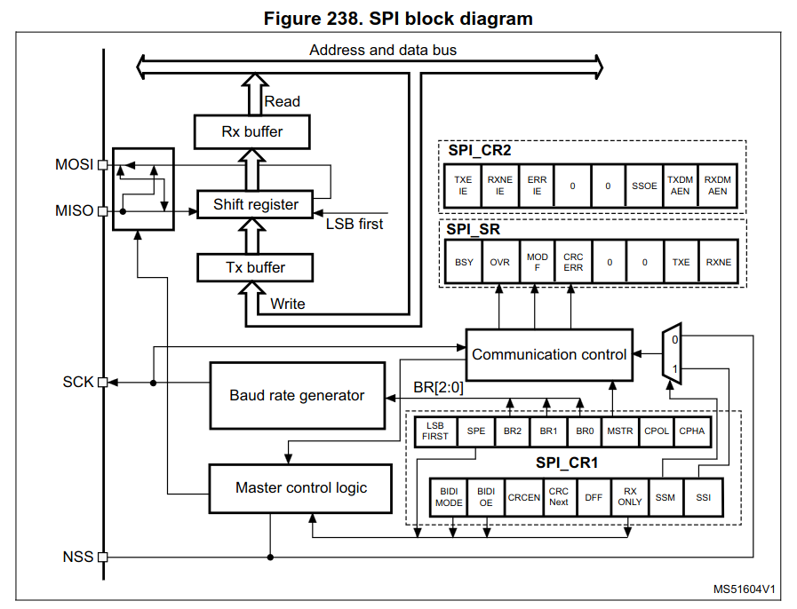


### Trao đổi một byte qua 8 chu kỳ SCK

Giả sử SPI đang dùng **frame 8-bit** và truyền **MSB First**. Trước khi bắt đầu, Master và Slave đều có một byte trong Shift Register của mình:

```text
Master Shift Register: M7 M6 M5 M4 M3 M2 M1 M0
Slave  Shift Register: S7 S6 S5 S4 S3 S2 S1 S0
```

Trong mỗi **chu kỳ SCK**, Master và Slave đồng thời trao đổi một bit:

```text
Master đưa bit hiện tại ra MOSI
Slave  đưa bit hiện tại ra MISO

Master lấy mẫu bit từ MISO
Slave  lấy mẫu bit từ MOSI

Shift Register chuyển sang bit kế tiếp
```

Tuy nhiên, không nên hiểu rằng mọi SPI mode đều có thứ tự vật lý cố định là **“đưa bit ra trước rồi ngay sau đó đọc bit vào”**. Cạnh clock dùng để **Sample** và cạnh dùng để **Shift** phụ thuộc `CPOL/CPHA` như đã trình bày tại **7.6**.

Vì vậy, cách hiểu chính xác hơn là:

```text
mỗi bit-time
→ có một thời điểm dữ liệu phải ổn định để được Sample
→ có một cạnh dùng để Shift sang bit kế tiếp

cạnh nào thực hiện nhiệm vụ nào
→ phụ thuộc SPI mode
```

Với **MSB First**, thứ tự các bit được trao đổi có thể hình dung:

```text
Chu kỳ 1:
MOSI: Master M7 ─────────→ Slave
MISO: Master    ←───────── Slave S7

Chu kỳ 2:
MOSI: Master M6 ─────────→ Slave
MISO: Master    ←───────── Slave S6

Chu kỳ 3:
MOSI: Master M5 ─────────→ Slave
MISO: Master    ←───────── Slave S5

...

Chu kỳ 7:
MOSI: Master M1 ─────────→ Slave
MISO: Master    ←───────── Slave S1

Chu kỳ 8:
MOSI: Master M0 ─────────→ Slave
MISO: Master    ←───────── Slave S0
```

Có thể hình dung Shift Register của Master dịch như sau ở mức khái niệm:

```text
Ban đầu:
[M7 M6 M5 M4 M3 M2 M1 M0]

sau khi trao đổi bit đầu:
[M6 M5 M4 M3 M2 M1 M0 S7]

sau khi trao đổi bit tiếp theo:
[M5 M4 M3 M2 M1 M0 S7 S6]

...

sau 8 chu kỳ:
[S7 S6 S5 S4 S3 S2 S1 S0]
```

Đồng thời Shift Register của Slave:

```text
Ban đầu:
[S7 S6 S5 S4 S3 S2 S1 S0]

sau khi trao đổi bit đầu:
[S6 S5 S4 S3 S2 S1 S0 M7]

...

sau 8 chu kỳ:
[M7 M6 M5 M4 M3 M2 M1 M0]
```

Kết quả sau 8 chu kỳ SCK:

```text
byte ban đầu của Master
→ Slave đã nhận đủ

byte ban đầu của Slave
→ Master đã nhận đủ
```

Do đó, SPI Full-Duplex có thể được hình dung như **hai Shift Register trao đổi đồng thời một frame dữ liệu**:

```text
Master byte ─────────→ Slave
Master      ←───────── Slave byte

frame 8-bit
→ cần 8 chu kỳ SCK
```

Cách diễn đạt phù hợp khi phỏng vấn:

> **SPI Full-Duplex có thể hình dung như hai Shift Register trao đổi dữ liệu đồng thời. Với frame 8-bit và MSB First, mỗi chu kỳ SCK trao đổi một bit theo thứ tự từ bit 7 đến bit 0. Sau 8 chu kỳ, mỗi phía đã nhận đủ một byte từ phía còn lại. Cạnh Sample và Shift cụ thể phụ thuộc CPOL/CPHA.**

Đây cũng là lý do khi Master chỉ muốn **đọc**, nó vẫn phải truyền một dummy byte. Các bit dummy được dịch ra MOSI để Master tạo đủ xung SCK, trong khi dữ liệu thật của Slave được dịch vào Master qua MISO.

### Dummy byte / dummy frame

Trong SPI **Full-Duplex**, mỗi xung `SCK` đồng thời dịch:

```text
1 bit từ Master → Slave
+
1 bit từ Slave → Master
```

Vì `SCK` do Master tạo, khi Master muốn **chỉ đọc dữ liệu** từ Slave thì Master vẫn phải thực hiện một lần truyền để tạo clock.

Dữ liệu truyền đi lúc này thường không có giá trị sử dụng và được gọi là **dummy data**.

Với frame 8-bit:

```text
dummy byte
→ thường dùng 0x00 hoặc 0xFF
```

Ví dụ:

```text
Master muốn đọc 1 byte
        ↓
write 0xFF vào SPI_DR
        ↓
SPI tạo 8 xung SCK
        ↓
MOSI phát 8 bit dummy
        +
MISO nhận 8 bit thật từ Slave
        ↓
đọc SPI_DR
→ lấy byte nhận được
```

Có thể hình dung:

```text
Master                         Slave

0xFF (dummy)
   │
   └──── MOSI ───────────────→ bỏ qua / không dùng
          8 xung SCK
   ┌──── MISO ←─────────────── data cần đọc
   │
 received_data
```

Ngược lại, khi Master **chỉ quan tâm dữ liệu gửi đi**, SPI vẫn đồng thời nhận một frame từ MISO:

```text
Master ghi dữ liệu thật
→ Slave nhận dữ liệu

Master đồng thời nhận một frame
→ nếu protocol không cần
→ software đọc để phục vụ receive path rồi bỏ giá trị đó
```

Vì vậy, trong Full-Duplex:

```text
muốn đọc
→ vẫn phải transmit để tạo SCK

muốn ghi
→ receive path vẫn hoạt động
```

Giá trị dummy **không mặc định luôn là tùy ý**. `0x00` hoặc `0xFF` chỉ nên dùng khi protocol của Slave cho phép; nếu datasheet của thiết bị quy định giá trị khác thì phải làm theo thiết bị đó.


Một điểm quan trọng khác:

```text
dummy byte
≠
một giá trị đặc biệt của SPI
```

Peripheral SPI không biết một byte là:

```text
data thật
hay
dummy data
```

Nó chỉ phát đúng giá trị đã được ghi vào `SPI_DR`. Việc một byte được xem là **dummy** hay **data thật** phụ thuộc vào **pha hiện tại của protocol** và cách Slave xử lý MOSI.

Ví dụ cùng giá trị:

```text
0xFF
```

có thể mang hai ý nghĩa khác nhau:

```text
Read phase
+
Slave bỏ qua MOSI
→ 0xFF chỉ là dummy byte
→ mục đích chính là tạo 8 xung SCK

Write / Command phase
+
Slave đang đọc MOSI
→ 0xFF có thể được hiểu là data hoặc command thật
```

Vì vậy, nếu dummy byte trùng với giá trị dữ liệu thật mà Master có thể gửi thì **không có xung đột ở mức phần cứng SPI**. Điều quan trọng là Slave đang ở trạng thái nào trong protocol.

Có thể nhớ:

```text
cùng một giá trị byte
→ ở pha này có thể là dummy
→ ở pha khác có thể là data thật
```

Do đó trước khi chọn `0x00`, `0xFF` hoặc một giá trị khác làm dummy, phải kiểm tra datasheet của Slave:

```text
MOSI trong read phase có bị ignore không?
có yêu cầu filler / NOP cụ thể không?
có cần dummy byte hay chỉ cần dummy clock cycles?
```


Nếu `DFF = 1`:

```text
16-bit frame
→ cùng nguyên lý
→ truyền một dummy frame 16-bit thay vì dummy byte 8-bit
```

Mục **7.15** áp dụng cơ chế này khi dùng:

```c
uint8_t data = SPI1_Transfer(0xFFU);
```

để tạo `SCK` và nhận dữ liệu từ Slave.


Ý nghĩa `TXE`, `RXNE`, `BSY` được tách tại **7.10**.

---

<a id="muc-07-10"></a>
## 7.10. TXE / RXNE / BSY

Ba flag chính trong `SPI_SR`:

```text
TXE
→ Transmit Buffer Empty
→ TXE = 1: có thể ghi frame tiếp theo vào SPI_DR

RXNE
→ Receive Buffer Not Empty
→ RXNE = 1: có frame nhận sẵn để đọc từ SPI_DR

BSY
→ Busy
→ BSY = 1: SPI còn đang thực hiện communication
```

Một transfer bằng polling thường theo:

```text
wait TXE
   ↓
write SPI_DR
   ↓
shift frame
   ↓
wait RXNE
   ↓
read SPI_DR
```

Khi kết thúc transaction, cần bảo đảm frame cuối đã hoàn tất trước khi deassert CS hoặc disable SPI; quy trình sử dụng các flag này được áp dụng tại **7.15**.

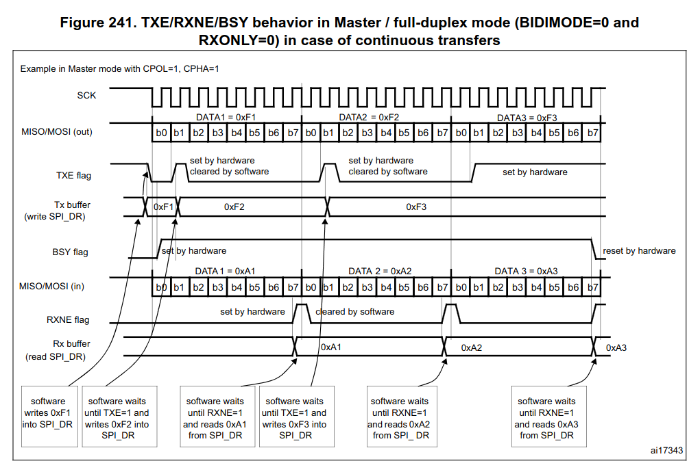

---

<a id="muc-07-11"></a>
## 7.11. OVR / MODF / CRCERR

Ba error flag cần nhận diện:

```text
OVR
→ Overrun

MODF
→ Mode Fault

CRCERR
→ CRC Error
```

### OVR

Trong Receive/Full-Duplex:

```text
Rx Buffer còn data chưa đọc
        ↓
frame mới nhận xong
        ↓
OVR = 1
```

Clear sequence trên STM32F1:

```text
read SPI_DR
    ↓
read SPI_SR
```

### MODF

`MODF` liên quan tới NSS và Master mode. Khi phần cứng phát hiện điều kiện Mode Fault, trạng thái Master/SPI có thể bị thay đổi; software phải xử lý theo sequence của peripheral trước khi tiếp tục.

Chi tiết nguyên nhân NSS đã được nêu tại **7.8**, nên không lặp lại ở đây.

### CRCERR

Khi SPI CRC được sử dụng:

```text
CRC nhận
≠
CRC tính toán
→ CRCERR = 1
```

CRC chỉ áp dụng khi protocol/application sử dụng cơ chế này.

---

<a id="muc-07-12"></a>
## 7.12. SPI bằng Polling / Interrupt / DMA

Ba cách phục vụ SPI khác nhau ở **ai di chuyển dữ liệu và ai chờ flag**; ý nghĩa các flag đã được nêu tại **7.10–7.11**.

### Polling

CPU chờ `TXE/RXNE` rồi truy cập `SPI_DR`:

```c
static uint8_t SPI1_Transfer(uint8_t tx)
{
    while (!(SPI1->SR & SPI_SR_TXE))
    {
    }

    SPI1->DR = tx;

    while (!(SPI1->SR & SPI_SR_RXNE))
    {
    }

    return (uint8_t)SPI1->DR;
}
```

Khái niệm Polling đã được trình bày tại **4.1**.

### Interrupt

Các enable bit chính:

```text
TXEIE
RXNEIE
ERRIE
```

Luồng:

```text
SPI flag
→ interrupt được enable
→ SPI IRQ
→ NVIC
→ SPIx_IRQHandler()
```

Cơ chế NVIC/ISR thuộc **Chương 4**.

### DMA

Các bit:

```text
TXDMAEN
RXDMAEN
```

Full-Duplex DMA:

```text
SRAM TX buffer
    ↓ DMA
  SPI_DR
    ↓
   MOSI

   MISO
    ↓
  SPI_DR
    ↓ DMA
SRAM RX buffer
```

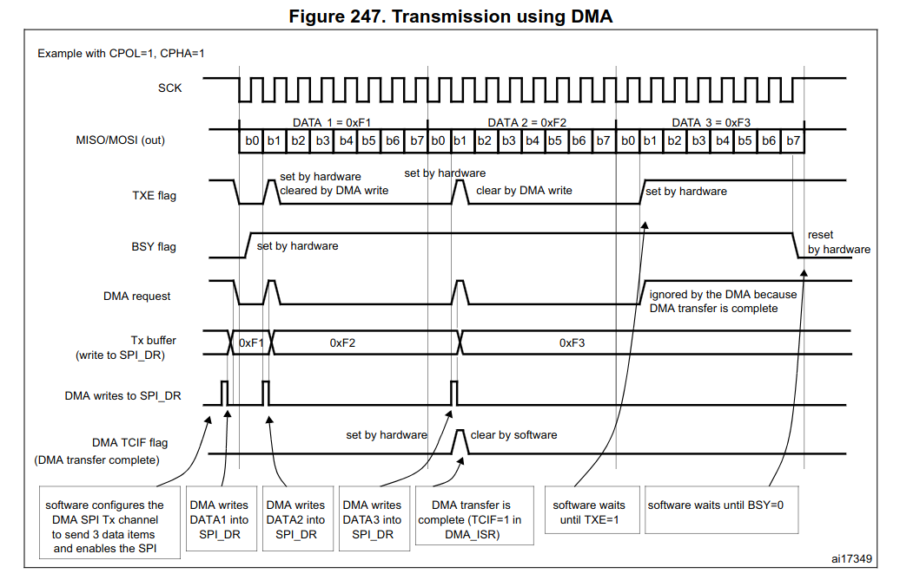

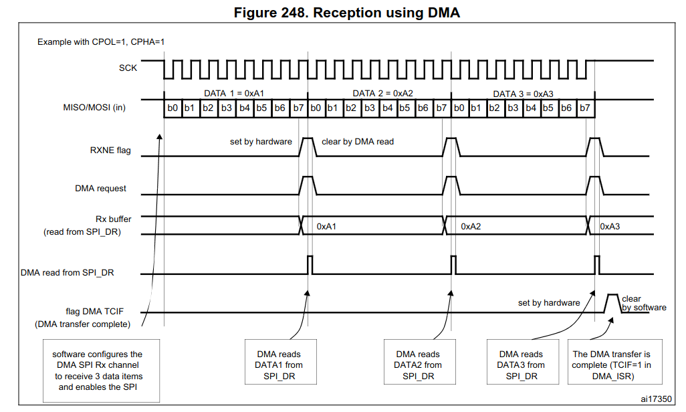

Chi tiết DMA controller, channel và transfer configuration thuộc **Chương 9**; mục này chỉ nêu liên kết SPI với DMA.

---

<a id="muc-07-13"></a>
## 7.13. GPIO cho SPI

Cơ chế GPIO mode, Alternate Function và remap đã được trình bày tại **Chương 3**. Trong Chương 7 chỉ cần ánh xạ hướng tín hiệu của SPI.

SPI Master thường dùng:

| Signal | GPIO configuration |
|---|---|
| `SCK` | Alternate Function Output Push-Pull |
| `MOSI` | Alternate Function Output Push-Pull |
| `MISO` | Input mode phù hợp |
| `NSS` | AF Output nếu Hardware NSS; GPIO Output nếu Software CS |

SPI1 mặc định:

```text
PA4 → NSS
PA5 → SCK
PA6 → MISO
PA7 → MOSI
```

SPI1 remap:

```text
PA15 → NSS
PB3  → SCK
PB4  → MISO
PB5  → MOSI
```

Các pin `PA15/PB3/PB4` liên quan JTAG sau reset; nếu dùng remap phải xem cấu hình `SWJ_CFG` tại **3.13 / Chương 10**.

Ở Slave mode, hướng tín hiệu đổi theo vai trò:

```text
SCK  → Input
MOSI → Input
MISO → Alternate Function Output
NSS  → Input nếu dùng Hardware NSS
```

---

<a id="muc-07-14"></a>
## 7.14. Quy trình cấu hình SPI Master

Ví dụ mục tiêu:

```text
SPI1
Master
Full-Duplex
8-bit
MSB First
Mode 0
SCK = PCLK2 / 8
Software NSS
```

Trình tự:

```text
1. Enable GPIO + SPI clock
2. Cấu hình GPIO theo 7.13
3. SPE = 0 trong lúc cấu hình chính
4. MSTR = 1
5. Chọn BR theo 7.5
6. Chọn CPOL/CPHA theo 7.6
7. Chọn DFF/LSBFIRST theo 7.7
8. Chọn SSM/SSI hoặc Hardware NSS theo 7.8
9. Chọn Full-Duplex
10. SPE = 1
```

Với ví dụ trên:

```text
MSTR = 1
BR   = /8
CPOL = 0
CPHA = 0
DFF  = 0
LSBFIRST = 0
SSM  = 1
SSI  = 1
BIDIMODE = 0
RXONLY   = 0
```

Mục này chỉ tập trung vào **thứ tự cấu hình**; định nghĩa từng field đã nằm tại **7.5–7.8**.

---

<a id="muc-07-15"></a>
## 7.15. Ví dụ một SPI Transaction

Giả sử thiết bị yêu cầu:

```text
CS Low
 ↓
Command
 ↓
Address
 ↓
Read Data
 ↓
CS High
```

Dùng hàm transfer tại **7.12**:

```c
CS_LOW();

SPI1_Transfer(command);
SPI1_Transfer(address);

uint8_t data = SPI1_Transfer(0xFFU);

while (SPI1->SR & SPI_SR_BSY)
{
}

CS_HIGH();
```

Ý nghĩa của:

```text
SPI1_Transfer(0xFF)
```

là:

```text
gửi dummy frame
+
tạo SCK
+
nhận frame từ Slave
```

Full-Duplex và data path đã được giải thích tại **7.4** và **7.9**, nên ví dụ không lặp lại cơ chế đó.

### SPI không có bit R/W chuẩn chung

Khác với I2C, SPI **không quy định một bit Read/Write chung ở mức giao thức bus**.

Với I2C 7-bit:

```text
Address[6:0] + R/W
```

bit `R/W` là một phần của định dạng address phase do chuẩn I2C quy định.

Trong SPI, bản thân bus chỉ quy định cách truyền bit qua:

```text
SCK
MOSI
MISO
NSS / CS
```

Còn ý nghĩa của byte đầu tiên như:

```text
Read
Write
Register Address
Command
Opcode
```

được **nhà sản xuất từng Slave tự định nghĩa trong datasheet**.

Vì vậy khi viết SPI driver, không được mặc định rằng mọi Slave đều có:

```text
bit 7 = Read/Write
```

mà phải đọc đúng protocol của linh kiện đang sử dụng.

Hai cách tổ chức rất thường gặp là:

#### Kiểu A — Gộp R/W vào byte command đầu tiên

Cách này thường gặp ở các cảm biến hoặc peripheral có nhiều register nội bộ.

Một byte đầu tiên có thể chứa:

```text
+-------+-------------------------------+
|  R/W  | Register Address / Field khác |
+-------+-------------------------------+
```

Ví dụ một thiết bị có thể quy định:

```text
bit 7
→ R/W

bit 6..0
→ Register Address
```

hoặc sử dụng một số bit còn lại cho chức năng khác.

Ví dụ ADXL345 định nghĩa byte giao tiếp SPI theo dạng:

```text
bit 7
→ R/W

bit 6
→ MB (Multiple Byte)

bit 5..0
→ Register Address
```

Do đó không nên học thuộc một format cố định kiểu:

```text
R/W + 7-bit Register Address
```

cho mọi thiết bị SPI.

Luồng khái niệm:

```text
CS Low
  ↓
Command byte
[R/W + Address / Control fields]
  ↓
Data
  ↓
CS High
```

Trong kiểu này, một bit hoặc field trong command cho Slave biết transaction hiện tại là đọc hay ghi.

#### Kiểu B — Dùng opcode riêng cho từng thao tác

Cách này rất phổ biến ở NOR Flash như W25Qxx.

Thay vì có một bit R/W riêng, mỗi thao tác có một opcode riêng:

```text
0x03
→ Read Data

0x02
→ Page Program

0x20
→ Sector Erase

0x05
→ Read Status Register

0x06
→ Write Enable
```

Ví dụ đọc dữ liệu:

```text
CS Low
  ↓
0x03
  ↓
Address
  ↓
Dummy transmission để tạo SCK
  ↓
Data từ Slave trên MISO
  ↓
CS High
```

Ví dụ ghi dữ liệu:

```text
CS Low
  ↓
0x02
  ↓
Address
  ↓
Data từ Master trên MOSI
  ↓
CS High
```

Điểm quan trọng là:

```text
0x03
→ toàn bộ byte opcode có nghĩa là Read Data

0x02
→ toàn bộ byte opcode có nghĩa là Page Program
```

Không có một bit R/W riêng cần tách ra khỏi hai opcode này.

### MOSI/MISO không đổi hướng theo Read/Write

Với SPI 4-wire:

```text
MOSI
→ Master → Slave

MISO
→ Slave → Master
```

Hai đường này giữ nguyên hướng điện theo vai trò Master/Slave.

Command Read/Write chỉ cho Slave biết:

```text
transaction hiện tại có ý nghĩa gì
và
ở giai đoạn nào dữ liệu trên MOSI/MISO là dữ liệu hợp lệ
```

Nó không làm MOSI và MISO đổi hướng giống như cách một đường SDA của I2C được dùng hai chiều.

Có thể nhớ:

```text
I2C
→ chuẩn bus quy định Address + R/W

SPI
→ không có R/W bit chuẩn chung
→ datasheet của Slave định nghĩa protocol
```

Hai dạng phổ biến:

```text
Kiểu A
→ R/W nằm trong command byte cùng Address/Control field

Kiểu B
→ mỗi thao tác có opcode riêng
```

---

# I2C

<a id="muc-07-16"></a>
## 7.16. I2C là gì?

`I2C` là:

```text
Inter-Integrated Circuit
```

I2C là bus nối tiếp đồng bộ hai dây:

```text
SCL
→ Serial Clock

SDA
→ Serial Data
```

Nhiều thiết bị có thể dùng chung:

```text
SCL
SDA
```

và Slave được phân biệt bằng address.

STM32F1 I2C hỗ trợ các cơ chế như:

```text
Master / Slave
7-bit / 10-bit address
Multi-Master
Standard-mode / Fast-mode
Clock Stretching
Interrupt
DMA
```

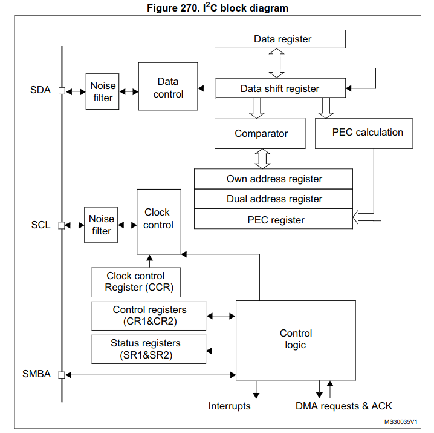

Cấu trúc điện của `SCL/SDA` nằm tại **7.17**; transaction cơ bản nằm tại **7.18**.

---

<a id="muc-07-17"></a>
## 7.17. SDA / SCL và Open-Drain

Trên STM32F1:

```text
I2C_SCL
→ Alternate Function Output Open-Drain

I2C_SDA
→ Alternate Function Output Open-Drain
```

Bus cần pull-up:

```text
 VDD                  VDD
  │                    │
 RPU                  RPU
  │                    │
 SCL                  SDA
  │                    │
  ├── Master           ├── Master
  ├── Slave A          ├── Slave A
  └── Slave B          └── Slave B
```

Mỗi thiết bị chỉ:

```text
kéo line xuống Low
hoặc
nhả line về High-Z
```

Mức High được tạo bởi pull-up.

Open-Drain cho phép nhiều thiết bị dùng chung line mà không có trường hợp một output chủ động kéo High trong khi output khác kéo Low. Đây là nền tảng cho ACK/NACK, clock stretching và arbitration; các cơ chế này được giải thích lần lượt tại **7.18, 7.24, 7.25**.

Giá trị pull-up thực tế phụ thuộc điện dung bus, tần số SCL, điện áp và yêu cầu rise time; không dùng một giá trị cố định cho mọi bus.

### Tính điện trở Pull-Up cho I2C

Điện trở pull-up `Rp` cần nằm trong khoảng:

```text
Rp(min) ≤ Rp ≤ Rp(max)
```

Giới hạn dưới bảo đảm thiết bị vẫn có thể kéo bus xuống Low với dòng sink phù hợp. Giới hạn trên bảo đảm SDA/SCL tăng lên High đủ nhanh so với yêu cầu rise time của bus.

#### Giới hạn dưới — `Rp(min)`

Công thức:

```text
Rp(min) = (VDD - VOL(max)) / IOL
```

Trong đó:

```text
VDD
→ điện áp pull-up của bus

VOL(max)
→ điện áp Low tối đa vẫn được bảo đảm

IOL
→ dòng sink mà output được bảo đảm vẫn giữ VOL trong giới hạn
```

Không nên hiểu `IOL` là absolute maximum current của chân. Khi thiết kế thực tế phải kiểm tra datasheet của tất cả thiết bị trên bus, đặc biệt thiết bị có khả năng kéo Low yếu nhất.

Với Standard-mode và Fast-mode, giá trị thường dùng theo I2C specification là:

```text
VOL(max) = 0.4 V
IOL      = 3 mA
```

Ví dụ với:

```text
VDD = 3.3 V
```

ta có:

```text
Rp(min) = (3.3 - 0.4) / 0.003 ≈ 966.7 Ω ≈ 1 kΩ
```

Nếu `Rp` quá nhỏ:

```text
Rp ↓
→ sink current ↑
→ VOL có thể vượt specification
→ thiết bị có thể không còn bảo đảm mức Low hợp lệ
```

#### Giới hạn trên — `Rp(max)`

SDA/SCL cùng điện dung bus tạo thành mạch RC khi line được release:

```text
VDD
 │
 Rp
 │
 ├──── SDA / SCL
 │
 Cb
 │
GND
```

Công thức:

```text
Rp(max) = tr(max) / (0.8473 × Cb)
```

Trong đó:

```text
tr(max)
→ rise time tối đa cho phép

Cb
→ tổng điện dung của bus
→ gồm trace PCB, dây dẫn, connector và capacitance của các pin
```

Hệ số `0.8473` xuất phát từ đáp ứng RC khi đo rise time từ khoảng `0.3 × VDD` đến `0.7 × VDD`.

Các giá trị cần nhớ:

| I2C mode | Tốc độ điển hình | `tr(max)` | `Cb(max)` |
|---|---:|---:|---:|
| Standard-mode | 100 kHz | 1000 ns | 400 pF |
| Fast-mode | 400 kHz | 300 ns | 400 pF |
| Fast-mode Plus | 1 MHz | 120 ns | 550 pF |

Trong phạm vi STM32F1 của tài liệu này, hai mode cần tập trung là Standard-mode và Fast-mode.

Ví dụ Fast-mode:

```text
tr(max) = 300 ns
Cb      = 150 pF
```

ta có:

```text
Rp(max) = 300 ns / (0.8473 × 150 pF) ≈ 2.36 kΩ
```

Nếu `Rp` quá lớn:

```text
Rp ↑
→ RC time constant ↑
→ cạnh lên chậm
→ SDA/SCL có thể không đạt mức High đúng timing
```

#### Ví dụ chọn giá trị thực tế

Với:

```text
VDD       = 3.3 V
Fast-mode = 400 kHz
Cb        = 150 pF
```

ta có:

```text
Rp(min) ≈ 1.0 kΩ
Rp(max) ≈ 2.36 kΩ
```

Do đó:

```text
1.0 kΩ ≤ Rp ≤ 2.36 kΩ
```

Có thể chọn một giá trị chuẩn nằm trong khoảng, ví dụ:

```text
1.5 kΩ
hoặc
2.2 kΩ
```

Không nên mặc định:

```text
I2C
→ luôn dùng 4.7 kΩ
hoặc
→ luôn dùng 10 kΩ
```

vì giá trị đúng phụ thuộc vào `VDD`, tốc độ bus, `Cb`, rise time và khả năng sink của các thiết bị.

Có thể nhớ bản chất:

```text
Rp quá nhỏ
→ dòng khi bus Low quá lớn

Rp quá lớn
→ cạnh lên quá chậm

Cb càng lớn
→ Rp(max) càng nhỏ

bus càng nhanh
→ tr(max) càng nhỏ
→ cần pull-up mạnh hơn
```

---


<a id="muc-07-18"></a>
## 7.18. START / STOP / Data / Address / R/W / ACK / NACK

I2C chỉ có hai tín hiệu vật lý:

```text
SCL
→ Serial Clock

SDA
→ Serial Data
```

`START`, `STOP`, bit dữ liệu và `ACK/NACK` không phải các dây tín hiệu riêng; chúng là **điều kiện hoặc giai đoạn của giao dịch trên hai đường SCL/SDA**.

Do SDA/SCL dùng Open-Drain như đã trình bày tại **7.17**, một thiết bị trên bus về bản chất chỉ:

```text
kéo line xuống Low
hoặc
release line để pull-up đưa line lên High
```

Không nên hiểu I2C theo kiểu các thiết bị chủ động lái cả High và Low như Push-Pull.

### I2C không có CPOL / CPHA như SPI

SPI cho phép cấu hình `CPOL` và `CPHA` để xác định mức nghỉ của clock và cạnh `SCK` dùng để Sample/Shift dữ liệu. Vì vậy SPI có 4 mode cơ bản.

I2C không có cơ chế `CPOL/CPHA`. Timing giữa `SDA` và `SCL` được protocol quy định theo một quy tắc chung:

```text
SCL = Low
→ SDA được phép thay đổi
→ Transmitter chuẩn bị bit tiếp theo

SCL = High
→ SDA phải ổn định
→ dữ liệu được coi là hợp lệ để Receiver lấy mẫu
```

Trong khoảng `SCL = Low`, Transmitter được phép thay đổi SDA để chuẩn bị bit kế tiếp. Tuy nhiên, SDA vẫn phải đáp ứng các yêu cầu timing như setup time và hold time; không nên hiểu rằng SDA có thể thay đổi tùy ý tới sát thời điểm SCL lên High.

Trong khoảng `SCL = High`, SDA phải giữ ổn định đối với một bit dữ liệu thông thường.

Hai ngoại lệ quan trọng là:

```text
SCL High + SDA: High → Low
→ START hoặc Repeated START

SCL High + SDA: Low → High
→ STOP
```

Có thể nhớ ngắn gọn:

```text
I2C:

SCL LOW
→ CHANGE / SETUP

SCL HIGH
→ DATA VALID

SCL HIGH + SDA ↓
→ START / Repeated START

SCL HIGH + SDA ↑
→ STOP
```

### START condition

Master bắt đầu một transaction bằng:

```text
SCL = High
SDA: High → Low
```

```text
SDA: ‾‾‾‾\____
          ↑
        START
SCL: ‾‾‾‾‾‾‾‾
```

Sau START, các Slave theo dõi address phase; chỉ Slave có địa chỉ phù hợp mới ACK và tham gia transaction.

### STOP condition

Master kết thúc transaction và trả bus về trạng thái rảnh bằng:

```text
SCL = High
SDA: Low → High
```

```text
SDA: ____/‾‾‾‾
         ↑
        STOP
SCL: ‾‾‾‾‾‾‾‾
```

Ngoài STOP, Master cũng có thể phát **Repeated START** để bắt đầu transaction tiếp theo mà không nhả bus; xem **7.26**.

### Byte và ACK/NACK

I2C truyền một byte dữ liệu theo thứ tự:

```text
bit 7
→ bit 6
→ ...
→ bit 0
```

tức:

```text
MSB First
```

Sau 8 bit luôn có **clock thứ 9** dành cho ACK/NACK.

```text
8 data/address bits
        ↓
clock thứ 9
        ↓
ACK hoặc NACK
```

Bên nhận tạo phản hồi:

```text
Receiver kéo SDA Low
→ ACK

Receiver release SDA
→ pull-up giữ SDA High
→ NACK
```

Không nên hiểu rằng bên nhận luôn bắt buộc phải ACK. `NACK` cũng là một phản hồi hợp lệ, ví dụ:

```text
Slave không nhận address
Slave chưa sẵn sàng nhận thêm data
Master Receiver đã nhận byte cuối và muốn kết thúc
```

### Address + R/W trong I2C 7-bit

Address phase có dạng:

```text
[A6 A5 A4 A3 A2 A1 A0 R/W]
```

```text
R/W = 0
→ Master Write
→ Master truyền data, Slave nhận

R/W = 1
→ Master Read
→ Slave truyền data, Master nhận
```

Cách phân biệt 7-bit Slave address và address byte được trình bày chi tiết tại **7.19**.

### I2C không bắt buộc mọi Slave phải có Register Address

I2C chuẩn hóa cách truyền dữ liệu trên bus như:

```text
START
→ Slave Address + R/W
→ ACK/NACK
→ Data byte
→ STOP / Repeated START
```

Nhưng I2C **không quy định các Data byte sau address phase phải có ý nghĩa gì**. Cấu trúc protocol ở tầng thiết bị do datasheet của từng Slave định nghĩa.

Vì vậy không nên mặc định mọi thiết bị I2C đều có transaction dạng:

```text
Slave Address
→ Register Address
→ Data
```

Một số dạng thường gặp:

#### 1. Không có Register Address

Một số thiết bị đơn giản nhận hoặc trả dữ liệu trực tiếp sau address phase.

Ví dụ PCF8574:

```text
Write:
START
→ Slave Address + W
→ Data
→ STOP
```

```text
Read:
START
→ Slave Address + R
→ Data
→ Master NACK
→ STOP
```

Ở đây không có byte Register Address riêng.

#### 2. Có Internal Address nhiều byte

Một số thiết bị, đặc biệt là EEPROM, cần nhiều byte để chọn vị trí dữ liệu bên trong.

Ví dụ AT24C256 dùng Word Address 2 byte:

```text
START
→ Slave Address + W
→ Word Address MSB
→ Word Address LSB
→ Data
→ STOP
```

Trong trường hợp EEPROM, nên gọi đây là:

```text
Word Address / Memory Address
```

thay vì mặc định gọi là Register Address.

Có thể hiểu:

```text
8-bit internal address
→ tối đa 256 giá trị địa chỉ

16-bit internal address
→ tối đa 65536 giá trị địa chỉ
```

Số bit địa chỉ thực sự được sử dụng vẫn phụ thuộc dung lượng và protocol của từng chip.

#### 3. Auto-Increment khi truyền nhiều byte

Nhiều Slave có các register hoặc vị trí memory liên tiếp và tự tăng internal address sau mỗi byte. Khi đó Master chỉ cần gửi địa chỉ bắt đầu một lần.

Ví dụ đọc nhiều register liên tiếp từ cảm biến:

```text
START
→ Slave Address + W
→ Register Address bắt đầu
→ Repeated START
→ Slave Address + R
→ Data 1
→ ACK
→ Data 2
→ ACK
→ ...
→ Data cuối
→ NACK
→ STOP
```

Ví dụ MPU6050 có các thanh ghi dữ liệu gia tốc liên tiếp bắt đầu từ `0x3B`, nên Master có thể đọc nhiều byte liên tục thay vì gửi lại Register Address cho từng byte.

Điểm cần nhớ:

```text
I2C bus protocol
→ quy định START / Address / R/W / ACK / NACK / Data / STOP

Device protocol
→ datasheet quyết định Data byte có ý nghĩa gì
```

Do đó:

> **Không phải mọi thiết bị I2C đều có Register Address. Sau address phase, ý nghĩa và số lượng các Data byte hoàn toàn phụ thuộc protocol được nhà sản xuất định nghĩa trong datasheet của Slave.**

---

### Luồng Master Write → Slave Receive

Luồng tổng quát:

```text
START
  ↓
Address + W(0)
  ↓
Slave ACK
  ↓
Data byte
  ↓
Slave ACK
  ↓
Data byte tiếp theo nếu có
  ↓
Slave ACK
  ↓
STOP hoặc Repeated START
```

#### Phía Master

Master là bên tạo SCL và truyền address/data trên SDA.

```text
1. Phát START.
2. Gửi 7-bit Slave address + W = 0.
3. Release SDA ở clock thứ 9 để Slave có thể phát ACK/NACK.
4. Nếu nhận ACK, gửi data byte.
5. Sau mỗi byte, release SDA ở clock thứ 9 để nhận ACK/NACK.
6. Khi hoàn tất, phát STOP hoặc Repeated START.
```

Về mặt điện:

```text
Master muốn gửi 0
→ kéo SDA Low

Master muốn gửi 1
→ release SDA
→ pull-up đưa SDA High
```

Nếu dùng peripheral I2C phần cứng của STM32, firmware không tự đổi GPIO Input/Output cho từng bit; I2C peripheral tự quản lý việc kéo Low hoặc release SDA.

#### Phía Slave

Các Slave theo dõi START và address phase.

```text
1. Phát hiện START.
2. Nhận Address + W.
3. Slave có address phù hợp kéo SDA Low ở clock thứ 9 để ACK.
4. Nhận từng data byte do Master truyền.
5. Sau mỗi byte nhận thành công, Slave phát ACK nếu muốn tiếp tục.
6. Transaction kết thúc khi Master phát STOP hoặc chuyển sang transaction khác bằng Repeated START.
```

Có thể nhớ:

```text
Master Write

Master
→ Address + W
→ Data
→ Data
→ ...

Slave
→ ACK
→ ACK
→ ACK
→ ...
```

---

### Luồng Master Read ← Slave Transmit

Luồng tổng quát:

```text
START
  ↓
Address + R(1)
  ↓
Slave ACK
  ↓
Slave Data
  ↓
Master ACK nếu muốn đọc tiếp
  ↓
Slave Data tiếp theo
  ↓
Master NACK ở byte cuối
  ↓
STOP hoặc Repeated START
```

#### Phía Master

Master vẫn luôn là bên tạo SCL, nhưng sau address phase nó release SDA để Slave truyền data.

```text
1. Phát START.
2. Gửi 7-bit Slave address + R = 1.
3. Release SDA ở clock thứ 9 và kiểm tra ACK/NACK từ Slave.
4. Sau ACK, tiếp tục tạo SCL nhưng release SDA để Slave điều khiển dữ liệu.
5. Sample SDA theo từng clock để nhận 8 bit data.
6. Sau mỗi byte:
   - phát ACK nếu muốn nhận thêm byte;
   - phát NACK nếu đây là byte cuối.
7. Sau byte cuối, phát STOP hoặc Repeated START.
```

Ở đây không nên hiểu là Master “chuyển SDA thành Input” theo nghĩa phải đổi GPIO mode bằng software ở từng bit. Với I2C Open-Drain, ý đúng là:

```text
Master release SDA
→ không kéo line xuống
→ Slave có thể điều khiển SDA bằng cách kéo Low hoặc release
```

#### Phía Slave

```text
1. Nhận Address + R.
2. Nếu address phù hợp, phát ACK.
3. Trong các clock data tiếp theo, Slave đặt từng bit lên SDA theo nhịp SCL do Master tạo.
4. Sau 8 bit, Slave release SDA để Master phát ACK/NACK ở clock thứ 9.
5. Nếu nhận ACK, Slave chuẩn bị byte tiếp theo.
6. Nếu nhận NACK, Slave không truyền thêm byte và chờ STOP hoặc Repeated START.
```

Điểm quan trọng:

```text
Master
→ luôn điều khiển SCL

Data direction
→ thay đổi theo R/W

Master Write
→ Master là Transmitter

Master Read
→ Master là Receiver
→ Slave là Transmitter
```

### Bàn giao quyền điều khiển SDA giữa Master và Slave

Có thể hình dung I2C như việc **bàn giao quyền kéo SDA xuống Low** giữa bên truyền dữ liệu và bên phát ACK/NACK.

Do SDA là Open-Drain, không nên hiểu quá literal rằng firmware liên tục đổi chân GPIO giữa `Input` và `Output`. Ở mức bus, mỗi thiết bị chỉ cần hai hành vi:

```text
Drive Low
→ chủ động kéo SDA xuống 0

Release SDA
→ ngừng kéo SDA xuống
→ pull-up đưa SDA lên 1 nếu không có thiết bị nào khác kéo Low
```

Với peripheral I2C phần cứng của STM32, việc kéo Low hoặc release SDA được hardware tự xử lý theo trạng thái transaction.

#### Khi Master Write

Trong 8 bit dữ liệu:

```text
Master
→ điều khiển SDA
→ truyền 8 bit

Slave
→ nhận dữ liệu
```

Sau bit thứ 8, Master phải release SDA để dành clock thứ 9 cho Receiver phản hồi:

```text
8 data bits
     ↓
Master release SDA
     ↓
clock thứ 9
     ↓
Slave kéo SDA Low
→ ACK

hoặc

Slave release SDA
→ NACK
```

Sau clock thứ 9, Slave release SDA. Master có thể:

```text
gửi byte tiếp theo
hoặc
phát STOP
hoặc
phát Repeated START
```

Luồng nhớ nhanh:

```text
Master Write:

8 bit data
Master → Slave

clock thứ 9
Slave → ACK/NACK
```

#### Khi Master Read

Trong 8 bit dữ liệu:

```text
Slave
→ điều khiển SDA
→ truyền 8 bit

Master
→ tạo SCL và nhận dữ liệu
```

Sau bit thứ 8, Slave phải release SDA để Master phát ACK/NACK ở clock thứ 9:

```text
8 data bits
     ↓
Slave release SDA
     ↓
clock thứ 9
     ↓
Master kéo SDA Low
→ ACK
→ muốn đọc thêm byte

hoặc

Master release SDA
→ NACK
→ đây là byte cuối
```

Nếu Master phát ACK:

```text
SCL trở lại Low
→ Master release SDA
→ Slave tiếp tục truyền byte kế tiếp
```

Nếu Master phát NACK:

```text
Slave không truyền thêm byte
→ Master phát STOP
hoặc
→ Master phát Repeated START
```

Luồng nhớ nhanh:

```text
Master Read:

8 bit data
Slave → Master

clock thứ 9
Master → ACK/NACK
```

Do đó có thể nhớ tính đối xứng:

| Giai đoạn | Master Write | Master Read |
|---|---|---|
| 8 bit dữ liệu | Master truyền | Slave truyền |
| Clock thứ 9 | Slave phát ACK/NACK | Master phát ACK/NACK |
| ACK | Receiver kéo SDA Low | Receiver kéo SDA Low |
| NACK | Receiver release SDA | Receiver release SDA |
| SCL | Master điều khiển | Master điều khiển |

Điểm cốt lõi:

> **Trong I2C, bên đang nhận byte luôn là bên phát ACK/NACK ở clock thứ 9. Việc “bàn giao SDA” thực chất là các thiết bị lần lượt kéo SDA Low hoặc release SDA theo đúng thời điểm của transaction.**

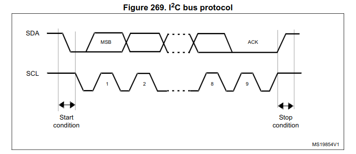

Phần này mô tả **logic transaction trên bus**. Trình tự flag/register cụ thể của STM32F1 khi Master Transmit/Receive được trình bày riêng tại **7.27**.

---

<a id="muc-07-19"></a>
## 7.19. 7-bit / 10-bit Addressing

### 7-bit address

Address phase có dạng:

```text
[A6 A5 A4 A3 A2 A1 A0 R/W]
```

```text
R/W = 0
→ Write

R/W = 1
→ Read
```

Ví dụ:

```text
7-bit Slave address = 0x50

Write address byte = (0x50 << 1) | 0 = 0xA0
Read  address byte = (0x50 << 1) | 1 = 0xA1
```

Phải phân biệt:

```text
7-bit Slave address
≠
8-bit Address + R/W byte
```

### 10-bit address

STM32F1 cũng hỗ trợ 10-bit addressing; sequence có thêm 10-bit header và phần địa chỉ còn lại. Flag `ADD10` liên quan tới sequence này.

Chương này ưu tiên nắm chắc 7-bit addressing; các sequence I2C tiếp theo dùng cách biểu diễn 7-bit address.

---

<a id="muc-07-20"></a>
## 7.20. Master / Slave / Transmitter / Receiver

I2C có hai cặp vai trò độc lập:

```text
Master / Slave
→ ai khởi tạo và điều khiển transaction / SCL

Transmitter / Receiver
→ ai đang truyền hoặc nhận data trong giai đoạn hiện tại
```

Bốn tổ hợp cần nhận diện:

| Vai trò | Ý nghĩa |
|---|---|
| Master Transmitter | Master điều khiển transaction và gửi data |
| Master Receiver | Master điều khiển transaction nhưng nhận data |
| Slave Transmitter | Slave được chọn và gửi data |
| Slave Receiver | Slave được chọn và nhận data |

Quan hệ với bit `R/W` trong address phase:

```text
Address + W
→ Master Transmitter
→ Slave Receiver

Address + R
→ Master Receiver
→ Slave Transmitter
```

Luồng START, Address, ACK/NACK, Data và STOP đã được trình bày đầy đủ tại **7.18**, nên mục này không lặp lại transaction sequence.

Các bit trạng thái trong `I2C_SR2`:

```text
MSL
→ Master/Slave state

TRA
→ Transmitter/Receiver state

BUSY
→ bus đang bận
```

Sequence register-level của Master Transmit/Receive nằm tại **7.27**.

---

<a id="muc-07-21"></a>
## 7.21. Standard Mode / Fast Mode

Trong phạm vi chương:

```text
Standard-mode
→ tới 100 kHz

Fast-mode
→ tới 400 kHz
```

Peripheral input clock tối thiểu:

```text
Standard-mode
→ 2 MHz

Fast-mode
→ 4 MHz
```

Fast-mode hỗ trợ hai duty ratio:

```text
DUTY = 0
→ tLOW / tHIGH = 2

DUTY = 1
→ tLOW / tHIGH = 16 / 9
```

Cách tính `CCR/TRISE` cho các mode được tập trung tại **7.22**. Tốc độ bus thực tế còn chịu ảnh hưởng của pull-up, bus capacitance, rise time và clock stretching.

---

<a id="muc-07-22"></a>
## 7.22. I2C Clock: CR2.FREQ / CCR / TRISE

I2C1/I2C2 nằm trên APB1, vì vậy timing dựa trên `PCLK1`. Cách xác định `PCLK1` đã được trình bày tại **Chương 2**.

Ba cấu hình chính:

```text
I2C_CR2.FREQ
I2C_CCR
I2C_TRISE
```

### `CR2.FREQ`

`FREQ` chứa giá trị peripheral input clock theo MHz:

```text
PCLK1 = 36 MHz
→ FREQ = 36
```

Không ghi tốc độ SCL mong muốn vào `FREQ`.

### `CCR` — Standard-mode

```text
fSCL = PCLK1 / (2 × CCR)
```

Ví dụ:

```text
PCLK1 = 36 MHz
fSCL  = 100 kHz

→ CCR = 180
```

### `CCR` — Fast-mode

Với `DUTY = 0`:

```text
fSCL = PCLK1 / (3 × CCR)
```

Với `DUTY = 1`:

```text
fSCL = PCLK1 / (25 × CCR)
```

### `TRISE`

Trong Standard-mode:

```text
TRISE = FREQ + 1
```

Ví dụ:

```text
PCLK1 = 36 MHz
→ FREQ  = 36
→ TRISE = 37
```

Trong Fast-mode, `TRISE` được tính từ maximum rise time 300 ns và chu kỳ `PCLK1`.

Ví dụ Standard-mode 100 kHz với `PCLK1 = 36 MHz`:

```text
FREQ  = 36
CCR   = 180
TRISE = 37
```

---

<a id="muc-07-23"></a>
## 7.23. Các I2C Status Flag quan trọng

STM32F1 I2C dùng:

```text
I2C_SR1
I2C_SR2
```

Các flag chính:

| Nhóm | Flag | Ý nghĩa |
|---|---|---|
| Event | `SB` | START generated |
| Event | `ADDR` | Address sent/matched |
| Event | `ADD10` | 10-bit header sent |
| Event | `STOPF` | STOP detected ở Slave mode |
| Event | `BTF` | Byte Transfer Finished |
| Buffer | `RxNE` | Receive Data Register Not Empty |
| Buffer | `TxE` | Transmit Data Register Empty |
| Error | `BERR` | Bus Error |
| Error | `ARLO` | Arbitration Lost |
| Error | `AF` | Acknowledge Failure |
| Error | `OVR` | Overrun/Underrun |
| Error | `PECERR` | PEC Error |

`I2C_SR2` còn chứa state như:

```text
MSL
BUSY
TRA
GENCALL
DUALF
```

### Flag clear sequence

Một số flag không được clear bằng cách ghi `0/1` tùy ý mà yêu cầu sequence cụ thể.

`SB`:

```text
read SR1
   ↓
write DR với address
```

`ADDR`:

```text
read SR1
   ↓
read SR2
```

`STOPF` ở Slave mode:

```text
read SR1
   ↓
write CR1
```

`RxNE`:

```text
read DR
```

`TxE`:

```text
write DR
```

Các sequence Master tại **7.27** áp dụng lại đúng các quy tắc này thay vì giải thích lại cách clear flag.

---

<a id="muc-07-24"></a>
## 7.24. Clock Stretching

Clock stretching là cơ chế Slave giữ:

```text
SCL = Low
```

để trì hoãn Master khi chưa sẵn sàng tiếp tục.

```text
Master muốn tiếp tục
        ↓
Slave giữ SCL Low
        ↓
Master chờ
        ↓
Slave nhả SCL
        ↓
transaction tiếp tục
```

Cơ chế này khả thi nhờ bus Open-Drain đã trình bày tại **7.17**.

Trên STM32F1, một số trạng thái/event có thể làm peripheral giữ SCL Low trong lúc chờ software xử lý, ví dụ các tình huống liên quan `ADDR` hoặc `BTF`.

---

<a id="muc-07-25"></a>
## 7.25. Arbitration và Multi-Master

I2C cho phép nhiều Master dùng chung bus.

Arbitration dựa trên việc Master vừa phát vừa quan sát SDA:

```text
Master phát bit
      ↓
đọc lại SDA
      ↓
so sánh mức mong muốn với mức thực tế
```

Vì Open-Drain:

```text
Low
→ dominant

High
→ line được nhả
```

Nếu Master cố phát `1` nhưng đọc thấy `0`:

```text
Master mất arbitration
→ ARLO = 1
```

Open-Drain đã được giải thích tại **7.17**; mục này chỉ tập trung vào cơ chế phân xử bus.

---

<a id="muc-07-26"></a>
## 7.26. Repeated START

Repeated START là một START mới khi Master vẫn đang giữ bus, không phát STOP trước đó.

Mẫu đọc register phổ biến:

```text
START
 ↓
Address + W
 ↓
Register Address
 ↓
Repeated START
 ↓
Address + R
 ↓
Data
 ↓
NACK
 ↓
STOP
```

Ví dụ:

```text
Slave address = 0x68
Register      = 0x75
```

Master thực hiện:

```text
START
→ 0x68 + Write
→ gửi 0x75
→ Repeated START
→ 0x68 + Read
→ nhận data
→ NACK
→ STOP
```

Định nghĩa START/STOP/ACK/NACK đã nằm tại **7.18**; mục này chỉ mô tả cách nối hai address phase mà không nhả bus.

---

<a id="muc-07-27"></a>
## 7.27. Master Transmit / Master Receive

Mục **7.18** đã giải thích logic transaction trên bus. Mục này chỉ tập trung vào **trình tự flag/register của STM32F1** khi thực hiện Master Transmit và Master Receive.

### Master Transmit

```text
BUSY = 0
  ↓
START = 1
  ↓
SB = 1
  ↓
read SR1
  ↓
write Address + W vào DR
  ↓
ADDR = 1
  ↓
read SR1 → read SR2
  ↓
write Data
  ↓
TxE / BTF
  ↓
...
  ↓
BTF
  ↓
STOP = 1
```

Pseudocode:

```c
I2C1->CR1 |= I2C_CR1_START;

while (!(I2C1->SR1 & I2C_SR1_SB))
{
}

(void)I2C1->SR1;
I2C1->DR = (slave_addr << 1);

while (!(I2C1->SR1 & I2C_SR1_ADDR))
{
}

(void)I2C1->SR1;
(void)I2C1->SR2;

while (!(I2C1->SR1 & I2C_SR1_TXE))
{
}

I2C1->DR = data;

while (!(I2C1->SR1 & I2C_SR1_BTF))
{
}

I2C1->CR1 |= I2C_CR1_STOP;
```

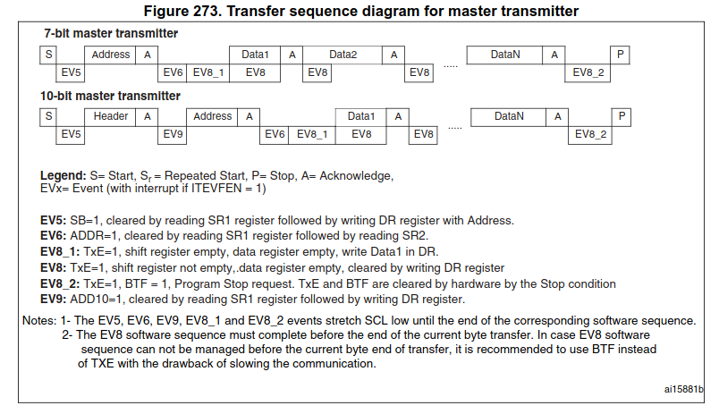

### Master Receive

Ở mức bus, quy tắc ACK/NACK của Master Receiver đã được trình bày tại **7.18**. Trên STM32F1, thứ tự thao tác `ACK`, `ADDR`, `STOP`, `RxNE` và `BTF` còn phụ thuộc số byte cần nhận.

Receive 1 byte:

```text
START
 ↓
Address + R
 ↓
ADDR = 1
 ↓
ACK = 0
 ↓
clear ADDR
 ↓
STOP = 1
 ↓
wait RxNE
 ↓
read DR
```

Điểm cần nhớ:

```text
ACK phải được clear trước khi clear ADDR
```

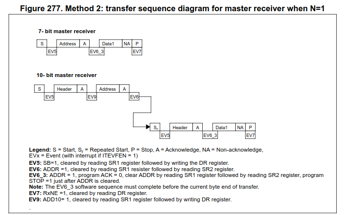

Receive 2 byte dùng sequence đặc biệt:

```text
POS = 1
ACK = 0
clear ADDR
      ↓
wait BTF
      ↓
STOP = 1
      ↓
read DR
read DR
```

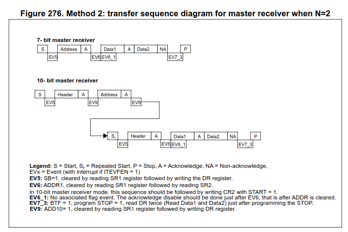

Với `N > 2`, giữ ACK cho các byte đầu rồi xử lý `BTF/ACK/STOP` đúng thời điểm khi tiến tới các byte cuối.

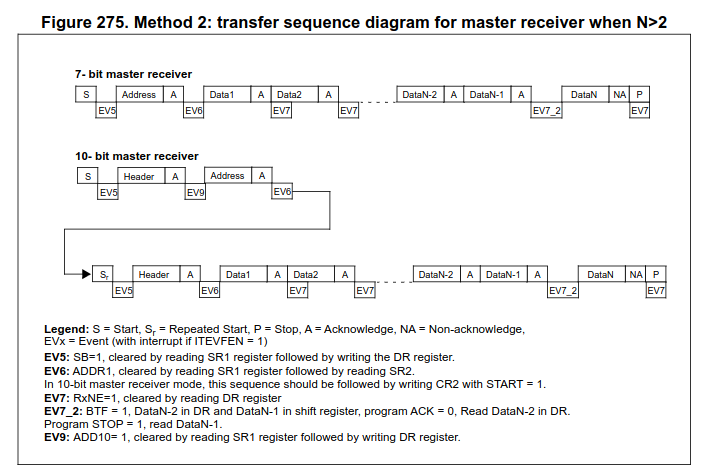

Do sequence `1 byte`, `2 byte` và `N > 2` khác nhau, không dùng một receive sequence duy nhất cho mọi độ dài.

---

<a id="muc-07-28"></a>
## 7.28. I2C Interrupt / DMA

Interrupt của I2C được chia theo nhóm:

```text
ITEVFEN
→ Event interrupt

ITBUFEN
→ Buffer interrupt

ITERREN
→ Error interrupt
```

Ví dụ nguồn:

```text
Event
→ SB, ADDR, BTF, STOPF...

Buffer
→ TxE, RxNE

Error
→ BERR, ARLO, AF, OVR, PECERR...
```

I2C thường có:

```text
I2Cx_EV_IRQn
→ Event IRQ

I2Cx_ER_IRQn
→ Error IRQ
```

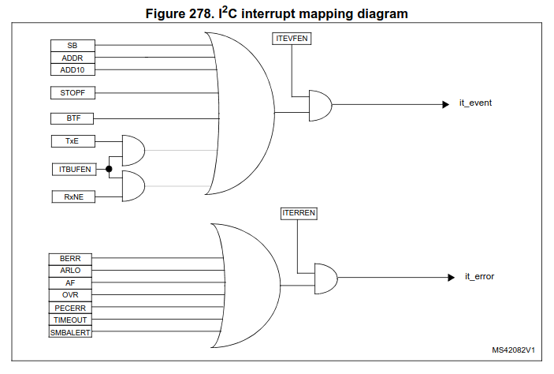

Cơ chế NVIC/ISR thuộc **Chương 4**.

DMA trao đổi data với `I2C_DR`:

```text
I2C_DR
  ↕
 DMA
  ↕
SRAM buffer
```

DMA giảm số lần CPU phục vụ `TxE/RxNE`, nhưng START, address phase, ACK/NACK, STOP, Repeated START và error handling vẫn phải được quản lý đúng. Chi tiết DMA controller thuộc **Chương 9**.

---

<a id="muc-07-29"></a>
## 7.29. Quy trình cấu hình I2C

Ví dụ mục tiêu:

```text
I2C1
Master
Standard-mode
100 kHz
PCLK1 = 36 MHz
```

Trình tự:

```text
1. Enable GPIO + I2C clock
2. Cấu hình SCL/SDA Open-Drain + pull-up theo 7.17
3. PE = 0 khi cấu hình timing
4. Ghi CR2.FREQ theo PCLK1
5. Ghi CCR theo mode/tần số
6. Ghi TRISE
7. PE = 1
8. Thực hiện transaction theo 7.18 / 7.23 / 7.27
```

Với ví dụ:

```text
PB6 → SCL
PB7 → SDA

PCLK1 = 36 MHz

FREQ  = 36
CCR   = 180
TRISE = 37
```

Nếu dùng I2C1 remap thì cấu hình AFIO theo **Chương 3**.

Luồng:

```text
RCC
 ↓
GPIO Open-Drain + Pull-Up
 ↓
PE = 0
 ↓
FREQ / CCR / TRISE
 ↓
PE = 1
 ↓
START / Address / Data / STOP
```

Mục này chỉ tổng hợp **thứ tự cấu hình**; công thức timing không lặp lại vì đã nằm tại **7.22**.

---

<a id="muc-07-30"></a>
## 7.30. So sánh SPI và I2C

Bảng này tập trung toàn bộ các điểm so sánh giữa SPI và I2C để tránh lặp lại ở các mục transaction riêng.

| Đặc điểm | SPI | I2C |
|---|---|---|
| Dây dữ liệu | `MOSI` + `MISO` riêng biệt | Một đường `SDA` hai chiều |
| Full-Duplex | Có, truyền và nhận đồng thời | Không theo kiểu Full-Duplex của SPI |
| Chọn Slave | Dùng `CS/NSS` riêng cho từng Slave | Dùng địa chỉ trên bus |
| Kiểu điện | Thường Push-Pull | Open-Drain + Pull-Up |
| ACK/NACK | Không có cơ chế ACK/NACK chuẩn của bus | Có ACK/NACK sau mỗi byte |
| Timing dữ liệu | Sample/Shift theo cạnh `SCK`, phụ thuộc `CPOL/CPHA` | `SDA` thay đổi khi `SCL = Low`, phải ổn định khi `SCL = High` |
| Đọc dữ liệu | Master vẫn phải phát clock và thường gửi dummy byte/frame | Master release SDA, tiếp tục phát SCL để Slave truyền dữ liệu |
| Đặc trưng chính | Nhanh, Full-Duplex, logic đơn giản hơn nhưng tốn nhiều dây/CS | Ít dây, nhiều Slave dùng chung bus theo address nhưng protocol phức tạp hơn |

### Khác nhau về Sample / Shift

SPI xác định thời điểm Sample và Shift bằng các **cạnh SCK**:

```text
CPOL
→ mức nghỉ của SCK

CPHA
→ chọn cạnh dùng để Sample / Shift
```

Do đó hai thiết bị SPI phải thống nhất mode.

I2C không có `CPOL/CPHA`:

```text
SCL Low
→ SDA được phép thay đổi để chuẩn bị bit mới

SCL High
→ SDA phải ổn định
→ dữ liệu ở trạng thái hợp lệ để Receiver lấy mẫu
```

Ngoại lệ:

```text
SCL High + SDA ↓
→ START / Repeated START

SCL High + SDA ↑
→ STOP
```

Cách trả lời ngắn khi phỏng vấn:

> **SPI xác định thời điểm Sample và Shift bằng các cạnh SCK theo CPOL/CPHA. I2C không có CPOL/CPHA; SDA được thay đổi khi SCL Low và phải ổn định khi SCL High. START và STOP là các trường hợp đặc biệt khi SDA thay đổi trong lúc SCL đang High.**

### Khác nhau khi Master đọc dữ liệu

Với SPI Full-Duplex:

```text
Master muốn nhận data
→ vẫn phải phát SCK
→ đồng thời một bit cũng được shift ra MOSI
→ thường dùng dummy byte/frame
```

Với I2C Master Read:

```text
Master muốn nhận data
→ release SDA
→ vẫn tiếp tục phát SCL
→ Slave truyền data trên SDA
```

Khác biệt cốt lõi:

```text
SPI
→ MOSI và MISO là hai đường dữ liệu riêng

I2C
→ SDA là một đường dữ liệu hai chiều Open-Drain
```

Không nên kết luận giao thức nào “tốt hơn” chỉ từ khác biệt này; đây là hai kiến trúc bus khác nhau với các đánh đổi khác nhau.

### Tư duy lựa chọn

```text
SPI
→ ưu tiên throughput / Full-Duplex
→ chấp nhận nhiều signal hơn

I2C
→ ưu tiên ít dây
→ nhiều thiết bị dùng chung bus theo address
```

Các hàng trong bảng chỉ tổng hợp những cơ chế đã được định nghĩa ở các mục trước, không tạo thêm định nghĩa mới.

---

<a id="muc-07-31"></a>
## 7.31. Câu hỏi tự kiểm tra

### SPI

1. Master và Slave khác nhau ở vai trò tạo `SCK` như thế nào?
2. `NSS` và `CS` được dùng theo nghĩa nào trong chương?
3. Vì sao SPI Full-Duplex truyền và nhận đồng thời?
4. Với `PCLK2 = 72 MHz` và prescaler `/8`, `SCK` bằng bao nhiêu?
5. `CPOL` và `CPHA` điều khiển hai phần nào của timing?
6. `DFF` và `LSBFIRST` điều khiển gì?
7. Software NSS và Hardware NSS khác nhau ở cách điều khiển chip-select như thế nào?
8. `TXE`, `RXNE`, `BSY` có ý nghĩa gì?
9. Vì sao Master muốn đọc vẫn phải transmit dummy data?
10. `OVR` được clear theo sequence nào?
11. Trước khi đưa CS High sau frame cuối phải bảo đảm điều gì?

### I2C

12. Vì sao `SCL/SDA` dùng Open-Drain và cần pull-up?
13. START condition và STOP condition được tạo như thế nào?
14. ACK và NACK khác nhau ở trạng thái SDA tại xung thứ 9 ra sao?
15. 7-bit Slave address và byte `Address + R/W` khác nhau như thế nào?
16. Master/Slave khác Transmitter/Receiver ở ý nghĩa nào?
17. Standard-mode và Fast-mode có tốc độ tối đa bao nhiêu?
18. `CR2.FREQ`, `CCR`, `TRISE` đóng vai trò gì?
19. `ADDR` được clear bằng sequence nào?
20. Clock stretching là gì?
21. Arbitration hoạt động dựa trên nguyên tắc nào?
22. Repeated START dùng khi nào?
23. Hãy mô tả sequence đọc một register của sensor.
24. Khi nhận byte cuối, Master dùng ACK hay NACK?
25. Vì sao receive 1 byte, 2 byte và nhiều hơn 2 byte trên STM32F1 không dùng cùng một sequence?

---

## 7.32. Tóm tắt

### SPI

```text
Master
├── SCK
├── MOSI
├── MISO
└── NSS / CS
```

```text
SCK
→ PCLKx / baud-rate prescaler

CPOL + CPHA
→ timing mode

DFF + LSBFIRST
→ frame format

SPI_DR
→ data path

TXE / RXNE / BSY
→ trạng thái transfer
```

Full-Duplex:

```text
write SPI_DR
      ↓
shift TX + shift RX
      ↓
read SPI_DR
```

### I2C

```text
SCL + SDA
→ Open-Drain
→ pull-up
```

Transaction:

```text
START
 ↓
Address + R/W
 ↓
ACK
 ↓
Data
 ↓
ACK / NACK
 ↓
STOP
```

Timing:

```text
PCLK1
 ↓
CR2.FREQ
 ↓
CCR
 ↓
TRISE
 ↓
SCL
```

State/flag cần nhận diện:

```text
SB
ADDR
BTF
TxE
RxNE
BUSY
BERR
ARLO
AF
```

> **SPI cần xác định đúng clock, `CPOL/CPHA`, frame format và hiểu Full-Duplex data path. I2C cần hiểu Open-Drain, addressing, START/STOP, ACK/NACK, Repeated START và sequence xử lý flag của STM32F1. Các mục quy trình và ví dụ chỉ áp dụng lại những cơ chế này.**

[↑ Về mục lục](#muc-luc)


---

<a id="chuong-08"></a>
# 8. ADC

Chương này dùng một mục chính cho mỗi khái niệm của ADC. Các mục quy trình và ví dụ chỉ áp dụng lại cơ chế đã nêu và dẫn chiếu về mục chính để tránh lặp nội dung.

Luồng tổng quát:

```text
Analog input
    ↓
ADC channel
    ↓
Sampling
    ↓
12-bit conversion
    ↓
Conversion result
    ↓
Polling / Interrupt / DMA
```

STM32F10xxx dùng ADC kiểu **successive approximation** với độ phân giải 12-bit. Các cơ chế chính gồm Regular Group, Injected Group, Single/Continuous Conversion, Scan Mode, Discontinuous Mode, software/external trigger, Analog Watchdog, calibration, interrupt, DMA và Dual ADC Mode tùy device.

## Quy ước thuật ngữ

| Thuật ngữ dùng trong chương | Cách hiểu |
|---|---|
| **ADC** | Analog-to-Digital Converter; khối chuyển đổi tín hiệu analog thành mã số. |
| **analog input** | Điện áp analog đưa vào ADC qua external channel hoặc internal channel. |
| **ADC channel** | Ngõ vào được analog multiplexer chọn để đưa tới ADC core; một channel không phải một ADC độc lập. |
| **external channel** | ADC channel nối tới pin ngoài, ví dụ `ADCx_IN0...ADCx_IN15` tùy device/ADC instance. |
| **internal channel** | Nguồn analog bên trong MCU; ADC1 có Temperature Sensor và `VREFINT`. |
| **ADC code / conversion result** | Giá trị số do ADC tạo ra sau conversion; với ADC 12-bit thông thường nằm trong `0...4095` trước các xử lý đặc biệt như injected offset. |
| **reference voltage** | Dải tham chiếu `VREF-...VREF+` dùng để ánh xạ analog input sang ADC code. |
| **`ADCCLK`** | Clock cấp cho ADC sau ADC prescaler từ `PCLK2`. |
| **ADC prescaler / `ADCPRE`** | Bộ chia từ `PCLK2` để tạo `ADCCLK`. |
| **sampling time** | Thời gian ADC nối channel vào mạch sample-and-hold trước giai đoạn chuyển đổi. |
| **conversion time** | Tổng thời gian từ sampling tới khi conversion result hoàn tất; với STM32F1 bằng sampling time cộng 12.5 chu kỳ `ADCCLK`. |
| **Regular Group** | Nhóm conversion thông thường, tối đa 16 rank. |
| **Injected Group** | Nhóm conversion có thể chen vào Regular Group theo cơ chế injected conversion, tối đa 4 rank. |
| **conversion sequence** | Danh sách channel được ADC chuyển đổi theo thứ tự. |
| **rank** | Vị trí của một channel trong conversion sequence; không phải priority. |
| **Single Conversion** | Một trigger chạy sequence theo cấu hình rồi dừng. |
| **Continuous Conversion** | Sau khi bắt đầu, ADC tiếp tục conversion theo cấu hình mà không cần trigger mới cho mỗi lần lặp. |
| **Scan Mode** | ADC tự lần lượt chuyển đổi nhiều rank trong một group. |
| **Discontinuous Mode** | Chia một conversion sequence thành các nhóm nhỏ, mỗi trigger chỉ chạy một phần sequence. |
| **software trigger / software start** | Conversion được bắt đầu bằng bit software như `SWSTART` hoặc `JSWSTART`. |
| **external trigger** | Conversion được bắt đầu bởi event phần cứng như Timer hoặc EXTI theo lựa chọn trigger của ADC. |
| **`EOC`** | End Of Conversion; flag cho Regular conversion result. |
| **`JEOC`** | Injected End Of Conversion; flag báo Injected Group hoàn tất. |
| **data alignment** | Cách đặt conversion result 12-bit trong data register 16-bit: Right Alignment hoặc Left Alignment. |
| **calibration** | Self-calibration của ADC để giảm sai số nội bộ; dùng `RSTCAL` và `CAL`. |
| **Analog Watchdog** | Khối phần cứng so sánh conversion result với ngưỡng thấp/cao. |
| **DMA request** | Yêu cầu DMA do Regular conversion tạo ra để chuyển `ADC_DR` sang memory. |
| **Dual ADC Mode** | Cơ chế phối hợp ADC1/ADC2 ở các mode simultaneous, interleaved... tùy device. |

Tên register/bit giữ nguyên ký hiệu STM32F1 như `ADC_CR1.SCAN`, `ADC_CR2.CONT`, `ADC_DR`, `ADC_JDRx`, `ADC_SQRx`, `ADC_JSQR`, `EOC`, `JEOC`.

---

<a id="muc-08-01"></a>
## 8.1. ADC là gì?

`ADC` là:

```text
Analog-to-Digital Converter
```

ADC lấy một analog input, sample giá trị đó và tạo conversion result dạng số:

```text
Analog input
    ↓
Sample
    ↓
Quantize
    ↓
Digital code
```

STM32F10xxx ADC có độ phân giải:

```text
12 bit
```

Các ADC channel được chọn qua analog multiplexer rồi đưa vào ADC core:

```text
ADC_IN0 ─┐
ADC_IN1 ─┤
ADC_IN2 ─┤
...      ├──→ Analog MUX ──→ ADC core
ADC_IN15 ┘
```

Vì vậy:

```text
ADC channel
≠
một ADC độc lập
```

External channel và GPIO tương ứng được trình bày tại **8.5**; Temperature Sensor và `VREFINT` được trình bày tại **8.18**.

---

<a id="muc-08-02"></a>
## 8.2. Độ phân giải 12-bit và giá trị ADC

ADC 12-bit có:

```text
2^12 = 4096 mức
```

Với Regular conversion thông thường, ADC code nằm trong:

```text
0 ... 4095
```

Nếu:

```text
VREF- = 0 V
```

có thể ước lượng điện áp theo mô hình lý tưởng:

```text
VIN ≈ (ADC_Code × VREF+) / 4095
```

Tổng quát:

```text
VIN ≈ VREF- + (ADC_Code × (VREF+ - VREF-)) / 4095
```

Ví dụ:

```text
VREF- = 0 V
VREF+ = 3.3 V
ADC_Code = 2048

→ VIN ≈ 1.65 V
```

`ADC_DR` chứa **conversion result**, không chứa đơn vị Volt. Muốn đổi ADC code sang điện áp phải biết reference voltage thực tế tại thời điểm đo; các tín hiệu reference và analog supply nằm tại **8.3**.

Sai số thực tế còn phụ thuộc ADC accuracy, reference, nguồn tín hiệu, sampling time và nhiễu; công thức trên chỉ là mô hình lượng tử hóa lý tưởng.

---

<a id="muc-08-03"></a>
## 8.3. VREF+ / VREF- / VDDA / VSSA

ADC dùng miền nguồn analog:

```text
VDDA
→ Analog Supply

VSSA
→ Analog Ground

VREF+
→ Positive ADC Reference

VREF-
→ Negative ADC Reference
```

Trong phạm vi nội dung chương:

```text
2.4 V ≤ VDDA ≤ 3.6 V
```

Analog input phải nằm trong:

```text
VREF- ≤ VIN ≤ VREF+
```

Nếu package có chân `VREF-`:

```text
VREF- = VSSA
```

và:

```text
2.4 V ≤ VREF+ ≤ VDDA
```

Khả năng đưa `VREF+`/`VREF-` ra chân riêng phụ thuộc MCU và package.

Reference voltage là chuẩn mà ADC dùng để ánh xạ điện áp sang ADC code:

```text
reference thay đổi
→ cùng VIN có thể cho ADC code khác
```

Vì vậy độ ổn định của `VDDA`, `VREF+` và `VSSA` ảnh hưởng trực tiếp tới phép đo.

---

<a id="muc-08-04"></a>
## 8.4. ADC Clock và Prescaler

`ADCCLK` được tạo từ `PCLK2` qua ADC prescaler trong RCC:

```text
PCLK2
  ↓ ADCPRE
ADCCLK
```

Các hệ số chia:

```text
/2
/4
/6
/8
```

Giới hạn cần giữ:

```text
ADCCLK ≤ 14 MHz
```

Ví dụ với:

```text
PCLK2 = 72 MHz
```

thì:

```text
ADCPRE = /6
→ ADCCLK = 12 MHz
→ hợp lệ
```

còn:

```text
ADCPRE = /4
→ ADCCLK = 18 MHz
→ vượt giới hạn
```

Nguồn `PCLK2` và cơ chế `ADCPRE` đã được trình bày ở **Chương 2**; tại đây chỉ cần xác định `ADCCLK` trước khi tính ADC timing.

---

<a id="muc-08-05"></a>
## 8.5. ADC Channel và GPIO Analog Mode

External ADC channel có dạng:

```text
ADCx_IN0
ADCx_IN1
...
ADCx_IN15
```

Pin tương ứng phụ thuộc device, ADC instance và package, vì vậy phải kiểm tra pinout của MCU đang dùng.

GPIO nối tới external ADC channel phải cấu hình:

```text
Analog mode
```

Trên STM32F1:

```text
MODE = 00
CNF  = 00
```

Cơ chế Analog mode đã được trình bày tại **3.14**. Trong Chương 8 chỉ cần nhớ đường tín hiệu:

```text
Analog source
     ↓
GPIO ở Analog mode
     ↓
ADC channel
     ↓
ADC core
```

Không dùng digital input mode cho pin ADC chỉ vì tín hiệu đi qua GPIO pin; ADC cần analog path của pin.

---

<a id="muc-08-06"></a>
## 8.6. Sampling Time

Trước giai đoạn chuyển đổi, ADC sample analog input trong một số chu kỳ `ADCCLK`.

Sampling time được cấu hình riêng theo channel:

```text
ADC_SMPR1
→ Channel 10 ... 17

ADC_SMPR2
→ Channel 0 ... 9
```

Mỗi channel dùng `SMPx[2:0]`:

| `SMPx` | Sampling time |
|---|---:|
| `000` | 1.5 cycles |
| `001` | 7.5 cycles |
| `010` | 13.5 cycles |
| `011` | 28.5 cycles |
| `100` | 41.5 cycles |
| `101` | 55.5 cycles |
| `110` | 71.5 cycles |
| `111` | 239.5 cycles |

ADC dùng mạch sample-and-hold:

```text
Analog source
     ↓
source impedance
     ↓
sample-and-hold capacitor
     ↓
ADC core
```

Nguồn có trở kháng cao cần nhiều thời gian hơn để điện áp trên sample-and-hold capacitor tiến đủ gần `VIN`. Vì vậy:

```text
sampling time quá ngắn
→ conversion result có thể sai
```

Sampling time phải được chọn dựa trên:

```text
source impedance
ADCCLK
accuracy requirement
sampling-rate requirement
electrical characteristics
```

Mục **8.7** dùng sampling time này để tính tổng conversion time.

---

<a id="muc-08-07"></a>
## 8.7. Conversion Time

Với STM32F1:

```text
conversion time
=
sampling time
+
12.5 ADCCLK cycles
```

Ví dụ:

```text
ADCCLK = 14 MHz
sampling time = 1.5 cycles

→ total = 14 cycles
→ Tconv = 1 µs
```

Ví dụ khác:

```text
ADCCLK = 12 MHz
sampling time = 55.5 cycles

→ total = 68 cycles
→ Tconv ≈ 5.67 µs
```

Cần phân biệt:

```text
sampling time
→ thời gian lấy mẫu analog input

conversion time
→ sampling time + 12.5 cycles
```

Giá trị `ADCCLK` được xác định tại **8.4**; các lựa chọn sampling time nằm tại **8.6**.

---

<a id="muc-08-08"></a>
## 8.8. Regular Group và Injected Group

ADC chia conversion thành hai group:

```text
ADC
├── Regular Group
└── Injected Group
```

### Regular Group

Regular Group có tối đa:

```text
16 rank
```

Sequence được cấu hình bằng:

```text
ADC_SQR1
ADC_SQR2
ADC_SQR3
```

Regular Group thường dùng cho:

```text
single-channel sampling
continuous conversion
scan nhiều channel
ADC + DMA
```

### Injected Group

Injected Group có tối đa:

```text
4 rank
```

Sequence được cấu hình bằng:

```text
ADC_JSQR
```

Injected conversion có thể chen vào khi Regular Group đang hoạt động.

Khái niệm:

```text
Regular conversion đang chạy
        ↓
Injected trigger
        ↓
current Regular conversion bị reset
        ↓
Injected sequence chạy
        ↓
Regular sequence tiếp tục
```

Nếu Regular trigger/event xuất hiện trong khi Injected Group đang chạy, Regular operation chờ cho tới khi Injected sequence hoàn tất.

### Auto-Injected

`ADC_CR1.JAUTO` cho phép:

```text
Regular Group hoàn tất
        ↓
Injected Group tự động chạy
```

Khi `JAUTO` và `CONT` cùng bật:

```text
Regular
→ Injected
→ Regular
→ Injected
→ ...
```

Auto-Injected không dùng đồng thời với Discontinuous Mode.

Vị trí conversion result và các flag `EOC/JEOC` được tập trung tại **8.14**; thứ tự rank nằm tại **8.9**.

---

<a id="muc-08-09"></a>
## 8.9. Conversion Sequence và Rank

Conversion sequence xác định **channel nào được convert và theo thứ tự nào**.

Ví dụ:

```text
Rank 1 → Channel 3
Rank 2 → Channel 8
Rank 3 → Channel 2
Rank 4 → Channel 2
Rank 5 → Channel 0
```

Một channel có thể xuất hiện nhiều lần trong cùng sequence.

### Regular sequence

```text
ADC_SQR1
ADC_SQR2
ADC_SQR3
```

`ADC_SQR1.L` xác định độ dài Regular sequence:

```text
1 ... 16 conversions
```

### Injected sequence

```text
ADC_JSQR
```

`JL` xác định độ dài:

```text
1 ... 4 conversions
```

### Rank

`rank` chỉ là vị trí trong sequence:

```text
Rank 1
→ conversion đầu tiên

Rank 2
→ conversion thứ hai
```

Không được hiểu:

```text
rank
=
priority
```

Nếu thay đổi `ADC_SQRx` hoặc `ADC_JSQR` trong khi conversion đang diễn ra, current conversion bị reset và ADC bắt đầu theo group configuration mới.

Các mode điều khiển cách sequence chạy được trình bày tại **8.10–8.12**.

---

<a id="muc-08-10"></a>
## 8.10. Single Conversion và Continuous Conversion

### Single Conversion

```text
CONT = 0
```

Một trigger bắt đầu conversion theo group/sequence đã cấu hình; sau khi sequence tương ứng hoàn tất, ADC không tự lặp lại bằng Continuous Conversion.

```text
Trigger
  ↓
conversion / sequence
  ↓
result
  ↓
dừng
```

### Continuous Conversion

```text
CONT = 1
```

Sau khi được start, ADC tiếp tục conversion theo cấu hình:

```text
Start
  ↓
conversion / sequence
  ↓
conversion / sequence
  ↓
...
```

Continuous Conversion thường được dùng cho acquisition liên tục và có thể kết hợp Scan Mode/DMA.

Flag và data register không định nghĩa lại tại đây; xem **8.14**. Scan nhiều rank được trình bày tại **8.11**.

---

<a id="muc-08-11"></a>
## 8.11. Scan Mode

`ADC_CR1.SCAN` cho phép ADC tự lần lượt convert nhiều rank của một group.

Ví dụ Regular sequence đã cấu hình tại **8.9**:

```text
Rank 1 → CH0
Rank 2 → CH1
Rank 3 → CH4
Rank 4 → CH7
```

Khi Scan Mode chạy:

```text
Trigger
  ↓
CH0 → CH1 → CH4 → CH7
```

ADC tự chuyển sang rank tiếp theo; software không cần tự chọn lại channel sau từng conversion.

Quan hệ với `CONT`:

```text
CONT = 0
→ chạy sequence theo trigger rồi dừng

CONT = 1
→ sequence được lặp liên tục sau khi đã start
```

Với Regular Scan nhiều channel, các conversion result lần lượt đi qua cùng `ADC_DR`, vì vậy cơ chế DMA được xử lý tại **8.20** thay vì lặp lại ở đây.

Injected Group có data register riêng cho từng injected rank; xem **8.14**.

---

<a id="muc-08-12"></a>
## 8.12. Discontinuous Mode

Discontinuous Mode chia một conversion sequence thành các phần nhỏ để mỗi trigger chỉ chạy một phần.

### Regular Group

```text
DISCEN = 1
```

`DISCNUM` chọn số conversion mỗi trigger:

```text
1 ... 8 conversions
```

Ví dụ sequence:

```text
CH0 CH1 CH2 CH3 CH6 CH7 CH9 CH10
```

với:

```text
DISCNUM tương ứng 3 conversions / trigger
```

thì:

```text
Trigger 1 → CH0 CH1 CH2
Trigger 2 → CH3 CH6 CH7
Trigger 3 → CH9 CH10
Trigger 4 → CH0 CH1 CH2
```

### Injected Group

```text
JDISCEN = 1
```

Injected Discontinuous Mode chạy:

```text
1 injected conversion / trigger
```

Ví dụ:

```text
Injected sequence: CH1 CH2 CH3

Trigger 1 → CH1
Trigger 2 → CH2
Trigger 3 → CH3
Trigger 4 → CH1
```

Không dùng Auto-Injected cùng Discontinuous Mode và không cấu hình đồng thời cả Regular Group lẫn Injected Group ở Discontinuous Mode.

---

<a id="muc-08-13"></a>
## 8.13. Software Trigger và External Trigger

Conversion có thể được bắt đầu bằng software hoặc external trigger.

### Software start

Regular Group:

```text
SWSTART
```

Injected Group:

```text
JSWSTART
```

Các bit nằm trong `ADC_CR2`.

### External trigger

Nguồn có thể đến từ:

```text
Timer Capture/Compare
Timer TRGO
EXTI
```

Lựa chọn cụ thể phụ thuộc ADC instance/device.

Regular Group dùng:

```text
EXTSEL
EXTTRIG
```

Injected Group dùng:

```text
JEXTSEL
JEXTTRIG
```

Trên STM32F1, external trigger của ADC bắt đầu conversion ở Rising Edge.

Một kiến trúc thường dùng cho sampling định kỳ:

```text
Timer
  ↓ trigger
ADC
  ↓
DMA
```

Timer tạo thời điểm lấy mẫu bằng phần cứng, giúp sampling period ổn định hơn việc software tự delay rồi start từng conversion. Chi tiết DMA nằm tại **8.20**.

---

<a id="muc-08-14"></a>
## 8.14. EOC / JEOC và ADC Data Registers

Các status flag chính trong `ADC_SR`:

```text
AWD
→ Analog Watchdog

EOC
→ End Of Conversion

JEOC
→ Injected End Of Conversion

JSTRT
→ Injected Start

STRT
→ Regular Start
```

### Regular conversion

Conversion result được đưa vào:

```text
ADC_DR
```

Khi Regular conversion result sẵn sàng:

```text
EOC = 1
```

`EOC` có thể được clear bằng software hoặc theo cơ chế đọc `ADC_DR`.

### Injected conversion

Injected result được lưu trong:

```text
ADC_JDR1
ADC_JDR2
ADC_JDR3
ADC_JDR4
```

Khi Injected Group hoàn tất:

```text
JEOC = 1
```

Có thể nhớ:

```text
Regular Group
→ ADC_DR
→ EOC

Injected Group
→ ADC_JDRx
→ JEOC
```

Cách đặt 12-bit result trong data register được trình bày tại **8.15**; interrupt dựa trên các flag này nằm tại **8.19**.

---

<a id="muc-08-15"></a>
## 8.15. Data Alignment

ADC conversion result là 12-bit nhưng data register có trường chứa dữ liệu trong word 16-bit.

`ADC_CR2.ALIGN` chọn:

```text
ALIGN = 0
→ Right Alignment

ALIGN = 1
→ Left Alignment
```

### Right Alignment

```text
Bit 15                         Bit 0
+----+----+----+----+------------+
| 0  | 0  | 0  | 0  | D11 ... D0|
+----+----+----+----+------------+
```

Phù hợp khi software muốn đọc trực tiếp ADC code:

```text
0 ... 4095
```

### Left Alignment

```text
Bit 15                         Bit 0
+--------------------+------------+
| D11 ... D0         | 0000       |
+--------------------+------------+
```

### Injected offset

Injected channel có các offset register:

```text
ADC_JOFR1
ADC_JOFR2
ADC_JOFR3
ADC_JOFR4
```

ADC trừ injected offset khỏi converted value; Injected result vì vậy có thể âm và data representation/alignment có sign extension tương ứng.

Regular Group không dùng injected offset.

---

<a id="muc-08-16"></a>
## 8.16. ADC Calibration

STM32F1 ADC có self-calibration để giảm sai số do sai khác nội bộ của ADC.

Khuyến nghị trong nội dung chương:

```text
calibration một lần sau mỗi ADC power-up
```

Các bit:

```text
RSTCAL
→ reset/initialize calibration register

CAL
→ bắt đầu calibration
```

Trước calibration:

```text
ADON = 1
```

và ADC phải được power-on đủ thời gian, tối thiểu:

```text
2 ADCCLK cycles
```

Quy trình:

```text
ADON = 1
  ↓
đợi power-on timing
  ↓
RSTCAL = 1
  ↓
chờ RSTCAL = 0
  ↓
CAL = 1
  ↓
chờ CAL = 0
  ↓
ADC sẵn sàng
```

`CAL` được hardware tự clear khi calibration hoàn tất.

Ví dụ:

```c
ADC1->CR2 |= ADC_CR2_ADON;

/* Bảo đảm ADC đã power-on đủ thời gian */

ADC1->CR2 |= ADC_CR2_RSTCAL;
while (ADC1->CR2 & ADC_CR2_RSTCAL)
{
}

ADC1->CR2 |= ADC_CR2_CAL;
while (ADC1->CR2 & ADC_CR2_CAL)
{
}
```

Mục **8.22** chỉ dẫn chiếu quy trình này khi tổng hợp các bước cấu hình ADC.

---

<a id="muc-08-17"></a>
## 8.17. Analog Watchdog

Analog Watchdog so sánh ADC conversion result với hai threshold:

```text
ADC_HTR
→ High Threshold

ADC_LTR
→ Low Threshold
```

Hai threshold dùng giá trị 12-bit.

```text
conversion result
        ↓
      compare
        ├── result > HTR → AWD
        ├── LTR ≤ result ≤ HTR → trong vùng
        └── result < LTR → AWD
```

Khi vượt vùng:

```text
ADC_SR.AWD = 1
```

Nếu:

```text
AWDIE = 1
```

thì Analog Watchdog event có thể tạo ADC interrupt.

Phạm vi giám sát được điều khiển bởi các bit như:

```text
AWDEN
JAWDEN
AWDSGL
AWDCH
```

để chọn Regular Group, Injected Group hoặc một channel cụ thể theo cấu hình.

Ứng dụng điển hình:

```text
over-voltage
under-voltage
battery threshold
sensor out-of-range
protection threshold
```

Điểm chính là việc so sánh threshold được làm bằng hardware, không cần CPU kiểm tra từng conversion result bằng polling.

---

<a id="muc-08-18"></a>
## 8.18. Temperature Sensor và VREFINT

ADC1 có hai internal channel:

```text
ADC1_IN16
→ Temperature Sensor

ADC1_IN17
→ VREFINT
```

Cả hai được enable bằng:

```text
ADC_CR2.TSVREFE = 1
```

### Temperature Sensor

Temperature Sensor đo junction temperature.

Thời gian sampling khuyến nghị trong nội dung chương:

```text
17.1 µs
```

Do `SMP16` được chọn theo số chu kỳ `ADCCLK`, phải chọn cấu hình đáp ứng thời gian này.

Ví dụ với:

```text
ADCCLK = 12 MHz
sampling time = 239.5 cycles
```

thì:

```text
Tsample
= 239.5 / 12 MHz
≈ 19.96 µs
```

Quan hệ nhiệt độ:

```text
Temperature
=
(V25 - VSENSE) / Avg_Slope + 25
```

`V25` và `Avg_Slope` phải lấy theo electrical characteristics của device.

Quy trình khái niệm:

```text
TSVREFE = 1
  ↓
đợi sensor startup time
  ↓
chọn Channel 16
  ↓
chọn sampling time phù hợp
  ↓
start conversion
  ↓
đọc VSENSE
```

Do offset của Temperature Sensor thay đổi giữa các chip, internal sensor phù hợp hơn cho theo dõi biến thiên junction temperature hơn là mặc định coi như cảm biến nhiệt độ tuyệt đối chính xác cao.

### VREFINT

```text
ADC1_IN17
→ internal reference voltage
```

Sau khi `TSVREFE` được enable, `VREFINT` được convert như một internal ADC channel.

---

<a id="muc-08-19"></a>
## 8.19. ADC Interrupt

Các ADC interrupt event chính:

```text
EOC
→ Regular End Of Conversion

JEOC
→ Injected End Of Conversion

AWD
→ Analog Watchdog
```

Enable bit tương ứng:

```text
EOCIE
JEOCIE
AWDIE
```

Luồng tổng quát:

```text
ADC event
   ↓
ADC_SR flag
   ↓
interrupt enable
   ↓
ADC IRQ
   ↓
NVIC
   ↓
handler
```

Ý nghĩa và nơi phát sinh `EOC/JEOC` đã được trình bày tại **8.14**; `AWD` nằm tại **8.17**. Mục này chỉ tập trung vào đường interrupt.

ADC1 và ADC2 dùng chung interrupt vector trên các device tương ứng; nếu handler phục vụ cả hai ADC thì phải kiểm tra status register của từng ADC để xác định nguồn. ADC3 có vector riêng trên device có ADC3.

Cơ chế NVIC, Pending state và quy ước thiết kế ISR thuộc **Chương 4**.

---

<a id="muc-08-20"></a>
## 8.20. ADC + DMA

DMA đặc biệt quan trọng với **Regular Group**, vì các Regular conversion result đều đi qua cùng:

```text
ADC_DR
```

Với Regular Scan:

```text
CH0 → ADC_DR
CH1 → ADC_DR
CH2 → ADC_DR
...
```

Nếu result trước chưa được lấy ra trước khi `ADC_DR` được cập nhật bởi conversion tiếp theo, dữ liệu cũ có thể bị mất.

Vì vậy khi Scan Mode chuyển nhiều Regular channels, DMA được dùng để chuyển từng conversion result sang memory:

```text
ADC conversion
      ↓
ADC_DR
      ↓ DMA request
DMA controller
      ↓
SRAM buffer
```

Ví dụ:

```text
Rank 1 CH0 → buffer[0]
Rank 2 CH1 → buffer[1]
Rank 3 CH4 → buffer[2]
Rank 4 CH7 → buffer[3]
```

### ADC DMA request

Trong cơ chế này:

```text
Regular End Of Conversion
→ ADC DMA request
```

Injected conversion không dùng ADC DMA request theo cơ chế trên; Injected Group có các `ADC_JDRx` riêng.

Trong phạm vi STM32F10xxx của nội dung hiện tại:

```text
ADC1
ADC3
→ có DMA request capability

ADC2
→ không tự tạo ADC DMA request
```

Trong một số Dual ADC Mode, ADC2 result có thể đi cùng ADC1 result qua cơ chế DMA của master ADC1; xem **8.21**.

Một kiến trúc thường dùng:

```text
Timer
  ↓ trigger
ADC Regular Scan
  ↓
DMA
  ↓
Circular Buffer
  ↓
CPU xử lý block data
```

Cấu hình chi tiết DMA controller, channel, width, increment và Circular Mode thuộc **Chương 9**; mục này chỉ mô tả mối quan hệ ADC ↔ DMA.

---

<a id="muc-08-21"></a>
## 8.21. Dual ADC Mode

Trên device có ADC1 và ADC2, hai ADC có thể phối hợp trong Dual ADC Mode:

```text
ADC1
→ Master

ADC2
→ Slave
```

Các mode được nêu trong nội dung chương gồm:

```text
Injected Simultaneous
Regular Simultaneous
Fast Interleaved
Slow Interleaved
Alternate Trigger
Independent
```

và một số combined mode.

### Simultaneous mode

Hai ADC sample gần như đồng thời:

```text
ADC1 → sample CH_A
ADC2 → sample CH_B
```

Ứng dụng điển hình là đo hai tín hiệu tại cùng thời điểm. Trong simultaneous mode, hai channel được sample đồng thời phải có cùng sampling time.

### Interleaved mode

Hai ADC convert luân phiên:

```text
ADC2 sample
      ↓
ADC1 sample
      ↓
ADC2 sample
      ↓
ADC1 sample
```

Mục tiêu:

```text
tăng effective sampling rate
```

Fast Interleaved dùng offset:

```text
7 ADCCLK cycles
```

giữa hai ADC và cần cấu hình sampling time phù hợp để tránh overlap khi convert cùng channel.

### DMA trong Dual ADC Mode

Trong một số mode, `ADC1_DR` 32-bit có thể chứa:

```text
lower halfword
→ ADC1 result

upper halfword
→ ADC2 result
```

sau đó DMA chuyển word 32-bit sang SRAM.

Dual ADC Mode dựa trên các khái niệm đã có:

```text
Regular / Injected
→ 8.8

sampling time
→ 8.6

trigger
→ 8.13

DMA
→ 8.20
```

nên không lặp lại các cơ chế đó tại đây.

---

<a id="muc-08-22"></a>
## 8.22. Quy trình cấu hình ADC

Ví dụ mục tiêu:

```text
ADC1
Single Regular Conversion
Channel 0
Right Alignment
Software start
```

Quy trình tổng quát:

```text
1. Xác định ADC channel / pin
        ↓
2. Enable GPIO clock
        ↓
3. GPIO → Analog mode
        ↓
4. Enable ADC clock
        ↓
5. Chọn ADCPRE và xác nhận ADCCLK
        ↓
6. Cấu hình sampling time
        ↓
7. Cấu hình conversion sequence / rank
        ↓
8. Chọn data alignment
        ↓
9. Chọn Single / Continuous / Scan / Discontinuous nếu cần
        ↓
10. Chọn software start hoặc external trigger
        ↓
11. Power-on ADC
        ↓
12. Calibration
        ↓
13. Start conversion
        ↓
14. Lấy result bằng Polling / Interrupt / DMA
```

Dẫn chiếu:

```text
channel + GPIO Analog mode
→ 8.5

ADCCLK
→ 8.4

sampling time
→ 8.6

sequence + rank
→ 8.9

Single / Continuous
→ 8.10

Scan / Discontinuous
→ 8.11 / 8.12

trigger
→ 8.13

result + EOC/JEOC
→ 8.14

alignment
→ 8.15

calibration
→ 8.16

interrupt
→ 8.19

DMA
→ 8.20
```

Mục này chỉ giữ **thứ tự cấu hình**; các công thức và bit field không được định nghĩa lại.

---

<a id="muc-08-23"></a>
## 8.23. Ví dụ đọc một Analog Channel

Mục tiêu:

```text
ADC1
PA0 / ADC_IN0
PCLK2 = 72 MHz
ADCPRE = /6
ADCCLK = 12 MHz
sampling time = 55.5 cycles
Single Regular Conversion
Right Alignment
Software start
```

Ví dụ này áp dụng trực tiếp các mục **8.4–8.16**.

### Clock

```c
RCC->APB2ENR |= RCC_APB2ENR_IOPAEN
               | RCC_APB2ENR_ADC1EN;
```

Với:

```text
PCLK2 = 72 MHz
ADCPRE = /6

→ ADCCLK = 12 MHz
```

### PA0 ở Analog mode

```c
GPIOA->CRL &= ~(0xFU << 0);
```

tương ứng:

```text
MODE0 = 00
CNF0  = 00
```

### Sampling time của Channel 0

Channel 0 nằm trong `ADC_SMPR2`.

```text
SMP0 = 101
→ 55.5 cycles
```

```c
ADC1->SMPR2 &= ~(0x7U << 0);
ADC1->SMPR2 |=  (0x5U << 0);
```

### Regular sequence

Một conversion:

```text
Rank 1 → Channel 0
```

```c
ADC1->SQR1 &= ~(0xFU << 20);   /* L = 0 → 1 conversion */
ADC1->SQR3 &= ~(0x1FU << 0);   /* SQ1 = Channel 0 */
```

### Right Alignment

```c
ADC1->CR2 &= ~ADC_CR2_ALIGN;
```

### Power-on và calibration

```c
ADC1->CR2 |= ADC_CR2_ADON;

/* Bảo đảm ADC đã power-on đủ thời gian */

ADC1->CR2 |= ADC_CR2_RSTCAL;
while (ADC1->CR2 & ADC_CR2_RSTCAL)
{
}

ADC1->CR2 |= ADC_CR2_CAL;
while (ADC1->CR2 & ADC_CR2_CAL)
{
}
```

### Start conversion

Với software start, chọn software trigger cho Regular Group và phát `SWSTART` theo cấu hình `EXTSEL/EXTTRIG` phù hợp của ADC instance.

```text
software start
     ↓
sampling
     ↓
conversion
     ↓
EOC
```

### Đọc conversion result

```c
while (!(ADC1->SR & ADC_SR_EOC))
{
}

uint16_t adc_code = (uint16_t)ADC1->DR;
```

Với Right Alignment:

```text
adc_code
→ 0 ... 4095
```

Conversion time của cấu hình này áp dụng công thức tại **8.7**:

```text
Tconv
= (55.5 + 12.5) / 12 MHz
≈ 5.67 µs
```

---

<a id="muc-08-24"></a>
## 8.24. Ví dụ Scan nhiều Channel bằng DMA

Mục tiêu:

```text
ADC1
Regular Scan
CH0, CH1, CH4, CH7
Continuous Conversion
DMA
```

Buffer:

```c
volatile uint16_t adc_buffer[4];
```

### Conversion sequence

```text
Rank 1 → CH0
Rank 2 → CH1
Rank 3 → CH4
Rank 4 → CH7
```

### ADC

Áp dụng **8.9–8.11** và **8.20**:

```text
SCAN = 1
CONT = 1
DMA  = 1

Regular sequence length = 4
```

### DMA

Cấu hình khái niệm:

```text
Peripheral Address
→ &ADC1->DR

Memory Address
→ adc_buffer

Peripheral Size
→ 16-bit

Memory Size
→ 16-bit

Memory Increment
→ ON

Circular Mode
→ ON nếu cần acquisition liên tục

Transfer Count
→ 4
```

Luồng:

```text
CH0 → ADC_DR → DMA → buffer[0]
CH1 → ADC_DR → DMA → buffer[1]
CH4 → ADC_DR → DMA → buffer[2]
CH7 → ADC_DR → DMA → buffer[3]
                     ↓
               sequence lặp lại
```

Nếu cần sampling theo chu kỳ phần cứng cố định, áp dụng external trigger tại **8.13**:

```text
Timer
  ↓ TRGO
ADC Regular Scan
  ↓
DMA
  ↓
Buffer
```

Phân vai:

```text
sampling period
→ Timer

conversion sequence
→ ADC

data movement
→ DMA

data processing
→ CPU
```

### Checklist lỗi thường gặp

| Hiện tượng / lỗi cấu hình | Mục cần kiểm tra |
|---|---|
| `ADCCLK` vượt giới hạn | **8.4** |
| GPIO chưa ở Analog mode | **8.5** |
| Sampling time quá ngắn so với source impedance | **8.6** |
| Nhầm sampling time với conversion time | **8.7** |
| Nhầm Regular Group và Injected Group | **8.8** |
| Sai sequence/rank hoặc sửa `SQR/JSQR` khi đang conversion | **8.9** |
| Regular Scan nhiều channel nhưng không thu `ADC_DR` kịp | **8.11**, **8.20** |
| Calibration chưa thực hiện đúng sau power-up | **8.16** |
| Temperature Sensor dùng sampling time không đáp ứng yêu cầu | **8.18** |

Chi tiết DMA controller thuộc **Chương 9**, vì vậy ví dụ này không lặp lại định nghĩa `DMA_CCRx`, channel mapping hay interrupt của DMA.

---

<a id="muc-08-25"></a>
## 8.25. Câu hỏi tự kiểm tra

1. ADC trên STM32F1 có độ phân giải bao nhiêu bit?
2. Muốn đổi ADC code sang Volt cần biết các reference voltage nào?
3. Analog input phải nằm trong khoảng nào so với `VREF-` và `VREF+`?
4. `ADCCLK` được tạo từ clock nào và giới hạn trong chương là bao nhiêu?
5. GPIO nối với external ADC channel phải cấu hình mode nào?
6. Vì sao source impedance cao có thể cần sampling time dài hơn?
7. Sampling time và conversion time khác nhau như thế nào?
8. Công thức conversion time của STM32F1 là gì?
9. Regular Group và Injected Group khác nhau ở số rank tối đa và cơ chế sử dụng như thế nào?
10. `rank` có nghĩa gì?
11. Scan Mode dùng để làm gì?
12. Discontinuous Mode thay đổi cách một sequence chạy theo trigger như thế nào?
13. Software start và external trigger khác nhau ở nguồn bắt đầu conversion nào?
14. `EOC` và `JEOC` báo hai sự kiện gì?
15. Regular result và Injected result nằm ở các data register nào?
16. Right Alignment và Left Alignment khác nhau ở cách đặt 12-bit result như thế nào?
17. Calibration dùng `RSTCAL` và `CAL` theo trình tự nào?
18. Analog Watchdog dùng để làm gì?
19. Temperature Sensor và `VREFINT` là các internal channel nào của ADC1?
20. Vì sao Regular Scan nhiều channel thường kết hợp DMA?
21. ADC DMA request trong cơ chế này được tạo bởi loại conversion nào?
22. Dual ADC Simultaneous và Interleaved khác nhau ở mục tiêu sử dụng như thế nào?
23. Hãy mô tả kiến trúc `Timer → ADC Regular Scan → DMA → SRAM`.

---

## 8.26. Tóm tắt

Luồng ADC:

```text
analog input
    ↓
ADC channel
    ↓
sampling
    ↓
12-bit conversion
    ↓
conversion result
```

Clock và timing:

```text
PCLK2
  ↓ ADCPRE
ADCCLK
  ↓
sampling time
  +
12.5 cycles
  ↓
conversion time
```

Nhóm và sequence:

```text
Regular Group
→ tối đa 16 rank
→ ADC_SQR1/2/3
→ ADC_DR
→ EOC

Injected Group
→ tối đa 4 rank
→ ADC_JSQR
→ ADC_JDR1...4
→ JEOC
```

Mode và trigger:

```text
Single / Continuous
Scan / Discontinuous
Software start / External trigger
```

Các khối bổ sung:

```text
Calibration
Analog Watchdog
Temperature Sensor / VREFINT
Interrupt
DMA
Dual ADC Mode
```

Kiến trúc acquisition thường dùng:

```text
Timer
  ↓ trigger
ADC Regular Scan
  ↓
DMA
  ↓
SRAM buffer
  ↓
CPU processing
```

> **Khi phân tích ADC STM32F1, nên đi theo một chuỗi duy nhất: reference → ADCCLK → channel/GPIO → sampling time → conversion sequence → mode/trigger → conversion result → Polling/Interrupt/DMA. Mỗi khái niệm chỉ được định nghĩa tại mục chính; các mục quy trình và ví dụ chỉ áp dụng lại cơ chế đó.**

[↑ Về mục lục](#muc-luc)


---


<a id="chuong-09"></a>
# 9. DMA

Chương này dùng một mục chính cho mỗi khái niệm của DMA. Các mục tích hợp peripheral, quy trình và ví dụ chỉ áp dụng lại cơ chế đã nêu và dẫn chiếu về mục chính để tránh lặp nội dung.

Luồng tổng quát:

```text
Peripheral / Memory
        ↓
    DMA Channel
        ↓
Peripheral / Memory
```

Vai trò được tách rõ:

```text
DMA
→ di chuyển dữ liệu

CPU
→ cấu hình transfer
→ xử lý event/lỗi
→ xử lý ý nghĩa của dữ liệu
```

## Quy ước thuật ngữ

| Thuật ngữ dùng trong chương | Cách hiểu |
|---|---|
| **DMA** | Direct Memory Access; cơ chế phần cứng di chuyển dữ liệu mà CPU không phải tự thực hiện từng phép đọc/ghi. |
| **DMA Controller** | Khối DMA phần cứng, ví dụ DMA1 hoặc DMA2. |
| **DMA Channel** | Kênh transfer của DMA Controller. STM32F1 dùng **Channel**, không dùng kiến trúc DMA Stream. |
| **DMA Request** | Yêu cầu transfer do peripheral tạo ra khi event tương ứng xảy ra. |
| **Channel Mapping** | Quan hệ phần cứng giữa peripheral DMA request và DMA Channel; trên STM32F1 mapping không được chọn tùy ý. |
| **transfer** | Một quá trình DMA di chuyển một hoặc nhiều data item giữa source và destination. |
| **data item** | Một đơn vị transfer; kích thước do `PSIZE`/`MSIZE` quyết định, không mặc định luôn là 1 byte. |
| **Peripheral-to-Memory** | Hướng transfer từ peripheral register sang memory; `DIR = 0`. |
| **Memory-to-Peripheral** | Hướng transfer từ memory sang peripheral register; `DIR = 1`. |
| **Memory-to-Memory** | Hướng transfer giữa hai vùng memory; dùng `MEM2MEM = 1`. |
| **`DMA_CCRx`** | Channel Configuration Register; chứa enable, interrupt enable, direction, Circular Mode, increment, data width, priority và `MEM2MEM`. |
| **`DMA_CNDTRx`** | Channel Number of Data Register; số data item còn phải transfer. |
| **`DMA_CPARx`** | Peripheral Address Register. |
| **`DMA_CMARx`** | Memory Address Register. |
| **data width** | Độ rộng mỗi access của peripheral/memory: 8-bit, 16-bit hoặc 32-bit. |
| **address increment** | Cơ chế tăng address sau mỗi data item bằng `PINC` hoặc `MINC`. |
| **Normal Mode** | Transfer kết thúc khi `CNDTR` về 0. |
| **Circular Mode** | Khi block kết thúc, DMA reload count/address state phù hợp và tiếp tục transfer vòng mới. |
| **DMA priority** | `PL[1:0]`; priority dùng cho arbitration giữa các DMA Channel, độc lập với NVIC priority. |
| **Half Transfer / HT** | Event khi khoảng một nửa block đã được transfer. |
| **Transfer Complete / TC** | Event khi DMA hoàn tất block transfer đã cấu hình. |
| **Transfer Error / TE** | Event báo lỗi transfer. |
| **DMA flag** | Flag trong `DMA_ISR`, ví dụ `HTIFx`, `TCIFx`, `TEIFx`. |
| **W1C clear** | Ghi `1` vào bit clear tương ứng trong `DMA_IFCR` để clear DMA flag. |
| **peripheral DMA request enable** | Bit trong peripheral cho phép peripheral phát DMA request, ví dụ `ADC_CR2.DMA`, `USART_CR3.DMAR/DMAT`, `SPI_CR2.RXDMAEN/TXDMAEN`. |
| **DMA Transfer Complete** | Chỉ xác nhận DMA đã di chuyển xong dữ liệu của block; không mặc định đồng nghĩa peripheral đã hoàn tất hoạt động vật lý/protocol. |
| **circular DMA buffer** | Buffer memory được DMA ghi/đọc lặp lại khi dùng Circular Mode; có thể kết hợp Half Transfer để CPU xử lý theo từng nửa buffer. |

Tên register/bit giữ nguyên ký hiệu STM32F1 như `CNDTR`, `CPAR`, `CMAR`, `PINC`, `MINC`, `PSIZE`, `MSIZE`, `CIRC`, `PL`, `TCIFx`, `HTIFx`, `TEIFx`.

---

<a id="muc-09-01"></a>
## 9.1. DMA là gì?

`DMA`:

```text
Direct Memory Access
```

Không dùng DMA:

```text
Peripheral
    ↓
   CPU
    ↓
 Memory
```

Ví dụ UART RX, CPU phải tự đọc từng byte từ `USART_DR` rồi ghi vào buffer.

Với DMA:

```text
USART RX
   ↓
USART_DR
   ↓
DMA Channel
   ↓
rx_buffer[]
```

CPU không cần copy từng byte.

DMA chủ yếu thực hiện:

```text
đọc source
   ↓
ghi destination
   ↓
cập nhật address nếu increment được bật
   ↓
CNDTR--
```

DMA không thay CPU thực hiện:

```text
parse packet
giải mã protocol
tính toán thuật toán
xử lý nội dung sensor
```

Có thể nhớ:

> **DMA di chuyển dữ liệu; CPU xử lý ý nghĩa của dữ liệu.**

Cách DMA khác CPU Transfer được so sánh tại **9.2**; các hướng transfer được định nghĩa tại **9.5**.

---

<a id="muc-09-02"></a>
## 9.2. CPU Transfer và DMA Transfer

Mục này chỉ so sánh hai cách di chuyển dữ liệu; vai trò DMA đã được định nghĩa tại **9.1**.

### CPU Transfer

Ví dụ Peripheral-to-Memory:

```text
Peripheral có data
       ↓
CPU phát hiện flag / nhận interrupt
       ↓
CPU đọc peripheral register
       ↓
CPU ghi memory
       ↓
lặp lại
```

Nếu dữ liệu đến thường xuyên:

```text
CPU phải phục vụ nhiều lần
→ CPU load tăng
```

### DMA Transfer

```text
Peripheral event
       ↓
DMA Request
       ↓
DMA Channel
       ↓
transfer data item
       ↓
CNDTR--
```

CPU thường chỉ cần can thiệp khi cần xử lý:

```text
Half Transfer
Transfer Complete
Transfer Error
```

hoặc khi application chủ động kiểm tra trạng thái.

### So sánh

| Đặc điểm | CPU Transfer | DMA Transfer |
|---|---|---|
| Di chuyển từng data item | CPU | DMA |
| CPU load | Cao hơn | Thấp hơn |
| Dữ liệu liên tục | Hạn chế hơn | Phù hợp hơn |
| Cấu hình | Đơn giản hơn | Nhiều bước hơn |
| Xử lý protocol/data | CPU | CPU |
| Di chuyển block dữ liệu | CPU | DMA |

---

<a id="muc-09-03"></a>
## 9.3. DMA1 / DMA2 và DMA Channel

STM32F1 tổ chức DMA theo:

```text
DMA Controller
      ↓
DMA Channel
```

DMA1 có:

```text
Channel 1
Channel 2
...
Channel 7
```

Một số STM32F10xxx còn có DMA2; số channel và mapping của DMA2 phụ thuộc device.

Điểm cần phân biệt với một số STM32 đời khác:

```text
STM32F1
→ DMA Channel

không phải
→ DMA Stream
```

### Register của một DMA Channel

Mỗi channel có bốn register chính:

```text
DMA_CCRx
DMA_CNDTRx
DMA_CPARx
DMA_CMARx
```

Trong đó:

```text
x
→ channel number
```

Ví dụ DMA1 Channel 1:

```text
DMA1_Channel1->CCR
DMA1_Channel1->CNDTR
DMA1_Channel1->CPAR
DMA1_Channel1->CMAR
```

Chức năng chi tiết được tách như sau:

```text
CCR
→ 9.6

CNDTR
→ 9.7

CPAR / CMAR
→ 9.8
```

---

<a id="muc-09-04"></a>
## 9.4. DMA Request và Channel Mapping

Peripheral tạo **DMA Request** khi event tương ứng xảy ra.

Ví dụ:

```text
ADC conversion complete
USART RX data available
USART TX data register empty
SPI RX / TX
I2C RX / TX
Timer Update / Capture / Compare
```

Luồng:

```text
Peripheral event
      ↓
DMA Request
      ↓
DMA Channel đã được hardware mapping
      ↓
transfer
```

### Mapping cố định

STM32F1 không có DMA request multiplexer linh hoạt như một số dòng mới hơn.

```text
Peripheral DMA Request
→ DMA Channel mapping do hardware quy định
```

Do đó phải kiểm tra mapping của đúng MCU.

Ví dụ mapping phổ biến trên STM32F10xxx:

```text
ADC1
→ DMA1 Channel 1

SPI1_RX
→ DMA1 Channel 2

SPI1_TX
→ DMA1 Channel 3

USART1_TX
→ DMA1 Channel 4

USART1_RX
→ DMA1 Channel 5

I2C1_TX
→ DMA1 Channel 6

I2C1_RX
→ DMA1 Channel 7
```

Không được chọn một channel tùy ý nếu hardware mapping không hỗ trợ.

### Channel Conflict

Một DMA Channel chỉ giữ một cấu hình transfer tại một thời điểm.

Nếu hai peripheral request được mapping vào cùng channel và application cần dùng đồng thời:

```text
→ xung đột sử dụng channel
```

Application phải tổ chức để chúng không chiếm cùng channel cùng lúc hoặc chọn kiến trúc khác nếu device cho phép.

Các mục **9.16–9.20** chỉ áp dụng mapping tương ứng cho từng peripheral, không định nghĩa lại cơ chế mapping.

---

<a id="muc-09-05"></a>
## 9.5. Peripheral-to-Memory / Memory-to-Peripheral / Memory-to-Memory

Ba hướng transfer chính:

### Peripheral-to-Memory

```text
Peripheral Register
       ↓
      DMA
       ↓
Memory Buffer
```

Dùng:

```text
DIR = 0
```

Ví dụ:

```text
ADC_DR → adc_buffer[]
USART_DR → rx_buffer[]
```

### Memory-to-Peripheral

```text
Memory Buffer
      ↓
     DMA
      ↓
Peripheral Register
```

Dùng:

```text
DIR = 1
```

Ví dụ:

```text
tx_buffer[] → USART_DR
```

### Memory-to-Memory

```text
source memory
      ↓
     DMA
      ↓
destination memory
```

Enable bằng:

```text
MEM2MEM = 1
```

Memory-to-Memory không cần peripheral DMA request; transfer bắt đầu khi channel được enable.

Circular Mode không dùng cùng Memory-to-Memory mode.

`DIR` và `MEM2MEM` là các field của `DMA_CCRx`; register này được tổng hợp tại **9.6**.

---

<a id="muc-09-06"></a>
## 9.6. DMA_CCRx

`DMA_CCRx` là:

```text
DMA Channel Configuration Register
```

Các bit/field cần nhận diện:

| Field | Vai trò | Mục chính |
|---|---|---|
| `EN` | Channel Enable | mục này |
| `TCIE / HTIE / TEIE` | Interrupt Enable | **9.13**, **9.15** |
| `DIR` | Transfer Direction | **9.5** |
| `CIRC` | Circular Mode | **9.11** |
| `PINC / MINC` | Address Increment | **9.10** |
| `PSIZE / MSIZE` | Data Width | **9.9** |
| `PL` | DMA Priority | **9.12** |
| `MEM2MEM` | Memory-to-Memory Mode | **9.5** |

### `EN`

```text
EN = 0
→ Channel disabled

EN = 1
→ Channel enabled
```

Các register/field cấu hình channel phải được lập trình khi channel disabled.

Trước khi thay đổi các giá trị như:

```text
CPAR
CMAR
CNDTR
DIR
CIRC
PINC / MINC
PSIZE / MSIZE
PL
MEM2MEM
```

thực hiện:

```text
EN = 0
```

Mục **9.21** áp dụng quy tắc này trong trình tự cấu hình tổng quát.

---

<a id="muc-09-07"></a>
## 9.7. DMA_CNDTRx

`DMA_CNDTRx`:

```text
DMA Channel Number of Data Register
```

chứa số **data item còn phải transfer**.

Ví dụ:

```text
CNDTR = 8

8 → 7 → 6 → ... → 1 → 0
```

Mỗi data item transfer thành công:

```text
CNDTR--
```

### Giới hạn

`CNDTR` có độ rộng 16-bit:

```text
1 ... 65535 data items
```

### Data item không mặc định là byte

Ví dụ:

```text
MSIZE = 8-bit
CNDTR = 100
→ 100 byte
```

```text
MSIZE = 16-bit
CNDTR = 100
→ 100 halfword
→ 200 byte
```

```text
MSIZE = 32-bit
CNDTR = 100
→ 100 word
→ 400 byte
```

Data width được định nghĩa tại **9.9**.

### Normal và Circular

```text
Normal Mode
CNDTR → 0
→ Transfer Complete
→ block kết thúc
```

```text
Circular Mode
CNDTR → 0
→ Transfer Complete
→ CNDTR được reload
→ vòng transfer tiếp theo
```

Circular Mode được trình bày tại **9.11**.

### Đọc `CNDTR` khi DMA đang chạy

`CNDTR` có thể được dùng để biết còn bao nhiêu data item chưa transfer.

Ví dụ UART RX DMA:

```text
buffer_size = N
remaining   = CNDTR

received = N - remaining
```

Mô hình này thường được kết hợp USART IDLE detection; cơ chế IDLE thuộc **Chương 6**.

---

<a id="muc-09-08"></a>
## 9.8. DMA_CPARx / DMA_CMARx

Hai address register:

```text
DMA_CPARx
→ Peripheral Address

DMA_CMARx
→ Memory Address
```

Ví dụ `CPAR`:

```text
ADC1->DR
USART1->DR
SPI1->DR
TIMx->CCRy
```

Ví dụ `CMAR`:

```text
adc_buffer
uart_rx_buffer
tx_buffer
```

Quan hệ với direction:

```text
Peripheral-to-Memory
CPAR → source
CMAR → destination
```

```text
Memory-to-Peripheral
CMAR → source
CPAR → destination
```

Direction đã được định nghĩa tại **9.5**.

### Address và alignment

Phải bảo đảm:

```text
Address
+
Data Width
+
Alignment
```

phù hợp với transfer.

Ví dụ transfer 16-bit cần memory address phù hợp cho halfword access.

Data width được xử lý tại **9.9**; address increment tại **9.10**.

---

<a id="muc-09-09"></a>
## 9.9. Data Width: PSIZE / MSIZE

DMA hỗ trợ data width:

```text
8-bit
16-bit
32-bit
```

### `PSIZE`

```text
00 → 8-bit
01 → 16-bit
10 → 32-bit
11 → Reserved
```

### `MSIZE`

```text
00 → 8-bit
01 → 16-bit
10 → 32-bit
11 → Reserved
```

### Cấu hình điển hình

ADC:

```text
PSIZE = 16-bit
MSIZE = 16-bit

uint16_t adc_buffer[];
```

UART byte stream:

```text
PSIZE = 8-bit
MSIZE = 8-bit

uint8_t uart_buffer[];
```

Timer register dùng theo 16-bit data:

```text
PSIZE = 16-bit
MSIZE = 16-bit
```

### Khi `PSIZE != MSIZE`

DMA hỗ trợ một số trường hợp width conversion theo cấu hình.

Trước khi dùng cần xác định rõ:

```text
peripheral register width
memory element type
byte ordering
truncation / zero-extension behavior
```

Trong driver cơ bản:

```text
PSIZE = MSIZE
```

thường dễ kiểm soát hơn.

`CNDTR` đếm **data item**, nên số byte thực tế của block phải được hiểu cùng với data width; xem **9.7**.

---

<a id="muc-09-10"></a>
## 9.10. Address Increment: PINC / MINC

### `MINC`

```text
MINC = 1
→ Memory Address tăng sau mỗi data item
```

Mức tăng phụ thuộc `MSIZE`:

```text
MSIZE = 8-bit
→ +1 byte

MSIZE = 16-bit
→ +2 byte

MSIZE = 32-bit
→ +4 byte
```

### `PINC`

```text
PINC = 1
→ Peripheral Address tăng sau mỗi data item
```

Mức tăng phụ thuộc `PSIZE`.

### Cấu hình thường gặp

Với các peripheral register cố định như:

```text
ADC_DR
USART_DR
SPI_DR
I2C_DR
TIMx_CCR1
```

thường dùng:

```text
PINC = 0
```

Với memory buffer:

```c
uint16_t adc_buffer[4];
```

muốn các sample lần lượt vào:

```text
buffer[0]
buffer[1]
buffer[2]
buffer[3]
```

thì:

```text
MINC = 1
```

Do đó cấu hình thường gặp cho cả Peripheral-to-Memory và Memory-to-Peripheral với một peripheral register cố định là:

```text
PINC = 0
MINC = 1
```

Data width quyết định bước increment và được định nghĩa tại **9.9**.

---

<a id="muc-09-11"></a>
## 9.11. Circular Mode

Bit:

```text
CIRC
```

### Normal Mode

```text
CIRC = 0
```

```text
N data items
     ↓
CNDTR = 0
     ↓
Transfer Complete
     ↓
block kết thúc
```

### Circular Mode

```text
CIRC = 1
```

```text
N data items
     ↓
CNDTR = 0
     ↓
Transfer Complete
     ↓
count/address state được reload phù hợp
     ↓
vòng transfer tiếp theo
```

Ví dụ:

```c
uint16_t adc_buffer[4];
```

```text
ADC_DR → buffer[0]
ADC_DR → buffer[1]
ADC_DR → buffer[2]
ADC_DR → buffer[3]
               ↓
              wrap
               ↓
ADC_DR → buffer[0]
...
```

Circular Mode phù hợp với:

```text
ADC continuous sampling
Timer-triggered acquisition
UART RX continuous block reception
Audio / waveform acquisition
```

Circular Mode không dùng khi:

```text
MEM2MEM = 1
```

Cơ chế xử lý buffer theo Half Transfer/Transfer Complete được áp dụng tại **9.24**.

---

<a id="muc-09-12"></a>
## 9.12. DMA Priority

Mỗi channel có:

```text
PL[1:0]
```

| `PL` | DMA Priority |
|---|---|
| `00` | Low |
| `01` | Medium |
| `10` | High |
| `11` | Very High |

Khi nhiều DMA Channel cùng có request:

```text
DMA arbiter
    ↓
DMA priority
    ↓
channel được phục vụ
```

Nếu hai channel có cùng `PL`:

```text
channel number nhỏ hơn
→ hardware priority cao hơn
```

Ví dụ:

```text
Channel 2
Channel 5

cùng PL
→ Channel 2 được ưu tiên
```

### DMA Priority và NVIC Priority

Hai hệ priority độc lập:

```text
DMA PL
→ arbitration giữa DMA Channel

NVIC priority
→ CPU chọn interrupt/exception để phục vụ
```

Ví dụ một channel có thể đặt:

```text
DMA Priority = Very High
```

nhưng IRQ tương ứng vẫn có thể được đặt NVIC priority thấp.

---

<a id="muc-09-13"></a>
## 9.13. Transfer Complete / Half Transfer / Transfer Error

Ba DMA event chính:

```text
HT
→ Half Transfer

TC
→ Transfer Complete

TE
→ Transfer Error
```

### Half Transfer

Khi khoảng một nửa block đã transfer:

```text
HTIFx = 1
```

Nếu:

```text
HTIE = 1
```

DMA có thể tạo interrupt.

Half Transfer đặc biệt hữu ích với Circular Mode; ứng dụng cụ thể nằm tại **9.24**.

### Transfer Complete

Khi toàn bộ block đã transfer:

```text
CNDTR → 0
→ TCIFx = 1
```

Nếu:

```text
TCIE = 1
```

DMA có thể tạo interrupt.

Điểm quan trọng:

```text
DMA TC
→ DMA hoàn tất block transfer
```

không mặc định có nghĩa:

```text
peripheral đã hoàn tất hoạt động vật lý/protocol
```

Các ví dụ USART/SPI/I2C nằm tại **9.17–9.19**.

### Transfer Error

Khi DMA gặp lỗi transfer:

```text
TEIFx = 1
```

Nếu:

```text
TEIE = 1
```

DMA có thể tạo interrupt.

Khi Transfer Error xảy ra, channel có thể bị hardware disable; application không nên mặc định buffer hiện tại đã hoàn chỉnh.

Các flag trên được đọc/clear qua `DMA_ISR/DMA_IFCR` tại **9.14**.

---

<a id="muc-09-14"></a>
## 9.14. DMA_ISR / DMA_IFCR

Hai register status/clear chính của DMA Controller:

```text
DMA_ISR
→ Interrupt Status Register

DMA_IFCR
→ Interrupt Flag Clear Register
```

Mỗi channel có nhóm flag:

```text
GIFx
→ Global Interrupt Flag

TCIFx
→ Transfer Complete Flag

HTIFx
→ Half Transfer Flag

TEIFx
→ Transfer Error Flag
```

Các bit clear tương ứng:

```text
CGIFx
CTCIFx
CHTIFx
CTEIFx
```

`DMA_IFCR` dùng cơ chế:

```text
Write 1 to Clear
```

Ví dụ DMA1 Channel 1:

```c
DMA1->IFCR = DMA_IFCR_CTCIF1;
```

Clear toàn bộ flag của channel:

```c
DMA1->IFCR = DMA_IFCR_CGIF1;
```

Không dùng read-modify-write kiểu:

```c
DMA1->IFCR &= ~DMA_IFCR_CTCIF1;
```

vì `DMA_IFCR` là register dùng để ra lệnh clear flag.

Cơ chế W1C đã xuất hiện ở EXTI tại **Chương 4**; tại đây chỉ áp dụng đúng semantics của DMA.

---

<a id="muc-09-15"></a>
## 9.15. DMA Interrupt

Mục này chỉ mô tả đường interrupt; ý nghĩa `HT/TC/TE` đã ở **9.13**, cách đọc/clear flag đã ở **9.14**.

Mỗi DMA Channel có IRQ tương ứng theo device/vector table.

Ví dụ:

```text
DMA1 Channel 1
→ DMA1_Channel1_IRQn
→ DMA1_Channel1_IRQHandler()
```

Enable DMA interrupt source:

```text
HTIE
TCIE
TEIE
```

Enable IRQ tại NVIC:

```c
NVIC_SetPriority(DMA1_Channel1_IRQn, 5);
NVIC_EnableIRQ(DMA1_Channel1_IRQn);
```

Ví dụ handler:

```c
void DMA1_Channel1_IRQHandler(void)
{
    if (DMA1->ISR & DMA_ISR_HTIF1)
    {
        DMA1->IFCR = DMA_IFCR_CHTIF1;
        /* xử lý nửa đầu buffer */
    }

    if (DMA1->ISR & DMA_ISR_TCIF1)
    {
        DMA1->IFCR = DMA_IFCR_CTCIF1;
        /* xử lý nửa sau / block hoàn tất */
    }

    if (DMA1->ISR & DMA_ISR_TEIF1)
    {
        DMA1->IFCR = DMA_IFCR_CTEIF1;
        /* xử lý lỗi */
    }
}
```

Phân biệt:

```text
DMA flag
→ nằm trong DMA peripheral

NVIC Pending state
→ trạng thái IRQ ở NVIC
```

ISR phải service/clear DMA flag tại nguồn. Chỉ clear NVIC Pending không thay thế việc xử lý flag của DMA.

Cơ chế NVIC và quy ước thiết kế ISR thuộc **Chương 4**.

---

<a id="muc-09-16"></a>
## 9.16. DMA + ADC

Cơ chế ADC Regular conversion, Scan Mode và ADC DMA request đã được trình bày tại **Chương 8**. Mục này chỉ áp dụng DMA Channel vào data path đó.

Luồng:

```text
ADC Regular conversion
        ↓
      ADC_DR
        ↓
   DMA Request
        ↓
   DMA Channel
        ↓
   SRAM buffer
```

Mapping phổ biến:

```text
ADC1
→ DMA1 Channel 1
```

Cấu hình DMA điển hình:

```text
Direction
→ Peripheral-to-Memory

CPAR
→ &ADC1->DR

CMAR
→ adc_buffer

CNDTR
→ số data item của block

PINC
→ 0

MINC
→ 1

PSIZE / MSIZE
→ 16-bit / 16-bit

CIRC
→ 1 nếu acquisition liên tục
```

Các field trên đã được định nghĩa tại **9.5–9.11**.

Ví dụ Regular Scan:

```text
Rank 1 CH0 → buffer[0]
Rank 2 CH1 → buffer[1]
Rank 3 CH4 → buffer[2]
Rank 4 CH7 → buffer[3]
```

Kiến trúc acquisition điển hình:

```text
Timer
  ↓ trigger
ADC
  ↓ conversion
DMA
  ↓
Circular Buffer
  ↓
CPU
```

Phân vai:

```text
Timer
→ sampling rate

ADC
→ analog-to-digital conversion

DMA
→ data movement

CPU
→ data processing
```

Chi tiết ADC nằm tại **Chương 8**; mục này không lặp lại Scan Mode, trigger hoặc ADC conversion timing.

---

<a id="muc-09-17"></a>
## 9.17. DMA + UART

Cơ chế `USART_DR`, RX/TX, `DMAR/DMAT`, `TXE` và `TC` đã được trình bày tại **Chương 6**. Mục này chỉ tập trung vào DMA data path và điểm kết thúc transfer.

### USART RX DMA

```text
RX Pin
  ↓
USART Receiver
  ↓
USART_DR
  ↓
DMA
  ↓
rx_buffer[]
```

Mapping phổ biến:

```text
USART1_RX
→ DMA1 Channel 5
```

DMA dùng:

```text
Peripheral-to-Memory
PINC = 0
MINC = 1
PSIZE = 8-bit
MSIZE = 8-bit
```

USART bật:

```text
DMAR
```

### USART TX DMA

```text
tx_buffer[]
    ↓
DMA
    ↓
USART_DR
    ↓
USART Shift Register
    ↓
TX Pin
```

Mapping phổ biến:

```text
USART1_TX
→ DMA1 Channel 4
```

DMA dùng:

```text
Memory-to-Peripheral
```

USART bật:

```text
DMAT
```

### DMA TC và USART TC

Áp dụng nguyên tắc tại **9.13**:

```text
DMA TC
→ DMA đã ghi data item cuối vào USART data path
```

nhưng:

```text
USART Shift Register
→ có thể vẫn đang truyền frame cuối
```

Nếu application cần xác nhận frame cuối đã ra khỏi TX:

```text
DMA TC
   ↓
ngừng DMA request/channel theo thiết kế
   ↓
chờ USART_SR.TC = 1
   ↓
mới thực hiện thao tác cần "TX thật sự hoàn tất"
```

Ví dụ thao tác sau đó có thể là disable transmitter hoặc đổi direction RS-485.

---

<a id="muc-09-18"></a>
## 9.18. DMA + SPI

Cơ chế SPI Full-Duplex, `SPI_DR`, dummy data và `BSY` đã được trình bày tại **Chương 7**. Mục này chỉ áp dụng DMA vào hai data path TX/RX.

### TX path

```text
TX Buffer
   ↓
TX DMA
   ↓
SPI_DR
   ↓
MOSI
```

### RX path

```text
MISO
 ↓
SPI_DR
 ↓
RX DMA
 ↓
RX Buffer
```

Mapping phổ biến:

```text
SPI1_RX
→ DMA1 Channel 2

SPI1_TX
→ DMA1 Channel 3
```

Với Full-Duplex block transfer thường dùng:

```text
RX DMA
+
TX DMA
```

Ví dụ Master Read:

```text
dummy_tx_buffer[]
       ↓ TX DMA
      SPI1
       ↓ RX DMA
rx_buffer[]
```

Dummy data tạo clock đã được giải thích ở Chương 7, nên không định nghĩa lại tại đây.

### Thứ tự khởi động

Một cách tổ chức an toàn:

```text
1. Cấu hình RX DMA
2. Cấu hình TX DMA
3. Enable RX path
4. Enable TX path
5. Bắt đầu SPI transfer
```

Mục tiêu là tránh bỏ lỡ receive data đầu tiên.

### DMA TC và SPI hoàn tất

```text
DMA TC
→ DMA đã transfer data item cuối giữa memory và SPI_DR
```

nhưng SPI có thể vẫn đang shift bit.

Trước khi kết thúc transaction, ví dụ:

```text
CS High
```

phải áp dụng điều kiện hoàn tất của SPI đã nêu tại **Chương 7**, bao gồm kiểm tra `SPI_SR.BSY` theo sequence phù hợp.

---

<a id="muc-09-19"></a>
## 9.19. DMA + I2C

Transaction state, `START/ADDR/ACK/NACK/STOP`, `TxE/RxNE` và các receive sequence đặc biệt đã được trình bày tại **Chương 7**. Mục này chỉ nêu phần DMA đảm nhiệm.

### TX

```text
tx_buffer[]
    ↓
DMA
    ↓
I2C_DR
    ↓
SDA
```

### RX

```text
SDA
 ↓
I2C_DR
 ↓
DMA
 ↓
rx_buffer[]
```

DMA chủ yếu thay CPU trong:

```text
TxE / RxNE data movement
```

DMA **không thay thế I2C state machine**. Software/peripheral vẫn phải quản lý đúng:

```text
BUSY
START
SB
Address
ADDR
Repeated START
ACK
NACK
STOP
BERR
ARLO
AF
```

Có thể nhớ:

> **DMA chuyển payload qua `I2C_DR`; điều khiển transaction vẫn thuộc I2C peripheral + software.**

Với I2C Receive, các trường hợp:

```text
1 byte
2 byte
N > 2 byte
```

vẫn phải áp dụng sequence `ACK/LAST/STOP` phù hợp như đã trình bày tại **Chương 7**.

---

<a id="muc-09-20"></a>
## 9.20. DMA + Timer

Timer event, `CCRx`, PWM và Input Capture đã được trình bày tại **Chương 5**. Mục này chỉ nêu cách dùng các event đó làm DMA Request.

Timer có thể tạo DMA Request từ các event như:

```text
Update
Capture / Compare
Trigger
```

### PWM Duty Sequence

Ví dụ:

```c
uint16_t duty_table[] = {
    100, 200, 300, 400, 500
};
```

Luồng:

```text
Timer Update Event
        ↓
DMA Request
        ↓
DMA lấy duty_table[i]
        ↓
TIMx_CCR1
        ↓
PWM duty thay đổi
```

CPU không cần ghi `CCR1` sau mỗi chu kỳ.

### Input Capture Logging

```text
External Edge
    ↓
TIMx_CCRy
    ↓
DMA
    ↓
timestamp_buffer[]
```

Ứng dụng:

```text
đo period
đo frequency
ghi timestamp liên tục
```

### Timer DMA Burst

Một số Timer còn hỗ trợ DMA burst để cập nhật nhiều Timer register theo sequence.

Phần này chỉ cần nhận diện sau khi đã chắc transfer DMA cơ bản; chi tiết Timer thuộc **Chương 5**.

---

<a id="muc-09-21"></a>
## 9.21. Quy trình cấu hình DMA

Mục này chỉ tổng hợp **thứ tự cấu hình**; ý nghĩa từng field/register đã được định nghĩa tại **9.3–9.15**.

```text
1. Enable RCC clock cho DMA Controller
        ↓
2. Xác định Peripheral DMA Request
        ↓
3. Xác định đúng Channel Mapping
        ↓
4. Disable DMA Channel
        ↓
5. Clear DMA flag cũ
        ↓
6. Cấu hình CPAR
        ↓
7. Cấu hình CMAR
        ↓
8. Cấu hình CNDTR
        ↓
9. Cấu hình direction
        ↓
10. Cấu hình PSIZE / MSIZE
        ↓
11. Cấu hình PINC / MINC
        ↓
12. CIRC nếu cần
        ↓
13. Cấu hình DMA priority
        ↓
14. TCIE / HTIE / TEIE nếu cần
        ↓
15. Enable NVIC nếu dùng DMA Interrupt
        ↓
16. Enable DMA Request trong peripheral
        ↓
17. Enable DMA Channel
        ↓
18. Khởi động peripheral
```

Dẫn chiếu:

```text
DMA Controller / Channel
→ 9.3

DMA Request / Mapping
→ 9.4

Direction
→ 9.5

CCR / EN
→ 9.6

CNDTR
→ 9.7

CPAR / CMAR
→ 9.8

PSIZE / MSIZE
→ 9.9

PINC / MINC
→ 9.10

Circular Mode
→ 9.11

DMA Priority
→ 9.12

HT / TC / TE
→ 9.13

Flags / Clear
→ 9.14

Interrupt
→ 9.15
```

### Khung thao tác register

Ví dụ DMA1:

```c
RCC->AHBENR |= RCC_AHBENR_DMA1EN;

/* Disable trước khi cấu hình */
DMA1_Channel1->CCR &= ~DMA_CCR1_EN;

/* Clear flag cũ */
DMA1->IFCR = DMA_IFCR_CGIF1;

/* Address + count */
DMA1_Channel1->CPAR  = peripheral_address;
DMA1_Channel1->CMAR  = memory_address;
DMA1_Channel1->CNDTR = count;

/* CCR fields */
DMA1_Channel1->CCR = dma_configuration;

/* Enable peripheral DMA request theo peripheral */

/* Enable channel */
DMA1_Channel1->CCR |= DMA_CCR1_EN;

/* Start peripheral nếu cần */
```

Peripheral DMA request enable khác nhau theo peripheral, ví dụ:

```text
ADC_CR2.DMA
USART_CR3.DMAR / DMAT
SPI_CR2.RXDMAEN / TXDMAEN
```

---

<a id="muc-09-22"></a>
## 9.22. Ví dụ Peripheral → Memory

Ví dụ này áp dụng các mục **9.4–9.11** cho:

```text
ADC1
→ DMA1 Channel 1
→ 4 data item
→ Circular Mode
```

Buffer:

```c
volatile uint16_t adc_buffer[4];
```

### DMA configuration

```c
RCC->AHBENR |= RCC_AHBENR_DMA1EN;

DMA1_Channel1->CCR &= ~DMA_CCR1_EN;

DMA1->IFCR = DMA_IFCR_CGIF1;

DMA1_Channel1->CPAR = (uint32_t)&ADC1->DR;
DMA1_Channel1->CMAR = (uint32_t)adc_buffer;

DMA1_Channel1->CNDTR = 4;

DMA1_Channel1->CCR =
      DMA_CCR1_MINC
    | DMA_CCR1_PSIZE_0
    | DMA_CCR1_MSIZE_0
    | DMA_CCR1_CIRC;

DMA1_Channel1->CCR |= DMA_CCR1_EN;
```

ADC cần enable DMA request:

```c
ADC1->CR2 |= ADC_CR2_DMA;
```

Luồng:

```text
ADC1->DR
   ↓
DMA1 Channel 1
   ↓
adc_buffer[0]
adc_buffer[1]
adc_buffer[2]
adc_buffer[3]
   ↓
wrap
```

Ý nghĩa `PINC/MINC`, `PSIZE/MSIZE`, `CNDTR` và `CIRC` không lặp lại tại đây.

---

<a id="muc-09-23"></a>
## 9.23. Ví dụ Memory → Peripheral

Ví dụ USART1 TX DMA.

Buffer:

```c
static const uint8_t message[] = {
    'H', 'e', 'l', 'l', 'o', '\r', '\n'
};
```

Mapping:

```text
USART1_TX
→ DMA1 Channel 4
```

### DMA

```c
RCC->AHBENR |= RCC_AHBENR_DMA1EN;

DMA1_Channel4->CCR &= ~DMA_CCR4_EN;

DMA1->IFCR = DMA_IFCR_CGIF4;

DMA1_Channel4->CPAR = (uint32_t)&USART1->DR;
DMA1_Channel4->CMAR = (uint32_t)message;
DMA1_Channel4->CNDTR = sizeof(message);

DMA1_Channel4->CCR =
      DMA_CCR4_DIR
    | DMA_CCR4_MINC
    | DMA_CCR4_TCIE;
```

Enable USART TX DMA request:

```c
USART1->CR3 |= USART_CR3_DMAT;
```

Enable DMA channel:

```c
DMA1_Channel4->CCR |= DMA_CCR4_EN;
```

Khi DMA báo Transfer Complete, áp dụng phân biệt tại **9.13** và **9.17**:

```text
DMA TC
→ block đã được DMA đưa vào USART data path

USART_SR.TC
→ frame cuối đã hoàn tất trên TX
```

Nếu application cần mức hoàn tất thứ hai:

```c
while (!(USART1->SR & USART_SR_TC))
{
}
```

Sau đó mới thực hiện thao tác phụ thuộc việc transmission thật sự đã hoàn tất, ví dụ disable transmitter hoặc đổi direction RS-485.

---

<a id="muc-09-24"></a>
## 9.24. Circular Buffer và Half-Transfer

Mục này áp dụng **Circular Mode tại 9.11** và **Half Transfer/Transfer Complete tại 9.13** cho stream liên tục.

Giả sử:

```c
volatile uint16_t adc_buffer[100];
```

DMA:

```text
CIRC = 1
HTIE = 1
TCIE = 1
```

Luồng:

```text
DMA ghi:
buffer[0]
...
buffer[49]
    ↓
HT
    ↓
DMA tiếp tục:
buffer[50]
...
buffer[99]
    ↓
TC
    ↓
DMA quay lại buffer[0]
```

CPU có thể xử lý song song:

```text
DMA                         CPU

ghi Half A
      ↓
HT ───────────────────→ xử lý Half A

ghi Half B               xử lý Half A
      ↓
TC ───────────────────→ xử lý Half B

ghi Half A               xử lý Half B
```

Trong ví dụ:

```text
Half A
→ buffer[0 ... 49]

Half B
→ buffer[50 ... 99]
```

Ưu điểm:

```text
DMA không phải dừng
CPU xử lý theo block
giảm số lần CPU phải phản ứng với từng data item
phù hợp data stream liên tục
```

Mô hình xử lý hai nửa này thường được gọi theo tư duy:

```text
Ping-Pong Processing
```

dù DMA STM32F1 không có hardware double-buffer mode kiểu một số STM32 đời sau.

Điều kiện thiết kế:

```text
Processing Time
<
thời gian DMA lấp đầy half còn lại
```

Nếu CPU xử lý không kịp:

```text
DMA có thể overwrite vùng dữ liệu
mà CPU chưa xử lý xong
```

---

<a id="muc-09-25"></a>
## 9.25. Lỗi thường gặp

Mục này chỉ tổng hợp lỗi và trỏ về nơi giải thích chính.

| Lỗi / hiện tượng | Nguyên nhân cần kiểm tra | Mục |
|---|---|---|
| DMA không chạy | Sai Channel Mapping | **9.4** |
| DMA register không hoạt động như mong đợi | Quên enable DMA clock | **9.21** |
| Channel đã enable nhưng không có transfer | Chưa enable peripheral DMA request | **9.4**, **9.21** |
| Dữ liệu chạy sai hướng | Sai `DIR` | **9.5** |
| Buffer layout sai | Sai `PSIZE/MSIZE` | **9.9** |
| Mọi sample ghi cùng một địa chỉ | `MINC = 0` khi cần increment | **9.10** |
| DMA truy cập sang peripheral register kế tiếp | Bật `PINC` không phù hợp | **9.10** |
| Thiếu data hoặc vượt block dự kiến | Sai `CNDTR` | **9.7** |
| Cấu hình không cập nhật đúng | Sửa register khi `EN = 1` | **9.6**, **9.21** |
| ISR/state machine hiểu nhầm transfer mới | Chưa clear flag cũ | **9.14**, **9.21** |
| CPU dùng dữ liệu chưa hoàn tất ở peripheral | Nhầm DMA TC với Peripheral Complete | **9.13**, **9.17–9.19** |
| Dữ liệu circular buffer bị overwrite | CPU xử lý chậm hơn tốc độ DMA quay vòng | **9.24** |

Ba ví dụ cần nhớ về **DMA TC khác Peripheral Complete**:

```text
USART
DMA TC
→ byte cuối đã vào USART data path

USART TC
→ frame cuối đã ra khỏi TX
```

```text
SPI
DMA TC
→ DMA đã transfer data item cuối

SPI BSY = 0
→ SPI không còn shift data
```

```text
I2C
DMA TC
→ payload data movement đã hoàn tất

ACK / NACK / STOP / protocol state
→ vẫn phải hoàn tất đúng sequence
```

---

<a id="muc-09-26"></a>
## 9.26. Câu hỏi tự kiểm tra

1. STM32F1 dùng DMA Channel hay DMA Stream?
2. DMA Controller và DMA Channel khác nhau như thế nào?
3. Mỗi DMA Channel có bốn register chính nào?
4. Peripheral DMA Request và Channel Mapping liên hệ với nhau như thế nào?
5. Peripheral-to-DMA Channel mapping trên STM32F1 có chọn tùy ý được không?
6. DMA hỗ trợ ba hướng transfer chính nào?
7. `EN` trong `DMA_CCRx` dùng để làm gì?
8. `CNDTR` đếm byte hay data item?
9. `CPAR` và `CMAR` chứa loại address nào?
10. `PSIZE` và `MSIZE` quyết định gì?
11. `PINC` và `MINC` quyết định gì?
12. Vì sao `PINC` thường bằng 0 với USART/ADC/SPI?
13. Circular Mode khác Normal Mode ở hành vi khi block kết thúc như thế nào?
14. DMA Priority và NVIC Priority khác nhau như thế nào?
15. `HT`, `TC`, `TE` biểu diễn ba event nào?
16. DMA flag được đọc và clear qua hai register nào?
17. Vì sao clear DMA flag phải dùng `DMA_IFCR` theo W1C?
18. Vì sao ADC Regular Scan phù hợp với DMA?
19. Vì sao USART DMA TC chưa có nghĩa transmission đã hoàn tất trên TX?
20. Sau SPI DMA Transfer Complete, vì sao vẫn phải xét trạng thái `BSY`?
21. Vì sao DMA không thay thế I2C state machine?
22. Circular Buffer + Half Transfer cho phép CPU và DMA xử lý song song như thế nào?
23. Hãy mô tả trình tự cấu hình một DMA transfer từ mapping tới enable peripheral/channel.

---

## 9.27. Tóm tắt

Mô hình cần nhớ:

```text
Peripheral / Memory
        ↓
    DMA Channel
        ↓
Peripheral / Memory
```

DMA Channel:

```text
DMA_CCRx
→ configuration

DMA_CNDTRx
→ số data item còn lại

DMA_CPARx
→ peripheral address

DMA_CMARx
→ memory address
```

Các field cốt lõi:

```text
DIR
→ transfer direction

PSIZE / MSIZE
→ data width

PINC / MINC
→ address increment

CIRC
→ Circular Mode

PL
→ DMA priority

MEM2MEM
→ Memory-to-Memory
```

Event và flag:

```text
HT
→ Half Transfer

TC
→ Transfer Complete

TE
→ Transfer Error

DMA_ISR
→ đọc flag

DMA_IFCR
→ W1C để clear flag
```

Mapping:

```text
Peripheral DMA Request
→ DMA Channel cố định theo hardware
```

Các ứng dụng:

```text
ADC
→ DMA đưa conversion result vào buffer

USART
→ DMA RX / TX

SPI
→ RX DMA + TX DMA

I2C
→ DMA chuyển payload qua I2C_DR

Timer
→ DMA cập nhật register hoặc ghi capture data
```

Circular acquisition:

```text
DMA fill Half A
      ↓
HT
      ↓
CPU process Half A

DMA fill Half B
      ↓
TC
      ↓
CPU process Half B
```

Điểm cần nhớ:

> **DMA STM32F1 được tổ chức theo Channel với peripheral request mapping cố định. Hãy xác định đúng mapping, direction, address, count, data width, increment và mode trước khi enable channel. Khi DMA báo Transfer Complete, luôn phân biệt việc DMA đã hoàn tất block transfer với việc peripheral đã hoàn tất hoạt động vật lý/protocol.**

[↑ Về mục lục](#muc-luc)


---


<a id="chuong-10"></a>
# 10. Debug bằng ST-Link

Chương này dùng một mục chính cho mỗi khái niệm debug. Các mục xử lý lỗi và quy trình chỉ áp dụng lại cơ chế đã nêu và dẫn chiếu về mục chính để tránh lặp nội dung.

Luồng tổng quát:

```text
Host PC / IDE / GDB
        ↓
   Debugger / Debug Server
        ↓
     ST-Link
        ↓
     SWD / JTAG
        ↓
   STM32F1 target
        ↓
processor + memory + peripheral
```

Khi debug firmware, nên liên hệ được ba lớp:

```text
source-level state
→ function / variable / line

processor state
→ PC / LR / SP / xPSR / memory

hardware state
→ peripheral register / interrupt / DMA / fault / pin signal
```

## Quy ước thuật ngữ

| Thuật ngữ dùng trong chương | Cách hiểu |
|---|---|
| **host** | Máy tính chạy IDE/GDB/debugger. |
| **target** | STM32F1 MCU/board đang được program hoặc debug. |
| **debug probe** | Phần cứng trung gian giữa host và target; trong chương này là **ST-Link**. |
| **debugger** | Phần mềm điều khiển debug session, ví dụ GDB hoặc debugger tích hợp trong IDE. |
| **debug server** | Thành phần phần mềm kết nối debugger với debug probe/target. |
| **programming** | Ghi firmware vào non-volatile memory của target. |
| **debugging** | Quan sát/điều khiển trạng thái target để tìm nguyên nhân lỗi. |
| **debug session** | Khoảng thời gian debugger đã kết nối target và có thể halt/run/inspect. |
| **SWD** | Serial Wire Debug; giao diện debug hai tín hiệu chính `SWDIO` và `SWCLK`. |
| **JTAG** | Giao diện debug/scan dùng các tín hiệu `JTMS`, `JTCK`, `JTDI`, `JTDO`, `NJTRST`. |
| **SWJ** | Cấu hình Serial Wire/JTAG debug port của STM32F1. |
| **SWDIO** | Serial Wire Debug I/O; đường dữ liệu hai chiều của SWD. |
| **SWCLK** | Serial Wire Clock; clock SWD do probe tạo. |
| **NRST** | Reset input của target; đặc biệt hữu ích cho reset và Connect Under Reset. |
| **SWO** | Serial Wire Output; đường trace một chiều, trên STM32F1 dùng chức năng `TRACESWO` của PB3 khi được cấu hình phù hợp. |
| **Run / Resume** | Cho processor tiếp tục thực thi. |
| **Halt** | Dừng processor qua debug logic. Không mặc định có nghĩa mọi peripheral hay thiết bị ngoài đều dừng. |
| **breakpoint** | Điểm dừng theo luồng thực thi instruction. |
| **hardware breakpoint** | Breakpoint dùng tài nguyên debug phần cứng như FPB, không cần sửa instruction trong Flash. |
| **watchpoint** | Điểm dừng theo memory access, thường dùng tài nguyên DWT. |
| **step** | Điều khiển debugger chạy một bước ở mức source/instruction theo khả năng debug information và compiler output. |
| **core register** | Thanh ghi processor như `R0-R15`, `xPSR`, `CONTROL`, `PRIMASK`... |
| **memory-mapped register** | Thanh ghi hệ thống/peripheral có địa chỉ trong memory map. |
| **Call Stack** | Chuỗi call frame mà debugger dựng lại từ processor state, stack và debug/unwind information. |
| **debug symbol / debug information** | Thông tin trong ELF giúp ánh xạ machine code về function, variable và source line. |
| **read side effect** | Việc đọc một register làm thay đổi trạng thái phần cứng hoặc góp phần vào clear sequence. |
| **DBGMCU** | Khối debug-specific của STM32, cung cấp identification, low-power debug và peripheral freeze cho các peripheral được hỗ trợ. |
| **peripheral freeze** | Cơ chế dừng một peripheral được hỗ trợ khi processor bị debugger halt. |
| **fault status** | Trạng thái fault trong các register như `CFSR`, `HFSR`, `MMFAR`, `BFAR`. |
| **stacked PC / stacked LR** | Giá trị `PC/LR` được hardware lưu trong exception stack frame khi exception entry. |
| **Connect Under Reset** | Kết nối debug trong khi target đang được giữ/reset để debugger giành quyền điều khiển trước khi firmware chạy quá xa. |
| **trace** | Cơ chế quan sát event/instrumentation qua debug trace path mà không cần halt CPU cho từng event. |

Tên register/bit giữ nguyên ký hiệu STM32F1/Cortex-M3 như `AFIO_MAPR.SWJ_CFG`, `DBGMCU_CR`, `DBGMCU_APB1_FZ`, `SCB->CFSR`, `PC`, `LR`, `SP`.

---

<a id="muc-10-01"></a>
## 10.1. Debug là gì? Programming và Debugging

ST-Link có thể phục vụ cả **programming** và **debugging**, nhưng hai thao tác này có mục tiêu khác nhau.

### Programming

```text
ELF / HEX / BIN
      ↓
    ST-Link
      ↓
target Flash
```

Mục tiêu:

```text
firmware được ghi vào target
→ target có image để boot/chạy
```

### Debugging

Debugging là quan sát và điều khiển target để xác định trạng thái thực tế của firmware/hardware.

Các thao tác điển hình:

```text
Run / Resume
Halt
Reset
Breakpoint
Step
Watchpoint
Read / Write core register
Read / Write memory
Inspect peripheral register
Inspect variable / Call Stack
```

Do đó:

```text
programming thành công
≠
debug session đã hoạt động
```

### ELF và debug information

ELF có thể chứa:

```text
machine code
symbols
function/variable information
source mapping
debug information
```

Nhờ đó debugger có thể ánh xạ:

```text
machine-code address
→ function
→ source file
→ source line
```

Raw `.bin` chỉ là byte image và không tự mang đầy đủ symbol/source-level debug information như ELF.

Phân biệt host, debugger, debug server, probe và target được trình bày tại **10.2**.

---

<a id="muc-10-02"></a>
## 10.2. ST-Link là gì?

**ST-Link** là debug/programming probe dùng để nối host với STM32 target.

```text
IDE / GDB
   ↓
Debugger
   ↓
Debug Server
   ↓ USB
ST-Link
   ↓ SWD / JTAG
STM32 target
```

Cần phân biệt:

```text
ST-Link
→ debug probe bên ngoài target

Cortex-M3 debug logic
→ nằm bên trong target MCU
```

Probe chuyển các yêu cầu từ debugger thành transaction debug phù hợp để:

```text
program / erase Flash
reset target
halt / resume processor
đọc / ghi core register
đọc / ghi memory
đặt breakpoint / watchpoint
nhận trace nếu hardware/tool hỗ trợ
```

### Kết nối target

Một kết nối SWD thực tế cần tối thiểu các tín hiệu thích hợp như:

```text
SWDIO
SWCLK
GND
VTref
```

và nên có:

```text
NRST
```

nếu muốn reset/recovery thuận tiện.

Nếu dùng trace:

```text
SWO
```

có thể được nối thêm.

`VTref` cho probe biết mức điện áp logic của target. Không mặc định ST-Link luôn là nguồn cấp điện cho board; cách cấp nguồn phụ thuộc probe/board cụ thể.

Các chân và chức năng của SWD/JTAG được tách tại **10.3–10.4**.

---

<a id="muc-10-03"></a>
## 10.3. SWD và JTAG

STM32F1 với Cortex-M3 hỗ trợ Serial Wire/JTAG Debug Port.

### SWD

```text
SWD
→ Serial Wire Debug
```

Hai tín hiệu chính:

```text
SWDIO
SWCLK
```

Trên STM32F1:

```text
PA13 → SWDIO / JTMS
PA14 → SWCLK / JTCK
```

SWD thường được ưu tiên khi chỉ cần debug/programming vì dùng ít debug pin hơn JTAG.

### JTAG

Các tín hiệu JTAG chính:

```text
JTMS
JTCK
JTDI
JTDO
NJTRST
```

Các pin STM32F1 thường liên quan:

```text
PA13 → JTMS / SWDIO
PA14 → JTCK / SWCLK
PA15 → JTDI
PB3  → JTDO / TRACESWO
PB4  → NJTRST
```

Nếu application không cần JTAG nhưng vẫn cần debug:

```text
JTAG disabled
SWD enabled
```

thì có thể giải phóng:

```text
PA15
PB3
PB4
```

trong khi giữ:

```text
PA13
PA14
```

cho SWD.

Cách chọn trạng thái JTAG/SWD trên STM32F1 nằm tại **10.5**.

---

<a id="muc-10-04"></a>
## 10.4. Các chân Debug: SWDIO / SWCLK / NRST / SWO

Mục này tập trung vào vai trò từng tín hiệu; mapping SWD/JTAG đã được nêu tại **10.3**.

### `SWDIO`

```text
Serial Wire Debug I/O
```

Đường dữ liệu hai chiều:

```text
ST-Link
↔ SWDIO
↔ target debug port
```

### `SWCLK`

```text
Serial Wire Clock
```

Clock của giao tiếp SWD do debug probe tạo.

### `NRST`

`NRST` cho phép probe tác động reset target.

Ứng dụng quan trọng:

```text
Reset target
Connect Under Reset
recovery khi firmware chạy lỗi rất sớm
```

`Connect Under Reset` được áp dụng tại **10.19**, nên không lặp lại quy trình recovery tại đây.

### `SWO`

```text
Serial Wire Output
```

Trên STM32F1:

```text
PB3
→ JTDO / TRACESWO
```

SWO là tín hiệu **tùy chọn** cho trace:

```text
không nối SWO
→ SWD breakpoint / step / memory access vẫn có thể hoạt động

muốn SWO trace
→ cần pin/wiring + trace configuration phù hợp
```

Trace được trình bày tại **10.18**.

---

<a id="muc-10-05"></a>
## 10.5. SWJ và AFIO_MAPR.SWJ_CFG

STM32F1 dùng:

```text
AFIO_MAPR.SWJ_CFG
```

để chọn cấu hình Serial Wire/JTAG debug port.

Các trạng thái cần nhận diện:

```text
JTAG + SWD enabled

JTAG disabled
SWD enabled

JTAG + SWD disabled
```

Trong giai đoạn phát triển, cấu hình thường hữu ích là:

```text
disable JTAG
keep SWD
```

để giải phóng:

```text
PA15
PB3
PB4
```

nhưng vẫn giữ:

```text
PA13
PA14
```

cho SWD.

Cơ chế AFIO và pin remapping đã được trình bày tại **3.13**; tại đây chỉ tập trung vào ảnh hưởng của `SWJ_CFG` tới debug connection.

Nếu firmware disable cả JTAG và SWD, probe có thể mất kết nối sau khi code đó chạy. Cách recovery bằng `NRST`/Connect Under Reset được xử lý tại **10.19**.

---

<a id="muc-10-06"></a>
## 10.6. Debug Session hoạt động như thế nào?

Một debug session điển hình:

```text
Build
  ↓
ELF + debug information
  ↓
Program target nếu cần
  ↓
Connect / Attach
  ↓
Reset hoặc Halt
  ↓
Run
  ↓
Breakpoint / Watchpoint / manual Halt / fault
  ↓
Halt
  ↓
Inspect state
  ↓
Resume
```

Khi processor bị halt, debugger có thể quan sát tùy cấu hình/tool:

```text
core registers
memory
stack
peripheral registers
variables / Call Stack
```

`PC` giúp xác định execution context hiện tại; cách sử dụng `PC/LR/SP` nằm tại **10.12**.

### Halt không có nghĩa toàn hệ thống dừng

```text
processor Halt
≠
mọi phần cứng đều Halt
```

Trong khi processor dừng, các thành phần sau **có thể** vẫn tiếp tục nếu clock/thiết kế cho phép:

```text
Timer không được freeze
DMA
Watchdog
một số peripheral
external UART source
external sensor
motor / power stage ngoài MCU
```

Đây là nguyên nhân breakpoint có thể làm timing của hệ thống khác với free-running execution.

Cơ chế dừng peripheral được hỗ trợ nằm tại **10.14**.

---

<a id="muc-10-07"></a>
## 10.7. Breakpoint

**Breakpoint** dừng processor khi execution đạt vị trí đã chọn.

```text
execution
   ↓
breakpoint condition
   ↓
processor Halt
   ↓
inspect state
```

Breakpoint phù hợp để trả lời:

```text
code path này có chạy không?
processor tới đây với state nào?
biến/register có giá trị gì trước/sau đoạn code?
```

### Hardware breakpoint

Code trong Flash thường dùng hardware breakpoint qua tài nguyên debug của Cortex-M3 như **FPB**.

```text
hardware breakpoint
→ không cần sửa Flash instruction
```

Số comparator phần cứng có giới hạn, vì vậy số hardware breakpoint đồng thời cũng có giới hạn.

### Ảnh hưởng của breakpoint

Tác động hệ thống khi halt đã được trình bày tại **10.6**. Vì vậy khi debug code phụ thuộc timing, peripheral hoặc external device, không nên giả định trạng thái sau một breakpoint hoàn toàn giống trạng thái khi firmware chạy tự do.

Watchpoint là cơ chế khác, dựa trên memory access, và được trình bày tại **10.9**.

---

<a id="muc-10-08"></a>
## 10.8. Step Into / Step Over / Step Out / Continue

Các lệnh stepping được hiểu ở mức debugger/source view:

### Step Into

```text
foo();
↓
đi vào code của foo() nếu debugger có thể biểu diễn call đó
```

### Step Over

```text
foo();
↓
chạy qua call
↓
dừng ở vị trí source tiếp theo phù hợp
```

### Step Out

```text
đang ở trong foo()
↓
chạy cho tới khi rời current function theo debug/unwind state
```

### Continue / Resume

```text
processor chạy tiếp
```

cho tới khi gặp điều kiện dừng như:

```text
breakpoint
watchpoint
manual Halt
fault/exception mà debugger được cấu hình để bắt
```

### Source line không đồng nghĩa một instruction

```text
một dòng C
↔
có thể là nhiều instruction
hoặc không còn mapping 1:1
```

Compiler có thể:

```text
inline
reorder
fold
remove
merge
```

Do đó hành vi source stepping phụ thuộc debug information và compiler optimization. Phần optimization được tập trung tại **10.17**.

---

<a id="muc-10-09"></a>
## 10.9. Watchpoint

Cần phân biệt:

```text
Breakpoint
→ theo dõi execution location

Watchpoint
→ theo dõi memory access
```

Cortex-M3 có **DWT — Data Watchpoint and Trace**. Debugger có thể dùng comparator phần cứng để dừng khi một địa chỉ phù hợp bị:

```text
read
write
hoặc access
```

tùy khả năng hardware/tool.

Ví dụ:

```c
volatile uint32_t state;
```

Nếu `state` bị thay đổi ngoài dự kiến:

```text
Watchpoint: break on write to &state
        ↓
instruction ghi state chạy
        ↓
processor Halt
        ↓
xem PC + Call Stack
```

Watchpoint đặc biệt hữu ích cho:

```text
memory corruption
buffer overwrite
bad pointer
biến bị ghi ngoài dự kiến
```

Giống hardware breakpoint, số comparator watchpoint có giới hạn.

`PC` và Call Stack dùng để truy nguồn instruction ghi dữ liệu được trình bày tại **10.12**.

---

<a id="muc-10-10"></a>
## 10.10. Registers / Memory / Peripheral Registers

Debugger có thể quan sát ba lớp chính:

```text
core registers
memory
memory-mapped registers
```

### Core registers

Ví dụ:

```text
R0-R12
SP
LR
PC
xPSR
CONTROL
PRIMASK
BASEPRI
FAULTMASK
```

Ý nghĩa kiến trúc của các core register đã được trình bày tại **1.4** và stack tại **1.9**. Trong chương debug, các register thường được ưu tiên để xác định execution context là:

```text
PC
LR
SP
xPSR
```

Cách đọc chúng khi debug nằm tại **10.12**.

### Memory

Debugger có thể đọc/ghi các vùng phù hợp như:

```text
Flash
SRAM
stack
global/static data
peripheral address space
```

Memory map STM32F1 đã được trình bày tại **1.7**.

### Peripheral registers

Peripheral register giúp kiểm tra **hardware state thực tế**:

```text
RCC
GPIO
EXTI
TIM
USART
SPI
I2C
ADC
DMA
DBGMCU
```

Ví dụ khi USART1 không truyền, thay vì chỉ đọc source code có thể kiểm tra:

```text
RCC clock enable
→ GPIO configuration
→ USART_BRR
→ UE / TE
→ TXE / TC / error flags
```

Chi tiết ý nghĩa từng register/flag thuộc chương peripheral tương ứng.

### Read side effect

Không phải memory-mapped register nào cũng là phép đọc thụ động.

Các clear sequence đã được trình bày ở chương peripheral, ví dụ:

```text
USART:
đọc SR rồi đọc DR
→ tham gia clear một số receive error flags

SPI:
đọc DR rồi đọc SR
→ clear OVR theo sequence

I2C:
đọc SR1 rồi đọc SR2
→ clear ADDR
```

Nếu debugger tự refresh Peripheral Register view, nó có thể phát sinh bus read và trong một số trường hợp làm thay đổi hardware state.

Vì vậy:

> **Quan sát peripheral register qua debugger không phải lúc nào cũng hoàn toàn không xâm lấn.**

---

<a id="muc-10-11"></a>
## 10.11. Variables / Watch / Expressions

Debugger dùng debug information để biểu diễn object/source-level state như:

```c
counter
state
rx_index
adc_buffer[0]
*ptr
TIM2->CNT
USART1->SR
```

### Watch / Expressions

Watch window có thể theo dõi expression:

```text
counter
rx_length
adc_buffer[0]
buffer_end - buffer_start
```

hoặc memory expression nếu debugger hỗ trợ, ví dụ:

```c
*(uint32_t *)0x20000000
```

### Variable location không cố định khi optimization bật

Một variable có thể:

```text
nằm trong memory
nằm tạm trong register
bị compiler gộp/xóa
không còn location ổn định ở một điểm source cụ thể
```

Debugger khi đó có thể hiển thị:

```text
<optimized out>
```

Đây không tự động chứng minh firmware sai; quan hệ giữa source và optimized machine code được trình bày tại **10.17**.

### Live Watch

Một số tool cho phép đọc biến khi processor vẫn chạy. Việc này tạo debug access tới target và không nên mặc định là hoàn toàn không ảnh hưởng timing/bus behavior của một hệ thống nhạy thời gian.

---

<a id="muc-10-12"></a>
## 10.12. Call Stack / PC / LR / SP

Định nghĩa kiến trúc của `PC`, `LR`, `SP`, MSP/PSP và exception stack frame đã được trình bày tại **Chương 1**. Mục này tập trung vào **cách dùng chúng khi debug**.

### `PC`

`PC` giúp trả lời:

```text
processor đang dừng quanh instruction nào?
```

Khi crash hoặc halt bất ngờ, đây thường là một trong những giá trị đầu tiên cần kiểm tra.

### `LR`

`LR` giúp suy luận return context:

```text
function call
→ return information

exception handler
→ có thể chứa EXC_RETURN
```

Vì vậy trong Handler mode không được mặc định `LR` luôn là một code address thông thường.

### `SP`

`SP` giúp xác định stack hiện hành và vùng stack cần kiểm tra.

```text
Thread mode
→ có thể dùng MSP hoặc PSP

Handler mode
→ dùng MSP
```

### Call Stack

Debugger dựng Call Stack để trả lời:

```text
current function được gọi từ đâu?
chuỗi call nào dẫn tới execution point hiện tại?
```

Ví dụ:

```text
main()
 ↓
App_Run()
 ↓
Sensor_Read()
 ↓
I2C_ReadRegister()
 ↓
current frame
```

Call Stack phụ thuộc stack/debug/unwind state. Nếu:

```text
stack corruption
SP sai
memory overwrite
optimized code phức tạp
```

thì Call Stack có thể không được reconstruct đầy đủ hoặc chính xác.

Vì vậy khi nghi stack corruption, cần kết hợp:

```text
PC / LR / SP
+
raw stack memory
+
disassembly
+
fault status nếu có
```

HardFault-specific analysis nằm tại **10.16**.

---

<a id="muc-10-13"></a>
## 10.13. Debug Interrupt

Cơ chế exception, NVIC, priority, masking và peripheral pending flag đã được trình bày tại **Chương 4**. Khi debug một interrupt không chạy, kiểm tra theo đúng các tầng đó thay vì định nghĩa lại cơ chế interrupt.

Luồng kiểm tra:

```text
source event có xảy ra?
        ↓
source/peripheral flag có set?
        ↓
interrupt source enable có bật?
        ↓
NVIC IRQ có enable?
        ↓
IRQ có Pending?
        ↓
priority / masking có chặn?
        ↓
vector / handler có đúng?
        ↓
ISR có service + clear source đúng?
```

Ví dụ EXTI:

```text
GPIO level/edge
→ AFIO_EXTICR
→ RTSR / FTSR
→ IMR
→ EXTI_PR
→ NVIC
→ handler
```

Ví dụ Timer:

```text
TIMxCLK
→ CNT
→ source flag như UIF/CCxIF
→ source enable như UIE/CCxIE
→ NVIC
→ handler
```

Nếu IRQ đã Pending nhưng chưa được phục vụ, kiểm tra thêm:

```text
PRIMASK
BASEPRI
current exception priority
priority grouping / priority
```

### Breakpoint trong ISR

Ảnh hưởng của processor Halt đã được nêu tại **10.6**. Khi dừng trong ISR, external event, DMA hoặc peripheral không được freeze có thể tiếp tục thay đổi state. Vì vậy phải thận trọng khi suy luận timing từ một run có breakpoint trong ISR.

---

<a id="muc-10-14"></a>
## 10.14. DBGMCU và Freeze Peripheral

STM32F1 có khối:

```text
DBGMCU
```

với các register cần nhận diện:

```text
DBGMCU_IDCODE
DBGMCU_CR
DBGMCU_APB1_FZ
DBGMCU_APB2_FZ
```

### `DBGMCU_IDCODE`

Cung cấp thông tin như:

```text
Device Identifier
Revision Identifier
```

hữu ích khi xác định device/revision trong quá trình debug.

### Peripheral freeze

Khi processor halt:

```text
processor
→ dừng

peripheral
→ không mặc định dừng
```

Với peripheral có freeze bit tương ứng:

```text
debugger Halt
+
freeze bit = 1
→ peripheral đó dừng theo debug freeze mechanism
```

Ví dụ Timer:

```c
DBGMCU->APB1FZ |= DBGMCU_APB1_FZ_DBG_TIM2_STOP;
```

Tên macro có thể phụ thuộc device header, nhưng ý nghĩa cần nhớ là:

```text
processor Halt
→ TIM2 được freeze nếu bit hỗ trợ đã bật
```

### Watchdog

Một số debug freeze bit áp dụng cho:

```text
IWDG
WWDG
```

Nếu watchdog không được freeze:

```text
processor dừng tại breakpoint
        ↓
watchdog tiếp tục
        ↓
timeout
        ↓
target reset
```

### Giới hạn

```text
peripheral freeze
≠
freeze toàn bộ MCU
```

Chỉ peripheral có debug freeze support/bit tương ứng mới chịu cơ chế này. Thiết bị ngoài MCU không bị DBGMCU freeze.

Low-power debug qua `DBGMCU_CR` được tách tại **10.15**.

---

<a id="muc-10-15"></a>
## 10.15. Debug trong Sleep / Stop / Standby

`DBGMCU_CR` có các bit:

```text
DBG_SLEEP
DBG_STOP
DBG_STANDBY
```

cho phép duy trì khả năng debug trong low-power mode tương ứng theo cơ chế của STM32F1.

Mục đích:

```text
target vào low-power mode
        ↓
debug logic cần thiết vẫn được giữ theo cấu hình
        ↓
debugger có thể tiếp tục kiểm soát/quan sát phù hợp
```

### Ảnh hưởng tới phép đo công suất

Khi low-power debug được bật, một số debug/clock resource phải tiếp tục hoạt động. Vì vậy:

```text
dòng đo trong debug session
≠
dòng tiêu thụ release thực tế
```

Nếu mục tiêu là đo power đại diện sản phẩm, cần kiểm tra cả trường hợp không duy trì debug low-power support.

### Không thay thế wakeup configuration

`DBG_SLEEP/STOP/STANDBY` chỉ phục vụ debug. Wakeup path của firmware vẫn phải được cấu hình đúng, ví dụ:

```text
EXTI
RTC
Wakeup Pin
Interrupt / Event
```

theo low-power mode đang sử dụng.

Nếu target vào Stop/Standby quá sớm làm probe khó attach, cách recovery được xử lý tại **10.19**.

---

<a id="muc-10-16"></a>
## 10.16. Debug HardFault

Exception stack frame đã được trình bày tại **1.9** và exception/fault model liên quan nằm trong **Chương 4**. Mục này tập trung vào quy trình thu thập bằng chứng khi firmware vào `HardFault_Handler()`.

### 1. Kiểm tra fault status

Các register chính:

```text
SCB->HFSR
SCB->CFSR
SCB->MMFAR
SCB->BFAR
```

Trong đó:

```text
HFSR
→ HardFault Status Register

CFSR
→ Configurable Fault Status Register
  ├── MemManage fault status
  ├── BusFault status
  └── UsageFault status

MMFAR
→ MemManage Fault Address Register

BFAR
→ BusFault Address Register
```

`MMFAR`/`BFAR` chỉ được dùng như fault address khi status tương ứng cho biết giá trị address hợp lệ.

### 2. Xét `HFSR.FORCED`

Nếu:

```text
HFSR.FORCED = 1
```

một configurable fault có thể đã escalate thành HardFault. Khi đó cần đọc `CFSR` để tìm fault gốc.

### 3. Lấy exception stack frame

Hardware basic exception frame chứa:

```text
R0
R1
R2
R3
R12
LR
PC
xPSR
```

Hai giá trị đặc biệt hữu ích:

```text
stacked PC
→ execution context khi fault xảy ra

stacked LR
→ return context được stack
```

### 4. Xác định MSP hay PSP

`EXC_RETURN` trong `LR` của handler cho biết context trước exception dùng stack nào.

Pattern thường dùng:

```c
__attribute__((naked))
void HardFault_Handler(void)
{
    __asm volatile(
        "tst lr, #4      \n"
        "ite eq          \n"
        "mrseq r0, msp   \n"
        "mrsne r0, psp   \n"
        "b HardFault_C   \n"
    );
}
```

Hàm C nhận pointer tới basic exception stack frame:

```c
void HardFault_C(uint32_t *stack)
{
    volatile uint32_t r0   = stack[0];
    volatile uint32_t r1   = stack[1];
    volatile uint32_t r2   = stack[2];
    volatile uint32_t r3   = stack[3];
    volatile uint32_t r12  = stack[4];
    volatile uint32_t lr   = stack[5];
    volatile uint32_t pc   = stack[6];
    volatile uint32_t xpsr = stack[7];

    (void)r0;
    (void)r1;
    (void)r2;
    (void)r3;
    (void)r12;
    (void)lr;
    (void)pc;
    (void)xpsr;

    while (1)
    {
    }
}
```

### 5. Đối chiếu source/disassembly

Quy trình:

```text
HardFault
   ↓
HFSR / CFSR
   ↓
BFAR / MMFAR nếu valid
   ↓
stacked PC / LR
   ↓
source + disassembly
   ↓
instruction gây fault
   ↓
root cause
```

Các nguyên nhân thường gặp:

```text
NULL / invalid pointer
buffer overflow
stack overflow / corruption
bad function pointer
access sai memory/peripheral address
BusFault / UsageFault / MemManage fault bị escalate
```

Không nên chỉ reset target ngay khi vào HardFault vì sẽ làm mất bằng chứng quan trọng.

---

<a id="muc-10-17"></a>
## 10.17. Debug với Compiler Optimization

Compiler optimization thay đổi quan hệ giữa source code và machine code.

Với optimization cao hơn, compiler có thể:

```text
inline function
remove dead code
reorder instruction
merge expression
giữ value trong register
eliminate variable
```

Do đó các hiện tượng sau là có thể xảy ra:

```text
source line bị nhảy khi step
variable hiển thị <optimized out>
Call Stack khó đọc hơn
breakpoint source-line không nằm đúng nơi trực giác mong đợi
```

Điều này liên hệ trực tiếp tới **10.8**, **10.11** và **10.12**; không cần định nghĩa lại stepping/Watch/Call Stack tại đây.

### `volatile`

`volatile` có semantics của ngôn ngữ C/C++, không phải một tùy chọn "để debugger nhìn thấy variable".

Trong phạm vi nội dung đã dùng:

```text
volatile
→ yêu cầu compiler thực hiện các observable access phù hợp
```

Nó thường xuất hiện với:

```text
memory-mapped I/O
state có thể thay đổi ngoài luồng thực thi thông thường
```

nhưng:

```text
volatile
≠ atomic
≠ lock
≠ đầy đủ synchronization giữa ISR/thread
```

Điểm này đã được dùng ở **Chương 4**.

### Debug build và release-like build

Không nên chỉ kiểm tra firmware ở:

```text
-O0
```

Các lỗi phụ thuộc:

```text
undefined behavior
race condition
timing
lifetime / bad pointer
shared-state assumptions
```

có thể chỉ lộ ra khi dùng optimization gần cấu hình release.

---

<a id="muc-10-18"></a>
## 10.18. SWO / Trace

Breakpoint/watchpoint có thể làm processor halt. Trace được dùng khi cần quan sát event/instrumentation mà không dừng CPU cho từng event.

Một trace path khái niệm:

```text
Cortex-M3
   ↓
ITM / DWT / trace logic
   ↓
SWO
   ↓
ST-Link / supported probe
   ↓
debug tool
```

### ITM

`ITM`:

```text
Instrumentation Trace Macrocell
```

có thể được dùng để phát software instrumentation/debug information qua trace path khi được cấu hình phù hợp.

### So với halt-based debug

```text
Breakpoint / Watchpoint
→ có thể Halt processor

SWO / Trace
→ quan sát stream/event mà không cần Halt cho từng event
```

Trace vẫn không phải "zero overhead":

```text
trace bandwidth có giới hạn
cần cấu hình clock/path
cần SWO wiring/support
software instrumentation vẫn có cost
```

### SWO pin

Pin `PB3 / TRACESWO` đã được nêu tại **10.4**. Nếu PB3 đã được giải phóng để dùng làm GPIO/peripheral khác bằng SWJ configuration, muốn dùng SWO phải cấu hình lại pin/debug function phù hợp.

### SWO khác UART logging

```text
UART logging
→ USART peripheral
→ TX pin
→ USB-UART / terminal

SWO trace
→ debug/trace logic
→ SWO
→ debug probe/tool
```

Hai data path độc lập.

---

<a id="muc-10-19"></a>
## 10.19. Các lỗi kết nối ST-Link thường gặp

Mục này chỉ tổng hợp triệu chứng và trỏ về cơ chế đã giải thích.

| Triệu chứng | Kiểm tra chính | Dẫn chiếu |
|---|---|---|
| `No target found` | Target power, `VTref`, GND, `SWDIO`, `SWCLK`, wiring | **10.2–10.4** |
| Kết nối chập chờn | SWD clock quá cao so với wiring/signal integrity | **10.3–10.4** |
| Kết nối mất ngay sau reset | Firmware thay `SWJ_CFG`, chiếm/debug pin hoặc disable SWD | **10.5** |
| Target vào Stop/Standby quá sớm | Low-power path và debug configuration | **10.15** |
| Target reset khi đang dừng breakpoint | Watchdog/peripheral không được freeze | **10.14** |
| Firmware crash rất sớm | Dùng reset/recovery rồi debug fault/startup | **10.16** |
| Debug access bị hạn chế | Option Bytes / protection configuration | kiểm tra đúng device/reference manual |

### Connect Under Reset

Khi firmware chạy quá sớm và làm debugger mất quyền truy cập:

```text
probe giữ/tác động NRST
        ↓
thiết lập debug connection khi target còn reset
        ↓
halt target trước khi firmware chạy xa
        ↓
erase / reprogram / inspect theo mục tiêu
```

Cơ chế này đặc biệt hữu ích khi firmware:

```text
disable SWD
reconfigure debug pins
vào low-power rất sớm
crash/reset loop trước khi attach bình thường
```

`NRST` đã được định nghĩa tại **10.4**, nên mục này chỉ áp dụng nó cho recovery.

### Protection

Khi thay Option Bytes hoặc protection level, phải hiểu hậu quả trước khi thao tác; một số chuyển đổi có thể dẫn tới mass erase hoặc mất dữ liệu Flash. Không dùng recovery action phá dữ liệu nếu chưa xác định rõ trạng thái bảo vệ của target.

---

<a id="muc-10-20"></a>
## 10.20. Quy trình Debug có hệ thống

Mục tiêu của debug có hệ thống là **thu hẹp lỗi bằng bằng chứng**, không thay nhiều cấu hình cùng lúc rồi thử lại.

Luồng chung:

```text
1. Xác định symptom chính xác
        ↓
2. Xác định subsystem liên quan
        ↓
3. Đặt một giả thuyết
        ↓
4. Chọn register / memory / signal để kiểm chứng
        ↓
5. Thu thập state
        ↓
6. So sánh expected với actual
        ↓
7. Loại bỏ hoặc xác nhận giả thuyết
        ↓
8. Sửa một nguyên nhân đã có bằng chứng
        ↓
9. Re-test
```

### Checklist theo subsystem

Không định nghĩa lại peripheral tại đây; dùng các chương tương ứng làm nguồn chính.

| Subsystem | Chuỗi kiểm tra ngắn | Nguồn chính |
|---|---|---|
| RCC/Clock | source ready → SYSCLK/HCLK/PCLK → peripheral clock enable | **Chương 2** |
| GPIO | clock → `MODE/CNF` → `IDR/ODR` → AFIO/remap | **Chương 3** |
| Interrupt | source flag → source enable → NVIC → masking/priority → vector/ISR | **Chương 4**, **10.13** |
| Timer/PWM | `TIMxCLK` → PSC/ARR/CNT → flag/channel → GPIO AF | **Chương 5** |
| USART | clock/GPIO → BRR → UE/TE/RE → TXE/RXNE/TC/error | **Chương 6** |
| SPI | clock/GPIO → mode/timing → TXE/RXNE/BSY/error → CS/NSS | **Chương 7** |
| I2C | clock/GPIO/pull-up → BUSY/START/address → event/error flags | **Chương 7** |
| ADC | ADCCLK/GPIO → sampling/sequence/trigger → EOC/result/DMA | **Chương 8** |
| DMA | mapping → peripheral request → address/count/direction/width → HT/TC/TE | **Chương 9** |
| HardFault | HFSR/CFSR → valid fault address → stacked PC/LR → disassembly | **10.16** |

### Nguyên tắc kiểm chứng

Mỗi bước nên trả lời được:

```text
Giả thuyết là gì?
Dữ liệu nào xác nhận nó?
Dữ liệu nào bác bỏ nó?
```

Ví dụ:

```text
Giả thuyết:
USART1 không truyền vì peripheral chưa được enable

Bằng chứng cần đọc:
RCC clock enable
USART_CR1.UE
USART_CR1.TE
USART_SR.TXE

Nếu các bit đều đúng:
→ loại giả thuyết này
→ chuyển sang GPIO/BRR/data path
```

Khi debugger có thể ảnh hưởng hệ thống, đặc biệt do Halt hoặc read side effect, phải xét các lưu ý tại **10.6**, **10.10** và **10.14** trước khi kết luận.

---

<a id="muc-10-21"></a>
## 10.21. Câu hỏi tự kiểm tra

1. Programming và Debugging khác nhau ở mục tiêu nào?
2. Host, debugger, debug server, ST-Link và target nằm ở các lớp nào?
3. SWD và JTAG khác nhau về số tín hiệu debug chính như thế nào?
4. `SWDIO` và `SWCLK` có vai trò gì?
5. `NRST` giúp gì cho reset và Connect Under Reset?
6. `SWO` dùng cho mục đích nào và có bắt buộc để breakpoint/step qua SWD không?
7. `AFIO_MAPR.SWJ_CFG` ảnh hưởng debug pin như thế nào?
8. Cấu hình nào giúp giải phóng PA15/PB3/PB4 nhưng vẫn giữ SWD?
9. Vì sao processor Halt không đồng nghĩa toàn hệ thống Halt?
10. Breakpoint và Watchpoint khác nhau ở điều kiện dừng nào?
11. Vì sao source stepping có thể khác trực giác khi compiler optimization bật?
12. Core register và memory-mapped register khác nhau như thế nào khi inspect?
13. Vì sao đọc peripheral register qua debugger có thể có side effect?
14. `PC`, `LR`, `SP` và Call Stack giúp suy luận execution context như thế nào?
15. Khi IRQ không chạy, nên kiểm tra các tầng nào trước khi kết luận NVIC có lỗi?
16. `DBGMCU` peripheral freeze giải quyết vấn đề gì?
17. Vì sao watchdog có thể reset target khi dừng ở breakpoint?
18. Low-power debug có thể ảnh hưởng power measurement như thế nào?
19. Khi vào HardFault, nên đọc `HFSR/CFSR`, fault address và stacked PC theo thứ tự nào?
20. `HFSR.FORCED` gợi ý điều gì?
21. `volatile` có phải là công cụ để buộc debugger luôn nhìn thấy variable không?
22. SWO trace khác UART logging ở data path nào?
23. `Connect Under Reset` hữu ích khi firmware tạo loại lỗi kết nối nào?
24. Hãy mô tả một quy trình debug từ symptom → hypothesis → evidence → root cause.

---

## 10.22. Tóm tắt

Kiến trúc debug:

```text
Host
 ↓
Debugger / Debug Server
 ↓
ST-Link
 ↓
SWD / JTAG
 ↓
STM32F1 target
```

SWD:

```text
PA13 → SWDIO
PA14 → SWCLK

NRST
→ reset / Connect Under Reset

PB3 / SWO
→ optional trace
```

Công cụ dừng:

```text
Breakpoint
→ execution location

Watchpoint
→ memory access
```

State cần quan sát:

```text
source-level
→ variable / expression / Call Stack

processor
→ PC / LR / SP / xPSR / memory

hardware
→ peripheral register / interrupt / DMA / fault
```

Halt semantics:

```text
processor Halt
≠
mọi peripheral / external device Halt
```

`DBGMCU`:

```text
DBGMCU_CR
→ low-power debug

DBGMCU_APB1_FZ / DBGMCU_APB2_FZ
→ freeze các peripheral được hỗ trợ
```

HardFault:

```text
HFSR / CFSR
    ↓
BFAR / MMFAR nếu valid
    ↓
stacked PC / LR
    ↓
source / disassembly
    ↓
root cause
```

Quy trình chung:

```text
symptom
  ↓
subsystem
  ↓
hypothesis
  ↓
evidence
  ↓
expected vs actual
  ↓
root cause
```

> **ST-Link là debug probe, không phải nơi thực thi firmware. Debug hiệu quả cần đọc đúng trạng thái của processor và hardware, đồng thời hiểu rằng breakpoint/debugger access có thể làm thay đổi timing hoặc peripheral state. Mỗi khái niệm trong chương chỉ được định nghĩa tại mục chính; các mục xử lý lỗi chỉ áp dụng lại và dẫn chiếu tới cơ chế tương ứng.**

[↑ Về mục lục](#muc-luc)
