# Ghi chú phỏng vấn STM32

> **Mục tiêu:** Ôn STM32 theo hướng phỏng vấn Embedded Firmware.

---

<a id="muc-luc"></a>
## Mục lục

1. **[STM32 architecture / memory map](#chuong-01)**
    - [1.1. Processor Core vs Processor vs Microcontroller](#muc-01-01)
    - [1.2. Processor Modes](#muc-01-02)
    - [1.3. Privilege Level](#muc-01-03)
    - [1.4. Core Registers](#muc-01-04)
    - [1.5. Reset Sequence](#muc-01-05)
    - [1.6. Bus Architecture](#muc-01-06)
    - [1.7. Memory Map](#muc-01-07)
    - [1.8. Flash và SRAM](#muc-01-08)
    - [1.9. Stack cơ bản trên Cortex-M](#muc-01-09)
    - [1.10. Startup Code](#muc-01-10)
    - [1.11. Linker Script và các section](#muc-01-11)
2. **[RCC + Clock](#chuong-02)**
    - [2.1. RCC là gì?](#muc-02-01)
    - [2.2. Các nguồn Clock: HSI / HSE / LSI / LSE](#muc-02-02)
    - [2.3. Clock Tree](#muc-02-03)
    - [2.4. PLL](#muc-02-04)
    - [2.5. SYSCLK / HCLK / PCLK1 / PCLK2](#muc-02-05)
    - [2.6. Prescaler và cách tính tần số](#muc-02-06)
    - [2.7. Peripheral Clock Enable và Peripheral Reset](#muc-02-07)
    - [2.8. Clock của Timer](#muc-02-08)
    - [2.9. Clock của các Peripheral quan trọng](#muc-02-09)
    - [2.10. Quy trình cấu hình Clock](#muc-02-10)
    - [2.11. Câu hỏi tự kiểm tra](#muc-02-11)
3. **[GPIO](#chuong-03)**
    - [3.1. GPIO là gì? Port và Pin](#muc-03-01)
    - [3.2. Bật Clock cho GPIO](#muc-03-02)
    - [3.3. Cấu trúc một GPIO Pin](#muc-03-03)
    - [3.4. Các chế độ Input](#muc-03-04)
    - [3.5. Các chế độ Output](#muc-03-05)
    - [3.6. Push-Pull và Open-Drain](#muc-03-06)
    - [3.7. Pull-Up / Pull-Down / Floating](#muc-03-07)
    - [3.8. Output Speed: 2 / 10 / 50 MHz](#muc-03-08)
    - [3.9. CRL / CRH và MODE / CNF](#muc-03-09)
    - [3.10. IDR / ODR](#muc-03-10)
    - [3.11. BSRR / BRR và thao tác Atomic](#muc-03-11)
    - [3.12. Alternate Function](#muc-03-12)
    - [3.13. AFIO và Pin Remapping](#muc-03-13)
    - [3.14. Analog Mode](#muc-03-14)
    - [3.15. GPIO cho UART / SPI / I2C / Timer / ADC](#muc-03-15)
    - [3.16. GPIO Locking](#muc-03-16)
    - [3.17. Quy trình cấu hình GPIO](#muc-03-17)
    - [3.18. Câu hỏi tự kiểm tra](#muc-03-18)
4. **[Interrupt + NVIC + EXTI](#chuong-04)**
    - [4.1. Interrupt là gì? Polling và Interrupt](#muc-04-01)
    - [4.2. Exception và Interrupt](#muc-04-02)
    - [4.3. Vector Table và ISR / Handler](#muc-04-03)
    - [4.4. Luồng xử lý Interrupt trên Cortex-M3](#muc-04-04)
    - [4.5. NVIC là gì?](#muc-04-05)
    - [4.6. Enable / Disable / Pending / Active](#muc-04-06)
    - [4.7. Interrupt Priority](#muc-04-07)
    - [4.8. Preemption và Nested Interrupt](#muc-04-08)
    - [4.9. Priority Grouping](#muc-04-09)
    - [4.10. EXTI là gì?](#muc-04-10)
    - [4.11. EXTI Line và GPIO Mapping](#muc-04-11)
    - [4.12. Rising Edge / Falling Edge](#muc-04-12)
    - [4.13. IMR / EMR / RTSR / FTSR / SWIER / PR](#muc-04-13)
    - [4.14. AFIO_EXTICR](#muc-04-14)
    - [4.15. GPIO → AFIO → EXTI → NVIC](#muc-04-15)
    - [4.16. Shared IRQ: EXTI5_9 và EXTI10_15](#muc-04-16)
    - [4.17. Clear Pending Flag](#muc-04-17)
    - [4.18. Quy trình cấu hình EXTI Interrupt](#muc-04-18)
    - [4.19. Quy ước thiết kế ISR](#muc-04-19)
    - [4.20. Ví dụ Button → EXTI → ISR](#muc-04-20)
    - [4.21. Câu hỏi tự kiểm tra](#muc-04-21)
5. **[Timer + PWM](#chuong-05)**
    - [5.1. Timer là gì?](#muc-05-01)
    - [5.2. Các loại Timer trên STM32F1](#muc-05-02)
    - [5.3. Timer Clock](#muc-05-03)
    - [5.4. Counter: CNT](#muc-05-04)
    - [5.5. Prescaler: PSC](#muc-05-05)
    - [5.6. Auto-Reload Register: ARR](#muc-05-06)
    - [5.7. Up / Down / Center-Aligned Counting](#muc-05-07)
    - [5.8. Update Event và Update Interrupt](#muc-05-08)
    - [5.9. Công thức tính Timer Period / Frequency](#muc-05-09)
    - [5.10. Capture/Compare Channel](#muc-05-10)
    - [5.11. Output Compare](#muc-05-11)
    - [5.12. Input Capture](#muc-05-12)
    - [5.13. PWM là gì?](#muc-05-13)
    - [5.14. PWM Frequency và Duty Cycle](#muc-05-14)
    - [5.15. PWM Mode 1 / PWM Mode 2](#muc-05-15)
    - [5.16. CCRx và Compare Match](#muc-05-16)
    - [5.17. Preload: ARPE / OCxPE](#muc-05-17)
    - [5.18. GPIO Alternate Function cho PWM](#muc-05-18)
    - [5.19. Timer Interrupt và DMA](#muc-05-19)
    - [5.20. Advanced Timer: Complementary PWM / Dead-Time / Break](#muc-05-20)
    - [5.21. Quy trình cấu hình Timer](#muc-05-21)
    - [5.22. Quy trình cấu hình PWM](#muc-05-22)
    - [5.23. Ví dụ tính PSC / ARR / CCR](#muc-05-23)
    - [5.24. Câu hỏi tự kiểm tra](#muc-05-24)
6. **[UART / USART](#chuong-06)**
    - [6.1. UART và USART là gì?](#muc-06-01)
    - [6.2. Truyền nối tiếp bất đồng bộ](#muc-06-02)
    - [6.3. UART Frame: Start / Data / Parity / Stop](#muc-06-03)
    - [6.4. 8N1 và các cấu hình Frame](#muc-06-04)
    - [6.5. Baud Rate](#muc-06-05)
    - [6.6. USART Clock và USART_BRR](#muc-06-06)
    - [6.7. TX / RX và GPIO](#muc-06-07)
    - [6.8. USART_DR và cơ chế truyền dữ liệu](#muc-06-08)
    - [6.9. TXE và TC](#muc-06-09)
    - [6.10. RXNE và quá trình nhận dữ liệu](#muc-06-10)
    - [6.11. Error Flags: ORE / FE / NE / PE](#muc-06-11)
    - [6.12. USART Interrupt](#muc-06-12)
    - [6.13. IDLE Line](#muc-06-13)
    - [6.14. UART bằng Polling](#muc-06-14)
    - [6.15. UART bằng Interrupt](#muc-06-15)
    - [6.16. UART bằng DMA](#muc-06-16)
    - [6.17. Hardware Flow Control: CTS / RTS](#muc-06-17)
    - [6.18. Half-Duplex và Synchronous Mode](#muc-06-18)
    - [6.19. Quy trình cấu hình UART](#muc-06-19)
    - [6.20. Ví dụ USART1 115200 8N1](#muc-06-20)
    - [6.21. Câu hỏi tự kiểm tra](#muc-06-21)
7. **[SPI + I2C](#chuong-07)**
    - [7.1. Tổng quan SPI và I2C](#muc-07-01)
    - [7.2. SPI là gì?](#muc-07-02)
    - [7.3. SCK / MOSI / MISO / NSS](#muc-07-03)
    - [7.4. Master / Slave và Full-Duplex](#muc-07-04)
    - [7.5. SPI Clock và Baud Rate Prescaler](#muc-07-05)
    - [7.6. CPOL / CPHA và 4 SPI Mode](#muc-07-06)
    - [7.7. Data Frame: 8/16-bit, MSB/LSB First](#muc-07-07)
    - [7.8. NSS Hardware / Software](#muc-07-08)
    - [7.9. SPI_DR và cơ chế Shift Register](#muc-07-09)
    - [7.10. TXE / RXNE / BSY](#muc-07-10)
    - [7.11. OVR / MODF / CRCERR](#muc-07-11)
    - [7.12. SPI bằng Polling / Interrupt / DMA](#muc-07-12)
    - [7.13. GPIO cho SPI](#muc-07-13)
    - [7.14. Quy trình cấu hình SPI Master](#muc-07-14)
    - [7.15. Ví dụ một SPI Transaction](#muc-07-15)
    - [7.16. I2C là gì?](#muc-07-16)
    - [7.17. SDA / SCL và Open-Drain](#muc-07-17)
    - [7.18. START / STOP / Address / R/W / ACK / NACK](#muc-07-18)
    - [7.19. 7-bit / 10-bit Addressing](#muc-07-19)
    - [7.20. Master / Slave / Transmitter / Receiver](#muc-07-20)
    - [7.21. Standard Mode / Fast Mode](#muc-07-21)
    - [7.22. I2C Clock: CR2.FREQ / CCR / TRISE](#muc-07-22)
    - [7.23. Các I2C Status Flag quan trọng](#muc-07-23)
    - [7.24. Clock Stretching](#muc-07-24)
    - [7.25. Arbitration và Multi-Master](#muc-07-25)
    - [7.26. Repeated START](#muc-07-26)
    - [7.27. Master Transmit / Master Receive](#muc-07-27)
    - [7.28. I2C Interrupt / DMA](#muc-07-28)
    - [7.29. Quy trình cấu hình I2C](#muc-07-29)
    - [7.30. So sánh SPI và I2C](#muc-07-30)
    - [7.31. Câu hỏi tự kiểm tra](#muc-07-31)
8. **[ADC](#chuong-08)**
    - [8.1. ADC là gì?](#muc-08-01)
    - [8.2. Độ phân giải 12-bit và giá trị ADC](#muc-08-02)
    - [8.3. VREF+ / VREF- / VDDA / VSSA](#muc-08-03)
    - [8.4. ADC Clock và Prescaler](#muc-08-04)
    - [8.5. ADC Channel và GPIO Analog Mode](#muc-08-05)
    - [8.6. Sampling Time](#muc-08-06)
    - [8.7. Conversion Time](#muc-08-07)
    - [8.8. Regular Group và Injected Group](#muc-08-08)
    - [8.9. Conversion Sequence và Rank](#muc-08-09)
    - [8.10. Single Conversion và Continuous Conversion](#muc-08-10)
    - [8.11. Scan Mode](#muc-08-11)
    - [8.12. Discontinuous Mode](#muc-08-12)
    - [8.13. Software Trigger và External Trigger](#muc-08-13)
    - [8.14. EOC / JEOC và ADC Data Registers](#muc-08-14)
    - [8.15. Data Alignment](#muc-08-15)
    - [8.16. ADC Calibration](#muc-08-16)
    - [8.17. Analog Watchdog](#muc-08-17)
    - [8.18. Temperature Sensor và VREFINT](#muc-08-18)
    - [8.19. ADC Interrupt](#muc-08-19)
    - [8.20. ADC + DMA](#muc-08-20)
    - [8.21. Dual ADC Mode](#muc-08-21)
    - [8.22. Quy trình cấu hình ADC](#muc-08-22)
    - [8.23. Ví dụ đọc một Analog Channel](#muc-08-23)
    - [8.24. Ví dụ Scan nhiều Channel bằng DMA](#muc-08-24)
    - [8.25. Câu hỏi tự kiểm tra](#muc-08-25)
9. **[DMA](#chuong-09)**
    - [9.1. DMA là gì?](#muc-09-01)
    - [9.2. CPU Transfer và DMA Transfer](#muc-09-02)
    - [9.3. DMA1 / DMA2 và DMA Channel](#muc-09-03)
    - [9.4. DMA Request và Channel Mapping](#muc-09-04)
    - [9.5. Peripheral-to-Memory / Memory-to-Peripheral / Memory-to-Memory](#muc-09-05)
    - [9.6. DMA_CCRx](#muc-09-06)
    - [9.7. DMA_CNDTRx](#muc-09-07)
    - [9.8. DMA_CPARx / DMA_CMARx](#muc-09-08)
    - [9.9. Data Width: PSIZE / MSIZE](#muc-09-09)
    - [9.10. Address Increment: PINC / MINC](#muc-09-10)
    - [9.11. Circular Mode](#muc-09-11)
    - [9.12. DMA Priority](#muc-09-12)
    - [9.13. Transfer Complete / Half Transfer / Transfer Error](#muc-09-13)
    - [9.14. DMA_ISR / DMA_IFCR](#muc-09-14)
    - [9.15. DMA Interrupt](#muc-09-15)
    - [9.16. DMA + ADC](#muc-09-16)
    - [9.17. DMA + UART](#muc-09-17)
    - [9.18. DMA + SPI](#muc-09-18)
    - [9.19. DMA + I2C](#muc-09-19)
    - [9.20. DMA + Timer](#muc-09-20)
    - [9.21. Quy trình cấu hình DMA](#muc-09-21)
    - [9.22. Ví dụ Peripheral → Memory](#muc-09-22)
    - [9.23. Ví dụ Memory → Peripheral](#muc-09-23)
    - [9.24. Circular Buffer và Half-Transfer](#muc-09-24)
    - [9.25. Lỗi thường gặp](#muc-09-25)
    - [9.26. Câu hỏi tự kiểm tra](#muc-09-26)
10. **[Debug bằng ST-Link](#chuong-10)**
    - [10.1. Debug là gì? Programming và Debugging](#muc-10-01)
    - [10.2. ST-Link là gì?](#muc-10-02)
    - [10.3. SWD và JTAG](#muc-10-03)
    - [10.4. Các chân Debug: SWDIO / SWCLK / NRST / SWO](#muc-10-04)
    - [10.5. SWJ và AFIO_MAPR.SWJ_CFG](#muc-10-05)
    - [10.6. Debug Session hoạt động như thế nào?](#muc-10-06)
    - [10.7. Breakpoint](#muc-10-07)
    - [10.8. Step Into / Step Over / Step Out / Continue](#muc-10-08)
    - [10.9. Watchpoint](#muc-10-09)
    - [10.10. Registers / Memory / Peripheral Registers](#muc-10-10)
    - [10.11. Variables / Watch / Expressions](#muc-10-11)
    - [10.12. Call Stack / PC / LR / SP](#muc-10-12)
    - [10.13. Debug Interrupt](#muc-10-13)
    - [10.14. DBGMCU và Freeze Peripheral](#muc-10-14)
    - [10.15. Debug trong Sleep / Stop / Standby](#muc-10-15)
    - [10.16. Debug HardFault](#muc-10-16)
    - [10.17. Debug với Compiler Optimization](#muc-10-17)
    - [10.18. SWO / Trace](#muc-10-18)
    - [10.19. Các lỗi kết nối ST-Link thường gặp](#muc-10-19)
    - [10.20. Quy trình Debug có hệ thống](#muc-10-20)
    - [10.21. Câu hỏi tự kiểm tra](#muc-10-21)
---

<a id="chuong-01"></a>
# 1. STM32 architecture / memory map

> Phạm vi của chương này tập trung vào **STM32F1 dùng Arm Cortex-M3**. Mỗi khái niệm được giải thích đầy đủ tại một mục chính; khi khái niệm đó xuất hiện lại ở mục khác, phần sau chỉ nêu mối liên hệ và dẫn chiếu để tránh lặp nội dung.

## Quy ước thuật ngữ

| Thuật ngữ dùng trong chương | Cách hiểu |
|---|---|
| **STM32F1 MCU** | Vi điều khiển hoàn chỉnh của ST, gồm processor, Flash, SRAM và peripheral. |
| **Arm Cortex-M3 processor** | Khối xử lý Arm được tích hợp trong STM32F1. |
| **processor core / core** | Phần thực thi lệnh bên trong processor; chỉ dùng khi cần nói riêng về phần lõi thực thi. |
| **Thread mode / Handler mode** | Hai processor mode của Cortex-M3. |
| **Privileged / Unprivileged** | Hai privilege level áp dụng cho Thread mode; Handler mode luôn Privileged. |
| **exception** | Khái niệm chung của Cortex-M cho các sự kiện làm thay đổi luồng điều khiển; external interrupt là một loại exception. |
| **ISR** | Interrupt Service Routine; dùng cho handler của interrupt. Không dùng ISR như tên chung cho mọi exception handler. |
| **core register** | Thanh ghi thuộc processor như `R0-R15`, `xPSR`, `CONTROL`, `PRIMASK`... |
| **memory-mapped register** | Thanh ghi có địa chỉ trong memory map, ví dụ thanh ghi của NVIC, SCB hoặc peripheral STM32. |
| **vector table** | Bảng chứa initial MSP và địa chỉ các exception handler. |
| **Reset handler / `Reset_Handler`** | “Reset handler” là khái niệm; ``Reset_Handler`` là tên symbol thường gặp trong startup file. |
| **Flash / SRAM** | Tên loại bộ nhớ; chỉ viết `FLASH` hoặc `RAM` khi đó là tên region trong linker script. |
| **stack / heap** | Danh từ chung; `Stack Pointer`, `Main Stack Pointer`, `Process Stack Pointer` giữ nguyên tên chuẩn. |

---

<a id="muc-01-01"></a>
## 1.1. Processor Core vs Processor vs Microcontroller

### 1.1.1. Ba lớp cần phân biệt

Không nên dùng `STM32`, `Cortex-M3`, `processor` và `core` như các từ đồng nghĩa.

```text
STM32F1 MCU
│
├── Arm Cortex-M3 processor
│   ├── execution core
│   ├── NVIC và các khối hệ thống liên quan
│   └── debug/system interfaces
│
├── Flash
├── SRAM
└── Peripheral
    ├── GPIO
    ├── Timer
    ├── USART
    ├── SPI
    ├── I2C
    ├── ADC
    └── ...
```

Trong chương này, cách gọi ưu tiên là:

```text
STM32F1
→ MCU hoàn chỉnh

Arm Cortex-M3
→ processor được tích hợp trong MCU

core
→ phần lõi thực thi lệnh khi cần nói riêng
```

Arm thường gọi Cortex-M3 là một **processor**. Từ `core` vẫn được dùng trong thực tế, nhưng không nên dùng nó để đồng nhất toàn bộ STM32 với Cortex-M3.

**Hình minh họa — quan hệ giữa processor và processor core**

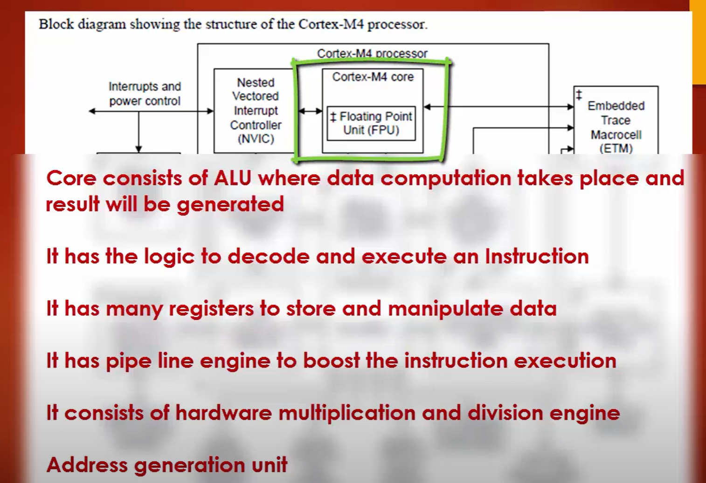

> **Cách đọc hình:** khung ngoài biểu diễn **processor**, còn khung nhỏ hơn bên trong biểu diễn **processor core**. Hình nguồn dùng Cortex-M4 và có khối FPU tùy chọn; ở đây chỉ dùng để minh họa quan hệ **processor chứa core**, không dùng để suy ra STM32F1/Cortex-M3 có FPU.

### 1.1.2. Processor làm gì?

Ở mức khái niệm:

```text
Instruction
    ↓
Fetch
    ↓
Decode
    ↓
Execute
    ↓
Result
```

Processor lấy instruction từ bộ nhớ, giải mã và thực thi. Các phép toán được thực hiện bằng ALU và các khối xử lý bên trong processor.

Ví dụ C:

```c
result = a + b;
```

không được processor thực thi trực tiếp dưới dạng C. Compiler chuyển mã nguồn thành instruction của kiến trúc Arm đích trước khi chương trình chạy.

### 1.1.3. Processor truy cập những gì?

Processor cần:

```text
lấy instruction từ Flash
đọc/ghi dữ liệu trong SRAM
đọc/ghi memory-mapped register
```

Luồng khái niệm:

```text
Arm Cortex-M3 processor
        │
        ├── Flash
        ├── SRAM
        └── Peripheral / System registers
```

Đường truy cập cụ thể được trình bày ở **1.6. Bus Architecture**; vị trí địa chỉ của các vùng được trình bày ở **1.7. Memory Map**.

### 1.1.4. Core register

Các thanh ghi như:

```text
R0-R12
SP / R13
LR / R14
PC / R15
xPSR
CONTROL
```

thuộc nhóm core register. Ý nghĩa và cách phân loại được trình bày tại **1.4. Core Registers**, vì vậy mục này không lặp lại chi tiết từng thanh ghi.

### 1.1.5. Kiến trúc và processor

Cần phân biệt:

```text
Armv7-M
→ kiến trúc

Cortex-M3
→ processor triển khai kiến trúc Armv7-M

STM32F1
→ MCU tích hợp Cortex-M3
```

Không nên gọi `Cortex-M` là tên của một kiến trúc cụ thể.

### 1.1.6. Phân biệt nhanh

| Khái niệm | Ý nghĩa |
|---|---|
| Processor core | Phần trực tiếp giải mã và thực thi instruction. |
| Arm Cortex-M3 processor | Khối xử lý Arm được STM32F1 tích hợp. |
| STM32F1 MCU | Chip hoàn chỉnh gồm processor + memory + peripheral. |
| Flash | Bộ nhớ không mất dữ liệu, thường chứa firmware. |
| SRAM | Bộ nhớ đọc/ghi dùng cho trạng thái runtime. |
| Peripheral | Khối phần cứng chuyên dụng như GPIO, Timer, USART, ADC... |

### 1.1.7. Điểm cần nhớ

> **STM32F1 là MCU; Arm Cortex-M3 là processor được tích hợp bên trong. Armv7-M là kiến trúc mà Cortex-M3 triển khai.**

### 1.1.8. Câu hỏi tự kiểm tra

1. Vì sao không nên nói “STM32 chính là Cortex-M3”?
2. Hãy phân biệt `Armv7-M`, `Cortex-M3` và `STM32F1`.

[↑ Về mục lục](#muc-luc)

---

<a id="muc-01-02"></a>
## 1.2. Processor Modes

### 1.2.1. Hai processor mode

Cortex-M3 có hai processor mode:

```text
Thread mode
Handler mode
```

| Mode | Mục đích |
|---|---|
| `Thread mode` | Chạy application code bình thường. |
| `Handler mode` | Chạy exception handler. |

Sau reset, processor bắt đầu ở:

```text
Thread mode
```

### 1.2.2. Thread mode

`Thread mode` là mode dùng cho mã ứng dụng:

```c
int main(void)
{
    while (1)
    {
        /* application code */
    }
}
```

`Thread mode` **không đồng nghĩa với Unprivileged**. Thread mode có thể chạy ở Privileged hoặc Unprivileged; privilege level được trình bày riêng tại **1.3. Privilege Level**.

### 1.2.3. Handler mode

Khi processor chấp nhận một exception:

```text
Thread mode
    ↓
exception
    ↓
Handler mode
    ↓
exception handler
```

External interrupt cũng đi vào Handler mode vì external interrupt là một loại exception của Cortex-M.

Khi exception return hoàn tất, processor quay lại context trước đó theo cơ chế exception return.

Chi tiết về vector, NVIC, priority và preemption được trình bày ở **Chương 4 – Interrupt + NVIC + EXTI**.

**Hình minh họa — chuyển giữa Thread mode và Handler mode**

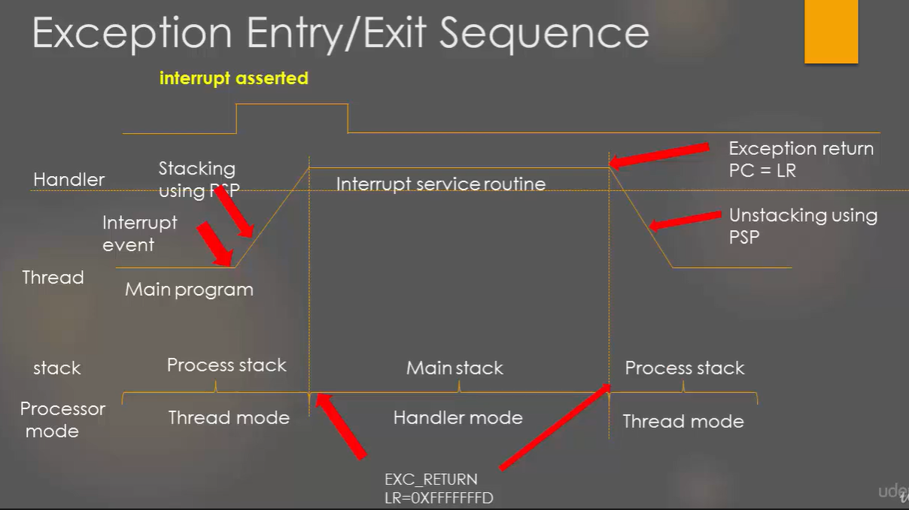

> **Cách đọc hình:** tập trung vào trục **Thread mode → Handler mode → Thread mode**. Hình còn thể hiện một trường hợp Thread mode dùng PSP; chi tiết stacking, MSP/PSP và `EXC_RETURN` được giải thích tại **1.9**.

### 1.2.4. Quan hệ với privilege level

Processor mode và privilege level trả lời hai câu hỏi khác nhau:

```text
Processor mode
→ đang chạy application code hay exception handler?

Privilege level
→ mã đang chạy có quyền Privileged hay Unprivileged?
```

Quan hệ:

```text
Thread mode
├── Privileged
└── Unprivileged

Handler mode
└── Privileged
```

### 1.2.5. Điểm cần nhớ

> **Cortex-M3 có Thread mode và Handler mode. Processor bắt đầu ở Thread mode; khi chấp nhận exception, processor chuyển sang Handler mode để chạy handler.**

### 1.2.6. Câu hỏi tự kiểm tra

1. Hai processor mode của Cortex-M3 là gì?
2. Vì sao không được đồng nhất `Thread mode` với `Unprivileged`?

[↑ Về mục lục](#muc-luc)

---

<a id="muc-01-03"></a>
## 1.3. Privilege Level

### 1.3.1. Privileged và Unprivileged

Thuật ngữ chuẩn dùng trong chương:

```text
Privileged
Unprivileged
```

Không dùng `Non-Privileged`, `PAL` hoặc `NPAL` làm thuật ngữ chính.

`Privileged` cho phép truy cập đầy đủ hơn tới các tài nguyên và thanh ghi hệ thống bị giới hạn. `Unprivileged` bị hạn chế một số thao tác.

### 1.3.2. Quan hệ với processor mode

```text
Thread mode
├── Privileged
└── Unprivileged

Handler mode
└── luôn Privileged
```

Sau reset:

```text
Thread mode + Privileged
```

### 1.3.3. `CONTROL.nPRIV`

Trong Thread mode:

```text
CONTROL.nPRIV = 0
→ Privileged

CONTROL.nPRIV = 1
→ Unprivileged
```

Mã đang chạy Privileged có thể đặt `nPRIV = 1` để hạ quyền Thread mode.

Mã Unprivileged không thể tự xóa `nPRIV` để nâng quyền trực tiếp. Một exception có thể đưa processor vào Handler mode, mà Handler mode luôn Privileged; phần mềm đặc quyền sau đó có thể quyết định context Thread mode sẽ trở lại với privilege level nào.

**Hình minh họa — hạ quyền và quay lại luồng đặc quyền**

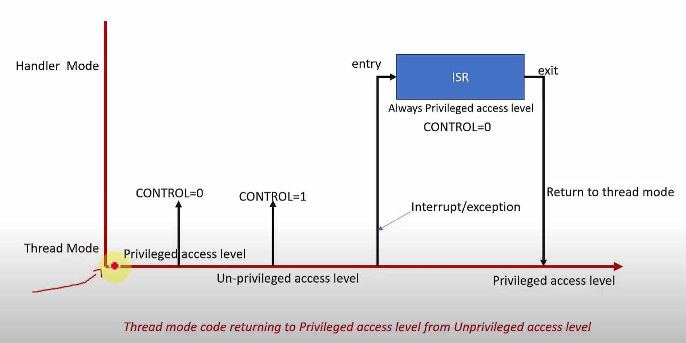

> **Cách đọc hình:** nhãn `CONTROL=0/1` trong hình nên hiểu theo ngữ cảnh là **`CONTROL.nPRIV = 0/1`**, không phải toàn bộ thanh ghi `CONTROL` chỉ có một bit. Exception đưa processor vào Handler mode, và Handler mode luôn Privileged.

### 1.3.4. `CONTROL.SPSEL`

`CONTROL.SPSEL` chọn stack pointer của Thread mode:

```text
CONTROL.SPSEL = 0
→ Thread mode dùng MSP

CONTROL.SPSEL = 1
→ Thread mode dùng PSP
```

Đây là chức năng chọn stack, không phải privilege control. Chi tiết MSP/PSP nằm ở **1.9. Stack cơ bản trên Cortex-M**.

### 1.3.5. Bảng trạng thái

| Processor mode | Privilege level | Stack pointer có thể dùng |
|---|---|---|
| Thread mode | Privileged | MSP hoặc PSP |
| Thread mode | Unprivileged | MSP hoặc PSP |
| Handler mode | Privileged | MSP |

### 1.3.6. Điểm cần nhớ

> **Mode và privilege là hai cơ chế độc lập. Thread mode có thể Privileged hoặc Unprivileged; Handler mode luôn Privileged. `CONTROL.nPRIV` điều khiển privilege của Thread mode, còn `CONTROL.SPSEL` chọn MSP/PSP cho Thread mode.**

### 1.3.7. Câu hỏi tự kiểm tra

1. Handler mode chạy ở privilege level nào?
2. `CONTROL.nPRIV` và `CONTROL.SPSEL` khác nhau ở chức năng gì?

[↑ Về mục lục](#muc-luc)

---

<a id="muc-01-04"></a>
## 1.4. Core Registers

### 1.4.1. Tổng quan

Các core register quan trọng của Cortex-M3:

```text
R0-R12
R13 / SP
R14 / LR
R15 / PC

xPSR
PRIMASK
BASEPRI
FAULTMASK
CONTROL
```

**Hình minh họa — bố cục core registers**

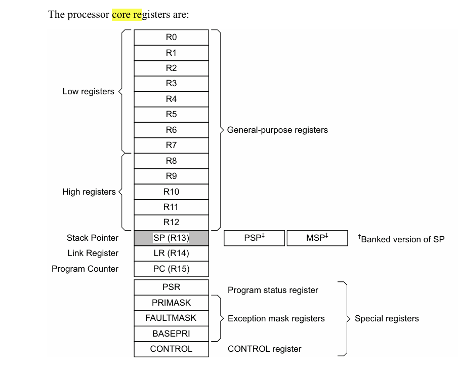

> **Cách đọc hình:** `R0-R12` là general-purpose registers; `R13/R14/R15` lần lượt là `SP/LR/PC`; MSP và PSP là hai banked Stack Pointer. Hình ghi `PSR` ở mức tổng quan; trong phần giải thích dùng thuật ngữ **`xPSR`** và các view `APSR/IPSR/EPSR`.

### 1.4.2. `R0-R12` — general-purpose registers

```text
R0-R7
→ low registers

R8-R12
→ high registers
```

Chúng được dùng cho dữ liệu tạm, tham số hàm và các phép toán theo code do compiler tạo ra.

Quy ước caller/callee và cách dùng register theo AAPCS32 được trình bày tại **1.9**.

### 1.4.3. `R13 / SP` — Stack Pointer

Cortex-M3 có hai banked stack pointer:

```text
MSP
→ Main Stack Pointer

PSP
→ Process Stack Pointer
```

`R13` biểu diễn stack pointer đang được sử dụng. Cách chọn MSP/PSP và mô hình stack được trình bày tại **1.9**.

### 1.4.4. `R14 / LR` — Link Register

Trong lời gọi hàm thông thường, `LR` nhận thông tin return address.

```text
caller
   ↓ BL
callee

LR ← return information
```

Trong exception handler, `LR` còn có thể chứa giá trị `EXC_RETURN`; vì vậy không nên giả định `LR` luôn là một địa chỉ code thông thường.

### 1.4.5. `R15 / PC` — Program Counter

`PC` điều khiển luồng thực thi instruction.

```text
call
→ PC chuyển tới callee

return
→ luồng thực thi quay về caller
```

Ý nghĩa của `PC` trong reset sequence được trình bày tại **1.5**, tránh lặp lại toàn bộ trình tự reset ở đây.

### 1.4.6. `xPSR`

`xPSR` là cách nhìn tổng hợp của:

```text
xPSR
├── APSR
│   └── condition flags như N, Z, C, V
├── IPSR
│   └── exception number hiện tại
└── EPSR
    └── execution state
```

Cortex-M3 thực thi Thumb/Thumb-2. T-bit phải ở trạng thái hợp lệ; vector của handler sử dụng bit thấp của địa chỉ để biểu thị Thumb state.

### 1.4.7. Exception mask registers

```text
PRIMASK
BASEPRI
FAULTMASK
```

là các special register liên quan tới masking exception.

Vai trò chi tiết của từng register thuộc **Chương 4**, nơi priority và interrupt masking được trình bày đầy đủ.

### 1.4.8. `CONTROL`

Hai bit cần nhận diện trên Cortex-M3:

```text
CONTROL.nPRIV
→ privilege của Thread mode

CONTROL.SPSEL
→ chọn MSP hoặc PSP cho Thread mode
```

Privilege đã được trình bày tại **1.3**; stack selection được trình bày tại **1.9**.

### 1.4.9. Core register và memory-mapped register

Đây là hai nhóm khác nhau.

```text
Core register
→ nằm trong processor
→ không có địa chỉ memory-map cố định như peripheral register
→ truy cập bằng instruction dành cho register tương ứng

Memory-mapped register
→ có địa chỉ trong memory map
→ processor truy cập bằng memory transaction
```

Ví dụ memory-mapped register:

```text
SCB
NVIC
GPIO
USART
TIM
ADC
```

Mục **1.7. Memory Map** trình bày vị trí các vùng địa chỉ; tại đây chỉ cần phân biệt cơ chế truy cập.

**Hình minh họa — core register và memory-mapped register**

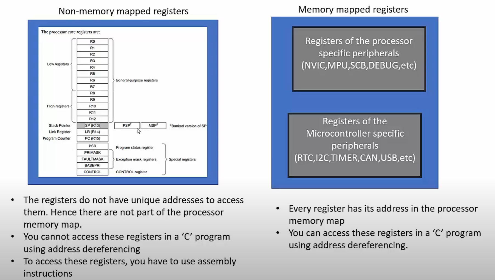

> **Cách đọc hình:** nhóm bên trái là register nội tại của processor, còn nhóm bên phải là register có địa chỉ trong memory map. Đây là lý do `R0`, `PC`, `CONTROL` không được truy cập giống `GPIOx->ODR` hay `USARTx->SR`.

### 1.4.10. Quan hệ `PC` và `LR` trong lời gọi hàm

```text
caller
  │
  │ call
  ↓
callee
  │
  │ return
  ↓
caller
```

Ở mức khái niệm:

```text
LR
→ giữ return information

PC
→ chỉ luồng instruction đang được thực thi
```

Chi tiết ABI, register preservation và stack frame của function call nằm ở **1.9**.

### 1.4.11. Điểm cần nhớ

> **`R0-R12` là general-purpose registers, `R13` là SP, `R14` là LR và `R15` là PC. `xPSR`, `PRIMASK`, `BASEPRI`, `FAULTMASK` và `CONTROL` là special registers. Core register không được truy cập như một memory-mapped peripheral register.**

### 1.4.12. Câu hỏi tự kiểm tra

1. `SP`, `LR` và `PC` tương ứng với `R13`, `R14`, `R15` như thế nào?
2. `xPSR` gồm ba nhóm trạng thái nào?
3. Core register khác memory-mapped register ở cơ chế truy cập nào?

[↑ Về mục lục](#muc-luc)

---

<a id="muc-01-05"></a>
## 1.5. Reset Sequence

### 1.5.1. Hai word đầu của vector table

Khi reset, Cortex-M3 cần hai giá trị đầu tiên của vector table:

```text
offset +0x00
→ Initial MSP

offset +0x04
→ Reset vector
```

Trong boot view:

```text
0x00000000
→ Initial MSP

0x00000004
→ Reset vector
```

Processor thực hiện về mặt khái niệm:

```text
MSP ← word tại 0x00000000
PC  ← Reset vector tại 0x00000004
```

Sau đó processor bắt đầu thực thi reset handler.

**Hình minh họa — reset sequence phần cứng**

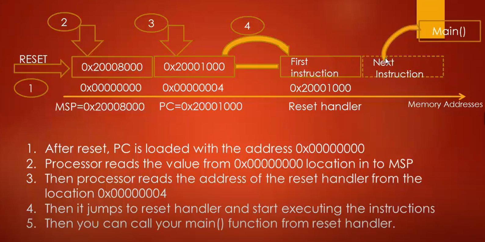

> **Cách đọc hình:** processor lấy word đầu làm **initial MSP**, lấy word kế tiếp làm **Reset vector**, rồi chuyển luồng thực thi tới reset handler. Các địa chỉ cụ thể trong hình chỉ có tính minh họa; trên STM32F1 cần kết hợp với boot alias/remap ở mục kế tiếp.

### 1.5.2. Boot alias của STM32F1

Main Flash của STM32F1 có địa chỉ ánh xạ chính bắt đầu tại:

```text
0x08000000
```

Trong khi đó, khi reset, Cortex-M3 bắt đầu bằng việc đọc hai word đầu của vector table tại boot address:

```text
0x00000000
→ Initial MSP

0x00000004
→ Reset vector
```

STM32F1 giải quyết sự khác biệt này bằng cơ chế **boot mapping / boot alias**. Khi boot từ Main Flash, vùng đầu Flash được ánh xạ thêm vào boot address `0x00000000`:

```text
Cortex-M3 đọc            STM32F1 address mapping

0x00000000   ─────────→  0x08000000
0x00000004   ─────────→  0x08000004
0x00000008   ─────────→  0x08000008
     ...                       ...
```

Có thể hình dung:

```text
Main Flash
0x08000000
      │
      │ boot alias
      ↓
0x00000000
```

Điểm quan trọng là:

```text
không có hai bản vector table độc lập
```

Khi boot từ Main Flash, cùng nội dung ở đầu Flash có thể được truy cập qua hai địa chỉ trong memory map:

```text
0x08000000
→ địa chỉ ánh xạ chính của Main Flash

0x00000000
→ boot alias trỏ tới vùng đầu Main Flash
```

Đây là **address remapping**, không phải phần cứng copy vector table từ `0x08000000` sang một vùng RAM/Flash khác.

Ví dụ, giả sử hai word đầu của Main Flash chứa:

```text
0x08000000 : 0x20005000
0x08000004 : 0x08000101
```

Khi boot từ Main Flash, Cortex-M3 đọc qua boot alias:

| CPU đọc tại | STM32F1 ánh xạ tới | Giá trị đọc được | Ý nghĩa |
|---|---|---|---|
| `0x00000000` | `0x08000000` | `0x20005000` | Nạp Initial MSP |
| `0x00000004` | `0x08000004` | `0x08000101` | Lấy Reset vector; bit 0 biểu thị Thumb state |

Do đó luồng reset có thể nhìn như sau:

```text
Reset
  ↓
Cortex-M3 đọc 0x00000000
  ↓ boot mapping
STM32F1 trả dữ liệu tại đầu Main Flash
  ↓
MSP được khởi tạo
  ↓
Cortex-M3 đọc 0x00000004
  ↓ boot mapping
Reset vector được lấy từ Main Flash
  ↓
Reset_Handler
```

Tùy cấu hình boot của STM32F1, vùng boot tại `0x00000000` có thể được ánh xạ tới:

```text
Main Flash
System Memory
SRAM
```

vì vậy `0x00000000` nên được hiểu là **boot address / alias window**, không phải lúc nào cũng đồng nghĩa với Main Flash.

> **Lưu ý về `VTOR`:** boot alias và `SCB->VTOR` là hai cơ chế khác nhau. Boot alias quyết định vùng nào xuất hiện tại `0x00000000` trong boot view. Sau khi chương trình đã chạy, firmware có thể đặt `VTOR` tới một vector table khác, ví dụ application tại `0x08004000`, để các lần tra vector exception sau đó dùng base address mới. Việc đổi `VTOR` **không xóa hoặc “ngắt” boot alias tại `0x00000000`**; nó chỉ thay đổi base address mà processor dùng cho vector table khi xử lý exception.

### 1.5.3. Reset vector và Thumb state

Vector entry chứa địa chỉ handler với bit 0 dùng để biểu thị Thumb state.

Ví dụ khái niệm:

```text
Reset_Handler code address ≈ 0x08000100
vector entry               = 0x08000101
                                      ↑
                                  Thumb bit
```

Không nên hiểu processor thực thi instruction tại địa chỉ byte lẻ `0x08000101`; bit thấp mang thông tin state.

### 1.5.4. Hardware reset sequence và startup code

Nên tách hai lớp:

```text
Hardware reset sequence
→ lấy Initial MSP
→ lấy Reset vector
→ bắt đầu thực thi Reset_Handler
```

Sau đó mới đến:

```text
software startup
→ copy .data
→ zero .bss
→ system/runtime initialization
→ main()
```

Phần software startup được trình bày tại **1.10. Startup Code**. Nhờ cách tách này, mục Reset Sequence không lặp lại nội dung khởi tạo C runtime.

### 1.5.5. Ví dụ

Giả sử boot từ Main Flash:

```text
word tại đầu vector table = 0x20005000
word kế tiếp              = 0x08000101
```

Processor sử dụng:

```text
MSP ← 0x20005000

Reset vector
→ handler ở vùng quanh 0x08000100
→ bit 0 = 1 biểu thị Thumb state
```

### 1.5.6. Điểm cần nhớ

```text
Reset
  ↓
Initial MSP
  ↓
Reset vector
  ↓
Reset_Handler
```

> **Reset sequence phần cứng kết thúc khi processor đã lấy initial MSP, lấy Reset vector và bắt đầu chạy reset handler. Việc chuẩn bị `.data`, `.bss` và C/C++ runtime thuộc startup code, không thuộc phần cứng reset sequence.**

### 1.5.7. Câu hỏi tự kiểm tra

1. Hai word đầu của vector table có ý nghĩa gì?
2. Vì sao `0x00000000` và Main Flash `0x08000000` không mâu thuẫn trên STM32F1?
3. Reset sequence phần cứng kết thúc ở bước nào?

[↑ Về mục lục](#muc-luc)

---

<a id="muc-01-06"></a>
## 1.6. Bus Architecture

### 1.6.1. Hai lớp bus cần tách biệt

Đây là điểm quan trọng để tránh dùng thuật ngữ lẫn nhau.

```text
Lớp 1 — Cortex-M3 processor interfaces
→ I-Code
→ D-Code
→ System
→ PPB

Lớp 2 — STM32F1 chip interconnect
→ AHB
→ APB1
→ APB2
→ bridge / bus matrix
```

Không nên coi `I-Code`, `D-Code`, `System bus` và `APB1/APB2` là cùng một cấp khái niệm.

**Hình minh họa — các bus interface ở phía Cortex-M**

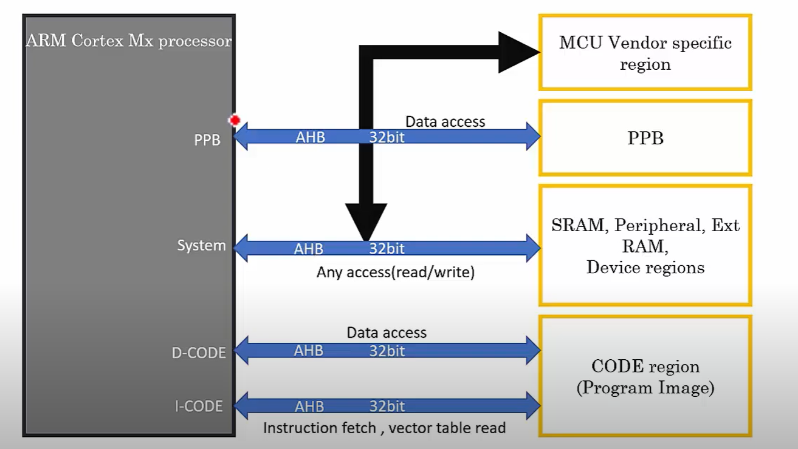

> **Cách đọc hình:** `I-Code`, `D-Code`, `System` và `PPB` mô tả các đường truy cập ở **phía processor**. Đừng đọc hình này như sơ đồ `APB1/APB2` của STM32F1; đó là lớp interconnect của MCU.

### 1.6.2. AMBA, AHB-Lite và APB

`AMBA`:

```text
Advanced Microcontroller Bus Architecture
```

là họ chuẩn bus on-chip của Arm.

`AHB`:

```text
Advanced High-performance Bus
```

`AHB-Lite` là biến thể đơn giản hóa của AHB, phù hợp với hệ thống một bus master trên interface tương ứng.

`APB`:

```text
Advanced Peripheral Bus
```

được thiết kế cho peripheral đơn giản hơn và thường được nối từ AHB thông qua bridge.

### 1.6.3. I-Code, D-Code và System bus

Ở phía Cortex-M3:

```text
I-Code bus
→ instruction fetch và vector-table access trong Code region

D-Code bus
→ data access tới Code region

System bus
→ các truy cập hệ thống khác như SRAM và peripheral
```

Sơ đồ:

```text
                 Cortex-M3
              /      |       \
             /       |        \
        I-Code    D-Code    System
           |         |          |
           ↓         ↓          ↓
        Code      Code     SRAM / Peripheral
```

### 1.6.4. PPB

`PPB`:

```text
Private Peripheral Bus
```

là vùng/giao tiếp riêng dành cho các khối system-level của processor, ví dụ System Control Space và debug-related blocks.

Không được nhầm:

```text
PPB
≠ APB1
≠ APB2
```

`APB1/APB2` là bus peripheral cụ thể trong kiến trúc STM32F1.

### 1.6.5. AHB và APB trên STM32F1

Ở lớp MCU:

```text
Cortex-M3 / DMA / Memory
          ↓
         AHB
          ↓
   AHB-to-APB bridge
      ┌───────────┐
      ↓           ↓
     APB1        APB2
      ↓           ↓
 peripheral    peripheral
```

Ví dụ:

```text
APB1
→ USART2/3, I2C, nhiều general-purpose timer...

APB2
→ AFIO, GPIO, USART1, SPI1, ADC, advanced timer...
```

Danh sách peripheral chính xác phụ thuộc part number.

**Hình minh họa — vai trò tương đối của AHB và APB**

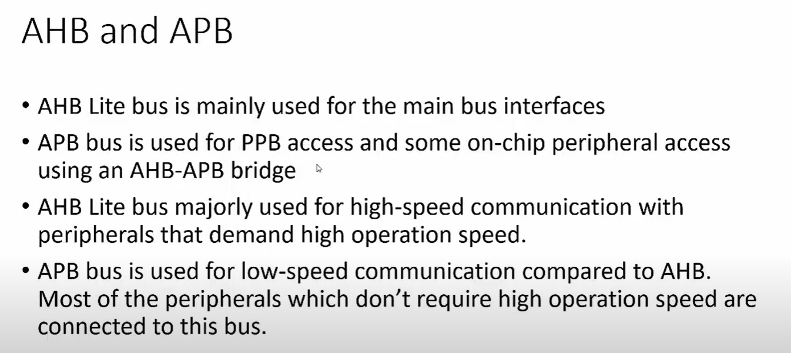

> **Cách đọc hình:** AHB phục vụ đường truyền chính/hiệu năng cao hơn, còn APB phù hợp với nhiều peripheral đơn giản hơn và được nối qua bridge. Trên STM32F1, phần clock của AHB/APB1/APB2 được xử lý riêng ở Chương 2.

Clock của AHB/APB và peripheral được trình bày ở **Chương 2 – RCC + Clock**; mục này chỉ tập trung vào đường truy cập bus.

### 1.6.6. Bus Architecture và Memory Map

Hai khái niệm có liên quan nhưng trả lời câu hỏi khác nhau:

```text
Bus Architecture
→ truy cập đi qua interface/bus nào?

Memory Map
→ tài nguyên nằm ở địa chỉ nào?
```

Memory map được trình bày tại **1.7**, nên mục này không lặp lại bảng địa chỉ.

### 1.6.7. Điểm cần nhớ

> **Cortex-M3 có các bus interface I-Code, D-Code và System; STM32F1 lại có interconnect AHB/APB1/APB2 ở cấp MCU. Hai lớp này liên quan nhưng không được dùng thay thế cho nhau.**

### 1.6.8. Câu hỏi tự kiểm tra

1. I-Code, D-Code và System bus thuộc lớp nào?
2. AHB/APB1/APB2 thuộc lớp nào?
3. PPB khác APB1/APB2 như thế nào?

[↑ Về mục lục](#muc-luc)

---

<a id="muc-01-07"></a>
## 1.7. Memory Map

### 1.7.1. Không gian địa chỉ 32-bit

Cortex-M3 có không gian địa chỉ 32-bit:

```text
0x00000000
→
0xFFFFFFFF
```

Tương đương:

```text
2^32 byte
= 4 GiB address space
```

Đây là **không gian địa chỉ**, không phải dung lượng Flash/SRAM vật lý của MCU.

**Hình minh họa — memory map 4 GiB của Cortex-M**

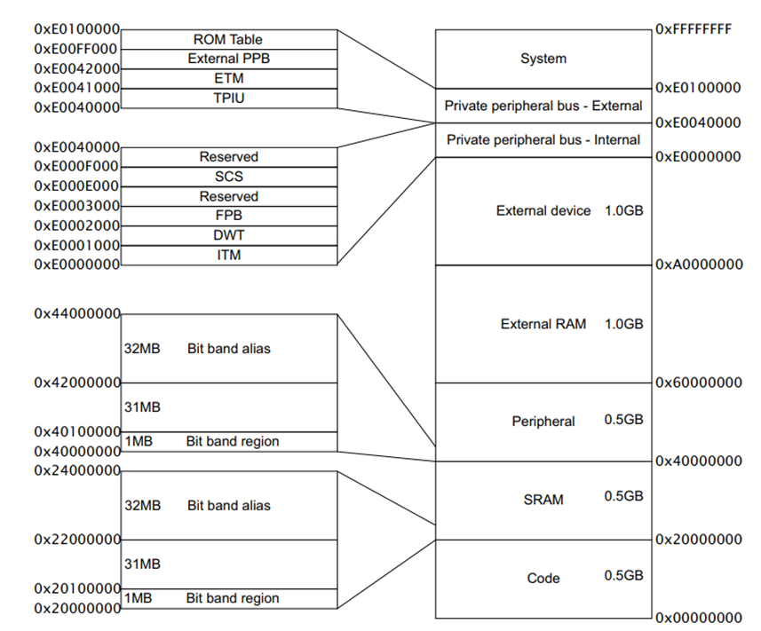

> **Cách đọc hình:** đọc theo các base region lớn: Code `0x00000000`, SRAM `0x20000000`, Peripheral `0x40000000`, External RAM `0x60000000`, External Device `0xA0000000`, PPB/System `0xE0000000`. Đây là address space, không phải dung lượng memory vật lý được lắp thật trên STM32F1.

### 1.7.2. Các region chính

| Region | Khoảng địa chỉ |
|---|---:|
| Code | `0x00000000` – `0x1FFFFFFF` |
| SRAM | `0x20000000` – `0x3FFFFFFF` |
| Peripheral | `0x40000000` – `0x5FFFFFFF` |
| External RAM | `0x60000000` – `0x9FFFFFFF` |
| External Device | `0xA0000000` – `0xDFFFFFFF` |
| PPB / System | `0xE0000000` – `0xFFFFFFFF` |

Sơ đồ:

```text
0xFFFFFFFF  +---------------------------+
            | PPB / System              |
0xE0000000  +---------------------------+
            | External Device           |
0xA0000000  +---------------------------+
            | External RAM              |
0x60000000  +---------------------------+
            | Peripheral                |
0x40000000  +---------------------------+
            | SRAM                      |
0x20000000  +---------------------------+
            | Code                      |
0x00000000  +---------------------------+
```

### 1.7.3. Các địa chỉ quan trọng trên STM32F1

Trong STM32F1:

```text
Main Flash
→ bắt đầu tại 0x08000000

SRAM
→ bắt đầu tại 0x20000000

Peripheral region
→ bắt đầu tại 0x40000000
```

Boot alias tại `0x00000000` đã được trình bày tại **1.5. Reset Sequence**.

### 1.7.4. Memory-mapped register

Khái niệm core register và memory-mapped register đã được phân biệt tại **1.4**. Tại đây chỉ cần đặt nó vào memory map:

```text
CPU đọc/ghi địa chỉ
        ↓
address decoder
        ↓
memory hoặc register tương ứng
```

Ví dụ:

```text
GPIO register
USART register
TIM register
ADC register
NVIC / SCB register
```

đều được truy cập qua địa chỉ memory-mapped tương ứng.

### 1.7.5. Code, SRAM và Peripheral region

**Code region**

```text
0x00000000 – 0x1FFFFFFF
```

dành cho code-related memory mapping. Main Flash STM32F1 nằm bên trong region này tại `0x08000000`.

**SRAM region**

```text
0x20000000 – 0x3FFFFFFF
```

chứa vùng SRAM mapping. On-chip SRAM STM32F1 bắt đầu tại `0x20000000`.

**Peripheral region**

```text
0x40000000 – 0x5FFFFFFF
```

dùng cho memory-mapped peripheral. Đây không phải vùng để thực thi code thông thường.

### 1.7.6. Bit-band

STM32F1/Cortex-M3 cung cấp các bit-band region quen thuộc:

```text
SRAM bit-band region
0x20000000 – 0x200FFFFF

SRAM alias region
0x22000000 – 0x23FFFFFF
```

```text
Peripheral bit-band region
0x40000000 – 0x400FFFFF

Peripheral alias region
0x42000000 – 0x43FFFFFF
```

Công thức:

```text
alias_address
= alias_base
+ byte_offset × 32
+ bit_number × 4
```

Một bit trong bit-band region ánh xạ tới một word 32-bit trong alias region:

```text
write 0
→ clear bit

write 1
→ set bit
```

Nhờ đó phần mềm có thể thao tác một bit mà không tự viết chuỗi read-modify-write cho toàn word.

### 1.7.7. External memory và PPB/System

```text
0x60000000 – 0x9FFFFFFF
→ External RAM region

0xA0000000 – 0xDFFFFFFF
→ External Device region

0xE0000000 trở lên
→ PPB / System region
```

Các khối như SCB, NVIC và nhiều debug block nằm trong system/private peripheral space của Cortex-M3.

### 1.7.8. Quan hệ với Bus Architecture

Memory Map chỉ xác định **địa chỉ và loại region**. Đường bus dùng để tới region đó đã được trình bày tại **1.6**.

```text
Address
→ Memory Map

Transfer path
→ Bus Architecture
```

### 1.7.9. Điểm cần nhớ

> **Cortex-M3 có 4 GiB address space. Trên STM32F1, Main Flash thường bắt đầu tại `0x08000000`, SRAM tại `0x20000000` và peripheral region tại `0x40000000`. Address space không đồng nghĩa với dung lượng memory vật lý.**

### 1.7.10. Câu hỏi tự kiểm tra

1. 4 GiB address space có nghĩa STM32F1 có 4 GiB memory vật lý không?
2. Main Flash, SRAM và Peripheral region bắt đầu ở những địa chỉ nào?
3. Memory Map khác Bus Architecture ở điểm nào?

[↑ Về mục lục](#muc-luc)

---

<a id="muc-01-08"></a>
## 1.8. Flash và SRAM

### 1.8.1. Flash

Flash là non-volatile memory:

```text
mất nguồn
→ nội dung vẫn được giữ
```

Firmware thường được lưu trong Flash:

```text
vector table
.text
.rodata
initial image của .data
```

Việc program/erase Flash phải theo quy trình của Flash controller; không được xem Flash như SRAM đọc/ghi tùy ý.

**Hình minh họa — quan hệ section giữa Flash và SRAM**

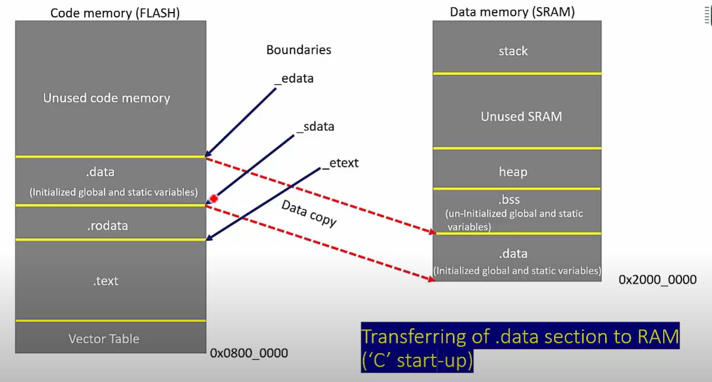

> **Cách đọc hình:** `.text/.rodata` nằm trong Flash; `.data` có **initial image** trong Flash nhưng runtime address ở SRAM; `.bss`, heap và stack dùng SRAM. Tên linker symbol trong project thực tế có thể khác hình nguồn, vì vậy ưu tiên ý nghĩa của boundary hơn là học thuộc tên.

### 1.8.2. SRAM

SRAM là volatile memory dùng cho dữ liệu runtime:

```text
.data runtime
.bss
stack
heap
buffer
runtime state
```

Cần phân biệt:

```text
Power loss
→ SRAM không giữ dữ liệu

Reset
→ không nên mặc định hardware xóa toàn bộ SRAM
→ startup code chỉ chủ động khởi tạo các vùng mà chương trình yêu cầu, như .data và .bss
```

### 1.8.3. So sánh

| Thuộc tính | Flash | SRAM |
|---|---|---|
| Giữ dữ liệu khi mất nguồn | Có | Không |
| Vai trò điển hình | Firmware, code, read-only data | Runtime read/write data |
| Ghi trong runtime | Theo quy trình program/erase | Đọc/ghi trực tiếp |
| Section điển hình | `.isr_vector`, `.text`, `.rodata`, load image của `.data` | `.data`, `.bss`, stack, heap |

### 1.8.4. Các section cần nhận diện

| Section | Nội dung chính | Vị trí runtime điển hình |
|---|---|---|
| `.isr_vector` | vector table | Flash |
| `.text` | machine code | Flash |
| `.rodata` | read-only data | Flash |
| `.data` | initialized writable objects | SRAM |
| `.bss` | zero-initialized objects | SRAM |

`const` trong C không tự nó định nghĩa vị trí vật lý; compiler/linker thường đặt read-only objects thích hợp vào `.rodata`, và linker script thường đặt `.rodata` trong Flash.

### 1.8.5. Vì sao `.data` liên quan cả Flash và SRAM?

`.data` có:

```text
runtime address
→ SRAM

initial image
→ Flash
```

Mô hình:

```text
Flash
initial .data image
        │
        │ startup copy
        ↓
SRAM
.data runtime
```

Chi tiết **ai copy, copy khi nào** thuộc **1.10. Startup Code**. Chi tiết **LMA/VMA và linker placement** thuộc **1.11. Linker Script**.

### 1.8.6. `.bss`

`.bss` thường chứa các object có static storage duration cần zero-initialize, ví dụ:

```c
int counter;
static int state;
static int error = 0;
```

Không cần lưu một block số 0 tương ứng trong firmware image; startup code có thể zero vùng `.bss` trước `main()`.

### 1.8.7. Stack và heap

Stack và heap sử dụng SRAM nhưng có vai trò khác:

```text
stack
→ function call, local automatic storage, saved context

heap
→ dynamic allocation nếu runtime/application sử dụng
```

Cơ chế stack trên Cortex-M3 được trình bày tại **1.9**.

### 1.8.8. Quan hệ với Memory Map

Địa chỉ region đã được nêu tại **1.7**:

```text
Main Flash base
→ 0x08000000

SRAM base
→ 0x20000000
```

Mục này tập trung vào **đặc tính và cách sử dụng memory**, không lặp lại toàn bộ memory map.

### 1.8.9. Điểm cần nhớ

> **Flash giữ firmware và read-only content lâu dài; SRAM giữ writable runtime state. `.data` chạy ở SRAM nhưng có initial image trong Flash, còn `.bss` được zero-initialize trước khi application code phụ thuộc vào nó.**

### 1.8.10. Câu hỏi tự kiểm tra

1. Vì sao `.data` cần cả initial image trong Flash và runtime location trong SRAM?
2. `.bss` khác `.data` ở cách khởi tạo như thế nào?

[↑ Về mục lục](#muc-luc)

---

<a id="muc-01-09"></a>
## 1.9. Stack cơ bản trên Cortex-M

### 1.9.1. Stack và SP

Stack là vùng memory hoạt động theo nguyên tắc:

```text
LIFO
→ Last In, First Out
```

`SP`:

```text
Stack Pointer
R13
```

theo dõi stack hiện hành.

Stack thường chứa:

```text
local automatic data
saved registers
return information
exception context
```

### 1.9.2. Full-descending stack

Cortex-M sử dụng full-descending stack:

```text
PUSH
→ SP giảm

POP
→ SP tăng
```

Sơ đồ:

```text
địa chỉ cao
+------------------+
| dữ liệu cũ       |
+------------------+
| dữ liệu mới      | ← SP
+------------------+
        ↓
stack phát triển về địa chỉ thấp
```

Các mô hình full/empty/ascending/descending khác chỉ cần nhận diện về mặt khái niệm; khi làm việc với Cortex-M, mô hình cần nhớ là **full-descending**.

**Hình minh họa — bốn stack model**

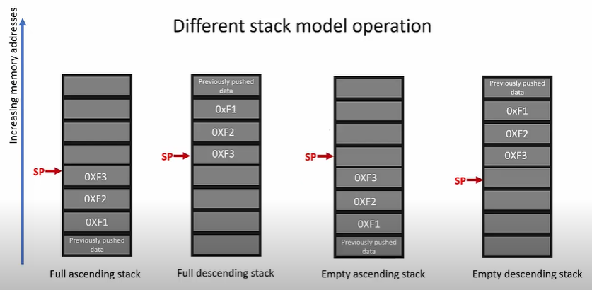

> **Cách đọc hình:** dùng hình để phân biệt `Full/Empty` và `Ascending/Descending`; với Cortex-M, chỉ cần chốt **Full Descending**: push làm SP đi về địa chỉ thấp hơn.

### 1.9.3. MSP và PSP

Cortex-M3 có:

```text
MSP
→ Main Stack Pointer

PSP
→ Process Stack Pointer
```

Quan hệ:

```text
Thread mode
├── MSP
└── PSP

Handler mode
└── MSP
```

Sau reset, MSP là stack pointer mặc định. Việc initial MSP được lấy từ vector table đã được trình bày tại **1.5**, nên không lặp lại reset sequence ở đây.

### 1.9.4. `CONTROL.SPSEL`

Trong Thread mode:

```text
CONTROL.SPSEL = 0
→ MSP

CONTROL.SPSEL = 1
→ PSP
```

Handler mode luôn dùng MSP.

**Hình minh họa — MSP và PSP theo processor mode**

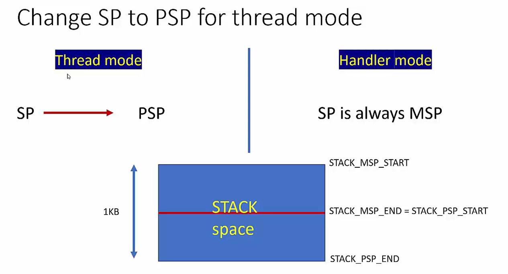

> **Cách đọc hình:** Thread mode có thể dùng PSP, còn Handler mode sử dụng MSP. Phần kích thước/ranh giới stack trong hình chỉ là ví dụ bố trí memory, không phải quy định cố định cho mọi project.

Trong RTOS, một cách tổ chức phổ biến là:

```text
task/thread
→ PSP

exception handler
→ MSP
```

### 1.9.5. AAPCS32

AAPCS32 là Procedure Call Standard thuộc Arm ABI. Nó quy định cách các hàm trao đổi tham số, giá trị trả về và trách nhiệm bảo toàn register.

Quy tắc cơ bản cần nhớ:

```text
R0-R3
→ argument/result/scratch registers

R12
→ scratch register

R4-R8, R10, R11
→ callee-saved

R9
→ platform-specific theo PCS variant

LR
→ chứa return information khi thực hiện call
```

Các argument vượt quá khả năng truyền qua register được truyền bằng stack theo quy tắc ABI.

Stack phải tuân thủ alignment của ABI; tại public interface, AAPCS32 yêu cầu `SP` được căn 8 byte.

### 1.9.6. Caller-saved và callee-saved

Khái niệm:

```text
caller-saved
→ caller không được giả định giá trị còn nguyên sau call
→ nếu cần giữ, caller phải bảo toàn

callee-saved
→ nếu callee thay đổi, callee phải khôi phục trước khi return
```

Không nên học thuộc rút gọn `R4-R11 luôn callee-saved` mà bỏ qua vai trò platform-specific của `R9`.

### 1.9.7. Exception stacking

Khi Cortex-M3 chấp nhận exception, hardware tự động tạo **basic exception stack frame** chứa:

```text
R0
R1
R2
R3
R12
LR
PC
xPSR
```

Basic frame:

```text
8 words × 4 byte
= 32 byte
```

**Hình minh họa — basic exception stack frame**

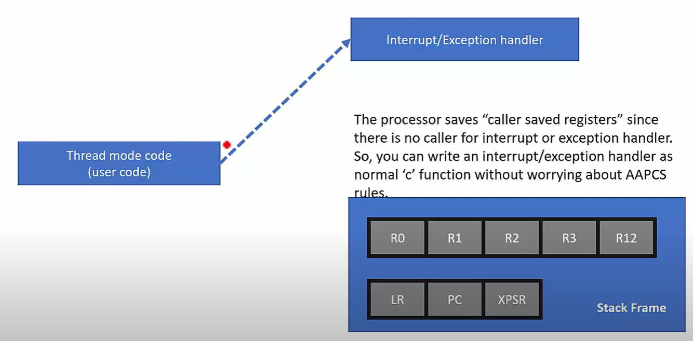

> **Cách đọc hình:** hardware tự động lưu `R0-R3`, `R12`, `LR`, `PC`, `xPSR` khi exception entry. Đây là phần context tối thiểu giúp một C handler có thể được gọi theo cơ chế exception của Cortex-M.

Có thể có padding để đáp ứng stack alignment, nhưng tám register trên là nội dung cốt lõi của basic frame.

Nếu Thread mode đang dùng PSP, context của Thread có thể được stack lên PSP; sau khi vào Handler mode, processor dùng MSP.

### 1.9.8. Exception return

Luồng:

```text
Thread mode
   ↓ exception
hardware stacking
   ↓
Handler mode
   ↓ exception return
hardware unstacking
   ↓
context trước đó
```

Chi tiết priority, nesting và NVIC thuộc **Chương 4**.

### 1.9.9. Stack frame và debug fault

Basic exception frame giúp debugger tìm:

```text
stacked PC
→ vị trí instruction context khi exception xảy ra

stacked LR
→ return information

xPSR
→ processor status

R0-R3, R12
→ register state liên quan
```

Kỹ thuật HardFault debugging được trình bày đầy đủ ở **Chương 10 – Debug bằng ST-Link**.

**Hình minh họa mở rộng — PSP/MSP trong context switching dùng PendSV**

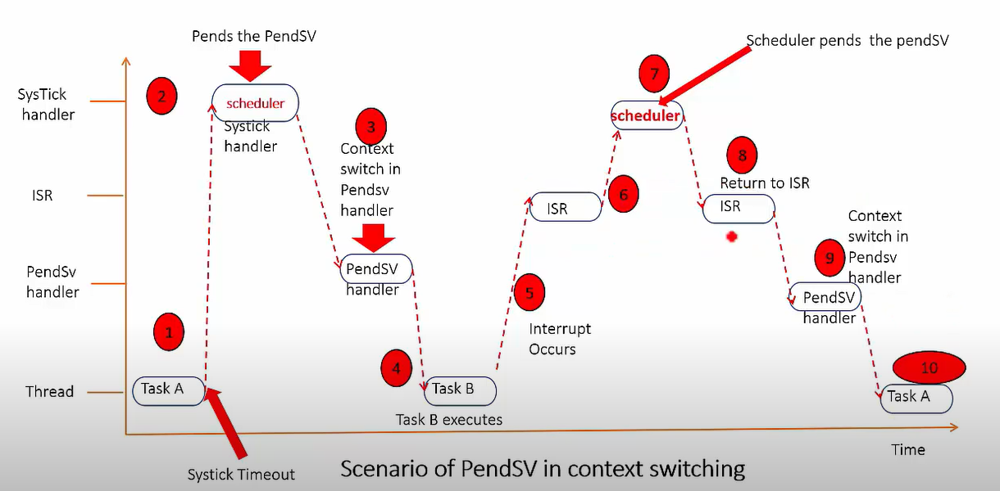

> **Cách đọc hình:** đây là ví dụ ứng dụng của các khái niệm `Thread mode`, handler và stack pointer trong một scheduler. Chỉ cần thấy **task chạy ở Thread mode**, còn SysTick/PendSV/ISR chạy ở Handler mode; chi tiết scheduler không thuộc phạm vi Chương 1.

### 1.9.10. Stack placement

Linker script thường xác định region và symbol liên quan tới initial stack, ví dụ `_estack`.

```text
RAM top
→ initial MSP thường được đặt gần đây

full-descending stack
→ phát triển về địa chỉ thấp hơn
```

Chi tiết linker symbol và memory region thuộc **1.11**.

### 1.9.11. Điểm cần nhớ

> **Cortex-M dùng full-descending stack. Thread mode có thể dùng MSP hoặc PSP; Handler mode luôn dùng MSP. Exception entry tự động stack `R0-R3`, `R12`, `LR`, `PC`, `xPSR`.**

### 1.9.12. Câu hỏi tự kiểm tra

1. Full-descending stack làm `SP` thay đổi thế nào khi push/pop?
2. Thread mode và Handler mode dùng MSP/PSP như thế nào?
3. Basic exception stack frame gồm những register nào?

[↑ Về mục lục](#muc-luc)

---

<a id="muc-01-10"></a>
## 1.10. Startup Code

### 1.10.1. Phân biệt reset sequence và startup code

Mục **1.5** đã trình bày phần hardware:

```text
Reset
→ Initial MSP
→ Reset vector
→ Reset_Handler
```

Từ thời điểm `Reset_Handler` bắt đầu chạy trở đi là phần software startup.

```text
Reset_Handler
→ chuẩn bị runtime environment
→ main()
```

### 1.10.2. Thành phần của startup file

Một startup file STM32 điển hình có:

```text
startup file
├── vector table
├── Reset_Handler
├── Default_Handler
└── weak exception/IRQ handlers
```

Vector table thường nằm trong output section như:

```text
.isr_vector
```

và linker script đặt section này ở vị trí phù hợp trong Flash.

### 1.10.3. Công việc của `Reset_Handler`

Luồng điển hình:

```text
Reset_Handler
   ↓
copy .data: Flash → SRAM
   ↓
zero .bss
   ↓
SystemInit() / system initialization
   ↓
C/C++ runtime initialization nếu cần
   ↓
main()
```

Thứ tự chính xác của `SystemInit()` và một số runtime hook có thể khác theo startup file/toolchain. Điều quan trọng là dữ liệu runtime phải ở trạng thái hợp lệ trước khi application code sử dụng.

**Hình minh họa — công việc của reset handler trước `main()`**

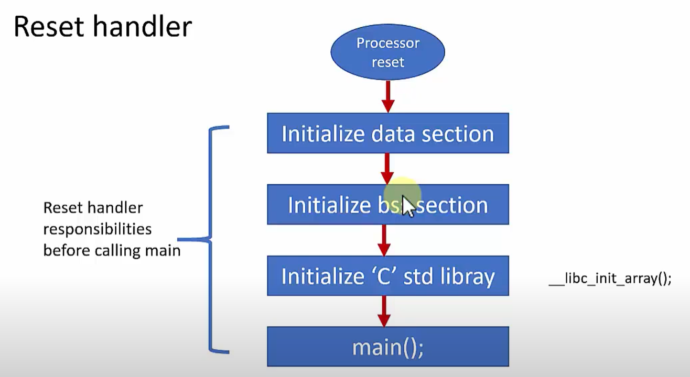

> **Cách đọc hình:** hình cho thấy đúng ranh giới giữa **hardware reset sequence** và **software startup**: sau khi đã vào reset handler, phần mềm mới khởi tạo `.data`, `.bss`, runtime cần thiết rồi gọi `main()`.

### 1.10.4. Pseudocode

```c
extern uint32_t _sidata;
extern uint32_t _sdata;
extern uint32_t _edata;
extern uint32_t _sbss;
extern uint32_t _ebss;

void Reset_Handler(void)
{
    uint32_t *src = &_sidata;
    uint32_t *dst = &_sdata;

    while (dst < &_edata)
    {
        *dst++ = *src++;
    }

    for (dst = &_sbss; dst < &_ebss; ++dst)
    {
        *dst = 0U;
    }

    SystemInit();
    __libc_init_array();

    (void)main();

    while (1)
    {
    }
}
```

Đây là pseudocode khái niệm. Tên symbol và thứ tự hook cụ thể phụ thuộc project/toolchain.

### 1.10.5. Vì sao vector table không thể phụ thuộc vào `.data` runtime?

Điểm này chỉ cần suy ra từ **1.5** và **1.8**:

```text
processor cần vector table
TRƯỚC
khi Reset_Handler chạy

.data runtime
chỉ được chuẩn bị
SAU KHI
Reset_Handler đã chạy
```

Do đó vector table dùng để boot không thể phụ thuộc vào nội dung `.data` chưa được startup code khởi tạo.

Không cần lặp lại reset sequence đầy đủ lần nữa.

### 1.10.6. Weak handler và `Default_Handler`

Vendor startup thường khai báo nhiều handler dưới dạng weak alias:

```text
handler chưa được application định nghĩa
        ↓
weak alias
        ↓
Default_Handler
```

Khi application cung cấp symbol cùng tên với strong definition, linker dùng implementation của application.

Ví dụ:

```c
void USART2_IRQHandler(void)
{
    /* handle USART2 interrupt */
}
```

### 1.10.7. Startup code và linker script

Startup code không tự biết `.data`/`.bss` ở đâu. Nó dùng linker symbols:

```text
_sidata
_sdata
_edata
_sbss
_ebss
_estack
```

Quan hệ:

```text
Linker Script
→ tạo memory layout + symbols
        ↓
Startup Code
→ dùng symbols để chuẩn bị runtime memory
        ↓
main()
```

Cách tạo các symbol này được trình bày tại **1.11**.

### 1.10.8. Điểm cần nhớ

> **Reset sequence đưa processor tới `Reset_Handler`; startup code sau đó chuẩn bị `.data`, `.bss`, system/runtime environment và gọi `main()`. Vector table thuộc điều kiện để bắt đầu startup, không phải dữ liệu do startup tạo ra.**

### 1.10.9. Câu hỏi tự kiểm tra

1. Reset sequence và startup code được tách nhau tại điểm nào?
2. `Reset_Handler` phải chuẩn bị `.data` và `.bss` như thế nào?
3. Startup code lấy boundary của `.data`/`.bss` từ đâu?

[↑ Về mục lục](#muc-luc)

---

<a id="muc-01-11"></a>
## 1.11. Linker Script và các section

### 1.11.1. Build flow

Luồng cơ bản:

```text
.c / .s
   ↓ compile / assemble
.o object files
   ↓ link
ELF executable
```

Mỗi object file chứa các **input section**. Linker gom chúng thành các **output section**, resolve symbol, áp dụng relocation và gán địa chỉ theo linker script.

**Hình minh họa — build flow từ object file tới ELF/BIN**

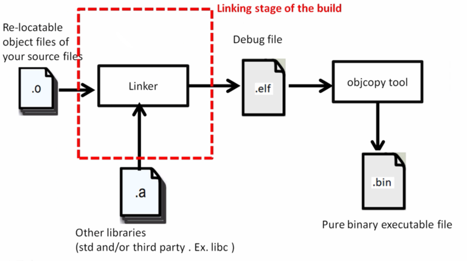

> **Cách đọc hình:** compiler/assembler tạo relocatable object files; **linker** ghép object/library thành ELF. `objcopy` có thể tạo raw `.bin` từ ELF sau bước link.

### 1.11.2. Input section và output section

Ví dụ:

```text
main.o
├── .text.*
├── .rodata.*
├── .data.*
└── .bss.*

driver.o
├── .text.*
├── .rodata.*
├── .data.*
└── .bss.*
```

Linker có thể gom:

```text
*(.text*)
→ output .text

*(.rodata*)
→ output .rodata

*(.data*)
→ output .data

*(.bss*)
→ output .bss
```

Ý nghĩa `.text/.rodata/.data/.bss` đã được nêu tại **1.8**; mục này tập trung vào **cách linker đặt chúng vào memory**.

**Hình minh họa — section trong một ELF object**

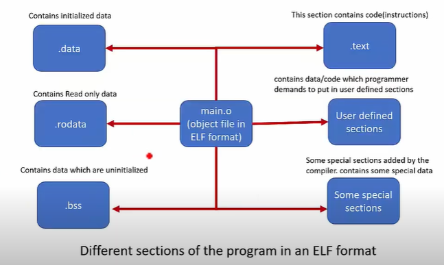

> **Cách đọc hình:** một `.o` có thể chứa nhiều section khác nhau; linker script không tạo nội dung của `.text/.data/.bss/.rodata` từ đầu mà **thu thập input sections** rồi đặt chúng vào output sections.

### 1.11.3. Linker làm gì?

Các nhiệm vụ chính:

```text
1. resolve symbols
2. collect input sections
3. create output sections
4. assign addresses
5. apply relocations
6. produce ELF executable
```

Không cần tách một thành phần “Locator” riêng khi nói về GNU `ld`; việc section placement và address assignment là công việc của linker theo linker script.

**Hình minh họa — merge section và gán địa chỉ**

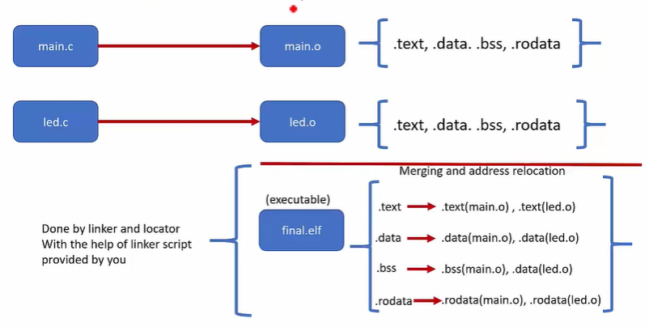

> **Cách đọc hình:** hình nguồn dùng cụm “Linker and Locator”; trong GNU toolchain của STM32, nên hiểu phần **merge, symbol resolution, relocation và address assignment** là công việc của linker (`ld`) được điều khiển bởi linker script.

### 1.11.4. `MEMORY`

Ví dụ:

```ld
MEMORY
{
    FLASH (rx)  : ORIGIN = 0x08000000, LENGTH = 128K
    RAM   (xrw) : ORIGIN = 0x20000000, LENGTH = 20K
}
```

`ORIGIN`:

```text
địa chỉ bắt đầu của memory region
```

`LENGTH`:

```text
kích thước region
```

Các dung lượng trên chỉ là ví dụ; phải dùng đúng part number thực tế.

### 1.11.5. `SECTIONS`

Ví dụ rút gọn:

```ld
_estack = ORIGIN(RAM) + LENGTH(RAM);

SECTIONS
{
    .isr_vector :
    {
        KEEP(*(.isr_vector))
    } > FLASH

    .text :
    {
        *(.text*)
        *(.rodata*)
    } > FLASH

    _sidata = LOADADDR(.data);

    .data :
    {
        _sdata = .;
        *(.data*)
        _edata = .;
    } > RAM AT > FLASH

    .bss (NOLOAD) :
    {
        _sbss = .;
        *(.bss*)
        *(COMMON)
        _ebss = .;
    } > RAM
}
```

### 1.11.6. `KEEP`

Vector table có thể không được tham chiếu như một function/data object thông thường. Khi linker garbage collection được bật:

```ld
KEEP(*(.isr_vector))
```

yêu cầu linker giữ section này.

### 1.11.7. VMA và LMA

Đây là khái niệm trung tâm để hiểu `.data`.

```text
VMA
→ Virtual Memory Address
→ địa chỉ runtime của section

LMA
→ Load Memory Address
→ địa chỉ nơi initial image được lưu trong load image
```

Với `.data`:

```text
Flash                         SRAM
LMA                           VMA
initial .data  ───────────→   runtime .data
                 startup copy
```

Cú pháp:

```ld
.data : { ... } > RAM AT > FLASH
```

nghĩa là `.data` chạy ở RAM nhưng initial image được đặt trong Flash.

### 1.11.8. Linker symbols

Các dòng:

```ld
_sdata = .;
_edata = .;
_sbss  = .;
_ebss  = .;
```

tạo **linker symbols**, không phải biến C được cấp storage theo cách thông thường.

Startup code tham chiếu chúng để biết:

```text
copy .data từ đâu tới đâu
zero .bss từ đâu tới đâu
initial stack boundary ở đâu
```

### 1.11.9. `NOLOAD`

Ví dụ:

```ld
.bss (NOLOAD) :
{
    ...
} > RAM
```

`NOLOAD` biểu thị output section không cần nội dung load image tương ứng. Điều này phù hợp với `.bss`, vì startup code chỉ cần zero-initialize vùng runtime.

### 1.11.10. ELF, HEX và BIN

```text
ELF
→ chứa section, symbol và có thể chứa debug information

HEX
→ image có thông tin địa chỉ theo định dạng Intel HEX

BIN
→ raw binary bytes
```

Khi debug bằng GDB/ST-Link, ELF đặc biệt hữu ích vì giữ symbol/debug information. Công cụ programming có thể nhận ELF/HEX/BIN tùy workflow.

### 1.11.11. Quan hệ với Startup Code

Mục **1.10** đã dùng:

```text
_sidata
_sdata
_edata
_sbss
_ebss
```

Mục này giải thích nguồn gốc của chúng:

```text
Linker Script
→ định nghĩa layout + symbols
        ↓
Linker
→ tạo ELF
        ↓
Startup Code
→ dùng symbols để khởi tạo RAM
```

Không cần lặp lại toàn bộ startup sequence.

### 1.11.12. Điểm cần nhớ

> **Linker script nối object sections với memory map thật của MCU. Nó khai báo memory regions, tạo output sections, quyết định VMA/LMA, giữ các section quan trọng và tạo linker symbols để startup code sử dụng.**

### 1.11.13. Câu hỏi tự kiểm tra

1. Input section và output section khác nhau như thế nào?
2. VMA và LMA của `.data` khác nhau ở điểm nào?
3. Vì sao startup code cần linker symbols?

[↑ Về mục lục](#muc-luc)


---

<a id="chuong-02"></a>
# 2. RCC + Clock

> Phạm vi của chương này tập trung vào STM32F101xx, STM32F102xx và STM32F103xx thuộc các nhóm low-, medium-, high- và XL-density. STM32F105xx/STM32F107xx connectivity line có clock tree riêng với nhiều PLL hơn, vì vậy không áp dụng trực tiếp toàn bộ công thức cấu hình của phần này.

<a id="muc-02-01"></a>
## 2.1. RCC là gì?

`RCC` là viết tắt của:

```text
Reset and Clock Control
```

RCC chịu trách nhiệm chính cho hai nhóm chức năng:

```text
RCC
├── Clock Control
│   ├── bật/tắt các nguồn clock
│   ├── chọn SYSCLK
│   ├── cấu hình PLL
│   ├── cấu hình AHB/APB prescaler
│   ├── cấp clock cho peripheral
│   └── theo dõi trạng thái clock
│
└── Reset Control
    ├── reset peripheral trên APB1
    ├── reset peripheral trên APB2
    └── reset Backup domain
```

Các thanh ghi quan trọng:

| Thanh ghi | Vai trò chính |
|---|---|
| `RCC_CR` | Bật/tắt HSI, HSE, PLL; đọc các cờ `RDY`; bật CSS |
| `RCC_CFGR` | Chọn SYSCLK, cấu hình PLL, AHB/APB/ADC prescaler, MCO |
| `RCC_CIR` | Cờ/ngắt liên quan tới trạng thái nguồn clock và CSS |
| `RCC_AHBENR` | Bật clock các peripheral trên AHB |
| `RCC_APB2ENR` | Bật clock các peripheral trên APB2 |
| `RCC_APB1ENR` | Bật clock các peripheral trên APB1 |
| `RCC_APB2RSTR` | Reset các peripheral trên APB2 |
| `RCC_APB1RSTR` | Reset các peripheral trên APB1 |
| `RCC_BDCR` | Clock/Reset của Backup domain và RTC |
| `RCC_CSR` | Điều khiển LSI và các cờ reset |

Có thể hình dung:

```text
Clock source
    ↓
   RCC
    ↓
Clock Tree
    ↓
CPU / Bus / Peripheral
```

---

<a id="muc-02-02"></a>
## 2.2. Các nguồn Clock: HSI / HSE / LSI / LSE

STM32F10xxx có bốn nguồn clock thường gặp:

```text
High-speed
├── HSI
└── HSE

Low-speed
├── LSI
└── LSE
```

### HSI — High-Speed Internal

HSI là bộ dao động RC tốc độ cao nằm bên trong MCU.

Đối với STM32F10xxx trong phạm vi chương này:

```text
HSI = 8 MHz
```

HSI có thể được dùng:

```text
HSI
├── trực tiếp làm SYSCLK
└── chia 2 làm đầu vào PLL
```

Ưu điểm:

- Không cần linh kiện dao động ngoài.
- Khởi động nhanh.
- Chi phí phần cứng thấp.

Hạn chế:

- Độ chính xác thấp hơn crystal/resonator ngoài.
- Tần số chịu ảnh hưởng bởi nhiệt độ và điện áp.
- Có thể tinh chỉnh bằng `HSITRIM`.

Các bit quan trọng trong `RCC_CR`:

```text
HSION
→ bật HSI

HSIRDY
→ HSI đã ổn định

HSICAL
→ giá trị hiệu chuẩn

HSITRIM
→ tinh chỉnh HSI
```

Sau system reset:

```text
SYSCLK = HSI
```

Do đó MCU luôn có một nguồn clock nội bộ để bắt đầu chạy trước khi phần mềm cấu hình clock khác.

### HSE — High-Speed External

HSE là nguồn clock tốc độ cao từ bên ngoài.

Có hai cách sử dụng:

```text
HSE
├── Crystal / ceramic resonator
└── External clock bypass
```

Với crystal/resonator:

```text
4 MHz → 16 MHz
```

Với HSE bypass, một tín hiệu clock bên ngoài được đưa trực tiếp vào `OSC_IN`.

Các bit quan trọng trong `RCC_CR`:

```text
HSEON
→ bật HSE

HSERDY
→ HSE đã ổn định

HSEBYP
→ chọn chế độ external clock bypass
```

HSE thường được dùng khi cần clock chính xác hơn HSI.

### LSI — Low-Speed Internal

LSI là bộ dao động RC tốc độ thấp bên trong MCU.

Tần số danh định:

```text
xấp xỉ 40 kHz
```

Khoảng tần số thực tế có thể rộng hơn do đặc tính RC.

Ứng dụng chính:

```text
LSI
├── Independent Watchdog — IWDG
└── có thể cấp RTC / Auto-Wakeup
```

Các bit liên quan nằm trong `RCC_CSR`:

```text
LSION
LSIRDY
```

### LSE — Low-Speed External

LSE là nguồn dao động ngoài tốc độ thấp:

```text
32.768 kHz
```

Ứng dụng chính:

```text
LSE
→ RTC
```

LSE phù hợp cho RTC vì:

- tần số thấp;
- tiêu thụ năng lượng thấp;
- độ chính xác tốt;
- có thể tiếp tục hoạt động trong Backup domain khi nguồn chính bị tắt nếu `VBAT` vẫn còn.

Các bit liên quan nằm trong `RCC_BDCR`:

```text
LSEON
LSERDY
LSEBYP
```

### So sánh nhanh

| Nguồn | Loại | Tần số điển hình | Mục đích chính |
|---|---|---:|---|
| HSI | Internal RC | 8 MHz | SYSCLK, đầu vào PLL |
| HSE | External | 4–16 MHz với crystal | SYSCLK, đầu vào PLL |
| LSI | Internal RC | ~40 kHz | IWDG, RTC/AWU |
| LSE | External crystal | 32.768 kHz | RTC |

---

<a id="muc-02-03"></a>
## 2.3. Clock Tree

Clock Tree mô tả đường đi của clock từ nguồn dao động tới CPU, bus và peripheral.

Sơ đồ rút gọn:

```text
              HSI 8 MHz
                 │
                 ├───────────────┐
                 │               │
                 │            HSI / 2
                 │               │
                 │               ↓
                 │              PLL
                 │               │
HSE ─────────────┼───────────────┤
                 │               │
                 └──────┬────────┘
                        ↓
                      SYSCLK
                        │
                  AHB Prescaler
                        │
                        ↓
                       HCLK
                        │
           ┌────────────┴────────────┐
           ↓                         ↓
    APB1 Prescaler             APB2 Prescaler
           ↓                         ↓
         PCLK1                     PCLK2
           │                         │
           ↓                         ↓
    APB1 Peripheral            APB2 Peripheral
```

Đường clock chính:

```text
Clock source
    ↓
SYSCLK
    ↓
AHB Prescaler
    ↓
HCLK
    ↓
APB1 / APB2 Prescaler
    ↓
PCLK1 / PCLK2
    ↓
Peripheral
```

Ngoài ra còn có các nhánh riêng:

```text
PCLK2
  ↓
ADC Prescaler
  ↓
ADCCLK

PCLK1 / PCLK2
  ↓
Timer clock logic
  ↓
TIMxCLK

PLLCLK
  ↓
USB Prescaler
  ↓
USBCLK

HCLK
  ├── Core / AHB / Memory / DMA
  └── HCLK / 8 → một lựa chọn clock cho SysTick
```

Clock Tree cần được đọc theo ba câu hỏi:

```text
1. Nguồn clock ban đầu là gì?
2. Clock đã đi qua bộ nhân/chia nào?
3. Peripheral cuối cùng nhận tần số bao nhiêu?
```

---

<a id="muc-02-04"></a>
## 2.4. PLL

`PLL` là viết tắt của:

```text
Phase-Locked Loop
```

PLL được dùng để nhân tần số clock đầu vào.

Đối với STM32F10xxx trong phạm vi chương này, đầu vào PLL có thể là:

```text
HSI / 2
hoặc
HSE
hoặc
HSE / 2
```

Sơ đồ:

```text
HSI / 2 ───┐
           ├──→ PLL ──→ PLLCLK
HSE ───────┤
HSE / 2 ───┘
```

Tần số đầu ra có dạng:

```text
PLLCLK = PLL input × PLLMUL
```

`PLLMUL` cho phép hệ số:

```text
×2 → ×16
```

Ví dụ:

```text
HSE = 8 MHz
PLLMUL = ×9

PLLCLK = 8 MHz × 9
       = 72 MHz
```

Các bit cấu hình chính trong `RCC_CFGR`:

```text
PLLSRC
→ chọn HSI/2 hoặc HSE

PLLXTPRE
→ HSE hoặc HSE/2 trước PLL

PLLMUL
→ hệ số nhân PLL
```

Các bit trạng thái/điều khiển trong `RCC_CR`:

```text
PLLON
→ bật PLL

PLLRDY
→ PLL đã khóa và ổn định
```

Điểm quan trọng:

```text
Cấu hình PLL
→ phải thực hiện khi PLL đang tắt
```

Sau khi PLL được bật:

```text
PLLON = 1
    ↓
chờ PLLRDY = 1
    ↓
PLL mới sẵn sàng để chọn làm SYSCLK
```

Giới hạn cần nhớ:

```text
PLLCLK ≤ 72 MHz
```

Khi HSI/2 được dùng làm đầu vào PLL, tần số hệ thống tối đa đạt được thấp hơn trường hợp HSE phù hợp.

---

<a id="muc-02-05"></a>
## 2.5. SYSCLK / HCLK / PCLK1 / PCLK2

### SYSCLK

`SYSCLK` là system clock.

Nguồn có thể là:

```text
SYSCLK
├── HSI
├── HSE
└── PLLCLK
```

Chọn nguồn bằng:

```text
RCC_CFGR.SW
```

Kiểm tra nguồn thực sự đang được dùng bằng:

```text
RCC_CFGR.SWS
```

Sau reset:

```text
SYSCLK = HSI = 8 MHz
```

### HCLK

`HCLK` là clock của AHB domain:

```text
HCLK = SYSCLK / AHB Prescaler
```

HCLK cấp clock cho:

```text
Cortex-M3 core
AHB bus
Memory
DMA
```

Giới hạn:

```text
HCLK ≤ 72 MHz
```

### PCLK1

`PCLK1` là clock của APB1:

```text
PCLK1 = HCLK / APB1 Prescaler
```

Giới hạn:

```text
PCLK1 ≤ 36 MHz
```

APB1 thường chứa các peripheral như:

```text
TIM2-TIM7
I2C1/I2C2
SPI2/SPI3
USART2/USART3
...
```

Khả năng có mặt của từng peripheral phụ thuộc từng mã MCU.

### PCLK2

`PCLK2` là clock của APB2:

```text
PCLK2 = HCLK / APB2 Prescaler
```

Giới hạn:

```text
PCLK2 ≤ 72 MHz
```

APB2 thường chứa:

```text
AFIO
GPIOA-G
ADC
SPI1
USART1
TIM1 / TIM8
...
```

### Quan hệ tổng quát

```text
SYSCLK
   │
   ↓ AHB Prescaler
 HCLK
   │
   ├───────↓ APB1 Prescaler
   │      PCLK1
   │
   └───────↓ APB2 Prescaler
          PCLK2
```

### Clock khác cần nhận diện

```text
FCLK
→ Cortex-M3 free-running clock

SysTick
→ có thể dùng HCLK
  hoặc HCLK / 8

ADCCLK
→ PCLK2 / 2
  PCLK2 / 4
  PCLK2 / 6
  PCLK2 / 8

ADCCLK ≤ 14 MHz
```

---

<a id="muc-02-06"></a>
## 2.6. Prescaler và cách tính tần số

Prescaler là bộ chia tần số.

### AHB Prescaler

`HPRE` trong `RCC_CFGR`:

```text
SYSCLK
  ↓ HPRE
HCLK
```

Các hệ số chia:

```text
/1
/2
/4
/8
/16
/64
/128
/256
/512
```

Công thức:

```text
HCLK = SYSCLK / HPRE
```

### APB1 Prescaler

`PPRE1`:

```text
HCLK
  ↓ PPRE1
PCLK1
```

Các hệ số:

```text
/1
/2
/4
/8
/16
```

Công thức:

```text
PCLK1 = HCLK / PPRE1
```

Điều kiện:

```text
PCLK1 ≤ 36 MHz
```

### APB2 Prescaler

`PPRE2`:

```text
HCLK
  ↓ PPRE2
PCLK2
```

Các hệ số:

```text
/1
/2
/4
/8
/16
```

Công thức:

```text
PCLK2 = HCLK / PPRE2
```

Điều kiện:

```text
PCLK2 ≤ 72 MHz
```

### ADC Prescaler

`ADCPRE`:

```text
PCLK2
  ↓
/2, /4, /6 hoặc /8
  ↓
ADCCLK
```

Điều kiện:

```text
ADCCLK ≤ 14 MHz
```

### Ví dụ: hệ thống 72 MHz từ HSE 8 MHz

Giả sử:

```text
HSE = 8 MHz

PLL input = HSE
PLLMUL = ×9
```

Ta có:

```text
PLLCLK = 8 × 9
       = 72 MHz
```

Chọn:

```text
SYSCLK = PLLCLK
HPRE   = /1
PPRE1  = /2
PPRE2  = /1
ADCPRE = /6
```

Kết quả:

```text
SYSCLK = 72 MHz

HCLK
= 72 / 1
= 72 MHz

PCLK1
= 72 / 2
= 36 MHz

PCLK2
= 72 / 1
= 72 MHz

ADCCLK
= 72 / 6
= 12 MHz
```

Sơ đồ:

```text
HSE 8 MHz
    ↓
PLL ×9
    ↓
72 MHz SYSCLK
    ↓ HPRE /1
72 MHz HCLK
   ┌───────────────┐
   ↓               ↓
PPRE1 /2        PPRE2 /1
   ↓               ↓
36 MHz           72 MHz
PCLK1            PCLK2
                    ↓ ADCPRE /6
                  12 MHz
                  ADCCLK
```

---

<a id="muc-02-07"></a>
## 2.7. Peripheral Clock Enable và Peripheral Reset

Peripheral không tự động nhận clock chỉ vì CPU đang chạy.

RCC có các thanh ghi để bật clock riêng cho từng peripheral.

### AHB

```text
RCC_AHBENR
```

Ví dụ các khối:

```text
DMA1
DMA2
SRAM interface
CRC
FSMC
SDIO
```

### APB2

```text
RCC_APB2ENR
```

Ví dụ:

```text
AFIO
GPIOA
GPIOB
GPIOC
...
ADC1
ADC2
SPI1
USART1
TIM1
...
```

Ví dụ bật GPIOA:

```c
RCC->APB2ENR |= RCC_APB2ENR_IOPAEN;
```

Ý nghĩa:

```text
IOPAEN = 0
→ clock GPIOA bị tắt

IOPAEN = 1
→ clock GPIOA được bật
```

Đối với STM32F1, GPIO nằm trên APB2.

### APB1

```text
RCC_APB1ENR
```

Ví dụ:

```text
TIM2
TIM3
TIM4
TIM5
I2C1
I2C2
SPI2
SPI3
USART2
USART3
...
```

### Vì sao phải bật Clock trước?

Khi peripheral clock không hoạt động, các thanh ghi của peripheral có thể không đọc được như bình thường; một số trường hợp giá trị đọc về có thể là `0`.

Quy trình:

```text
1. Bật peripheral clock
2. Cấu hình peripheral register
3. Cho peripheral hoạt động
```

Không nên đảo thành:

```text
cấu hình peripheral
→ rồi mới bật clock
```

### Peripheral Reset

RCC còn có thể reset riêng từng peripheral.

APB2:

```text
RCC_APB2RSTR
```

APB1:

```text
RCC_APB1RSTR
```

Ví dụ khái niệm:

```text
set RESET bit
    ↓
peripheral được reset
    ↓
clear RESET bit
    ↓
peripheral trở lại trạng thái hoạt động
```

Ví dụ:

```c
RCC->APB2RSTR |= RCC_APB2RSTR_IOPARST;
RCC->APB2RSTR &= ~RCC_APB2RSTR_IOPARST;
```

Reset peripheral hữu ích khi cần đưa một khối phần cứng về trạng thái reset mà không reset toàn MCU.

---

<a id="muc-02-08"></a>
## 2.8. Clock của Timer

Timer trên STM32F1 có một quy tắc đặc biệt.

### Trường hợp APB Prescaler = 1

Nếu:

```text
APB Prescaler = /1
```

thì:

```text
TIMxCLK = PCLKx
```

Ví dụ:

```text
PCLK2 = 72 MHz
PPRE2 = /1

TIM1CLK = 72 MHz
```

### Trường hợp APB Prescaler khác 1

Nếu:

```text
APB Prescaler = /2, /4, /8 hoặc /16
```

thì:

```text
TIMxCLK = 2 × PCLKx
```

Ví dụ:

```text
HCLK = 72 MHz
PPRE1 = /2

PCLK1 = 36 MHz

TIM2CLK
= 2 × PCLK1
= 72 MHz
```

Quy tắc tổng quát:

```text
if APB prescaler == 1:
    TIMxCLK = PCLKx
else:
    TIMxCLK = 2 × PCLKx
```

Bảng:

| APB Prescaler | `PCLKx` | `TIMxCLK` |
|---|---:|---:|
| `/1` | `HCLK` | `PCLKx` |
| `/2` | `HCLK/2` | `2 × PCLKx` |
| `/4` | `HCLK/4` | `2 × PCLKx` |
| `/8` | `HCLK/8` | `2 × PCLKx` |
| `/16` | `HCLK/16` | `2 × PCLKx` |

Đây là nguyên nhân rất phổ biến khiến phép tính Timer/PWM sai nếu chỉ lấy `PCLK1` hoặc `PCLK2` làm timer clock.

---

<a id="muc-02-09"></a>
## 2.9. Clock của các Peripheral quan trọng

Clock của peripheral quyết định trực tiếp các thông số thời gian.

### ADC

ADC nhận clock từ:

```text
PCLK2
  ↓
ADC Prescaler
  ↓
ADCCLK
```

Các lựa chọn:

```text
/2
/4
/6
/8
```

Giới hạn:

```text
ADCCLK ≤ 14 MHz
```

Ví dụ:

```text
PCLK2 = 72 MHz
ADCPRE = /6

ADCCLK = 12 MHz
```

### USB

USB cần:

```text
USBCLK = 48 MHz
```

Nguồn USB clock lấy từ PLL thông qua USB prescaler.

Hai cách điển hình:

```text
PLLCLK = 72 MHz
USB prescaler = /1.5
→ USBCLK = 48 MHz
```

hoặc:

```text
PLLCLK = 48 MHz
USB prescaler = /1
→ USBCLK = 48 MHz
```

### SysTick

SysTick có thể dùng:

```text
HCLK
```

hoặc:

```text
HCLK / 8
```

Sai cấu hình clock hệ thống có thể làm các hàm delay hoặc hệ thống thời gian dựa trên SysTick sai theo.

### RTC

Nguồn RTC có thể chọn:

```text
LSE
LSI
HSE / 128
```

LSE thường phù hợp khi cần thời gian chính xác và duy trì bằng `VBAT`.

### IWDG

IWDG dùng:

```text
LSI
```

Khi IWDG đã được khởi động, LSI được giữ hoạt động để cung cấp clock cho watchdog.

### UART / SPI / I2C / Timer

Các peripheral này phụ thuộc vào clock bus tương ứng và bộ chia nội bộ của chính peripheral.

Có thể hình dung:

```text
Bus Clock
    ↓
Peripheral divider / baud generator / prescaler
    ↓
Tốc độ hoạt động thực tế
```

Do đó nếu xác định sai `PCLK1`, `PCLK2` hoặc `TIMxCLK`, các thông số sau có thể sai:

```text
UART baud rate
SPI SCK
I2C timing
Timer period
PWM frequency
delay
ADC timing
```

---

<a id="muc-02-10"></a>
## 2.10. Quy trình cấu hình Clock

Ví dụ mục tiêu:

```text
HSE = 8 MHz
SYSCLK = 72 MHz
HCLK = 72 MHz
PCLK1 = 36 MHz
PCLK2 = 72 MHz
ADCCLK = 12 MHz
```

### Bước 1 — MCU bắt đầu bằng HSI

Sau reset:

```text
SYSCLK = HSI = 8 MHz
```

Đây là trạng thái an toàn để bắt đầu cấu hình hệ thống clock.

### Bước 2 — Cấu hình Flash latency

Khi tăng SYSCLK, Flash phải có số wait state phù hợp.

Đối với STM32F10xxx:

```text
0 < SYSCLK ≤ 24 MHz
→ 0 wait state

24 MHz < SYSCLK ≤ 48 MHz
→ 1 wait state

48 MHz < SYSCLK ≤ 72 MHz
→ 2 wait states
```

Với 72 MHz:

```text
FLASH_ACR.LATENCY = 2 wait states
```

Prefetch buffer nên được giữ bật khi chạy tần số cao và phải được giữ bật nếu dùng AHB prescaler khác `/1`.

### Bước 3 — Bật HSE

```text
RCC_CR.HSEON = 1
```

Chờ:

```text
RCC_CR.HSERDY = 1
```

Không nên sử dụng HSE làm nguồn hệ thống trước khi nó ổn định.

### Bước 4 — Cấu hình Prescaler

Với ví dụ 72 MHz:

```text
HPRE  = /1
PPRE1 = /2
PPRE2 = /1
ADCPRE = /6
```

Kết quả dự kiến:

```text
HCLK  = 72 MHz
PCLK1 = 36 MHz
PCLK2 = 72 MHz
ADCCLK = 12 MHz
```

### Bước 5 — Cấu hình PLL

Khi PLL đang tắt:

```text
PLLSRC   = HSE
PLLXTPRE = HSE không chia
PLLMUL   = ×9
```

Ta có:

```text
PLLCLK = 8 × 9
       = 72 MHz
```

### Bước 6 — Bật PLL

```text
RCC_CR.PLLON = 1
```

Chờ:

```text
RCC_CR.PLLRDY = 1
```

### Bước 7 — Chuyển SYSCLK sang PLL

Thiết lập:

```text
RCC_CFGR.SW = PLL
```

Sau đó kiểm tra:

```text
RCC_CFGR.SWS = PLL
```

Chỉ khi `SWS` xác nhận PLL đang được dùng thì có thể coi quá trình chuyển SYSCLK hoàn tất.

### Bước 8 — Bật clock cho peripheral cần dùng

Ví dụ:

```text
GPIOA
→ RCC_APB2ENR.IOPAEN

USART2
→ RCC_APB1ENR.USART2EN

DMA1
→ RCC_AHBENR.DMA1EN
```

### Bước 9 — Kiểm tra Clock Tree thực tế

Sau cấu hình, phải tự tính lại:

```text
SYSCLK
HCLK
PCLK1
PCLK2
TIMxCLK
ADCCLK
USBCLK nếu dùng
```

Không nên chỉ nhìn vào giá trị `SYSCLK`.

### Luồng hoàn chỉnh

```text
Reset
  ↓
HSI 8 MHz
  ↓
cấu hình Flash latency
  ↓
bật HSE
  ↓
chờ HSERDY
  ↓
cấu hình AHB/APB/ADC prescaler
  ↓
cấu hình PLL khi PLL đang OFF
  ↓
bật PLL
  ↓
chờ PLLRDY
  ↓
SW = PLL
  ↓
chờ SWS = PLL
  ↓
bật clock cho peripheral
```

### Các lỗi thường gặp

#### Không chờ `HSERDY`

```text
HSEON = 1
→ chuyển nguồn ngay
```

Cách đúng:

```text
HSEON = 1
→ chờ HSERDY
→ mới sử dụng HSE
```

#### Không chờ `PLLRDY`

```text
PLLON = 1
→ chọn PLL ngay
```

Cách đúng:

```text
PLLON = 1
→ chờ PLLRDY
→ mới chọn PLL
```

#### Cấu hình PLL khi PLL đang chạy

Các tham số như:

```text
PLLSRC
PLLXTPRE
PLLMUL
```

phải được cấu hình khi PLL đang tắt.

#### Vượt giới hạn APB1

Sai:

```text
HCLK = 72 MHz
PPRE1 = /1

PCLK1 = 72 MHz
```

Vì:

```text
PCLK1 tối đa = 36 MHz
```

Cách phù hợp:

```text
PPRE1 = /2
→ PCLK1 = 36 MHz
```

#### Tính sai Timer clock

Sai:

```text
PCLK1 = 36 MHz
→ TIM2CLK = 36 MHz
```

Nếu `PPRE1 != /1`:

```text
TIM2CLK = 2 × PCLK1
        = 72 MHz
```

#### Quên bật Peripheral Clock

Ví dụ:

```text
cấu hình GPIOA
nhưng IOPAEN = 0
```

Peripheral có thể không hoạt động đúng vì clock của nó chưa được cấp.

#### Tăng SYSCLK nhưng không cấu hình Flash latency phù hợp

Khi SYSCLK tăng, Flash cần số wait state tương ứng.

Với 72 MHz:

```text
2 wait states
```

phải được thiết lập trước khi chạy ở tần số đó.

---

### Clock Security System — CSS

CSS dùng để phát hiện lỗi HSE.

Nếu HSE hỏng khi đang được dùng trực tiếp hoặc gián tiếp làm SYSCLK:

```text
HSE failure
    ↓
CSS phát hiện lỗi
    ↓
chuyển SYSCLK sang HSI
    ↓
HSE bị tắt
    ↓
PLL cũng bị tắt nếu đang dùng HSE làm đầu vào
    ↓
NMI được tạo
```

CSS phù hợp với hệ thống cần xử lý tình huống mất external clock.

---

### MCO — Microcontroller Clock Output

MCO cho phép đưa một clock bên trong MCU ra chân ngoài để đo bằng oscilloscope hoặc logic analyzer.

Có thể chọn:

```text
SYSCLK
HSI
HSE
PLLCLK / 2
```

MCO hữu ích khi kiểm tra:

```text
Clock source có hoạt động không?
Tần số thực tế có đúng không?
PLL có tạo đúng clock không?
```

---

<a id="muc-02-11"></a>
## 2.11. Câu hỏi tự kiểm tra

1. HSE và HSI khác nhau về phần cứng và độ chính xác như thế nào?
2. Ba nguồn nào có thể được chọn làm SYSCLK?
3. Sau reset, nguồn nào được chọn làm SYSCLK?
4. `SYSCLK`, `HCLK`, `PCLK1`, `PCLK2` khác nhau như thế nào?
5. PLL của STM32F1 nhận những nguồn đầu vào nào?
6. `SW` và `SWS` trong `RCC_CFGR` khác nhau như thế nào?
7. Tại sao phải chờ `HSERDY` trước khi dùng HSE?
8. Với HSE 8 MHz và PLL ×9, `PLLCLK` bằng bao nhiêu?
9. Nếu `HCLK = 72 MHz` và `PPRE1 = /2`, `PCLK1` bằng bao nhiêu?
10. Nếu `PCLK1 = 36 MHz` và APB1 prescaler khác `/1`, `TIM2CLK` bằng bao nhiêu?
11. Nếu `PCLK2 = 72 MHz` và `ADCPRE = /6`, `ADCCLK` bằng bao nhiêu?
12. `RCC_APB2ENR` và `RCC_APB2RSTR` khác nhau thế nào?
13. CSS làm gì khi HSE bị lỗi?
14. Hãy mô tả đầy đủ đường đi `HSE → PLL → SYSCLK → HCLK → PCLK1/PCLK2`.
15. Hãy mô tả trình tự cấu hình hệ thống từ HSI sau reset sang PLL 72 MHz.

---

## 2.12. Tóm tắt

```text
Clock sources
├── HSI = 8 MHz
├── HSE = external high-speed
├── LSI ≈ 40 kHz
└── LSE = 32.768 kHz
```

Clock hệ thống:

```text
HSI / HSE / PLL
       ↓
     SYSCLK
       ↓
  AHB Prescaler
       ↓
      HCLK
       ↓
 ┌─────┴─────┐
 ↓           ↓
APB1        APB2
 ↓           ↓
PCLK1       PCLK2
```

Giới hạn chính:

```text
HCLK  ≤ 72 MHz
PCLK2 ≤ 72 MHz
PCLK1 ≤ 36 MHz
ADCCLK ≤ 14 MHz
```

Timer:

```text
APB prescaler = /1
→ TIMxCLK = PCLKx

APB prescaler != /1
→ TIMxCLK = 2 × PCLKx
```

Ví dụ 72 MHz:

```text
HSE 8 MHz
  ↓ PLL ×9
SYSCLK 72 MHz
  ↓ HPRE /1
HCLK 72 MHz
  ├── PPRE1 /2 → PCLK1 36 MHz → TIMxCLK 72 MHz
  └── PPRE2 /1 → PCLK2 72 MHz → TIMxCLK 72 MHz
```

Trình tự cấu hình:

```text
HSI sau reset
  ↓
Flash latency
  ↓
HSEON → HSERDY
  ↓
Prescaler
  ↓
PLL config
  ↓
PLLON → PLLRDY
  ↓
SW = PLL
  ↓
SWS = PLL
  ↓
Peripheral Clock Enable
```

**Điểm cần nhớ:**

> **RCC không chỉ tạo clock cho CPU mà còn quyết định clock của toàn bộ bus và peripheral. Khi phân tích một peripheral, luôn xác định nguồn clock, prescaler của bus, clock thực tế của peripheral và bit Clock Enable tương ứng.**

[↑ Về mục lục](#muc-luc)


---

<a id="chuong-03"></a>
# 3. GPIO

`GPIO` là viết tắt của:

```text
General-Purpose Input/Output
```

GPIO là giao diện số giữa vi điều khiển và thế giới bên ngoài. Một chân GPIO có thể được cấu hình để đọc tín hiệu, xuất tín hiệu hoặc được kết nối với một peripheral bên trong MCU thông qua Alternate Function.

Luồng cấu hình tổng quát:

```text
RCC
 ↓
bật clock cho GPIO / AFIO
 ↓
chọn Mode và Configuration
 ↓
đọc / ghi chân
hoặc
kết nối chân với peripheral
```

<a id="muc-03-01"></a>
## 3.1. GPIO là gì? Port và Pin

Các chân GPIO được tổ chức thành từng **port**:

```text
GPIOA
GPIOB
GPIOC
GPIOD
GPIOE
GPIOF
GPIOG
```

Mỗi port có tối đa 16 pin:

```text
GPIOA
├── PA0
├── PA1
├── PA2
├── ...
└── PA15
```

Cách đặt tên:

```text
PA5
│ │
│ └── Pin 5
└──── Port A
```

Không phải mọi port và mọi pin đều tồn tại trên mọi mã STM32F10xxx hoặc mọi package. Pin thực tế phải được kiểm tra theo pinout của MCU đang sử dụng.

### Trạng thái sau Reset

Đối với GPIO thông thường, ngay sau reset:

```text
MODE = 00
CNF  = 01
```

tương ứng:

```text
Input Floating
```

Alternate Function chưa hoạt động mặc định.

Một số chân JTAG/SWD là ngoại lệ vì được dành cho giao diện debug sau reset:

```text
PA13 → JTMS / SWDIO
PA14 → JTCK / SWCLK
PA15 → JTDI
PB3  → JTDO / TRACESWO
PB4  → NJTRST
```

Do đó, không nên giả định tất cả pin đều hoàn toàn tự do ngay sau reset.

---

<a id="muc-03-02"></a>
## 3.2. Bật Clock cho GPIO

Trên STM32F1, GPIO nằm trên bus `APB2`.

Trước khi cấu hình một port GPIO, phải bật clock cho port đó trong:

```text
RCC_APB2ENR
```

Ví dụ:

```text
IOPAEN
→ GPIOA clock enable

IOPBEN
→ GPIOB clock enable

IOPCEN
→ GPIOC clock enable
```

Ví dụ bật clock GPIOA:

```c
RCC->APB2ENR |= RCC_APB2ENR_IOPAEN;
```

Luồng đúng:

```text
RCC
 ↓
bật GPIO clock
 ↓
cấu hình CRL / CRH
 ↓
đọc hoặc ghi GPIO
```

Nếu cần cấu hình `AFIO_MAPR`, `AFIO_EXTICR` hoặc các thanh ghi AFIO khác thì phải bật thêm:

```text
AFIOEN
```

Ví dụ:

```c
RCC->APB2ENR |= RCC_APB2ENR_AFIOEN;
```

Có thể bật nhiều clock trong một lần ghi:

```c
RCC->APB2ENR |= RCC_APB2ENR_IOPAEN
               | RCC_APB2ENR_AFIOEN;
```

---

<a id="muc-03-03"></a>
## 3.3. Cấu trúc một GPIO Pin

Một GPIO pin có thể hình dung với các khối chính:

```text
                    +------------------+
External pin ───────┤ Protection       |
                    +------------------+
                             │
             ┌───────────────┴───────────────┐
             ↓                               ↓
       Input Driver                    Output Driver
             │                               │
      Schmitt Trigger                  P-MOS / N-MOS
             │                               │
             ↓                               ↑
           IDR                         ODR / Peripheral
```

Các thành phần quan trọng:

```text
Input path
→ đọc trạng thái trên chân

Output path
→ điều khiển mức logic trên chân

Pull-Up / Pull-Down
→ tạo mức mặc định cho input

Alternate Function
→ kết nối pin với peripheral

Analog path
→ kết nối pin với khối analog khi phù hợp
```

### Input Driver

Ở Digital Input, tín hiệu từ chân đi qua input driver và Schmitt trigger rồi được đưa vào `GPIOx_IDR`.

### Output Driver

Output driver sử dụng transistor P-MOS và N-MOS để tạo các kiểu:

```text
Push-Pull
Open-Drain
```

### Chân 5-V tolerant

Một số GPIO có đặc tính `5-V tolerant`, được biểu diễn bằng miền `VDD_FT`. Không được giả định mọi GPIO đều chịu được 5 V; phải kiểm tra đúng pin và đặc tính điện của MCU.

---

<a id="muc-03-04"></a>
## 3.4. Các chế độ Input

Khi:

```text
MODE[1:0] = 00
```

pin được cấu hình làm Input.

`CNF[1:0]` quyết định loại Input:

| `CNF[1:0]` | Input mode |
|---|---|
| `00` | Analog |
| `01` | Floating |
| `10` | Pull-Up / Pull-Down |
| `11` | Reserved |

Khi pin ở Digital Input:

```text
Output Buffer
→ OFF

Schmitt Trigger
→ ON

Input Data Register
→ nhận trạng thái chân
```

Trạng thái chân được lấy mẫu vào `GPIOx_IDR` theo clock APB2.

### Input Floating

```text
MODE = 00
CNF  = 01
```

Pin không sử dụng pull-up hoặc pull-down nội bộ.

```text
External signal
     ↓
GPIO pin
     ↓
Input driver
     ↓
IDR
```

Nếu bên ngoài không chủ động điều khiển chân, mức logic có thể không xác định.

### Input Pull-Up / Pull-Down

```text
MODE = 00
CNF  = 10
```

STM32F1 sử dụng bit tương ứng trong `ODR` để chọn hướng kéo:

```text
ODR bit = 1
→ Pull-Up

ODR bit = 0
→ Pull-Down
```

Ví dụ PA0 Input Pull-Up:

```c
RCC->APB2ENR |= RCC_APB2ENR_IOPAEN;

/* PA0: MODE=00, CNF=10 */
GPIOA->CRL &= ~(0xFU << 0);
GPIOA->CRL |=  (0x8U << 0);

/* Chọn Pull-Up */
GPIOA->ODR |= (1U << 0);
```

Đây là đặc điểm quan trọng của GPIO STM32F1: `ODR` còn tham gia chọn Pull-Up/Pull-Down khi pin ở chế độ Input Pull-Up/Pull-Down.

---

<a id="muc-03-05"></a>
## 3.5. Các chế độ Output

Khi:

```text
MODE[1:0] != 00
```

pin được cấu hình làm Output hoặc Alternate Function Output.

Trong General-Purpose Output:

```text
CNF = 00
→ Push-Pull

CNF = 01
→ Open-Drain
```

Khi pin ở Output:

```text
Output Buffer
→ ON

Schmitt Trigger
→ ON

Weak Pull-Up / Pull-Down
→ OFF
```

Giá trị xuất được điều khiển bởi `GPIOx_ODR` hoặc các thanh ghi set/reset tương ứng.

Ví dụ PA5 làm General-Purpose Push-Pull Output:

```c
RCC->APB2ENR |= RCC_APB2ENR_IOPAEN;

/* PA5: MODE=10 → 2 MHz, CNF=00 → Push-Pull */
GPIOA->CRL &= ~(0xFU << (5U * 4U));
GPIOA->CRL |=  (0x2U << (5U * 4U));
```

---

<a id="muc-03-06"></a>
## 3.6. Push-Pull và Open-Drain

### Push-Pull

Push-Pull sử dụng cả P-MOS và N-MOS.

```text
ODR = 1
→ P-MOS ON
→ pin được kéo lên mức cao

ODR = 0
→ N-MOS ON
→ pin được kéo xuống mức thấp
```

Sơ đồ:

```text
        VDD
         │
       P-MOS
         │
         ├──── GPIO Pin
         │
       N-MOS
         │
        GND
```

Đặc điểm:

```text
0 → chủ động kéo Low
1 → chủ động kéo High
```

Phù hợp với các tín hiệu số thông thường cần MCU chủ động điều khiển cả hai mức logic.

### Open-Drain

Open-Drain chỉ dùng N-MOS ở output driver.

```text
ODR = 0
→ N-MOS ON
→ pin bị kéo xuống Low

ODR = 1
→ N-MOS OFF
→ pin ở High-Z
```

Sơ đồ:

```text
External Pull-Up
      │
     VDD
      │
      R
      │
      ├──── GPIO Pin
      │
    N-MOS
      │
     GND
```

Open-Drain không tự chủ động tạo mức High. Khi cần mức High, đường tín hiệu thường cần pull-up thích hợp.

Đây là cấu hình tiêu biểu cho I2C:

```text
SCL → Alternate Function Open-Drain
SDA → Alternate Function Open-Drain
```

### So sánh

| Đặc điểm | Push-Pull | Open-Drain |
|---|---|---|
| Chủ động kéo Low | Có | Có |
| Chủ động kéo High | Có | Không |
| Trạng thái khi xuất `1` | High | High-Z |
| Thường cần pull-up ngoài | Không | Có trong các bus như I2C |
| Ví dụ | LED, UART TX, SPI output | I2C SDA/SCL |

---

<a id="muc-03-07"></a>
## 3.7. Pull-Up / Pull-Down / Floating

### Pull-Up

Pull-Up tạo xu hướng mặc định:

```text
không có tín hiệu ngoài
→ logic 1
```

Sơ đồ:

```text
VDD
 │
 R
 │
 ├──── GPIO Input
```

### Pull-Down

Pull-Down tạo xu hướng mặc định:

```text
không có tín hiệu ngoài
→ logic 0
```

Sơ đồ:

```text
GPIO Input
 │
 R
 │
GND
```

### Floating

Floating không dùng điện trở kéo nội bộ:

```text
GPIO Input
→ không Pull-Up
→ không Pull-Down
```

Floating phù hợp khi nguồn tín hiệu bên ngoài luôn chủ động điều khiển mức logic.

Không nên để một input không được điều khiển ở trạng thái floating nếu ứng dụng cần mức logic xác định.

---

<a id="muc-03-08"></a>
## 3.8. Output Speed: 2 / 10 / 50 MHz

Ở Output mode, `MODE[1:0]` vừa cho biết pin là Output vừa chọn **maximum output speed**.

| `MODE[1:0]` | Chế độ |
|---|---|
| `00` | Input |
| `01` | Output, max speed 10 MHz |
| `10` | Output, max speed 2 MHz |
| `11` | Output, max speed 50 MHz |

Điểm cần phân biệt:

```text
Output Speed
≠
tần số mà phần mềm bắt buộc phải toggle pin
```

Đây là lựa chọn khả năng tốc độ của output driver.

Ví dụ một LED không cần cấu hình 50 MHz chỉ vì CPU chạy ở 72 MHz.

Cấu hình tốc độ nên phù hợp với nhu cầu tín hiệu và đặc tính phần cứng của hệ thống.

---

<a id="muc-03-09"></a>
## 3.9. CRL / CRH và MODE / CNF

STM32F1 dùng hai thanh ghi cấu hình cho mỗi port:

```text
GPIOx_CRL
→ Pin 0 → Pin 7

GPIOx_CRH
→ Pin 8 → Pin 15
```

Mỗi pin sử dụng 4 bit:

```text
CNF[1:0] MODE[1:0]
```

Sơ đồ:

```text
4 bit / pin

+------+------+------+------+
| CNF1 | CNF0 | MODE1| MODE0|
+------+------+------+------+
```

### CRL

`GPIOx_CRL` chứa cấu hình:

```text
Pin 0
Pin 1
...
Pin 7
```

Ví dụ bit của pin 5:

```text
Pin 5
→ CRL[23:20]
```

### CRH

`GPIOx_CRH` chứa cấu hình:

```text
Pin 8
Pin 9
...
Pin 15
```

Ví dụ pin 13:

```text
Pin 13
→ CRH[23:20]
```

### Bảng MODE/CNF tổng hợp

| Chức năng | MODE | CNF |
|---|---|---|
| Analog Input | `00` | `00` |
| Floating Input | `00` | `01` |
| Pull-Up/Pull-Down Input | `00` | `10` |
| General-Purpose Push-Pull | `01/10/11` | `00` |
| General-Purpose Open-Drain | `01/10/11` | `01` |
| Alternate Function Push-Pull | `01/10/11` | `10` |
| Alternate Function Open-Drain | `01/10/11` | `11` |

Với Output, `MODE` chọn:

```text
01 → 10 MHz
10 → 2 MHz
11 → 50 MHz
```

### Công thức vị trí bit

Với pin `n` từ `0` đến `7`:

```text
shift = n × 4
→ cấu hình trong CRL
```

Với pin `n` từ `8` đến `15`:

```text
shift = (n - 8) × 4
→ cấu hình trong CRH
```

Ví dụ PA9:

```text
PA9
→ CRH
→ shift = (9 - 8) × 4
        = 4
```

---

<a id="muc-03-10"></a>
## 3.10. IDR / ODR

### GPIOx_IDR — Input Data Register

`IDR` chứa trạng thái input của các pin:

```text
IDR0  → Pin 0
IDR1  → Pin 1
...
IDR15 → Pin 15
```

Ví dụ đọc PA0:

```c
uint32_t state = (GPIOA->IDR >> 0) & 1U;
```

Hoặc:

```c
if (GPIOA->IDR & (1U << 0))
{
    /* PA0 đang ở mức logic 1 */
}
```

### GPIOx_ODR — Output Data Register

`ODR` chứa output latch của các pin:

```text
ODR0  → Pin 0
...
ODR15 → Pin 15
```

Ví dụ set PA5 bằng ODR:

```c
GPIOA->ODR |= (1U << 5);
```

Reset PA5:

```c
GPIOA->ODR &= ~(1U << 5);
```

Toggle PA5:

```c
GPIOA->ODR ^= (1U << 5);
```

### IDR và ODR không giống nhau

```text
ODR
→ giá trị output latch

IDR
→ trạng thái được input path lấy từ chân
```

Ở chế độ Output, input path vẫn có thể hoạt động, vì vậy có thể đọc trạng thái chân qua `IDR`.

---

<a id="muc-03-11"></a>
## 3.11. BSRR / BRR và thao tác Atomic

### Vấn đề của Read-Modify-Write trên ODR

Lệnh:

```c
GPIOA->ODR |= (1U << 5);
```

về bản chất gồm:

```text
READ ODR
   ↓
MODIFY
   ↓
WRITE ODR
```

Nếu nhiều ngữ cảnh cùng sửa `ODR`, thao tác read-modify-write có thể tác động tới các bit khác ngoài ý muốn nếu không được kiểm soát đúng.

### GPIOx_BSRR

`BSRR` cho phép set/reset pin bằng một lần ghi APB2.

Cấu trúc:

```text
BSRR[15:0]
→ SET pin 0 → 15

BSRR[31:16]
→ RESET pin 0 → 15
```

Set PA5:

```c
GPIOA->BSRR = (1U << 5);
```

Reset PA5:

```c
GPIOA->BSRR = (1U << (5 + 16));
```

Có thể set/reset nhiều pin trong cùng một lần ghi:

```c
GPIOA->BSRR = (1U << 5)
            | (1U << 6)
            | (1U << (7 + 16));
```

Ý nghĩa:

```text
PA5 → Set
PA6 → Set
PA7 → Reset
```

Nếu cả bit Set và Reset của cùng một pin cùng được ghi `1`, thao tác Set có ưu tiên.

### GPIOx_BRR

`BRR` chỉ dùng để reset các bit:

```text
ghi 1
→ reset bit tương ứng trong ODR
```

Ví dụ:

```c
GPIOA->BRR = (1U << 5);
```

### Vì sao BSRR quan trọng?

```text
ODR read-modify-write
→ nhiều bước

BSRR
→ một lần ghi
→ atomic ở mức thao tác set/reset GPIO
```

Khi chỉ cần Set/Reset pin, ưu tiên `BSRR` giúp tránh read-modify-write không cần thiết.

---

<a id="muc-03-12"></a>
## 3.12. Alternate Function

Một chân GPIO có thể được kết nối với tín hiệu từ peripheral bên trong MCU.

Ví dụ:

```text
USART1
  │
  └── TX
       ↓
      PA9
```

Khi PA9 được cấu hình Alternate Function Output:

```text
USART1 peripheral
       ↓
Alternate Function
       ↓
GPIO output driver
       ↓
PA9
```

Khi đó output không còn được điều khiển như General-Purpose Output thông thường mà được điều khiển bởi peripheral.

### Alternate Function Output

Hai kiểu:

```text
Alternate Function Push-Pull
Alternate Function Open-Drain
```

Trong Alternate Function Output:

```text
Output Buffer
→ ON

Nguồn điều khiển Output Buffer
→ peripheral

Input path
→ vẫn có thể hoạt động
```

### Alternate Function Input

Đối với các tín hiệu peripheral là input, chân được cấu hình theo input mode phù hợp:

```text
Floating
Pull-Up
Pull-Down
```

Ví dụ:

```text
USART RX
→ Input Floating hoặc Input Pull-Up
```

---

<a id="muc-03-13"></a>
## 3.13. AFIO và Pin Remapping

`AFIO` là:

```text
Alternate Function I/O
```

AFIO cho phép thay đổi mapping của một số peripheral sang các chân khác.

Thanh ghi quan trọng:

```text
AFIO_MAPR
```

Trước khi truy cập các thanh ghi AFIO:

```c
RCC->APB2ENR |= RCC_APB2ENR_AFIOEN;
```

### USART1 Remap

Mặc định:

```text
USART1_TX → PA9
USART1_RX → PA10
```

Remap:

```text
USART1_TX → PB6
USART1_RX → PB7
```

### I2C1 Remap

Mặc định:

```text
I2C1_SCL → PB6
I2C1_SDA → PB7
```

Remap:

```text
I2C1_SCL → PB8
I2C1_SDA → PB9
```

### SPI1 Remap

Mặc định:

```text
SPI1_NSS  → PA4
SPI1_SCK  → PA5
SPI1_MISO → PA6
SPI1_MOSI → PA7
```

Remap:

```text
SPI1_NSS  → PA15
SPI1_SCK  → PB3
SPI1_MISO → PB4
SPI1_MOSI → PB5
```

### Timer Remap

Một số Timer hỗ trợ:

```text
No Remap
Partial Remap
Full Remap
```

Ví dụ TIM3 có thể chuyển các channel từ nhóm chân mặc định sang một nhóm chân khác tùy lựa chọn remap.

Không được suy đoán pin Alternate Function theo tên peripheral. Phải kiểm tra pin mapping và remap của đúng MCU/package.

### JTAG / SWD Remap

Các chân debug mặc định:

```text
PA13 → JTMS / SWDIO
PA14 → JTCK / SWCLK
PA15 → JTDI
PB3  → JTDO / TRACESWO
PB4  → NJTRST
```

`AFIO_MAPR.SWJ_CFG` cho phép thay đổi cấu hình debug:

```text
Full JTAG + SWD
JTAG không NJTRST
JTAG OFF, SWD ON
JTAG OFF, SWD OFF
```

Một cấu hình thường dùng khi cần giải phóng PA15/PB3/PB4 nhưng vẫn giữ khả năng debug là:

```text
JTAG OFF
SWD ON
```

Không nên tắt cả SWD khi vẫn cần ST-Link để debug/nạp chương trình.

---

<a id="muc-03-14"></a>
## 3.14. Analog Mode

Analog mode:

```text
MODE = 00
CNF  = 00
```

Khi pin ở Analog mode:

```text
Output Buffer
→ OFF

Schmitt Trigger / Digital Input
→ OFF

Weak Pull-Up / Pull-Down
→ OFF

IDR
→ đọc về 0
```

Sơ đồ:

```text
Analog signal
     ↓
GPIO Pin
     ↓
Analog peripheral
ADC / DAC
```

GPIO dùng làm ADC input phải được cấu hình Analog.

Ví dụ PA0 Analog Input:

```c
RCC->APB2ENR |= RCC_APB2ENR_IOPAEN;

/* PA0: MODE=00, CNF=00 */
GPIOA->CRL &= ~(0xFU << 0);
```

Analog mode cũng tránh để digital input path hoạt động không cần thiết trên một tín hiệu analog.

---

<a id="muc-03-15"></a>
## 3.15. GPIO cho UART / SPI / I2C / Timer / ADC

GPIO mode phụ thuộc vào hướng và chức năng của peripheral.

### USART

Ví dụ Full-Duplex:

```text
USART_TX
→ Alternate Function Push-Pull

USART_RX
→ Input Floating
  hoặc Input Pull-Up
```

Ví dụ USART1 mặc định:

```text
PA9  → TX → AF Push-Pull
PA10 → RX → Input
```

### SPI

Ở Master mode:

```text
SCK
→ Alternate Function Push-Pull

MOSI
→ Alternate Function Push-Pull

MISO
→ Input Floating / Pull-Up
```

`NSS` phụ thuộc cách quản lý NSS bằng hardware/software.

Ở Slave mode, hướng của SCK/MOSI/MISO thay đổi theo vai trò của peripheral.

### I2C

```text
SCL
→ Alternate Function Open-Drain

SDA
→ Alternate Function Open-Drain
```

Hai đường I2C cần cơ chế kéo lên phù hợp để tạo mức High.

### Timer

Input Capture:

```text
TIMx_CHy
→ Input Floating
```

Output Compare / PWM:

```text
TIMx_CHy
→ Alternate Function Push-Pull
```

### ADC

```text
ADC input
→ Analog Mode
```

### EXTI

GPIO dùng làm external interrupt phải ở Input mode:

```text
Input Floating
hoặc
Input Pull-Up
hoặc
Input Pull-Down
```

Luồng khái niệm:

```text
GPIO Input
    ↓
AFIO / EXTI mapping
    ↓
EXTI
    ↓
NVIC
    ↓
ISR
```

Cấu hình chi tiết EXTI được xử lý ở chương **Interrupt + NVIC + EXTI**.

### Bảng tóm tắt

| Peripheral / Signal | GPIO mode thường dùng trên STM32F1 |
|---|---|
| UART TX | Alternate Function Push-Pull |
| UART RX | Input Floating / Pull-Up |
| SPI Master SCK | Alternate Function Push-Pull |
| SPI Master MOSI | Alternate Function Push-Pull |
| SPI Master MISO | Input Floating / Pull-Up |
| I2C SCL | Alternate Function Open-Drain |
| I2C SDA | Alternate Function Open-Drain |
| Timer Input Capture | Input Floating |
| Timer PWM / Output Compare | Alternate Function Push-Pull |
| ADC Input | Analog |
| EXTI Input | Input Floating / Pull-Up / Pull-Down |

---

<a id="muc-03-16"></a>
## 3.16. GPIO Locking

`GPIOx_LCKR` cho phép khóa cấu hình của một hoặc nhiều pin.

Sau khi lock sequence hoàn tất:

```text
CRL / CRH của pin bị khóa
→ không thể thay đổi
→ cho tới lần reset tiếp theo
```

Các bit:

```text
LCK0 → Pin 0
...
LCK15 → Pin 15

LCKK → Lock Key
```

Lock sequence:

```text
1. Write LCKK = 1
2. Write LCKK = 0
3. Write LCKK = 1
4. Read LCKK → 0
5. Read LCKK → 1   (xác nhận)
```

Trong toàn bộ chuỗi, các bit `LCK[15:0]` không được thay đổi.

GPIO Lock phù hợp khi ứng dụng muốn cố định cấu hình chân sau giai đoạn khởi tạo.

---

<a id="muc-03-17"></a>
## 3.17. Quy trình cấu hình GPIO

Quy trình tổng quát:

```text
1. Xác định Port và Pin
        ↓
2. Bật RCC clock cho GPIO
        ↓
3. Nếu cần remap → bật AFIO clock
        ↓
4. Chọn Input / Output / AF / Analog
        ↓
5. Cấu hình MODE + CNF trong CRL/CRH
        ↓
6. Nếu Input Pull-Up/Pull-Down
   → cấu hình ODR
        ↓
7. Nếu Alternate Function
   → cấu hình peripheral và AFIO remap nếu cần
        ↓
8. Đọc IDR hoặc ghi BSRR/ODR
```

### Ví dụ 1 — PA5 Output Push-Pull, 2 MHz

```c
RCC->APB2ENR |= RCC_APB2ENR_IOPAEN;

/* Xóa 4 bit cấu hình PA5 */
GPIOA->CRL &= ~(0xFU << (5U * 4U));

/* MODE=10: Output 2 MHz
   CNF=00 : General-Purpose Push-Pull */
GPIOA->CRL |=  (0x2U << (5U * 4U));
```

Set PA5:

```c
GPIOA->BSRR = (1U << 5);
```

Reset PA5:

```c
GPIOA->BSRR = (1U << (5 + 16));
```

### Ví dụ 2 — PA0 Input Pull-Up

```c
RCC->APB2ENR |= RCC_APB2ENR_IOPAEN;

/* MODE=00, CNF=10 */
GPIOA->CRL &= ~(0xFU << 0);
GPIOA->CRL |=  (0x8U << 0);

/* Pull-Up */
GPIOA->ODR |= (1U << 0);
```

Đọc PA0:

```c
if (GPIOA->IDR & (1U << 0))
{
    /* High */
}
else
{
    /* Low */
}
```

### Ví dụ 3 — USART1 TX/RX mặc định

Bật clock:

```c
RCC->APB2ENR |= RCC_APB2ENR_IOPAEN;
RCC->APB2ENR |= RCC_APB2ENR_USART1EN;
```

PA9 — TX:

```text
Alternate Function Push-Pull
```

PA10 — RX:

```text
Input Floating
hoặc
Input Pull-Up
```

Ví dụ cấu hình PA9 AF Push-Pull 50 MHz:

```c
/* PA9 nằm trong CRH, shift = 4 */
GPIOA->CRH &= ~(0xFU << 4);

/* MODE=11, CNF=10 → 0b1011 = 0xB */
GPIOA->CRH |=  (0xBU << 4);
```

PA10 Input Floating:

```c
/* PA10 nằm trong CRH, shift = 8 */
GPIOA->CRH &= ~(0xFU << 8);

/* MODE=00, CNF=01 → 0b0100 = 0x4 */
GPIOA->CRH |=  (0x4U << 8);
```

### Ví dụ 4 — I2C1 SCL/SDA

Mặc định:

```text
PB6 → I2C1_SCL
PB7 → I2C1_SDA
```

Cả hai:

```text
Alternate Function Open-Drain
```

Ví dụ 50 MHz output configuration:

```text
MODE = 11
CNF  = 11
→ 0b1111
```

Cần đảm bảo hệ thống có pull-up phù hợp trên SCL/SDA.

---

### Lỗi thường gặp

#### Quên bật RCC Clock

```text
cấu hình GPIO register
nhưng GPIO clock chưa bật
```

→ GPIO không hoạt động như mong muốn.

#### Cấu hình sai CRL / CRH

```text
Pin 0–7
→ CRL

Pin 8–15
→ CRH
```

#### Nhầm MODE và CNF

```text
MODE
→ Input hay Output + maximum output speed

CNF
→ kiểu Input / Output / Alternate Function
```

#### Input Pull-Up nhưng quên ODR

```text
MODE = 00
CNF  = 10
```

chưa đủ.

Cần:

```text
ODR = 1 → Pull-Up
ODR = 0 → Pull-Down
```

#### Dùng ODR read-modify-write khi chỉ cần Set/Reset

Nếu chỉ cần thay đổi pin riêng lẻ:

```text
BSRR
→ phù hợp hơn cho thao tác atomic set/reset
```

#### Dùng I2C ở Push-Pull

I2C SCL/SDA trên STM32F1 phải được cấu hình:

```text
Alternate Function Open-Drain
```

#### Dùng ADC nhưng để Digital Input

ADC input nên được cấu hình:

```text
Analog Mode
```

#### Remap nhưng quên bật AFIO Clock

Trước khi sửa `AFIO_MAPR`:

```text
AFIOEN = 1
```

#### Dùng chân JTAG/SWD như GPIO mà không xử lý debug mapping

PA13/PA14/PA15/PB3/PB4 có liên quan đến JTAG/SWD. Nếu cần dùng chúng cho GPIO phải xem `SWJ_CFG` và giữ đường debug cần thiết.

---

<a id="muc-03-18"></a>
## 3.18. Câu hỏi tự kiểm tra

1. Sau reset, GPIO thông thường ở mode nào?
2. `CRL` cấu hình những pin nào?
3. `CRH` cấu hình những pin nào?
4. Khi Input, `CNF=00`, `01`, `10` lần lượt là gì?
5. Khi Output, `CNF=00`, `01`, `10`, `11` lần lượt là gì?
6. Push-Pull hoạt động như thế nào khi xuất `0` và `1`?
7. Open-Drain hoạt động như thế nào khi xuất `0` và `1`?
8. Vì sao I2C dùng Open-Drain?
9. Trên STM32F1, chọn Pull-Up hay Pull-Down bằng thanh ghi nào?
10. Vì sao `BSRR` phù hợp cho atomic set/reset?
11. Alternate Function là gì?
12. AFIO dùng để làm gì?
13. Hãy giải thích sự khác nhau giữa `IDR`, `ODR` và `BSRR`.
14. Hãy giải thích vì sao Input Pull-Up trên STM32F1 vẫn cần thiết lập bit `ODR`.
15. Hãy giải thích luồng `Peripheral → Alternate Function → GPIO Pin`.

---

## 3.19. Tóm tắt

GPIO STM32F1:

```text
GPIO
├── Input
│   ├── Analog
│   ├── Floating
│   └── Pull-Up / Pull-Down
│
└── Output
    ├── General-Purpose
    │   ├── Push-Pull
    │   └── Open-Drain
    │
    └── Alternate Function
        ├── Push-Pull
        └── Open-Drain
```

Thanh ghi chính:

```text
CRL
→ Pin 0–7

CRH
→ Pin 8–15

IDR
→ đọc trạng thái pin

ODR
→ output latch / chọn Pull-Up-Pull-Down khi Input PU/PD

BSRR
→ atomic Set / Reset

BRR
→ Reset

LCKR
→ khóa cấu hình
```

Cấu hình một pin:

```text
RCC Clock Enable
      ↓
CRL / CRH
      ↓
MODE + CNF
      ↓
IDR / ODR / BSRR
```

Peripheral:

```text
UART TX
→ AF Push-Pull

UART RX
→ Input

SPI Master Output
→ AF Push-Pull

I2C
→ AF Open-Drain

Timer PWM
→ AF Push-Pull

ADC
→ Analog
```

AFIO:

```text
Peripheral
   ↓
Default mapping
hoặc
Remapping
   ↓
GPIO Pin
```

**Điểm cần nhớ:**

> **Trên STM32F1, muốn sử dụng GPIO phải bắt đầu từ RCC, sau đó cấu hình `MODE/CNF` trong `CRL/CRH`. `IDR` dùng để đọc chân, `ODR` lưu trạng thái output, còn `BSRR` cho phép set/reset pin bằng thao tác atomic. Khi pin phục vụ peripheral, phải chọn đúng Alternate Function và xử lý AFIO/remap nếu cần.**

[↑ Về mục lục](#muc-luc)


---

<a id="chuong-04"></a>
# 4. Interrupt + NVIC + EXTI

Interrupt cho phép CPU phản ứng với một sự kiện mà không phải liên tục kiểm tra trạng thái bằng polling.

Luồng tổng quát:

```text
Sự kiện
  ↓
Peripheral / EXTI tạo interrupt request
  ↓
NVIC
  ↓
Enable + Priority + Pending
  ↓
CPU chuyển sang Handler mode
  ↓
ISR / Handler
  ↓
xử lý nguyên nhân interrupt
  ↓
clear flag cần thiết
  ↓
Exception Return
  ↓
CPU tiếp tục code trước đó
```

Trên STM32F10xxx, NVIC hỗ trợ nhiều nguồn interrupt từ peripheral và sử dụng 4 bit priority, tương ứng 16 mức priority lập trình được.

EXTI chịu trách nhiệm phát hiện các cạnh tín hiệu trên external interrupt/event line và có thể tạo interrupt request hoặc event request.

<a id="muc-04-01"></a>
## 4.1. Interrupt là gì? Polling và Interrupt

### Polling

Polling là cách CPU chủ động kiểm tra trạng thái liên tục.

Ví dụ:

```c
while (1)
{
    if (GPIOC->IDR & (1U << 13))
    {
        /* xử lý */
    }
}
```

Luồng:

```text
CPU
 ↓
kiểm tra trạng thái
 ↓
chưa có sự kiện?
 ↓
kiểm tra lại
 ↓
kiểm tra lại
 ↓
...
```

Ưu điểm:

- Luồng chương trình đơn giản.
- Dễ theo dõi khi hệ thống nhỏ.

Hạn chế:

- CPU phải liên tục kiểm tra.
- Có thể lãng phí thời gian xử lý.
- Nếu vòng polling quá chậm, một số sự kiện ngắn có thể bị bỏ lỡ.

### Interrupt

Với interrupt:

```text
CPU chạy công việc chính
        ↓
sự kiện xảy ra
        ↓
hardware tạo interrupt request
        ↓
CPU tạm chuyển sang ISR
        ↓
ISR xử lý
        ↓
CPU quay lại công việc trước đó
```

Ví dụ:

```c
volatile uint8_t button_event = 0;

void EXTI15_10_IRQHandler(void)
{
    if (EXTI->PR & (1U << 13))
    {
        EXTI->PR = (1U << 13);
        button_event = 1;
    }
}
```

Main loop không cần liên tục đọc chân PC13 để phát hiện cạnh:

```c
while (1)
{
    if (button_event)
    {
        button_event = 0;

        /* xử lý sự kiện */
    }
}
```

### So sánh

| Đặc điểm | Polling | Interrupt |
|---|---|---|
| Ai chủ động kiểm tra? | CPU | Hardware báo CPU |
| CPU phải kiểm tra liên tục | Có | Không |
| Phản ứng với sự kiện | Phụ thuộc chu kỳ polling | Theo cơ chế interrupt |
| Độ phức tạp | Thấp | Cao hơn |
| Phù hợp | Hệ thống đơn giản | Nhiều sự kiện bất đồng bộ |

---

<a id="muc-04-02"></a>
## 4.2. Exception và Interrupt

Trong Cortex-M, **exception** là khái niệm tổng quát cho các sự kiện làm thay đổi luồng điều khiển sang một handler.

Có thể chia ở mức khái niệm:

```text
Exception
├── System Exception
│   ├── Reset
│   ├── NMI
│   ├── HardFault
│   ├── MemManage
│   ├── BusFault
│   ├── UsageFault
│   ├── SVCall
│   ├── PendSV
│   └── SysTick
│
└── External Interrupt / IRQ
    ├── EXTI
    ├── Timer
    ├── USART
    ├── SPI
    ├── I2C
    ├── ADC
    ├── DMA
    └── ...
```

Điểm cần phân biệt:

```text
External Interrupt
→ một loại Exception

Exception
→ không chỉ có External Interrupt
```

Một số exception có priority cố định hoặc đặc biệt:

```text
Reset
NMI
HardFault
```

Các IRQ từ peripheral được quản lý thông qua NVIC và có priority lập trình được.

---

<a id="muc-04-03"></a>
## 4.3. Vector Table và ISR / Handler

Vector Table đã xuất hiện ở phần Reset Sequence và Startup Code.

Các entry đầu tiên có dạng:

```text
Vector Table

0x00000000 → Initial Stack Pointer
0x00000004 → Reset_Handler
0x00000008 → NMI_Handler
0x0000000C → HardFault_Handler
...
```

Các entry phía sau chứa địa chỉ handler của từng exception và IRQ.

Ví dụ:

```text
EXTI0_IRQn
→ EXTI0_IRQHandler

TIM2_IRQn
→ TIM2_IRQHandler

USART1_IRQn
→ USART1_IRQHandler
```

### ISR là gì?

`ISR`:

```text
Interrupt Service Routine
```

ISR là hàm được thực thi để xử lý một interrupt.

Trong hệ sinh thái STM32/CMSIS, các ISR thường có tên handler tương ứng với vector:

```c
void EXTI0_IRQHandler(void)
{
    /* xử lý EXTI0 */
}
```

### Từ IRQ tới Handler

```text
Peripheral / EXTI
      ↓
IRQ request
      ↓
NVIC
      ↓
Vector Table
      ↓
Handler address
      ↓
ISR
```

Do đó, Vector Table là cầu nối giữa số exception/IRQ và địa chỉ hàm xử lý.

---

<a id="muc-04-04"></a>
## 4.4. Luồng xử lý Interrupt trên Cortex-M3

Khi một interrupt hợp lệ được CPU chấp nhận:

```text
Thread mode
    ↓
Interrupt accepted
    ↓
Hardware stacking
    ↓
Handler mode
    ↓
ISR
    ↓
Exception Return
    ↓
Hardware un-stacking
    ↓
Thread mode tiếp tục
```

Phần Stack đã mô tả exception stack frame cơ bản:

```text
R0
R1
R2
R3
R12
LR
PC
xPSR
```

Ý nghĩa:

```text
CPU tự lưu context tối thiểu
→ handler có thể bắt đầu chạy

khi handler kết thúc
→ CPU khôi phục context
→ tiếp tục chương trình trước interrupt
```

Không cần tự viết code push/pop cho exception frame cơ bản.

Handler chạy ở:

```text
Handler mode
→ Privileged
→ dùng MSP
```

---

<a id="muc-04-05"></a>
## 4.5. NVIC là gì?

`NVIC` là:

```text
Nested Vectored Interrupt Controller
```

NVIC được tích hợp chặt với Cortex-M3 để quản lý exception và external interrupt.

Các chức năng quan trọng:

```text
NVIC
├── Enable IRQ
├── Disable IRQ
├── Set / Clear Pending
├── theo dõi Active
├── quản lý Priority
├── chọn IRQ được phục vụ tiếp theo
└── hỗ trợ Nested Interrupt
```

STM32F10xxx sử dụng:

```text
4 priority bits
→ 16 mức priority lập trình được
```

### Các nhóm thanh ghi NVIC thường gặp

Ở mức kiến trúc Cortex-M:

```text
ISER
→ Interrupt Set-Enable Register

ICER
→ Interrupt Clear-Enable Register

ISPR
→ Interrupt Set-Pending Register

ICPR
→ Interrupt Clear-Pending Register

IABR
→ Interrupt Active Bit Register

IPR
→ Interrupt Priority Register
```

Trong CMSIS thường thao tác thông qua các hàm:

```c
NVIC_EnableIRQ(IRQn);
NVIC_DisableIRQ(IRQn);
NVIC_SetPriority(IRQn, priority);
NVIC_SetPendingIRQ(IRQn);
NVIC_ClearPendingIRQ(IRQn);
```

Khi lập trình STM32, nên hiểu ý nghĩa phần cứng phía dưới thay vì chỉ thuộc tên API.

---

<a id="muc-04-06"></a>
## 4.6. Enable / Disable / Pending / Active

Bốn khái niệm cần phân biệt:

### Enable

```text
IRQ Enabled
→ NVIC cho phép IRQ được đưa tới CPU
```

Ví dụ:

```c
NVIC_EnableIRQ(EXTI0_IRQn);
```

### Disable

```text
IRQ Disabled
→ NVIC không cho IRQ đó được CPU phục vụ
```

Peripheral vẫn có thể tạo request hoặc giữ flag của nó tùy peripheral.

### Pending

```text
Pending
→ interrupt request đã xuất hiện
→ đang chờ được xử lý
```

Một IRQ có thể Pending vì:

- IRQ vừa xuất hiện;
- CPU đang xử lý exception priority cao hơn;
- interrupt tạm thời chưa được phục vụ.

### Active

```text
Active
→ CPU đang thực thi handler của IRQ đó
```

### Quan hệ

Một IRQ có thể:

```text
Enabled nhưng chưa Pending
Pending nhưng chưa Active
Active
```

Ví dụ:

```text
IRQ B đang Active
       ↓
IRQ A xảy ra
       ↓
IRQ A trở thành Pending
       ↓
nếu A đủ priority để preempt B
→ A trở thành Active

nếu không
→ A chờ B kết thúc
```

---

<a id="muc-04-07"></a>
## 4.7. Interrupt Priority

STM32F10xxx triển khai 4 bit priority:

```text
2^4 = 16 mức
```

Có thể biểu diễn:

```text
Priority 0
Priority 1
...
Priority 15
```

Quy tắc quan trọng:

```text
Số priority nhỏ hơn
→ độ ưu tiên cao hơn
```

Ví dụ:

```text
IRQ A: priority = 2
IRQ B: priority = 5

A có priority cao hơn B
```

Không được hiểu theo giá trị số thông thường:

```text
15 không cao hơn 2 về độ ưu tiên
```

### Priority dùng để quyết định gì?

Khi nhiều IRQ cùng yêu cầu xử lý:

```text
NVIC
 ↓
so sánh priority
 ↓
chọn IRQ có priority phù hợp
 ↓
CPU chạy handler
```

Priority còn quyết định interrupt mới có thể preempt handler hiện tại hay phải chờ.

---

<a id="muc-04-08"></a>
## 4.8. Preemption và Nested Interrupt

`Nested Interrupt` nghĩa là một interrupt có thể xảy ra khi CPU đang xử lý interrupt khác.

Ví dụ:

```text
Main
 ↓
IRQ B priority 5
 ↓
ISR_B
   │
   └── IRQ A priority 2 xảy ra
           ↓
        ISR_A
           ↓
        ISR_A kết thúc
           ↓
        quay lại ISR_B
           ↓
        ISR_B kết thúc
           ↓
        quay lại Main
```

Đây là **preemption**:

```text
IRQ priority cao hơn
→ có thể ngắt handler priority thấp hơn
```

Nếu IRQ mới không có đủ priority để preempt:

```text
IRQ mới
→ Pending
→ chờ handler hiện tại kết thúc
```

Nested interrupt giúp hệ thống phản ứng nhanh với sự kiện quan trọng hơn, nhưng làm tăng độ phức tạp của:

- chia sẻ dữ liệu;
- thời gian thực thi ISR;
- Stack usage;
- phân tích timing.

---

<a id="muc-04-09"></a>
## 4.9. Priority Grouping

Priority field của Cortex-M có thể được chia thành hai phần khái niệm:

```text
Priority
├── Preemption Priority
└── Subpriority
```

### Preemption Priority

Quyết định khả năng:

```text
IRQ A
→ có thể preempt IRQ B hay không
```

### Subpriority

Dùng để quyết định thứ tự phục vụ khi các interrupt có cùng mức preemption và cùng ở trạng thái chờ.

Có thể hình dung:

```text
Priority bits
+-------------------+----------------+
| Preemption part   | Subpriority    |
+-------------------+----------------+
```

Cách chia cụ thể được điều khiển bởi `PRIGROUP` của Cortex-M và không nên học cứng một cách chia duy nhất nếu chưa xác định cấu hình hệ thống.

Điểm cần nhớ:

```text
Priority number
≠ chỉ có một ý nghĩa duy nhất
```

khi priority grouping được sử dụng.

Trong hệ thống đơn giản, có thể chọn cấu hình priority sao cho phần preemption là yếu tố chính để dễ phân tích.

---

<a id="muc-04-10"></a>
## 4.10. EXTI là gì?

`EXTI` là:

```text
External Interrupt/Event Controller
```

EXTI nhận các tín hiệu đầu vào từ GPIO hoặc một số nguồn nội bộ và phát hiện cạnh.

Mỗi line có thể cấu hình độc lập:

```text
EXTI Line
├── Interrupt hoặc Event
├── Mask / Unmask
├── Rising Edge
├── Falling Edge
└── Rising + Falling
```

Đối với STM32F10xxx:

```text
Low/Medium/High/XL-density
→ 19 EXTI lines

Connectivity line
→ tối đa 20 EXTI lines
```

EXTI có thể tạo:

```text
Interrupt Request
→ đi tới NVIC
→ chạy ISR

Event Request
→ tạo event
→ không bắt buộc chạy ISR
```

---

<a id="muc-04-11"></a>
## 4.11. EXTI Line và GPIO Mapping

GPIO pin number quyết định EXTI line number.

Ví dụ:

```text
PA0 ─┐
PB0 ─┤
PC0 ─┤
PD0 ─┤
...  ┘
      ↓
    EXTI0
```

Tương tự:

```text
PA1 / PB1 / PC1 / ...
→ EXTI1

PA13 / PB13 / PC13 / ...
→ EXTI13
```

Do đó:

```text
Pin number
→ chọn EXTI line

Port
→ được chọn bằng AFIO_EXTICR
```

### GPIO EXTI lines

```text
EXTI0  → pin 0
EXTI1  → pin 1
...
EXTI15 → pin 15
```

### Internal EXTI lines

Ngoài GPIO:

```text
EXTI16 → PVD output
EXTI17 → RTC Alarm
EXTI18 → USB Wakeup
EXTI19 → Ethernet Wakeup
          (connectivity line)
```

### Một EXTI line chỉ chọn một GPIO port source

Ví dụ EXTI0:

```text
PA0
PB0
PC0
...
```

đều có khả năng nối vào EXTI0, nhưng mapping được AFIO chọn theo một port source cụ thể.

Không nên hiểu:

```text
PA0 và PB0
→ hai EXTI0 độc lập
```

---

<a id="muc-04-12"></a>
## 4.12. Rising Edge / Falling Edge

EXTI phát hiện sự thay đổi mức logic theo cạnh.

### Rising Edge

```text
0 → 1
```

Sơ đồ:

```text
____|‾‾‾‾
    ↑
 Rising
```

Thanh ghi:

```text
EXTI_RTSR
```

### Falling Edge

```text
1 → 0
```

Sơ đồ:

```text
‾‾‾‾|____
    ↓
 Falling
```

Thanh ghi:

```text
EXTI_FTSR
```

### Cả hai cạnh

Có thể bật đồng thời:

```text
RTSR bit = 1
FTSR bit = 1
```

Khi đó:

```text
0 → 1
hoặc
1 → 0
→ đều tạo trigger
```

### Ví dụ Button Active-Low

Giả sử:

```text
Pull-Up
→ không nhấn = 1

nhấn button
→ chân bị kéo xuống 0
```

Sự kiện nhấn:

```text
1 → 0
→ Falling Edge
```

Vì vậy thường chọn:

```text
FTSR = 1
RTSR = 0
```

nếu chỉ muốn phát hiện lúc nhấn.

---

<a id="muc-04-13"></a>
## 4.13. IMR / EMR / RTSR / FTSR / SWIER / PR

Các thanh ghi EXTI chính:

| Thanh ghi | Chức năng |
|---|---|
| `EXTI_IMR` | Interrupt Mask Register |
| `EXTI_EMR` | Event Mask Register |
| `EXTI_RTSR` | Rising Trigger Selection Register |
| `EXTI_FTSR` | Falling Trigger Selection Register |
| `EXTI_SWIER` | Software Interrupt/Event Register |
| `EXTI_PR` | Pending Register |

### EXTI_IMR

```text
IMR bit = 0
→ interrupt line bị mask

IMR bit = 1
→ interrupt line được unmask
```

Ví dụ:

```c
EXTI->IMR |= (1U << 13);
```

cho phép EXTI13 tạo interrupt request.

### EXTI_EMR

```text
EMR
→ điều khiển đường Event
```

Interrupt và Event là hai đường riêng:

```text
IMR
→ Interrupt

EMR
→ Event
```

### EXTI_RTSR

```text
RTSR bit = 1
→ enable Rising Edge
```

Ví dụ:

```c
EXTI->RTSR |= (1U << 0);
```

### EXTI_FTSR

```text
FTSR bit = 1
→ enable Falling Edge
```

Ví dụ:

```c
EXTI->FTSR |= (1U << 13);
```

### EXTI_SWIER

`SWIER` cho phép tạo interrupt/event request bằng software.

Ví dụ khái niệm:

```c
EXTI->SWIER |= (1U << 0);
```

Nếu line được enable qua `IMR`, thao tác này có thể làm `PR` tương ứng được set và tạo interrupt request.

### EXTI_PR

`PR` cho biết line nào đã nhận trigger:

```text
PR bit = 0
→ không có pending trigger

PR bit = 1
→ trigger đã xảy ra
```

Điểm đặc biệt:

```text
EXTI_PR
→ Write 1 to Clear
```

---

<a id="muc-04-14"></a>
## 4.14. AFIO_EXTICR

STM32F1 dùng:

```text
AFIO_EXTICR1
AFIO_EXTICR2
AFIO_EXTICR3
AFIO_EXTICR4
```

để chọn port cho EXTI0–EXTI15.

Trước khi cấu hình các thanh ghi này:

```text
RCC_APB2ENR.AFIOEN = 1
```

### Phân chia EXTICR

```text
EXTICR1
→ EXTI0  → EXTI3

EXTICR2
→ EXTI4  → EXTI7

EXTICR3
→ EXTI8  → EXTI11

EXTICR4
→ EXTI12 → EXTI15
```

Mỗi EXTI line dùng 4 bit chọn port.

Mã port:

```text
0000 → PA
0001 → PB
0010 → PC
0011 → PD
0100 → PE
0101 → PF
0110 → PG
```

### Ví dụ PC13 → EXTI13

Pin number:

```text
13
→ EXTI13
```

Port:

```text
C
→ code 0010
```

EXTI13 nằm trong:

```text
AFIO_EXTICR4
```

Nếu dùng CMSIS struct:

```c
/* EXTICR[3] tương ứng EXTICR4.
   EXTI13 nằm ở field [7:4].
   Port C = 0x2. */
AFIO->EXTICR[3] &= ~(0xFU << 4);
AFIO->EXTICR[3] |=  (0x2U << 4);
```

Sau bước này:

```text
PC13
 ↓
EXTI13
```

---

<a id="muc-04-15"></a>
## 4.15. GPIO → AFIO → EXTI → NVIC

Đây là luồng quan trọng nhất khi dùng GPIO external interrupt:

```text
Tín hiệu bên ngoài
      ↓
GPIO Pin
      ↓
GPIO Input
      ↓
AFIO_EXTICR
chọn Port cho EXTI Line
      ↓
EXTI
├── IMR
├── RTSR
├── FTSR
└── PR
      ↓
IRQ request
      ↓
NVIC
├── Enable
└── Priority
      ↓
CPU
      ↓
IRQHandler
```

Phân biệt nhiệm vụ:

```text
GPIO
→ nhận tín hiệu điện tại chân

AFIO
→ chọn GPIO port nào nối vào EXTI line

EXTI
→ phát hiện cạnh
→ tạo interrupt/event request
→ giữ pending flag

NVIC
→ enable/disable IRQ
→ quản lý priority
→ đưa IRQ tới CPU

ISR
→ xử lý nguyên nhân interrupt
```

### Ví dụ PC13

```text
Button
 ↓
PC13
 ↓
AFIO_EXTICR4
Port C → EXTI13
 ↓
EXTI13 Falling Edge
 ↓
EXTI15_10_IRQn
 ↓
NVIC
 ↓
EXTI15_10_IRQHandler()
```

---

<a id="muc-04-16"></a>
## 4.16. Shared IRQ: EXTI5_9 và EXTI10_15

EXTI0–EXTI4 có IRQ riêng:

```text
EXTI0  → EXTI0_IRQn
EXTI1  → EXTI1_IRQn
EXTI2  → EXTI2_IRQn
EXTI3  → EXTI3_IRQn
EXTI4  → EXTI4_IRQn
```

Các line phía trên được nhóm:

```text
EXTI5 → EXTI9
→ EXTI9_5_IRQn
→ EXTI9_5_IRQHandler()

EXTI10 → EXTI15
→ EXTI15_10_IRQn
→ EXTI15_10_IRQHandler()
```

Vì nhiều line dùng chung một handler, ISR phải kiểm tra `EXTI_PR`.

Ví dụ:

```c
void EXTI15_10_IRQHandler(void)
{
    if (EXTI->PR & (1U << 13))
    {
        EXTI->PR = (1U << 13);

        /* xử lý EXTI13 */
    }

    if (EXTI->PR & (1U << 14))
    {
        EXTI->PR = (1U << 14);

        /* xử lý EXTI14 */
    }
}
```

Không nên giả định:

```text
Handler chạy
→ chắc chắn chỉ một line cụ thể gây ra
```

---

<a id="muc-04-17"></a>
## 4.17. Clear Pending Flag

`EXTI_PR` không phải thanh ghi read/write thông thường.

Cơ chế:

```text
PR bit = 1
→ line đang pending

ghi 1 vào bit đó
→ clear pending bit
```

Ví dụ clear EXTI13:

```c
EXTI->PR = (1U << 13);
```

Không nên viết:

```c
EXTI->PR &= ~(1U << 13);
```

vì đây là tư duy read-modify-write của thanh ghi thông thường, không phù hợp với semantics **write 1 to clear**.

### Vì sao phải Clear Flag?

Luồng:

```text
Edge xảy ra
 ↓
EXTI_PR bit được set
 ↓
IRQ request
 ↓
ISR chạy
 ↓
phải acknowledge / clear nguồn interrupt
```

Nếu flag của nguồn interrupt không được xử lý đúng, interrupt có thể tiếp tục giữ trạng thái request hoặc lại làm handler được kích hoạt.

### Peripheral Pending và NVIC Pending khác nhau

Hai tầng:

```text
EXTI / Peripheral
      ↓
interrupt request
      ↓
NVIC
```

Do đó:

```text
EXTI_PR
→ pending flag ở EXTI

NVIC Pending
→ pending state ở NVIC
```

Không nên coi hai khái niệm là cùng một thanh ghi hay cùng một trạng thái.

Khi ISR xử lý EXTI, thao tác bắt buộc thường là xử lý `EXTI_PR`, không phải chỉ clear NVIC pending.

---

<a id="muc-04-18"></a>
## 4.18. Quy trình cấu hình EXTI Interrupt

Ví dụ mục tiêu:

```text
PC13
→ Input Pull-Up
→ Falling Edge
→ EXTI13
→ EXTI15_10_IRQn
```

Quy trình:

```text
1. Bật GPIOC clock
        ↓
2. Bật AFIO clock
        ↓
3. Cấu hình PC13 Input Pull-Up
        ↓
4. AFIO_EXTICR4
   chọn Port C cho EXTI13
        ↓
5. EXTI_IMR
   unmask Line 13
        ↓
6. EXTI_FTSR
   enable Falling Edge
        ↓
7. EXTI_RTSR
   disable Rising Edge nếu không dùng
        ↓
8. Clear PR13 cũ
        ↓
9. Đặt NVIC priority
        ↓
10. NVIC Enable EXTI15_10_IRQn
        ↓
11. Viết EXTI15_10_IRQHandler()
        ↓
12. Trong ISR:
    kiểm tra PR13
        ↓
13. Clear PR13 bằng cách ghi 1
        ↓
14. Xử lý sự kiện
```

### Bước 1 — Bật Clock

```c
RCC->APB2ENR |= RCC_APB2ENR_IOPCEN
               | RCC_APB2ENR_AFIOEN;
```

### Bước 2 — PC13 Input Pull-Up

PC13 nằm trong `GPIOC_CRH`.

Shift:

```text
(13 - 8) × 4
= 20
```

Cấu hình:

```text
MODE = 00
CNF  = 10
→ Input Pull-Up / Pull-Down
```

Code:

```c
GPIOC->CRH &= ~(0xFU << 20);
GPIOC->CRH |=  (0x8U << 20);

/* Chọn Pull-Up */
GPIOC->ODR |= (1U << 13);
```

### Bước 3 — Mapping PC13 vào EXTI13

```c
AFIO->EXTICR[3] &= ~(0xFU << 4);
AFIO->EXTICR[3] |=  (0x2U << 4);
```

### Bước 4 — Cấu hình EXTI13

Unmask interrupt:

```c
EXTI->IMR |= (1U << 13);
```

Falling Edge:

```c
EXTI->FTSR |= (1U << 13);
```

Không dùng Rising Edge:

```c
EXTI->RTSR &= ~(1U << 13);
```

Clear pending cũ:

```c
EXTI->PR = (1U << 13);
```

### Bước 5 — NVIC

Ví dụ:

```c
NVIC_SetPriority(EXTI15_10_IRQn, 5);
NVIC_EnableIRQ(EXTI15_10_IRQn);
```

Giá trị priority cụ thể phải được chọn theo thiết kế priority của toàn hệ thống.

### Bước 6 — ISR

```c
void EXTI15_10_IRQHandler(void)
{
    if (EXTI->PR & (1U << 13))
    {
        EXTI->PR = (1U << 13);

        /* xử lý sự kiện */
    }
}
```

---

<a id="muc-04-19"></a>
## 4.19. Quy ước thiết kế ISR

Các nguyên tắc sau là quy ước thiết kế phổ biến để giảm latency và làm hệ thống dễ phân tích hơn.

ISR nên:

```text
ISR
├── xác định đúng nguồn interrupt
├── clear/acknowledge flag đúng cách
├── lấy dữ liệu cần thiết
├── cập nhật trạng thái ngắn gọn
└── thoát sớm
```

Ví dụ:

```c
volatile uint8_t button_pressed = 0;

void EXTI15_10_IRQHandler(void)
{
    if (EXTI->PR & (1U << 13))
    {
        EXTI->PR = (1U << 13);
        button_pressed = 1;
    }
}
```

Main loop xử lý công việc dài:

```c
while (1)
{
    if (button_pressed)
    {
        button_pressed = 0;

        /* xử lý dài hơn */
    }
}
```

Nên tránh trong ISR:

```text
delay dài
busy-wait lâu
vòng lặp không có giới hạn
xử lý thuật toán nặng
I/O blocking kéo dài
```

Lý do:

```text
ISR chạy lâu
→ tăng interrupt latency
→ IRQ priority thấp hơn phải chờ lâu hơn
→ tăng Stack usage khi có nested interrupt
```

### Dữ liệu chia sẻ giữa ISR và Main

Nếu một biến được thay đổi trong ISR và đọc ở main:

```c
volatile uint8_t event_flag;
```

`volatile` giúp compiler thực hiện các truy cập bộ nhớ như đã viết, nhưng không tự biến mọi thao tác nhiều bước thành atomic và không thay thế cơ chế đồng bộ khi dữ liệu phức tạp.

---

<a id="muc-04-20"></a>
## 4.20. Ví dụ Button → EXTI → ISR

Giả sử:

```text
Button
→ PC13

PC13
→ Input Pull-Up

Button nhấn
→ kéo pin xuống GND

Trigger
→ Falling Edge
```

### Cấu hình

```c
static void Button_EXTI_Init(void)
{
    /* 1. Clock cho GPIOC và AFIO */
    RCC->APB2ENR |= RCC_APB2ENR_IOPCEN
                   | RCC_APB2ENR_AFIOEN;

    /* 2. PC13 Input Pull-Up
       MODE=00, CNF=10 */
    GPIOC->CRH &= ~(0xFU << 20);
    GPIOC->CRH |=  (0x8U << 20);
    GPIOC->ODR |=  (1U << 13);

    /* 3. PC13 → EXTI13
       EXTICR4, Port C = 0010 */
    AFIO->EXTICR[3] &= ~(0xFU << 4);
    AFIO->EXTICR[3] |=  (0x2U << 4);

    /* 4. EXTI13 */
    EXTI->IMR  |=  (1U << 13);
    EXTI->RTSR &= ~(1U << 13);
    EXTI->FTSR |=  (1U << 13);

    /* Clear pending cũ */
    EXTI->PR = (1U << 13);

    /* 5. NVIC */
    NVIC_SetPriority(EXTI15_10_IRQn, 5);
    NVIC_EnableIRQ(EXTI15_10_IRQn);
}
```

### Handler

```c
volatile uint8_t button_pressed = 0;

void EXTI15_10_IRQHandler(void)
{
    if (EXTI->PR & (1U << 13))
    {
        EXTI->PR = (1U << 13);
        button_pressed = 1;
    }
}
```

### Main

```c
int main(void)
{
    Button_EXTI_Init();

    while (1)
    {
        if (button_pressed)
        {
            button_pressed = 0;

            /* xử lý sự kiện button */
        }
    }
}
```

### Luồng hoàn chỉnh

```text
Button chưa nhấn
→ PC13 = 1

nhấn Button
→ PC13: 1 → 0
→ Falling Edge

AFIO
→ PC13 được nối vào EXTI13

EXTI13
→ FTSR phát hiện cạnh
→ PR13 = 1
→ IMR13 cho phép interrupt request

NVIC
→ EXTI15_10_IRQn Pending
→ CPU nhận IRQ

CPU
→ Handler mode
→ EXTI15_10_IRQHandler()

ISR
→ kiểm tra PR13
→ ghi 1 để clear PR13
→ set button_pressed

Exception Return
→ quay lại main
```

### Button Bounce

Button cơ khí có thể tạo nhiều chuyển mức trong một lần nhấn:

```text
1 ─────┐
       └─┐ ┌─┐
         └─┘ └──── 0
```

Do đó một lần nhấn có thể tạo nhiều EXTI trigger.

Có thể xử lý bằng:

```text
software debounce
Timer debounce
lọc phần cứng
```

Không nên giải quyết debounce bằng một delay dài ngay trong ISR nếu có thể tránh.

---

### Interrupt từ Peripheral khác

EXTI chỉ là một loại interrupt source.

Mẫu tổng quát cho peripheral interrupt:

```text
Peripheral
   ↓
enable interrupt source trong peripheral
   ↓
event xảy ra
   ↓
status flag được set
   ↓
IRQ request
   ↓
NVIC
   ↓
ISR
   ↓
kiểm tra flag
   ↓
clear / service flag đúng cơ chế
```

Ví dụ:

```text
Timer Update Event
→ TIM status flag
→ TIMx_IRQn
→ TIMx_IRQHandler()

USART RX event
→ USART status
→ USARTx_IRQn
→ USARTx_IRQHandler()

DMA Transfer Complete
→ DMA flag
→ DMAx_Channely_IRQn
→ handler tương ứng
```

Điểm chung:

```text
Peripheral flag
và
NVIC state
là hai tầng khác nhau
```

---

### Interrupt và Event trong Low-Power

EXTI có thể tạo:

```text
Interrupt
→ đi qua NVIC
→ handler

Event
→ event path
→ không nhất thiết chạy handler
```

Khi dùng low-power:

```text
WFI
→ thường thức dậy bởi interrupt

WFE
→ thức dậy bởi event
```

Chi tiết low-power không cần để cấu hình EXTI cơ bản, nhưng cần phân biệt:

```text
IMR
→ Interrupt path

EMR
→ Event path
```

---

<a id="muc-04-21"></a>
## 4.21. Câu hỏi tự kiểm tra

1. Interrupt khác Polling như thế nào?
2. Exception là gì trên Cortex-M?
3. Vector Table dùng để làm gì?
4. Khi interrupt được chấp nhận, CPU chuyển sang mode nào?
5. Hardware stacking lưu những register cơ bản nào?
6. NVIC có những chức năng chính nào?
7. `Enabled` khác `Pending` như thế nào?
8. Priority số `2` và `5`, mức nào cao hơn?
9. Preemption Priority khác Subpriority ở điểm nào?
10. Priority Grouping dùng để làm gì?
11. EXTI viết tắt của gì?
12. EXTI tạo ra hai loại request nào?
13. Port cho EXTI line được chọn bằng thanh ghi nào?
14. Button Active-Low với Pull-Up thường dùng cạnh nào để phát hiện nhấn?
15. EXTI5–EXTI9 dùng chung IRQ nào?
16. EXTI10–EXTI15 dùng chung IRQ nào?
17. Clear pending bit của `EXTI_PR` bằng cách nào?
18. EXTI pending flag và NVIC pending state khác nhau thế nào?
19. Hãy mô tả luồng `GPIO → AFIO → EXTI → NVIC → ISR`.
20. ISR nên thực hiện những công việc nào?

---

## 4.22. Tóm tắt

Luồng interrupt tổng quát:

```text
Event
 ↓
Peripheral / EXTI
 ↓
Interrupt Request
 ↓
NVIC
 ↓
Vector Table
 ↓
ISR
 ↓
clear / service source flag
 ↓
Exception Return
```

NVIC:

```text
NVIC
├── Enable / Disable
├── Pending
├── Active
├── Priority
└── Nested / Preemption
```

Priority:

```text
Số nhỏ hơn
→ Priority cao hơn
```

EXTI:

```text
IMR
→ Interrupt Mask

EMR
→ Event Mask

RTSR
→ Rising Edge

FTSR
→ Falling Edge

SWIER
→ Software trigger

PR
→ Pending
→ Write 1 to Clear
```

GPIO external interrupt:

```text
GPIO Pin
   ↓
AFIO_EXTICR
   ↓
EXTI Line
   ↓
Trigger
   ↓
IMR
   ↓
NVIC
   ↓
IRQHandler
```

Shared IRQ:

```text
EXTI0 → EXTI0_IRQn
EXTI1 → EXTI1_IRQn
EXTI2 → EXTI2_IRQn
EXTI3 → EXTI3_IRQn
EXTI4 → EXTI4_IRQn

EXTI5–9
→ EXTI9_5_IRQn

EXTI10–15
→ EXTI15_10_IRQn
```

**Điểm cần nhớ:**

> **EXTI phát hiện cạnh và tạo interrupt request; AFIO chọn GPIO port được nối vào từng EXTI line; NVIC quản lý enable, pending và priority; ISR phải xác định đúng nguồn interrupt và clear flag theo cơ chế của peripheral. Với `EXTI_PR`, pending bit được clear bằng cách ghi `1` vào chính bit đó.**

[↑ Về mục lục](#muc-luc)


---

<a id="chuong-05"></a>
# 5. Timer + PWM

Timer là một khối phần cứng đếm theo clock. Từ bộ đếm này, STM32 có thể tạo time base, interrupt định kỳ, đo tín hiệu đầu vào, tạo Output Compare và phát PWM.

Luồng nền tảng:

```text
TIMxCLK
   ↓
Prescaler
   ↓
Counter
   ↓
Auto-Reload
   ↓
Update Event
   ↓
Capture / Compare
   ↓
PWM / Input Capture / Output Compare
```

Các khối Timer liên hệ trực tiếp với:

```text
RCC
→ cấp Timer Clock

GPIO Alternate Function
→ đưa tín hiệu Timer ra/vào chân

NVIC
→ xử lý Timer Interrupt

DMA
→ truyền dữ liệu theo Timer event
```

<a id="muc-05-01"></a>
## 5.1. Timer là gì?

Timer có thể xem như một bộ đếm phần cứng:

```text
Clock
  ↓
Counter
  ↓
0, 1, 2, 3, ...
```

Thay vì CPU tự tăng một biến bằng software:

```c
counter++;
```

Timer tự đếm bằng phần cứng khi được cấp clock và enable.

Timer thường được dùng cho:

```text
Time base
Delay / periodic event
Periodic interrupt
PWM generation
Output Compare
Input Capture
Frequency measurement
Pulse-width measurement
Encoder interface
Trigger cho ADC / DAC
DMA request
```

Ba khối cơ bản nhất:

```text
PSC
→ chia Timer Clock

CNT
→ giá trị bộ đếm hiện tại

ARR
→ giới hạn chu kỳ đếm
```

Các channel Capture/Compare thêm:

```text
CCR1
CCR2
CCR3
CCR4
```

---

<a id="muc-05-02"></a>
## 5.2. Các loại Timer trên STM32F1

STM32F1 có nhiều loại Timer với khả năng khác nhau. Peripheral thực tế phụ thuộc từng mã MCU và density.

### Advanced-Control Timer

Các Timer tiêu biểu:

```text
TIM1
TIM8
```

Khả năng:

```text
16-bit counter
Prescaler
Input Capture
Output Compare
PWM
Complementary PWM
Dead-Time
Break input
Repetition Counter
Encoder
Interrupt / DMA
```

TIM1/TIM8 phù hợp với các ứng dụng điều khiển công suất và motor cần nhiều cơ chế bảo vệ phần cứng.

### General-Purpose Timer

Nhóm chính:

```text
TIM2
TIM3
TIM4
TIM5
```

Các Timer này có:

```text
16-bit up/down/up-down counter
16-bit prescaler
tối đa 4 Capture/Compare channel
Input Capture
Output Compare
PWM Edge-Aligned
PWM Center-Aligned
One-Pulse
Encoder interface
Interrupt / DMA
Timer synchronization
```

Đây là nhóm phù hợp nhất để học các khái niệm Timer cơ bản.

Một số STM32F1 còn có:

```text
TIM9
TIM10
TIM11
TIM12
TIM13
TIM14
```

với số channel và tính năng phụ thuộc từng Timer.

### Basic Timer

```text
TIM6
TIM7
```

Basic Timer có cấu trúc đơn giản hơn:

```text
16-bit Upcounter
16-bit Prescaler
Auto-Reload
Update Event
Interrupt / DMA
Trigger cho DAC
```

Basic Timer không có các Capture/Compare channel như TIM2–TIM5.

TIM6/TIM7 chỉ có trên một số nhóm STM32F1 như high-density, XL-density và connectivity line.

### So sánh khái quát

| Nhóm | Counter | Capture/Compare | PWM | Complementary PWM / Dead-Time |
|---|---|---|---|---|
| TIM1/TIM8 | Có | Có | Có | Có |
| TIM2–TIM5 | Có | Có | Có | Không như Advanced Timer |
| TIM6/TIM7 | Có | Không | Không | Không |

---

<a id="muc-05-03"></a>
## 5.3. Timer Clock

Trước mọi phép tính Timer, phải xác định:

```text
Timer nằm trên APB nào?
        ↓
PCLK của bus đó là bao nhiêu?
        ↓
APB Prescaler = /1 hay khác /1?
        ↓
TIMxCLK bằng bao nhiêu?
```

Quy tắc Timer Clock của STM32F1:

```text
Nếu APB Prescaler = /1:
    TIMxCLK = PCLKx

Nếu APB Prescaler != /1:
    TIMxCLK = 2 × PCLKx
```

Ví dụ hệ thống:

```text
HCLK  = 72 MHz
PCLK1 = 36 MHz
PPRE1 = /2
```

TIM2 nằm trên APB1:

```text
PPRE1 != /1

TIM2CLK
= 2 × PCLK1
= 2 × 36 MHz
= 72 MHz
```

Nếu:

```text
PCLK2 = 72 MHz
PPRE2 = /1
```

thì TIM1:

```text
TIM1CLK
= PCLK2
= 72 MHz
```

### Sai lầm thường gặp

Không được mặc định:

```text
Timer Clock = PCLK
```

Mà phải kiểm tra APB Prescaler.

---

<a id="muc-05-04"></a>
## 5.4. Counter: CNT

Thanh ghi:

```text
TIMx_CNT
```

chứa giá trị counter hiện tại.

Ở Upcounting:

```text
0
1
2
3
...
ARR
0
1
...
```

Khi Timer được enable bằng:

```text
TIMx_CR1.CEN = 1
```

counter bắt đầu chạy theo `CK_CNT`.

Có thể đọc counter:

```c
uint16_t value = TIM2->CNT;
```

hoặc ghi giá trị mới:

```c
TIM2->CNT = 0;
```

`CNT` là nền tảng của:

```text
Time base
Input Capture
Output Compare
PWM
Encoder
```

---

<a id="muc-05-05"></a>
## 5.5. Prescaler: PSC

Thanh ghi:

```text
TIMx_PSC
```

chia Timer Clock trước khi clock đi vào counter.

Sơ đồ:

```text
TIMxCLK
   ↓
  PSC
   ↓
CK_CNT
   ↓
  CNT
```

Công thức:

```text
fCNT =
fTIM
─────────
PSC + 1
```

Điểm quan trọng:

```text
Hệ số chia thực tế = PSC + 1
```

Ví dụ:

```text
TIMxCLK = 72 MHz
PSC     = 71
```

Ta có:

```text
fCNT
= 72 MHz / (71 + 1)
= 1 MHz
```

Suy ra:

```text
1 Timer tick = 1 µs
```

### Khoảng chia

PSC là thanh ghi 16-bit:

```text
PSC = 0
→ chia 1

PSC = 1
→ chia 2

...

PSC = 65535
→ chia 65536
```

### PSC được Buffer

Giá trị `PSC` mới không nhất thiết tác động ngay lập tức.

Luồng:

```text
Software ghi PSC
      ↓
PSC preload / buffer
      ↓
Update Event
      ↓
prescaler mới có hiệu lực
```

Nếu muốn nạp cấu hình trước khi bắt đầu Timer, thường tạo Update Event bằng:

```text
TIMx_EGR.UG = 1
```

---

<a id="muc-05-06"></a>
## 5.6. Auto-Reload Register: ARR

Thanh ghi:

```text
TIMx_ARR
```

quy định giới hạn chu kỳ đếm.

Trong Upcounting:

```text
CNT = 0
  ↓
1
  ↓
2
  ↓
...
  ↓
ARR
  ↓
overflow
  ↓
CNT = 0
```

Counter đi qua:

```text
0 → ARR
```

nên số tick trong một chu kỳ Edge-Aligned Upcounting là:

```text
ARR + 1
```

Ví dụ:

```text
ARR = 999
```

counter chạy:

```text
0 → 999
```

tức:

```text
1000 Timer ticks
```

### ARR Preload

`ARR` có cơ chế preload/shadow register.

Bit:

```text
TIMx_CR1.ARPE
```

quyết định cách giá trị ARR mới được áp dụng.

Khi preload được sử dụng:

```text
Software ghi ARR
      ↓
ARR preload register
      ↓
Update Event
      ↓
ARR active/shadow register
```

Cơ chế này rất hữu ích khi thay đổi period trong lúc Timer đang chạy.

---

<a id="muc-05-07"></a>
## 5.7. Up / Down / Center-Aligned Counting

General-Purpose và Advanced Timer có thể hỗ trợ nhiều hướng đếm.

### Upcounting

```text
0 → 1 → 2 → ... → ARR
                      ↓
                      0
```

Đây là mode đơn giản nhất.

Trong `TIMx_CR1`:

```text
DIR = 0
```

khi dùng Edge-Aligned Upcounting.

### Downcounting

```text
ARR → ARR-1 → ... → 1 → 0
                         ↓
                        ARR
```

Trong Edge-Aligned Downcounting:

```text
DIR = 1
```

### Center-Aligned

Counter chạy lên rồi chạy xuống:

```text
0 → 1 → 2 → ... → ARR-1
                       ↓
                      ARR
                       ↓
ARR-1 ← ... ← 2 ← 1
                       ↓
                       0
```

Trong Center-Aligned mode:

```text
CMS != 00
```

Direction được phần cứng cập nhật để phản ánh hướng đếm hiện tại.

Center-Aligned hữu ích khi tạo PWM đối xứng.

### Edge-Aligned và Center-Aligned

```text
Edge-Aligned
→ chu kỳ bắt đầu tại cùng một biên counter

Center-Aligned
→ counter chạy lên rồi xuống
→ waveform được căn đối xứng quanh tâm chu kỳ
```

Với cùng `PSC` và `ARR`, Center-Aligned có chu kỳ đếm dài hơn Edge-Aligned.

---

<a id="muc-05-08"></a>
## 5.8. Update Event và Update Interrupt

`Update Event` thường được viết tắt:

```text
UEV
```

UEV có thể xảy ra từ:

```text
Counter overflow
Counter underflow
Software đặt UG
Một số cơ chế trigger/synchronization
```

### Khi UEV xảy ra

Tùy cấu hình, UEV có thể:

```text
Reload Prescaler
Transfer ARR preload → active
Transfer CCR preload → active
Set Update Interrupt Flag
Generate Interrupt
Generate DMA request
```

Các bit/register quan trọng:

```text
TIMx_SR.UIF
→ Update Interrupt Flag

TIMx_DIER.UIE
→ Update Interrupt Enable

TIMx_EGR.UG
→ tạo Update Event bằng software
```

### Update Interrupt

Luồng:

```text
CNT overflow / underflow
        ↓
Update Event
        ↓
UIF = 1
        ↓
UIE = 1?
        ↓
Timer IRQ
        ↓
NVIC
        ↓
TIMx_IRQHandler()
```

Ví dụ khái niệm:

```c
void TIM2_IRQHandler(void)
{
    if (TIM2->SR & TIM_SR_UIF)
    {
        TIM2->SR &= ~TIM_SR_UIF;

        /* xử lý Update Event */
    }
}
```

Phải phân biệt:

```text
TIMx_SR.UIF
→ flag của Timer

NVIC pending
→ trạng thái IRQ tại NVIC
```

---

<a id="muc-05-09"></a>
## 5.9. Công thức tính Timer Period / Frequency

Với Edge-Aligned Upcounting:

```text
fCNT =
fTIM
─────────
PSC + 1
```

Số tick một chu kỳ:

```text
ARR + 1
```

Do đó:

```text
fUPDATE =
fTIM
──────────────────────
(PSC + 1)(ARR + 1)
```

Period:

```text
TUPDATE =
(PSC + 1)(ARR + 1)
──────────────────────
fTIM
```

Nếu Timer được dùng để tạo PWM Edge-Aligned:

```text
fPWM = fUPDATE
```

### Ví dụ 1 ms

Giả sử:

```text
TIM2CLK = 72 MHz
PSC     = 71
ARR     = 999
```

Bước 1:

```text
fCNT
= 72 MHz / 72
= 1 MHz
```

Bước 2:

```text
Timer tick
= 1 / 1 MHz
= 1 µs
```

Bước 3:

```text
Period
= 1000 × 1 µs
= 1 ms
```

Tần số:

```text
f = 1 kHz
```

### Center-Aligned

Trong Center-Aligned mode, một chu kỳ đầy đủ gồm một lượt đếm lên và một lượt đếm xuống.

Với `ARR > 0`:

```text
số Timer tick / chu kỳ
= 2 × ARR
```

Nên:

```text
fCENTER =
fCNT
────────
2 × ARR
```

Công thức Edge-Aligned `(ARR + 1)` không được áp dụng nguyên xi cho Center-Aligned.

---

<a id="muc-05-10"></a>
## 5.10. Capture/Compare Channel

General-Purpose Timer có thể có tối đa bốn channel:

```text
CH1
CH2
CH3
CH4
```

Mỗi channel có một Capture/Compare Register:

```text
TIMx_CCR1
TIMx_CCR2
TIMx_CCR3
TIMx_CCR4
```

`CCR` có vai trò khác nhau tùy mode:

```text
Input Capture
→ CNT được chụp vào CCR

Output Compare
→ CNT được so sánh với CCR
```

Đây là quan hệ cốt lõi:

```text
Input Capture:
CNT → CCR

Output Compare:
CNT ↔ CCR
```

Các channel còn có thể dùng cho:

```text
PWM
One-Pulse
PWM Input
```

---

<a id="muc-05-11"></a>
## 5.11. Output Compare

Output Compare liên tục so sánh:

```text
TIMx_CNT
với
TIMx_CCRx
```

Khi:

```text
CNT == CCRx
```

xảy ra Compare Match.

Tại Compare Match, Timer có thể:

```text
giữ output
set output active
set output inactive
toggle output
set CCxIF
generate interrupt
generate DMA request
```

Các thanh ghi liên quan:

```text
TIMx_CCMR1 / CCMR2
→ chọn Output Compare mode

TIMx_CCER
→ enable output + polarity

TIMx_CCRx
→ compare value

TIMx_SR
→ Compare flag

TIMx_DIER
→ Compare interrupt / DMA enable
```

### Ví dụ Toggle

Giả sử:

```text
CCR1 = 500
```

Khi:

```text
CNT == 500
```

channel có thể được cấu hình để:

```text
OC1 toggle
```

Output Compare có thể dùng để:

```text
tạo waveform
tạo timestamp event
tạo interrupt tại thời điểm xác định
One-Pulse
```

PWM là một chế độ chuyên biệt dựa trên cơ chế Compare.

---

<a id="muc-05-12"></a>
## 5.12. Input Capture

Input Capture dùng cạnh tín hiệu đầu vào để chụp giá trị counter.

Luồng:

```text
External signal
      ↓
Rising / Falling Edge
      ↓
Timer Input
      ↓
Capture Event
      ↓
CNT hiện tại
      ↓
CCRx
```

Ví dụ:

```text
CNT = 1250
Rising Edge xảy ra
→ CCR1 = 1250
```

### Đo Period

Hai capture liên tiếp:

```text
Capture 1 = 1000
Capture 2 = 3000
```

Hiệu:

```text
ΔCNT = 3000 - 1000
     = 2000 ticks
```

Nếu:

```text
fCNT = 1 MHz
```

thì:

```text
1 tick = 1 µs
```

Period:

```text
T = 2000 µs
  = 2 ms
```

Frequency:

```text
f = 1 / 2 ms
  = 500 Hz
```

### Input Capture có thể cấu hình thêm

```text
Input polarity
Digital filter
Input prescaler
Capture interrupt
Capture DMA
```

Input Capture thường dùng để đo:

```text
Frequency
Period
Pulse width
PWM input
```

---

<a id="muc-05-13"></a>
## 5.13. PWM là gì?

`PWM`:

```text
Pulse Width Modulation
```

PWM là tín hiệu số tuần hoàn được mô tả bởi hai thông số chính:

```text
Frequency
Duty Cycle
```

Ví dụ Duty 25%:

```text
HIGH ─────┐
          │
LOW       └───────────────

      25%       75%
```

Duty 50%:

```text
HIGH ─────────┐
              │
LOW           └───────────

        50%        50%
```

### Frequency

Frequency cho biết:

```text
bao nhiêu chu kỳ PWM / giây
```

### Duty Cycle

Duty Cycle là tỷ lệ thời gian tín hiệu ở trạng thái active trong một chu kỳ.

```text
Duty =
Tactive
─────── × 100%
Tperiod
```

PWM được dùng trong:

```text
LED brightness
DC motor speed
Servo control
Power conversion
Audio đơn giản
Tạo tín hiệu điều khiển theo tỷ lệ
```

---

<a id="muc-05-14"></a>
## 5.14. PWM Frequency và Duty Cycle

Với PWM Edge-Aligned, Upcounting:

```text
fPWM =
fTIM
──────────────────────
(PSC + 1)(ARR + 1)
```

Ba tham số:

```text
PSC
→ chia Timer Clock

ARR
→ quyết định PWM period / frequency

CCR
→ quyết định thời điểm compare
→ từ đó quyết định duty
```

### PWM Mode 1, Active-High, Upcounting

Quan hệ cơ bản:

```text
CNT < CCRx
→ OCxREF active

CNT >= CCRx
→ OCxREF inactive
```

Với cấu hình này:

```text
Duty ≈
CCRx
─────── × 100%
ARR + 1
```

Ví dụ:

```text
ARR  = 999
CCR1 = 250
```

Ta có:

```text
Duty
= 250 / 1000 × 100%
= 25%
```

### Edge Cases

Nếu:

```text
CCR = 0
```

thì PWM Mode 1 Upcounting active-high cho:

```text
0% duty
```

Nếu compare value lớn hơn ARR:

```text
CCR > ARR
```

thì `OCxREF` được giữ active trong PWM Mode 1 Upcounting.

Cần lưu ý giới hạn độ rộng thanh ghi khi tạo trường hợp 100%.

---

<a id="muc-05-15"></a>
## 5.15. PWM Mode 1 / PWM Mode 2

PWM được chọn qua:

```text
OCxM
```

trong `TIMx_CCMRx`.

### PWM Mode 1

Mã mode:

```text
OCxM = 110
```

Với Upcounting:

```text
CNT < CCRx
→ OCxREF active

CNT >= CCRx
→ OCxREF inactive
```

### PWM Mode 2

Mã mode:

```text
OCxM = 111
```

PWM Mode 2 tạo quan hệ logic ngược với PWM Mode 1 đối với `OCxREF`.

Có thể nhớ:

```text
PWM Mode 1
→ active trước Compare Match

PWM Mode 2
→ active theo quan hệ ngược lại
```

### Output Polarity

Waveform thực tế ở chân còn phụ thuộc:

```text
CCxP
→ Output Polarity
```

Do đó:

```text
PWM Mode
+
Output Polarity
→ mức logic thực tế trên OCx pin
```

Không được suy luận duty ở chân chỉ từ `CCR` nếu polarity đã bị đảo.

---

<a id="muc-05-16"></a>
## 5.16. CCRx và Compare Match

`TIMx_CCRx` chứa Capture hoặc Compare value tùy channel mode.

Trong PWM:

```text
CNT
 ↓
so sánh
 ↓
CCRx
```

Compare point quyết định vị trí chuyển trạng thái của `OCxREF`.

Ví dụ:

```text
ARR = 999
```

Duty 10%:

```text
CCR = 100
```

Duty 50%:

```text
CCR = 500
```

Duty 90%:

```text
CCR = 900
```

Trong PWM Mode 1, Upcounting, Active-High:

```text
CCR tăng
→ thời gian active tăng
→ Duty tăng
```

### Thay Duty ở Runtime

Có thể cập nhật:

```c
TIM2->CCR1 = new_value;
```

Nếu `OCxPE` được enable:

```text
giá trị mới
→ preload
→ chờ Update Event
→ mới áp dụng đồng bộ
```

Điều này giúp tránh thay compare value giữa chu kỳ theo cách không mong muốn.

---

<a id="muc-05-17"></a>
## 5.17. Preload: ARPE / OCxPE

Timer sử dụng shadow/preload register để cập nhật period và duty tại thời điểm xác định.

### ARR Preload

Bit:

```text
TIMx_CR1.ARPE
```

Khi ARPE được bật:

```text
Software ghi ARR
      ↓
ARR preload
      ↓
Update Event
      ↓
ARR active
```

### CCR Preload

Bit:

```text
OCxPE
```

nằm trong `TIMx_CCMRx`.

Khi enable:

```text
Software ghi CCRx
      ↓
CCRx preload
      ↓
Update Event
      ↓
CCRx active
```

### Vì sao cần Preload?

Nếu PWM đang chạy:

```text
cycle hiện tại
      ↓
Software đổi ARR / CCR
      ↓
giá trị tác động ngay giữa cycle
```

có thể làm chu kỳ hiện tại không theo period/duty mong muốn.

Với preload:

```text
ghi giá trị mới
      ↓
chờ Update Event
      ↓
áp dụng ở boundary thích hợp
```

Waveform vì thế đồng bộ hơn.

### UG

Trước khi bắt đầu PWM, sau khi cấu hình các preload register:

```text
TIMx_EGR.UG = 1
```

được dùng để tạo Update Event bằng software.

Luồng:

```text
PSC / ARR / CCR đã cấu hình
        ↓
UG = 1
        ↓
preload → active
        ↓
bắt đầu counter
```

---

<a id="muc-05-18"></a>
## 5.18. GPIO Alternate Function cho PWM

Timer có thể tạo PWM bên trong nhưng muốn thấy waveform ở chân ngoài thì channel phải được nối tới GPIO qua Alternate Function.

Luồng:

```text
TIMx Counter
    ↓
Compare
    ↓
OCxREF
    ↓
Output Control
    ↓
Timer Channel
    ↓
GPIO Alternate Function
    ↓
Physical Pin
```

Trên STM32F1, Timer PWM output thường dùng:

```text
Alternate Function Push-Pull
```

Ví dụ:

```text
TIM2_CH1
→ PA0
→ Alternate Function Push-Pull
```

Pin chính xác phụ thuộc:

```text
Timer
Channel
Default mapping
AFIO Remap
MCU package
```

### Ví dụ PA0 cho TIM2_CH1

GPIO:

```text
PA0
→ Alternate Function Push-Pull
```

Timer:

```text
TIM2_CH1
→ PWM Mode
```

Hai phía đều phải cấu hình đúng:

```text
GPIO config
+
Timer config
```

Chỉ cấu hình Timer mà bỏ GPIO Alternate Function sẽ không tạo waveform đúng ở chân.

---

<a id="muc-05-19"></a>
## 5.19. Timer Interrupt và DMA

Timer có thể tạo interrupt hoặc DMA request từ nhiều loại event.

Ví dụ:

```text
Update
Input Capture
Output Compare
Trigger
```

### Update Interrupt

Các bit:

```text
TIMx_DIER.UIE
→ enable Update Interrupt

TIMx_SR.UIF
→ Update Interrupt Flag
```

Luồng:

```text
Counter overflow
      ↓
UEV
      ↓
UIF = 1
      ↓
UIE = 1
      ↓
Timer IRQ
      ↓
NVIC
      ↓
TIMx_IRQHandler()
```

### Capture/Compare Interrupt

Mỗi channel có thể tạo:

```text
CC1IF
CC2IF
CC3IF
CC4IF
```

và interrupt enable tương ứng:

```text
CC1IE
CC2IE
CC3IE
CC4IE
```

### DMA

Timer event cũng có thể tạo DMA request nếu bit enable tương ứng được bật.

Luồng:

```text
Timer Event
    ↓
DMA Request
    ↓
DMA Controller
    ↓
Memory / Peripheral transfer
```

Ứng dụng:

```text
cập nhật PWM duty tự động
capture chuỗi timestamp
tạo waveform không cần CPU ghi từng mẫu
```

Chi tiết DMA được xử lý ở chương DMA.

---

<a id="muc-05-20"></a>
## 5.20. Advanced Timer: Complementary PWM / Dead-Time / Break

TIM1 và TIM8 có các tính năng nâng cao cho điều khiển công suất.

### Complementary Output

Một channel có thể có cặp output:

```text
CH1
CH1N

CH2
CH2N

CH3
CH3N
```

Sơ đồ khái niệm:

```text
OC1REF
 ├──→ CH1
 └──→ CH1N
```

Hai output này có thể được dùng để điều khiển cặp transistor công suất.

### Dead-Time

Trong half-bridge hoặc full-bridge, không nên bật đồng thời transistor high-side và low-side.

Nếu xảy ra:

```text
High-side ON
+
Low-side ON
```

có thể tạo:

```text
Shoot-Through
```

Dead-Time chèn một khoảng trễ giữa hai lần chuyển trạng thái:

```text
High-side OFF
      ↓
  Dead-Time
      ↓
Low-side ON
```

Dead-Time được cấu hình trong:

```text
TIMx_BDTR
```

### Break Input

Break cung cấp cơ chế phần cứng để đưa output về trạng thái an toàn khi có fault.

Luồng:

```text
Fault
 ↓
BKIN / Break source
 ↓
Break logic
 ↓
Timer output protection
 ↓
PWM được disable / đưa về trạng thái đã cấu hình
```

Clock failure từ RCC CSS cũng có thể liên hệ với break của Advanced Timer trên STM32F1.

### Main Output Enable

Advanced Timer có:

```text
MOE
→ Main Output Enable
```

trong `TIMx_BDTR`.

Với TIM1/TIM8, chỉ cấu hình PWM channel chưa chắc đã đủ để pin xuất waveform nếu main output chưa được enable.

### Repetition Counter

`TIMx_RCR` cho phép Update Event xảy ra sau một số chu kỳ lặp nhất định.

Khái niệm:

```text
PWM cycle
PWM cycle
PWM cycle
...
      ↓
Repetition Counter hết
      ↓
Update Event
```

---

<a id="muc-05-21"></a>
## 5.21. Quy trình cấu hình Timer

Ví dụ tạo time base định kỳ bằng TIM2.

### Bước 1 — Bật Clock

TIM2 nằm trên APB1:

```c
RCC->APB1ENR |= RCC_APB1ENR_TIM2EN;
```

### Bước 2 — Xác định TIM2CLK

Ví dụ:

```text
PCLK1 = 36 MHz
PPRE1 = /2
```

thì:

```text
TIM2CLK = 72 MHz
```

### Bước 3 — Chọn PSC

Muốn counter tick:

```text
1 µs
```

cần:

```text
fCNT = 1 MHz
```

Với:

```text
TIM2CLK = 72 MHz
```

ta chọn:

```text
PSC = 71
```

### Bước 4 — Chọn ARR

Muốn period:

```text
1 ms
```

với tick 1 µs:

```text
1000 ticks
```

nên:

```text
ARR = 999
```

### Bước 5 — Cấu hình PSC / ARR

```c
TIM2->PSC = 71;
TIM2->ARR = 999;
```

### Bước 6 — Tạo Update Event

```c
TIM2->EGR = TIM_EGR_UG;
```

Điều này giúp nạp giá trị buffered cần thiết trước khi bắt đầu.

### Bước 7 — Nếu cần Interrupt

```c
TIM2->DIER |= TIM_DIER_UIE;
NVIC_SetPriority(TIM2_IRQn, 5);
NVIC_EnableIRQ(TIM2_IRQn);
```

### Bước 8 — Enable Counter

```c
TIM2->CR1 |= TIM_CR1_CEN;
```

### Luồng

```text
RCC Clock
   ↓
TIMxCLK
   ↓
PSC
   ↓
ARR
   ↓
UG
   ↓
Interrupt config nếu cần
   ↓
CEN = 1
```

---

<a id="muc-05-22"></a>
## 5.22. Quy trình cấu hình PWM

Ví dụ:

```text
TIM2_CH1
PWM = 1 kHz
Duty = 25%
TIM2CLK = 72 MHz
```

### Bước 1 — Bật Clock

```text
GPIO clock
+
TIM2 clock
+
AFIO clock nếu cần remap
```

Ví dụ PA0 / TIM2_CH1 mặc định:

```c
RCC->APB2ENR |= RCC_APB2ENR_IOPAEN;
RCC->APB1ENR |= RCC_APB1ENR_TIM2EN;
```

### Bước 2 — GPIO Alternate Function Push-Pull

PA0 nằm trong `GPIOA_CRL`.

Ví dụ chọn AF Push-Pull:

```text
CNF = 10
MODE != 00
```

Nếu chọn maximum output speed 2 MHz:

```text
MODE = 10
CNF  = 10
→ 0b1010
```

Ví dụ:

```c
GPIOA->CRL &= ~(0xFU << 0);
GPIOA->CRL |=  (0xAU << 0);
```

### Bước 3 — PSC

Chọn:

```text
PSC = 71
```

Ta có:

```text
fCNT = 1 MHz
```

### Bước 4 — ARR

Muốn PWM 1 kHz:

```text
ARR + 1
= 1 MHz / 1 kHz
= 1000
```

nên:

```text
ARR = 999
```

### Bước 5 — CCR1

Duty 25%:

```text
CCR1
= 25% × 1000
= 250
```

### Bước 6 — Chọn PWM Mode 1 + Preload

Channel 1 nằm trong `TIM2_CCMR1`.

Khái niệm:

```text
CC1S = 00
→ channel là Output

OC1M = 110
→ PWM Mode 1

OC1PE = 1
→ CCR1 preload
```

### Bước 7 — Enable Channel

```text
CC1E = 1
```

trong:

```text
TIM2_CCER
```

Nếu Active-High:

```text
CC1P = 0
```

### Bước 8 — ARR Preload

```text
ARPE = 1
```

### Bước 9 — Generate Update Event

```text
UG = 1
```

### Bước 10 — Enable Counter

```text
CEN = 1
```

### Luồng hoàn chỉnh

```text
RCC GPIO + Timer
       ↓
GPIO AF Push-Pull
       ↓
TIMxCLK
       ↓
PSC
       ↓
ARR
       ↓
CCRx
       ↓
PWM Mode
       ↓
OCxPE + ARPE
       ↓
CCxE
       ↓
UG
       ↓
CEN
       ↓
PWM xuất ra chân
```

---

<a id="muc-05-23"></a>
## 5.23. Ví dụ tính PSC / ARR / CCR

### Ví dụ 1 — PWM 1 kHz, Duty 25%

Cho:

```text
TIM2CLK = 72 MHz
```

Yêu cầu:

```text
fPWM = 1 kHz
Duty = 25%
```

Chọn counter clock dễ tính:

```text
fCNT = 1 MHz
```

Suy ra:

```text
PSC + 1
= 72 MHz / 1 MHz
= 72
```

nên:

```text
PSC = 71
```

Tiếp theo:

```text
ARR + 1
= 1 MHz / 1 kHz
= 1000
```

nên:

```text
ARR = 999
```

Duty:

```text
CCR1
= 25% × 1000
= 250
```

Kết quả:

```text
PSC  = 71
ARR  = 999
CCR1 = 250
```

Kiểm tra:

```text
fPWM
= 72 MHz
  ─────────────────
  72 × 1000

= 1 kHz
```

Duty:

```text
250 / 1000
= 25%
```

---

### Ví dụ 2 — PWM 20 kHz, Duty 60%

Cho:

```text
TIMxCLK = 72 MHz
```

Chọn:

```text
PSC = 0
```

nên:

```text
fCNT = 72 MHz
```

Muốn:

```text
fPWM = 20 kHz
```

ta cần:

```text
ARR + 1
= 72,000,000 / 20,000
= 3600
```

nên:

```text
ARR = 3599
```

Duty 60%:

```text
CCR
= 0.60 × 3600
= 2160
```

Kết quả:

```text
PSC = 0
ARR = 3599
CCR = 2160
```

---

### Ví dụ 3 — Timer Interrupt mỗi 10 ms

Cho:

```text
TIM2CLK = 72 MHz
```

Chọn:

```text
PSC = 71
```

Suy ra:

```text
fCNT = 1 MHz
1 tick = 1 µs
```

Muốn:

```text
10 ms
= 10,000 µs
```

nên:

```text
ARR + 1 = 10,000
```

suy ra:

```text
ARR = 9999
```

Kết quả:

```text
Update Event mỗi 10 ms
```

nếu Timer chạy Upcounting liên tục.

---

### Ví dụ 4 — Đo Frequency bằng Input Capture

Cho:

```text
fCNT = 1 MHz
```

Capture lần 1:

```text
CCR1 = 1000
```

Capture lần 2:

```text
CCR1 = 5000
```

Chênh lệch:

```text
ΔCNT = 4000
```

Period:

```text
T
= 4000 / 1 MHz
= 4 ms
```

Frequency:

```text
f
= 1 / 4 ms
= 250 Hz
```

Nếu counter overflow giữa hai capture, phép tính phải xử lý modulo/overflow phù hợp.

---

### Cách chọn PSC và ARR

Một tần số có thể đạt được bằng nhiều cặp:

```text
PSC
ARR
```

Ví dụ cùng một frequency có thể dùng:

```text
PSC nhỏ + ARR lớn
hoặc
PSC lớn + ARR nhỏ
```

Thông thường nên cân nhắc:

```text
Độ phân giải
Giới hạn 16-bit
Tần số mong muốn
Dải Duty Cycle
Khả năng thay đổi period/duty
```

Với PWM, `ARR` càng lớn thì số mức duty khả dụng càng nhiều.

Ví dụ:

```text
ARR = 99
→ khoảng 100 mức

ARR = 999
→ khoảng 1000 mức
```

với cùng cách biểu diễn duty.

---

<a id="muc-05-24"></a>
## 5.24. Câu hỏi tự kiểm tra

1. Ba thanh ghi nền tảng `PSC`, `CNT`, `ARR` có vai trò gì?
2. Trước khi tính Timer period phải xác định clock nào?
3. Khi APB prescaler khác `/1`, `TIMxCLK` bằng gì?
4. Nếu `PCLK1 = 36 MHz` và `PPRE1 = /2`, Timer trên APB1 chạy bao nhiêu MHz?
5. Công thức `fCNT` là gì?
6. `ARR` có vai trò gì?
7. Update Event là gì?
8. `UG` dùng để làm gì?
9. Công thức frequency của Timer Edge-Aligned Upcounting là gì?
10. `TIMx_CCRx` có hai vai trò chính nào?
11. Input Capture khác Output Compare như thế nào?
12. Input Capture dùng để đo những đại lượng nào?
13. PWM là gì?
14. Công thức PWM Edge-Aligned frequency là gì?
15. Công thức Duty cho PWM Mode 1 Active-High Upcounting là gì?
16. PWM Mode 1 và PWM Mode 2 khác nhau thế nào?
17. `ARPE` dùng để làm gì?
18. Vì sao preload hữu ích khi PWM đang chạy?
19. Hãy tính `PSC`, `ARR`, `CCR` cho PWM 1 kHz, duty 25%, `TIMxCLK = 72 MHz`.
20. Hãy mô tả đầy đủ luồng `RCC → TIMxCLK → PSC → CNT → ARR → CCR → PWM → GPIO`.

---

## 5.25. Tóm tắt

Luồng Timer:

```text
RCC
 ↓
TIMxCLK
 ↓
PSC
 ↓
CK_CNT
 ↓
CNT
 ↓
ARR
 ↓
Update Event
```

Công thức Edge-Aligned:

```text
fCNT =
fTIM / (PSC + 1)
```

```text
fUPDATE =
fTIM / [(PSC + 1)(ARR + 1)]
```

PWM:

```text
Timer Clock
    ↓
PSC
    ↓
CNT
    ↓
ARR
    ↓
Compare với CCRx
    ↓
OCxREF
    ↓
GPIO Alternate Function
    ↓
PWM
```

Với PWM Mode 1, Active-High, Upcounting:

```text
fPWM =
fTIM / [(PSC + 1)(ARR + 1)]
```

```text
Duty ≈
CCRx / (ARR + 1) × 100%
```

Capture/Compare:

```text
Input Capture
→ CNT → CCR

Output Compare
→ CNT ↔ CCR
```

Preload:

```text
Software ghi ARR / CCR
        ↓
Preload
        ↓
Update Event
        ↓
Active register
```

Advanced Timer:

```text
TIM1 / TIM8
├── Complementary PWM
├── Dead-Time
├── Break
├── MOE
└── Repetition Counter
```

**Điểm cần nhớ:**

> **Muốn tính hoặc cấu hình Timer đúng, trước hết phải xác định `TIMxCLK`. Sau đó `PSC` quyết định counter clock, `ARR` quyết định chu kỳ, còn `CCR` quyết định Capture/Compare point và trong PWM quyết định duty. Khi xuất PWM ra chân, Timer channel phải được nối với GPIO bằng Alternate Function phù hợp.**

[↑ Về mục lục](#muc-luc)


---

<a id="chuong-06"></a>
# 6. UART / USART

STM32F10xxx sử dụng peripheral `USART` cho truyền thông nối tiếp. Khi USART hoạt động ở chế độ bất đồng bộ với `TX/RX`, cách sử dụng tương ứng với UART.

Luồng tổng quát:

```text
Peripheral Clock
      ↓
Baud Rate Generator
      ↓
USART
├── Transmitter
│   └── TX
└── Receiver
    └── RX
```

Các khối liên quan:

```text
RCC
→ cấp clock cho USART

GPIO
→ TX / RX

USART_BRR
→ Baud Rate

USART_DR
→ dữ liệu truyền / nhận

USART_SR
→ trạng thái và lỗi

NVIC
→ USART Interrupt

DMA
→ truyền dữ liệu USART ↔ SRAM
```

<a id="muc-06-01"></a>
## 6.1. UART và USART là gì?

`UART`:

```text
Universal Asynchronous Receiver/Transmitter
```

`USART`:

```text
Universal Synchronous/Asynchronous Receiver/Transmitter
```

Quan hệ:

```text
USART
├── Asynchronous
│   └── truyền kiểu UART
│
└── Synchronous
    └── có thêm clock CK
```

STM32F10xxx USART còn hỗ trợ:

```text
Full-Duplex Asynchronous
Synchronous one-way communication
Single-Wire Half-Duplex
LIN
Smartcard
IrDA
Multiprocessor communication
CTS / RTS
DMA
```

Phần nền tảng tập trung vào:

```text
Asynchronous
Full-Duplex
TX + RX
```

---

<a id="muc-06-02"></a>
## 6.2. Truyền nối tiếp bất đồng bộ

Truyền nối tiếp gửi các bit lần lượt theo thời gian trên một đường tín hiệu.

Ví dụ một byte:

```text
D0 → D1 → D2 → D3 → D4 → D5 → D6 → D7
```

Trong USART bất đồng bộ:

```text
không có đường clock CK dùng để đồng bộ từng bit
```

Hai thiết bị phải thống nhất các tham số:

```text
Baud Rate
Word Length
Parity
Stop Bits
```

Ví dụ:

```text
115200 baud
8 data bits
No parity
1 stop bit
```

được viết:

```text
115200 8N1
```

### Full-Duplex

Full-Duplex cho phép:

```text
TX
→ truyền

RX
→ nhận

TX và RX có thể hoạt động đồng thời
```

Kết nối hai thiết bị:

```text
MCU A TX ─────────→ RX MCU B
MCU A RX ←───────── TX MCU B
GND      ────────── GND
```

---

<a id="muc-06-03"></a>
## 6.3. UART Frame: Start / Data / Parity / Stop

Một frame bất đồng bộ gồm:

```text
Idle
 ↓
Start Bit
 ↓
Data
 ↓
Parity nếu enable
 ↓
Stop Bit
```

USART truyền data:

```text
LSB first
```

### Idle

Khi không truyền:

```text
TX = logic 1
```

### Start Bit

Start Bit:

```text
logic 0
```

Dùng để báo receiver rằng một frame mới bắt đầu.

### Data Word

Word length được cấu hình bằng:

```text
USART_CR1.M
```

Hai lựa chọn:

```text
M = 0
→ 8-bit word

M = 1
→ 9-bit word
```

### Parity

Parity được điều khiển bởi:

```text
USART_CR1.PCE
USART_CR1.PS
```

Trong đó:

```text
PCE = 0
→ parity disable

PCE = 1
→ parity enable
```

Khi parity enable:

```text
PS = 0
→ Even parity

PS = 1
→ Odd parity
```

### Stop Bit

Stop Bit có mức:

```text
logic 1
```

`USART_CR2.STOP`:

```text
00 → 1 Stop Bit
01 → 0.5 Stop Bit
10 → 2 Stop Bits
11 → 1.5 Stop Bits
```

Trong truyền UART thông thường, các cấu hình quan trọng nhất là:

```text
1 Stop Bit
2 Stop Bits
```

`0.5` và `1.5` Stop Bit được dùng trong Smartcard mode.

---

<a id="muc-06-04"></a>
## 6.4. 8N1 và các cấu hình Frame

Ký hiệu:

```text
8N1
│││
││└── 1 Stop Bit
│└─── No Parity
└──── 8 Data Bits
```

Cấu hình 8N1:

```text
M = 0
PCE = 0
STOP = 00
```

Frame:

```text
Idle  Start   Data[7:0]                Stop
 1      0    D0 D1 D2 D3 D4 D5 D6 D7   1
```

Tổng số bit:

```text
1 Start
+
8 Data
+
1 Stop
=
10 bit / frame
```

Ở:

```text
115200 bit/s
```

throughput lý tưởng của 8N1:

```text
115200 / 10
≈ 11520 byte/s
```

nếu các frame được truyền liên tục.

### Quan hệ giữa M và Parity

Parity sử dụng vị trí MSB của word.

Các frame:

| `M` | `PCE` | Frame data |
|---|---|---|
| `0` | `0` | 8 data bits |
| `0` | `1` | 7 data bits + parity |
| `1` | `0` | 9 data bits |
| `1` | `1` | 8 data bits + parity |

Do đó muốn:

```text
8E1
```

cần:

```text
M   = 1
PCE = 1
PS  = 0
STOP = 00
```

Tương tự:

```text
8O1
```

cần:

```text
M   = 1
PCE = 1
PS  = 1
STOP = 00
```

### Khi ghi / đọc USART_DR với Parity

Khi parity được enable:

```text
Transmit:
MSB của data word
→ được thay bằng parity bit

Receive:
MSB đọc từ DR
→ chứa parity bit nhận được
```

---

<a id="muc-06-05"></a>
## 6.5. Baud Rate

Baud Rate biểu diễn tốc độ symbol của đường truyền.

Trong UART NRZ thông thường:

```text
1 symbol
→ 1 bit
```

nên thường có thể xem:

```text
Baud Rate ≈ bit/s
```

Các giá trị phổ biến:

```text
9600
19200
57600
115200
230400
...
```

Hai thiết bị phải dùng Baud Rate đủ tương thích để receiver lấy mẫu đúng.

Baud Rate của USART STM32F1 được tạo bằng:

```text
Peripheral Clock
      ↓
Fractional Baud Rate Generator
      ↓
Transmit / Receive Baud
```

Transmitter và Receiver sử dụng cùng Baud Rate Generator.

---

<a id="muc-06-06"></a>
## 6.6. USART Clock và USART_BRR

Clock cấp cho USART:

```text
USART1
→ PCLK2

USART2
USART3
UART4
UART5
→ PCLK1
```

Peripheral tồn tại hay không phụ thuộc từng mã STM32F10xxx.

### Công thức Baud Rate

```text
Baud =
fCK
────────────────
16 × USARTDIV
```

Trong đó:

```text
fCK
→ PCLK2 với USART1
→ PCLK1 với USART2/USART3/UART4/UART5
```

`USARTDIV`:

```text
USARTDIV
=
DIV_Mantissa
+
DIV_Fraction / 16
```

Thanh ghi:

```text
USART_BRR
```

có cấu trúc:

```text
BRR[15:4]
→ DIV_Mantissa

BRR[3:0]
→ DIV_Fraction
```

### Ví dụ USART1 115200 baud

Cho:

```text
PCLK2 = 72 MHz
Baud  = 115200
```

Ta có:

```text
USARTDIV
=
72,000,000
────────────────
16 × 115200

= 39.0625
```

Suy ra:

```text
DIV_Mantissa = 39
```

Phần thập phân:

```text
0.0625 × 16
= 1
```

Nên:

```text
DIV_Fraction = 1
```

BRR:

```text
BRR
= (39 << 4) | 1
= 0x271
```

### Ví dụ USART2 115200 baud với PCLK1 = 36 MHz

```text
USARTDIV
=
36,000,000
────────────────
16 × 115200

= 19.53125
```

Phần fraction:

```text
0.53125 × 16
= 8.5
```

Làm tròn gần nhất:

```text
DIV_Fraction ≈ 9
```

Nên giá trị thực tế sẽ có một sai số baud nhỏ.

### Điểm cần nhớ

```text
BRR giống nhau
+
Peripheral Clock khác nhau
→ Baud Rate khác nhau
```

Không được copy `USART_BRR` giữa USART1 và USART2 mà không kiểm tra `PCLK2/PCLK1`.

`USART_BRR` không nên được thay đổi trong khi đang communication.

---

<a id="muc-06-07"></a>
## 6.7. TX / RX và GPIO

Giao tiếp bất đồng bộ full-duplex tối thiểu cần:

```text
TX
→ Transmit Data Output

RX
→ Receive Data Input
```

Trên STM32F1:

```text
TX
→ Alternate Function Push-Pull

RX
→ Input Floating
  hoặc Input Pull-Up
```

### USART1 mặc định

```text
PA9  → USART1_TX
PA10 → USART1_RX
```

### USART1 Remap

```text
PB6 → USART1_TX
PB7 → USART1_RX
```

Remap được cấu hình bằng:

```text
AFIO_MAPR
```

và phải bật:

```text
AFIOEN
```

trước khi truy cập AFIO.

### Nối hai thiết bị

```text
Device A TX → Device B RX
Device A RX ← Device B TX
GND A       ↔ GND B
```

Không nối:

```text
TX → TX
RX → RX
```

trong kết nối UART thông thường giữa hai thiết bị.

---

<a id="muc-06-08"></a>
## 6.8. USART_DR và cơ chế truyền dữ liệu

Thanh ghi:

```text
USART_DR
```

có hai chức năng:

```text
Write
→ Transmit Data Register — TDR

Read
→ Receive Data Register — RDR
```

### Transmit path

```text
CPU / DMA
    ↓ write USART_DR
   TDR
    ↓
Transmit Shift Register
    ↓
   TX Pin
```

### Receive path

```text
RX Pin
  ↓
Receive Shift Register
  ↓
 RDR
  ↓ read USART_DR
CPU / DMA
```

### Transmit Shift Register

Shift Register gửi:

```text
Start
Data LSB first
Parity nếu có
Stop
```

ra TX theo Baud Rate.

### Receive Shift Register

Receiver lấy mẫu RX, phục hồi các bit và sau khi nhận xong character sẽ chuyển dữ liệu vào RDR.

---

<a id="muc-06-09"></a>
## 6.9. TXE và TC

Hai flag:

```text
USART_SR.TXE
→ Transmit Data Register Empty

USART_SR.TC
→ Transmission Complete
```

### TXE

`TXE = 1` khi:

```text
dữ liệu từ TDR
→ đã chuyển sang Transmit Shift Register
```

Điều này có nghĩa:

```text
TDR trống
→ có thể ghi data tiếp theo
```

TXE được clear khi:

```text
write USART_DR
```

Luồng truyền liên tục:

```text
TXE = 1
 ↓
write byte 1 vào DR
 ↓
TDR → Shift Register
 ↓
TXE = 1
 ↓
write byte 2
 ↓
...
```

### TC

`TC = 1` khi:

```text
frame chứa data đã truyền hoàn tất
+
TXE = 1
```

Tức:

```text
TXE
→ buffer truyền trống

TC
→ frame cuối đã đi hết ra đường truyền
```

### So sánh

| Flag | Ý nghĩa |
|---|---|
| `TXE` | Có thể nạp byte tiếp theo |
| `TC` | Frame cuối đã truyền hoàn tất |

Khi gửi nhiều byte:

```text
TXE
→ dùng để feed byte tiếp theo
```

Sau byte cuối:

```text
TC
→ dùng khi cần xác nhận transmission hoàn tất
```

Trước khi disable USART hoặc chuyển sang trạng thái có thể làm dừng transmission:

```text
phải chờ TC = 1
```

---

<a id="muc-06-10"></a>
## 6.10. RXNE và quá trình nhận dữ liệu

Flag:

```text
USART_SR.RXNE
```

là:

```text
Read Data Register Not Empty
```

Khi một character được nhận:

```text
RX
 ↓
Receive Shift Register
 ↓
RDR
 ↓
RXNE = 1
```

Ý nghĩa:

```text
RXNE = 1
→ dữ liệu đã sẵn sàng trong USART_DR
```

Trong single-buffer mode:

```text
read USART_DR
→ clear RXNE
```

Ví dụ:

```c
while (!(USART1->SR & USART_SR_RXNE))
{
}

uint8_t data = (uint8_t)USART1->DR;
```

### Yêu cầu thời gian

Software phải đọc dữ liệu trước khi character tiếp theo cần chuyển vào RDR.

Nếu:

```text
RXNE vẫn = 1
+
character mới nhận xong
```

thì có thể xảy ra:

```text
Overrun Error
```

---

<a id="muc-06-11"></a>
## 6.11. Error Flags: ORE / FE / NE / PE

Các lỗi quan trọng trong `USART_SR`:

```text
ORE
→ Overrun Error

NE
→ Noise Error

FE
→ Framing Error

PE
→ Parity Error
```

### ORE — Overrun Error

ORE xảy ra khi:

```text
RDR đang chứa data chưa đọc
RXNE = 1
      ↓
character mới nhận xong
      ↓
không thể chuyển character mới vào RDR
      ↓
ORE = 1
```

Khi ORE xảy ra:

```text
data cũ trong RDR vẫn còn
shift register sẽ bị ghi đè
ít nhất một data đã bị mất
```

Một nguyên nhân thường gặp:

```text
CPU hoặc DMA không lấy data đủ nhanh
```

### FE — Framing Error

FE xảy ra khi:

```text
Stop Bit không được nhận đúng tại thời điểm mong đợi
```

Có thể liên quan đến:

```text
mất đồng bộ
noise quá lớn
baud không phù hợp
Break character
```

### NE — Noise Error

Receiver dùng kỹ thuật oversampling để phân biệt dữ liệu hợp lệ và noise.

Nếu các mẫu tại điểm quyết định không一致:

```text
NE = 1
```

Data vẫn được chuyển vào `USART_DR`, nhưng phải được xem là không đảm bảo.

### PE — Parity Error

Khi parity enable:

```text
receiver tính parity
       ↓
so với parity nhận được
       ↓
không khớp
       ↓
PE = 1
```

### Clear ORE / NE / FE / PE

Các flag này dùng trình tự:

```text
read USART_SR
      ↓
read USART_DR
```

Đối với `PE`, software phải chờ `RXNE` được set trước khi hoàn tất trình tự clear bằng đọc `DR`.

---

<a id="muc-06-12"></a>
## 6.12. USART Interrupt

Các nguồn interrupt quan trọng:

```text
TXE
TC
RXNE
IDLE
PE
ORE
FE
NE
CTS
LIN Break
```

Các bit enable thường dùng:

```text
USART_CR1.TXEIE
→ TXE Interrupt Enable

USART_CR1.TCIE
→ TC Interrupt Enable

USART_CR1.RXNEIE
→ RXNE Interrupt Enable

USART_CR1.IDLEIE
→ IDLE Interrupt Enable

USART_CR1.PEIE
→ Parity Error Interrupt Enable
```

Trong multi-buffer/DMA reception:

```text
USART_CR3.EIE
```

liên quan đến interrupt khi:

```text
FE
ORE
NE
```

với `DMAR = 1`.

### Receive Interrupt

Luồng:

```text
Character received
      ↓
RXNE = 1
      ↓
RXNEIE = 1
      ↓
USARTx IRQ
      ↓
NVIC
      ↓
USARTx_IRQHandler()
      ↓
read USART_DR
```

Ví dụ:

```c
void USART1_IRQHandler(void)
{
    if (USART1->SR & USART_SR_RXNE)
    {
        uint8_t data = (uint8_t)USART1->DR;

        /* lưu data */
    }
}
```

### Transmit Interrupt

```text
TDR trống
  ↓
TXE = 1
  ↓
TXEIE = 1
  ↓
USART IRQ
```

ISR có thể ghi byte tiếp theo vào `USART_DR`.

Khi không còn byte cần gửi:

```text
disable TXEIE
```

để tránh interrupt liên tục do `TXE` vẫn ở trạng thái `1`.

---

<a id="muc-06-13"></a>
## 6.13. IDLE Line

Flag:

```text
USART_SR.IDLE
```

được set khi receiver phát hiện Idle Line.

Nếu:

```text
IDLEIE = 1
```

USART có thể tạo interrupt.

Clear IDLE:

```text
read USART_SR
      ↓
read USART_DR
```

IDLE chỉ được set lại sau khi `RXNE` đã từng được set, tức phải có hoạt động nhận mới trước một Idle Line mới.

### Ứng dụng

IDLE Line hữu ích khi:

```text
nhận dữ liệu có độ dài thay đổi
```

Luồng khái niệm:

```text
RX data
RX data
RX data
      ↓
đường RX rỗi
      ↓
IDLE
      ↓
xác định một đoạn dữ liệu đã kết thúc
```

IDLE thường được kết hợp với:

```text
DMA Receive
```

để nhận chuỗi dữ liệu mà không cần interrupt cho từng byte.

---

<a id="muc-06-14"></a>
## 6.14. UART bằng Polling

Polling trực tiếp kiểm tra các flag trong `USART_SR`.

### Transmit một byte

```c
static void USART1_WriteByte(uint8_t data)
{
    while (!(USART1->SR & USART_SR_TXE))
    {
    }

    USART1->DR = data;
}
```

### Transmit một buffer

```c
static void USART1_Write(const uint8_t *data, uint32_t length)
{
    for (uint32_t i = 0; i < length; ++i)
    {
        while (!(USART1->SR & USART_SR_TXE))
        {
        }

        USART1->DR = data[i];
    }

    while (!(USART1->SR & USART_SR_TC))
    {
    }
}
```

Luồng:

```text
TXE?
 ↓ yes
Write DR
 ↓
TXE?
 ↓
Write byte tiếp
 ↓
...
 ↓
byte cuối
 ↓
wait TC
```

### Receive một byte

```c
static uint8_t USART1_ReadByte(void)
{
    while (!(USART1->SR & USART_SR_RXNE))
    {
    }

    return (uint8_t)USART1->DR;
}
```

### Đặc điểm Polling

Ưu điểm:

```text
đơn giản
dễ kiểm tra
ít trạng thái
```

Hạn chế:

```text
CPU phải chờ flag
blocking
khó mở rộng khi nhiều công việc chạy đồng thời
```

---

<a id="muc-06-15"></a>
## 6.15. UART bằng Interrupt

Interrupt cho phép CPU làm việc khác cho tới khi USART có sự kiện.

### Receive

Enable:

```c
USART1->CR1 |= USART_CR1_RXNEIE;
NVIC_EnableIRQ(USART1_IRQn);
```

Handler:

```c
volatile uint8_t rx_data;
volatile uint8_t rx_ready;

void USART1_IRQHandler(void)
{
    if (USART1->SR & USART_SR_RXNE)
    {
        rx_data = (uint8_t)USART1->DR;
        rx_ready = 1;
    }
}
```

Main:

```c
while (1)
{
    if (rx_ready)
    {
        rx_ready = 0;

        /* xử lý rx_data */
    }
}
```

### Buffer nhiều byte

Thay vì giữ một byte:

```text
ISR
 ↓
read DR
 ↓
ghi vào RAM buffer
 ↓
cập nhật write index
 ↓
return
```

Có thể dùng:

```text
Ring Buffer
```

để nhận dữ liệu liên tục.

### Transmit

Với interrupt-driven TX:

```text
software có buffer TX
      ↓
enable TXEIE
      ↓
TXE interrupt
      ↓
ISR ghi byte tiếp theo
      ↓
hết buffer
      ↓
disable TXEIE
```

Nếu cần biết frame cuối đã rời TX:

```text
TC / TCIE
```

được dùng sau byte cuối.

---

<a id="muc-06-16"></a>
## 6.16. UART bằng DMA

USART hỗ trợ DMA cho transmit và receive.

Các bit:

```text
USART_CR3.DMAT
→ DMA Enable Transmitter

USART_CR3.DMAR
→ DMA Enable Receiver
```

### DMA Transmit

```text
SRAM Buffer
    ↓
DMA
    ↓
USART TDR
    ↓
Shift Register
    ↓
TX
```

### DMA Receive

```text
RX
 ↓
Receive Shift Register
 ↓
RDR
 ↓
DMA
 ↓
SRAM Buffer
```

Ưu điểm:

```text
CPU không cần xử lý từng byte
phù hợp dữ liệu liên tục
giảm số interrupt
```

Trong multibuffer reception:

```text
RXNE được set sau mỗi byte
→ DMA read DR
→ RXNE được clear
```

Nếu DMA không phục vụ kịp và data mới tới:

```text
ORE có thể xảy ra
```

### DMA + IDLE

Một mô hình thường dùng:

```text
USART RX
   ↓
DMA
   ↓
Buffer
   ↓
IDLE interrupt
   ↓
xử lý số byte đã nhận
```

Chi tiết channel, transfer count và DMA flags được triển khai ở chương DMA.

---

<a id="muc-06-17"></a>
## 6.17. Hardware Flow Control: CTS / RTS

USART1/2/3 hỗ trợ hardware flow control với:

```text
CTS
RTS
```

UART4/UART5 không có các chức năng CTS/RTS tương ứng.

### CTS — Clear To Send

Bit:

```text
USART_CR3.CTSE
```

Khi enable:

```text
CTS asserted
→ USART được phép truyền

CTS deasserted
→ transmission mới bị hoãn
```

Nếu CTS thay đổi khi một character đang được truyền:

```text
character hiện tại được truyền xong
→ sau đó transmitter mới dừng
```

### RTS — Request To Send

Bit:

```text
USART_CR3.RTSE
```

RTS cho biết receiver có khả năng nhận dữ liệu hay không.

Khái niệm:

```text
RTS asserted
→ có chỗ trong receive buffer
→ phía bên kia có thể gửi
```

### CTS Interrupt

```text
CTSIE
→ interrupt khi CTS thay đổi
```

Hardware Flow Control hữu ích khi hai thiết bị không thể luôn xử lý dữ liệu với cùng tốc độ.

---

<a id="muc-06-18"></a>
## 6.18. Half-Duplex và Synchronous Mode

### Single-Wire Half-Duplex

Bit:

```text
USART_CR3.HDSEL
```

Khi:

```text
HDSEL = 1
```

USART hoạt động ở single-wire half-duplex.

Khái niệm:

```text
một đường data
←→
vừa TX vừa RX
```

Do chỉ có một đường:

```text
không truyền và nhận đồng thời như Full-Duplex
```

### Synchronous Mode

USART có thể xuất clock:

```text
CK
```

Bit:

```text
USART_CR2.CLKEN
```

Các bit:

```text
CPOL
CPHA
LBCL
```

điều khiển clock synchronous.

Luồng:

```text
USART
├── TX
├── RX
└── CK
```

Trong synchronous mode:

```text
CK
→ transmitter clock output
```

UART4/UART5 không có synchronous clock output tương ứng.

### Các mode khác

USART còn hỗ trợ:

```text
LIN
Smartcard
IrDA
Multiprocessor communication
```

Các mode này sử dụng thêm các bit trong `CR1/CR2/CR3` và có quy tắc frame riêng.

---

<a id="muc-06-19"></a>
## 6.19. Quy trình cấu hình UART

Ví dụ mục tiêu:

```text
USART1
115200 baud
8N1
Full-Duplex
TX = PA9
RX = PA10
PCLK2 = 72 MHz
```

### Bước 1 — Bật Clock

USART1 và GPIOA nằm trên APB2:

```c
RCC->APB2ENR |= RCC_APB2ENR_IOPAEN
               | RCC_APB2ENR_USART1EN;
```

Nếu dùng remap:

```text
bật AFIOEN
+
cấu hình AFIO_MAPR
```

### Bước 2 — TX GPIO

PA9:

```text
Alternate Function Push-Pull
```

Ví dụ maximum output speed 50 MHz:

```text
MODE = 11
CNF  = 10
→ 0b1011
```

PA9 nằm trong `GPIOA_CRH`, shift:

```text
(9 - 8) × 4
= 4
```

```c
GPIOA->CRH &= ~(0xFU << 4);
GPIOA->CRH |=  (0xBU << 4);
```

### Bước 3 — RX GPIO

PA10:

```text
Input Floating
```

```text
MODE = 00
CNF  = 01
→ 0b0100
```

Shift:

```text
(10 - 8) × 4
= 8
```

```c
GPIOA->CRH &= ~(0xFU << 8);
GPIOA->CRH |=  (0x4U << 8);
```

### Bước 4 — Enable USART

```c
USART1->CR1 |= USART_CR1_UE;
```

### Bước 5 — Word Length

8N1:

```text
M = 0
```

```c
USART1->CR1 &= ~USART_CR1_M;
```

### Bước 6 — Parity

No Parity:

```text
PCE = 0
```

```c
USART1->CR1 &= ~USART_CR1_PCE;
```

### Bước 7 — Stop Bit

1 Stop Bit:

```text
STOP = 00
```

```c
USART1->CR2 &= ~USART_CR2_STOP;
```

### Bước 8 — Baud Rate

Với:

```text
PCLK2 = 72 MHz
115200 baud
```

```text
BRR = 0x271
```

```c
USART1->BRR = 0x271U;
```

### Bước 9 — Enable Transmitter / Receiver

```c
USART1->CR1 |= USART_CR1_TE
               | USART_CR1_RE;
```

Khi `TE` được set:

```text
transmitter gửi Idle Frame trước data đầu tiên
```

Receiver bắt đầu tìm Start Bit khi:

```text
RE = 1
```

### Bước 10 — Nếu dùng Interrupt

Ví dụ RXNE:

```c
USART1->CR1 |= USART_CR1_RXNEIE;

NVIC_SetPriority(USART1_IRQn, 5);
NVIC_EnableIRQ(USART1_IRQn);
```

### Luồng đầy đủ

```text
RCC Clock
   ↓
GPIO TX / RX
   ↓
UE
   ↓
M
   ↓
Parity
   ↓
STOP
   ↓
BRR
   ↓
TE / RE
   ↓
Interrupt / DMA nếu cần
   ↓
Transmit / Receive
```

---

<a id="muc-06-20"></a>
## 6.20. Ví dụ USART1 115200 8N1

Điều kiện:

```text
PCLK2 = 72 MHz
USART1_TX = PA9
USART1_RX = PA10
Baud = 115200
8N1
Polling
```

### Initialization

```c
static void USART1_Init_115200_8N1(void)
{
    /* GPIOA + USART1 clock */
    RCC->APB2ENR |= RCC_APB2ENR_IOPAEN
                   | RCC_APB2ENR_USART1EN;

    /* PA9: Alternate Function Push-Pull, 50 MHz */
    GPIOA->CRH &= ~(0xFU << 4);
    GPIOA->CRH |=  (0xBU << 4);

    /* PA10: Input Floating */
    GPIOA->CRH &= ~(0xFU << 8);
    GPIOA->CRH |=  (0x4U << 8);

    /* USART enable */
    USART1->CR1 |= USART_CR1_UE;

    /* 8-bit word */
    USART1->CR1 &= ~USART_CR1_M;

    /* No parity */
    USART1->CR1 &= ~USART_CR1_PCE;

    /* 1 stop bit */
    USART1->CR2 &= ~USART_CR2_STOP;

    /* 72 MHz / (16 × 39.0625) = 115200 */
    USART1->BRR = 0x271U;

    /* TX + RX enable */
    USART1->CR1 |= USART_CR1_TE
                   | USART_CR1_RE;
}
```

### Transmit Byte

```c
static void USART1_WriteByte(uint8_t data)
{
    while (!(USART1->SR & USART_SR_TXE))
    {
    }

    USART1->DR = data;
}
```

### Transmit Buffer

```c
static void USART1_Write(const uint8_t *data, uint32_t length)
{
    for (uint32_t i = 0; i < length; ++i)
    {
        USART1_WriteByte(data[i]);
    }

    while (!(USART1->SR & USART_SR_TC))
    {
    }
}
```

### Receive Byte

```c
static uint8_t USART1_ReadByte(void)
{
    while (!(USART1->SR & USART_SR_RXNE))
    {
    }

    return (uint8_t)USART1->DR;
}
```

### Echo

```c
int main(void)
{
    USART1_Init_115200_8N1();

    while (1)
    {
        uint8_t data = USART1_ReadByte();
        USART1_WriteByte(data);
    }
}
```

Luồng:

```text
PC / USB-UART
      ↓
     RX
      ↓
USART1
      ↓
ReadByte()
      ↓
WriteByte()
      ↓
     TX
      ↓
PC / USB-UART
```

---

### Quy trình xử lý lỗi khi nhận

Một handler có thể kiểm tra:

```text
PE
FE
NE
ORE
RXNE
```

Ví dụ khái niệm:

```c
void USART1_IRQHandler(void)
{
    uint32_t sr = USART1->SR;

    if (sr & (USART_SR_PE |
              USART_SR_FE |
              USART_SR_NE |
              USART_SR_ORE))
    {
        volatile uint32_t dummy = USART1->DR;
        (void)dummy;

        /* ghi nhận / xử lý lỗi */
        return;
    }

    if (sr & USART_SR_RXNE)
    {
        uint8_t data = (uint8_t)USART1->DR;

        /* lưu data */
    }
}
```

Việc đọc `SR` rồi đọc `DR` thực hiện trình tự clear các receive error flag tương ứng.

---

### Các lỗi cấu hình thường gặp

#### Dùng sai Peripheral Clock khi tính BRR

Sai:

```text
USART1 dùng PCLK1
```

Đúng:

```text
USART1
→ PCLK2

USART2/3, UART4/5
→ PCLK1
```

#### Nhầm TXE với TC

Sai:

```text
TXE = 1
→ byte cuối đã truyền xong
```

Đúng:

```text
TXE
→ TDR trống

TC
→ frame cuối truyền hoàn tất
```

#### Không đọc DR đủ nhanh

```text
RXNE = 1
+
data mới tới
→ ORE
```

#### Clear Error Flag sai cách

`ORE/NE/FE/PE` không được xử lý như một bit read/write thông thường.

Trình tự:

```text
read SR
→ read DR
```

#### Cấu hình 8E1 với M = 0

Nếu:

```text
M = 0
PCE = 1
```

frame thực tế là:

```text
7 data bits + parity
```

Muốn:

```text
8 data bits + parity
```

phải dùng:

```text
M = 1
PCE = 1
```

#### GPIO sai Mode

```text
TX
→ AF Push-Pull

RX
→ Input
```

#### Disable USART trước TC

Sau byte cuối:

```text
wait TC = 1
```

trước khi disable USART nếu muốn bảo đảm frame cuối không bị hỏng.

---

<a id="muc-06-21"></a>
## 6.21. Câu hỏi tự kiểm tra

1. USART khác UART ở khả năng nào?
2. Một frame UART bất đồng bộ gồm những phần nào?
3. 8N1 nghĩa là gì?
4. Muốn 8E1 phải cấu hình `M/PCE/PS` thế nào?
5. Baud Rate của USART được tạo từ clock nào?
6. Công thức Baud Rate của STM32F1 là gì?
7. Với USART1, PCLK2=72 MHz, 115200 baud, BRR bằng bao nhiêu?
8. Vì sao cùng BRR nhưng USART1 và USART2 có thể ra baud khác nhau?
9. TX GPIO thường dùng mode nào trên STM32F1?
10. RX GPIO thường dùng mode nào?
11. `USART_DR` có hai chức năng nào?
12. TXE khác TC thế nào?
13. RXNE có nghĩa gì?
14. ORE xảy ra khi nào?
15. Trình tự clear ORE/NE/FE là gì?
16. Tại sao phải disable TXEIE khi TX buffer đã hết dữ liệu?
17. IDLE Line được dùng để nhận biết điều gì?
18. DMA Receive kết hợp IDLE hữu ích trong trường hợp nào?
19. Hãy mô tả toàn bộ quy trình cấu hình USART1 115200 8N1.
20. Hãy phân biệt Polling, Interrupt và DMA trong USART.

---

## 6.22. Tóm tắt

Frame:

```text
Idle
 ↓
Start
 ↓
Data LSB first
 ↓
Parity nếu có
 ↓
Stop
```

8N1:

```text
8 Data
No Parity
1 Stop Bit
```

Clock:

```text
USART1
→ PCLK2

USART2/3
UART4/5
→ PCLK1
```

Baud:

```text
Baud =
fCK / (16 × USARTDIV)
```

```text
USARTDIV =
DIV_Mantissa + DIV_Fraction/16
```

Transmit:

```text
CPU / DMA
 ↓
DR / TDR
 ↓
Shift Register
 ↓
TX
```

Receive:

```text
RX
 ↓
Shift Register
 ↓
RDR / DR
 ↓
CPU / DMA
```

Flags:

```text
TXE
→ TDR trống

TC
→ frame cuối truyền xong

RXNE
→ RDR có data

IDLE
→ phát hiện Idle Line

ORE
→ Overrun

NE
→ Noise

FE
→ Framing

PE
→ Parity
```

Interrupt:

```text
USART Event
   ↓
Flag
   ↓
Interrupt Enable
   ↓
USART IRQ
   ↓
NVIC
   ↓
USARTx_IRQHandler()
```

DMA:

```text
USART
↔
DMA
↔
SRAM Buffer
```

**Điểm cần nhớ:**

> **Muốn cấu hình USART đúng phải xác định peripheral clock trước khi tính `USART_BRR`, cấu hình đúng frame và GPIO, phân biệt `TXE` với `TC`, đọc `DR` kịp thời khi `RXNE` được set, và xử lý đúng trình tự clear các receive error flag.**

[↑ Về mục lục](#muc-luc)


---

<a id="chuong-07"></a>
# 7. SPI + I2C

SPI và I2C đều là giao tiếp nối tiếp đồng bộ nhưng tổ chức bus theo hai mô hình khác nhau.

```text
SPI
├── SCK
├── MOSI
├── MISO
└── NSS / CS

I2C
├── SCL
└── SDA
```

Tư duy tổng quát:

```text
SPI
→ tốc độ cao
→ giao thức đơn giản hơn
→ chọn Slave bằng NSS/CS
→ Full-Duplex tự nhiên

I2C
→ 2 dây dùng chung
→ chọn Slave bằng Address
→ có ACK/NACK
→ hỗ trợ Arbitration và Clock Stretching
```

<a id="muc-07-01"></a>
## 7.1. Tổng quan SPI và I2C

### SPI

```text
Synchronous
Serial
Master / Slave
```

Các đặc điểm chính trên STM32F1:

```text
Full-Duplex
Half-Duplex
8-bit / 16-bit frame
MSB First / LSB First
CPOL / CPHA
Hardware / Software NSS
Interrupt
DMA
CRC
```

### I2C

```text
Synchronous
Serial
Address-based shared bus
```

Các đặc điểm chính:

```text
2-wire bus
7-bit / 10-bit address
Master / Slave
Multi-Master
ACK / NACK
Repeated START
Clock Stretching
Arbitration
Standard Mode
Fast Mode
Interrupt
DMA
```

### So sánh tư duy

```text
SPI:
Master chọn Slave bằng đường vật lý NSS/CS

I2C:
Master chọn Slave bằng địa chỉ được truyền trên SDA
```

---

# SPI

<a id="muc-07-02"></a>
## 7.2. SPI là gì?

`SPI`:

```text
Serial Peripheral Interface
```

SPI là giao tiếp nối tiếp đồng bộ.

Master cung cấp clock:

```text
Master
  ↓
 SCK
  ↓
Slave
```

Dữ liệu được shift theo từng cạnh clock.

Ứng dụng:

```text
Sensor
Display
Flash memory
ADC / DAC ngoài
RF module
Memory card
Peripheral tốc độ cao
```

STM32F1 SPI có thể hoạt động:

```text
Master
Slave
Multi-Master
```

và hỗ trợ:

```text
Full-Duplex
Simplex
Bidirectional Half-Duplex
```

---

<a id="muc-07-03"></a>
## 7.3. SCK / MOSI / MISO / NSS

Một SPI Full-Duplex thường có bốn tín hiệu.

### SCK

```text
Serial Clock
```

Master tạo SCK.

```text
Master SCK ─────────→ Slave SCK
```

### MOSI

```text
Master Out
Slave In
```

```text
Master MOSI ────────→ Slave MOSI
```

### MISO

```text
Master In
Slave Out
```

```text
Master MISO ←──────── Slave MISO
```

### NSS / CS

```text
NSS
→ Slave Select

CS
→ Chip Select
```

Dùng để chọn Slave cần giao tiếp.

```text
Master
 ├── SCK  ─────────────┬── Slave A
 ├── MOSI ─────────────┼── Slave B
 ├── MISO ←────────────┴── ...
 │
 ├── CS_A ───────────────→ Slave A
 └── CS_B ───────────────→ Slave B
```

Thông thường:

```text
CS Low
→ Slave được chọn

CS High
→ Slave không được chọn
```

mức active thực tế phải kiểm tra theo thiết bị ngoài.

---

<a id="muc-07-04"></a>
## 7.4. Master / Slave và Full-Duplex

### Master

Master:

```text
khởi tạo communication
tạo SCK
chọn Slave
```

### Slave

Slave:

```text
nhận SCK từ Master
truyền / nhận theo clock đó
```

### Full-Duplex

SPI sử dụng hai đường dữ liệu:

```text
MOSI
MISO
```

nên có thể truyền và nhận đồng thời.

Bên trong:

```text
Master Shift Register
       ↕
    MOSI / MISO
       ↕
Slave Shift Register
```

Mỗi xung clock:

```text
1 bit được shift ra
+
1 bit được shift vào
```

Do đó:

```text
Master gửi 1 byte
→ đồng thời nhận 1 byte
```

Ngay cả khi application chỉ quan tâm TX, Receive path vẫn có thể nhận dữ liệu.

Đây là lý do phải xử lý đúng:

```text
RXNE
OVR
```

trong Full-Duplex.

---

<a id="muc-07-05"></a>
## 7.5. SPI Clock và Baud Rate Prescaler

Trong Master mode:

```text
fSCK =
fPCLK
──────────
Prescaler
```

`SPI_CR1.BR[2:0]` chọn:

```text
/2
/4
/8
/16
/32
/64
/128
/256
```

Trên STM32F1:

```text
SPI1
→ APB2
→ PCLK2

SPI2
SPI3
→ APB1
→ PCLK1
```

SPI3 chỉ có trên các MCU hỗ trợ peripheral này.

### Ví dụ

```text
PCLK2 = 72 MHz
SPI1 Prescaler = /8
```

Suy ra:

```text
SCK
= 72 MHz / 8
= 9 MHz
```

### Trong Slave mode

SCK do Master bên ngoài cung cấp.

Do đó:

```text
BR[2:0]
→ không quyết định SCK khi STM32 là Slave
```

Master phải bảo đảm SCK nằm trong giới hạn của Slave và điều kiện điện/timing của hệ thống.

---

<a id="muc-07-06"></a>
## 7.6. CPOL / CPHA và 4 SPI Mode

Hai bit:

```text
CPOL
→ Clock Polarity

CPHA
→ Clock Phase
```

quyết định timing của SCK và thời điểm lấy mẫu data.

### CPOL

```text
CPOL = 0
→ SCK idle Low

CPOL = 1
→ SCK idle High
```

### CPHA

```text
CPHA = 0
→ lấy mẫu tại cạnh đầu tiên

CPHA = 1
→ lấy mẫu tại cạnh thứ hai
```

### Leading / Trailing Edge

Nếu:

```text
CPOL = 0
```

thì:

```text
Leading Edge  = Rising
Trailing Edge = Falling
```

Nếu:

```text
CPOL = 1
```

thì:

```text
Leading Edge  = Falling
Trailing Edge = Rising
```

### Bốn SPI Mode

| SPI Mode | CPOL | CPHA | SCK Idle | Sampling |
|---|---:|---:|---|---|
| Mode 0 | 0 | 0 | Low | Leading Edge |
| Mode 1 | 0 | 1 | Low | Trailing Edge |
| Mode 2 | 1 | 0 | High | Leading Edge |
| Mode 3 | 1 | 1 | High | Trailing Edge |

Nếu datasheet thiết bị ghi:

```text
SPI Mode 3
```

thì:

```text
CPOL = 1
CPHA = 1
```

Master và Slave phải sử dụng timing tương thích.

Trước khi thay đổi:

```text
CPOL
CPHA
```

nên disable SPI:

```text
SPE = 0
```

rồi mới cấu hình lại.

---

<a id="muc-07-07"></a>
## 7.7. Data Frame: 8/16-bit, MSB/LSB First

STM32F1 hỗ trợ:

```text
8-bit frame
16-bit frame
```

được chọn bởi:

```text
SPI_CR1.DFF
```

```text
DFF = 0
→ 8-bit

DFF = 1
→ 16-bit
```

Thứ tự bit được chọn bởi:

```text
SPI_CR1.LSBFIRST
```

```text
LSBFIRST = 0
→ MSB First

LSBFIRST = 1
→ LSB First
```

Cấu hình phổ biến:

```text
8-bit
MSB First
```

nhưng phải theo protocol của thiết bị ngoài.

### Ví dụ 8-bit MSB First

```text
Data = 0b10110010

truyền:
bit7
 ↓
bit6
 ↓
...
 ↓
bit0
```

---

<a id="muc-07-08"></a>
## 7.8. NSS Hardware / Software

Bit:

```text
SPI_CR1.SSM
```

chọn cách quản lý Slave Select.

### Software NSS

```text
SSM = 1
```

Trạng thái NSS nội bộ được điều khiển bởi:

```text
SSI
```

External NSS pin có thể được dùng cho mục đích khác.

Trong Master mode, một cách phổ biến là:

```text
SSM = 1
SSI = 1
```

và dùng một GPIO riêng để điều khiển Chip Select:

```text
GPIO CS = 0
→ bắt đầu transaction

GPIO CS = 1
→ kết thúc transaction
```

Ưu điểm:

```text
software kiểm soát chính xác transaction boundary
```

### Hardware NSS

```text
SSM = 0
```

Trong Master mode:

```text
SPI_CR2.SSOE = 1
```

cho phép peripheral điều khiển NSS output.

Khi SPI được enable ở Master mode:

```text
NSS được kéo Low
```

và giữ Low tới khi SPI bị disable.

Do đó Hardware NSS không phải lúc nào phù hợp với thiết bị yêu cầu:

```text
CS High
```

giữa từng command/transaction.

### Master Mode Fault

Nếu Master dùng Hardware NSS input:

```text
MSTR = 1
SSM = 0
SSOE = 0
```

và NSS bị kéo Low, SPI có thể phát hiện:

```text
MODF
→ Mode Fault
```

vì phần cứng hiểu rằng có xung đột Master trên bus.

---

<a id="muc-07-09"></a>
## 7.9. SPI_DR và cơ chế Shift Register

Thanh ghi:

```text
SPI_DR
```

được dùng cho cả Transmit và Receive.

### Transmit

```text
CPU / DMA
    ↓
Write SPI_DR
    ↓
Tx Buffer
    ↓
Shift Register
    ↓
MOSI
```

### Receive

```text
MISO
 ↓
Shift Register
 ↓
Rx Buffer
 ↓
Read SPI_DR
 ↓
CPU / DMA
```

Trong Full-Duplex:

```text
một frame được shift ra
đồng thời
một frame được shift vào
```

Do đó thao tác transfer thường là:

```text
Write DR
→ tạo / tiếp tục clock
→ chờ Receive
→ Read DR
```

Master không thể nhận dữ liệu SPI từ Slave mà không tạo clock.

Nếu muốn chỉ đọc:

```text
Master vẫn phải gửi dummy data
```

để tạo SCK.

Ví dụ:

```text
write 0xFF
→ tạo 8 xung SCK
→ đồng thời nhận 8 bit từ Slave
```

---

<a id="muc-07-10"></a>
## 7.10. TXE / RXNE / BSY

Ba flag quan trọng trong:

```text
SPI_SR
```

### TXE

```text
TXE
→ Transmit Buffer Empty
```

```text
TXE = 1
→ có thể ghi frame mới vào SPI_DR
```

### RXNE

```text
RXNE
→ Receive Buffer Not Empty
```

```text
RXNE = 1
→ có frame mới trong Rx Buffer
→ có thể đọc SPI_DR
```

### BSY

```text
BSY
→ Busy Flag
```

```text
BSY = 1
→ SPI đang thực hiện communication

BSY = 0
→ SPI không còn bận shift frame
```

### Một frame transfer

```text
wait TXE
   ↓
write SPI_DR
   ↓
Shift Register hoạt động
   ↓
wait RXNE
   ↓
read SPI_DR
```

Khi chuẩn bị:

```text
CS High
hoặc
disable SPI
```

phải bảo đảm frame cuối đã hoàn tất.

Thực tế thường kiểm tra:

```text
TXE = 1
BSY = 0
```

trước khi kết thúc transaction.

---

<a id="muc-07-11"></a>
## 7.11. OVR / MODF / CRCERR

Các lỗi SPI quan trọng:

```text
OVR
→ Overrun

MODF
→ Mode Fault

CRCERR
→ CRC Error
```

### OVR

Trong Receive / Full-Duplex:

```text
Rx Buffer còn data chưa đọc
        ↓
frame mới nhận xong
        ↓
data mới không thể chuyển bình thường
        ↓
OVR = 1
```

Nguyên nhân:

```text
software / DMA không đọc RX đủ nhanh
```

Clear OVR trên STM32F1:

```text
read SPI_DR
      ↓
read SPI_SR
```

Đây là thứ tự phải giữ đúng.

### MODF

Mode Fault liên quan đến NSS và Master mode.

Ví dụ:

```text
STM32 đang Master
      ↓
Hardware NSS input bị kéo Low
      ↓
MODF
```

Khi MODF xảy ra:

```text
MSTR có thể bị clear
SPE có thể bị clear
```

Trình tự xử lý có bước đọc `SPI_SR` rồi ghi lại `SPI_CR1` với cấu hình Master/SPI enable phù hợp.

### CRCERR

Khi SPI CRC được sử dụng:

```text
CRC nhận
≠
CRC tính toán
→ CRCERR = 1
```

CRC không bắt buộc cho mọi SPI protocol.

---

<a id="muc-07-12"></a>
## 7.12. SPI bằng Polling / Interrupt / DMA

### Polling

CPU trực tiếp kiểm tra:

```text
TXE
RXNE
BSY
```

Ví dụ một frame:

```c
static uint8_t SPI1_Transfer(uint8_t tx)
{
    while (!(SPI1->SR & SPI_SR_TXE))
    {
    }

    SPI1->DR = tx;

    while (!(SPI1->SR & SPI_SR_RXNE))
    {
    }

    return (uint8_t)SPI1->DR;
}
```

### Interrupt

Các bit:

```text
TXEIE
→ TX buffer empty interrupt

RXNEIE
→ RX buffer not empty interrupt

ERRIE
→ error interrupt
```

Luồng:

```text
SPI Event
 ↓
Flag
 ↓
Interrupt Enable
 ↓
SPI IRQ
 ↓
NVIC
 ↓
SPIx_IRQHandler()
```

### DMA

Các bit:

```text
TXDMAEN
RXDMAEN
```

Luồng Full-Duplex:

```text
TX Buffer in SRAM
      ↓ DMA
    SPI_DR
      ↓
     MOSI

     MISO
      ↓
    SPI_DR
      ↓ DMA
RX Buffer in SRAM
```

Với Full-Duplex DMA, thường cần cấu hình cả:

```text
TX DMA
RX DMA
```

để hai hướng được phục vụ đồng thời.

---

<a id="muc-07-13"></a>
## 7.13. GPIO cho SPI

### SPI Master

Cấu hình phổ biến:

```text
SCK
→ Alternate Function Push-Pull

MOSI
→ Alternate Function Push-Pull

MISO
→ Input Floating / Pull-Up

NSS
→ AF Push-Pull nếu Hardware NSS
  hoặc GPIO Output nếu Software Chip Select
```

### SPI1 mặc định

```text
PA4 → NSS
PA5 → SCK
PA6 → MISO
PA7 → MOSI
```

### SPI1 Remap

```text
PA15 → NSS
PB3  → SCK
PB4  → MISO
PB5  → MOSI
```

Các chân:

```text
PA15
PB3
PB4
```

liên quan JTAG sau reset.

Nếu dùng SPI1 remap, có thể cần:

```text
JTAG disabled
SWD retained
```

qua `AFIO_MAPR.SWJ_CFG`.

### SPI Slave

Ở Slave mode, hướng GPIO phụ thuộc tín hiệu:

```text
SCK
→ Input

MOSI
→ Input

MISO
→ Alternate Function Output

NSS
→ Input nếu Hardware NSS
```

---

<a id="muc-07-14"></a>
## 7.14. Quy trình cấu hình SPI Master

Ví dụ:

```text
SPI1
Master
Full-Duplex
8-bit
MSB First
Mode 0
SCK = PCLK2 / 8
Software NSS
```

### Bước 1 — Bật Clock

```c
RCC->APB2ENR |= RCC_APB2ENR_IOPAEN
               | RCC_APB2ENR_SPI1EN;
```

### Bước 2 — GPIO

```text
PA5 → SCK  → AF Push-Pull
PA6 → MISO → Input
PA7 → MOSI → AF Push-Pull
CS  → GPIO Output
```

### Bước 3 — Disable SPI trước khi cấu hình

```c
SPI1->CR1 &= ~SPI_CR1_SPE;
```

### Bước 4 — Master

```c
SPI1->CR1 |= SPI_CR1_MSTR;
```

### Bước 5 — Clock Prescaler

Ví dụ:

```text
BR = /8
```

### Bước 6 — CPOL / CPHA

Mode 0:

```text
CPOL = 0
CPHA = 0
```

### Bước 7 — Frame Format

```text
DFF = 0
→ 8-bit

LSBFIRST = 0
→ MSB First
```

### Bước 8 — Software NSS

```text
SSM = 1
SSI = 1
```

### Bước 9 — Full-Duplex

```text
BIDIMODE = 0
RXONLY   = 0
```

### Bước 10 — Enable SPI

```c
SPI1->CR1 |= SPI_CR1_SPE;
```

### Luồng

```text
RCC
 ↓
GPIO
 ↓
SPE = 0
 ↓
MSTR
 ↓
BR
 ↓
CPOL / CPHA
 ↓
DFF / LSBFIRST
 ↓
SSM / SSI
 ↓
SPE = 1
```

---

<a id="muc-07-15"></a>
## 7.15. Ví dụ một SPI Transaction

Giả sử thiết bị cần:

```text
CS Low
 ↓
Command
 ↓
Address
 ↓
Read Data
 ↓
CS High
```

Ví dụ khái niệm:

```c
static uint8_t SPI1_Transfer(uint8_t tx)
{
    while (!(SPI1->SR & SPI_SR_TXE))
    {
    }

    SPI1->DR = tx;

    while (!(SPI1->SR & SPI_SR_RXNE))
    {
    }

    return (uint8_t)SPI1->DR;
}
```

Transaction:

```c
CS_LOW();

SPI1_Transfer(command);
SPI1_Transfer(address);

uint8_t data = SPI1_Transfer(0xFFU);

while (SPI1->SR & SPI_SR_BSY)
{
}

CS_HIGH();
```

Điểm cần hiểu:

```text
SPI1_Transfer(0xFF)
```

không phải chỉ là gửi `0xFF`.

Nó đồng thời:

```text
gửi dummy byte
+
tạo SCK
+
nhận byte từ Slave
```

---

# I2C

<a id="muc-07-16"></a>
## 7.16. I2C là gì?

`I2C`:

```text
Inter-Integrated Circuit
```

I2C là bus nối tiếp đồng bộ hai dây.

```text
SCL
→ Serial Clock

SDA
→ Serial Data
```

Một bus có thể có:

```text
Master
Slave 1
Slave 2
Slave 3
...
```

Các thiết bị dùng chung:

```text
SCL
SDA
```

và được phân biệt bằng:

```text
Address
```

STM32F1 I2C hỗ trợ:

```text
Master
Slave
Multi-Master
7-bit Address
10-bit Address
General Call
Standard Mode
Fast Mode
Clock Stretching
Interrupt
DMA
```

---

<a id="muc-07-17"></a>
## 7.17. SDA / SCL và Open-Drain

Trên STM32F1:

```text
I2C_SCL
→ Alternate Function Open-Drain

I2C_SDA
→ Alternate Function Open-Drain
```

Bus cần pull-up.

```text
 VDD                  VDD
  │                    │
 RPU                  RPU
  │                    │
 SCL                  SDA
  │                    │
  ├── Master           ├── Master
  ├── Slave A          ├── Slave A
  └── Slave B          └── Slave B
```

Mỗi thiết bị chỉ:

```text
kéo line xuống Low
hoặc
nhả line về High-Z
```

Mức High được tạo bởi:

```text
Pull-Up
```

### Vì sao Open-Drain?

Open-Drain cho phép nhiều thiết bị dùng chung line mà không có tình huống một thiết bị chủ động kéo High trong khi thiết bị khác kéo Low.

Nó là cơ sở cho:

```text
ACK / NACK
Clock Stretching
Arbitration
Multi-Master
```

### Pull-Up thực tế

Giá trị điện trở Pull-Up phụ thuộc:

```text
Bus capacitance
SCL frequency
Supply voltage
Rise-time requirement
Số thiết bị
```

Không nên mặc định một giá trị duy nhất cho mọi bus.

---

<a id="muc-07-18"></a>
## 7.18. START / STOP / Address / R/W / ACK / NACK

Một I2C transaction thường có:

```text
START
  ↓
Address + R/W
  ↓
ACK
  ↓
Data
  ↓
ACK
  ↓
...
  ↓
NACK / ACK
  ↓
STOP
```

### START

Trong trạng thái bus rỗi:

```text
SCL = High
SDA = High
```

START được tạo khi:

```text
SDA: High → Low
trong lúc
SCL = High
```

### STOP

STOP được tạo khi:

```text
SDA: Low → High
trong lúc
SCL = High
```

### Byte

Data và Address truyền:

```text
MSB First
```

Mỗi byte gồm:

```text
8 data/address bits
+
1 ACK/NACK bit
```

Tổng:

```text
9 SCL pulses
```

### ACK

Receiver kéo SDA Low ở xung thứ 9:

```text
ACK
→ byte được nhận
```

### NACK

Receiver không kéo SDA Low:

```text
NACK
→ không acknowledge
```

Trong Master Receiver, NACK thường được dùng với byte cuối để báo:

```text
không nhận thêm data
```

---

<a id="muc-07-19"></a>
## 7.19. 7-bit / 10-bit Addressing

### 7-bit Address

Address phase:

```text
[A6 A5 A4 A3 A2 A1 A0 R/W]
```

Bit cuối:

```text
R/W = 0
→ Master Transmitter / Write

R/W = 1
→ Master Receiver / Read
```

Ví dụ Slave có:

```text
7-bit address = 0x50
```

Address byte trên bus:

```text
Write:
(0x50 << 1) | 0
= 0xA0

Read:
(0x50 << 1) | 1
= 0xA1
```

Phải phân biệt:

```text
7-bit Slave Address
≠
8-bit Address Byte
```

Đây là lỗi cấu hình phổ biến khi datasheet của thiết bị và API sử dụng cách biểu diễn address khác nhau.

### 10-bit Address

STM32F1 cũng hỗ trợ 10-bit addressing.

Luồng có thêm:

```text
10-bit Header
+
phần địa chỉ còn lại
```

10-bit mode cần các event như:

```text
ADD10
```

nhưng 7-bit addressing nên được nắm chắc trước.

---

<a id="muc-07-20"></a>
## 7.20. Master / Slave / Transmitter / Receiver

I2C STM32F1 có bốn trạng thái chính:

```text
Master Transmitter
Master Receiver
Slave Transmitter
Slave Receiver
```

### Master Transmitter

```text
STM32 tạo START
→ gửi Address + Write
→ gửi Data
→ tạo STOP
```

### Master Receiver

```text
STM32 tạo START
→ gửi Address + Read
→ nhận Data
→ ACK / NACK
→ tạo STOP
```

### Slave Transmitter

```text
Master Address + Read
→ STM32 được chọn
→ STM32 gửi Data
```

### Slave Receiver

```text
Master Address + Write
→ STM32 được chọn
→ STM32 nhận Data
```

Các bit trong `I2C_SR2` giúp nhận biết trạng thái:

```text
MSL
→ Master / Slave

TRA
→ Transmitter / Receiver

BUSY
→ Bus đang bận
```

---

<a id="muc-07-21"></a>
## 7.21. Standard Mode / Fast Mode

STM32F1 hỗ trợ:

```text
Standard Mode
→ tối đa 100 kHz

Fast Mode
→ tối đa 400 kHz
```

### Standard Mode

```text
Sm
≤ 100 kHz
```

Peripheral input clock tối thiểu:

```text
2 MHz
```

### Fast Mode

```text
Fm
≤ 400 kHz
```

Peripheral input clock tối thiểu:

```text
4 MHz
```

Fast Mode có hai tỷ lệ duty:

```text
DUTY = 0
→ tLOW / tHIGH = 2

DUTY = 1
→ tLOW / tHIGH = 16 / 9
```

Tốc độ thực tế còn phụ thuộc:

```text
Pull-Up
Bus capacitance
Rise time
Clock Stretching
```

---

<a id="muc-07-22"></a>
## 7.22. I2C Clock: CR2.FREQ / CCR / TRISE

I2C1/I2C2 nằm trên:

```text
APB1
```

nên timing dựa trên:

```text
PCLK1
```

Ba cấu hình quan trọng:

```text
I2C_CR2.FREQ
I2C_CCR
I2C_TRISE
```

### CR2.FREQ

`FREQ` chứa tần số peripheral input clock theo MHz.

Ví dụ:

```text
PCLK1 = 36 MHz
```

thì:

```text
FREQ = 36
```

Không phải:

```text
FREQ = 100 kHz
```

### CCR — Standard Mode

Standard Mode có:

```text
tHIGH = CCR × TPCLK1
tLOW  = CCR × TPCLK1
```

Suy ra:

```text
fSCL =
PCLK1
──────────
2 × CCR
```

Ví dụ:

```text
PCLK1 = 36 MHz
fSCL  = 100 kHz
```

Ta có:

```text
CCR
= 36 MHz / (2 × 100 kHz)
= 180
```

### CCR — Fast Mode DUTY = 0

Với:

```text
tLOW / tHIGH = 2
```

công thức:

```text
fSCL =
PCLK1
──────────
3 × CCR
```

### CCR — Fast Mode DUTY = 1

Với:

```text
tLOW / tHIGH = 16 / 9
```

công thức:

```text
fSCL =
PCLK1
───────────
25 × CCR
```

### TRISE

`TRISE` cho phép I2C timing tính tới maximum rise time của SCL.

Trong Standard Mode, với đơn vị MHz:

```text
TRISE = FREQ + 1
```

Ví dụ:

```text
PCLK1 = 36 MHz

TRISE = 37
```

Trong Fast Mode, giá trị dựa trên maximum rise time 300 ns và chu kỳ PCLK1.

### Ví dụ 100 kHz với PCLK1 = 36 MHz

```text
FREQ = 36
CCR  = 180
TRISE = 37
```

---

<a id="muc-07-23"></a>
## 7.23. Các I2C Status Flag quan trọng

I2C STM32F1 sử dụng hai Status Register:

```text
I2C_SR1
I2C_SR2
```

### I2C_SR1

Các event flag quan trọng:

```text
SB
→ Start Bit generated

ADDR
→ Address sent / matched

ADD10
→ 10-bit header sent

STOPF
→ Stop detected trong Slave mode

BTF
→ Byte Transfer Finished

RxNE
→ Receive Data Register Not Empty

TxE
→ Transmit Data Register Empty
```

Error:

```text
BERR
→ Bus Error

ARLO
→ Arbitration Lost

AF
→ Acknowledge Failure

OVR
→ Overrun / Underrun

PECERR
→ PEC Error
```

### I2C_SR2

Các trạng thái quan trọng:

```text
MSL
→ Master mode

BUSY
→ Bus đang bận

TRA
→ Transmitter mode

GENCALL
→ General Call Address nhận được

DUALF
→ xác định Own Address nào matched
```

### Flag Clear Sequence

I2C STM32F1 có nhiều flag cần một **trình tự đọc/ghi cụ thể**.

#### SB

```text
SB = 1
```

clear bằng:

```text
read SR1
    ↓
write DR với address
```

#### ADDR

```text
ADDR = 1
```

clear bằng:

```text
read SR1
    ↓
read SR2
```

#### STOPF

Trong Slave mode:

```text
read SR1
    ↓
write CR1
```

#### RxNE

```text
read DR
```

#### TxE

```text
write DR
```

Đây là lý do driver I2C bare-metal phải giữ đúng thứ tự thao tác register.

---

<a id="muc-07-24"></a>
## 7.24. Clock Stretching

Clock Stretching cho phép Slave kéo:

```text
SCL = Low
```

để trì hoãn Master.

Luồng:

```text
Master muốn tiếp tục clock
        ↓
Slave chưa sẵn sàng
        ↓
Slave giữ SCL Low
        ↓
Master chờ
        ↓
Slave nhả SCL
        ↓
communication tiếp tục
```

Trong STM32F1, một số event còn làm peripheral giữ SCL Low trong lúc chờ software xử lý.

Ví dụ:

```text
ADDR
BTF
```

có thể liên quan tới clock stretching tùy mode và trạng thái.

Clock Stretching là một cơ chế tự nhiên của I2C vì các line sử dụng Open-Drain.

---

<a id="muc-07-25"></a>
## 7.25. Arbitration và Multi-Master

I2C hỗ trợ nhiều Master trên cùng bus.

Ví dụ:

```text
Master A ─┐
          ├── SCL / SDA ── Slaves
Master B ─┘
```

Hai Master có thể cùng bắt đầu transaction.

Arbitration dựa trên SDA:

```text
Master gửi bit
      ↓
đồng thời đọc SDA
      ↓
so sánh mức thực tế
```

Nếu Master cố gửi:

```text
1
```

nhưng bus thực tế là:

```text
0
```

thì Master đó mất arbitration.

STM32 set:

```text
ARLO
→ Arbitration Lost
```

Sau khi mất arbitration:

```text
STM32 không tiếp tục làm Master
→ chuyển về trạng thái phù hợp để bus tiếp tục hoạt động
```

I2C dùng Open-Drain nên:

```text
Low
→ dominant

High
→ line được nhả
```

điều này cho phép arbitration mà không gây xung đột điện kiểu Push-Pull.

---

<a id="muc-07-26"></a>
## 7.26. Repeated START

Repeated START là START được tạo khi Master đã đang giữ bus.

Sơ đồ:

```text
START
 ↓
Address + W
 ↓
ACK
 ↓
Register Address
 ↓
ACK
 ↓
Repeated START
 ↓
Address + R
 ↓
ACK
 ↓
Data
 ↓
NACK
 ↓
STOP
```

Đây là mẫu đọc register rất phổ biến.

Ví dụ sensor có:

```text
Slave Address = 0x68
Register      = 0x75
```

Master cần:

```text
1. START
2. 0x68 + Write
3. gửi 0x75
4. Repeated START
5. 0x68 + Read
6. nhận data
7. NACK
8. STOP
```

Trên STM32F1:

```text
START bit được set khi đang Master
→ tạo Repeated START sau byte hiện tại
```

---

<a id="muc-07-27"></a>
## 7.27. Master Transmit / Master Receive

### Master Transmit

Luồng:

```text
BUSY = 0
  ↓
START = 1
  ↓
SB = 1
  ↓
read SR1
  ↓
write Address + W vào DR
  ↓
ADDR = 1
  ↓
read SR1
read SR2
  ↓
write Data vào DR
  ↓
TxE / BTF
  ↓
write byte tiếp theo
  ↓
...
  ↓
BTF
  ↓
STOP = 1
```

Pseudocode:

```c
/* START */
I2C1->CR1 |= I2C_CR1_START;
while (!(I2C1->SR1 & I2C_SR1_SB))
{
}

/* Address + Write */
(void)I2C1->SR1;
I2C1->DR = (slave_addr << 1);

while (!(I2C1->SR1 & I2C_SR1_ADDR))
{
}

/* Clear ADDR */
(void)I2C1->SR1;
(void)I2C1->SR2;

/* Data */
while (!(I2C1->SR1 & I2C_SR1_TXE))
{
}
I2C1->DR = data;

while (!(I2C1->SR1 & I2C_SR1_BTF))
{
}

/* STOP */
I2C1->CR1 |= I2C_CR1_STOP;
```

### Master Receive

Master Receive khó hơn vì ACK/NACK và STOP phải được cấu hình đúng thời điểm.

Nguyên tắc:

```text
byte chưa phải cuối
→ ACK

byte cuối
→ NACK

sau đó
→ STOP
```

### Receive 1 byte

Trình tự khái niệm trên STM32F1:

```text
START
 ↓
Address + R
 ↓
ADDR = 1
 ↓
ACK = 0
 ↓
clear ADDR
 ↓
STOP = 1
 ↓
wait RxNE
 ↓
read DR
```

Điểm quan trọng:

```text
ACK phải được clear trước khi clear ADDR
```

để byte duy nhất được NACK đúng lúc.

### Receive 2 byte

STM32F1 dùng sequence đặc biệt với:

```text
POS
ACK
BTF
```

Khái niệm:

```text
POS = 1
ACK = 0
clear ADDR
      ↓
wait BTF
      ↓
STOP = 1
      ↓
read DR
read DR
```

### Receive nhiều hơn 2 byte

Khi còn nhiều byte:

```text
ACK = 1
→ nhận liên tục
```

Khi tiến gần byte cuối:

```text
dùng BTF
clear ACK đúng thời điểm
generate STOP
đọc các byte cuối theo sequence
```

Do sequence 1 byte, 2 byte và `N > 2` khác nhau, không nên dùng một trình tự đơn giản duy nhất cho mọi độ dài Receive.

---

<a id="muc-07-28"></a>
## 7.28. I2C Interrupt / DMA

I2C có hai nhóm interrupt chính.

### Event Interrupt

Bit:

```text
ITEVFEN
```

Các event:

```text
SB
ADDR
BTF
STOPF
...
```

### Buffer Interrupt

Bit:

```text
ITBUFEN
```

liên quan:

```text
TxE
RxNE
```

### Error Interrupt

Bit:

```text
ITERREN
```

các lỗi:

```text
BERR
ARLO
AF
OVR
PECERR
...
```

I2C thường có vector:

```text
I2Cx_EV_IRQn
→ Event IRQ

I2Cx_ER_IRQn
→ Error IRQ
```

### DMA

I2C hỗ trợ DMA để truyền/nhận data qua `I2C_DR`.

Luồng:

```text
I2C_DR
  ↕
 DMA
  ↕
SRAM Buffer
```

DMA giảm số lần CPU phải xử lý:

```text
TxE
RxNE
```

nhưng software vẫn phải quản lý đúng:

```text
START
Address
ACK / NACK
STOP
Repeated START
Error state
```

---

<a id="muc-07-29"></a>
## 7.29. Quy trình cấu hình I2C

Ví dụ:

```text
I2C1
Master
Standard Mode
100 kHz
PCLK1 = 36 MHz
```

### Bước 1 — Bật Clock

```c
RCC->APB2ENR |= RCC_APB2ENR_IOPBEN;
RCC->APB1ENR |= RCC_APB1ENR_I2C1EN;
```

Nếu remap:

```text
AFIO clock
+
AFIO_MAPR
```

### Bước 2 — GPIO

Mặc định I2C1:

```text
PB6 → SCL
PB7 → SDA
```

Cả hai:

```text
Alternate Function Open-Drain
```

và bus cần pull-up phù hợp.

### Bước 3 — Disable Peripheral khi cấu hình timing

```c
I2C1->CR1 &= ~I2C_CR1_PE;
```

### Bước 4 — CR2.FREQ

```text
PCLK1 = 36 MHz

FREQ = 36
```

### Bước 5 — CCR

Standard Mode 100 kHz:

```text
CCR
= 36 MHz / (2 × 100 kHz)
= 180
```

### Bước 6 — TRISE

Standard Mode:

```text
TRISE
= FREQ + 1
= 37
```

### Bước 7 — Enable I2C

```c
I2C1->CR1 |= I2C_CR1_PE;
```

### Bước 8 — Communication

```text
check BUSY
 ↓
START
 ↓
SB
 ↓
Address
 ↓
ADDR
 ↓
Data / Receive
 ↓
STOP
```

### Luồng cấu hình

```text
RCC
 ↓
GPIO Open-Drain
 ↓
Pull-Up
 ↓
PE = 0
 ↓
CR2.FREQ
 ↓
CCR
 ↓
TRISE
 ↓
PE = 1
 ↓
START / Address / Data / STOP
```

---

<a id="muc-07-30"></a>
## 7.30. So sánh SPI và I2C

| Đặc điểm | SPI | I2C |
|---|---|---|
| Đồng bộ | Có | Có |
| Clock | SCK | SCL |
| Data | MOSI + MISO | SDA |
| Full-Duplex tự nhiên | Có | Không |
| Số dây cơ bản | 3 + NSS/CS | 2 |
| Chọn Slave | NSS/CS | Address |
| Output Driver | Push-Pull phổ biến | Open-Drain |
| Pull-Up bắt buộc theo bus | Không | Có |
| Multiple Slave | Mỗi Slave thường cần CS | Dùng chung bus, khác Address |
| Addressing | Không phải phần cốt lõi của SPI | 7-bit / 10-bit |
| ACK/NACK | Không | Có |
| Repeated START | Không | Có |
| Clock Stretching | Không | Có |
| Arbitration | Không theo cơ chế I2C | Có |
| Full-Duplex Shift | Có | Không |
| STM32F1 Speed | phụ thuộc PCLK/Prescaler | Sm 100 kHz, Fm 400 kHz |
| Protocol State Machine | Đơn giản hơn | Phức tạp hơn |

### Chọn SPI khi

```text
cần tốc độ cao
ít Slave
có đủ chân
giao thức thiết bị hỗ trợ SPI
```

### Chọn I2C khi

```text
muốn ít dây
nhiều peripheral dùng chung bus
thiết bị có I2C Address
tốc độ 100/400 kHz phù hợp
```

---

<a id="muc-07-31"></a>
## 7.31. Câu hỏi tự kiểm tra

### SPI

1. Master và Slave khác nhau ở vai trò tạo SCK thế nào?
2. NSS/CS dùng để làm gì?
3. Vì sao SPI Full-Duplex có thể truyền và nhận đồng thời?
4. Với PCLK2=72 MHz và `/8`, SCK bằng bao nhiêu?
5. CPOL điều khiển gì?
6. CPHA điều khiển gì?
7. Hardware NSS có hạn chế gì khi thiết bị cần CS toggle cho từng transaction?
8. `TXE` có nghĩa gì?
9. `RXNE` có nghĩa gì?
10. `BSY` có nghĩa gì?
11. Vì sao Master muốn Read vẫn phải transmit dummy data?
12. Trước khi CS High sau frame cuối nên kiểm tra gì?
13. Vì sao SDA/SCL dùng Open-Drain?
14. Vì sao bus I2C cần Pull-Up?
15. START Condition là gì?
16. STOP Condition là gì?
17. 7-bit Address và Address Byte khác nhau thế nào?
18. Công thức CCR trong Standard Mode là gì?
19. Clear `ADDR` bằng trình tự nào?
20. Clock Stretching là gì?
21. Arbitration hoạt động dựa trên nguyên tắc gì?
22. Repeated START dùng khi nào?
23. Hãy mô tả sequence đọc một register của sensor.
24. Khi nhận byte cuối, Master dùng ACK hay NACK?
25. Hãy so sánh một transaction đọc register bằng SPI với I2C.

---

## 7.32. Tóm tắt

### SPI

```text
Master
├── SCK
├── MOSI
├── MISO
└── NSS / CS
```

Clock:

```text
fSCK =
fPCLK / Prescaler
```

Timing:

```text
CPOL + CPHA
→ SPI Mode 0 / 1 / 2 / 3
```

Data:

```text
DFF
→ 8 / 16 bit

LSBFIRST
→ MSB / LSB First
```

Flags:

```text
TXE
→ TX buffer trống

RXNE
→ RX buffer có data

BSY
→ SPI đang bận

OVR
→ Receive Overrun
```

Full-Duplex:

```text
Write DR
  ↓
shift TX
+
shift RX
  ↓
Read DR
```

### I2C

```text
SCL
SDA
→ Open-Drain
→ Pull-Up
```

Transaction:

```text
START
 ↓
Address + R/W
 ↓
ACK
 ↓
Data
 ↓
ACK / NACK
 ↓
STOP
```

Timing:

```text
PCLK1
 ↓
CR2.FREQ
 ↓
CCR
 ↓
TRISE
 ↓
SCL
```

Flags:

```text
SB
ADDR
TxE
RxNE
BTF
BUSY
BERR
ARLO
AF
```

Flag sequence:

```text
SB
→ read SR1
→ write DR

ADDR
→ read SR1
→ read SR2
```

Repeated START:

```text
Write Register Address
        ↓
Repeated START
        ↓
Read Data
```

**Điểm cần nhớ:**

> **SPI cần xác định đúng `SCK`, `CPOL/CPHA`, frame format và luôn nhớ Full-Duplex nghĩa là truyền đồng thời với nhận. I2C cần hiểu đúng Open-Drain, Address, START/STOP, ACK/NACK, Repeated START và đặc biệt phải giữ đúng trình tự xử lý các flag `SB`, `ADDR`, `BTF`, `RxNE`, `TxE` của state machine STM32F1.**

[↑ Về mục lục](#muc-luc)


---

<a id="chuong-08"></a>
# 8. ADC

`ADC` chuyển điện áp analog thành giá trị số để CPU có thể xử lý.

Luồng cơ bản:

```text
Analog Voltage
     ↓
GPIO Analog Mode
     ↓
ADC Channel
     ↓
Sampling
     ↓
12-bit Conversion
     ↓
ADC Data Register
     ↓
Polling / Interrupt / DMA
```

STM32F10xxx sử dụng ADC kiểu **successive approximation** với độ phân giải 12-bit. ADC có thể thực hiện Single, Continuous, Scan và Discontinuous conversion; hỗ trợ Regular Group, Injected Group, external trigger, Analog Watchdog, self-calibration, interrupt và DMA cho Regular conversion.

<a id="muc-08-01"></a>
## 8.1. ADC là gì?

`ADC`:

```text
Analog-to-Digital Converter
```

ADC nhận một điện áp analog:

```text
VIN
```

và tạo một mã số:

```text
ADC Code
```

Khái niệm:

```text
Analog Voltage
      ↓
Sample
      ↓
Quantize
      ↓
Digital Code
```

STM32F10xxx ADC có:

```text
12-bit resolution
```

và tối đa:

```text
16 external channels
+
2 internal sources
```

Trong đó hai nguồn nội bộ trên ADC1 là:

```text
Temperature Sensor
VREFINT
```

Một ADC channel không phải một ADC độc lập. Các channel được đưa qua analog multiplexer vào cùng bộ chuyển đổi.

```text
ADC_IN0 ─┐
ADC_IN1 ─┤
ADC_IN2 ─┤
...      ├──→ Analog MUX ──→ ADC Core
ADC_IN15 ┘
```

---

<a id="muc-08-02"></a>
## 8.2. Độ phân giải 12-bit và giá trị ADC

ADC 12-bit có:

```text
2^12 = 4096 mức
```

Regular conversion result có giá trị:

```text
0 → 4095
```

Có thể hình dung:

```text
VREF+
  │
  │        4095
  │       /
  │      /
VIN     /
  │    /
  │   /
  │  /
  │ /
  │/
VREF- ───────── 0
```

### Mô hình lượng tử hóa lý tưởng

Nếu:

```text
VREF- = 0 V
```

thì có thể ước lượng:

```text
VIN ≈ ADC_Code × VREF+
      ─────────────────
             4095
```

Tổng quát hơn:

```text
VIN
≈
VREF-
+
ADC_Code × (VREF+ - VREF-)
──────────────────────────
           4095
```

Đây là mô hình tính lý tưởng; sai số thực tế còn phụ thuộc reference, ADC accuracy, nguồn tín hiệu, sampling time, nhiễu và đặc tính điện của MCU.

### Ví dụ

Giả sử:

```text
VREF- = 0 V
VREF+ = 3.3 V
ADC   = 2048
```

thì:

```text
VIN
≈ 2048 × 3.3 / 4095
≈ 1.65 V
```

Điểm cần nhớ:

```text
ADC_DR không chứa đơn vị Volt
```

Nó chứa:

```text
Digital Code
```

và muốn đổi ra Volt phải biết điện áp reference thực tế.

---

<a id="muc-08-03"></a>
## 8.3. VREF+ / VREF- / VDDA / VSSA

ADC sử dụng miền nguồn analog riêng.

Các tín hiệu:

```text
VDDA
→ Analog Supply

VSSA
→ Analog Ground

VREF+
→ Positive ADC Reference

VREF-
→ Negative ADC Reference
```

Theo STM32F10xxx:

```text
2.4 V ≤ VDDA ≤ 3.6 V
```

và ADC input phải nằm trong:

```text
VREF- ≤ VIN ≤ VREF+
```

Nếu chân `VREF-` tồn tại trên package:

```text
VREF- = VSSA
```

`VREF+` nằm trong:

```text
2.4 V ≤ VREF+ ≤ VDDA
```

Khả năng đưa `VREF+` / `VREF-` ra chân riêng phụ thuộc đúng MCU và package.

### Vì sao Reference quan trọng?

ADC đo:

```text
VIN
so với
VREF
```

Nếu reference thay đổi:

```text
cùng một VIN
→ ADC Code có thể thay đổi
```

Do đó độ ổn định của:

```text
VDDA
VREF+
VSSA
```

ảnh hưởng trực tiếp đến chất lượng phép đo.

---

<a id="muc-08-04"></a>
## 8.4. ADC Clock và Prescaler

ADC clock:

```text
ADCCLK
```

được tạo từ:

```text
PCLK2
```

qua ADC Prescaler trong RCC.

Clock Tree:

```text
PCLK2
  ↓
ADC Prescaler
  ↓
ADCCLK
```

Các hệ số chia trên STM32F1:

```text
/2
/4
/6
/8
```

Điều kiện quan trọng:

```text
ADCCLK ≤ 14 MHz
```

### Ví dụ

Cho:

```text
PCLK2 = 72 MHz
```

Nếu:

```text
ADCPRE = /6
```

thì:

```text
ADCCLK
= 72 MHz / 6
= 12 MHz
```

hợp lệ.

Nếu:

```text
ADCPRE = /4
```

thì:

```text
ADCCLK
= 72 MHz / 4
= 18 MHz
```

vượt giới hạn:

```text
14 MHz
```

### Tư duy cấu hình

```text
SYSCLK / Clock Tree
        ↓
PCLK2
        ↓
ADCPRE
        ↓
ADCCLK
        ↓
Sampling + Conversion
```

Không nên cấu hình ADC trước khi biết `PCLK2`.

---

<a id="muc-08-05"></a>
## 8.5. ADC Channel và GPIO Analog Mode

External ADC input được đặt tên:

```text
ADCx_IN0
ADCx_IN1
...
ADCx_IN15
```

Pin cụ thể của từng channel phải kiểm tra theo pinout MCU.

Ví dụ thường gặp:

```text
PA0
→ ADC_IN0
```

nhưng mapping chính xác phụ thuộc ADC instance và device.

### GPIO Configuration

GPIO dùng cho ADC phải cấu hình:

```text
Analog Mode
```

Trên STM32F1:

```text
MODE = 00
CNF  = 00
```

Khi ở Analog Mode:

```text
Output Buffer
→ OFF

Digital Input / Schmitt Trigger
→ OFF

Pull-Up / Pull-Down
→ OFF
```

Luồng:

```text
Analog Source
     ↓
GPIO Analog Pin
     ↓
ADC Channel
```

### Vì sao không dùng Digital Input?

Digital input path không cần thiết cho ADC signal.

Analog Mode giúp:

```text
ngắt digital input path
giảm tiêu thụ không cần thiết
tránh ảnh hưởng không cần thiết lên analog signal
```

---

<a id="muc-08-06"></a>
## 8.6. Sampling Time

Trước khi chuyển đổi, ADC phải sample điện áp input trong một số chu kỳ `ADCCLK`.

STM32F1 cho phép chọn sampling time riêng cho từng channel.

Registers:

```text
ADC_SMPR1
→ Channels 10 → 17

ADC_SMPR2
→ Channels 0 → 9
```

Mỗi channel dùng:

```text
SMPx[2:0]
```

Các lựa chọn:

| `SMPx` | Sampling Time |
|---|---:|
| `000` | 1.5 cycles |
| `001` | 7.5 cycles |
| `010` | 13.5 cycles |
| `011` | 28.5 cycles |
| `100` | 41.5 cycles |
| `101` | 55.5 cycles |
| `110` | 71.5 cycles |
| `111` | 239.5 cycles |

### Tư duy

```text
Sampling Time ngắn
→ tốc độ cao hơn

Sampling Time dài
→ input có nhiều thời gian ổn định hơn
```

ADC sử dụng mạch sample-and-hold.

Có thể hình dung:

```text
Analog Source
     ↓
Source Resistance
     ↓
Sample-and-Hold Capacitor
     ↓
ADC Core
```

Nếu nguồn tín hiệu có trở kháng tương đối cao, capacitor cần đủ thời gian để nạp đến điện áp gần với VIN.

Do đó:

```text
sampling time quá ngắn
→ code ADC có thể sai
```

Sampling Time phải được chọn theo:

```text
Source impedance
ADC clock
Accuracy requirement
Sampling rate requirement
Electrical characteristics
```

---

<a id="muc-08-07"></a>
## 8.7. Conversion Time

Tổng conversion time:

```text
Tconv
=
Sampling Time
+
12.5 ADCCLK cycles
```

### Ví dụ 1

```text
ADCCLK = 14 MHz
Sampling Time = 1.5 cycles
```

Tổng:

```text
1.5 + 12.5
= 14 cycles
```

Do đó:

```text
Tconv
= 14 / 14 MHz
= 1 µs
```

### Ví dụ 2

```text
ADCCLK = 12 MHz
Sampling Time = 55.5 cycles
```

Tổng:

```text
55.5 + 12.5
= 68 cycles
```

Do đó:

```text
Tconv
= 68 / 12 MHz
≈ 5.67 µs
```

### Phân biệt

```text
Sampling Time
→ thời gian lấy mẫu input

Conversion Time
→ Sampling Time + 12.5 cycles
```

Không được coi hai khái niệm là giống nhau.

---

<a id="muc-08-08"></a>
## 8.8. Regular Group và Injected Group

Các conversion được chia thành:

```text
ADC
├── Regular Group
└── Injected Group
```

### Regular Group

Regular Group có tối đa:

```text
16 conversions
```

Sequence được cấu hình bằng:

```text
ADC_SQR1
ADC_SQR2
ADC_SQR3
```

Kết quả được đưa vào:

```text
ADC_DR
```

Regular Group phù hợp cho:

```text
sensor sampling thông thường
continuous conversion
scan nhiều channel
ADC + DMA
```

### Injected Group

Injected Group có tối đa:

```text
4 conversions
```

Sequence được cấu hình bằng:

```text
ADC_JSQR
```

Kết quả được lưu riêng:

```text
ADC_JDR1
ADC_JDR2
ADC_JDR3
ADC_JDR4
```

### Ý nghĩa "Injected"

Injected conversion có thể được kích hoạt trong lúc Regular Group đang chạy.

Khái niệm:

```text
Regular conversion
      ↓
Injected trigger
      ↓
conversion hiện tại bị reset
      ↓
Injected sequence chạy
      ↓
Regular sequence tiếp tục
```

Nếu Regular event xảy ra trong Injected conversion:

```text
Injected sequence tiếp tục
→ Regular sequence chờ tới cuối Injected sequence
```

### Auto-Injected

Bit:

```text
JAUTO
```

cho phép:

```text
Regular Group hoàn tất
        ↓
Injected Group tự động chạy
```

Khi `JAUTO` và `CONT` cùng bật:

```text
Regular
→ Injected
→ Regular
→ Injected
→ ...
```

Auto-Injected và Discontinuous Mode không được sử dụng đồng thời.

---

<a id="muc-08-09"></a>
## 8.9. Conversion Sequence và Rank

Một group không chỉ chọn channel mà còn quy định **thứ tự conversion**.

Ví dụ:

```text
Rank 1 → Channel 3
Rank 2 → Channel 8
Rank 3 → Channel 2
Rank 4 → Channel 2
Rank 5 → Channel 0
```

Một channel có thể xuất hiện nhiều lần trong sequence.

### Regular Sequence

Registers:

```text
ADC_SQR1
ADC_SQR2
ADC_SQR3
```

`ADC_SQR1.L` xác định:

```text
số conversion của Regular Group
```

Tối đa:

```text
16
```

### Injected Sequence

Register:

```text
ADC_JSQR
```

`JL` xác định số conversion:

```text
1 → 4
```

### Rank

Rank có nghĩa:

```text
vị trí trong sequence
```

Ví dụ:

```text
Rank 1 = Channel 5
Rank 2 = Channel 1
Rank 3 = Channel 9
```

không có nghĩa:

```text
Channel 5 có priority cao hơn Channel 1
```

Đây chỉ là thứ tự conversion.

### Lưu ý khi sửa Sequence

Nếu:

```text
ADC_SQRx
hoặc
ADC_JSQR
```

bị thay đổi trong khi conversion đang diễn ra, current conversion bị reset và ADC bắt đầu theo group configuration mới.

---

<a id="muc-08-10"></a>
## 8.10. Single Conversion và Continuous Conversion

### Single Conversion

Bit:

```text
CONT = 0
```

Luồng:

```text
Trigger
 ↓
Conversion
 ↓
Result
 ↓
ADC dừng
```

Regular result:

```text
ADC_DR
EOC = 1
```

Injected result:

```text
ADC_JDRx
JEOC = 1
```

### Continuous Conversion

Bit:

```text
CONT = 1
```

Luồng:

```text
Start
 ↓
Conversion
 ↓
Conversion
 ↓
Conversion
 ↓
...
```

Sau mỗi Regular conversion:

```text
ADC_DR được cập nhật
EOC được set
```

Sau mỗi Injected sequence:

```text
JDRx được cập nhật
JEOC được set
```

Continuous mode phù hợp cho:

```text
continuous sensor sampling
ADC + DMA
signal acquisition
```

---

<a id="muc-08-11"></a>
## 8.11. Scan Mode

Bit:

```text
ADC_CR1.SCAN
```

Scan Mode dùng để tự động convert một group nhiều channel.

Ví dụ:

```text
Rank 1 → CH0
Rank 2 → CH1
Rank 3 → CH4
Rank 4 → CH7
```

Luồng:

```text
Trigger
 ↓
CH0
 ↓
CH1
 ↓
CH4
 ↓
CH7
```

ADC tự chuyển sang channel tiếp theo sau mỗi conversion.

Nếu:

```text
CONT = 0
```

thì:

```text
scan hết sequence
→ dừng
```

Nếu:

```text
CONT = 1
```

thì:

```text
CH0 → CH1 → CH4 → CH7
 ↑                    ↓
 └────────────────────┘
```

### Regular Scan và DMA

Regular conversion results đều đi qua một register:

```text
ADC_DR
```

Vì vậy khi Scan Mode dùng Regular Group, RM0008 yêu cầu:

```text
DMA = 1
```

và DMA chuyển từng result sang SRAM sau mỗi lần `ADC_DR` được cập nhật.

Luồng:

```text
CH0 → ADC_DR → DMA → buffer[0]
CH1 → ADC_DR → DMA → buffer[1]
CH4 → ADC_DR → DMA → buffer[2]
CH7 → ADC_DR → DMA → buffer[3]
```

Injected Group không cần cơ chế này vì có các register riêng:

```text
JDR1
JDR2
JDR3
JDR4
```

---

<a id="muc-08-12"></a>
## 8.12. Discontinuous Mode

Discontinuous Mode chia một sequence thành các phần nhỏ, mỗi trigger chạy một phần.

### Regular Group

Enable:

```text
DISCEN = 1
```

Số channel mỗi trigger:

```text
DISCNUM
→ 1 → 8 conversions
```

Ví dụ sequence:

```text
CH0
CH1
CH2
CH3
CH6
CH7
CH9
CH10
```

và:

```text
n = 3
```

Luồng:

```text
Trigger 1
→ CH0 CH1 CH2

Trigger 2
→ CH3 CH6 CH7

Trigger 3
→ CH9 CH10

Trigger 4
→ CH0 CH1 CH2
```

### Injected Group

Enable:

```text
JDISCEN = 1
```

Injected Discontinuous Mode convert:

```text
1 channel / trigger
```

Ví dụ:

```text
Injected Sequence:
CH1 CH2 CH3
```

```text
Trigger 1 → CH1
Trigger 2 → CH2
Trigger 3 → CH3
Trigger 4 → CH1
```

### Hạn chế

Không được dùng đồng thời:

```text
Auto-Injected
+
Discontinuous
```

và không nên enable Discontinuous Mode cho cả Regular và Injected Group cùng lúc.

---

<a id="muc-08-13"></a>
## 8.13. Software Trigger và External Trigger

ADC conversion có thể được bắt đầu bằng software hoặc hardware event.

### Software Trigger

Regular Group:

```text
SWSTART
```

Injected Group:

```text
JSWSTART
```

Các bit nằm trong:

```text
ADC_CR2
```

### External Trigger

Nguồn trigger có thể đến từ:

```text
Timer Capture/Compare
Timer TRGO
EXTI
```

Các lựa chọn cụ thể phụ thuộc:

```text
ADC instance
device density
```

Regular Group dùng:

```text
EXTSEL
EXTTRIG
```

Injected Group dùng:

```text
JEXTSEL
JEXTTRIG
```

### Edge

Đối với external trigger trong STM32F1 ADC:

```text
chỉ Rising Edge
→ bắt đầu conversion
```

### Timer Trigger

Một kiến trúc quan trọng:

```text
Timer
  ↓
TRGO / Compare Event
  ↓
ADC
  ↓
Sampling
  ↓
DMA
```

Ưu điểm:

```text
sample period do hardware quyết định
→ đều hơn software delay
→ CPU không phải tự start từng conversion
```

---

<a id="muc-08-14"></a>
## 8.14. EOC / JEOC và ADC Data Registers

### ADC_SR

Các flag chính:

```text
AWD
→ Analog Watchdog

EOC
→ End Of Conversion

JEOC
→ Injected End Of Conversion

JSTRT
→ Injected Start

STRT
→ Regular Start
```

### EOC

```text
EOC = 1
→ conversion result sẵn sàng
```

Regular result:

```text
ADC_DR
```

`EOC` có thể được clear:

```text
bằng software
hoặc
khi đọc ADC_DR
```

### JEOC

```text
JEOC = 1
→ toàn bộ Injected Group đã hoàn tất
```

Injected result:

```text
ADC_JDR1
ADC_JDR2
ADC_JDR3
ADC_JDR4
```

### Luồng Regular

```text
Trigger
 ↓
Sampling
 ↓
Conversion
 ↓
ADC_DR
 ↓
EOC = 1
```

### Luồng Injected

```text
Injected Trigger
 ↓
Injected Sequence
 ↓
JDR1 ... JDR4
 ↓
JEOC = 1
```

---

<a id="muc-08-15"></a>
## 8.15. Data Alignment

ADC result là 12-bit nhưng data register là 16-bit.

Bit:

```text
ADC_CR2.ALIGN
```

chọn:

```text
0 → Right Alignment
1 → Left Alignment
```

### Right Alignment

Regular data:

```text
Bit 15                         Bit 0
+----+----+----+----+------------+
| 0  | 0  | 0  | 0  | D11 ... D0|
+----+----+----+----+------------+
```

Dùng thuận tiện khi muốn:

```text
0 → 4095
```

### Left Alignment

```text
Bit 15                         Bit 0
+--------------------+------------+
| D11 ... D0         | 0000       |
+--------------------+------------+
```

### Injected Offset

Injected channel có thể dùng:

```text
ADC_JOFR1
ADC_JOFR2
ADC_JOFR3
ADC_JOFR4
```

để trừ một offset khỏi converted value.

Do đó Injected result có thể:

```text
âm
```

và data alignment có sign extension tương ứng.

Regular Group không áp dụng injected offset.

---

<a id="muc-08-16"></a>
## 8.16. ADC Calibration

STM32F1 ADC có self-calibration.

Mục đích:

```text
giảm sai số do sai khác nội bộ của capacitor bank
```

RM0008 khuyến nghị:

```text
Calibration một lần sau mỗi power-up
```

### Các bit

```text
RSTCAL
→ reset / initialize calibration register

CAL
→ bắt đầu calibration
```

### Điều kiện

ADC phải được power-on:

```text
ADON = 1
```

ít nhất:

```text
2 ADCCLK cycles
```

trước khi bắt đầu calibration.

### Quy trình

```text
ADON = 1
 ↓
đợi ít nhất 2 ADCCLK cycles
 ↓
RSTCAL = 1
 ↓
chờ RSTCAL = 0
 ↓
CAL = 1
 ↓
chờ CAL = 0
 ↓
ADC sẵn sàng
```

`CAL` được hardware tự clear khi calibration hoàn tất.

Ví dụ register-level:

```c
ADC1->CR2 |= ADC_CR2_ADON;

/* Bảo đảm ADC đã power-on đủ thời gian */

ADC1->CR2 |= ADC_CR2_RSTCAL;
while (ADC1->CR2 & ADC_CR2_RSTCAL)
{
}

ADC1->CR2 |= ADC_CR2_CAL;
while (ADC1->CR2 & ADC_CR2_CAL)
{
}
```

Trong code thực tế phải bảo đảm delay power-up/stabilization đáp ứng yêu cầu timing của device.

---

<a id="muc-08-17"></a>
## 8.17. Analog Watchdog

Analog Watchdog giám sát result của ADC so với hai threshold.

Registers:

```text
ADC_HTR
→ High Threshold

ADC_LTR
→ Low Threshold
```

Cả hai threshold sử dụng:

```text
12-bit value
```

Luồng:

```text
ADC Result
    ↓
Compare
    ├── Result > HTR → AWD
    ├── LTR ≤ Result ≤ HTR → trong vùng
    └── Result < LTR → AWD
```

Khi vượt vùng:

```text
ADC_SR.AWD = 1
```

Nếu:

```text
AWDIE = 1
```

thì có thể tạo ADC interrupt.

### Phạm vi giám sát

Analog Watchdog có thể giám sát:

```text
tất cả Regular channels
tất cả Injected channels
Regular + Injected
một channel cụ thể
```

Các bit:

```text
AWDEN
JAWDEN
AWDSGL
AWDCH
```

điều khiển phạm vi.

### Ứng dụng

```text
Over-voltage
Under-voltage
Battery threshold
Sensor out-of-range
Protection threshold
```

Ưu điểm:

```text
hardware tự so sánh
→ CPU không phải liên tục kiểm tra từng sample
```

---

<a id="muc-08-18"></a>
## 8.18. Temperature Sensor và VREFINT

ADC1 có hai internal channels:

```text
ADC1_IN16
→ Temperature Sensor

ADC1_IN17
→ VREFINT
```

Hai channel này được enable bằng:

```text
ADC_CR2.TSVREFE
```

```text
TSVREFE = 1
→ enable Temperature Sensor + VREFINT
```

### Temperature Sensor

Internal Temperature Sensor đo:

```text
junction temperature
```

Recommended sampling time:

```text
17.1 µs
```

Do sampling setting được chọn theo số `ADCCLK cycles`, phải chọn một mức `SMP16` tạo thời gian sample đáp ứng yêu cầu này.

Ví dụ:

```text
ADCCLK = 12 MHz
239.5 cycles
```

cho:

```text
Tsample
= 239.5 / 12 MHz
≈ 19.96 µs
```

đáp ứng thời gian sample lớn hơn 17.1 µs.

### Quy trình

```text
TSVREFE = 1
 ↓
đợi sensor startup time
 ↓
select Channel 16
 ↓
sampling time phù hợp
 ↓
start ADC
 ↓
read VSENSE
```

RM0008 đưa quan hệ:

```text
Temperature
=
(V25 - VSENSE) / Avg_Slope + 25
```

Trong đó:

```text
V25
Avg_Slope
```

phải lấy theo electrical characteristics của device.

### Giới hạn

Offset Temperature Sensor thay đổi giữa các chip.

Vì vậy internal sensor phù hợp hơn với:

```text
theo dõi biến thiên junction temperature
```

hơn là đo nhiệt độ tuyệt đối có độ chính xác cao.

### VREFINT

```text
ADC1_IN17
→ Internal Reference Voltage
```

có thể được conversion giống một internal ADC channel sau khi `TSVREFE` được enable.

---

<a id="muc-08-19"></a>
## 8.19. ADC Interrupt

Ba interrupt event chính:

```text
EOC
→ Regular End Of Conversion

JEOC
→ Injected End Of Conversion

AWD
→ Analog Watchdog
```

Enable bits:

```text
EOCIE
JEOCIE
AWDIE
```

Luồng:

```text
ADC Event
   ↓
ADC_SR Flag
   ↓
Interrupt Enable
   ↓
ADC IRQ
   ↓
NVIC
   ↓
ADC_IRQHandler()
```

### EOC Interrupt

```text
Regular conversion complete
        ↓
EOC = 1
        ↓
EOCIE = 1
        ↓
IRQ
```

### JEOC Interrupt

```text
Injected Group complete
        ↓
JEOC = 1
        ↓
JEOCIE = 1
        ↓
IRQ
```

### ADC1 / ADC2 IRQ

ADC1 và ADC2:

```text
share cùng interrupt vector
```

ADC3:

```text
có vector riêng
```

trên các device có ADC3.

Do ADC1/ADC2 share vector, handler phải kiểm tra:

```text
ADC1->SR
ADC2->SR
```

để xác định nguồn.

---

<a id="muc-08-20"></a>
## 8.20. ADC + DMA

DMA rất quan trọng với Regular Group.

Lý do:

```text
Regular result
→ chỉ có một ADC_DR
```

Ví dụ Scan:

```text
CH0 → ADC_DR
CH1 → ADC_DR ghi đè
CH2 → ADC_DR ghi đè
```

Nếu software không đọc kịp:

```text
result cũ bị mất
```

Vì vậy RM0008 yêu cầu dùng DMA khi Scan Mode chuyển nhiều Regular channels.

### Luồng

```text
ADC Conversion
      ↓
ADC_DR
      ↓ DMA Request
DMA Controller
      ↓
SRAM
```

Ví dụ:

```text
Rank 1 CH0 → buffer[0]
Rank 2 CH1 → buffer[1]
Rank 3 CH4 → buffer[2]
Rank 4 CH7 → buffer[3]
```

### DMA Request

Chỉ:

```text
End Of Conversion của Regular Channel
```

tạo ADC DMA request.

Injected conversion:

```text
không dùng ADC DMA request theo cơ chế này
```

vì result có các `JDRx` riêng.

### ADC Instance

Trên STM32F10xxx:

```text
ADC1
ADC3
→ có DMA request capability

ADC2
→ không tự tạo ADC DMA request
```

ADC2 result có thể được chuyển qua DMA trong Dual ADC Mode thông qua master ADC1.

### Kiến trúc thực tế

```text
Timer
  ↓ Trigger
ADC Regular Scan
  ↓
DMA
  ↓
Circular Buffer
  ↓
CPU xử lý block data
```

Đây là một kiến trúc quan trọng cho acquisition định kỳ.

---

<a id="muc-08-21"></a>
## 8.21. Dual ADC Mode

Trên device có từ hai ADC trở lên:

```text
ADC1
→ Master

ADC2
→ Slave
```

có thể phối hợp bằng:

```text
Dual ADC Mode
```

Các mode được RM0008 mô tả gồm:

```text
Injected Simultaneous
Regular Simultaneous
Fast Interleaved
Slow Interleaved
Alternate Trigger
Independent
```

và một số combined modes.

### Simultaneous

Hai ADC sample gần như đồng thời:

```text
ADC1 ── sample CH_A
ADC2 ── sample CH_B
```

Ứng dụng:

```text
đo hai tín hiệu tại cùng thời điểm
motor-control current sensing
```

Trong simultaneous mode, hai channel được sample đồng thời phải có cùng sampling time.

### Interleaved

Hai ADC convert luân phiên:

```text
ADC2 sample
      ↓
ADC1 sample
      ↓
ADC2 sample
      ↓
ADC1 sample
```

Mục tiêu:

```text
tăng effective sampling rate
```

Fast Interleaved sử dụng offset giữa hai ADC bằng:

```text
7 ADCCLK cycles
```

và yêu cầu sampling time đủ ngắn để không overlap khi convert cùng channel.

### DMA trong Dual Mode

Trong một số Dual ADC Mode:

```text
ADC1_DR 32-bit
```

có thể chứa:

```text
lower halfword
→ ADC1 result

upper halfword
→ ADC2 result
```

và DMA chuyển word 32-bit sang SRAM.

Phần Dual ADC nên học sau khi chắc:

```text
Single ADC
Regular / Injected
Trigger
DMA
```

---

<a id="muc-08-22"></a>
## 8.22. Quy trình cấu hình ADC

Ví dụ mục tiêu:

```text
ADC1
Single Regular Conversion
Channel 0
Right Alignment
Software Start
```

Quy trình:

```text
1. Xác định ADC Channel / Pin
        ↓
2. Bật GPIO Clock
        ↓
3. GPIO → Analog Mode
        ↓
4. Bật ADC Clock
        ↓
5. Cấu hình ADCPRE
        ↓
6. Bảo đảm ADCCLK ≤ 14 MHz
        ↓
7. Cấu hình Sampling Time
        ↓
8. Cấu hình Sequence / Rank
        ↓
9. Chọn ALIGN
        ↓
10. Chọn Single / Continuous / Scan
        ↓
11. Chọn Trigger
        ↓
12. Power-On ADC
        ↓
13. Calibration
        ↓
14. Start Conversion
        ↓
15. Chờ EOC hoặc dùng Interrupt / DMA
        ↓
16. Đọc ADC_DR
```

### Clock

Ví dụ:

```text
PCLK2 = 72 MHz
ADCPRE = /6
```

suy ra:

```text
ADCCLK = 12 MHz
```

### GPIO

Ví dụ PA0:

```text
MODE = 00
CNF  = 00
```

### Sampling Time

Ví dụ:

```text
55.5 cycles
```

### Regular Sequence

Một channel:

```text
Sequence Length = 1
Rank 1 = Channel 0
```

### Alignment

```text
ALIGN = 0
→ Right Alignment
```

### Start

Có thể dùng:

```text
software start
```

sau khi ADC đã power-on và calibration hoàn tất.

---

<a id="muc-08-23"></a>
## 8.23. Ví dụ đọc một Analog Channel

Giả sử:

```text
ADC1
PA0 / ADC_IN0
PCLK2 = 72 MHz
ADCPRE = /6
ADCCLK = 12 MHz
Sampling = 55.5 cycles
Single Conversion
```

### Bước 1 — Clock

```c
RCC->APB2ENR |= RCC_APB2ENR_IOPAEN
               | RCC_APB2ENR_ADC1EN;
```

ADC Prescaler:

```text
PCLK2 / 6
→ 12 MHz
```

### Bước 2 — PA0 Analog Mode

```c
GPIOA->CRL &= ~(0xFU << 0);
```

Kết quả:

```text
MODE0 = 00
CNF0  = 00
```

### Bước 3 — Sampling Time Channel 0

Channel 0 nằm trong:

```text
ADC_SMPR2
```

Chọn:

```text
SMP0 = 101
→ 55.5 cycles
```

Ví dụ:

```c
ADC1->SMPR2 &= ~(0x7U << 0);
ADC1->SMPR2 |=  (0x5U << 0);
```

### Bước 4 — Regular Sequence

Length:

```text
1 conversion
```

Rank 1:

```text
Channel 0
```

Khái niệm:

```c
ADC1->SQR1 &= ~(0xFU << 20);   /* L = 0 → 1 conversion */
ADC1->SQR3 &= ~(0x1FU << 0);   /* SQ1 = Channel 0 */
```

### Bước 5 — Right Alignment

```c
ADC1->CR2 &= ~ADC_CR2_ALIGN;
```

### Bước 6 — Power-On và Calibration

```c
ADC1->CR2 |= ADC_CR2_ADON;

/* Bảo đảm timing power-on */

ADC1->CR2 |= ADC_CR2_RSTCAL;
while (ADC1->CR2 & ADC_CR2_RSTCAL)
{
}

ADC1->CR2 |= ADC_CR2_CAL;
while (ADC1->CR2 & ADC_CR2_CAL)
{
}
```

### Bước 7 — Start Conversion

Một cách theo cơ chế software của STM32F1 là chọn software trigger cho Regular Group rồi phát `SWSTART` theo cấu hình `EXTSEL/EXTTRIG` phù hợp của ADC instance.

Luồng:

```text
Software Trigger
      ↓
Sampling
      ↓
Conversion
      ↓
EOC
```

### Bước 8 — Đọc Result

```c
while (!(ADC1->SR & ADC_SR_EOC))
{
}

uint16_t adc_code = (uint16_t)ADC1->DR;
```

Do Right Alignment:

```text
adc_code
→ 0 ... 4095
```

### Thời gian conversion

```text
Tconv
= (55.5 + 12.5) / 12 MHz
= 68 / 12 MHz
≈ 5.67 µs
```

---

<a id="muc-08-24"></a>
## 8.24. Ví dụ Scan nhiều Channel bằng DMA

Mục tiêu:

```text
ADC1
Regular Scan
CH0
CH1
CH4
CH7
Continuous
DMA
```

Buffer:

```c
volatile uint16_t adc_buffer[4];
```

### Sequence

```text
Rank 1 → CH0
Rank 2 → CH1
Rank 3 → CH4
Rank 4 → CH7
```

### ADC

```text
SCAN = 1
CONT = 1
DMA  = 1
```

Sequence length:

```text
4 conversions
```

### DMA

Khái niệm:

```text
Peripheral Address
→ &ADC1->DR

Memory Address
→ adc_buffer

Peripheral Size
→ 16-bit

Memory Size
→ 16-bit

Memory Increment
→ ON

Circular Mode
→ ON nếu muốn sampling liên tục

Transfer Count
→ 4
```

Luồng:

```text
ADC CH0
 ↓
ADC_DR
 ↓ DMA
buffer[0]

ADC CH1
 ↓
ADC_DR
 ↓ DMA
buffer[1]

ADC CH4
 ↓
ADC_DR
 ↓ DMA
buffer[2]

ADC CH7
 ↓
ADC_DR
 ↓ DMA
buffer[3]

 ↓
sequence lặp lại
```

### Kết hợp Timer Trigger

Nếu cần sample đều theo thời gian:

```text
Timer
 ↓ TRGO
ADC Scan
 ↓
DMA
 ↓
Buffer
```

Cách này tách:

```text
Sampling Rate
→ Timer

Conversion / Channel Sequence
→ ADC

Data Movement
→ DMA

Signal Processing
→ CPU
```

Đây là kiến trúc phù hợp khi cần acquisition có chu kỳ ổn định.

---

### Các lỗi thường gặp

#### ADCCLK vượt 14 MHz

Sai:

```text
PCLK2 = 72 MHz
ADCPRE = /4
→ ADCCLK = 18 MHz
```

Đúng:

```text
ADCPRE = /6
→ ADCCLK = 12 MHz
```

hoặc cấu hình khác bảo đảm giới hạn.

#### GPIO chưa ở Analog Mode

Sai:

```text
PA0 vẫn Input Floating
```

Đúng:

```text
MODE = 00
CNF = 00
```

#### Sampling Time quá ngắn

```text
Source impedance cao
+
sampling 1.5 cycles
```

có thể khiến sample-and-hold chưa ổn định đủ.

#### Nhầm Sample Time với Conversion Time

```text
Tconv
=
Tsample
+
12.5 cycles
```

#### Scan nhiều Regular Channels nhưng không dùng DMA

Regular Group chỉ có:

```text
ADC_DR
```

nên result mới sẽ tiếp tục cập nhật cùng register.

#### Không Calibration sau Power-Up

RM0008 khuyến nghị calibration sau mỗi lần ADC power-up.

#### Đọc Temperature Sensor với Sample Time quá ngắn

Recommended:

```text
17.1 µs
```

không phải:

```text
17.1 ADC cycles
```

#### Sửa SQR / JSQR khi ADC đang Conversion

Điều này reset current conversion và làm sequence mới bắt đầu.

#### Nhầm Regular và Injected

```text
Regular
→ tối đa 16 conversions
→ ADC_DR

Injected
→ tối đa 4 conversions
→ ADC_JDR1 ... JDR4
```

---

<a id="muc-08-25"></a>
## 8.25. Câu hỏi tự kiểm tra

1. ADC có độ phân giải bao nhiêu bit?
2. Muốn đổi ADC code sang Volt cần biết thông tin gì?
3. ADC input phải nằm trong khoảng nào?
4. ADCCLK tối đa bao nhiêu?
5. GPIO dùng làm ADC Input phải cấu hình mode nào?
6. Vì sao nguồn trở kháng cao có thể cần Sampling Time dài hơn?
7. Công thức total conversion time là gì?
8. Regular Group có tối đa bao nhiêu conversion?
9. Injected Group có tối đa bao nhiêu conversion?
10. `Rank` có nghĩa gì?
11. Scan Mode dùng để làm gì?
12. Vì sao Regular Scan cần DMA?
13. Vì sao Timer Trigger phù hợp với ADC sampling định kỳ?
14. `EOC` có nghĩa gì?
15. Regular result nằm ở register nào?
16. Calibration dùng để làm gì?
17. Analog Watchdog dùng để làm gì?
18. Temperature Sensor nằm ở channel nào?
19. ADC DMA request được tạo từ loại conversion nào?
20. Hãy mô tả kiến trúc `Timer → ADC Scan → DMA → SRAM`.

---

## 8.26. Tóm tắt

ADC:

```text
Analog Voltage
     ↓
GPIO Analog
     ↓
ADC Channel
     ↓
Sample
     ↓
12-bit Conversion
     ↓
Digital Code
```

Clock:

```text
PCLK2
  ↓
ADCPRE
  ↓
ADCCLK ≤ 14 MHz
```

Timing:

```text
Tconv
=
Sampling Time
+
12.5 ADCCLK cycles
```

Groups:

```text
Regular
→ tối đa 16 conversions
→ ADC_DR

Injected
→ tối đa 4 conversions
→ ADC_JDR1 ... JDR4
```

Sequence:

```text
SQR1 / SQR2 / SQR3
→ Regular

JSQR
→ Injected
```

Modes:

```text
Single
Continuous
Scan
Discontinuous
Injected
```

Trigger:

```text
Software
Timer
EXTI
```

Flags:

```text
EOC
→ End Of Conversion

JEOC
→ Injected End Of Conversion

AWD
→ Analog Watchdog
```

DMA:

```text
Regular Conversion
      ↓
ADC_DR
      ↓
DMA
      ↓
SRAM Buffer
```

Calibration:

```text
Power-On
 ↓
RSTCAL
 ↓
CAL
 ↓
Conversion
```

Internal channels:

```text
ADC1_IN16
→ Temperature Sensor

ADC1_IN17
→ VREFINT
```

**Điểm cần nhớ:**

> **ADC STM32F1 phải được nhìn như một chuỗi hoàn chỉnh: reference → ADC clock → GPIO analog → channel → sampling time → conversion sequence → trigger → result. Khi Scan nhiều Regular channels, DMA là phần thiết yếu vì các result lần lượt đi qua cùng `ADC_DR`.**

[↑ Về mục lục](#muc-luc)


---

<a id="chuong-09"></a>
# 9. DMA

`DMA` cho phép phần cứng di chuyển dữ liệu giữa peripheral và memory, hoặc giữa hai vùng memory, mà CPU không phải tự thực hiện từng phép đọc/ghi.

Luồng tổng quát:

```text
Peripheral
    ↕
DMA Controller
    ↕
SRAM
```

CPU thường làm ba việc:

```text
1. Cấu hình DMA
2. Khởi động transfer
3. Xử lý Half Transfer / Transfer Complete / Transfer Error
```

Trong lúc transfer đang diễn ra, CPU có thể thực hiện công việc khác.

<a id="muc-09-01"></a>
## 9.1. DMA là gì?

`DMA`:

```text
Direct Memory Access
```

Không dùng DMA:

```text
Peripheral
    ↓
   CPU
    ↓
  Memory
```

Ví dụ UART RX:

```c
while (!(USART1->SR & USART_SR_RXNE))
{
}

rx_buffer[index++] = (uint8_t)USART1->DR;
```

CPU phải tham gia vào từng byte.

Với DMA:

```text
USART RX
   ↓
USART_DR
   ↓
DMA
   ↓
rx_buffer[]
```

CPU không cần copy từng byte.

### DMA làm gì?

DMA chủ yếu thực hiện:

```text
đọc dữ liệu từ Source
        ↓
ghi dữ liệu vào Destination
        ↓
cập nhật địa chỉ nếu Increment được bật
        ↓
giảm CNDTR
```

DMA không tự:

```text
parse packet
tính toán thuật toán
giải mã protocol
xử lý nội dung sensor
```

Những việc đó vẫn thuộc CPU.

Có thể nhớ:

> **DMA di chuyển dữ liệu; CPU xử lý ý nghĩa của dữ liệu.**

---

<a id="muc-09-02"></a>
## 9.2. CPU Transfer và DMA Transfer

### CPU Transfer

Ví dụ Peripheral-to-Memory:

```text
Peripheral có data
       ↓
CPU phát hiện flag / nhận interrupt
       ↓
CPU đọc Peripheral Register
       ↓
CPU ghi Memory
       ↓
lặp lại
```

Nếu dữ liệu tới thường xuyên:

```text
CPU phải phục vụ nhiều lần
→ tăng CPU load
```

### DMA Transfer

```text
Peripheral Event
       ↓
DMA Request
       ↓
DMA Channel
       ↓
đọc Peripheral
       ↓
ghi Memory
       ↓
CNDTR--
```

CPU chỉ cần xử lý khi:

```text
Half Transfer
Transfer Complete
Transfer Error
```

hoặc khi ứng dụng muốn kiểm tra trạng thái.

### So sánh

| Đặc điểm | CPU Transfer | DMA Transfer |
|---|---|---|
| Copy từng phần tử | CPU | DMA |
| CPU load | Cao hơn | Thấp hơn |
| Phù hợp dữ liệu liên tục | Hạn chế hơn | Tốt |
| Cấu hình | Đơn giản hơn | Nhiều bước hơn |
| Xử lý protocol/data | CPU | CPU |
| Di chuyển block dữ liệu | CPU | DMA |

---

<a id="muc-09-03"></a>
## 9.3. DMA1 / DMA2 và DMA Channel

STM32F1 sử dụng kiến trúc:

```text
DMA Controller
      ↓
DMA Channel
```

DMA1 có:

```text
Channel 1
Channel 2
...
Channel 7
```

Một số STM32F10xxx còn có:

```text
DMA2
```

Số channel và peripheral mapping của DMA2 phụ thuộc đúng device.

Điểm cần phân biệt với một số STM32 đời khác:

```text
STM32F1
→ DMA Channel

không phải
→ DMA Stream
```

### Mỗi Channel có Register riêng

Ví dụ một channel:

```text
DMA_CCRx
DMA_CNDTRx
DMA_CPARx
DMA_CMARx
```

Trong đó:

```text
x
→ Channel number
```

Ví dụ DMA1 Channel 1:

```text
DMA1_Channel1->CCR
DMA1_Channel1->CNDTR
DMA1_Channel1->CPAR
DMA1_Channel1->CMAR
```

---

<a id="muc-09-04"></a>
## 9.4. DMA Request và Channel Mapping

Peripheral tạo:

```text
DMA Request
```

khi một event phù hợp xảy ra.

Ví dụ:

```text
ADC conversion complete
→ DMA Request

USART RX data available
→ DMA Request

USART TX data register empty
→ DMA Request

SPI RX / TX
→ DMA Request

I2C RX / TX
→ DMA Request

Timer Update / Capture / Compare
→ DMA Request
```

Luồng:

```text
Peripheral Event
      ↓
DMA Request
      ↓
DMA Channel đã được hardware mapping
      ↓
Transfer
```

### Mapping cố định

STM32F1 không có một DMA request multiplexer linh hoạt kiểu các dòng mới hơn.

```text
Peripheral Request
→ DMA Channel mapping được quy định bởi hardware
```

Do đó phải kiểm tra bảng mapping của đúng MCU.

Ví dụ mapping phổ biến trên STM32F10xxx:

```text
ADC1
→ DMA1 Channel 1

SPI1_RX
→ DMA1 Channel 2

SPI1_TX
→ DMA1 Channel 3

USART1_TX
→ DMA1 Channel 4

USART1_RX
→ DMA1 Channel 5

I2C1_TX
→ DMA1 Channel 6

I2C1_RX
→ DMA1 Channel 7
```

Không được chọn tùy ý:

```text
USART1_RX
→ DMA1 Channel 2
```

nếu hardware mapping không hỗ trợ.

### Channel Conflict

Một DMA Channel chỉ thực hiện một cấu hình transfer tại một thời điểm.

Nếu hai peripheral request cùng được mapping vào cùng một channel và ứng dụng cần dùng đồng thời:

```text
sẽ có xung đột thiết kế
```

Cần tổ chức hệ thống để hai request đó không dùng channel cùng lúc hoặc chọn kiến trúc khác nếu device cho phép.

---

<a id="muc-09-05"></a>
## 9.5. Peripheral-to-Memory / Memory-to-Peripheral / Memory-to-Memory

DMA hỗ trợ ba hướng chính.

### Peripheral-to-Memory

Ví dụ ADC:

```text
ADC_DR
  ↓
DMA
  ↓
adc_buffer[]
```

Ví dụ UART RX:

```text
USART_DR
   ↓
DMA
   ↓
rx_buffer[]
```

Trong mode này:

```text
DIR = 0
```

### Memory-to-Peripheral

Ví dụ UART TX:

```text
tx_buffer[]
    ↓
DMA
    ↓
USART_DR
    ↓
TX
```

Trong mode này:

```text
DIR = 1
```

### Memory-to-Memory

Ví dụ:

```text
source_buffer[]
      ↓
     DMA
      ↓
destination_buffer[]
```

Enable bằng:

```text
MEM2MEM = 1
```

Memory-to-Memory:

```text
không cần peripheral DMA request
```

Transfer bắt đầu khi channel được enable.

Circular Mode không được sử dụng cùng Memory-to-Memory mode.

---

<a id="muc-09-06"></a>
## 9.6. DMA_CCRx

`DMA_CCRx` là:

```text
DMA Channel Configuration Register
```

Các bit quan trọng:

```text
EN
→ Channel Enable

TCIE
→ Transfer Complete Interrupt Enable

HTIE
→ Half Transfer Interrupt Enable

TEIE
→ Transfer Error Interrupt Enable

DIR
→ Data Transfer Direction

CIRC
→ Circular Mode

PINC
→ Peripheral Increment Mode

MINC
→ Memory Increment Mode

PSIZE
→ Peripheral Size

MSIZE
→ Memory Size

PL
→ Channel Priority Level

MEM2MEM
→ Memory-to-Memory Mode
```

Có thể nhóm:

```text
DMA_CCRx
├── Enable
├── Interrupt
├── Direction
├── Circular
├── Address Increment
├── Data Width
├── Priority
└── Memory-to-Memory
```

### EN

```text
EN = 0
→ Channel disabled

EN = 1
→ Channel enabled
```

Các register cấu hình của channel nên được lập trình khi:

```text
EN = 0
```

Trước khi thay đổi:

```text
CPAR
CMAR
CNDTR
DIR
CIRC
PINC
MINC
PSIZE
MSIZE
PL
MEM2MEM
```

nên disable channel.

---

<a id="muc-09-07"></a>
## 9.7. DMA_CNDTRx

`DMA_CNDTRx`:

```text
DMA Channel Number of Data Register
```

chứa số **data item** còn phải transfer.

Ví dụ:

```text
CNDTR = 8
```

luồng:

```text
8
↓
7
↓
6
↓
...
↓
1
↓
0
```

Mỗi transfer thành công:

```text
CNDTR--
```

### Giới hạn

`CNDTR` có độ rộng 16-bit.

Giá trị transfer hợp lệ:

```text
1 → 65535 data items
```

### Data Item không nhất thiết là Byte

Ví dụ:

```text
MSIZE = 8-bit
CNDTR = 100
```

→ 100 byte.

Nhưng:

```text
MSIZE = 16-bit
CNDTR = 100
```

→ 100 halfword:

```text
200 byte
```

Và:

```text
MSIZE = 32-bit
CNDTR = 100
```

→ 100 word:

```text
400 byte
```

### Normal Mode

```text
CNDTR → 0
    ↓
Transfer Complete
    ↓
Channel không tiếp tục transfer mới
```

### Circular Mode

```text
CNDTR → 0
    ↓
Transfer Complete
    ↓
CNDTR được reload
    ↓
transfer bắt đầu vòng mới
```

### Đọc CNDTR khi đang chạy

`CNDTR` có thể được dùng để biết:

```text
còn bao nhiêu data item chưa transfer
```

Một ứng dụng rất thực tế với UART RX DMA:

```text
buffer_size = N
remaining   = CNDTR

received
= N - remaining
```

Mô hình này thường được dùng cùng USART IDLE detection.

---

<a id="muc-09-08"></a>
## 9.8. DMA_CPARx / DMA_CMARx

Hai address register:

```text
DMA_CPARx
→ Peripheral Address

DMA_CMARx
→ Memory Address
```

### Peripheral Address

Ví dụ ADC:

```text
CPAR
→ &ADC1->DR
```

UART:

```text
CPAR
→ &USART1->DR
```

SPI:

```text
CPAR
→ &SPI1->DR
```

Timer:

```text
CPAR
→ &TIMx->CCRy
```

### Memory Address

Ví dụ:

```text
CMAR
→ adc_buffer
```

hoặc:

```text
CMAR
→ uart_rx_buffer
```

### Peripheral-to-Memory

```text
CPAR
Source: Peripheral Register
      ↓
DMA
      ↓
CMAR
Destination: Memory
```

### Memory-to-Peripheral

```text
CMAR
Source: Memory
      ↓
DMA
      ↓
CPAR
Destination: Peripheral Register
```

### Địa chỉ phải phù hợp

Phải bảo đảm:

```text
Address
+
Data Width
+
Alignment
```

phù hợp với transfer.

Ví dụ:

```text
16-bit transfer
→ memory address nên được align phù hợp cho halfword
```

---

<a id="muc-09-09"></a>
## 9.9. Data Width: PSIZE / MSIZE

DMA có thể transfer:

```text
8-bit
16-bit
32-bit
```

### PSIZE

```text
Peripheral Size
```

Giá trị:

```text
00 → 8-bit
01 → 16-bit
10 → 32-bit
11 → Reserved
```

### MSIZE

```text
Memory Size
```

Giá trị:

```text
00 → 8-bit
01 → 16-bit
10 → 32-bit
11 → Reserved
```

### ADC

ADC result nằm trong 16-bit data field.

Cấu hình điển hình:

```text
PSIZE = 16-bit
MSIZE = 16-bit
```

Buffer:

```c
uint16_t adc_buffer[16];
```

### UART

UART byte stream thường dùng:

```text
PSIZE = 8-bit
MSIZE = 8-bit
```

Buffer:

```c
uint8_t uart_buffer[64];
```

### Timer CCR

Nếu Timer register được sử dụng theo 16-bit data:

```text
PSIZE = 16-bit
MSIZE = 16-bit
```

thường là lựa chọn trực tiếp.

### Khi PSIZE và MSIZE khác nhau

DMA hỗ trợ một số trường hợp width conversion bằng cách ghi/đọc theo width đã cấu hình.

Tuy nhiên phải hiểu rõ:

```text
Peripheral register width
Memory element type
Byte ordering
Truncation / zero extension behavior
```

trước khi cố tình dùng `PSIZE != MSIZE`.

Trong các driver cơ bản:

```text
PSIZE = MSIZE
```

thường dễ kiểm soát hơn.

---

<a id="muc-09-10"></a>
## 9.10. Address Increment: PINC / MINC

### MINC

```text
MINC
→ Memory Increment Mode
```

Nếu:

```text
MINC = 1
```

sau mỗi transfer:

```text
Memory Address
→ tăng theo MSIZE
```

Ví dụ:

```text
MSIZE = 8-bit
→ +1 byte

MSIZE = 16-bit
→ +2 byte

MSIZE = 32-bit
→ +4 byte
```

### PINC

```text
PINC
→ Peripheral Increment Mode
```

Nếu:

```text
PINC = 1
```

Peripheral Address tăng theo:

```text
PSIZE
```

### Peripheral Register thông thường

Với:

```text
ADC_DR
USART_DR
SPI_DR
I2C_DR
TIMx_CCR1
```

địa chỉ peripheral register phải giữ cố định.

Do đó thường:

```text
PINC = 0
```

### Memory Buffer

Ví dụ:

```c
uint16_t adc_buffer[4];
```

muốn:

```text
sample 0 → buffer[0]
sample 1 → buffer[1]
sample 2 → buffer[2]
sample 3 → buffer[3]
```

cần:

```text
MINC = 1
```

### Cấu hình điển hình

Peripheral-to-Memory:

```text
PINC = 0
MINC = 1
```

Memory-to-Peripheral:

```text
PINC = 0
MINC = 1
```

khi một peripheral register được feed từ một memory buffer.

---

<a id="muc-09-11"></a>
## 9.11. Circular Mode

Bit:

```text
CIRC
```

### Normal Mode

```text
CIRC = 0
```

Luồng:

```text
N transfers
    ↓
CNDTR = 0
    ↓
Transfer Complete
    ↓
dừng
```

### Circular Mode

```text
CIRC = 1
```

Luồng:

```text
N transfers
    ↓
CNDTR = 0
    ↓
Transfer Complete
    ↓
CNDTR reload
    ↓
Memory/Peripheral address quay về đầu transfer
    ↓
N transfers tiếp
```

Ví dụ:

```c
uint16_t adc_buffer[4];
```

```text
ADC_DR → buffer[0]
ADC_DR → buffer[1]
ADC_DR → buffer[2]
ADC_DR → buffer[3]
               ↓
             wrap
               ↓
ADC_DR → buffer[0]
...
```

Circular Mode phù hợp với:

```text
ADC continuous sampling
Timer-triggered acquisition
UART RX continuous block reception
Audio / waveform acquisition
```

Circular Mode không dùng cho:

```text
MEM2MEM = 1
```

---

<a id="muc-09-12"></a>
## 9.12. DMA Priority

Mỗi channel có:

```text
PL[1:0]
```

Các mức:

| `PL` | Priority |
|---|---|
| `00` | Low |
| `01` | Medium |
| `10` | High |
| `11` | Very High |

Khi nhiều DMA channel cùng request:

```text
DMA Arbiter
    ↓
Software Priority
    ↓
Channel được phục vụ
```

Nếu hai channel có cùng `PL`:

```text
channel number nhỏ hơn
→ hardware priority cao hơn
```

Ví dụ:

```text
DMA Channel 2
DMA Channel 5

cùng PL
→ Channel 2 được ưu tiên
```

### DMA Priority khác NVIC Priority

```text
DMA PL
→ quyết định arbitration giữa DMA channels

NVIC Priority
→ quyết định CPU xử lý interrupt nào trước
```

Hai hệ priority độc lập.

Ví dụ:

```text
DMA Channel 1
→ Very High DMA Priority

nhưng

DMA1_Channel1_IRQn
→ có thể đặt NVIC priority thấp
```

---

<a id="muc-09-13"></a>
## 9.13. Transfer Complete / Half Transfer / Transfer Error

Ba event quan trọng:

```text
TC
→ Transfer Complete

HT
→ Half Transfer

TE
→ Transfer Error
```

### Transfer Complete

Khi toàn bộ data item đã transfer:

```text
CNDTR
↓
0
```

DMA set:

```text
TCIFx = 1
```

Nếu:

```text
TCIE = 1
```

DMA tạo interrupt.

### Half Transfer

Giả sử:

```text
CNDTR ban đầu = 100
```

khi khoảng một nửa block đã transfer:

```text
HTIFx = 1
```

Nếu:

```text
HTIE = 1
```

DMA tạo interrupt.

Half Transfer đặc biệt hữu ích với:

```text
Circular Buffer
```

### Transfer Error

Khi DMA gặp lỗi transfer:

```text
TEIFx = 1
```

Nếu:

```text
TEIE = 1
```

DMA tạo interrupt.

Khi Transfer Error xảy ra, channel có thể bị disable bởi hardware.

Ứng dụng phải xem buffer hiện tại là:

```text
không chắc hoàn chỉnh
```

cho tới khi xử lý recovery.

---

<a id="muc-09-14"></a>
## 9.14. DMA_ISR / DMA_IFCR

DMA Controller có hai register status/clear chính:

```text
DMA_ISR
→ Interrupt Status Register

DMA_IFCR
→ Interrupt Flag Clear Register
```

Mỗi channel có nhóm flag:

```text
GIFx
→ Global Interrupt Flag

TCIFx
→ Transfer Complete Flag

HTIFx
→ Half Transfer Flag

TEIFx
→ Transfer Error Flag
```

Các bit clear:

```text
CGIFx
→ Clear Global Interrupt Flag

CTCIFx
→ Clear Transfer Complete Flag

CHTIFx
→ Clear Half Transfer Flag

CTEIFx
→ Clear Transfer Error Flag
```

### Clear Flag

`DMA_IFCR` sử dụng cơ chế:

```text
Write 1 to Clear
```

Ví dụ DMA1 Channel 1:

```c
DMA1->IFCR = DMA_IFCR_CTCIF1;
```

Clear Transfer Complete.

Có thể clear toàn bộ flag channel:

```c
DMA1->IFCR = DMA_IFCR_CGIF1;
```

Điểm này tương tự tư duy đã gặp với:

```text
EXTI_PR
```

Không nên dùng read-modify-write kiểu:

```c
DMA1->IFCR &= ~DMA_IFCR_CTCIF1;
```

vì IFCR là register command để clear flag.

---

<a id="muc-09-15"></a>
## 9.15. DMA Interrupt

Mỗi DMA channel có IRQ tương ứng theo device/vector table.

Ví dụ:

```text
DMA1 Channel 1
→ DMA1_Channel1_IRQn
→ DMA1_Channel1_IRQHandler()
```

### Enable Interrupt trong DMA

Các bit:

```text
TCIE
HTIE
TEIE
```

### Enable NVIC

```c
NVIC_SetPriority(DMA1_Channel1_IRQn, 5);
NVIC_EnableIRQ(DMA1_Channel1_IRQn);
```

### ISR

Ví dụ:

```c
void DMA1_Channel1_IRQHandler(void)
{
    if (DMA1->ISR & DMA_ISR_HTIF1)
    {
        DMA1->IFCR = DMA_IFCR_CHTIF1;

        /* xử lý nửa đầu buffer */
    }

    if (DMA1->ISR & DMA_ISR_TCIF1)
    {
        DMA1->IFCR = DMA_IFCR_CTCIF1;

        /* xử lý nửa sau / block hoàn tất */
    }

    if (DMA1->ISR & DMA_ISR_TEIF1)
    {
        DMA1->IFCR = DMA_IFCR_CTEIF1;

        /* xử lý lỗi */
    }
}
```

### Phân biệt hai tầng

```text
DMA_ISR
→ flag trong DMA peripheral

NVIC Pending
→ trạng thái IRQ tại NVIC
```

Trong ISR, phải xử lý:

```text
DMA flag
```

đúng cách; chỉ clear NVIC pending không thay thế việc clear DMA flag.

---

<a id="muc-09-16"></a>
## 9.16. DMA + ADC

Đây là một use case quan trọng nhất của DMA trên STM32F1.

Regular ADC conversion:

```text
ADC Channel
    ↓
Conversion
    ↓
ADC_DR
    ↓
DMA Request
    ↓
DMA
    ↓
SRAM Buffer
```

### ADC1 Mapping

Trên STM32F10xxx:

```text
ADC1
→ DMA1 Channel 1
```

### Cấu hình DMA điển hình

```text
Direction
→ Peripheral-to-Memory

CPAR
→ &ADC1->DR

CMAR
→ adc_buffer

CNDTR
→ số sample / số channel

PINC
→ 0

MINC
→ 1

PSIZE
→ 16-bit

MSIZE
→ 16-bit

CIRC
→ 1 nếu lấy mẫu liên tục
```

ADC:

```text
DMA = 1
```

### Scan nhiều Channel

Ví dụ:

```text
Rank 1 → CH0
Rank 2 → CH1
Rank 3 → CH4
Rank 4 → CH7
```

DMA:

```text
ADC_DR → buffer[0]
ADC_DR → buffer[1]
ADC_DR → buffer[2]
ADC_DR → buffer[3]
```

### Timer + ADC + DMA

Kiến trúc:

```text
Timer
 ↓ Trigger
ADC
 ↓ Conversion
DMA
 ↓
Circular Buffer
 ↓
CPU
```

Phân chia nhiệm vụ:

```text
Timer
→ Sampling Rate

ADC
→ Analog-to-Digital Conversion

DMA
→ Data Movement

CPU
→ Signal Processing
```

Đây là kiến trúc tốt cho acquisition định kỳ.

---

<a id="muc-09-17"></a>
## 9.17. DMA + UART

### USART RX DMA

Luồng:

```text
RX Pin
  ↓
USART Receiver
  ↓
USART_DR
  ↓
DMA
  ↓
rx_buffer[]
```

USART bật:

```text
DMAR
```

DMA:

```text
Peripheral-to-Memory

CPAR = &USARTx->DR
CMAR = rx_buffer

PINC = 0
MINC = 1

PSIZE = 8-bit
MSIZE = 8-bit
```

### USART1 RX Mapping

Mapping phổ biến:

```text
USART1_RX
→ DMA1 Channel 5
```

### USART TX DMA

```text
tx_buffer[]
    ↓
DMA
    ↓
USART_DR
    ↓
USART Shift Register
    ↓
TX Pin
```

USART bật:

```text
DMAT
```

DMA:

```text
Memory-to-Peripheral
```

USART1 TX:

```text
DMA1 Channel 4
```

### DMA TC không bằng USART TC

Điểm cực kỳ quan trọng:

```text
DMA Transfer Complete
→ DMA đã ghi byte cuối vào USART_DR
```

Nhưng:

```text
USART Shift Register
→ vẫn có thể đang truyền byte cuối
```

Nếu ứng dụng cần biết:

```text
byte cuối đã ra hết khỏi TX
```

phải chờ:

```text
USART_SR.TC = 1
```

Ví dụ:

```text
DMA TC
    ↓
disable DMA request / channel
    ↓
wait USART TC
    ↓
có thể disable USART hoặc đổi hướng RS-485
```

---

<a id="muc-09-18"></a>
## 9.18. DMA + SPI

SPI Full-Duplex truyền và nhận đồng thời.

### TX

```text
TX Buffer
   ↓
TX DMA
   ↓
SPI_DR
   ↓
MOSI
```

### RX

```text
MISO
 ↓
SPI_DR
 ↓
RX DMA
 ↓
RX Buffer
```

### Mapping SPI1

```text
SPI1_RX
→ DMA1 Channel 2

SPI1_TX
→ DMA1 Channel 3
```

### Full-Duplex DMA

Một transaction block thường cần:

```text
RX DMA
+
TX DMA
```

Ví dụ Master Read:

```text
dummy_tx_buffer[]
       ↓ TX DMA
SPI1
       ↓ RX DMA
rx_buffer[]
```

TX DMA tạo dữ liệu dummy để SPI Master phát SCK, đồng thời RX DMA thu dữ liệu.

### Thứ tự khởi động

Một cách an toàn:

```text
1. Cấu hình RX DMA
2. Cấu hình TX DMA
3. Enable RX path
4. Enable TX path
5. Bắt đầu SPI transfer
```

mục tiêu là tránh mất frame RX đầu tiên.

### DMA TC không bằng SPI hoàn tất

```text
DMA TC
→ DMA đã chuyển data cuối giữa memory và SPI_DR
```

nhưng SPI có thể vẫn đang shift bit.

Trước khi:

```text
CS High
```

cần bảo đảm:

```text
SPI_SR.BSY = 0
```

theo sequence phù hợp.

---

<a id="muc-09-19"></a>
## 9.19. DMA + I2C

DMA có thể phục vụ:

```text
I2C TX
I2C RX
```

để di chuyển data qua:

```text
I2C_DR
```

### TX

```text
tx_buffer[]
    ↓
DMA
    ↓
I2C_DR
    ↓
SDA
```

### RX

```text
SDA
 ↓
I2C_DR
 ↓
DMA
 ↓
rx_buffer[]
```

### DMA không thay thế I2C State Machine

Software vẫn phải quản lý:

```text
BUSY
START
SB
Address
ADDR
Repeated START
ACK
NACK
STOP
BERR
ARLO
AF
```

DMA chủ yếu thay CPU trong phần:

```text
TxE / RxNE data movement
```

Có thể nhớ:

> **I2C protocol control vẫn do I2C peripheral + software quản lý; DMA chỉ chuyển payload.**

### Byte cuối

I2C Receive có sequence đặc biệt cho:

```text
1 byte
2 byte
N > 2 byte
```

Khi dùng DMA vẫn phải cấu hình:

```text
ACK
LAST
STOP
```

đúng thời điểm theo mode của peripheral.

---

<a id="muc-09-20"></a>
## 9.20. DMA + Timer

Timer có thể tạo DMA request từ nhiều event:

```text
Update
Capture / Compare
Trigger
```

### PWM Duty Sequence

Ví dụ:

```c
uint16_t duty_table[] = {
    100, 200, 300, 400, 500
};
```

Luồng:

```text
Timer Update Event
        ↓
DMA Request
        ↓
DMA lấy duty_table[i]
        ↓
TIMx_CCR1
        ↓
PWM duty thay đổi
```

CPU không cần ghi `CCR1` mỗi chu kỳ.

### Input Capture Logging

```text
External Edge
    ↓
TIMx_CCRy
    ↓
DMA
    ↓
timestamp_buffer[]
```

Ứng dụng:

```text
đo period
đo frequency
ghi timestamp liên tục
```

### Timer + DMA Burst

Một số Timer còn hỗ trợ DMA burst để cập nhật nhiều Timer register theo sequence.

Phần này chỉ cần nhận diện sau khi đã chắc DMA transfer cơ bản.

---

<a id="muc-09-21"></a>
## 9.21. Quy trình cấu hình DMA

Một sequence cấu hình tổng quát:

```text
1. Bật RCC Clock cho DMA
        ↓
2. Xác định Peripheral DMA Request
        ↓
3. Xác định đúng DMA Channel Mapping
        ↓
4. Disable Channel
        ↓
5. Clear DMA Flags cũ
        ↓
6. Cấu hình CPAR
        ↓
7. Cấu hình CMAR
        ↓
8. Cấu hình CNDTR
        ↓
9. Cấu hình DIR
        ↓
10. Cấu hình PSIZE / MSIZE
        ↓
11. Cấu hình PINC / MINC
        ↓
12. CIRC nếu cần
        ↓
13. Priority
        ↓
14. TCIE / HTIE / TEIE nếu cần
        ↓
15. Enable NVIC nếu dùng DMA Interrupt
        ↓
16. Enable DMA Request trong Peripheral
        ↓
17. Enable DMA Channel
        ↓
18. Khởi động Peripheral
```

### Bước 1 — DMA Clock

DMA1 nằm trên AHB.

```c
RCC->AHBENR |= RCC_AHBENR_DMA1EN;
```

Nếu dùng DMA2:

```text
enable DMA2 clock
```

trên device có DMA2.

### Bước 2 — Disable

```c
DMA1_Channel1->CCR &= ~DMA_CCR1_EN;
```

Nên xác nhận channel đã disable trước khi sửa cấu hình.

### Bước 3 — Clear Flags

Ví dụ Channel 1:

```c
DMA1->IFCR = DMA_IFCR_CGIF1;
```

### Bước 4 — Address

```c
DMA1_Channel1->CPAR = (uint32_t)&ADC1->DR;
DMA1_Channel1->CMAR = (uint32_t)adc_buffer;
```

### Bước 5 — Count

```c
DMA1_Channel1->CNDTR = 4;
```

### Bước 6 — CCR

Cấu hình:

```text
DIR
PINC
MINC
PSIZE
MSIZE
CIRC
PL
Interrupt
```

### Bước 7 — Peripheral DMA Request

Ví dụ ADC:

```text
ADC_CR2.DMA = 1
```

UART:

```text
USART_CR3.DMAR / DMAT
```

SPI:

```text
SPI_CR2.RXDMAEN / TXDMAEN
```

### Bước 8 — Enable DMA Channel

```c
DMA1_Channel1->CCR |= DMA_CCR1_EN;
```

### Bước 9 — Start Peripheral

Ví dụ ADC:

```text
Start Conversion
```

UART TX:

```text
USART TXE request sẽ drive DMA
```

SPI:

```text
enable SPI + TX/RX DMA flow
```

---

<a id="muc-09-22"></a>
## 9.22. Ví dụ Peripheral → Memory

Ví dụ:

```text
ADC1
→ DMA1 Channel 1
→ 4 mẫu
→ Circular Mode
```

Buffer:

```c
volatile uint16_t adc_buffer[4];
```

### DMA Configuration

```c
RCC->AHBENR |= RCC_AHBENR_DMA1EN;

/* Disable trước khi cấu hình */
DMA1_Channel1->CCR &= ~DMA_CCR1_EN;

/* Clear toàn bộ flag Channel 1 */
DMA1->IFCR = DMA_IFCR_CGIF1;

/* Address */
DMA1_Channel1->CPAR = (uint32_t)&ADC1->DR;
DMA1_Channel1->CMAR = (uint32_t)adc_buffer;

/* 4 halfword */
DMA1_Channel1->CNDTR = 4;

/*
 * Peripheral-to-Memory: DIR = 0
 * PINC = 0
 * MINC = 1
 * PSIZE = 16-bit
 * MSIZE = 16-bit
 * CIRC = 1
 */
DMA1_Channel1->CCR =
      DMA_CCR1_MINC
    | DMA_CCR1_PSIZE_0
    | DMA_CCR1_MSIZE_0
    | DMA_CCR1_CIRC;

/* Enable Channel */
DMA1_Channel1->CCR |= DMA_CCR1_EN;
```

ADC cần enable DMA request:

```c
ADC1->CR2 |= ADC_CR2_DMA;
```

Luồng:

```text
ADC Conversion
   ↓
ADC1->DR
   ↓
DMA1 Channel 1
   ↓
adc_buffer[0]
   ↓
adc_buffer[1]
   ↓
adc_buffer[2]
   ↓
adc_buffer[3]
   ↓
wrap
```

---

<a id="muc-09-23"></a>
## 9.23. Ví dụ Memory → Peripheral

Ví dụ USART1 TX DMA.

Buffer:

```c
static const uint8_t message[] = {
    'H', 'e', 'l', 'l', 'o', '\r', '\n'
};
```

Mapping:

```text
USART1_TX
→ DMA1 Channel 4
```

### DMA

```c
RCC->AHBENR |= RCC_AHBENR_DMA1EN;

DMA1_Channel4->CCR &= ~DMA_CCR4_EN;

DMA1->IFCR = DMA_IFCR_CGIF4;

DMA1_Channel4->CPAR = (uint32_t)&USART1->DR;
DMA1_Channel4->CMAR = (uint32_t)message;
DMA1_Channel4->CNDTR = sizeof(message);

/*
 * Memory-to-Peripheral
 * MINC = 1
 * PINC = 0
 * PSIZE = 8-bit
 * MSIZE = 8-bit
 */
DMA1_Channel4->CCR =
      DMA_CCR4_DIR
    | DMA_CCR4_MINC
    | DMA_CCR4_TCIE;
```

Enable USART TX DMA request:

```c
USART1->CR3 |= USART_CR3_DMAT;
```

Enable DMA channel:

```c
DMA1_Channel4->CCR |= DMA_CCR4_EN;
```

### Khi DMA Complete

```text
DMA TC
→ tất cả byte đã được đưa vào USART data path
```

Nếu cần xác nhận frame cuối ra khỏi TX:

```c
while (!(USART1->SR & USART_SR_TC))
{
}
```

Sau đó mới thực hiện các thao tác như:

```text
disable transmitter
disable USART
đổi direction RS-485
```

nếu ứng dụng cần.

---

<a id="muc-09-24"></a>
## 9.24. Circular Buffer và Half-Transfer

Circular + Half Transfer là một mô hình rất quan trọng cho stream liên tục.

Giả sử:

```c
volatile uint16_t adc_buffer[100];
```

DMA:

```text
CIRC = 1
HTIE = 1
TCIE = 1
```

Luồng:

```text
DMA ghi:
buffer[0]
...
buffer[49]
    ↓
HTIF
    ↓
DMA tiếp tục ghi:
buffer[50]
...
buffer[99]
    ↓
TCIF
    ↓
DMA quay lại:
buffer[0]
```

CPU có thể xử lý song song:

```text
DMA                         CPU

ghi Half A
      ↓
HT ───────────────────→ xử lý Half A

ghi Half B               xử lý Half A
      ↓
TC ───────────────────→ xử lý Half B

ghi Half A               xử lý Half B
```

### Half A / Half B

```text
Half A
→ buffer[0 ... 49]

Half B
→ buffer[50 ... 99]
```

### Ưu điểm

```text
DMA không phải dừng
CPU xử lý theo block
giảm số interrupt
phù hợp data stream liên tục
```

Mô hình này thường được gọi theo tư duy:

```text
Ping-Pong Processing
```

dù DMA STM32F1 không có hardware double-buffer mode kiểu một số STM32 đời sau.

### Điều kiện thiết kế

CPU phải xử lý mỗi half đủ nhanh:

```text
Processing Time
<
thời gian DMA lấp đầy half còn lại
```

Nếu không:

```text
DMA có thể overwrite vùng CPU chưa xử lý xong
```

---

<a id="muc-09-25"></a>
## 9.25. Lỗi thường gặp

### Sai DMA Channel Mapping

```text
Peripheral Request
→ không nối tới channel đã cấu hình
```

Kết quả:

```text
DMA không chạy
```

### Quên bật DMA Clock

```text
RCC_AHBENR.DMAxEN = 0
```

→ register DMA không hoạt động như mong muốn.

### Quên bật Peripheral DMA Request

Ví dụ:

```text
DMA channel đã enable
nhưng
ADC DMA = 0
```

hoặc:

```text
USART DMAR/DMAT = 0
```

→ peripheral không phát request cho DMA.

### Sai DIR

Ví dụ UART RX:

```text
đáng lẽ Peripheral-to-Memory
nhưng cấu hình Memory-to-Peripheral
```

→ transfer sai hướng.

### Sai PSIZE / MSIZE

Ví dụ:

```text
ADC buffer = uint16_t[]
nhưng MSIZE = 8-bit
```

→ memory layout không đúng mong muốn.

### Quên MINC

```text
MINC = 0
```

khi nhận block:

```text
mọi sample ghi lại cùng một địa chỉ
```

### Bật PINC cho Peripheral Register

```text
PINC = 1
```

có thể làm địa chỉ đi từ:

```text
USART_DR
→ register kế tiếp
→ register kế tiếp
```

thay vì luôn truy cập đúng data register.

### Sai CNDTR

```text
CNDTR quá nhỏ
→ thiếu data

CNDTR quá lớn
→ transfer vượt vùng buffer dự kiến
```

### Sửa cấu hình khi EN = 1

Không nên sửa trực tiếp:

```text
CPAR
CMAR
CNDTR
CCR config
```

trong khi channel đang enable.

Trình tự:

```text
disable
→ cấu hình
→ enable lại
```

### Quên Clear Flag cũ

Nếu:

```text
TCIF / HTIF / TEIF
```

còn từ transfer trước, ISR/state machine có thể hiểu sai trạng thái mới.

### Nhầm DMA TC với Peripheral Complete

Đây là lỗi khái niệm quan trọng.

UART:

```text
DMA TC
→ byte cuối đã được DMA ghi vào USART_DR

USART TC
→ frame cuối đã ra khỏi TX
```

SPI:

```text
DMA TC
→ DMA chuyển xong data

SPI BSY = 0
→ SPI không còn shift data
```

I2C:

```text
DMA TC
→ payload transfer xong

STOP / ACK / protocol state
→ vẫn phải hoàn thành đúng
```

### CPU xử lý Buffer quá chậm

Trong Circular Mode:

```text
DMA có thể quay lại và overwrite data cũ
```

nếu CPU không xử lý kịp.

---

<a id="muc-09-26"></a>
## 9.26. Câu hỏi tự kiểm tra

1. STM32F1 dùng DMA Channel hay DMA Stream?
2. Mỗi DMA Channel có những register chính nào?
3. Peripheral-to-DMA Channel mapping trên STM32F1 có chọn tùy ý được không?
4. DMA hỗ trợ ba hướng transfer chính nào?
5. `EN` trong CCR dùng để làm gì?
6. `CIRC` dùng để làm gì?
7. `MINC` dùng để làm gì?
8. `PSIZE` dùng để làm gì?
9. `MSIZE` dùng để làm gì?
10. `CNDTR` chứa gì?
11. `CPAR` chứa gì?
12. `CMAR` chứa gì?
13. Vì sao `PINC` thường bằng 0 với USART/ADC/SPI?
14. Circular Mode phù hợp với những use case nào?
15. DMA Priority và NVIC Priority khác nhau thế nào?
16. Clear DMA flag bằng cơ chế gì?
17. Vì sao ADC Scan rất phù hợp với DMA?
18. Vì sao DMA TC của UART TX chưa có nghĩa transmission hoàn tất?
19. Sau SPI TX DMA complete, vì sao vẫn cần kiểm tra BSY?
20. Vì sao DMA TC và Peripheral Complete phải được phân biệt?

---

## 9.27. Tóm tắt

DMA:

```text
Peripheral
    ↕
DMA Channel
    ↕
Memory
```

Các register chính:

```text
DMA_CCRx
→ Configuration

DMA_CNDTRx
→ Number of Data

DMA_CPARx
→ Peripheral Address

DMA_CMARx
→ Memory Address
```

Cấu hình:

```text
DIR
→ Transfer Direction

PINC / MINC
→ Address Increment

PSIZE / MSIZE
→ Data Width

CIRC
→ Circular Mode

PL
→ DMA Priority

MEM2MEM
→ Memory-to-Memory
```

Events:

```text
HT
→ Half Transfer

TC
→ Transfer Complete

TE
→ Transfer Error
```

Flags:

```text
DMA_ISR
→ đọc trạng thái

DMA_IFCR
→ Write 1 to Clear
```

Peripheral-to-Memory:

```text
Peripheral Register
        ↓
       DMA
        ↓
Memory Buffer
```

Memory-to-Peripheral:

```text
Memory Buffer
      ↓
     DMA
      ↓
Peripheral Register
```

Circular acquisition:

```text
DMA Fill Half A
      ↓
HT
      ↓
CPU Process Half A

DMA Fill Half B
      ↓
TC
      ↓
CPU Process Half B
```

Các liên kết quan trọng:

```text
ADC
→ DMA1 Channel 1
→ Buffer

USART
→ DMA RX / TX

SPI
→ RX DMA + TX DMA

I2C
→ DMA chuyển payload

Timer
→ DMA update CCR / capture data
```

**Điểm cần nhớ:**

> **DMA STM32F1 được tổ chức theo Channel và peripheral request mapping cố định. Cấu hình cốt lõi là `CPAR`, `CMAR`, `CNDTR`, `DIR`, `PSIZE/MSIZE`, `PINC/MINC` và `CIRC`. Khi DMA báo Transfer Complete, phải phân biệt việc DMA đã chuyển xong dữ liệu với việc peripheral đã hoàn tất hoạt động vật lý như `USART TC`, `SPI BSY` hoặc sequence `STOP` của I2C.**

[↑ Về mục lục](#muc-luc)


---

<a id="chuong-10"></a>
# 10. Debug bằng ST-Link

Debug firmware không chỉ là đặt breakpoint rồi xem chương trình dừng ở đâu. Một quy trình debug tốt phải liên kết được:

```text
Source Code
    ↓
CPU State
    ↓
Core Registers
    ↓
Memory
    ↓
Peripheral Registers
    ↓
Interrupt / DMA / Fault State
    ↓
Tín hiệu thực tế trên chân
```

ST-Link là cầu nối giữa máy tính và khối debug phần cứng bên trong STM32.

```text
PC / IDE / GDB
      ↓ USB
    ST-Link
      ↓ SWD / JTAG
     STM32
      ↓
Core + Memory + Peripheral
```

<a id="muc-10-01"></a>
## 10.1. Debug là gì? Programming và Debugging

ST-Link có thể được dùng cho cả:

```text
Programming
và
Debugging
```

nhưng đây là hai chức năng khác nhau.

### Programming

Programming là ghi firmware vào bộ nhớ chương trình.

```text
ELF / HEX / BIN
      ↓
   ST-Link
      ↓
 STM32 Flash
```

Mục tiêu:

```text
firmware được lưu vào target
→ MCU có thể boot và chạy
```

### Debugging

Debugging là quan sát và điều khiển trạng thái của target khi firmware đang chạy.

Debugger có thể:

```text
Run
Halt
Reset
Breakpoint
Step
Read / Write Core Register
Read / Write Memory
Quan sát Peripheral Register
Quan sát Variable
Xem Call Stack
Đặt Watchpoint
```

Do đó:

```text
Flash thành công
≠
Debug session đang hoạt động
```

### ELF và Debug Symbol

File `.elf` thường chứa:

```text
Machine Code
Symbol
Function Name
Variable Information
Source Mapping
Debug Information
```

Nhờ symbol/debug information, debugger có thể ánh xạ:

```text
0x08001234
```

thành:

```text
main.c
function_name()
line ...
```

Nếu chỉ có raw `.bin`, debugger vẫn có thể truy cập target nhưng sẽ mất phần lớn thông tin source-level nếu không có symbol tương ứng.

---

<a id="muc-10-02"></a>
## 10.2. ST-Link là gì?

ST-Link là debug/programming probe dùng để giao tiếp với STM32.

Luồng:

```text
IDE / GDB
   ↓
Debug Server
   ↓
USB
   ↓
ST-Link
   ↓
SWD / JTAG
   ↓
STM32 Debug Port
```

Phần cứng debug nằm trong MCU bao gồm các khối của Cortex-M3 và phần debug-specific của STM32.

ST-Link không phải CPU.

```text
ST-Link
→ probe bên ngoài

Cortex-M3 Debug Logic
→ nằm bên trong MCU
```

### ST-Link làm được gì?

Tùy toolchain và target:

```text
Flash program
Erase Flash
Reset target
Halt / Resume CPU
Read / Write register
Read / Write memory
Set breakpoint
Set watchpoint
Trace qua SWO
```

### Kết nối Target

Một kết nối SWD thực tế nên có:

```text
SWDIO
SWCLK
GND
VTref
```

và thường nên có thêm:

```text
NRST
```

Nếu dùng trace:

```text
SWO
```

có thể được nối thêm.

`VTref` cho probe biết mức logic của target. Không nên giả định ST-Link luôn cấp nguồn cho target; target phải được cấp nguồn đúng theo board/probe đang dùng.

---

<a id="muc-10-03"></a>
## 10.3. SWD và JTAG

STM32F1 Cortex-M3 hỗ trợ Serial Wire/JTAG Debug Port.

Hai giao diện:

```text
JTAG
SWD
```

### JTAG

Các tín hiệu JTAG chính trên STM32F1:

```text
JTMS
JTCK
JTDI
JTDO
NJTRST
```

Các chân thường liên quan:

```text
PA13 → JTMS / SWDIO
PA14 → JTCK / SWCLK
PA15 → JTDI
PB3  → JTDO / TRACESWO
PB4  → NJTRST
```

### SWD

`SWD`:

```text
Serial Wire Debug
```

Hai tín hiệu debug chính:

```text
SWDIO
SWCLK
```

Mapping:

```text
PA13 → SWDIO
PA14 → SWCLK
```

Sơ đồ:

```text
ST-Link                  STM32

SWDIO  ←──────────────→  PA13
SWCLK  ───────────────→  PA14
GND    ────────────────  GND
NRST   ────────────────  NRST
VTref  ←───────────────  Target VDD
```

### Vì sao SWD thường được ưu tiên?

SWD chỉ cần hai chân debug chính.

Nếu dùng:

```text
JTAG disabled
SWD retained
```

thì có thể giải phóng:

```text
PA15
PB3
PB4
```

cho GPIO hoặc peripheral trong khi vẫn giữ:

```text
PA13
PA14
```

để debug.

---

<a id="muc-10-04"></a>
## 10.4. Các chân Debug: SWDIO / SWCLK / NRST / SWO

### SWDIO

```text
Serial Wire Debug I/O
```

Là đường dữ liệu hai chiều giữa probe và target.

```text
ST-Link
↔
SWDIO
↔
Cortex-M Debug Port
```

### SWCLK

```text
Serial Wire Clock
```

Clock do probe tạo cho giao tiếp SWD.

### NRST

`NRST` không bắt buộc trong mọi debug session, nhưng rất hữu ích.

Nó cho phép debugger:

```text
Reset target
Connect Under Reset
Giữ MCU reset trong lúc thiết lập kết nối
```

Đặc biệt hữu ích nếu firmware:

```text
disable SWD
reconfigure debug pins
crash rất sớm
vào low-power quá sớm
```

### SWO

`SWO`:

```text
Serial Wire Output
```

Trên STM32F1:

```text
PB3
→ JTDO / TRACESWO
```

SWO có thể được dùng cho:

```text
ITM message
Event trace
Một số dạng timestamp / instrumentation
```

SWO là optional:

```text
không cần SWO
→ vẫn breakpoint / step / inspect qua SWD bình thường
```

---

<a id="muc-10-05"></a>
## 10.5. SWJ và AFIO_MAPR.SWJ_CFG

STM32F1 dùng:

```text
SWJ
→ Serial Wire/JTAG
```

Cấu hình debug pin nằm trong:

```text
AFIO_MAPR.SWJ_CFG
```

Các trạng thái quan trọng về mặt sử dụng:

```text
Full JTAG + SWD enabled

JTAG disabled
SWD enabled

JTAG + SWD disabled
```

### Cấu hình thường dùng

Trong firmware phát triển:

```text
Disable JTAG
Keep SWD
```

cho phép sử dụng:

```text
PA15
PB3
PB4
```

cho peripheral khác nhưng vẫn giữ debug qua:

```text
PA13
PA14
```

### Nếu Disable cả SWD

Nếu firmware thực thi cấu hình:

```text
JTAG disabled
+
SWD disabled
```

thì:

```text
debug connection có thể mất
```

sau khi đoạn code này chạy.

Đây không nhất thiết làm MCU "brick" vĩnh viễn. Nếu Flash vẫn có thể được truy cập trước khi firmware kịp tắt SWD, có thể recovery bằng:

```text
Connect Under Reset
→ halt / erase / reprogram
```

NRST vì thế rất hữu ích trên header debug.

### Quy tắc thực tế

Trong giai đoạn phát triển:

```text
cần thêm chân?
→ ưu tiên disable JTAG
→ giữ SWD
```

Chỉ disable toàn bộ debug port khi có yêu cầu hệ thống rõ ràng và đã có phương án programming/recovery phù hợp.

---

<a id="muc-10-06"></a>
## 10.6. Debug Session hoạt động như thế nào?

Một session điển hình:

```text
Build
 ↓
ELF
 ↓
Flash Target
 ↓
Attach Debugger
 ↓
Reset / Halt
 ↓
Run
 ↓
Breakpoint / Exception
 ↓
Halt
 ↓
Inspect
 ↓
Resume
```

### Khi CPU bị Halt

Debugger có thể đọc:

```text
Core Registers
Memory
Stack
Peripheral Registers
```

và xác định instruction hiện tại qua:

```text
PC
```

### Khi Resume

```text
CPU tiếp tục execute
```

từ state hiện tại, trừ khi debugger hoặc reset sequence đã làm thay đổi context.

### Debugger không nhất thiết dừng toàn hệ thống

CPU halt không đồng nghĩa:

```text
toàn bộ MCU và môi trường ngoài cùng dừng
```

Một số thứ có thể tiếp tục:

```text
Timer không được freeze
DMA
Peripheral clocked độc lập
Watchdog
External UART source
External sensor
External motor / power stage
```

Do đó breakpoint có thể làm thay đổi timing của hệ thống so với chạy tự do.

---

<a id="muc-10-07"></a>
## 10.7. Breakpoint

Breakpoint yêu cầu debugger dừng CPU khi execution tới một vị trí.

```text
Instruction A
   ↓
Instruction B
   ↓
Breakpoint
   ↓
CPU Halt
```

Khi halt:

```text
PC
→ vị trí breakpoint / instruction liên quan
```

Debugger có thể kiểm tra:

```text
Variables
Registers
Memory
Call Stack
Peripheral State
```

### Hardware Breakpoint

Code chạy từ Flash thường sử dụng hardware breakpoint của Cortex-M thông qua khối debug như FPB.

Hardware breakpoint:

```text
không cần sửa Flash instruction
```

nhưng số lượng:

```text
có giới hạn
```

Nếu đặt quá nhiều breakpoint, debugger có thể báo hết hardware resource hoặc phải dùng cơ chế khác nếu có thể.

### Breakpoint trong vòng lặp

Ví dụ:

```c
while (1)
{
    task();
}
```

Breakpoint bên trong `task()` có thể giúp xác nhận:

```text
code path có thực sự chạy không
```

nhưng không nên giữ breakpoint lâu nếu external system vẫn hoạt động.

---

<a id="muc-10-08"></a>
## 10.8. Step Into / Step Over / Step Out / Continue

### Step Into

Nếu có:

```c
foo();
```

Step Into:

```text
đi vào foo()
```

### Step Over

Step Over:

```text
chạy qua foo()
→ dừng ở statement sau call
```

### Step Out

Nếu đang ở:

```text
foo()
```

Step Out:

```text
chạy cho tới khi return khỏi foo()
```

### Continue / Resume

```text
CPU chạy tiếp
```

cho tới:

```text
breakpoint tiếp theo
manual halt
exception được debugger bắt
```

### Source Line không bằng một Instruction

Một dòng C:

```c
x = a + b;
```

có thể tạo:

```text
nhiều instruction
```

hoặc bị compiler:

```text
inline
reorder
remove
fold
```

Do đó source stepping phụ thuộc:

```text
Debug Information
Compiler Optimization
```

---

<a id="muc-10-09"></a>
## 10.9. Watchpoint

Breakpoint theo dõi:

```text
Program Execution
```

Watchpoint theo dõi:

```text
Memory Access
```

Cortex-M3 có Data Watchpoint and Trace:

```text
DWT
```

và debugger có thể dùng hardware comparator để dừng khi:

```text
đọc một địa chỉ
ghi một địa chỉ
truy cập một địa chỉ
```

tùy khả năng của tool/debug hardware.

### Ví dụ

Có biến:

```c
volatile uint32_t state;
```

Bug:

```text
state tự nhiên đổi sai
```

Đặt watchpoint:

```text
Break on Write to &state
```

Khi bất kỳ instruction nào ghi vào `state`:

```text
CPU Halt
```

sau đó kiểm tra:

```text
PC
Call Stack
instruction gây write
```

### Watchpoint hữu ích cho

```text
Memory corruption
Buffer overwrite
Sai pointer
Biến bị ghi ngoài dự kiến
```

Giống hardware breakpoint, số watchpoint comparator có giới hạn.

---

<a id="muc-10-10"></a>
## 10.10. Registers / Memory / Peripheral Registers

Debugger có thể quan sát ba lớp chính.

### Core Registers

```text
R0 ... R12
SP
LR
PC
xPSR
CONTROL
PRIMASK
BASEPRI
FAULTMASK
```

Tùy trạng thái/core support, debugger có thể hiển thị thêm các system register khác.

Các register cần ưu tiên:

```text
PC
→ đang execute ở đâu

LR
→ return / exception return information

SP
→ stack hiện tại

xPSR
→ processor status
```

### Memory

Có thể xem:

```text
Flash
SRAM
Stack
Global Variable
Peripheral Address Space
```

Ví dụ:

```text
0x20000000
→ đầu SRAM trên nhiều STM32F1
```

địa chỉ cụ thể phải theo memory map của MCU.

### Peripheral Registers

Có thể kiểm tra:

```text
RCC
GPIO
EXTI
TIM
USART
SPI
I2C
ADC
DMA
DBGMCU
```

Ví dụ UART không truyền:

```text
RCC_APB2ENR
→ USART1EN?

GPIOA_CRH
→ PA9 AF Push-Pull?

USART1_BRR
→ Baud?

USART1_CR1
→ UE / TE?

USART1_SR
→ TXE / TC / Error?
```

Đây là cách debug theo state thực tế của peripheral thay vì chỉ đọc source code.

### Cảnh báo: Read Side Effect

Không phải mọi register đều có thể được đọc tùy ý mà không tác động.

Các ví dụ đã gặp:

```text
USART:
read SR
then read DR
→ clear một số receive error flags

SPI:
read DR
then read SR
→ clear OVR

I2C:
read SR1
then read SR2
→ clear ADDR
```

Nếu debugger tự refresh register window:

```text
nó có thể phát sinh các bus read
```

và trong một số trường hợp làm thay đổi state machine.

Vì vậy:

> **Peripheral Register Window không phải lúc nào cũng là phép quan sát hoàn toàn không ảnh hưởng hệ thống.**

---

<a id="muc-10-11"></a>
## 10.11. Variables / Watch / Expressions

Debugger có thể đánh giá:

```c
counter
state
rx_index
adc_buffer[0]
*ptr
TIM2->CNT
USART1->SR
```

### Watch

Watch dùng để theo dõi expression trong lúc debug.

Ví dụ:

```text
counter
rx_length
adc_buffer[0]
current_state
```

### Expressions

Có thể tính:

```text
buffer_end - buffer_start
```

hoặc inspect:

```text
*(uint32_t *)0x20000000
```

nếu debugger hỗ trợ expression tương ứng.

### Optimized Out

Compiler có thể:

```text
xóa variable
giữ variable trong register
gộp expression
inline function
```

khi optimization bật.

Debugger có thể hiển thị:

```text
<optimized out>
```

Điều này không đồng nghĩa:

```text
variable chắc chắn bị lỗi
```

mà có thể chỉ là không còn location ổn định để debugger ánh xạ theo source.

### Live Watch

Một số IDE hỗ trợ đọc biến trong lúc CPU chạy.

Cần nhớ:

```text
Live Watch
→ tạo debug access qua SWD
```

Nếu hệ thống timing-sensitive, lượng truy cập debug có thể làm thay đổi hành vi hoặc bus contention ở mức nhỏ.

---

<a id="muc-10-12"></a>
## 10.12. Call Stack / PC / LR / SP

### Call Stack

Ví dụ:

```text
main()
 ↓
App_Run()
 ↓
Sensor_Read()
 ↓
I2C_ReadRegister()
 ↓
current function
```

Call Stack giúp trả lời:

```text
CPU tới đây từ đâu?
```

### PC

`PC`:

```text
Program Counter
```

chứa địa chỉ instruction hiện tại/tiếp theo theo trạng thái pipeline/debug presentation.

Khi crash:

```text
PC
→ vị trí cần kiểm tra đầu tiên
```

### LR

`LR`:

```text
Link Register
```

Trong function call:

```text
LR
→ return address information
```

Trong exception:

```text
LR
→ có thể chứa EXC_RETURN
```

không phải luôn là địa chỉ code thông thường.

### SP

`SP`:

```text
Stack Pointer
```

Cortex-M có:

```text
MSP
PSP
```

Handler mode sử dụng:

```text
MSP
```

Thread mode có thể dùng:

```text
MSP
hoặc
PSP
```

tùy `CONTROL.SPSEL`.

### Call Stack có thể sai

Nếu:

```text
Stack corruption
bad SP
memory overwrite
optimized code phức tạp
```

thì debugger có thể không reconstruct Call Stack chính xác.

Do đó Call Stack là bằng chứng hữu ích nhưng không phải luôn tuyệt đối.

---

<a id="muc-10-13"></a>
## 10.13. Debug Interrupt

Giả sử:

```text
EXTI interrupt không chạy
```

Không nên chỉ đặt breakpoint trong ISR rồi kết luận:

```text
không vào ISR
→ NVIC lỗi
```

Phải kiểm tra theo từng tầng.

```text
External Event
      ↓
Peripheral / EXTI Flag
      ↓
Peripheral Interrupt Enable
      ↓
NVIC Enable
      ↓
NVIC Pending
      ↓
Priority / Masking
      ↓
Vector Table
      ↓
ISR
```

### Ví dụ EXTI

```text
GPIO pin có đổi mức?
      ↓
AFIO_EXTICR đúng?
      ↓
RTSR / FTSR đúng?
      ↓
IMR unmask?
      ↓
EXTI_PR set?
      ↓
NVIC IRQ enabled?
      ↓
Handler name đúng?
```

### Ví dụ Timer

```text
TIMxCLK có chạy?
      ↓
CNT có thay đổi?
      ↓
UIF được set?
      ↓
UIE = 1?
      ↓
NVIC Enable?
      ↓
TIMx_IRQHandler()?
```

### Priority / Masking

Nếu IRQ đã pending nhưng không chạy:

```text
PRIMASK?
BASEPRI?
priority?
CPU đang ở exception priority cao hơn?
```

cần được kiểm tra.

### Breakpoint trong ISR

Breakpoint trong ISR sẽ làm CPU halt.

Trong thời gian halt:

```text
external source có thể tiếp tục tạo event
peripheral flag có thể tích lũy
DMA có thể tiếp tục
```

nên state sau khi resume có thể khác run-time bình thường.

---

<a id="muc-10-14"></a>
## 10.14. DBGMCU và Freeze Peripheral

STM32F1 có khối:

```text
DBGMCU
```

để cung cấp các chức năng debug-specific.

Các register quan trọng:

```text
DBGMCU_IDCODE
DBGMCU_CR
DBGMCU_APB1_FZ
DBGMCU_APB2_FZ
```

### DBGMCU_IDCODE

Cho phép debugger/software đọc:

```text
Device Identifier
Revision Identifier
```

hữu ích để xác định silicon revision/device family ở mức debug.

### Freeze Peripheral

Khi CPU bị debugger halt:

```text
CPU
→ dừng
```

nhưng peripheral có thể vẫn tiếp tục.

DBGMCU freeze bits cho phép một số peripheral dừng đồng bộ với core halt.

Ví dụ:

```text
CPU Halt
+
DBG_TIM2_STOP = 1
→ TIM2 dừng
```

Khi resume:

```text
TIM2 tiếp tục
```

### Timer Freeze

Có thể freeze các Timer được hỗ trợ bởi device.

Ví dụ register-level theo macro CMSIS/device header:

```c
DBGMCU->APB1FZ |= DBGMCU_APB1_FZ_DBG_TIM2_STOP;
```

Tên macro có thể khác nhẹ theo version header/toolchain, nhưng ý nghĩa phần cứng là:

```text
halt core
→ freeze TIM2 counter
```

### Watchdog Freeze

Một số bit debug cho phép freeze:

```text
IWDG
WWDG
```

khi CPU halt.

Nếu không freeze:

```text
CPU dừng tại breakpoint
      ↓
Watchdog vẫn chạy
      ↓
timeout
      ↓
MCU reset
```

Debugger có thể làm người phát triển tưởng rằng:

```text
firmware tự reset ngẫu nhiên
```

### Freeze không áp dụng cho mọi Peripheral

Không nên giả định:

```text
DBGMCU freeze
→ toàn bộ peripheral dừng
```

Chỉ các peripheral có bit freeze tương ứng mới chịu cơ chế này.

---

<a id="muc-10-15"></a>
## 10.15. Debug trong Sleep / Stop / Standby

`DBGMCU_CR` có các cơ chế debug low-power:

```text
DBG_SLEEP
DBG_STOP
DBG_STANDBY
```

Mục tiêu:

```text
giữ debug capability
```

khi MCU đi vào low-power mode tương ứng.

### Sleep

Nếu debug Sleep được enable:

```text
CPU Sleep
→ debug connection vẫn có thể được duy trì
```

### Stop

Nếu debug Stop được enable:

```text
MCU vào Stop
→ debugger vẫn có khả năng duy trì session theo cơ chế debug
```

### Standby

Tương tự, debug Standby có cơ chế riêng.

### Ảnh hưởng đến Power Measurement

Khi bật debug trong low-power:

```text
một số clock/debug logic vẫn phải hoạt động
```

nên:

```text
current consumption
≠
release low-power consumption
```

Vì vậy khi đo dòng điện thật:

```text
tắt debug low-power support nếu cần phép đo đại diện sản phẩm
```

và kiểm tra hệ thống ngoài debug session.

### Debug Low-Power không thay thế Wakeup Design

Firmware vẫn phải cấu hình đúng:

```text
EXTI
RTC
Wakeup Pin
Interrupt / Event
```

theo low-power mode.

DBGMCU chỉ giúp debugger duy trì khả năng quan sát/điều khiển.

---

<a id="muc-10-16"></a>
## 10.16. Debug HardFault

Khi firmware vào:

```c
HardFault_Handler()
```

không nên chỉ reset MCU.

Cần thu thập fault state trước.

### Bước 1 — Core State

Kiểm tra:

```text
PC
LR
SP
xPSR
```

### Bước 2 — Fault Status Registers

Cortex-M3 có:

```text
SCB->CFSR
SCB->HFSR
SCB->MMFAR
SCB->BFAR
```

Trong đó:

```text
CFSR
→ Configurable Fault Status

HFSR
→ HardFault Status

MMFAR
→ MemManage Fault Address

BFAR
→ BusFault Address
```

`MMFAR` và `BFAR` chỉ có ý nghĩa khi status tương ứng báo địa chỉ hợp lệ.

### CFSR

Có thể xem CFSR thành ba nhóm:

```text
CFSR
├── MemManage Fault Status
├── BusFault Status
└── UsageFault Status
```

Các nguyên nhân có thể gồm:

```text
invalid memory access
stacking / unstacking fault
undefined instruction
invalid state
divide by zero nếu trap được bật
unaligned access nếu trap được bật
```

### HFSR.FORCED

Nếu configurable fault bị escalate thành HardFault:

```text
HFSR.FORCED = 1
```

là một dấu hiệu quan trọng.

Khi đó phải xem:

```text
CFSR
```

để tìm fault gốc.

### Exception Stack Frame

Khi exception entry, hardware stack:

```text
R0
R1
R2
R3
R12
LR
PC
xPSR
```

`stacked PC` thường cho biết instruction context tại thời điểm exception xảy ra.

### MSP hay PSP?

`EXC_RETURN` trong `LR` giúp xác định stack được dùng trước exception.

Một handler thường dùng pattern:

```c
__attribute__((naked))
void HardFault_Handler(void)
{
    __asm volatile(
        "tst lr, #4      \n"
        "ite eq          \n"
        "mrseq r0, msp   \n"
        "mrsne r0, psp   \n"
        "b HardFault_C   \n"
    );
}
```

Hàm C:

```c
void HardFault_C(uint32_t *stack)
{
    volatile uint32_t r0   = stack[0];
    volatile uint32_t r1   = stack[1];
    volatile uint32_t r2   = stack[2];
    volatile uint32_t r3   = stack[3];
    volatile uint32_t r12  = stack[4];
    volatile uint32_t lr   = stack[5];
    volatile uint32_t pc   = stack[6];
    volatile uint32_t xpsr = stack[7];

    (void)r0;
    (void)r1;
    (void)r2;
    (void)r3;
    (void)r12;
    (void)lr;
    (void)pc;
    (void)xpsr;

    while (1)
    {
    }
}
```

Khi breakpoint đặt trong `HardFault_C()`:

```text
pc
→ stacked PC

lr
→ stacked LR
```

có thể được dùng để truy vết.

### Các nguyên nhân thường gặp

```text
NULL pointer
invalid pointer
stack overflow
stack corruption
buffer overflow
bad function pointer
access peripheral/memory sai địa chỉ
BusFault bị escalate
UsageFault bị escalate
```

### Quy trình

```text
HardFault
 ↓
HFSR
 ↓
CFSR
 ↓
BFAR / MMFAR nếu valid
 ↓
Stacked PC / LR
 ↓
Disassembly / Source
 ↓
xác định instruction gây fault
```

---

<a id="muc-10-17"></a>
## 10.17. Debug với Compiler Optimization

Compiler optimization làm thay đổi mối quan hệ giữa source C và machine code.

### -O0

```text
ít optimization
→ source stepping thường dễ theo dõi
```

### -O1 / -O2 / -Os

Compiler có thể:

```text
Inline function
Remove dead code
Reorder instruction
Merge expressions
Giữ variable trong register
Eliminate variable
```

Debugger có thể hiển thị:

```text
<optimized out>
```

### Một dòng C không còn map 1:1

Ví dụ:

```c
a = b + c;
foo(a);
```

compiler có thể:

```text
gộp tính toán
inline foo()
không tạo object "a" ở memory
```

nên:

```text
Step
Watch
Call Stack
```

có thể khác với kỳ vọng khi nhìn source.

### Volatile

`volatile` không phải công cụ để "làm debugger thấy biến".

Nó có semantics ngôn ngữ:

```text
compiler phải thực hiện observable access theo yêu cầu của volatile
```

Nó thường dùng cho:

```text
Memory-Mapped I/O
Data được thay đổi ngoài luồng code hiện tại
```

nhưng:

```text
volatile
≠ atomic
≠ lock
≠ thread/ISR synchronization đầy đủ
```

### Debug và Release

Không nên chỉ kiểm thử:

```text
Debug build -O0
```

Firmware còn phải được kiểm tra với optimization gần cấu hình release.

Một số bug chỉ xuất hiện khi optimized:

```text
Undefined Behavior
Race Condition
Timing Dependency
Thiếu volatile ở MMIO/shared flag
Stack usage khác
```

---

<a id="muc-10-18"></a>
## 10.18. SWO / Trace

Breakpoint debugging là:

```text
Halt-based Debug
```

SWO/Trace cho phép quan sát một số thông tin mà không cần halt CPU ở mọi event.

Luồng:

```text
Cortex-M3
   ↓
ITM / Trace Logic
   ↓
SWO
   ↓
ST-Link
   ↓
IDE
```

### ITM

`ITM`:

```text
Instrumentation Trace Macrocell
```

có thể phát:

```text
software instrumentation
event information
debug text
```

qua trace path.

### Ưu điểm

```text
không cần đặt breakpoint cho mỗi event
ít phá timing hơn halt-debug
```

### Hạn chế

```text
trace bandwidth có giới hạn
cần cấu hình trace clock
cần SWO wiring / support
vẫn có instrumentation overhead
```

### SWO và PB3

Trên STM32F1:

```text
PB3
→ JTDO / TRACESWO
```

Nếu muốn dùng SWO, cấu hình debug pin/trace phải giữ chức năng trace phù hợp.

### SWO khác UART Debug Print

UART debug print:

```text
CPU
→ USART
→ USB-UART / Terminal
```

SWO:

```text
CPU Trace / ITM
→ SWO
→ Debug Probe
```

Hai đường hoàn toàn khác nhau.

---

<a id="muc-10-19"></a>
## 10.19. Các lỗi kết nối ST-Link thường gặp

### 1. No Target Found

Kiểm tra:

```text
Target có nguồn?
VTref đúng?
GND chung?
SWDIO đúng?
SWCLK đúng?
NRST đúng?
```

### 2. SWD Clock quá cao

Nếu wiring dài hoặc signal integrity kém:

```text
SWD frequency cao
→ communication không ổn định
```

Có thể thử:

```text
giảm SWD Clock
```

### 3. Firmware Disable SWD

Nếu code cấu hình:

```text
SWJ_CFG
→ JTAG + SWD disabled
```

debugger có thể mất kết nối sau reset.

Phương án recovery thường:

```text
Connect Under Reset
```

sau đó:

```text
halt
erase
hoặc
flash firmware không disable SWD
```

### 4. Firmware vào Low-Power quá sớm

```text
Reset
 ↓
firmware lập tức vào Stop / Standby
 ↓
debugger khó attach
```

Thử:

```text
Connect Under Reset
```

hoặc tạm sửa startup flow.

### 5. Debug Pin bị chiếm

Kiểm tra:

```text
PA13 / PA14
→ không bị code đổi sai mode trước khi attach

PA15 / PB3 / PB4
→ SWJ_CFG phù hợp
```

### 6. Target liên tục Reset

Nguyên nhân có thể:

```text
IWDG
WWDG
BOR / POR
NRST noise
HardFault + software reset
Power instability
```

Nếu chỉ reset khi dừng ở breakpoint:

```text
Watchdog không freeze
```

là một nghi vấn mạnh.

### 7. Option Bytes / Read Protection

Các cơ chế bảo vệ Flash có thể hạn chế:

```text
debug access
memory read
programming
```

tùy protection level/configuration.

Khi xử lý protection phải hiểu hậu quả:

```text
mass erase
mất firmware
mất data Flash
```

trước khi thay đổi setting.

---

<a id="muc-10-20"></a>
## 10.20. Quy trình Debug có hệ thống

Debug hiệu quả là thu hẹp lỗi theo tầng.

Không nên:

```text
đổi nhiều register cùng lúc
build
flash
thử lại
```

mà không biết thay đổi nào ảnh hưởng kết quả.

Một quy trình tốt:

```text
1. Xác định symptom
        ↓
2. Xác định subsystem
        ↓
3. Kiểm tra Clock
        ↓
4. Kiểm tra GPIO / Pin Mapping
        ↓
5. Kiểm tra Configuration Register
        ↓
6. Kiểm tra Status Flag
        ↓
7. Kiểm tra Interrupt / DMA
        ↓
8. Kiểm tra Data Path
        ↓
9. Kiểm tra timing / external signal
        ↓
10. Chỉ thay một giả thuyết mỗi lần
```

### Debug RCC / Clock

```text
Clock Source ready?
      ↓
SYSCLK source đúng?
      ↓
HCLK / PCLK đúng?
      ↓
Peripheral Enable bit đúng?
```

### Debug GPIO

```text
GPIO Clock?
 ↓
CRL / CRH?
 ↓
MODE / CNF?
 ↓
ODR / IDR?
 ↓
AFIO Remap?
```

### Debug Timer

```text
TIMxCLK?
 ↓
PSC?
 ↓
ARR?
 ↓
CEN?
 ↓
CNT có chạy?
 ↓
UIF / CCxIF?
 ↓
GPIO AF?
```

### Debug UART

```text
USART Clock?
 ↓
GPIO TX / RX?
 ↓
BRR?
 ↓
UE / TE / RE?
 ↓
TXE / RXNE / TC?
 ↓
ORE / FE / NE / PE?
```

### Debug SPI

```text
SPI Clock?
 ↓
GPIO?
 ↓
MSTR?
 ↓
CPOL / CPHA?
 ↓
BR?
 ↓
TXE / RXNE?
 ↓
BSY?
 ↓
OVR / MODF?
 ↓
CS timing?
```

### Debug I2C

```text
PCLK1?
 ↓
GPIO Open-Drain + Pull-Up?
 ↓
BUSY?
 ↓
START?
 ↓
SB?
 ↓
ADDR?
 ↓
TxE / RxNE / BTF?
 ↓
AF / ARLO / BERR?
```

### Debug ADC

```text
ADCCLK ≤ 14 MHz?
 ↓
GPIO Analog?
 ↓
Sampling Time?
 ↓
Sequence / Rank?
 ↓
ADON?
 ↓
Calibration?
 ↓
Trigger?
 ↓
EOC?
 ↓
ADC_DR?
 ↓
DMA?
```

### Debug DMA

```text
DMA Clock?
 ↓
Correct Channel Mapping?
 ↓
Peripheral DMA Request?
 ↓
EN?
 ↓
CPAR / CMAR?
 ↓
CNDTR?
 ↓
DIR?
 ↓
PSIZE / MSIZE?
 ↓
PINC / MINC?
 ↓
HT / TC / TE?
```

### Debug Interrupt

```text
Peripheral Flag?
 ↓
Peripheral Interrupt Enable?
 ↓
NVIC Enable?
 ↓
Pending?
 ↓
Priority / Masking?
 ↓
Vector?
 ↓
ISR?
```

### Debug Crash

```text
HardFault?
 ↓
HFSR / CFSR?
 ↓
BFAR / MMFAR?
 ↓
Stacked PC?
 ↓
Disassembly?
```

### Nguyên tắc cuối

Mỗi lần debug nên trả lời được:

```text
Mình đang kiểm tra giả thuyết nào?
Register / signal nào chứng minh nó?
Kết quả nào sẽ bác bỏ giả thuyết?
```

Đó là cách tránh "debug bằng thử ngẫu nhiên".

---

<a id="muc-10-21"></a>
## 10.21. Câu hỏi tự kiểm tra

1. Programming khác Debugging như thế nào?
2. ST-Link có vai trò gì?
3. Hai tín hiệu SWD chính là gì?
4. NRST giúp gì trong debug?
5. `Connect Under Reset` hữu ích trong những tình huống nào?
6. `AFIO_MAPR.SWJ_CFG` dùng để làm gì?
7. Cấu hình nào giúp giải phóng PA15/PB3/PB4 mà vẫn debug được?
8. Breakpoint dùng để làm gì?
9. Watchpoint khác Breakpoint như thế nào?
10. `PC` cho biết gì?
11. Call Stack dùng để làm gì?
12. Vì sao đọc peripheral register bằng debugger đôi khi có side effect?
13. Khi interrupt không chạy, nên kiểm tra những tầng nào?
14. Freeze Peripheral dùng để làm gì?
15. Vì sao watchdog có thể reset MCU khi dừng ở breakpoint?
16. Khi vào HardFault, bốn core state nào nên xem trước?
17. `SCB->CFSR` dùng để làm gì?
18. Vì sao stacked PC quan trọng?
19. `No target found` nên kiểm tra những gì?
20. Hãy mô tả một quy trình debug firmware từ symptom tới root cause.

---

## 10.22. Tóm tắt

ST-Link:

```text
PC / IDE
   ↓
ST-Link
   ↓
SWD / JTAG
   ↓
STM32
```

SWD:

```text
PA13
→ SWDIO

PA14
→ SWCLK
```

Nếu cần giải phóng JTAG pins:

```text
Disable JTAG
Keep SWD
```

Breakpoint:

```text
Execution
 ↓
Breakpoint
 ↓
CPU Halt
 ↓
Inspect
```

Watchpoint:

```text
Memory Access
 ↓
Watchpoint
 ↓
CPU Halt
```

Core state:

```text
PC
LR
SP
xPSR
```

Peripheral debug:

```text
Clock
 ↓
Configuration
 ↓
Status Flag
 ↓
Interrupt / DMA
 ↓
Data
```

DBGMCU:

```text
DBGMCU_CR
→ low-power debug

DBGMCU_APB1_FZ
DBGMCU_APB2_FZ
→ peripheral freeze
```

HardFault:

```text
HardFault
 ↓
HFSR
 ↓
CFSR
 ↓
BFAR / MMFAR
 ↓
Stacked PC
 ↓
Source / Disassembly
```

Điểm cần nhớ:

> **ST-Link chỉ là probe. Muốn debug firmware hiệu quả phải đọc được trạng thái thật của Cortex-M3 và peripheral: `PC/LR/SP`, memory, status flag, interrupt/DMA state và fault registers. Breakpoint dừng CPU nhưng không bảo đảm toàn hệ thống cùng dừng; vì vậy phải hiểu `DBGMCU`, peripheral freeze và các side effect của debugger khi quan sát register.**

[↑ Về mục lục](#muc-luc)
